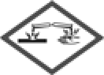

# 104年消防設備士　火災學概要

- 考試名稱：104年專門職業及技術人員高等考試驗船師、引水人、第一次食品技師考試、高等暨普通考試消防設備人員考試、普通考試地政士、專責報關人員、保險代理人保險經紀人及保險公證人考試
- 等別：普通考試
- 類科：消防設備士
- 科目：火災學概要
- 考試時間：1 小時 30 分
- 試卷代號：40210（測驗式試題代號：1402）
- 原卷：`pdf/士/104/0707_火災學概要.pdf`（4 頁）；標準答案：`pdf/士/104/0707_火災學概要_答案.pdf`；更正答案：`pdf/士/104/0707_火災學概要_更正答案.pdf`
- 本卷第 34 題為圖形題（化學品危害圖示），選項圖已自原卷擷取並內嵌於本檔（PNG 檔與本 md 同資料夾）。
- ※注意：可以使用電子計算器，申論題作答須詳列解答過程。
- ⚠️ 法規快照：本卷反映 104 年考試當時之法規，**不可作為現行法源引用**。

---

## 甲、申論題部分（50 分）

> 不必抄題，作答時請將試題題號及答案依照順序寫在申論試卷上，於本試題上作答者，不予計分。請以黑色鋼筆或原子筆在申論試卷上作答。

### 申論第一題（25 分）
> 🏷️ 申論題｜燃燒理論｜計算題

有一耐火構造之倉庫，該倉庫長為 10 公尺、寬為 10 公尺、高為 5 公尺，內部儲存木材總重 200 公斤，木材總表面積為 50 平方公尺，倉庫內有一開口，寬為 5 公尺、高為 1 公尺。試問：該倉庫若發生火災，比較容易成為何種燃燒型態？該倉庫之火載量為何（公斤/平方公尺）？燃燒速率為何（公斤/分鐘）？火災持續時間為何（分鐘）？（已知：重力加速度 g：9.8 公尺/秒平方，空氣密度：1.2 公斤/立方公尺，通風控制燃燒係數 k 為 5.5，燃料控制燃燒係數 k 為 0.4）

### 申論第二題（25 分）
> 🏷️ 申論題

沸溢（boilover）與濺溢（spilover or slopover）是重質油類火災中所常出現的臨界燃燒現象，其出現常造成災害層面擴大，是油類火災中最嚴重的一種行為。試就沸溢與濺溢發生徵兆與發生區別詳細說明。

---

## 乙、測驗題部分（50 分）

> 本測驗試題為單一選擇題，請選出一個正確或最適當的答案，複選作答者，該題不予計分。共 40 題，每題 1.25 分，須用 2B 鉛筆在試卡上依題號清楚劃記。標準答案依考選部公告（見 `pdf/士/104/0707_火災學概要_答案.pdf`）。
>
> ⚠️ 本卷有更正答案：第 14 題一律給分；第 31 題一律給分（見 `pdf/士/104/0707_火災學概要_更正答案.pdf`）。

### 第 1 題

下列何種金屬火災固體滅火藥劑之主要成分為氯化鈉？

- (A) TEC
- (B) Met-L-X
- (C) G-I
- (D) Lith-X

**標準答案：(B)**

> 🏷️ 測驗題｜滅火原理與滅火藥劑

### 第 2 題

下列何種惰性氣體滅火藥劑，其化學組成不含氮？

- (A) IG-01
- (B) IG-541
- (C) IG-55
- (D) IG-100

**標準答案：(A)**

> 🏷️ 測驗題｜滅火原理與滅火藥劑

### 第 3 題

空氣中之濕度，對木材乾濕之變化幅度，年變化較日變化約大多少倍？

- (A) 31
- (B) 26
- (C) 19
- (D) 11

**標準答案：(C)**

> 🏷️ 測驗題

### 第 4 題

斷熱壓縮是氣體的發火源之一，下列敘述何者錯誤？

- (A) 常溫下呈現液狀或溶解狀態 T.N.T.之危險物質中若含有空氣泡者，碰撞時發火之危險性較大
- (B) 假設斷熱壓縮前之體積為 V0、壓力為 P0、溫度為 T0，斷熱壓縮後之體積為 V、壓力為 P、溫度為 T，r = 恆壓比熱 / 恆容比熱，則其間關係為 (T / T0)^r = (P0 / P)^(1-r)
- (C) 硝化甘油中若含有空氣泡（直徑 0.05 mm）者，只要 2 × 10² g / cm 之撞擊能量，始會發火
- (D) 粘液螺縈（Viscose）中常殘留有二硫化碳，只要 2～3 壓縮比即可到達發火點

**標準答案：(C)**

> 🏷️ 測驗題｜燃燒理論｜找錯誤

### 第 5 題

下列有關熱傳導（conduction）之敘述，何者錯誤？

- (A) 為固體內部的熱傳遞方式
- (B) 傳遞方向為由高熱容量傳向低熱容量
- (C) 熱傳導係數會隨溫度而變
- (D) 影響熱厚性（thermally thick）材料之火場行為

**標準答案：(B)**

> 🏷️ 測驗題｜熱傳｜找錯誤

### 第 6 題

依據建築物火災 t² 成長理論 Q = (t/K)²；Q：熱釋放率；t：經過時間，當火災成長常數為 K = 150 sec / MW^(1/2) 時，表示火災成長之速度為下列何者？

- (A) 慢速成長
- (B) 中速成長
- (C) 快速成長
- (D) 極快速成長

**標準答案：(C)**

> 🏷️ 測驗題

### 第 7 題

有關不完全燃燒（incomplete combustion）之敘述，下列何者錯誤？

- (A) 產生較多 CO
- (B) 產生較多煙
- (C) 產生較多 CO₂
- (D) 為擴散火焰（diffusion flame）常伴隨的狀態

**標準答案：(C)**

> 🏷️ 測驗題｜找錯誤

### 第 8 題

熱通量（heat flux）是量化熱傳遞之物理量，熱通量的單位是：

- (A) W / m²
- (B) J / m²
- (C) W
- (D) J

**標準答案：(A)**

> 🏷️ 測驗題｜熱傳

### 第 9 題

有關熱量傳遞中影響熱輻射的因素，下列何者錯誤？

- (A) 依據史蒂芬－波茲曼公式得知，輻射熱量與輻射物體溫度的四次方、輻射物體表面積成正比
- (B) 熱輻射為物體因自身溫度而發射出之一種電磁波，它以光速傳播，其相對應之波長範圍為 0.6～150 μm
- (C) 物體吸收輻射熱的能力與其表面積之輻射度 ε 有關，物體之顏色愈深，表面愈粗糙，吸收的熱量愈高
- (D) 輻射熱量與受輻射物體間之距離平方成反比

**標準答案：(B)**

> 🏷️ 測驗題｜熱傳｜找錯誤

### 第 10 題

建築火災若受通風影響，通風因子為下列何者？（A 為通風口面積、H 為通風口高度、W 為通風口寬度）

- (A) A
- (B) AW
- (C) AH^(1/2)
- (D) AW^(1/2)

**標準答案：(C)**

> 🏷️ 測驗題

### 第 11 題

現行使用甚多之鹵化物滅火藥劑 HFC-227ea，就其化學組成為何？

- (A) CHF₃
- (B) CF₃CF₂
- (C) CF₃CHFCF₃
- (D) CF₂CF₂C (O) CF (CF₃)₂

**標準答案：(C)**

> 🏷️ 測驗題｜滅火原理與滅火藥劑

### 第 12 題

火災發生時煙流的流動方向，受下列何者影響？

- (A) 壓力
- (B) 溫度
- (C) 熱通量
- (D) 荷重

**標準答案：(A)**

> 🏷️ 測驗題｜煙控與煙流、熱傳

### 第 13 題

在長 10 m、寬 8 m、高 3 m 之房間燃燒 400 g 氯丁橡膠，其質量光學密度 Dm = 0.40 m² / g，此時火場中發光避難指標之能見度為多少 m？

- (A) 5.217 m
- (B) 3.253 m
- (C) 2.475 m
- (D) 1.957 m

**標準答案：(A)**

> 🏷️ 測驗題｜煙控與煙流

### 第 14 題

火災發生時毒性氣體之敘述，下列何者錯誤？

- (A) 可以劑量（dose）之概念定量其危害
- (B) CO 為極毒之毒性氣體
- (C) HCN 所造成之危害包括窒息、眼及皮膚灼傷等
- (D) 高分子材料燃燒會產生大量有毒氣體

**標準答案：（一律給分）**

> 🏷️ 測驗題｜滅火原理與滅火藥劑｜找錯誤、更正答案

### 第 15 題

有關防火材料之敘述，下列何者錯誤？

- (A) 防焰材料指具有防止因微小火源而起火或迅速延燒性能的裝修薄材料類或裝飾製品
- (B) 裝修材料在火災初期不易著火延燒，且發熱、發煙及有毒氣體的生成量均有限者，可稱為「耐燃材料」
- (C) 耐火材料是在一定標準火災試驗下，能維持構件或構造耐火穩定性、完整性及隔熱性要求之材料
- (D) 窗簾須通過耐燃材料之檢測

**標準答案：(D)**

> 🏷️ 測驗題｜燃燒理論｜找錯誤

### 第 16 題

閃火點（flash point）、可燃界線（flammability limits）及其相關性之敘述，下列何者錯誤？

- (A) 閃火點為進行液體燃料火災風險分類之參數
- (B) 可燃蒸氣量過多或過少均有可能無法燃燒
- (C) 閃火點對應可燃上限（upper flammability limit）
- (D) 爆燃現象（backdraft）與可燃上限有關

**標準答案：(C)**

> 🏷️ 測驗題｜燃燒理論、爆炸｜找錯誤

### 第 17 題

面積為 10 m² 之居室內有木製家具 20 kg 及布料 40 kg，其中木材及布料之燃燒熱分別為 15、30 MJ / kg，其居室之火載量密度 (MJ / m²) 為何？

- (A) 150
- (B) 1500
- (C) 22.5
- (D) 45

**標準答案：(A)**

> 🏷️ 測驗題｜火災化學與化學計量

### 第 18 題

有關物體引燃（ignition）之敘述，下列何者錯誤？

- (A) 熱傳係數越小，越易引燃
- (B) 密度越小，越易引燃
- (C) 比熱越小，越易引燃
- (D) 熱膨脹係數越小，越易引燃

**標準答案：(D)**

> 🏷️ 測驗題｜熱傳｜找錯誤

### 第 19 題

固體火焰延燒（flame spread）最快之方式為下列何者？

- (A) 向上火焰延燒
- (B) 向下火焰延燒
- (C) 水平火焰延燒
- (D) 斜面火焰延燒

**標準答案：(A)**

> 🏷️ 測驗題

### 第 20 題

有關液體燃料燃燒速率（burning rate）尺度效應之敘述，下列何者正確？

- (A) 與尺度無關
- (B) 尺度在 10 cm 以內時，隨尺度增加而增加
- (C) 尺度在 10～100 cm 時，隨尺度增加而減少
- (D) 尺度在 100 cm 以上時，不隨尺度改變

**標準答案：(D)**

> 🏷️ 測驗題｜找正確

### 第 21 題

有關烴基鋁化物之敘述，下列何者錯誤？

- (A) 可隨意溶於碳化氫系之溶劑中
- (B) 與四氯化碳起激烈反應
- (C) 100℃時易分解，產生金屬鋁、氫及烯族烴
- (D) 與二氧化碳反應，產生醛類或酸

**標準答案：(C)**

> 🏷️ 測驗題｜找錯誤

### 第 22 題

賽璐珞主要成分為 65～75%之硝基纖維素加入樟腦及酒精，提煉後再將酒精蒸發而成，其不溶於何物質？

- (A) 甲苯
- (B) 乙醇
- (C) 丙酮
- (D) 醋酸

**標準答案：(A)**

> 🏷️ 測驗題

### 第 23 題

在長期乾旱的末期，森林含水量約在多少%以下時，有大風時發生的森林大火，是一種十分複雜而又異常可怕的災害現象？

- (A) 15%
- (B) 20%
- (C) 25%
- (D) 30%

**標準答案：(A)**

> 🏷️ 測驗題

### 第 24 題

某一線徑 1.6 m / m 之電線 1 Km 長之電阻值為 8.931 Ω，熱阻抗為 415，若周遭溫度為 25℃，當此電線通過 27 安培時，其芯線溫度（℃）為何？

- (A) 27℃
- (B) 52℃
- (C) 66℃
- (D) 71℃

**標準答案：(B)**

> 🏷️ 測驗題｜電氣火災

### 第 25 題

下列何種電氣火災原因，易於濕度較高場所之電器用具發生？

- (A) 斷路
- (B) 導電
- (C) 半斷線
- (D) 積污導電

**標準答案：(D)**

> 🏷️ 測驗題｜火災調查與鑑識、電氣火災

### 第 26 題

依據日本學者矢島安雄氏等之調查研究結果，有關火災與氣象之影響關係的敘述，下列何者錯誤？

- (A) 愈接近地面處之反象氣層，對減低火勢之延燒力，最為有效
- (B) 風速若超過 13 m / sec 時，上風之延燒速度幾近於零
- (C) 風速若超過 16 m / sec 時，飛火距離與風速成反比
- (D) 風速在 5 m / sec 以下者，其下風之延燒速度約為上風之 4～5 倍，風側之速度較下風稍快，但差別不大

**標準答案：(D)**

> 🏷️ 測驗題｜找錯誤

### 第 27 題

有關閃燃（flashover）現象之敘述，下列何者錯誤？

- (A) 易發生在通風不良的居室，熱容易蓄積
- (B) 是成長期發展至全盛期之短時間現象
- (C) 熱煙層之熱不穩定是導致閃燃之原因
- (D) 火焰竄出門口是觀察指標之一

**標準答案：(A)**

> 🏷️ 測驗題｜煙控與煙流、燃燒理論｜找錯誤

### 第 28 題

有關無塵室火災之敘述，下列何者錯誤？

- (A) 具多種易燃性化學物品，易導致火災
- (B) 通風換氣系統易引導火災煙氣傳播至探測器，提早火災警報動作
- (C) CO₂ 為無塵室常用的滅火藥劑
- (D) 極早型偵煙器（VESDA）可提早偵知火災

**標準答案：(B)**

> 🏷️ 測驗題｜滅火原理與滅火藥劑、特殊場所火災｜找錯誤

### 第 29 題

我國防火材料耐燃性檢測係採用 CNS 14705 圓錐量熱儀法，有關該方法之敘述，下列何者錯誤？

- (A) 原理為量測材料暴露於規定熱通量下之受熱反應情形
- (B) 總熱釋放為分級之基準之一
- (C) 煙產生量為分級之基準之一
- (D) 毒性氣體產生並非分級之基準之一

**標準答案：(C)**

> 🏷️ 測驗題｜熱傳｜找錯誤

### 第 30 題

有關火災與爆炸之相關性，下列何者錯誤？

- (A) 火災可能導致爆炸，爆炸亦可能導致火災
- (B) 火災是化學反應
- (C) 爆炸全是物理反應
- (D) 爆炸之反應速率及危害較火災為高

**標準答案：(C)**

> 🏷️ 測驗題｜爆炸｜找錯誤

### 第 31 題

丙烯 (CH₃OCH₃) 高壓氣體之臨界溫度（℃）與爆炸範圍（%）各為多少？

- (A) 100.4，4.0～44.0
- (B) 126.9，3.4～27.0
- (C) 134.9，1.8～8.4
- (D) 164.5，2.8～14.4

**標準答案：（一律給分）**

> 🏷️ 測驗題｜爆炸｜更正答案

### 第 32 題

有關天然氣與液化石油氣之特性與爆炸，下列敘述何者錯誤？

- (A) 甲烷沸點為 -161℃
- (B) 丁烷爆炸範圍 1.8～8.5%
- (C) 丙烷發火點為 384℃
- (D) 天然氣比重約為空氣的 0.55 倍，液化石油氣比重約為空氣的 1.5 倍

**標準答案：(C)**

> 🏷️ 測驗題｜燃燒理論、爆炸｜找錯誤

### 第 33 題

有關混合危險之敘述，下列何者錯誤？

- (A) 金屬鉀不能和過氧化氫混合運載
- (B) 過氯酸不能和鎂粉混合運載
- (C) 過氯酸鹽類不能和硝酸混合運載
- (D) 赤磷不能和乙醚混合運載

**標準答案：(D)**

> 🏷️ 測驗題｜找錯誤

### 第 34 題

依據國家標準 CNS 15030「化學品分類及標示」，急毒性物質第四級物質會有下列何種化學品危害圖示？

- (A) 
- (B) 
- (C) 
- (D) 

> 選項圖擷取自原卷（`pdf/士/104/0707_火災學概要.pdf` 第 4 頁）。

**標準答案：(B)**

> 🏷️ 測驗題｜圖形題

### 第 35 題

帶電物體為較平滑之金屬導體，而導體與平滑之接地體間隔甚小時，突然發生之放電，此現象稱為：

- (A) 條狀放電
- (B) 火花放電
- (C) 沿面放電
- (D) 電暈放電

**標準答案：(B)**

> 🏷️ 測驗題｜靜電

### 第 36 題

落雷為易造成建築物或森林火災的重要原因之一，有關雷放電的特性，下列敘述何者錯誤？

- (A) 一次放電消耗之電荷，最大者為 200 c 左右
- (B) 直擊避雷針雷電之測定值為 500～10,000 安培
- (C) 雷電壓約為 1 億伏特～10 億伏特之程度
- (D) 一次放電之電力約為 4 kwh～100 kwh

**標準答案：(B)**

> 🏷️ 測驗題｜特殊場所火災、靜電｜找錯誤

### 第 37 題

若電鍋（功率 550 瓦）、熨斗（功率 660 瓦）及電熱器（功率 770 瓦）之插頭同時插在某延長線上，該延長線之容許電流至少需多少安培？（家用電壓 110 伏特）

- (A) 1,980 安培
- (B) 18 安培
- (C) 198 安培
- (D) 110 安培

**標準答案：(B)**

> 🏷️ 測驗題

### 第 38 題

某兒童玩具製造工廠內，因可燃物甚多，該建築物為鋼筋混凝土造，若有一個開口面積為 12 平方公尺、開口高度為 1.44 公尺居室，當其發生火災而形成通風控制燃燒時，根據 P. H. Thomas 之研究結果，在此情形下其換算為木材的燃燒速率為多少公斤 / 分 (Kg/min)？

- (A) 39.6～43.2
- (B) 52.86～57.6
- (C) 79.2～86.4
- (D) 98.3～151.6

**標準答案：(C)**

> 🏷️ 測驗題｜計算題

### 第 39 題

有關液體滅火劑之性質與滅火效果，下列何者正確？

- (A) 依美國防火協會公布的 NFPA 750 資料，可知低壓系統之細水霧滅火系統管系壓力小於或等於 500 psi (34.5 bars)
- (B) 化學泡沫組成中的酸性 B 劑為硫酸鎂
- (C) 空氣泡沫放置於汽油上 30 分鐘後，須殘留 50%以上
- (D) 撲滅酒精類火災，通常在加水分解蛋白質中，加入金屬石鹼之錯鹽，調成液狀，成分為 3%型的耐酒精滅火泡沫

**標準答案：(C)**

> 🏷️ 測驗題｜滅火原理與滅火藥劑｜找正確

### 第 40 題

下列何者非屬聚合而發熱之自然發火物質？

- (A) 醋酸乙烯
- (B) 橡膠基質
- (C) 液化氰
- (D) 五氧化磷

**標準答案：(D)**

> 🏷️ 測驗題｜燃燒理論｜找錯誤

