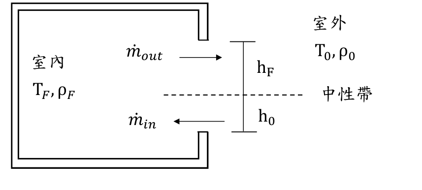

# 114年消防設備師　火災學

- 考試名稱：114年專門職業及技術人員高等考試大地工程技師考試分階段考試（第一階段考試）、驗船師、引水人、第一次食品技師考試、高等暨普通考試消防設備人員考試、普通考試地政士、專責報關人員、保險代理人保險經紀人及保險公證人考試
- 等別：高等考試
- 類科：消防設備師
- 科目：火災學
- 考試時間：2 小時
- 試卷代號：40110
- 原卷：`0801_火災學.pdf`（1 頁，全申論）
- ※注意：可以使用電子計算器。
- ⚠️ 法規快照：本卷反映 114 年考試當時之法規，**不可作為現行法源引用**。

---

## 申論題（共 4 題，每題 25 分）

> 不必抄題，作答時請將試題題號及答案依照順序寫在試卷上，於本試題上作答者，不予計分。請以黑色鋼筆或原子筆在申論試卷上作答。本科目除專門名詞或數理公式外，應使用本國文字作答。

### 第一題（25 分）
> 🏷️ 申論題｜火災化學與化學計量｜計算題

假設某一種重油經檢測後，得知含有碳（C）、氫（H）、硫（S）、氧（O）的重量分別為 85%、8%、4%、3%，於燃燒後 CO₂ 及 CO 測得濃度分別為 10.8% 及 1.2%，當 1 莫耳空氣在室溫及 1 大氣壓下為 22.4 公升時，試問燃燒 1 公斤此重油時所需的理論空氣量為多少（m³）？實際空氣量為多少（m³）？空氣比為多少？

### 第二題（25 分）
> 🏷️ 申論題｜煙控與煙流、區劃空間火災發展｜計算題、圖形題

有一室內空間火災，僅有一開口且開口高度為 H，寬度為 B，流通係數為 C𝑑，火災時室內的溫度及氣體密度分別為 T_F、ρ_F，室外的溫度及空氣密度分別為 T₀、ρ₀，此時中性帶距上下方開口的距離分別為 h_F、h₀（如圖，H＝h_F＋h₀），則此時分別在距離中性帶的上方及下方開口 y 處，理論上流出與流入氣體速度為何？此一空間流出（ṁ_out）與流入（ṁ_in）氣體的質量流率為何？當流入空氣與流出氣體質量幾近相等時，h₀ 與 H 的關係式為何？

> 〔圖：擷取自原卷 0801_火災學.pdf 第 1 頁，單一開口室內火災中性帶示意圖——室內標示 T_F、ρ_F，室外標示 T₀、ρ₀；開口上方流出 ṁ_out（中性帶以上高度 h_F），下方流入 ṁ_in（中性帶以下高度 h₀）〕

### 第三題（25 分）
> 🏷️ 申論題｜爆炸

請說明可燃氣體的分解爆炸與天然氣爆炸有何不同？氣體乙炔（C₂H₂）及環氧乙烷（C₂H₄O）的分解反應式為何？防止此二種氣體分解爆炸的方法為何？

### 第四題（25 分）
> 🏷️ 申論題｜滅火原理與滅火藥劑

請說明液體滅火劑中，化學泡沫和機械泡沫的組成及兩者差異為何？
