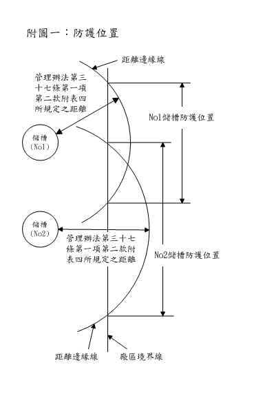
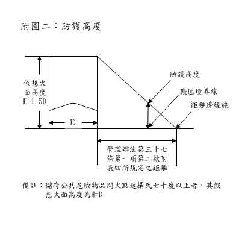
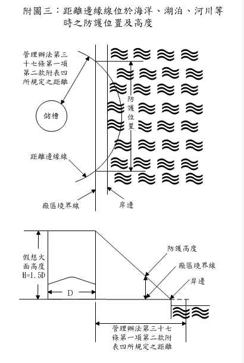
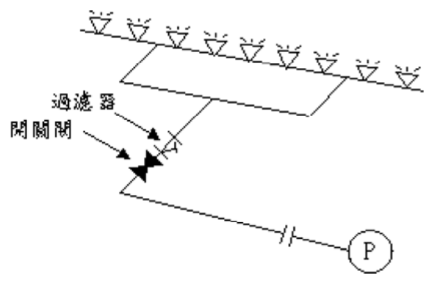
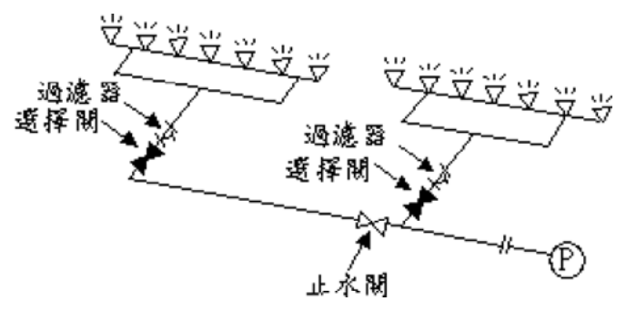
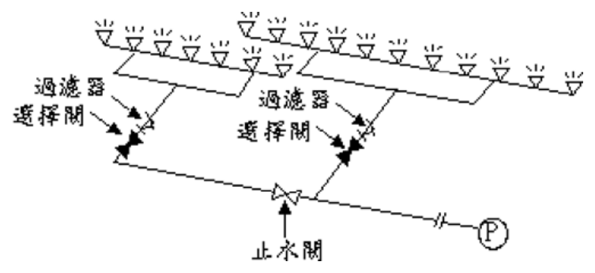

# 防火牆及防火水幕設置基準

> 來源：內政部消防署消防法令查詢系統（使用者上傳 HTML 轉換）｜版本日期：民國 95 年 12 月 11 日（修正）
>
> ⚠️ **法規快照**：本檔為入庫當下之版本，引用前請依 index.md「法規時效」核對官方現行版本。
>
> 📌 **免責聲明**：本檔由官方來源轉換與人工整理，可能有轉換或辨識誤差。**一切以主管機關（全國法規資料庫、內政部消防署）公告之現行版本為準**；如有疑義，以官方公告為主。後續 AI 代理人引用本檔時應主動提醒使用者此點，並於必要時自行上網查證正確版本。

## 第 一 點

為規範公共危險物品及可燃性高壓氣體設置標準暨安全管理辦法（以下簡稱管理辦法）第三十七條第二款第一目及第三目所定防火牆及防火水幕之設置基準，特訂定本基準。

## 第 二 點

假想火面高度為將儲槽水平剖面最大直徑乘以下表所列之數值。

| 公共危險物品之閃火點 | 數值 |
| --- | --- |
| 未達攝氏七十度 | 1.5 |
| 達攝氏七十度以上 | 1.0 |

## 第 三 點

防火牆及防火水幕設置位置為自儲槽側板外壁起，以管理辦法第三十七條第一項第二款附表四所規定距離之邊緣線（以下簡稱距離邊緣線）與廠區境界線交點之間（如附圖一）。

附圖一　防護位置（原始檔：[附圖一防護位置.jpg](原始檔案/防火牆及防火水幕設置基準/附圖一防護位置.jpg)）

## 第 四 點

防火牆及防火水幕防護高度為儲槽側板外壁假想火面與距離邊緣線所成連線，和地面廠區境界線所延伸垂線交點之垂直高度（如附圖二）；如距離邊緣線位於海洋、湖泊、河川等時，其防護高度則為自儲槽側板外壁假想火面與其岸邊所成連線，和地面廠區境界線所延伸垂線交點之垂直高度（如附圖三）。但防護高度未滿二公尺者，以二公尺計算。

附圖二　防護高度（原始檔：[附圖二防護高度.jpg](原始檔案/防火牆及防火水幕設置基準/附圖二防護高度.jpg)）

附圖三　距離邊緣線位於海洋、湖泊、河川等時之防護位置及防護高度（原始檔：[附圖三距離邊緣線位於海洋、湖泊、河川等時之防護位置及（略）.jpg](原始檔案/防火牆及防火水幕設置基準/附圖三距離邊緣線位於海洋、湖泊、河川等時之防護位置及（略）.jpg)）

## 第 五 點

防火水幕之防護高度在十公尺以下時，其每公尺水幕長度放水量應在每分鐘一百公升以上；其防護高度超過十公尺者，高度每增加一公尺，放水量每分鐘應增加十公升。

## 第 六 點

沿防火水幕設有能以仰角八十五度以上放水之固定式放水槍，且符合下列規定者，其防護高度超過二十五公尺者，以二十五公尺計算。

（一）放水槍與防護位置平行，且左右角度範圍在四十五度以上，其放水高度應高於防護高度。但該高度超過四十公尺者，以四十公尺計算。

（二）放水槍之出水量每分鐘一千五百公升以上。

（三）放水槍之設置應能有效防護防火水幕設置位置。

（四）前項放水槍防護範圍指放水槍放水時所形成放水圓弧與地面二十五公尺高度處延伸線之兩交點間。

## 第 七 點

防火水幕配管之設置應符合下列規定：

（一）應為專用。

（二）應符合國家標準六四四五、四六二六或具同等以上強度、耐腐蝕性及耐熱性者。乾式配管部分應施予鍍鋅等防腐蝕處理。

（三）管徑應依水力計算配置。

（四）應裝置於不受外來損傷及火災不易殃及之位置。

（五）配管管系竣工時，應做加壓試驗，試驗壓力為加壓送水裝置全閉揚程一點五倍以上之水壓，須持續兩小時無漏水現象。

（六）防火水幕設備僅防護一個儲槽者（即單一水幕設備），其配管應設置過濾器及開關閥，配置方式如附圖四。防火水幕設備防護二個以上儲槽者（即同系列水幕設備），其配管應設置過濾器、選擇閥及止水閥；其防護位置相鄰時，配置方式如附圖五；其防護位置重疊時，配置方式如附圖六。

附圖四　單一水幕設備（截自原始 PDF 內容區：[附圖四單一水幕設備.pdf](原始檔案/防火牆及防火水幕設置基準/附圖四單一水幕設備.pdf)）

附圖五　同系列水幕設備（防護位置相臨時）（截自原始 PDF 內容區：[附圖五同系列水幕設備（防護位置相臨時）.pdf](原始檔案/防火牆及防火水幕設置基準/附圖五同系列水幕設備（防護位置相臨時）.pdf)）

附圖六　同系列水幕設備（防護位置重疊時）（截自原始 PDF 內容區：[附圖六同系列水幕設備（防護位置重疊時）.pdf](原始檔案/防火牆及防火水幕設置基準/附圖六同系列水幕設備（防護位置重疊時）.pdf)）

（七）防火水幕設備之配管平時應充滿水。但自開關閥或選擇閥以下至防火水幕噴頭之配管，不在此限。

（八）配管應設於地面上。但其接合部分及閥類設有可供檢查、維修之措施者，不在此限。

（九）開關閥及選擇閥應設於儲槽發生火災時得以接近之位置。

（十）開關閥及選擇閥附近配管應標示防護儲槽編號。

## 第 八 點

防火水幕設備之水源應連結加壓送水裝置，並符合下列規定：

（一）加壓送水裝置應採用消防幫浦。

（二）應為專用。但與其他消防設備並用，無妨礙其他設備之性能時，不在此限。

（三）應連接緊急電源。但加壓送水裝置之驅動系統為引擎或渦輪機者，免設緊急電源。

（四）應設在便於檢修，且無受火災等災害損害之處。

（五）加壓送水裝置啟動後六分鐘內應能形成水幕。

（六）加壓送水裝置之幫浦全揚程不得小於下列計算值：

$$H = h_1 + h_2 + h_3$$

$H$：幫浦全揚程（單位：m）

$h_1$：將噴頭設計壓力換算成水頭之值（單位：m）

$h_2$：配管摩擦損失水頭（單位：m）

$h_3$：落差（單位：m）

## 第 九 點

防火水幕設備之緊急電源，應使用發電機設備、蓄電池設備或具有相同效果之引擎動力系統，其供電容量時間應符合下列規定：

（一）儲槽容量未達一萬公秉者為一百八十分鐘。

（二）儲槽容量達一萬公秉以上者為三百六十分鐘。

## 第 十 點

防火水幕設備之水源容量應符合下列規定：

（一）儲槽容量未達一萬公秉者，不得小於防護該儲槽連續放水一百二十分鐘之水量；儲槽容量達一萬公秉以上者，不得小於防護該儲槽連續放水二百四十分鐘之水量。

（二）消防用水與普通用水合併使用者，應採取必要措施，確保前款水源容量，在有效水量範圍內。

（三）第一款之水源得與其他滅火設備水源併設。但其總容量不得小於防護同一儲槽各滅火設備應設水量之合計。

## 第 十一 點

防火水幕設備之緊急電源、消防幫浦加壓送水裝置及配管摩擦損失等，本基準未規定者，準用「緊急電源容量計算基準」及「消防幫浦加壓送水裝置等及配管摩擦損失計算基準」之規定。
