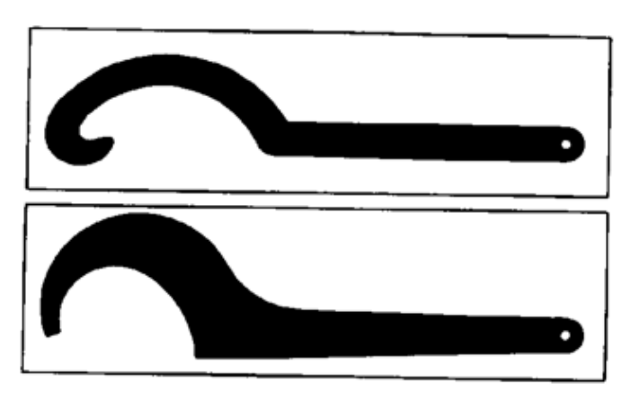
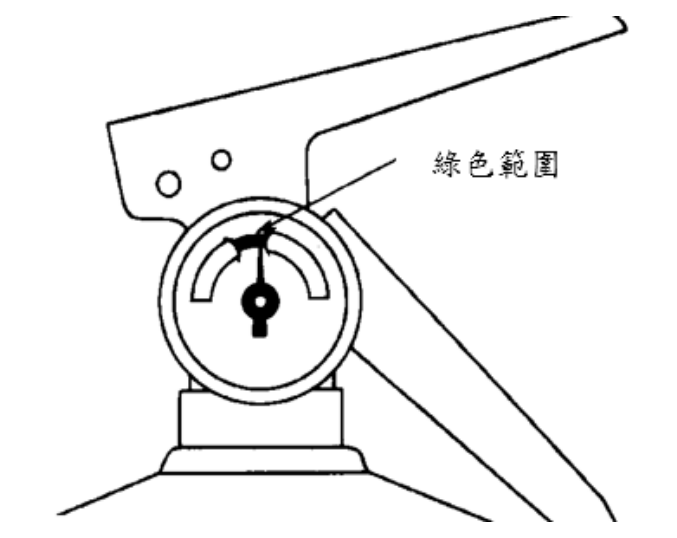
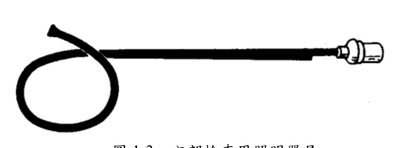
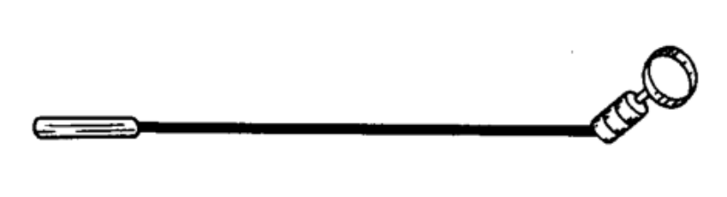
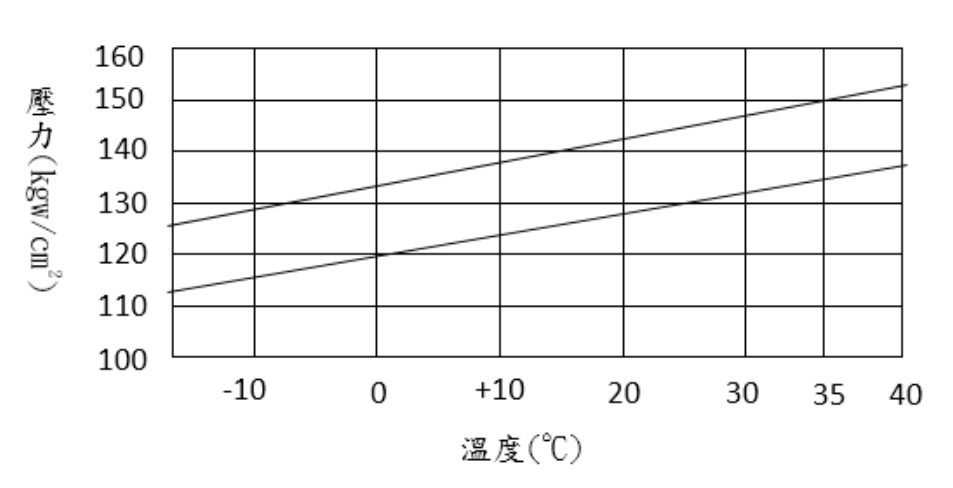
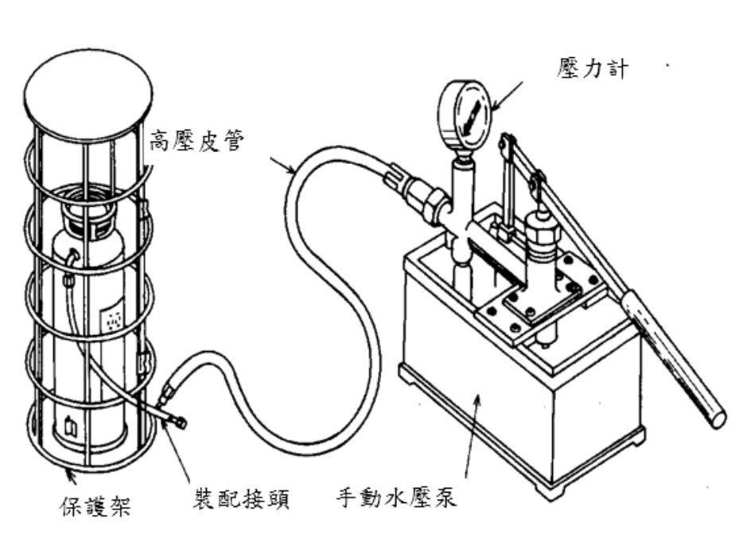
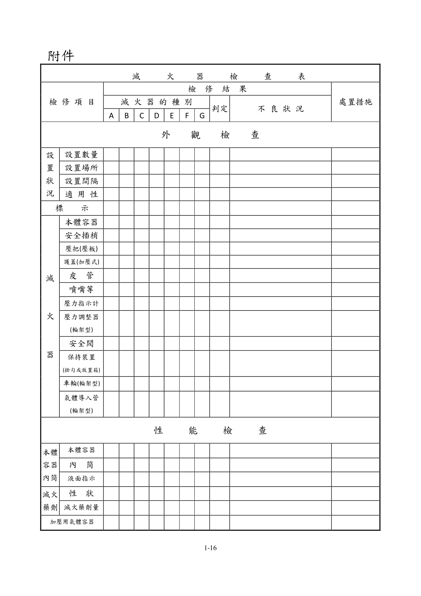
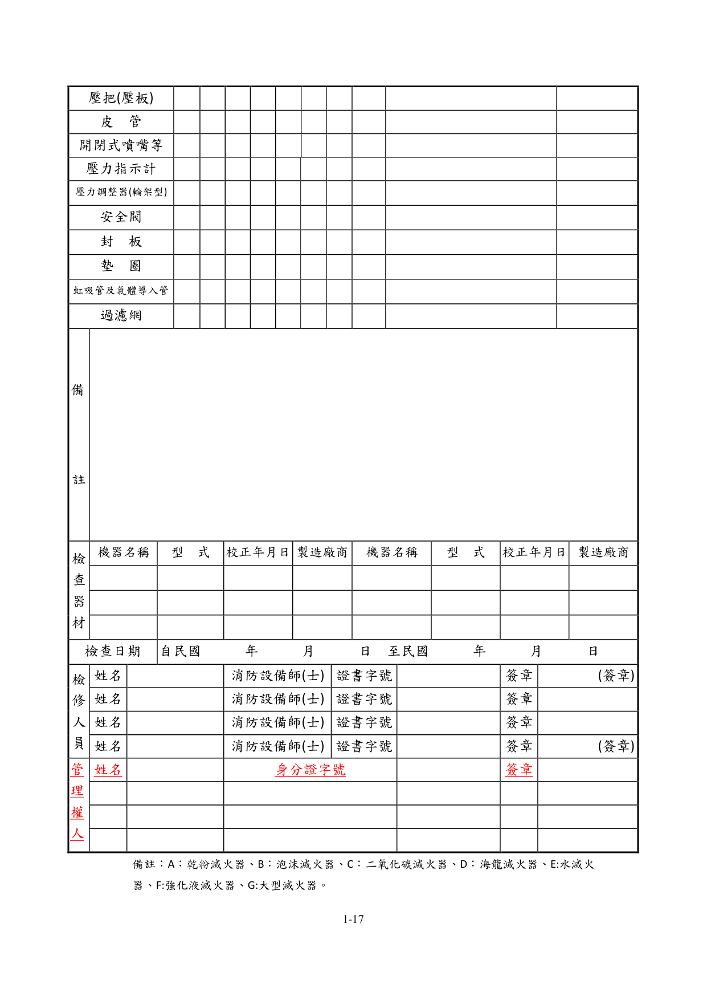
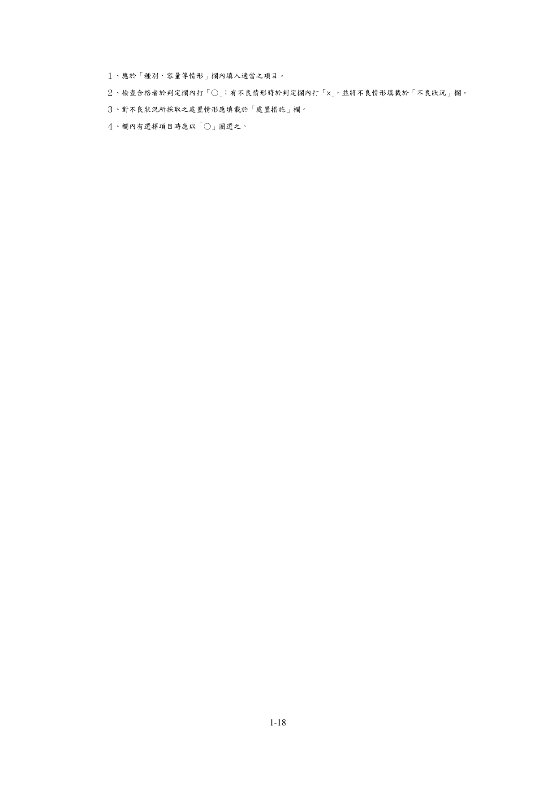

# 消防安全設備及必要檢修項目檢修基準　第一章　滅火器

> 版本日期：民國 114 年 1 月 9 日（修正）｜來源：內政部主管法規共用系統（glrs.moi.gov.tw，GL001285）PDF 轉換。114-01-09 修正六章：第一、九、十三、十七、十九、二十七章（其中第一、九、十九章之修正內容在檢修報告表／檢查表與附圖）。
>
> 📌 **免責聲明**：本檔由官方來源轉換與人工整理，可能有轉換或辨識誤差。**一切以主管機關（全國法規資料庫、內政部消防署）公告之現行版本為準**；如有疑義，以官方公告為主。後續 AI 代理人引用本檔時應主動提醒使用者此點，並於必要時自行上網查證正確版本。
>
> 🛈 表格與表單已依原始 PDF 線框以 `scripts/pdf_tables_extract.py` 重新辨識為結構化內容（issue #41）：編號附表為 Markdown 表格或逐列樹狀展開；章末檢修報告表／檢查表**不辨識文字**，改以原始 PDF 頁面截圖（PNG）嵌入；內文附圖與表內圖示亦以 PDF 截圖嵌入（圖檔與本檔同資料夾、檔名前綴同本檔）。表格數值／○×標記可能有辨識誤差，關鍵判斷請核對原始 PDF。
>
> 📎 原始 PDF（全文，114-01-09 版）：[消防安全設備及必要檢修項目檢修基準.PDF](../附件/消防安全設備及必要檢修項目檢修基準/消防安全設備及必要檢修項目檢修基準.pdf)

一、一般注意事項

（一）應無性能上之障礙，如有污垢，應以撢子或其它適當工具清理。

（二）合成樹脂製容器或構件，不得以辛那（二甲苯）或汽油等有機溶劑加以清理。

（三）開啟護蓋或栓塞時，應注意容器內殘壓，須排出容器內殘壓後，始得開啟。

（四）護蓋之開關，應使用適當之拆卸扳手（如附圖 1-1），不得以鐵鎚或以鑿刀敲擊。

（五）乾粉藥劑極易因受潮而影響滅火之動作及效能，滅火器本體容器內壁及構件之清理及保養時，應充分注意。

（六）除二氧化碳及鹵化物滅火器之重量檢查或確認壓力指示計之指針位置等性能檢查外，各類型滅火器之性能檢查(包括檢查結果有不良狀況之處置措施，諸如藥劑更換充填、加壓用氣體容器之氣體充填)，應由專業廠商專任之消防專技人員為之。

圖 1-1   拆卸扳手

（七）進行檢查保養，滅火器自原設置位置移開時，應暫時以其他滅火器替代之。

（八）性能檢查完成後之滅火器應依表 1-1 格式張貼標示，且該標示不得覆蓋、換貼或變更原新品出廠時之標示，並於滅火器瓶頸加裝檢修環，檢修環上應標註年份，材質以ㄧ體成型之硬質無縫塑膠、壓克力或鐵環製作，且尺寸以非經拆卸滅火器無法取出或直接以內徑不得大於滅火器瓶口 1mm 方式辦理，以顏色紅、橙、黃、綠、藍交替更換，自一百十年度起開始使用紅色檢修環，後續依年度別依序採用橙色(一百十一年度)、黃色(一百十二年度)、綠色(一百十三年度)、藍色(一百十四年度)之檢修環，依此類推，標準色系如下:

紅   橙       黃   綠   藍

表 1-1　滅火器性能檢查及藥劑更換充填標示（標示尺寸約 16.2cm × 11cm；欄位如下，填寫欄從略）

- 滅火器設置場所名稱／場所地址
- 廠商名稱／廠商證書號碼
- 消防專技人員姓名：○○○（消○證字第　號）；地址／電話
- 品名：□乾粉滅火器 □水滅火器 □二氧化碳滅火器 □機械泡沫滅火器 □強化液滅火器 □鹵化物滅火器
- 規格：□5型 □10型 □20型 □其他
- 製造日期／流水編號
- 性能檢查日期：　年　月　日
- 檢查情形：□檢查合格（無需更換藥劑） □更換藥劑後合格；□水壓測試合格（10 年以上或無法辨識日期滅火器）
- 下次性能檢查日期：　年　月　日
- 委託服務廠商：名稱／電話

二、外觀檢查

（一）設置狀況

１、設置數量（核算最低滅火效能值）

（１）檢查方法以目視確認之。

（２）判定方法應依規定核算其最低滅火效能值。

２、設置場所

（１）檢查方法

以目視或簡易之測定方法確認之。

（２）判定方法

A.應無造成通行或避難上之障礙。

B.應固定放置於取用方便之明顯處所。

C.滅火器本體上端與樓地板面之距離，十八公斤以上者不得超過一公尺，未滿十八公斤者不得超過一•五公尺。

D.應設置於滅火器上標示使用溫度範圍內之處所，如設置於使用溫度範圍外之處所時，應採取適當之保溫措施。

E.容易對本體容器或其構件造成腐蝕之設置場所（如化工廠、電鍍廠、溫泉區）、濕氣較重之處所（如廚房等）或易遭海風、雨水侵襲之設置場所，應採取適當之保護措施。

３、設置間距

（１）檢查方法以目視或簡易之測定方法確認之。

（２）判定方法

A.設有滅火器之樓層或場所，自樓面居室任一點或防護對象任一點至滅火器之步行距離不得超過二十公尺。但公共危險物品等場所與第一種、第二種、第三種或第四種滅火設備併設者，不在此限。

B.公共危險物品等場所達顯著滅火困難、一般滅火困難者設置之第四種滅火設備（大型滅火器），距防護對象任一點之步行距離，應在三十公尺以下。但與第一種、第二種或第三種滅火設備併設者，不在此限。

C.設有滅火器之可燃性高壓氣體儲存場所，任一點至滅火器之步行距離應在十五公尺以下，並不得妨礙出入作業。

４、適用性

（１）檢查方法以目視確認滅火器設置種類是否適當。

（２）判定方法設置之滅火器應符合現場需求。

（二）標示

１、標示

（１）檢查方法以目視確認之。

（２）判定方法

A.應無超過有效使用期限。

B.應依規定張貼標示銘牌。

（３）注意事項

A.已超過有效使用期限或未附銘牌者，得不須再施以性能檢查，即可予更換新品。

B.滅火器應於其設置場所之明顯處所，標明「滅火器」之字樣。

（三）滅火器

１、本體容器

（１）檢查方法以目視確認有無變形、腐蝕之情形。

（２）判定方法應無滅火藥劑洩漏、顯著之變形、損傷及腐蝕等情形。

（３）注意事項

A.如發現熔接部位受損或容器顯著變形時，因恐對滅火器之性能造成障礙，應即予汰換。

B.如發現有顯著之腐蝕情形時，應即予汰換。

C.如發現鐵鏽似有剝離現象者，應即予汰換。

D.如有 A 至 C 之情形時，得不須再施以性能檢查，即可予汰換。

２、安全插梢

（１）檢查方法以目視確認有無變形、損傷之情形。

（２）判定方法

A.安全裝置應無脫落。

B.應無妨礙操作之變形或損傷。

（３）注意事項如發現該裝置有產生妨礙操作之變形或損傷時，應加以修復或更新。

３、壓把（壓板）

（１）檢查方法以目視確認有無變形、損傷之情形。

（２）判定方法應無變形、損傷，且確實裝置於容器上。

（３）注意事項如發現該裝置有產生妨礙操作之變形、損傷時，應加以修理或更新。

４、護蓋

（１）檢查方法以目視及用手旋緊之動作，確認有無變形、鬆動之現象。

（２）判定方法

A.應無強度上障礙之變形、損傷。

B.應與本體容器緊密接合。

（３）注意事項

A.如發現有強度上障礙之變形、損傷者，應即加以更新。

B.護蓋有鬆動者，應即重新予以旋緊。

５、皮管

（１）檢查方法以目視及用手旋緊之動作，確認有無變形或鬆動之現象。

（２）判定方法

A.應無變形、損傷或老化之現象，且內部應無阻塞。

B.應與本體容器緊密接合。

（３）注意事項

A.如發現有顯著之變形、損傷或老化者，應即予以更新。

B.如有阻塞者，應即實施性能檢查。

C.皮管裝接部位如有鬆動，應即重新旋緊。

６、噴嘴、喇叭噴管及噴嘴栓

（１）檢查方法以目視及用手旋緊之動作，確認有無變形、鬆動之現象。

（２）判定方法

A.應無變形、損傷或老化之現象，且內部應無阻塞。

B.應與噴射皮管緊密接合。

C.噴嘴栓應無脫落之現象。

D.喇叭噴管握把（僅限二氧化碳滅火器）應無脫落之現象。

（３）注意事項

A.如發現有顯著之變形、損傷或老化者，應即予以更新。

B.螺牙接頭鬆動時，應即予旋緊；噴嘴栓脫落者，應重新加以裝配。

C.喇叭噴管握把脫落者，應即予以修復。

７、壓力指示計

（１）檢查方法以目視確認有無變形、損傷之現象。

（２）判定方法

A.應無變形、損傷之現象。

B.壓力指示值應依圖 1-2 定，在綠色範圍內。

（３）注意事項如發現有性能上障礙之變形、損傷者，應即加以更新。

圖 1-2 蓄壓式滅火器之壓力表

８、壓力調整器（限大型加壓式滅火器）

（１）檢查方法以目視確認有無變形、損傷之現象。

（２）判定方法應無變形、損傷之現象。

（３）注意事項如發現有變形、損傷者，應即加以修復或更新。

９、安全閥

（１）檢查方法以目視及用手旋緊之動作，確認有無變形、鬆動之現象。

（２）判定方法

A.應無變形、損傷之現象。

B.應緊密裝接在滅火器上。

（３）注意事項如發現有顯著之變形、損傷者，應即予以更新。

１０、保持裝置

（１）檢查方法

A.以目視確認有無變形、腐蝕之現象。

B.確認是否可輕易取用。

（２）判定方法

A.應無變形、損傷或顯著腐蝕之現象。

B.可方便取用。

（３）注意事項如發現有變形、損傷或顯著腐蝕現象者，應即加以修復或更新。

１１、車輪（限大型滅火器）

（１）檢查方法

A.以目視確認其是否有變形、損傷之現象。

B.以手實地操作，確認是否可圓滑轉動。

（２）判定方法

A.應無變形、損傷之現象。

B.應可圓滑轉動。

（３）注意事項

A.如發現有變形、損傷或無法圓滑轉動者，應即加以修復。

B.檢查時，應先加黃油（或潤滑油），以使其能圓滑滾動。

１２、氣體導入管（限大型滅火器）

（１）檢查方法以目視及用手旋緊之動作，確認有無變形、鬆動之現象。

（２）判定方法

A.應無變形、損傷之現象。

B.應緊密裝接在滅火器上。

（３）注意事項如發現有彎折、壓扁等之變形、損傷者，應即予以更新。

（４）裝接部位如有鬆動者，應即重新裝配。

三、性能檢查

（一）檢查抽樣

１、檢查頻率依滅火器種類，化學泡沫滅火器應每年實施一次性能檢查，其餘類型滅火器應每三年實施一次性能檢查，並依表 1-2 之規定進行。

２、檢查結果之判定

（１）未發現缺點時滅火器視為良好。

（２）發現有缺點時依據性能檢查各項規定，發現有缺點之滅火器應即進行檢修或更新。泡沫滅火藥劑因經較長時間後會產生變化，應依滅火器銘板上所標示之時間或依製造商之使用規範，定期加以更換。其餘類型滅火器之滅火藥劑若無固化結塊、異物、沉澱物、變色、污濁或異臭者等情形，滅火藥劑可繼續使用。

表 1-2　檢查試樣個數表

| 種類 | 加壓方式 | 對象 | 性能檢查項目 |
|---|---|---|---|
| 水 | 加壓式 | 自製造年份起超過三年以上者 | 全數 |
| 水 | 蓄壓式 | 自製造年份起超過三年以上者 | 全數 |
| 強化液 | 加壓式 | 自製造年份起超過三年以上者 | 全數 |
| 強化液 | 蓄壓式 | 自製造年份起超過三年以上者 | 全數 |
| 化學泡 | 加壓式 | 設置達一年以上者 | 全數 |
| 機械泡 | 加壓式 | 自製造年份起超過三年以上者 | 全數 |
| 機械泡 | 蓄壓式 | 自製造年份起超過三年以上者 | 全數 |
| 鹵化物 | ─ | 自製造年份起超過三年以上者 | 如重量及指示壓力值無異常時，其它項目可予省略 |
| 二氧化碳 | ─ | 自製造年份起超過三年以上者 | 如重量及指示壓力值無異常時，其它項目可予省略 |
| 乾粉 | 加壓式 | 自製造年份起超過三年以上者 | 全數 |
| 乾粉 | 蓄壓式 | 自製造年份起超過三年以上者 | 全數 |
| 全部之滅火器 | ─ | 如經外觀檢查有缺點者，須進行性能檢查 | 全數 |

備註：製造日期超過十年或無法辨識製造日期之水滅火器、機械泡沫滅火器或乾粉滅火器，非經水壓測試合格，不得再行更換及充填藥劑，應予報廢。

（二）各加壓方式檢查之順序

１、化學反應式滅火器檢查順序

（１）打開護蓋，取出內筒、支撐架及活動蓋。

（２）確認滅火藥劑量是否達到液面標示之定量位置。

（３）將滅火藥劑取出，移置到另一容器內。

（４）本體容器內外、護蓋、噴射皮管、噴嘴、虹吸管、內筒及支撐架等用清水洗滌。

（５）確認各部構件。

２、加壓式滅火器檢查順序

（１）滅火藥劑量以重量表示者，應以磅秤確認滅火藥劑之總重量。

（２）有排氣閥者，應先將其打開，使容器內壓完全排出。

（３）卸下護蓋，取出加壓用氣體容器之支撐裝置及加壓用氣體容器。

（４）滅火藥劑量以容量表示者，確認藥劑量是否達到液面標示之定量位置。

（５）將滅火藥劑取出，移置到另一容器內。

（６）清理

A.水系的滅火器，本體容器內外、護蓋、噴射皮管、噴嘴、虹吸管等應使用清水洗滌。

B.鹵化物滅火器或乾粉滅火器，屬嚴禁水分之物質，應以乾燥之壓縮空氣，對本體容器內外、護蓋、噴射皮管、噴嘴、虹吸管進行清理。

（７）確認各構件。

３、蓄壓式滅火器

（１）檢查順序

A.秤重以確認其滅火藥劑量。

B.確認壓力指示計之指針位置。

C.有排氣閥者，應先將其打開，無排氣閥者，應將其倒置，按下壓把，使容器內壓完全排出。（二氧化碳滅火器及海龍滅火器除外）

D.自容器本體將護蓋或栓塞取下。

E.將滅火藥劑取出，移置到另一容器內。

F.依前項加壓式之清理要領，對本體容器內外、護蓋、噴射皮管、噴嘴、虹吸管進行清理。

G.確認各構件。

（２）注意事項對二氧化碳滅火器及海龍滅火器進行重量檢查時，如失重超過10％以上或壓力表示值在綠色範圍外時，應予以更新。

（三）本體容器及內筒

１、檢查方法

（１）本體容器將內部檢視用照明器具如（圖 1-3）插入本體容器內部，並對內部角落不易檢視之部位，使用反射鏡（圖 1-4）檢查，以確認其有無腐蝕之情形。

圖 1-3 內部檢查用照明器具

圖 1-4 反射鏡

（２）內筒及活動板以目視確認化學泡泡沫滅火器之內筒、內筒蓋板，有無變形。

（３）液面標示以目視確認有無因腐蝕致標示不明確。

２、判定方法

（１）應無顯著之腐蝕或內壁塗膜剝離之情形。

（２）應無變形、損傷之情形。

（３）液面表示應明確。

３、注意事項如發現本體容器內壁有顯著腐蝕或內壁塗膜剝離者，應即汰換。

（四）滅火藥劑

１、檢查方法

（１）性狀

A.乾粉滅火藥劑應個別放入塑膠袋等及防止其有飛揚情形，以確認有無固化之情形。

B.泡沫滅火藥劑，應個別取出至塑膠桶等，以確認有無異常之情形。

（２）滅火藥劑量以液面標示表示藥劑量者，在取出藥劑前，應先確認有無達液面水平線；如以重量表示者，應秤其重量，以確認有無達定量。

２、判定方法

（１）應無固化之現象

（２）應無變色、腐敗、沈澱或污損之現象。

（３）重量應在規定量（如表 1-3）之容許範圍內。

３、注意事項

（１）有固化結塊者應予更換。

（２）有異物、沉澱物、變色、污濁或異臭者應予更換。

（３）與液面標示明顯不符者，如為化學泡沫滅火藥劑，應予全部更換。

（４）供補充或更換之滅火藥劑應使用銘板上所標示之滅火藥劑。

（５）泡沫滅火藥劑因經較長時間後會產生變化，故應依滅火器銘板上所標示之時間或依製造商之使用規範，定期加以更換。

（６）二氧化碳滅火器及鹵化物滅火器，經依前述（二）檢查發現無任

何異常現象者，其滅火藥劑之試驗可予省略。

（７）新更換及充填之滅火藥劑應為經內政部登錄機構認可之產品，於充填完成時其噴射性能須能噴射所充填滅火藥劑容量或重量90%以上之量，而使用期限內噴射性能須能噴射所充填滅火藥劑容量或重量 80%以上之量，且滅火藥劑主成分應符合滅火器用滅火藥劑認可基準規定；二氧化碳滅火器所充之滅火藥劑，應採一般工業用之液體二氧化碳，純度應為 99%以上，並有相關證明文件。

（８）滅火藥劑充填量及灌充壓力應符合滅火器認可基準規定。

（９）高壓氣體灌充作業需符合高壓氣體相關法令規定；灌充後之滅火器本體容器，應符合滅火器認可基準之氣密試驗。

表 1-3 總重量容許範圍

| 藥劑標示重量 | 總重量容許範圍 |
|---|---|
| 1㎏未滿 | ＋100g～－80g |
| 1㎏以上 2㎏未滿 | ＋200g～－80g |
| 2㎏以上 5㎏未滿 | ＋300g～－100g |
| 5㎏以上 8㎏未滿 | ＋400g～－200g |
| 8㎏以上 10㎏未滿 | ＋500g～－300g |
| 10㎏以上 20㎏未滿 | ＋700g～－400g |
| 20㎏以上 40㎏未滿 | ＋1,000g～－600g |
| 40㎏以上 100㎏未滿 | ＋1,600g～－800g |
| 100㎏以上 | ＋2,400g～－1,000g |

（五）加壓用氣體容器

１、檢查方法

（１）以目視確認有無變形、腐蝕，及其封板有無損傷。

（２）如為二氧化碳，應以磅秤測定其總重量，如為氮氣，應測定其內壓，以確認有無異常之情形。

２、判定方法

（１）應無變形、損傷或顯著之腐蝕現象。

（２）封板應無損傷之情形。

（３）二氧化碳應在表 1-4 所示之容許範圍，氮氣應在圖 1-5 壓力之容許範圍內。

表 1-4   重量容許範圍

| 充填量 | 容許範圍 |
|---|---|
| 5g以上 10g未滿 | ±1g |
| 10g以上 20g未滿 | ±3g |
| 20g以上 50g未滿 | ±5g |
| 50g以上 200g未滿 | ±10g |
| 200g以上 500g未滿 | ±20g |
| 500g以上 | ±30g |

圖 1-5 氮氣壓力之容許範圍

３、注意事項

（１）二氧化碳之重量如超過容許範圍者，應以同型之加壓用氣體容器予以更換。

（２）氮氣氣體如超過規定壓力之容許範圍者，應加以調整或再行充填。

（３）裝接螺牙接頭計有順時針及逆時針兩種方式，裝配時應注意。

（六）壓把（壓板）

１、檢查方法確認加壓用氣體容器已取下後，經由壓板及握把之操作，以確認動作狀況是否正常。

２、判定方法

（１）應無變形、損傷。

（２）應能順暢、確實地正常動作。

３、注意事項

（１）如發現有變形、損傷者，應即修復或予以更換。

（２）無法順暢確實動作者，應予修復或更換。

（七）皮管

１、檢查方法將噴射皮管取下，確認其有無阻塞之情形。

２、判定方法皮管與皮管接頭應無阻塞之情形。

３、注意事項如發現有阻塞時，應即加以清除。

（八）開閉式噴嘴及切換式噴嘴

１、檢查方法操作握把以確認噴嘴之開、關及切換是否可輕易操作。

２、判定方法應能順暢、確實動作。

３、注意事項無法順暢、確實動作者，應予修復或更換。

（九）壓力指示計

１、檢查方法排出容器內壓時，壓力指針是否能正常動作。

２、判定方法壓力指針之動作應正常。

３、注意事項壓力指針無法正常動作者，應予更換。

（十）壓力調整器

１、檢查方法應依下列規定加以確認：

（１）關閉滅火器本體容器連接閥門。

（２）打開加壓用氣體容氣閥，確認壓力計之指度及指針之動作情形。

（３）關閉加壓用氣體容器閥，確認高壓側（一次測）之壓力表指度是否下降，如有下降，應確認其氣體洩漏之部位。

（４）鬆開調整器之排氣閥或氣體導入管之結合部，將氣體放出，再恢復為原來狀態。

２、判定方法

（１）壓力指針之動作應正常。

（２）調整壓力值應在綠色範圍內。

３、注意事項壓力指針無法正常動作或調整壓力值在綠色範圍外者，應予修復或更換。

（十一）安全閥

１、檢查方法

（１）以目視確認安全閥有無變形、阻塞之情形。

（２）有排氣閥者，確認操作排氣閥後，動作有無障礙。

（３）彈簧式安全閥，應依圖 1-6 所示，將皮管裝接於水壓試驗機，加水壓後，確認其動作壓力是否正常。

２、判定方法

（１）應無變形、損傷或阻塞之情形。

（２）應能確實動作。

（３）動作壓力應為規定值。

圖 1-6 水壓試驗機及保護架

３、注意事項

（１）有顯著之變形、損傷者，應予更換。

（２）有阻塞者，應加以清除。

（３）未確實動作或未依銘板所標示之動作壓力範圍內動作者，應予以修復。

（十二）封板及墊圈

１、防止乾粉上昇封板

（１）檢查方法以目視確認有無變形、損傷，及是否確實裝設於滅火器上。

（２）判定方法

A.應無變形、損傷之情形。

B.應確實裝設於滅火器上。

（３）注意事項

A.如發現有變形或損傷者，應予更換。

B.裝置不確實者，應再確實安裝。

２、墊圈

（１）檢查方法以目視確認有無變形、損傷或老化之現象。

（２）判定方法應無變形、損傷或老化之情形。

（３）注意事項如發現有變形、損傷或老化者，應予更換。

（十三）虹吸管及氣體導入管

１、檢查方法以目視或通氣方式確認。

２、判定方法

（１）應無變形、損傷或阻塞之情形。

（２）裝接部位應無鬆動之情形。

３、注意事項

（１）如發現有變形、損傷者，應即修復或予以更換。

（２）如發現有阻塞者，應加以清除。

（３）裝接部位之螺牙如有鬆動者，應即加以旋緊。但如為銲接或接著劑鬆動，及其他裝接不良者，應予更換。

（十四）過濾網

１、檢查方法以目視確認有無損傷、腐蝕或阻塞之情形。

２、判定方法應無損傷、腐蝕或阻塞之情形。

３、注意事項

（１）如發現有損傷或腐蝕者，應予更換。

（２）如發現有阻塞者，應予以清除。

### 附件　滅火器檢查表

> 本檢查表不辨識文字，改以原始 PDF 頁面截圖嵌入（共 3 頁，對應原 PDF 第 18–20 頁）；如需填寫或核對細部文字，請開啟[原始 PDF](../附件/消防安全設備及必要檢修項目檢修基準/消防安全設備及必要檢修項目檢修基準.pdf)。

