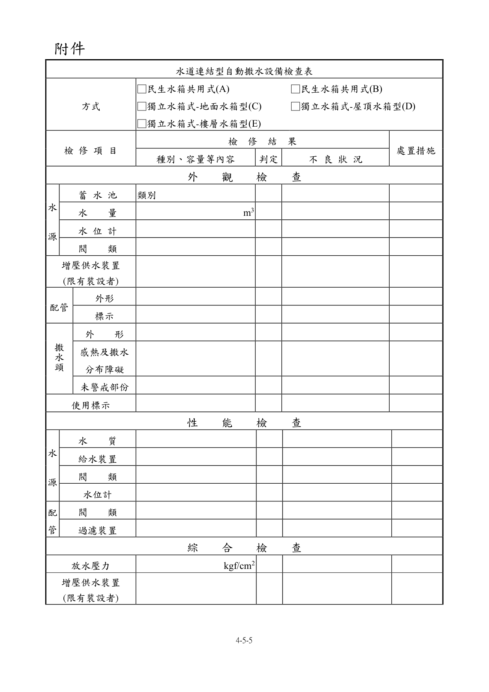
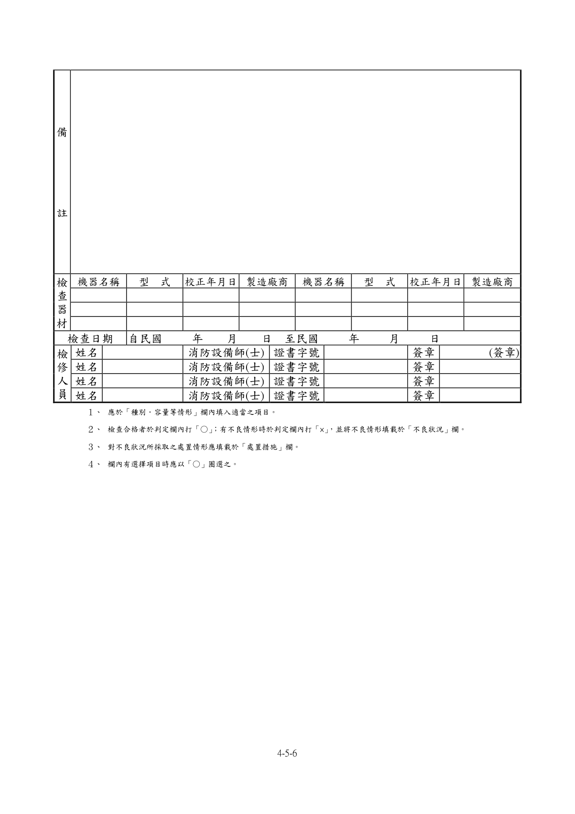

# 消防安全設備及必要檢修項目檢修基準　第五章　水道連結型自動撒水設備

> 版本日期：民國 114 年 1 月 9 日（修正）｜來源：內政部主管法規共用系統（glrs.moi.gov.tw，GL001285）PDF 轉換。114-01-09 修正六章：第一、九、十三、十七、十九、二十七章（其中第一、九、十九章之修正內容在檢修報告表／檢查表與附圖）。
>
> 📌 **免責聲明**：本檔由官方來源轉換與人工整理，可能有轉換或辨識誤差。**一切以主管機關（全國法規資料庫、內政部消防署）公告之現行版本為準**；如有疑義，以官方公告為主。後續 AI 代理人引用本檔時應主動提醒使用者此點，並於必要時自行上網查證正確版本。
>
> 🛈 表格與表單已依原始 PDF 線框以 `scripts/pdf_tables_extract.py` 重新辨識為結構化內容（issue #41）：編號附表為 Markdown 表格或逐列樹狀展開；章末檢修報告表／檢查表**不辨識文字**，改以原始 PDF 頁面截圖（PNG）嵌入；內文附圖與表內圖示亦以 PDF 截圖嵌入（圖檔與本檔同資料夾、檔名前綴同本檔）。表格數值／○×標記可能有辨識誤差，關鍵判斷請核對原始 PDF。
>
> 📎 原始 PDF（全文，114-01-09 版）：[消防安全設備及必要檢修項目檢修基準.pdf](../原始檔案/消防安全設備及必要檢修項目檢修基準/消防安全設備及必要檢修項目檢修基準.pdf)

一、外觀檢查

（一）水源

１、檢查方法

（１）水箱、蓄水池檢查方法由外部以目視確認有無變形、漏水、腐蝕等。

（２）水量由水位計確認或打開人孔蓋用檢尺測量。

（３）水位計以目視確認有無變形、損傷、指示值是否正常。

（４）閥類以目視確認排水管、補給水管等之閥類，有無漏水、變形、損傷等，及其開、關位置是否正常。

２、判定方法

（１）水箱、蓄水池應無變形、損傷、漏水及顯著腐蝕等痕跡。

（２）水量應確保在規定量以上。

（３）水位計應無變形、損傷，且指示值應正常。

（４）閥類

A.應無漏水、變形、損傷等。應無造成通行或避難上之障礙。

B.「常時開」或「常時關」之標示及開、關位置應保持正常。

（二）增壓供水裝置(限有裝設者)

１、檢查方法以目視確認有無變形、腐蝕等，及是否為取得經濟部標準檢驗局商品檢驗標識之產品。

２、判定方法應無變形、腐蝕等，且貼有商品檢驗合格標識。

（三）配管、配件及閥類

１、檢查方法

（１）立管及接頭以目視確認有無洩漏、變形等及被利用作為其他東西之支撐、吊架等。

（２）立管固定用之支撐及吊架以目視及手觸摸確認有無脫落、彎曲、鬆動等。

（３）閥類以目視確認有無洩漏、變形等，及開、關位置是否正常。

（４）過濾裝置以目視確認有無洩漏、變形等。

２、判定方法（1）立管及接頭

A.應無洩漏、變形、損傷等。

B.應無被利用為支撐、吊架等。（2）立管固定用之支撐及吊架應無脫落、彎曲、鬆動等。（3）閥類

A.應無洩漏、變形、損傷等。

B.「常時開」或「常時關」之標示及開、關位置應保持正常。（4）過濾裝置應無洩漏、變形、損傷等。

（四）撒水頭

１、檢查方法（1）外形

A.以目視確認有無洩漏、變形等。

B.以目視確認有無被利用作為支撐、吊架使用等。（2）感熱及撒水分布障礙以目視確認周圍有無感熱及撒水分布之障礙。

２、判定方法（1）外形

A.應無洩漏、變形等。

B.應無被利用作為支撐、吊架使用。（2）感熱及撒水分布障礙

A.撒水頭周圍應無感熱、撒水分布之障礙。

B.撒水頭應無被油漆、異物附著等。

C.於設有撒水頭防護蓋之場所，其防護蓋應無損傷、脫落等。（3）未警戒部分應無因隔間、垂壁、風管管道等之變更、增設、新設等，而造成未警戒部分。

（五）末端查驗閥(限有裝設者)

１、檢查方法以目視確認有無洩漏、變形等，及開、關位置與「末端查驗閥」標示是否適當正常。

２、判定方法

（１）應無洩漏、變形、損傷等。

（２）開、關位置應正常，且標示應無損傷、脫落、污損等。

（六）使用標示

１、檢查方法確認標示是否適當及明顯。

２、判定方法應無污損、不明顯部分。

二、性能檢查

（一）水源

１、檢查方法

（１）水質打開人孔蓋以目視及水桶採水，確認有無腐敗、浮游物、沉澱物等。

（２）給水裝置

A.確認有無變形、腐蝕等，及操作排水閥確認給水功能是否正常。

B.如不便用操作排水閥檢查給水功能時，可使用下列方法：

(A) 使用水位電極控制給水者，拆除其電極回路之配線，形成減水狀態，確認其是否能自動給水；其後再將拆掉之電極回路配線接上復原，形成滿水狀態，確認其給水能否自動停止。

(B)使用浮球水栓控制給水者，以手動操作將浮球沒入水中，形成減水狀態，使其自動給水；其後使浮球復原，形成滿水狀態，使給水自動停止。

（３）水位計水位計之量測係打開人孔蓋，用檢尺測量水位，並確認水位計之指示值。

（４）閥類用手操作確認開、關動作是否容易進行。

２、判定方法

（１）水質應無顯著腐敗、浮游物、沉澱物等。

（２）給水裝置

A.應無變形、損傷、顯著腐蝕。

B.於減水狀態應能自動給水，於滿水狀態應能自動停止供水。

（３）水位計水位計之指示值應正常。

（４）閥類開、關操作應能容易進行。

（二）配管、配件及閥類

１、檢查方法

（１）閥類用手操作確認開、關動作是否容易進行。

（２）過濾裝置分解打開確認過濾網有無變形、異物堆積。

２、判定方法

（１）閥類開、關操作能容易進行。

（２）過濾裝置過濾網應無變形、損傷、異物堆積等。

三、綜合檢查

（一）檢查方法於建築物各層放水壓力最低之最遠支管末端，打開末端查驗閥或連結之水龍頭等日常生活用水設施，確認系統性能是否正常及壓力表之指示值。另設置末端查驗閥者，應設有與撒水頭同等放水性能之限流孔；設有增壓供水裝置者，於打開末端查驗閥或連結之水龍頭等日常生活用水設施降低配管內的壓力後，該增壓供水裝置應開始動作。

（二）判定方法

１、放水壓力末端查驗閥或連結之水龍頭等日常生活用水設施配置的壓力表，其放水壓力應在 0.5kgf/cm² 以上 10 kgf/cm² 以下。

２、增壓供水裝置(限有裝設者)增壓供水裝置應能確實啟動，且運轉中應無不規則、不連續之雜音或異常之振動、發熱等。

### 附件　水道連結型自動撒水設備檢查表

> 本檢查表不辨識文字，改以原始 PDF 頁面截圖嵌入（共 2 頁，對應原 PDF 第 81–82 頁）；如需填寫或核對細部文字，請開啟[原始 PDF](../原始檔案/消防安全設備及必要檢修項目檢修基準/消防安全設備及必要檢修項目檢修基準.pdf)。

