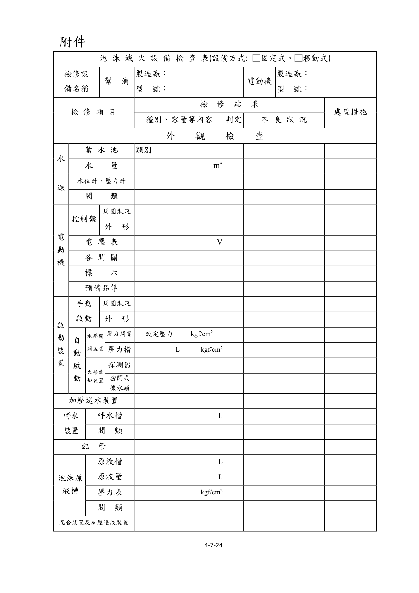
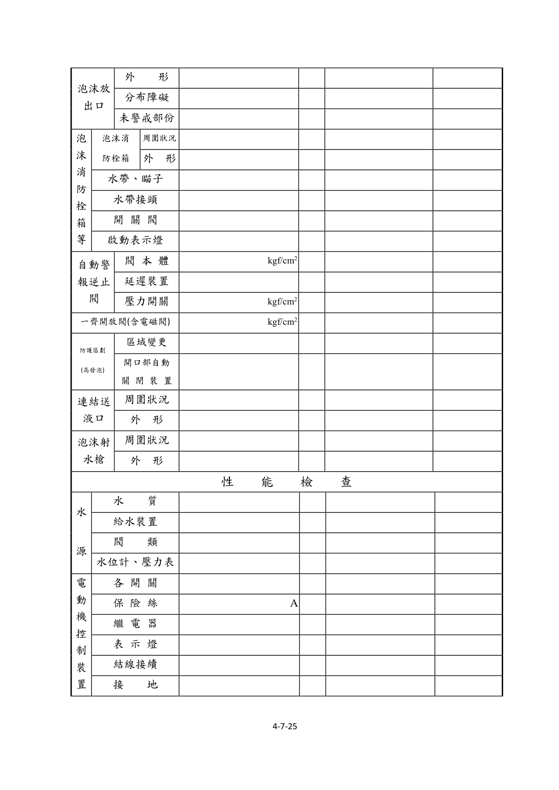
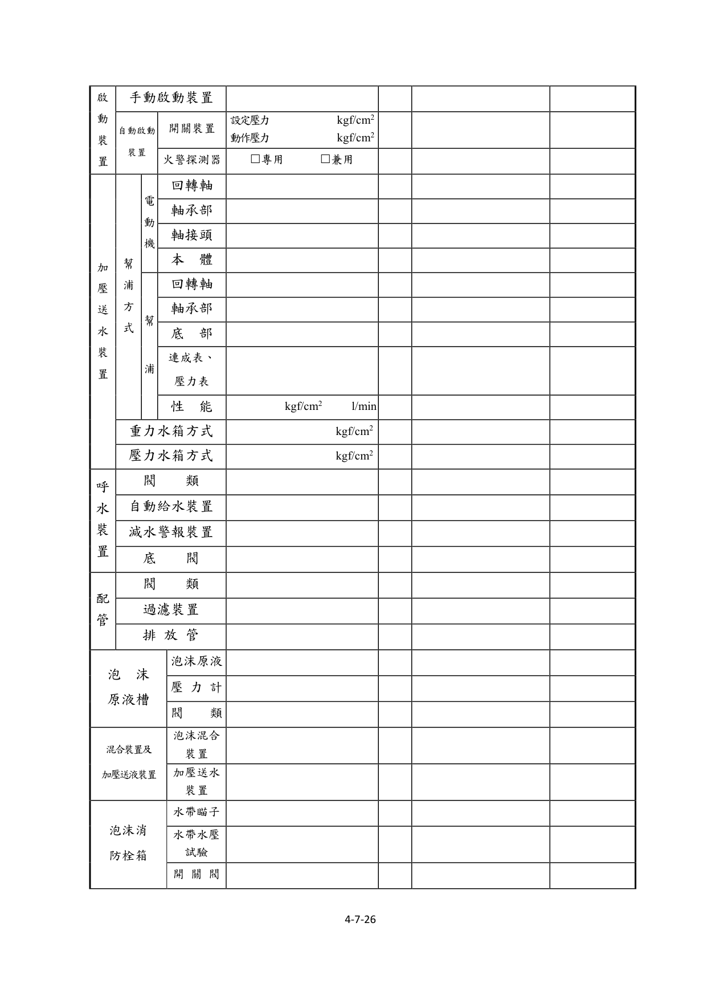
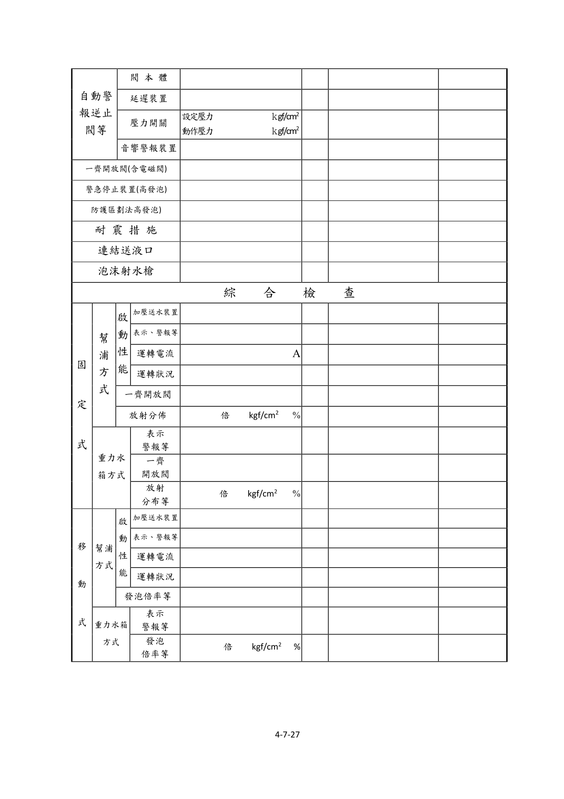
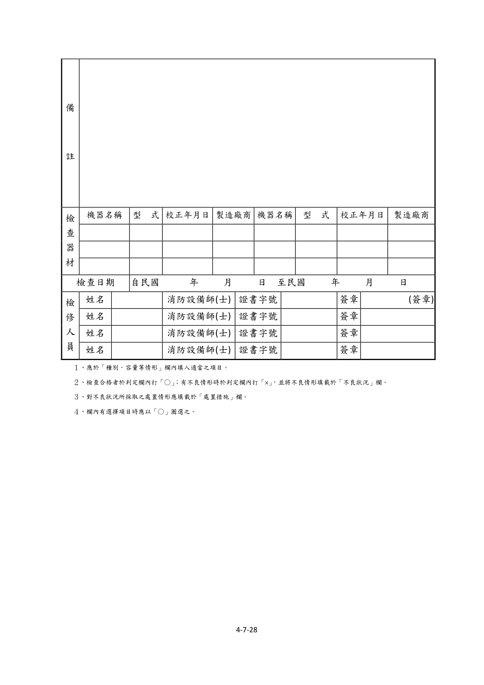

# 消防安全設備及必要檢修項目檢修基準　第七章　泡沫滅火設備

> 版本日期：民國 114 年 1 月 9 日（修正）｜來源：內政部主管法規共用系統（glrs.moi.gov.tw，GL001285）PDF 轉換。114-01-09 修正六章：第一、九、十三、十七、十九、二十七章（其中第一、九、十九章之修正內容在檢修報告表／檢查表與附圖）。
>
> 📌 **免責聲明**：本檔由官方來源轉換與人工整理，可能有轉換或辨識誤差。**一切以主管機關（全國法規資料庫、內政部消防署）公告之現行版本為準**；如有疑義，以官方公告為主。後續 AI 代理人引用本檔時應主動提醒使用者此點，並於必要時自行上網查證正確版本。
>
> 🛈 表格與表單已依原始 PDF 線框以 `scripts/pdf_tables_extract.py` 重新辨識為結構化內容（issue #41）：編號附表為 Markdown 表格或逐列樹狀展開；章末檢修報告表／檢查表**不辨識文字**，改以原始 PDF 頁面截圖（PNG）嵌入；內文附圖與表內圖示亦以 PDF 截圖嵌入（圖檔與本檔同資料夾、檔名前綴同本檔）。表格數值／○×標記可能有辨識誤差，關鍵判斷請核對原始 PDF。
>
> 📎 原始 PDF（全文，114-01-09 版）：[消防安全設備及必要檢修項目檢修基準.PDF](../原始檔案/消防安全設備及必要檢修項目檢修基準/消防安全設備及必要檢修項目檢修基準.pdf)

一、外觀檢查

（一）水源

１、檢查方法

（１）水箱、蓄水池由外部以目視確認有無變形、漏水、腐蝕等。

（２）水量由水位計確認，無水位計時打開人孔蓋用檢尺測量。

（３）水位計及壓力表以目視確認有無變形、損傷及指示值是否正常。

（４）閥類以目視確認排水管、補給水管、給氣管等之閥類，有無漏水、變形、損傷等，及其開、關位置是否正常。

２、判定方法

（１）水箱、蓄水池應無變形、損傷、漏水、漏氣及顯著腐蝕等痕跡。

（２）水量應確保在規定量以上。

（３）水位計及壓力表應無變形、損傷及指示值應正常。

（４）閥類

A.應無洩漏、變形、損傷等。

B.「常時開」或「常時關」之標示及開、關位置應正常。

（二）電動機之控制裝置

１、檢查方法

（１）控制盤

A.周圍狀況確認周圍有無檢查上及使用上之障礙。

B.外形以目視確認有無變形、腐蝕等。

（２）電壓表

A.以目視確認有無變形、損傷等。

B.確認電源、電壓是否適當正常。

（３）各開關以目視確認有無變形、損傷及開、關位置是否正常。

（４）標示確認標示是否適當正常。

（５）預備品確認是否備有保險絲、燈泡等預備品及回路圖等。

２、判定方法

（１）控制盤

A.周圍狀況應設置於火災不易波及之位置，且周圍沒有檢查及使用上之障礙。

B.外形應無變形、損傷、顯著腐蝕等。

（２）電壓表

A.應無變形、損傷等。

B.電壓表的指示值應在所定之範圍內。

C.無電壓表者，其電源指示燈應亮著。

（３）各開關應無變形、損傷、脫落等，且開、關位置應正常。

（４）標示

A.各開關之名稱標示應無污損、不明顯部分。

B.標示銘板應無剝落。

（５）預備品

A.應備有保險絲、燈泡等預備品。

B.應備有回路圖及操作說明書等。

（三）啟動裝置

１、手動啟動裝置

（１）檢查方法

A.周圍狀況以目視確認周圍有無檢查上及使用上之障礙，及「手動啟動開關」之標示是否正常。

B.外形以目視確認直接操作部及手動啟動開關有無變形、損傷等。

（２）判定方法

A.周圍狀況

(A)應無檢查上及使用上之障礙。

(B)標示應無損傷、脫落、污損等。

B.外形按鈕、開關類應無損傷、變形等。

２、自動啟動裝置

（１）檢查方法

A.啟動用水壓開關裝置

(A)壓力開關以目視確認如圖2-1圖例所示之壓力開關，有無變形、損傷等。

(B)啟動用壓力槽以目視確認如圖2-1圖例所示之啟動用壓力槽，有無變形、漏水、腐蝕等，及其壓力表之指示值是否正常。

B.火警感知裝置

(A)探測器依據火警自動警報設備之檢查要領加以確認。

(B)密閉式撒水頭以目視確認有無火警感知障礙，及因裝修油漆、異物附著等產生之動作障礙。

（２）判定方法

A.啟動用水壓開關裝置

(A)壓力開關應無變形、損傷等。

(B)啟動用壓力槽應無變形、損傷、漏水、漏氣、顯著腐蝕等，且壓力表之指示值應正常。

B.火警感知裝置

(A)探測器依據火警自動警報設備之檢查要領判定。

(B)密閉式撒水頭

a.撒水頭周圍應無感熱之障礙物。

b.應無因裝修油漆、異物附著、變形、損傷等。

（四）加壓送水裝置

１、檢查方法以目視確認如圖 2-3 圖例所示之幫浦及電動機等，有無變形、腐蝕等。

２、判定方法應無變形、損傷、顯著腐蝕及銘板剝落等。

（五）呼水裝置

１、檢查方法

（１）呼水槽以目視確認如圖 2-4 之呼水槽，有無變形、漏水、腐蝕等，及水量是否在規定量以上。

（２）閥類以目視確認給水管之閥類有無洩漏、變形等，及其開、關位置是否正常。

２、判定方法

（１）呼水槽應無變形、損傷、漏水、顯著腐蝕等，及水量應在規定量以上。

（２）閥類

A.應無洩漏、變形、損傷等。

B.「常時開」或「常時關」之標示及開、關位置應正常。

（六）配管

１、檢查方法

（１）立管及接頭以目視確認有無洩漏、變形等及被利用做為其他東西之支撐、吊架等。

（２）立管固定用之支撐及吊架以目視及手觸摸確認有無脫落、彎曲、鬆動等。

（３）閥類以目視確認有無洩漏、變形等，及開、關位置是否正確。

（４）過濾裝置以目視確認如圖 2-5 所示之過濾裝置有無洩漏、變形等。

（５）標示確認「制水閥」之標示是否適當正常。

２、判定方法

（１）立管及接頭

A.應無洩漏、變形、損傷等。

B.應無被利用做為其它東西之支撐及吊架等。

（２）立管固定用之支撐及吊架應無脫落、彎曲、鬆動等。

（３）閥類

A.應無洩漏、變形、損傷等。

B.「常時開」或「常時關」之標示及開、關位置應正確。

（４）過濾裝置應無洩漏、變形、損傷等。

（５）標示應無損傷、脫落、污損等。

（七）泡沫原液槽

１、檢查方法

（１）原液槽以目視確認有無變形、漏液、腐蝕等。

（２）原液量以液面計等確認。

（３）壓力表

A.以目視確認有無變形、損傷等。

B.以目視確認指示值是否正常。

（４）閥類以目視確認有無變形、洩漏等，並確認其開、關位置是否正常。

２、判定方法

（１）原液槽應無變形、損傷、漏液、漏氣、顯著腐蝕等。

（２）原液量應在規定量以上。

（３）壓力表

A.應無變形、損傷等。

B.壓力指示值應正常。

（４）閥類

A.應無洩漏、變形、損傷等。

B.「常時開」或「常時關」之標示及開、關位置應正常。

（八）混合裝置及加壓送液裝置

１、檢查方法以目視確認有無變形、漏水等。

２、判定方法應無變形、損傷、漏水、漏液等。

（九）泡沫放出口

１、檢查方法

（１）外形

A.以目視確認有無變形、腐蝕、阻塞等。

B.以目視確認有無被利用為支撐、吊架使用。

（２）分布障礙

A.以目視確認泡沫頭周圍有無妨礙泡沫分布之障礙。

B.以目視確認高發泡放出口周圍，有無妨礙泡沫流動之障礙。

（３）未警戒部分確認有無因隔間變更而未加設泡沫頭，造成未警戒之部分。

２、判定方法

（１）外形

A.應無洩漏、變形、損傷、顯著腐蝕、阻塞等。

B.應無被利用為支撐、吊架使用。

（２）分布障礙

A.泡沫頭周圍應無妨礙泡沫分布之障礙物。

B.高發泡放出口周圍，應無妨礙泡沫流動之障礙物。

（３）未警戒部分應無因隔間、垂壁、風管、棚架等之變更、增設，造成未警戒之部分。

（十）泡沫消防栓箱等

１、泡沫消防栓箱等

（１）檢查方法

A.周圍狀況確認周圍有無檢查上及使用上之障礙，並確認「移動式泡沫滅火設備」之標示是否正常。

B.外形以目視及開、關操作確認有無變形、損傷等，及箱門是否能確實開、關。

（２）判定方法

A.周圍狀況

(A)應無檢查上及使用上之障礙。

(B)標示應無污損、不鮮明部分。

B.外形

(A)應無變形、損傷等。

(B)箱門應能確實地開、關。

２、水帶及瞄子

（１）檢查方法以目視確認有無變形、損傷等，並確認是否設有規定之數量。

（２）判定方法

A.應無變形、損傷等。

B.應設有規定之數量。

３、水帶接頭

（１）檢查方法以目視確認有無變形、損傷等。

（２）判定方法應無變形、損傷等。

４、開關閥（泡沫消防栓）

（１）檢查方法以目視確認有無洩漏、變形等。

（２）判定方法應無洩漏、變形、損傷等。

５、啟動表示燈

（１）檢查方法以目視檢查有無變形、損傷等，及是否亮燈。

（２）判定方法應無變形、損傷，脫落、燈泡損壞等。

（十一）自動警報逆止閥

１、檢查方法

（１）閥本體

A.以目視確認本體、附屬閥類、配管及壓力表等有無漏水、變形等。

B.確認本體上之壓力表指示值是否正常。

（２）延遲裝置以目視確認有無變形、腐蝕等。

（３）壓力開關以目視確認有無變形、損傷等

２、判定方法

（１）閥本體

A.本體、附屬閥類、配管及壓力表等應無漏水、變形、損傷等。

B.自動警報逆止閥壓力表指示值應正常。

（２）延遲裝置應無變形、損傷、顯著腐蝕等。

（３）壓力開關應無變形、損傷等。

（十二）一齊開放閥（含電磁閥）

１、檢查方法以目視確認有無洩漏、變形、腐蝕等。

２、判定方法應無洩漏、變形、損傷、顯著腐蝕等。

（十三）防護區劃（限使用高發泡之設備）

１、檢查方法

（１）區域變更以目視確認防護區域及開口部面積有無變更。

（２）開口部之自動關閉裝置以目視確認有無變形、損傷等。

２、判定方法

（１）區域變更防護區域及開口部面積應無變更。

（２）開口部之自動關閉裝置應無變形、損傷等。

（十四）連結送液口

１、檢查方法

（１）周圍狀況

A.確認周圍有無使用上及消防車接近之障礙。

B.確認「連結送液口」之標示是否正常。

（２）外形以目視確認有無漏水、變形、異物阻塞等。

２、判定方法

（１）周圍狀況

A.應無消防車接近及消防活動上之障礙。

B.標示應無損傷、脫落、污損等。

（２）外形

A.快速接頭應無生鏽。

B.應無漏水及砂、垃圾等異物阻塞現象。

（十五）泡沫射水槍

１、檢查方法

（１）周圍的狀況以目視確認周圍有無檢查及使用上之障礙。

（２）外形以目視及開、關操作，確認有無變形、洩漏、損傷等。

２、判定方法

（１）周圍狀況應無檢查及使用上之障礙。

（２）外形應無變形、洩漏、損傷等。

二、性能檢查

（一）水源

１、檢查方法

（１）水質打開人孔蓋以目視及水桶採水，確認有無腐敗、浮游物、沈澱物等。

（２）給水裝置

A.確認有無變形、腐蝕等，及操作排水閥確認給水功能是否正常。

B.如不便用操作排水閥檢查給水功能時，可使用下列方法：

(A)使用水位電極控制給水者，拆除其電極回路之配線，形成減水狀態，確認其是否能自動給水；其後再將拆掉之電極回路配線接上復原，形成滿水狀態，確認其給水能否自動停止。

(B)使用浮球水栓控制給水者，由手動操作將浮球沒入水中，形成減水狀態，確認能否自動給水；其後使浮球復原，形成滿水狀態，確認給水能否自動停止。

（３）水位計及壓力表

A.水位計之量測係打開人孔蓋，用檢尺測量水位，並確認水位計之指示值。

B.壓力表之量測係關閉壓力表開關及閥類，並放出壓力表之水，使指針歸零後，再打開壓力表開關及閥類，並認確指針之指示值。

（４）閥類用手操作確認開、關動作能否容易進行。

２、判定方法

（１）水質應無顯著腐蝕、浮游物、沈澱物等。

（２）給水裝置

A.應無變形、損傷、顯著腐蝕等。

B.於減水狀態應能自動給水，於滿水狀態應能自動停止供水。

（３）水位計及壓力表

A.水位計之指示值應正常。

B.壓力表歸零之位置、指針之動作狀況及指示值應正常。

（４）閥類開、關操作應能容易地進行。電動機之控制裝置

１、檢查方法

（１）各開關以螺絲起子及開、關操作，檢查端子有無鬆動及開、關性能是否正常。

（２）保險絲確認有無損傷、熔斷及是否為所規定之種類、容量。

（３）繼電器確認有無脫落、端子鬆動、接點燒損、灰塵附著，並操作各開關使繼電器動作，確認其性能。

（４）表示燈操作各開關確認有無亮燈。

（５）結線接續以目視及螺絲起子確認有無斷線、端子鬆動等。

（６）接地以目視或三用電表確認有無腐蝕、斷線等。

２、判定方法

（１）各開關

A.應無端子鬆動及發熱之情形。

B.開、關性能應正常。

（２）保險絲

A.應無損傷、熔斷。

B.應依回路圖所規定之種類及容量設置。

（３）繼電器

A.應無脫落、端子鬆動、接點燒損、灰塵附著等。

B.動作應正常。

（４）表示燈應無顯著劣化，且能正常亮燈。

（５）結線接續應無斷線、端子鬆動、脫落、損傷等。

（６）接地應無顯著腐蝕、斷線等之損傷。啟動裝置

１、手動啟動裝置

（１）檢查方法操作直接操作部及手動啟動開關，確認加壓送水裝置能否啟動。

（２）判定方法加壓送水裝置應能確實啟動 。

２、自動啟動裝置

（１）檢查方法

A.啟動用水壓開關裝置

(A)以目視及螺絲起子確認壓力開關之端子有無鬆動。

(B)確認設定壓力值是否恰當，且由操作排水閥使加壓送水裝置啟動，確認動作壓力值是否適當正常。

B.火警感知裝置探測器之性能依據火警自動警報設備之檢修基準進行確認，再使探測器動作，確認加壓送水裝置是否啟動 。

（２）判定方法

A.啟動用水壓開關裝置

(A)壓力開關之端子應無鬆動。

(B)設定壓力值適當，且加壓送水裝置應能依設定之壓力正常啟動。

B.火警感知裝置

(A)依火警自動警報設備檢修基準判定。

(B)加壓送水裝置應能確實啟動。加壓送水裝置

１、幫浦方式

（１）電動機

A.檢查方法

(A)回轉軸用手轉動，確認是否能圓滑地回轉。

(B)軸承部確認潤滑油有無污損、變質及是否達必要量。

(C)軸接頭以扳手確認有無鬆動及性能是否正常。

(D)本體操作啟動裝置使其啟動，確認性能是否正常。

B.判定方法

(A)回轉軸應能圓滑地回轉。

(B)軸承部潤滑油應無污損、變質且達必要量。

(C)軸接頭應無脫落、鬆動，且接合狀態牢固。

(D)本體應無顯著發熱、異常振動、不規則或不連續之雜音，且回轉方向應正確。

C.注意事項除需操作啟動檢查性能外，其餘均需先切斷電源。

（２）幫浦

A.檢查方法

(A)回轉軸用手轉動確認是否能圓滑地轉動。

(B)軸承部確認潤滑油有無污損、變質及是否達必要量。

(C)底部確認有無顯著漏水。

(D)連成表及壓力表關掉表計之控制水閥將水排出，檢視指針是否指在0之位置，再打開表計之控制水閥，操作啟動裝置確認指針是否正常地動作。

(E)性能先將幫浦吐出側之制水閥關閉之後，使幫浦啟動，然後緩緩地打開性能測試用配管之制水閥，由流量計及壓力表確認額定負荷運轉及全開點運轉時之性能。

B.判定方法

(A)回轉軸應能圓滑地轉動。

(B)軸承部潤滑油應無污損、變質、混入異物等，且達必要量。

(C)底座應無顯著的漏水。

(D)連成表及壓力表位置及指針之動作應正常。

(E)性能應無異常振動、不規則或不連續之雜音，且於額定負荷運轉及全開點時之吐出壓力及吐出水量均達規定值以上。

C.注意事項除需操作啟動檢查性能外，其餘均需先行切斷電源。

２、重力水箱方式

（１）檢查方法由最近及最遠之試驗閥，以壓方表測定其靜水壓力，確認是否為所定之壓力值。

（２）判定方法應為設計上之壓力值。

３、壓力水箱方式

（１）檢查方法打開排氣閥確認能否自動啟動加壓。

（２）判定方法壓力降低自動啟動裝置應能自動啟動及停止。

（３）注意事項打開排氣閥時，為防止高壓造成之危害，關類應慢慢地開啟。呼水裝置

１、檢查方法

（１）閥類用手實地操作確認開、關動作是否容易進行。

（２）自動給水裝置

A.確認有無變形、腐蝕等。

B.打開排水閥，檢查自動給水功能是否正常。

（３）減水警報裝置

A.確認有無變形、腐蝕等

B.關閉補給水閥，再打開排水閥，確認減水警報功能是否正常。

（４）底閥

A.拉上吸水管或檢查用鍊條，確認有無異物附著或阻塞等。

B.打開幫浦本體上之呼水漏斗的制水閥，確認有無從漏斗連續溢水出來。

C.打開幫浦本體上之呼水漏斗的制水閥，然後關閉呼水管之制水閥，確認底閥之逆止效果是否正常。

２、判定方法

（１）閥類開、關操作應容易進行。

（２）自動給水裝置

A.應無變形、損傷、顯著腐蝕等。

B.當呼水槽水量減少時，應能自動給水。

（３）減水警報裝置

A.應無變形、損傷、顯著腐蝕等。

B.當呼水槽水量減少到一半時，應發出警報。

（４）底閥

A.應無異物附著、阻塞等吸水障礙。

B.應能由呼水漏斗連續溢水出來。

C.呼水漏斗的水應無減少。配管

１、檢查方法

（１）閥類用手操作確認開、關動作是否容易。

（２）過濾裝置分解打開過濾網確認有無變形、異物堆積等。

（３）排放管（防止水溫上升裝置）使加壓送水裝置啟動呈關閉運轉狀態，確認排放管排水是否正常。

２、判定方法

（１）閥類開、關操作應能容易進行。

（２）過濾裝置過濾網應無變形、損傷、異物堆積等。

（３）排放管（防止水溫上升裝置）排放水量應在下列公式求得量以上。

$$q = \frac{L_s \times C}{60 \times \Delta t}$$

- $q$：排放水量（l/min）
- $L_s$：幫浦關閉運轉時之出力（kw）
- $C$：860 Kcal（1kw-hr 時水之發熱量）
- $\Delta t$：30℃（幫浦內部之水溫上昇限度）

泡沫原液槽等

１、檢查方法

（１）泡沫原液打開原液槽之排液口制水閥，用燒杯或量筒採取泡沫原液（最好能由上、中、下三個位置採液），以目視確認有無變質、污損。

（２）壓力表關掉表計之控制水閥將水排出，確認指針是否在0之位置；再打開表針控制水閥，操作啟動裝置確認指針是否正常動作。

（３）閥類用手操作確認開、關動作是否容易進行。

２、判定方法

（１）泡沫原液應無變質、明顯污損等。

（２）壓力表歸零之位置，指針之動作狀況及指示值應正常。

（３）閥類應能容易開、關操作。混合裝置及加壓送液裝置

１、檢查方法

（１）泡沫混合裝置因有數種混合方式，且各廠牌性能不一，所以應參照原廠所附之相關資料，確認其性能是否正常。

（２）加壓送液裝置

A.確認有無漏液。

B.使用幫浦加壓者，依加壓送水裝置之檢查方法確認。

２、判定方法

（１）泡沫混合裝置配置及性能應與設置時相同。

（２）加壓送液裝置

A.運轉中應無明顯漏液。

B.使用幫浦加壓者，依加壓送水裝置之判定方法判定之。

３、注意事項

（１）要操作設於混合配管之閥類時，應依相關資料熟知其各裝置後再動手。

（２）由加壓送液裝置之運轉，造成原液還流原液槽時，應注意在原液槽內之起泡及溢出現象。泡沫消防栓箱等

１、檢查方法

（１）水帶、瞄子及水帶接頭

A.以手操作及目視確認有無損傷、腐蝕及是否容易拆接。

B.製造年份超過 10 年或無法辨識製造年份之水帶，應將消防水帶兩端之快速接頭連接於耐水壓試驗機，並利用相關器具夾住消防水帶兩末端處，經確認快速接頭已確實連接及水帶內(快速接頭至被器具夾住處之部分水帶)無殘留之空氣後，施以 7kgf/cm² 以上水壓試驗 5 分鐘合格，始得繼續使用。但已經水壓試驗合格未達 3 年者，不在此限。

（２）開關閥確認開關是否容易操作。

２、判定方法

（１）水帶、瞄子及水帶接頭

A.應無損傷、腐蝕等。

B.應能容易拆接，水帶應無破裂、漏水或與消防水帶用接頭脫落之情形。

（２）開關閥開關應能容易操作。自動警報逆止閥

１、檢查方法

（１）閥本體操作試驗閥，確認閥本體、附屬閥類及壓力表等之性能是否正常。

（２）延遲裝置確認延遲作用及自動排水裝置之排水能否有效地進行。

（３）壓力開關

A.以螺絲起子確認端子有無鬆動。

B.確認壓力值是否適當，及動作壓力值是否適當正常。

（４）音響警報裝置及表示裝置

A.操作排水閥確認警報裝置之警鈴、蜂鳴器或水鐘等是否確實鳴動。

B.確認表示裝置之標示燈等有無損傷，及是否能確實表示。

２、判定方法

（１）閥本體性能應正常。

（２）延遲裝置

A.延遲作用應正常。

B.自動排水裝置應能有效排水。

（３）壓力開關

A.端子應無鬆動。

B.設定壓力值應適當正常。

C.於設定壓力值應能動作。

（４）音響警報裝置及標示裝置應能確實鳴動及正常表示。一齊開放閥（含電磁閥）

１、檢查方法

（１）以螺絲起子確認電磁閥之端子有無鬆動。

（２）關閉一齊開放閥二次側的止水閥，再打開測試用排水閥，然後操作手動啟動開關，確認其性能是否正常。

２、判定方法

（１）端子應無鬆動、脫落等。

（２）一齊開放閥應能確實開放放水。緊急停止裝置（限於用高發泡之設備）

１、檢查方法以手操作及目視確認有無變形、損傷及性能是否正常。

２、判定方法

（１）操作部、傳達部及啟動部應無變形、損傷等。

（２）用電動機驅動風扇方式發泡之發泡機，該停止電動機運轉及停止泡沫水溶液輸送之裝置應能正常動作。

（３）用水流驅動風扇方式發泡之發泡機，該停止泡沫水溶液輸送裝置應能正常動作。

（４）用其它裝置發泡時，該停止發泡之裝置應能正常動作。防護區域（限於用高發泡之設備）

１、檢查方法操作啟動裝置確認開口部之自動關閉裝置能否正常動作。

２、判定方法應能正常動作。

耐震措施

１、檢查方法

（１） 牆壁或地板上貫通部分有無變形、損傷等，並確認防震軟管接頭有無變形、損傷、顯著腐蝕等。

（２）以目視及扳手確認蓄水池及加壓送水裝置等之裝配固定是否有異常。

２、判定方法

（１）防震軟管應無變形、損傷、顯著腐蝕等，且牆壁或地板上貫通部分的間隙、充填部分均保持原來施工時之狀態。

（２）蓄水池及加壓送水裝置的安裝部分所使用之基礎螺絲、螺絲帽，應無變形、損傷、鬆動、顯著腐蝕等，且安裝固定部分應無損傷。連結送液口

１、檢查方法

（１）檢查襯墊有無老化等。

（２）確認快速接頭及水帶是否容易接上及分開。

２、判定方法

（１）襯墊應無老化、損傷等。

（２）與水帶之接合及分開應容易進行。泡沫射水槍

１、檢查方法以目視確認有無損傷、腐蝕，及用手操作確認開、關操作是否容易。

２、判定方法

（１）應無損傷、腐蝕。

（２）開、關操作應能容易進行。

三、綜合檢查

（一）固定式泡沫滅火設備（低發泡）

１、檢查方法切換成緊急電源供電狀態，藉由手動啟動裝置之操作或自動啟動裝置之動作，確認系統之性能是否正常。另外，放射分布、發泡倍率、放射壓力及混合比率依下列方法確認。

（１）設置泡沫頭者，每次選擇全部放射區域數之 20％以上之放射區域，進行逐區放水試驗，測其放射分布及放射壓力。

（２）在上述之放射區域中，於距加壓送水裝置最遠之放射區域進行泡沫放射，再依附表之發泡倍率及 25％還原時間測定方法，測其發泡倍率及 25％還原時間。並在測定發泡倍率時，使用其所採取之泡水溶液，利用糖度計法或比色計法，測其混合比率。

２、判定方法

（１）幫浦方式

A.啟動性能

(A)加壓送水裝置應能確實啟動。

(B)表示、警報等性能應正常。

(C)電動機之運轉電流應在容許範圍內。

(D)運轉中應無不規則‧不連續之雜音或異常之震動、發熱等。

B.一齊開放閥一齊開放閥應正常動作。

C.放射分布等

(A)在進行泡沫頭放水試驗時，其放射分布及放射壓力應符合設計圖說。

(B)在進行泡沫放射檢查時，其發泡倍率應在 5 倍以上，其混合比率應為設計時之稀釋容量濃度。

（２）重力水箱及壓力水箱

A.表示、警報等表示、警報等應正常。

B.一齊開放閥一齊開放閥應正常動作。

C.分布

(A)在進行泡沫頭放水試驗時，其放射分布及放射壓力應符合設計圖說。

(B)在進行泡沫放射檢查時，其發泡倍率應在 5 倍以上，其混合比率應為設計時之稀釋容量濃度。

２、注意事項於檢查類似醫院之場所，因切換緊急電源可能造成因擾時，得使用常用電源檢查。

（二）移動式泡沫滅火設備

１、檢查方法切換成緊急電源供電狀態，藉由直接操作啟動裝置或遠隔啟動裝置使幫浦啟動，確認系統之性能是否正常。另外，發泡倍率、放射壓力及混合比率依下列方法確認。

（１）由任一泡沫消防栓進行放射試驗。

（２）依附表之發泡倍率及 25％還原時間測定方法，測其發泡倍率及 25％還原時間。並在測定發泡倍率時，使用其所採取之泡水溶液，利用糖度計法或比色計法，測其混合比率（稀釋容量濃度）。

２、判定方法

（１）幫浦方式

A.啟動性能

(A)加壓送水裝置能確實啟動。

(B)表示、警報等性能應正常。

(C)電動機之運轉電流應在容許範圍內。

(D)運轉中應無不規則、不連續之雜音或異常之震動、發熱等。

B.發泡倍率等放射壓力應符合設計圖說；發泡倍率應在 5 倍以上，其混合比率應為設計時之稀釋容量濃度。

（２）重力水箱及壓力水箱

A.表示、警報等表示、警報應正常。

B.發泡率等放射壓力應符合設計圖說；發泡倍率應在 5 倍以上，其混合比率應為設計時之稀釋容量濃度。

３、注意事項於檢查類似醫院之場所，因切換緊急電源可能造成困擾時，得使用常用電源檢查。

（附表）泡沫滅火設備發泡倍率及25%還原時間測定方法（蛋白泡沫滅火藥劑或合成界面活性劑中之低發泡者）

- **適用範圍**：本測定方法適用於使用蛋白泡沫滅火藥劑或合成界面活性劑中之低發泡者。　※備註：1.6mm鋁板泡沫試料採集器
- **必要器具（發泡倍率測定器具）**：１、1400ml 容量之泡沫試料容器（container）2個（如備註欄）。２、泡沫試料採集器（collector）1個（參照備註欄）。３、量秤1個。　※備註：1.6mm鋁板泡沫試料採集器
- **必要器具（25％還原時間測定器具）**：１、碼表（stop watch）2個。２、泡沫試料容器台1個（如備註欄）。３、100ml容量之透明容器4個。　※備註：1.6mm鋁板泡沫試料採集器
- **泡沫試料採取方法（泡沫噴頭之場合）**：在發泡面積內之指定位置，將二個內容積1400ml之泡沫試料容器置於泡沫試料採集器之位置，在該容器未盛滿泡沫前持續置於收集器上，泡沫盛滿後即按下碼表讀秒，同時將採集自泡沫頭撒下之泡沫試料移至外部，以直棒將容器表面推平，清除過多之泡沫及附著在容器外側與底部之泡沫，對該試料進行分析。　※備註：註：接近內壁之底部設置6.4㎜徑之排液口，安裝橡皮管及閉止閥。
- **泡沫試料採取方法（泡沬瞄子之場合）**：於發泡落下地點之大約中央處放置配有 1400ml泡沫試料容器2個之泡沫試料採集器，直至於該容器泡沫完全被充滿為止，而將容器置於採集器上，如充滿時按下碼表開始讀秒，並將由泡沫瞄子發泡落下中之泡沫所採取之試料移至外部，以直尺劃平容器上面，除去多餘泡沫以及附著容器外側或底面之泡沫而分析該試料。　※備註：註：接近內壁之底部設置6.4㎜徑之排液口，安裝橡皮管及閉止閥。
- **測定方法（發泡倍率）**：發泡倍率係測量在未混入空氣前之泡沫水溶液量與最終發泡量之比率。故應預先測出泡沫試料容器重量，並將泡沫試料測量至公克單位，再以下列公式計算之： $\text{發泡倍率} = 1400\,\text{ml} \div \text{扣除容器重量後之淨量(g)}$
- **測定方法（25％還原時間）**：泡沫之25％還原時間，係指自所採集之泡沫消泡為泡水溶液量，還原至全部泡沫水溶液量之 25％止所需之時間。因其特別著重水之保持能力及泡沫之流性，故以下列方法測定。測定還原時間係以測量發泡倍率時所用之試料進行，如將泡沫試料之淨重分為四等分，即可得所含泡水溶液量之25％（單位ml），為測得還原至此量所需時間，應先將試料容器置於容器台上，在一定時間內以 100ml 透明容器承接還原於容器底部之水溶液。茲舉一例如下：假設泡沫試料之淨重為 180g，25％容量值為 180÷4＝45（ml）而其排液量之數值如下記錄：時間（分）還原量（ml） 0 0 0.5 10 1.0 20 1.5 30 2.0 40 2.5 50 3.0 60 由此記錄可知25％容量之45ml位於2至2.5分鐘之間。即由（45ml(25％容量值)─40ml(經過2分鐘還原量值)）÷（50ml(經過 2.5 分鐘時之排液量值）－ 40ml(經過2分鐘排液量值)）＝1/2 可得2.25分鐘之時間，由此判定性能。
  | 時間（分） | 還原量（ml） |
  |---|---|
  | 0 | 0 |
  | 0.5 | 10 |
  | 1.0 | 20 |
  | 1.5 | 30 |
  | 2.0 | 40 |
  | 2.5 | 50 |
  | 3.0 | 60 |

（附表）泡沫滅火設備發泡倍率及25%還原時間測定方法（水成膜泡沫滅火藥劑）

- **適用範圍**：本測定方法適用於使用水成膜泡沫滅火藥劑發泡者。
- **必要器具（發泡倍率測定器具）**：１、內容積1000ml具刻度之量筒2個。２、泡沫試料採集器1個（如備註欄）３、1000g計量器（或與此接近者）1個。　※備註：量筒上方應距地板面50cm以下。採集器之材質應為鋁板或具同等以上耐腐蝕性能者。註：尺寸之（）係為參考尺寸。
- **必要器具（25％還原時間測定器具）**：１、碼表（stop watch）－1個２、內容積1000ml具刻度之量筒－2個。　※備註：量筒上方應距地板面50cm以下。採集器之材質應為鋁板或具同等以上耐腐蝕性能者。註：尺寸之（）係為參考尺寸。
- **泡沫試料採集方法（泡沫噴頭之場合）**：將 1000ml 附刻度之量筒 2 個之泡沫試料採集器置於發泡面積指定位置，至量筒充滿泡沫為止。採集試料，如泡沫盛滿後即按下碼表讀秒，同時將採集自泡沫頭撒下之泡沫試料移至外部，清除多餘之泡沫及附著在量筒外側與底部之泡沫，對該試料進行分析。
- **泡沫試料採集方法（泡沫瞄子之場合）**：於發泡落下點之大約中央處放置刻有 1000ml 之量筒 2 個之泡沫試料採集器，使量筒充滿泡沫為止。採集試料，如充滿時按下碼表開始讀秒，並將採集之試料移至外部，除去多餘泡沫以及附著量筒外側或底面之泡沫，而分析該試料。
- **測定方法（發泡倍率）**：發泡倍率係測量在未混入空氣前之泡沫水溶液量與最終發泡量之比率，故應預先測出刻度 1000ml 量筒之容器重量，次將泡沫試料測量至公克(g)單位，再利用下列公式計算之： $\text{發泡倍率} = 1000\,\text{ml} \div \text{減掉量筒重量之泡沫重量(g)}$
- **測定方法（25％還原時間）**：泡沫之25％還原時間，係指自所採集之泡沫消泡為泡水溶液量，還原至全部泡沫水溶液量之 25％所需時間。因其特別著重水之保持能力及泡沫之流動性，故以下列方法測定。測定還原時間係以測量發泡倍率時所用之試料進行，如將泡沫試料之淨重分為四等份，即可得所含泡水溶液量之 25％（單位 ml），為測得還原至此量所需時間，應先將量筒置於平面上，利用量筒上之刻度觀察泡水溶液還原至25％之所需時間。茲舉一例如下：假設泡沫試料之淨重為200g，1g換算為1ml，25％容量值為200ml÷4＝50（ml）。故測定還原至50ml所需時間，以判定其性能。茲舉測定之實例如下：還原之數值記錄如下：時間（分）還原量（ml） 0 0 1.0 20 2.0 40 3.0 60 由此記錄可知 25％容量（50ml）位於 2 至 3 分鐘之間。即由（50ml(25％容量值)─40ml(經過2分鐘還原量值)）÷ （60ml（經過3分鐘時之還原量值）－40ml(經過2分鐘時之還原量值)）＝0.5 可得2.5分鐘之時間，由此判定性能。
  | 時間（分） | 還原量（ml） |
  |---|---|
  | 0 | 0 |
  | 1.0 | 20 |
  | 2.0 | 40 |
  | 3.0 | 60 |

### 附件　泡沫滅火設備檢查表（設備方式：□固定式、□移動式）

> 本檢查表不辨識文字，改以原始 PDF 頁面截圖嵌入（共 5 頁，對應原 PDF 第 126–130 頁）；如需填寫或核對細部文字，請開啟[原始 PDF](../原始檔案/消防安全設備及必要檢修項目檢修基準/消防安全設備及必要檢修項目檢修基準.pdf)。

