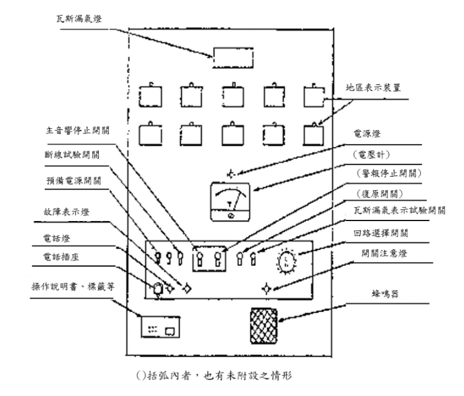
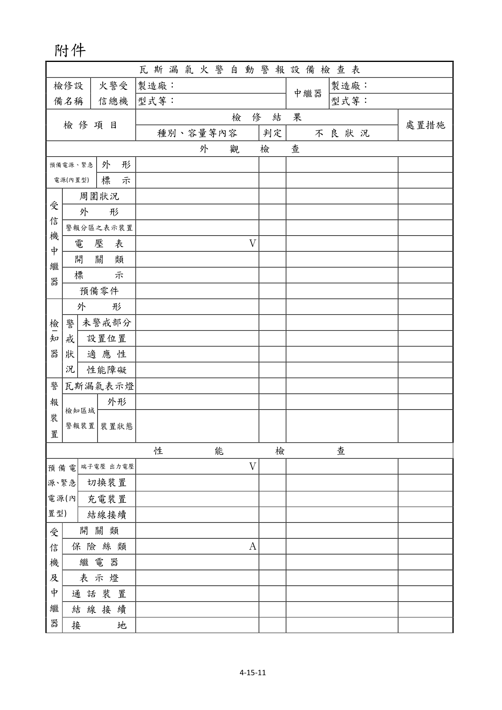
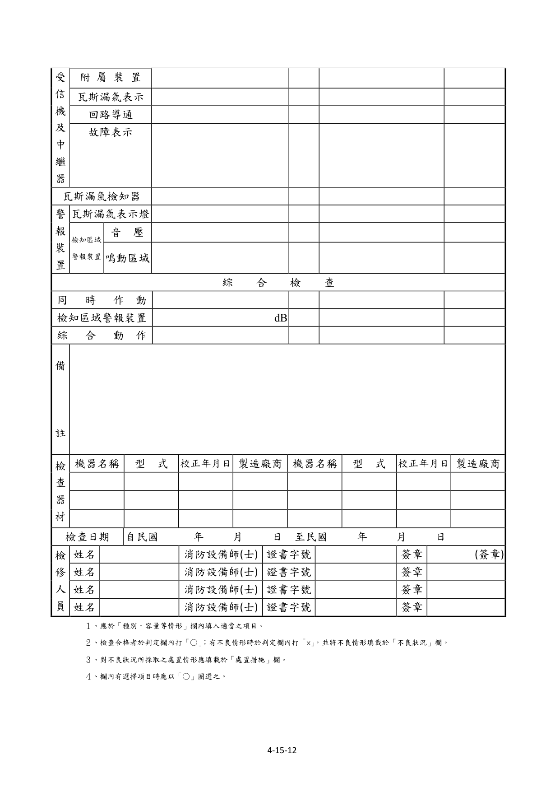
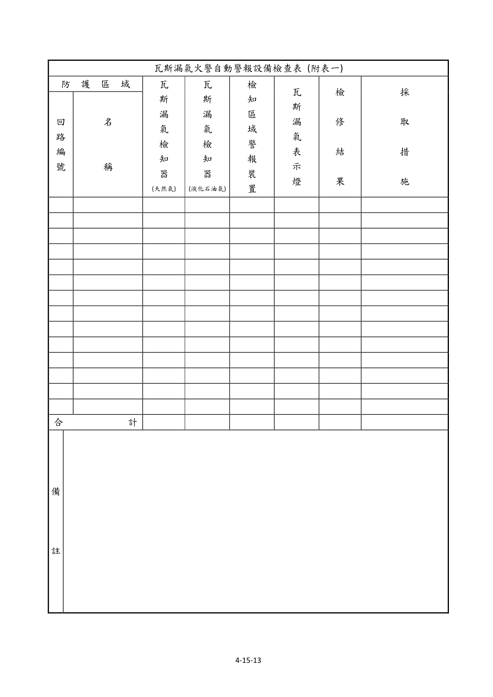

# 消防安全設備及必要檢修項目檢修基準　第十五章　瓦斯漏氣火警自動警報設備

> 版本日期：民國 114 年 1 月 9 日（修正）｜來源：內政部主管法規共用系統（glrs.moi.gov.tw，GL001285）PDF 轉換。114-01-09 修正六章：第一、九、十三、十七、十九、二十七章（其中第一、九、十九章之修正內容在檢修報告表／檢查表與附圖）。
>
> 📌 **免責聲明**：本檔由官方來源轉換與人工整理，可能有轉換或辨識誤差。**一切以主管機關（全國法規資料庫、內政部消防署）公告之現行版本為準**；如有疑義，以官方公告為主。後續 AI 代理人引用本檔時應主動提醒使用者此點，並於必要時自行上網查證正確版本。
>
> 🛈 表格與表單已依原始 PDF 線框以 `scripts/pdf_tables_extract.py` 重新辨識為結構化內容（issue #41）：編號附表為 Markdown 表格或逐列樹狀展開；章末檢修報告表／檢查表**不辨識文字**，改以原始 PDF 頁面截圖（PNG）嵌入；內文附圖與表內圖示亦以 PDF 截圖嵌入（圖檔與本檔同資料夾、檔名前綴同本檔）。表格數值／○×標記可能有辨識誤差，關鍵判斷請核對原始 PDF。
>
> 📎 原始 PDF（全文，114-01-09 版）：[消防安全設備及必要檢修項目檢修基準.pdf](../原始檔案/消防安全設備及必要檢修項目檢修基準/消防安全設備及必要檢修項目檢修基準.pdf)

一、外觀檢查

（一）預備電源及緊急電源（限內置型）

１、檢查方法

（１）外形以目視確認有無變形、腐蝕等。

（２）標示以目視確認蓄電池銘板。

２、判定方法

（１）外形

A.應無變形、腐蝕、龜裂。

B.電解液應無洩漏、導線之接續部應無腐蝕。

（２）標示應與受信總機上標示之種別、額定容量及額定電壓相符。

受信機及中繼器

１、檢查方法

（１）周圍狀況確認周圍有無檢查上或使用上之障礙。

（２）外形以目視確認有無變形、腐蝕等。

（３）警報分區之表示裝置以目視確認有無污損等。

（４）電壓表

A.以目視確認有無變形、損傷等。

B.確認電源、電壓是否正常。

（５）開關以目視確認開、關位置是否正常。

（６）標示確認如圖 15-1 例示各開關之標示是否正常。

圖 15-1 受信總機

（７）預備零件等確認是否備有保險絲、燈泡等零件及回路圖等。

２、判定方法

（１）周圍狀況應設在經常有人之場所（中繼器除外），且應保持檢查上及使用上必要之空間。

（２）外形應無變形、損傷、明顯腐蝕等。

（３）警報分區之表示裝置應無污損、不明顯之部分。

（４）電壓計

A.應無變形、損傷等。

B.電壓計之指示值應在所定之範圍內。

C.無電壓計者，其電源表示燈應亮燈。

（５）開關開、關位置應正常。

（６）標示

A.應貼有檢驗合格證。

B.各開關之名稱應無污損、不明顯之部分。

C.銘板應無脫落。

（７）預備零件等。

A.應備有保險絲、燈泡等零件。

B.應備有回路圖、操作說明書等。

瓦斯漏氣檢知器（以下簡稱『檢知器』）

１、檢查方法

（１）外形以目視確認有無變形、損傷、腐蝕等。

（２）警戒狀況

A.未警戒部分確認設置後有無因用途變更、隔間變更、瓦斯燃燒器具設置場所變更等形成之未警戒部分。

B.設置場所及設置位置確認設置場所及設置位置是否恰當。

C.確認是否設置符合瓦斯特性之檢知器。

D.性能障礙以目視確認有無被塗漆、覆蓋等造成性能障礙之顧慮。

２、判定方法

（１）外形應無變形、損傷、脫落、明顯腐蝕等。

（２）警戒狀況

A.未警戒部分應無設置後因用途變更、隔間變更或瓦斯燃燒器具設置場所變更等形成之未警戒部分。

B.設置場所及設置位置應符合下表 15-1 之規定。

C.適用性設置符合瓦斯特性之檢知器。

D.性能障礙應無被塗漆、覆蓋等影響性能之顧慮。

表 15-1 檢知器之設置基準

- **設置場所**：
  - 一、應為便於檢修之處所。
  - 二、不得設在下列場所：
    - （一）在出入口附近外氣流通之場所。
    - （二）距出風口1.5公尺內之場所。
    - （三）瓦斯燃燒器具之廢氣容易接觸之場所。
    - （四）明顯無法確保檢知器性能之場所。
- **設置位置（瓦斯對空氣之比重未滿一時）**：
  - １、應距瓦斯燃燒器具或瓦斯導管貫穿牆壁處水平距離八公尺以內。但樓板有淨高六十公分以上之樑或類似構造體時，應設於近瓦斯燃燒器或瓦斯導管貫穿牆壁處。
  - ２、瓦斯燃燒器具室內之天花板設有吸氣口時，應設在距瓦斯燃燒器具或瓦斯導管貫穿牆壁處與天花板間無淨高六十公分以上之樑或類似構造體區隔之吸氣口一點五公尺範圍內。
  - ３、檢知器下端，應裝設在天花板下方三十公分範圍內。
- **設置位置（瓦斯對空氣之比重大於一時）**：
  - １、應距瓦斯燃燒器具或瓦斯導管貫穿牆壁處水平距離四公尺以內。
  - ２、檢知器上端，應裝設在距樓地板面三十公分範圍內。

警報裝置

１、瓦斯漏氣表示燈

（１）檢查方法以目視確認有無變形、損傷、脫落及妨礙視認之因素。

（２）判定方法應無變形、損傷、脫落及妨礙視認之因素。

２、檢知區域警報裝置

（１）檢查方法

A.外形以目視確認有無變形、損傷、明顯腐蝕等。

B.裝置狀態以目視確認有無脫落、妨礙音響效果之因素。

（２）判定方法

A.外形應無變形、損傷、明顯腐蝕等。

B.裝置狀態應無脫落、鬆動、妨礙音響效果之因素。

二、性能檢查

（一）預備電源及緊急電源（限內置型）

１、檢查方法

（１）端子電壓或出力電壓操作預備電源試驗開關，由電壓計確認。

（２）切換裝置由受信機內部遮斷常用電源開關確認其動作。

（３）充電裝置確認有無變形、腐蝕、發熱、灰塵附著等。

（４）結線接續以目視或螺絲起子確認有無斷線、端子鬆動等。

２、判定方法

（１）端子電壓或出力電壓電壓表指示應在規定值以上。

（２）切換裝置自動切換成蓄電池設備之電源，常用電源恢復時自動切換成常用電源。

（３）充電裝置

A.應無變形、損傷、明顯腐蝕等。

B.應無異常發熱等。

（４）結線接續應無斷線、端子鬆動、脫落、損傷等。

３、注意事項

（１）預備電源之容量超過緊急電源時，得取代緊急電源。

（２）充電回路使用阻抗器者，因為會變成高溫，故不能以發熱即判斷為異常，應以是否變色等來判斷。

受信機及中斷器

１、開關類

（１）檢查方法以螺絲起子及開、關操作確認端子有無鬆動、開關性能是否正常。

（２）判定方法

A.應無端子鬆動、發熱。

B.開關操作正常。

２、保險絲類

（１）檢查方法確認有無損傷、熔斷等，及是否為規定之種類、容量。

（２）判定方法

A.應無損傷、熔斷等。

B.應使用回路圖所示之種類及容量。

３、繼電器

（１）檢查方法確認有無脫落、端子鬆動、接點燒損、灰塵附著，及由試驗裝置使繼電器動作確認其性能。

（２）判定方法

A.應無脫落、端子鬆動、接點燒損、灰塵附著。

B.動作應正常。

４、表示燈

（１）檢查方法由開關之操作確認有無亮燈。

（２）判定方法應無明顯劣化，且應正常亮燈。

５、通話裝置

（１）檢查方法設二台以上受信總機時，由操作相互間之送受話器，確認能否同時通話。

（２）判定方法應能同時通話。

（３）注意事項

A.設受信總機處相互間，設有對講機時，得以對講機取代電話機。

B.同一居室設二台以上受信總機時，得免設通話裝置。

６、結線接續

（１）檢查方法以目視或螺絲起子確認有無斷線、端子鬆動、脫落、損傷等。

（２）判定方法應無斷線、端子鬆動、脫落、損傷等。

７、接地

（１）檢查方法以目視或回路計確認有無明顯腐蝕、斷線等。

（２）判定方法應無明顯腐蝕、斷線等之損傷等。

８、附屬裝置

（１）檢查方法在受信機作瓦斯漏氣表示試驗，確認瓦斯漏氣信號是否能自動地移報到表示機（副受信機），及有無性能障礙。

（２）判定方法表示機之移報應正常進行。

（３）注意事項有連動瓦斯遮斷機構者，檢查時應特別注意。

９、瓦斯漏氣表示

（１）檢查方法按下列步驟，進行瓦斯漏氣表示試驗確認之。

設有回路選擇開關者

A.將瓦斯漏氣表示試驗開關開到試驗側。

B.按下列步驟操作回路選擇開關：

（A）有延遲時間者，應每一回路依次確認其瓦斯漏氣表示。

（B）有保持機能者，應每一回路邊確認其保持機能邊操作復舊開關，如此確認完後再依次進行下一回路之確認。

（２）判定方法

A.各回路之表示窗與動作回路編號相符合。

B.瓦斯漏氣表示燈及警報分區之表示裝置亮燈與音響裝置之鳴動（以下簡稱「瓦斯漏氣表示」）應正常。

C.受信總機之延遲時間，應在 60 秒以內。

D.保持機能應正常。

１０、回路導通（斷線試驗）

（１）檢查方法依下列步驟進行回路導通試驗，確認之。

A.將斷線試驗開關開到斷線試驗側。

B.依序旋轉回路撰擇開關。

C.確認各回路之試驗用計器測定值是否在規定範圍，或由斷線表示燈確認之。

（２）判定方法試驗用計器之指示值應在所定範圍，或斷線表示燈應亮燈。

（３）注意事項有斷線表示燈者，斷線時亮燈，應特別留意。

１１、故障表示

（１）檢查方法依下列步驟進行模擬故障試驗，並確認之。

A.對於由受信機、中繼器、或檢知器供給電力方式之中繼器，拆下對外部負載供給電力回路之保險絲，或遮斷其斷路器。

B.對於不由受信機、中繼器、或檢知器供給電力方式之中繼器，遮斷其主電源，或者拆下由該中斷器對外部負載供給電力回路之保險絲或遮斷其斷路器。

C.有檢知器之電源停止表示機能者，由開關器遮斷該檢知器之主電源。

（２）判定方法

A.對於中繼器、受信總機之音響裝置及故障表示燈應能自動地動作。

B.對於檢知器，在受信總機側應能確認電源之停止。

檢知器

１、檢查方法使用「加瓦斯試驗器」進行加瓦斯測試（對空氣之比重未滿一者使用甲烷，對空氣之比重大於一者使用異丁烷），依下列（１）至（３）其中之一來測定檢知器是否動作及到受信機動作之時間，同時確認中斷器，瓦斯漏氣表示燈及檢知區域警報裝置之動作狀況。

（１）有動作確認燈之檢知器，測定由確認燈亮燈至受信總機之瓦斯漏氣燈亮燈之時間。

（２）由檢知區域警報裝置或中繼器之動作確認燈，能確認檢知器之動作時，測定由檢知區域警報裝置動作或中繼器之動作確認亮燈，至受信總機之瓦斯漏氣燈亮燈之時間。

（３）無法由前述（１）、（２）測定者，測定加壓試驗用瓦斯後，至受信總機之瓦斯漏氣燈亮燈之時間。

（４）檢知器應按下表 15-2 選取檢查數量。

表 15-2 檢知器選取檢查數量表

| 一回路之檢知器數量 | 撰取檢查數量 |
|---|---|
| 1-5個 | 1 |
| 6-10個 | 2 |
| 11-15個 | 3 |
| 16-20個 | 4 |
| 21-25個 | 5 |
| 26-30個 | 6 |
| 30個以上 | 20％ |

２、判定方法

（１）中斷器、瓦斯漏氣表示燈及檢知區域警報裝置之動作應正常。受信總機之瓦斯漏氣燈、主音響裝置之動作及警報分區之表示應正常。

（２）由前述檢查方法之（１）、（２）、（３）測得之時間，扣除下列A 及 B 所定之時間，應在 60 秒內。

A.介入中繼器時為 5 秒。

B.檢查方法採用（３）時為 20 秒。

３、注意事項

（１）檢知器每次測試時應輪流選取，可於圖面或檢查表上註記每次選取之位置。

（２）在選取之檢知器中，發現有不良品時，該回路之全部檢知器均應實施檢查。

警報裝置

１、瓦斯漏氣表示燈

（１）檢查方法按照檢知器之性能檢查，使檢知器動作，確認其亮燈狀況。

（２）判定方法

A.應無明顯劣化，且正常亮燈。

B.動作之檢知器，其所在位置應能容易辨識。

２、檢知區域警報裝置

（１）檢查方法按照檢知器之性能檢查，使檢知器動作，按下列步驟確認其鳴動狀況。

A.音壓確認其音壓是否在七十分貝以上，且其音色是否有別於其他機械噪音。

B.鳴動區域一個檢知器能有效檢知瓦斯漏氣之區域（以下簡稱『檢知區域』）內，確認是否能有效聽到。

（２）判定方法

A.音壓音壓應在七十分貝以上，且其音色有別於其他機械噪音。

B.鳴動區域鳴動區域適當，且於檢知區域內任一點均能有效聽到。

三、綜合檢查

（一）同時動作

１、檢查方法使用加瓦斯試驗器，使兩個回路之任一檢知器（各回路一個）同時動作，確認其性能是否異常。

２、判定方法中繼器、瓦斯漏氣表示燈及檢知區域警報裝置之動作應正常，且受信總機之瓦斯漏氣燈、主音響裝置之動作及警報分區之表示應正常。

檢知區域警報裝置

１、檢查方法使任一檢知器動作，於檢知區域警報鳴動時，於距該裝置之裝設位置中心一公尺處，使用噪音計確認其音壓是否在規定值以上。

２、判定方法音壓應在七十分貝以上。

３、注意事項設在箱內者，應保持原狀測定其音壓。

綜合動作

１、檢查方法切換成緊急電源之狀態，使任一檢知器動作，確認其性能是否正常。

２、判定方法中繼器、瓦斯漏氣表示燈及檢知區域警報裝置之動作應正常，且受信總機之瓦斯漏氣燈、主音響裝置之動作及警報分區之表示應正常。

３、注意事項得以預備電源取代緊急電源實施綜合動作測試。

### 附件　瓦斯漏氣火警自動警報設備檢查表

> 本檢查表不辨識文字，改以原始 PDF 頁面截圖嵌入（共 3 頁，對應原 PDF 第 312–314 頁）；如需填寫或核對細部文字，請開啟[原始 PDF](../原始檔案/消防安全設備及必要檢修項目檢修基準/消防安全設備及必要檢修項目檢修基準.pdf)。

