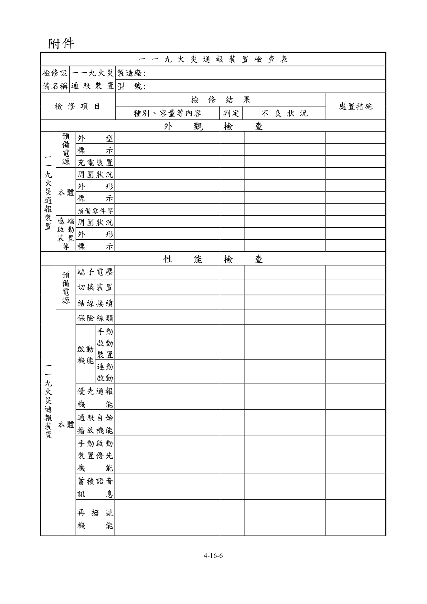
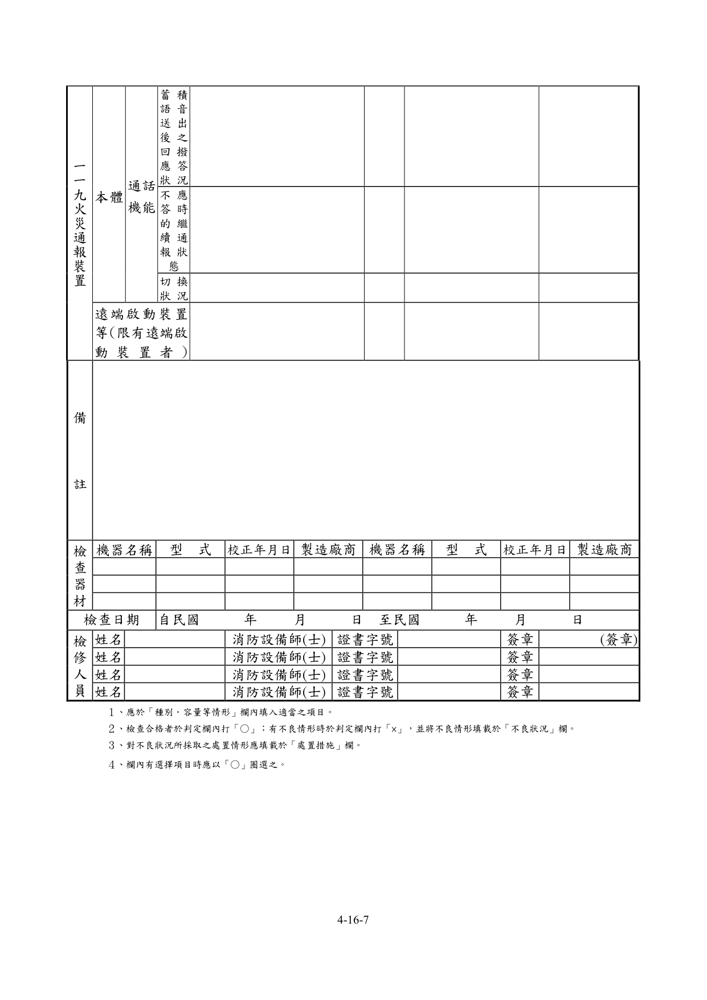

# 消防安全設備及必要檢修項目檢修基準　第十六章　一一九火災通報裝置

> 版本日期：民國 114 年 1 月 9 日（修正）｜來源：內政部主管法規共用系統（glrs.moi.gov.tw，GL001285）PDF 轉換。114-01-09 修正六章：第一、九、十三、十七、十九、二十七章（其中第一、九、十九章之修正內容在檢修報告表／檢查表與附圖）。
>
> 📌 **免責聲明**：本檔由官方來源轉換與人工整理，可能有轉換或辨識誤差。**一切以主管機關（全國法規資料庫、內政部消防署）公告之現行版本為準**；如有疑義，以官方公告為主。後續 AI 代理人引用本檔時應主動提醒使用者此點，並於必要時自行上網查證正確版本。
>
> 🛈 表格與表單已依原始 PDF 線框以 `scripts/pdf_tables_extract.py` 重新辨識為結構化內容（issue #41）：編號附表為 Markdown 表格或逐列樹狀展開；章末檢修報告表／檢查表**不辨識文字**，改以原始 PDF 頁面截圖（PNG）嵌入；內文附圖與表內圖示亦以 PDF 截圖嵌入（圖檔與本檔同資料夾、檔名前綴同本檔）。表格數值／○×標記可能有辨識誤差，關鍵判斷請核對原始 PDF。
>
> 📎 原始 PDF（全文，114-01-09 版）：[消防安全設備及必要檢修項目檢修基準.PDF](../原始檔案/消防安全設備及必要檢修項目檢修基準/消防安全設備及必要檢修項目檢修基準.pdf)

一、外觀檢查

（一） 預備電源

１、檢查方法

（１）外形以目視確認有無變形、腐蝕等。

（２）標示以目視確認蓄電池銘板。

（３）充電裝置以目視確認有無變形、腐蝕、發熱等。

２、判定方法

（１）外形

A.應無變形、腐蝕、龜裂。

B.電解液無洩漏、導線接續部應無腐蝕。

（２）標示應與裝置上標示之種別、額定容量及額定電壓相符。

（３）充電裝置

A.應無變形、損傷、明顯腐蝕等。

B.應無異常發熱。

（二） 一一九火災通報裝置(以下簡稱通報裝置)本體

１、檢查方法

（１）周圍狀況確認周圍有無檢查上或使用上之障礙。

（２）外形以目視確認有無變形、腐蝕等。

（３）標示確認各操作部分名稱、內容、操作方法概要及注意事項是否於本體上之明顯易見處以不易磨滅之方法標示。

（４）預備零件等確認是否備有保險絲、燈泡等零件及回路圖、操作說明書等。

２、判定方法

（１）周圍狀況應設在值日室等經常有人之場所，且應依下列保持檢查上及使用上必要之空間。

A.通報裝置應設在其門開關沒有障礙之位置。

B.通報裝置前應確保一公尺以上之空間。

C.通報裝置背面有門者，其背面應確保檢查必要之空間。

（２）外形應無變形、損傷、明顯腐蝕等。

（３）標示

A.應貼有認可標示。

B.各開關之名稱應無污損、不明顯部分。

C.標示應無脫落。

（４）預備零件等

A.應備有保險絲、燈泡等零件。

B.應備有回路圖、操作說明書等。

（三） 遠端啟動裝置等(限有遠端啟動裝置者)

１、檢查方法

（１）周圍狀況確認周圍有無檢查上或使用上之障礙。

（２）外形以目視確認有無變形、腐蝕及按鈕保護板有無損傷等。

（３）標示確認各操作部分名稱、內容、操作方法概要及注意事項是否於本體上之明顯易見處以不易磨滅之方法標示。

２、判定方法

（１）周圍狀況周圍應無檢查上或使用上之障礙。

（２）外形應無變形、腐蝕及按鈕保護板無損傷等。

（３）標示標示應無脫落、污損、不明顯部分。

二、性能檢查

（一） 預備電源

１、檢查方法

（１）端子電壓操作預備電源試驗開關，由電壓表確認。

（２）切換裝置由裝置內部之電源開關動作確認。

（３）結線接續以目視或螺絲起子確認有無斷線、端子鬆動等。

２、判定方法

（１）端子電壓電壓表之指示應正常(電壓表指針指在紅色線以上)。

（２）切換裝置自動切換預備電源，常用電源恢復時自動切換成常用電源。

（３）結線接續應無斷線、端子鬆動、脫落、損傷等。

３、注意事項

（１）充電回路使用電阻器者，因為會變成高溫，故不能以發熱即判定為異常，應以是否變色等來判斷。

（２）電壓表之指示不正常時，應考量是否為充電不足、充電裝置故障、電壓表故障。

（二） 通報裝置本體

１、保險絲類

（１）檢查方法確認有無損傷、熔斷等，及是否為所定之種類、容量。

（２）判定方法

A.應無損傷、熔斷。

B.應使用回路圖所示之種類、容量。

２、啟動機能

（１）手動啟動裝置

A.檢查方法操作手動啟動裝置，以通報裝置試驗機(以下稱試驗機)之消防機關側電話機確認啟動信號送出。

B.判定方法通報裝置動作時，以中文字幕或國語音效顯示。

（２）連動啟動(限與火警自動警報設備連動者)

A.檢查方法使與火警自動警報設備的探測器作動時連動啟動，以試驗機的消防機關側電話機確認啟動信號送出。

B.判定方法通報裝置動作時，以中文字幕或國語音效顯示。

３、優先通報機能

（１）檢查方法將連接通報裝置的電話回路以試驗機等方式成為通話狀態，操作手動啟動裝置或連動啟動(限與火警自動警報設備連動者)，確認啟動狀態。

（２）判定方法

由接續通報裝置的電話回路應正常送出蓄積語音，該電話回路連接的電話機有使用中時，應能強制切斷，優先送出蓄積語音。

４、通報自始播放機能

（１）檢查方法操作手動啟動裝置或連動啟動(限與火警自動警報設備連動者)，以試驗機之消防機關側電話機應答，確認通報開始狀況。

（２）判定方法蓄積語音需為自始撥放或一區段的蓄積語音須完整、明瞭及清晰。

５、手動啟動裝置優先機能(限與火警自動警報設備連動者)

（１）檢查方法連動啟動使蓄積語音送出時，操作手動啟動裝置後確認狀況。

（２）判定方法因連動啟動將一區段蓄積語音送出後，再操作手動啟動裝置，應能再送出蓄積語音。

６、蓄積語音訊息

（１）檢查方法操作手動啟動裝置或連動啟動(限與火警自動警報設備連動者)，以試驗機之消防機關側電話機，確認蓄積語音訊息。

（２）判定方法蓄積語音訊息內容應適切。

７、再撥號機能

（１）檢查方法使試驗機之消防機關側電話機於通話狀態，操作手動啟動裝置或連動啟動(限與火警自動警報設備連動者)，確認啟動狀況。

（２）判定方法應能自動再撥號。

８、通話機能

（１）蓄積語音送出後之回撥應答狀況

A.檢查方法操作手動啟動裝置或連動啟動(限與火警自動警報設備連動者)，俟一區段之蓄積語音送出並完成通話後，自動開放 20秒時間的電話回路，從試驗機消防機關側送出回撥信號，確認應答狀態。

B.判定方法可正確偵測回撥信號，確認信號時可以音效表示，通報裝置

側的電話機回撥時，其與試驗機之消防機關側電話機間應可相互通話。

（２）不應答時的繼續通報狀態

A.檢查方法操作手動啟動裝置或連動啟動(限與火警自動警報設備連動者)，確認消防機關側保持不應答時，確認一區段之蓄積語音的送出狀態。

B.判定方法從通報裝置應繼續送出蓄積語音。

（３）切換狀況

A.檢查方法操作手動啟動裝置或連動啟動(限與火警自動警報設備連動者)，於蓄積語音通訊中時，藉由手動操作切換電話回路為送話機側狀況。

B.判定方法以手動操作使蓄積語音通報停止，在試驗機的消防機關側電話機間應可相互通話。

（三） 遠端啟動裝置等(限有遠端啟動裝置者)

１、檢查方法操作手動啟動按鈕，確認啟動信號是否正常。

２、判定方法啟動信號應正常作動。有確認燈者，應正常亮燈。

### 附件　一一九火災通報裝置檢查表

> 本檢查表不辨識文字，改以原始 PDF 頁面截圖嵌入（共 2 頁，對應原 PDF 第 320–321 頁）；如需填寫或核對細部文字，請開啟[原始 PDF](../原始檔案/消防安全設備及必要檢修項目檢修基準/消防安全設備及必要檢修項目檢修基準.pdf)。

