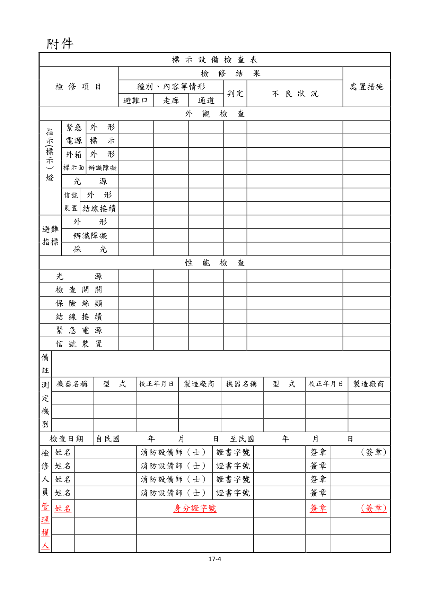
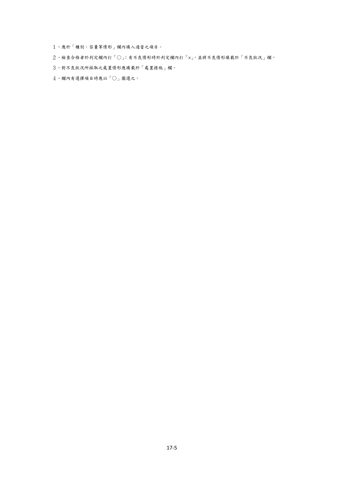

# 消防安全設備及必要檢修項目檢修基準　第十七章　標示設備

> 版本日期：民國 114 年 1 月 9 日（修正）｜來源：內政部主管法規共用系統（glrs.moi.gov.tw，GL001285）PDF 轉換。114-01-09 修正六章：第一、九、十三、十七、十九、二十七章（其中第一、九、十九章之修正內容在檢修報告表／檢查表與附圖）。
>
> 📌 **免責聲明**：本檔由官方來源轉換與人工整理，可能有轉換或辨識誤差。**一切以主管機關（全國法規資料庫、內政部消防署）公告之現行版本為準**；如有疑義，以官方公告為主。後續 AI 代理人引用本檔時應主動提醒使用者此點，並於必要時自行上網查證正確版本。
>
> 🛈 表格與表單已依原始 PDF 線框以 `scripts/pdf_tables_extract.py` 重新辨識為結構化內容（issue #41）：編號附表為 Markdown 表格或逐列樹狀展開；章末檢修報告表／檢查表**不辨識文字**，改以原始 PDF 頁面截圖（PNG）嵌入；內文附圖與表內圖示亦以 PDF 截圖嵌入（圖檔與本檔同資料夾、檔名前綴同本檔）。表格數值／○×標記可能有辨識誤差，關鍵判斷請核對原始 PDF。
>
> 📎 原始 PDF（全文，114-01-09 版）：[消防安全設備及必要檢修項目檢修基準.pdf](../原始檔案/消防安全設備及必要檢修項目檢修基準/消防安全設備及必要檢修項目檢修基準.pdf)

一、外觀檢查

（一）避難方向指示燈及出口標示燈

１、緊急電源（限內置型）

（１）檢查方法

A.外形確認是否有變形、損傷及顯著腐蝕之情形。

B.標示確認其標示是否正常。

（２）判定方法

A.外形

（A）應無變形、損傷或龜裂之情形。

（B）電解液應無洩漏，導線接頭應無腐蝕之現象。

B.標示應依所定之額定電壓及容量設置。

２、外箱及標示面

（１）檢查方法

A.外形以目視確認是否有變形、變色、脫落或污損之情形。

B.辨識上之障礙

（A）以目視確認其是否依規定之高度及位置設置。

（B）確認隔間牆、廣告物、裝飾物等有無造成視覺辨識上之障礙。

（２）判定方法

A.外形

（A）外箱及標示面，應無變形、變色、損傷、脫落或顯著污損之情形，且於正常之裝置狀態。

（B）避難方向指示燈所示之方向，其引導方向應無誤。

B.辨識上之障礙

（A）應設於規定之高度及位置。

（B）應無因建築物內部裝修，致設置位置不適當，且亦不得產生設置數量不足之情形。

（C）燈具周圍如有隔間牆、寄物櫃等時，不得因而造成視覺辨識上之障礙。

（D）燈具周圍應無雜亂物品、廣告板或告示板等遮蔽物。

３、光源

（１）檢查方法確認有無閃爍之現象，及是否正常亮燈。

（２）判定方法

A.應無熄燈或閃爍之現象

B.燈具內之配線不得於標示面上產生陰影。

４、信號裝置（閃滅、音聲引導、減光、消燈等功能動作之移報裝置）

（１）檢查方法

A.外形以目視確認有無變形、損傷或顯著腐蝕之情形。

B.結線接續以目視或螺絲起子確認有無斷線、端子鬆動、脫落、損傷等情形。

（２）判定方法

A.外形應無變形、損傷或顯著腐蝕之情形。

B.應無斷線、端子鬆動、脫落、損傷等情形。

（二）避難指標

１、檢查方法

（１）外形以目視確認有無變形、變色、脫落或污損之情形。

（２）辨識上之障礙

A.以目視確認是否依規定之高度及位置設置。

B.確認其有無因隔間等而造成視覺辨識上之障礙。

（３）採光確認其是否具有足供識別之採光。

２、判定方法

（１）外形標示板面之文字、色彩應無顯著之污損、脫落或剝離之現象，且能容易識別。

（２）視覺辨識上之障礙

A.應無因建築物內部裝修，致設置位置不適當，且亦不得產生設置數量不足之情形。

B.指標周圍如有隔間牆、寄物櫃等時，應無因而造成視覺辨識上之障礙。

C.指標周圍應無雜亂物品、廣告板或告示板等遮蔽物。

（３）採光應具有足供識別之採光。

二、性能檢查（避難指標除外）檢查方法

１、光源以目視確認其燈泡本身有無污損、劣化等現象。

２、檢查開關

（１）以目視確認有無變形及端子有無鬆動。

（２）由檢查開關進行常用電源之切斷及復舊之操作，確認其切換功能是否正常。

３、保險絲類確認有無損傷、熔斷之現象，及是否為所定種類及容量。

４、結線連接以目視或螺絲起子確認其有無斷線、端子鬆動等現象。

５、緊急電源確認於緊急電源切換狀態時有無正常瞬時亮燈。

６、信號裝置（閃滅、音聲引導、減光、消燈等功能動作之移報裝置）以手動或火警自動警報設備之探測器動作等方法確認功能正常。

（二）判定方法

１、光源應無污損或顯著之劣化情形。

２、檢查開關

（１）應無變形、損傷、或端子鬆動之情形。

（２）切斷常用電源時，應能自動切換至緊急電源，即時亮燈；復舊時，亦能自動切換回常用電源。

３、保險絲類

（１）應無損傷、熔斷之情形。

（２）應為所定之種類及容量。

４、結線連接應無斷線、端子鬆動、脫落、損傷之情形。

５、緊急電源應無不亮燈或閃爍之情形。

６、信號裝置（閃滅、音聲引導、減光、消燈等功能動作之移報裝置）

（１）燈光閃滅正常。

（２）音聲鳴動正常。

（３）點燈正常。（限消燈型或減光型）

（三）注意事項

１、以緊急電源亮燈時，會出現比一般常用電源亮燈時，光線變為有些昏暗現象，係屬正常範圍。

２、應於檢查後復歸為一般常用電源。

### 附件　標示設備檢查表

> 本檢查表不辨識文字，改以原始 PDF 頁面截圖嵌入（共 2 頁，對應原 PDF 第 325–326 頁）；如需填寫或核對細部文字，請開啟[原始 PDF](../原始檔案/消防安全設備及必要檢修項目檢修基準/消防安全設備及必要檢修項目檢修基準.pdf)。

