# 消防安全設備及必要檢修項目檢修基準　第十八章　避難器具

> 版本日期：民國 114 年 1 月 9 日（修正）｜來源：內政部主管法規共用系統（glrs.moi.gov.tw，GL001285）PDF 轉換。114-01-09 修正六章：第一、九、十三、十七、十九、二十七章（其中第一、九、十九章之修正內容在檢修報告表／檢查表與附圖）。
>
> 📌 **免責聲明**：本檔由官方來源轉換與人工整理，可能有轉換或辨識誤差。**一切以主管機關（全國法規資料庫、內政部消防署）公告之現行版本為準**；如有疑義，以官方公告為主。後續 AI 代理人引用本檔時應主動提醒使用者此點，並於必要時自行上網查證正確版本。
>
> 🛈 表格與表單已依原始 PDF 線框以 `scripts/pdf_tables_extract.py` 重新辨識為結構化內容（issue #41）：編號附表為 Markdown 表格或逐列樹狀展開；章末檢修報告表／檢查表**不辨識文字**，改以原始 PDF 頁面截圖（PNG）嵌入；內文附圖與表內圖示亦以 PDF 截圖嵌入（圖檔與本檔同資料夾、檔名前綴同本檔）。表格數值／○×標記可能有辨識誤差，關鍵判斷請核對原始 PDF。
>
> 📎 原始 PDF（全文，114-01-09 版）：[消防安全設備及必要檢修項目檢修基準.pdf](../原始檔案/消防安全設備及必要檢修項目檢修基準/消防安全設備及必要檢修項目檢修基準.pdf)

一、外觀檢查

（一）周圍狀況

１、設置地點

（１）檢查方法確認在避難時，是否能夠容易接近。

（２）判定方法

A.應無因設置後之改裝被變更為個人房間或倉庫等，而不容易接近。

B.設置之居室，其出入口應無加鎖。

C.應無放置妨礙接近之物品。

D.應無在收藏箱附近放置物品，使該器具之所在不易辨別。

E.應無擅自不當變更收藏箱之位置。

２、操作面積

（１）檢查方法確認附近有無妨礙器具操作之障礙物，及是否確保操作所需之面積。

（２）判定方法

A.應無妨礙操作之障礙物，並依表 18-1 確保各器具之操作面積。

B.在操作面積內，除了輕量而容易移動之物品外，不得放置會妨礙之大型椅子、桌子、書架及其他物品等。

C.在收藏箱上，應無放置妨礙操作之物品。

表 18-1     操作面積

- **救助袋**：寬1.5m，長1.5m（含器具所佔之面積）。但無操作障礙，且操作面積在2.25m²以上時，不在此限。
  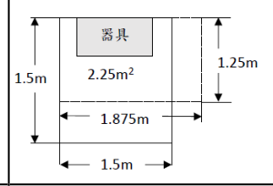
- **緩降機／避難梯／避難繩索／滑杆**：0.5m²以上（不含避難器具所佔面積），但邊長應為60cm 以上。
  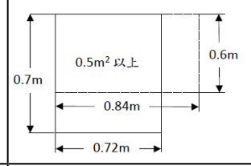
- **滑台／避難橋**：依避難器具大小及形狀留置之。

（３）注意事項操作面積的大小未符合表 18-1 時，應參照原核准圖說，確認是否與設置時之狀態相同。

３、開口部

（１）檢查方法確認安裝器具之開口部，能否容易且安全地打開，及是否確保必要之開口面積。

（２）判定方法

A.開口部應無加設固定板、木條等。

B.制動器、門軸轆等應無生鏽，且開口部應能容易開、關。

C.打開門、蓋後，其制動器應能確實動作，不會因振動、衝擊等而鬆開。

D.開口部附近應無書架、展示台等堵塞開口部。

E.由地板面至開口部下端之高度應在 150cm 以下。

F.開口部太高可能形成避難上之障礙時，應設有固定式或半固定式之踏台。

G.踏台等應保持能用之狀態。

H.開口部應能符合表 18-2 所示之大小。

表 18-2   開口部之大小

- **救助袋**：高60cm 以上。寬60cm 以上。
- **緩降機／避難梯／避難繩索／滑杆**：高80cm以上，寬50cm以上；或高100cm以上，寬45cm以上。
- **滑台**：高80cm 以上；寬為滑台最大寬度以上。
- **避難橋**：高180cm 以上。寬為避難橋最大寬度以上。

（３）注意事項開口部之大小未符合表 18-2 時，應參照原核准圖說，確認是否與設置時之狀態相同。

４、下降空間

（１）檢查方法確認有無妨礙下降之物品，及有無確保下降必要之空間。

（２）判定方法

表 18-3     下降空間

- **救助袋（斜降式）**：救助袋下方及側面，在上端25度，在下端35度方向依下圖所圍範圍內。但沿牆面使用時，牆面側不在此限。
  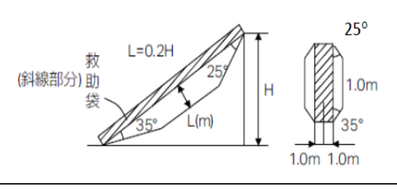
- **救助袋（直降式）**：１、救助袋與牆壁之間距為30cm 以上。但外牆有突出物且突出物距救助袋支固器具裝設處在 3m 以上時，應距突出物前端50cm 以上。２、以救助袋中心，半徑1公尺圓柱形範圍內。
  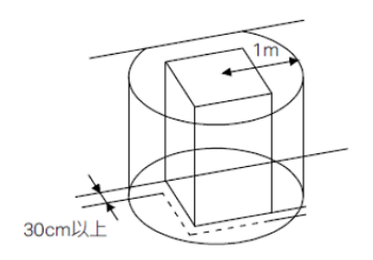
- **緩降機**：以器具中心半徑0.5m 圓柱形範圍內。但突出物在10cm 以內，且無避難障礙者，或超過10cm 時，能採取不損繩索措施者，該突出物得在下降空間範圍內。
  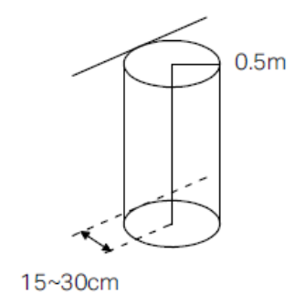
- **避難梯**：自避難梯兩側豎桿中心線向外20cm 以上及其前方65cm 以上之範圍內。
  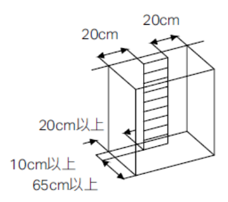
- **滑台**：滑面上方1m 以上及滑台兩端向外20cm 以上所圍範圍內。
  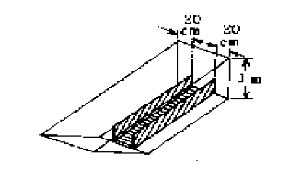
- **避難橋**：避難橋之寬度以上及橋面上方2m 以上所圍範圍內。
  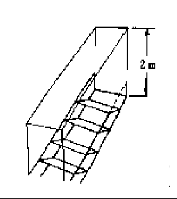
- **避難繩索／滑杆**：應無避難障礙之空間。

A.下降空間應能符合表 18-3 所示之大小。

B.應無因新設招牌或樹木成長等而形成之障礙。

C.有電線時，應距離下降空間 1.2m 以上。但是，如果該架設在空中的電線部分有絕緣措施，而被認定為安全時，不在此限。

（３）注意事項下降空間之大小，未符合表 18-3 時，及多人數用之緩降機應參照原核淮圖說，確認是否與設置時之狀態相同。

５、下降空地

（１）檢查方法確認有無避難障礙，及是否確保必要之下降空間。

（２）判定方法

A.下降空地應能符合表 18-4 所示之大小。

B.下降空地應無障礙物。

C.應有寬一公尺以上之避難上有效通路，通往廣場、道路等。

（３）注意事項下降空地的大小未符合表 18-4 時，及多人使用之緩降機，應參照試驗結果報告表，或根據是否與設置時之狀態相同而判定。

表 18-4      下降空地

- **救助袋（斜降式）**：救助袋最下端起2.5m 及中心線左右1m 以上所圍範圍。
  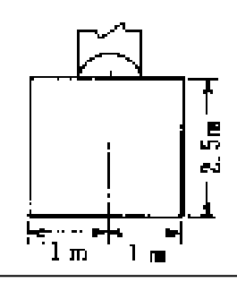
- **救助袋（直降式）**：下降空間之投影面積。
  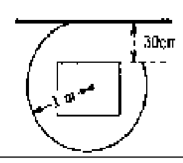
- **緩降機**：下降空間之投影面積。
  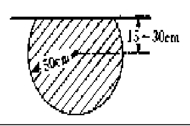
- **避難梯**：下降空間之投影面積。

 A:避難梯之寬度
  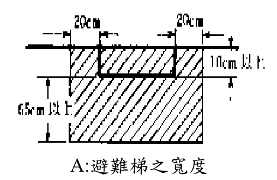
- **滑台**：滑台前端起1.5m 及其中心線左右50cm 所圍面積。
  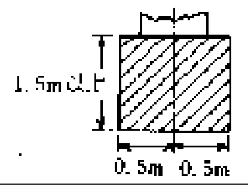
- **避難橋／避難繩索／滑杆**：應無避難障礙之空地。

（二）標示

１、檢查方法以目視確認有無變形、脫落、污損等。

２、判定方法

（１）標示應為表 18-5 所示者。

（２）應無變形、損傷、脫落、污損等。

（３）應無因其他物品而看不到。

表 18-5   標示

| 避難器具標示種類 | 設置處所 | 尺寸 | 顏色 | 標示方法 |
|---|---|---|---|---|
| 設置位置 | 避難器具或其附近明顯易見處 | 長:36cm 以上寬:12cm 以上 | 白底黑字 | 字樣為「避難器具」，每字五平方公分以上。但避難梯等較普及之用語，得直接使用其名稱為字樣 |
| 使用方法 | 避難器具或其附近明顯易見處 | 長:60cm 以上寬:30cm 以上 | 白底黑字 | 標示易懂之使用方法，每字一平方公分以上。 |
| 避難器具指標 | 通往設置位置之走廊、通道及居室之入口 | 長:36cm 以上寬:12cm 以上 | 白底黑字 | 字樣為「避難器具」，每字五平方公分以上。 |

二、性能檢查

（一）避難梯

１、器具本體

（１）檢查方法

A.如圖 18-1 所示之懸吊梯，須將折疊部或捲繞部展開，或將伸縮部拉開到能夠檢查各部分之程度，確認有無損傷。

圖 18-1   懸吊梯

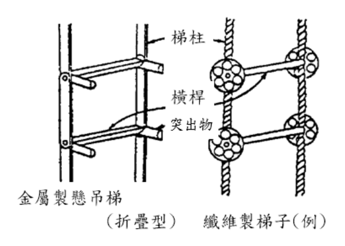

B.如圖 18-2 所示之固定收藏型者，須解開金屬扣，把梯子打開來，確認有無損傷等。

圖 18-2 金屬製固定梯（例）

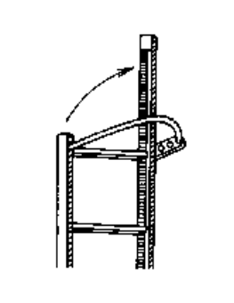

（２）判定方法

A.梯柱、橫桿及突出物應無變形、損傷、生鏽、腐蝕等，及橫桿之應無沒有異常。

B.鏈條、焊接處應無裂痕、損傷及鋼繩、纖維製繩應無綻開、斷線。

C.接合部之鉚釘應無裂開、損傷等。

D.螺栓、螺帽在有防止鬆動之措施，纖維製繩與橫桿之結合部應堅固而未鬆弛。

E.轉動部、折疊部、伸縮部之動作應順暢。

F.固定收藏型者，金屬扣之動作應順暢圓滑。

２、固定架及固定部

（１）檢查方法

A.懸吊型如圖 18-3 所示之懸吊用具，平時由固定架拆下被收藏者，應將懸吊用具安裝在固定架上，確認有無損傷等。

圖18-3懸吊用具（例）

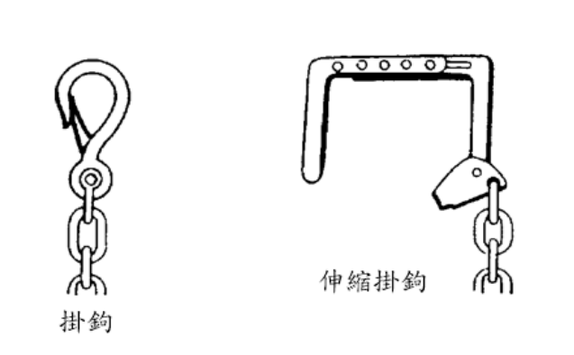

B.固定收藏型以扭力扳手確認固定及安裝狀態有無異常。

（２）判定方法

A.固定架及其材料應無明顯變形、損傷、生鏽、腐蝕等，且堅牢地安裝著，螺栓、螺帽應無鬆弛或脫落。

B.與本體之接合部，須堅固而無鬆弛。

C.懸吊用具，應確實安裝在固定部材，或成容易安裝之狀態。

D.懸吊用具各部份應無變形、損傷、生鏽、明顯腐蝕等，

（３）注意事項螺帽之栓緊轉矩，應依照表 18-6。

表 18-6   螺帽之栓緊強度

| 螺紋標稱 | 栓緊強度（轉矩值 k g - c m ） |
|---|---|
| M10×1.5 | 150-250 |
| M12×1.75 | 300-450 |
| M16×2 | 600-850 |

３、收藏狀況

（１）檢查方法以目視及操作確認收藏狀況有無異常。

（２）判定方法

A.懸吊型

（A）收藏箱應無破損、生鏽、明顯腐蝕、漏水等，蓋子亦能容易打開取出梯子。

（B）懸吊用具應以正確方向安裝在固定部，或呈能容易安裝之狀態。

B.固定收藏型金屬扣應能確實鉤住。

（二）緩降機

１、器具本體

（１）調速器

A.外觀事項

（A）檢查方法以目視確認圖 18-4 所示之緩降機有無損傷等。

圖18-4緩降機

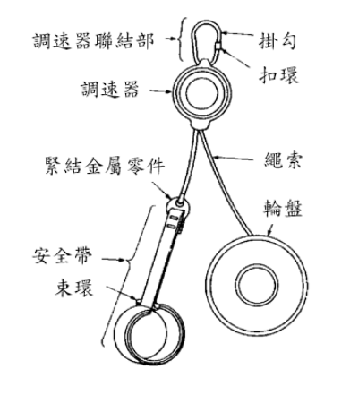

（B）判定方法

a.應無明顯衝擊痕跡及其他損傷等。

b.封緘部應無異常。

c.小螺絲、螺帽、柳釘等應無鬆動及脫落。

d.應無明顯生鏽。

e.禁示加油者應無加油痕跡。

f.油壓式者應無漏油。

B.動作事項

（A）檢查方法將調速器固定，以手操作使繩子來回行走，確認其動作狀況有無異常。

（B）判定方法

a.繩子應能順暢地行走。

b.應有適當阻力感，而非不穩定的阻力感。

（C）注意事項

a.外觀事項在外觀事項有異常者，因在動作時未必感到異常，所以仍應判定為有使內部發生異常之原因。

b.動作事項操作時繩索不能行走者，應判定為不良，行走時有不穩定之阻力感者，亦應判定為性能及強度上有缺陷。

c.一般事項由於緩降機之器具主體，於個別檢定合格時就以封緘（鉚住等）使之不能分解，因此檢查結果，認為對性能及強度有影響之異常時，應聯絡器具之製造廠商，進一步確認有無異常，並追究其原因及進行汰換整修。

（２）調速器之連結部（含掛鉤）

A.檢查方法以目視及操作確認有無損傷等。

B.判定方法

（A）應無明顯損傷及生鏽。

（B）動作部份應能順暢地動作。

（C）安全環等附屬零件應無異常及遺失。

（３）繩子

A.檢查方法以目視確認有無損傷等。

B.判定方法

（A）繩子之長度應能符合設置地點之長度。

（B）棉織被覆部份到鋼索應無損傷、明顯斷線及磨損，亦無因受潮而引起老化及芯心鋼索生鏽等。

（４）安全帶

A.檢查方法以目視確認有無損傷等。

B.判定方法

（A）應無附著會引起明顯損傷及老化之藥品、油、鏽、霉及其他會減低其強度之物。

（B）應無因明顯受潮所引起之腐蝕等。

（C）應有符合最多使用者人數之安全帶緊結在繩索末端。

（５）繩子與安全帶之緊結金屬零件

A.檢查方法以目視確認有無損傷等。

B.判定方法

（A）緊結金屬應無明顯損傷、生鏽等強度上之異常狀況。

（B）應無被分解之痕跡。

２、支固器具及固定部份

（１）支固器具

A.檢查方法以目視及操作確認有無損傷等。

B.判定方法

（A）塗裝、電鍍等應無明顯剝落。

（B）構成零件應無明顯變形、腐蝕、龜裂等之損傷。

（C）螺栓、螺帽應無鬆弛或脫落。

（D）焊接部份應無明顯生鏽、龜裂等。

（E）支固器具應能依使用方法順暢地動作。

（２）固定部

A.檢查方法以目視及扭力扳手確認有無異常。

B.判定方法

（A）螺栓、螺帽沒有鬆動或脫落。

（B）穿孔錨栓工法之錨栓所使用的螺帽之拴緊，應符合表 18-6之規定。

（C）固定基礎應無因龜裂等而有破損。

（D）固定安裝部分應無明顯腐蝕、生鏽、變形、龜裂等，對強度有影響之異常發生。

（３）收藏狀況

A.檢查方法以目視及操作確認收藏狀況有無異常。

B.判定方法

（A）保管箱應放在所定之位置。

（B）於適合器具本體之保管箱內，應整理成使用時無障礙之狀態收藏。

（C）繩子應以未扭曲狀態，被捲在「輪盤」收藏。

（D）保管箱應無明顯變形、破損等，及內部應無灰塵、濕氣等。

（E）支固器具應以使用時無障礙之狀態收藏。

C.注意事項應使輪盤本身轉動來收繩子，以免扭曲繩索。

（三）救助袋（斜降式及直降式通用）

１、袋本體

（１）檢查方法以目視及手觸摸確認圖18-5所示之袋本體有無損傷等。

（２）判定方法

A.袋體用布及展開部材（指繩索、皮帶等。以下相同。）應無洞、割傷、裂傷、裂開等損傷及明顯磨損（由於磨擦而產生起毛，使該部份變弱。以下相同）。

B.袋體用布及展開零件應無綻開等。

圖18-5   救助袋(例)

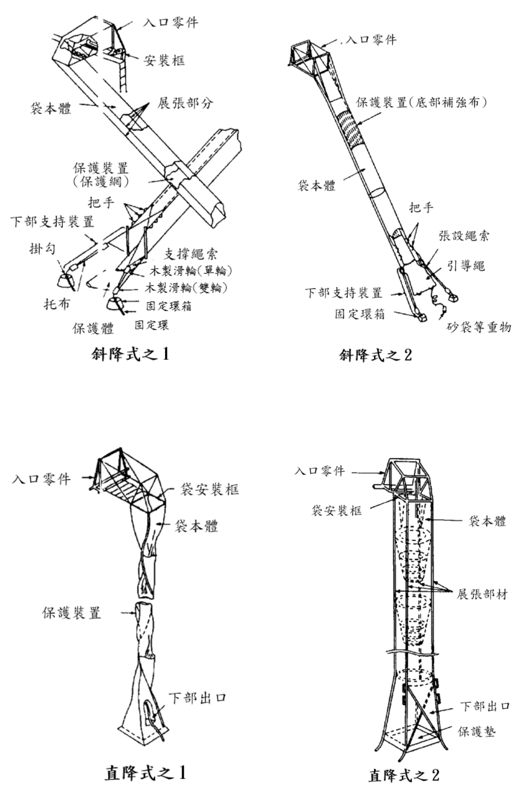

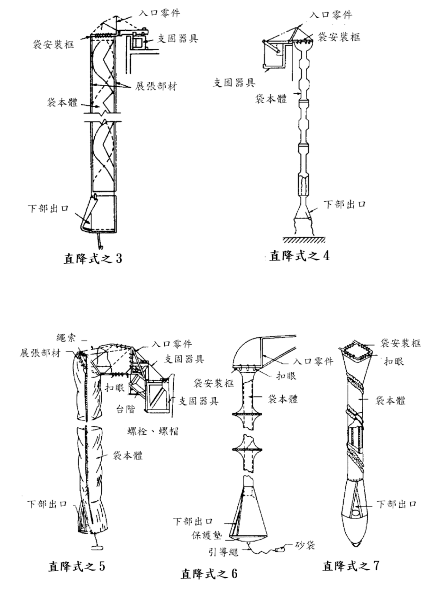

C.縫合部份應無縫線之斷線，以及袋體用布與展開部材的結合部之綁緊線應無鬆弛。

D.袋本體應無明顯受潮或濕悶。

E.袋子的用布應無明顯變色。

F.袋本體應無附著藥品、油脂、鏽、霉及其他會減低強度之物。

G.使用扣眼結合袋本體與入口零件者，扣眼應無損傷及脫落。而使用縫線時，應無斷線及明顯磨損，且用布的針眼應無斷裂。

H.展開部材與入口零件的結合處，應無鬆動、損傷等。

I.把手應無損傷及明顯磨損。（限斜降式）（限斜降式）

J.為保護底部之防止掉落用的網及用布，應無損傷。

K.下部出口與保護襯墊之結合應堅固，縫線應無斷線。

（３）注意事項

A.磨損引起之起毛，是由於股線斷所引起，如果起毛多將會引起用布及展 張部材的損傷。所以必須注意。

B.所謂「濕悶」是指含有水份，而且稍帶熱的狀態，依用布、展張部材、縫線等材質種類，有時會由於水份及溫度而對強度等有不良影響，故須注意。

C.變色有單純污髒、不純物的附著及濕悶等三種因素引起，除了單純的污損引起者外，有時材質種類亦會成為老化、腐蝕等之原因，故須注意。

D.用布、展開部材、縫線等，依材質種類之不同，有的耐藥品性很弱，故須注意。

２、支固器具及固定部

（１）本體

A.支固器具及入口零件

（A）檢查方法以目視、操作及扭力扳手確認圖18-6所示之支固器具及入口零件有無損傷等、及是否能正常動作。

圖18-6   支固器具及入口零件之例

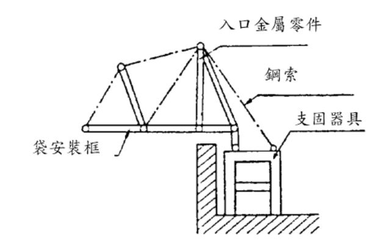

（B）判定方法

a.支固器具應無變形、龜裂、腐蝕及損傷。

b.螺栓、螺帽等之固定零件應無龜裂、損傷等。

c.螺栓、螺帽應無鬆動或脫落。

d.固定部（木材、鋼筋、鋼骨混凝土等）應無腐蝕、生鏽、變形、龜裂等對強度有影響之異常發生。

e.固定基礎應無因龜裂而引起之破損。

f.穿孔錨栓工法之錨栓所使用螺帽之栓緊，應符合表 18-6之栓緊轉矩。

g.入口零件及入口零件與支固器具之轉動部份應圓滑順暢。

h.入口零件，鋼索等應無影響強度之變形、龜裂、腐蝕、損傷、永久歪曲等。

i.鋼索的塑膠等被覆應無破損而致鋼索外露。

j.入口零件與支固器具之結合部，應無明顯不穩定及過大之橫向空隙。

k.以電動使入口零件動作者，其動作應正常。

B.下部支持裝置（限斜降式）

（A）檢查方法以目視如圖18-7所示之張設操作，確認有無損傷等。

圖18-7   固定方法之例

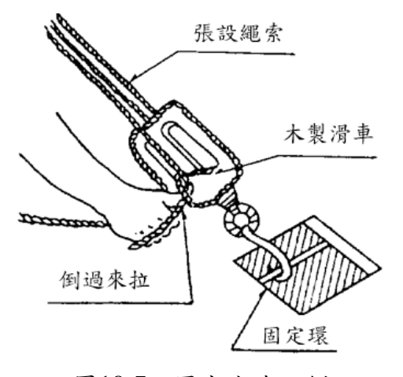

（B）判定方法

a.張設繩索、滑輪、掛鉤等應無龜裂、腐蝕、損傷等。

b.張設繩索及張設繩索與滑輪及掛鉤，應無纏繞、糾結等。

c.滑輪之轉動應圓滑順暢。

d.如圖 18-8 所示滑輪之捲緊繩索等，應無鬆動、損傷、腐蝕等。

圖18-8   捲緊繩索之例

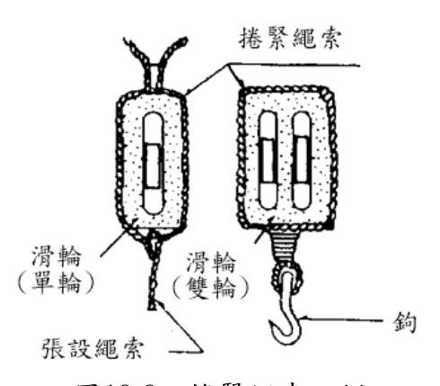

C.引導繩

（A）檢查方法以目視確認如圖18-9所示之引導繩有無損傷等。

（B）判定方法

a.引導繩應確實安裝在袋本體或下部支持裝置。

b.引導繩的前端，應確實有砂袋等重物。

c.砂袋等重物，應有夜間容易識別之措施。

圖18-9         引導繩

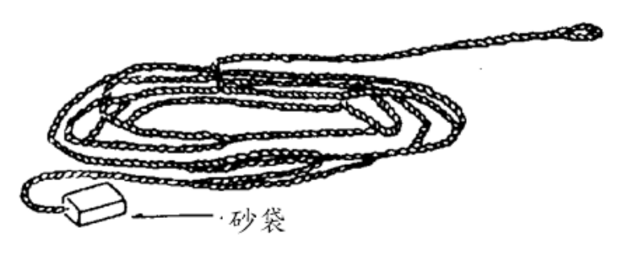

d.使用砂袋時，應無漏砂。

（２）固定環（限斜降式）

A.檢查方法確認如圖18-10所示固定環有無變形、損傷等，並須確認保護蓋是否能容易打開。

圖18-10     固定環之例

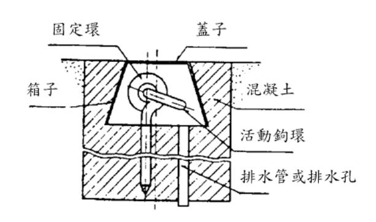

B.判定方法

（A）應無明顯腐蝕、破損及變形。

（B）保護蓋應能容易打開。

（C）應無被砂土等埋沒。

（D）保護蓋應無遺失。

（E）保護蓋上之樓層標示，應無因污垢、磨損等而變為不易判別。

３、收藏狀態

（１）收藏方法

A.檢查方法以目視及操作確認收藏狀態有無異常。

B.判定方法

（A）應安裝在開口部收藏箱。

（B）收藏箱等應能容易打開。

（C）應依下列順序，整齊地收藏。

a.引導繩須整理得能順利地伸張。

b.下部支持裝置之張設繩索、滑輪、掛鉤不得糾纏在一起收藏。（限斜降式）

c.袋本體，應從上部反覆折疊收起，使下部出口成為表面，斜降式者應整理下部支持裝置，以皮帶栓緊後，引導繩須放在其上。

d.收藏箱之把手等，應無掉落及損傷。

（２）通風性等

A.檢查方法

（A）通風性應良好，以目視確認袋本體是否直接碰到地板。

（B）以目視確認是否有防止老鼠等侵入之措施。

B.判定方法

（A）須通風良好，收藏箱內沒有明顯的濕氣。

（B）袋本體應有不會直接碰到地板之措施。

（C）有老鼠等侵入之虞時，須有防止措施。

（四）滑台

１、器具本體

（１）檢查方法以目視及操作確認圖18-11所示之滑台有無損傷等，動作狀態有無異常。

（２）判定方法

A.半固定式者抬起下端部份之金屬扣，應能以簡單之操作解開，但不得因振動、衝擊等而容易脫落，且應無變形、損傷、生鏽、腐蝕等。

B.底板及側板之表面，應平滑且無平面高低差、空隙等，同時應無變形、損傷、生鏽、腐蝕等。但是，滾筒型的滑落面得有不妨礙滑落之空隙。

C.滑面的斜度（螺旋狀者為滑面寬度中心線之斜度），應為 25 至35 度。

圖18-11   滑台

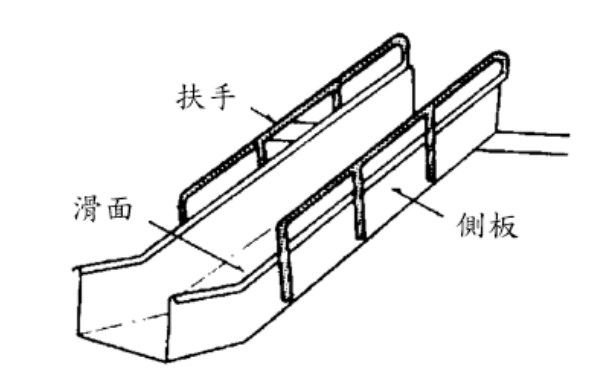

２、固定部

（１）檢查方法以目視及扭力扳手確認固定部及安裝狀態有無異常。

（２）判定方法

A.固定部應堅固而無鬆動、且應無變形、損傷、生鏽、腐蝕等。

B.螺栓、螺帽應無鬆動或脫落。

（３）注意事項螺帽之拴緊轉矩，應依表18-6所示之規定。

（五）滑杆

１、檢查方法以目視確認固定狀態有無異常。

２、判定方法

（１）器具本體滑杆應為均勻圓桿表面平滑，且應無明顯變形、損傷、生鏽、腐蝕等。

（２）支持部滑杆上、下端應固定良好，且應無明顯變形、損傷、生鏽、腐蝕等。

避難繩索

１、器具本體

（１）檢查方法以目視及操作確認有無變形、腐蝕等。

（２）判定方法

A.應無變形、損傷、綻開、明顯受潮等。

B.結合部及結扣應緊密結合。

２、固定架及固定部

（１）檢查方法以目視確認圖18-12例所示之固定架及固定部有無損傷。

圖18-12 固定架及固定部（例）

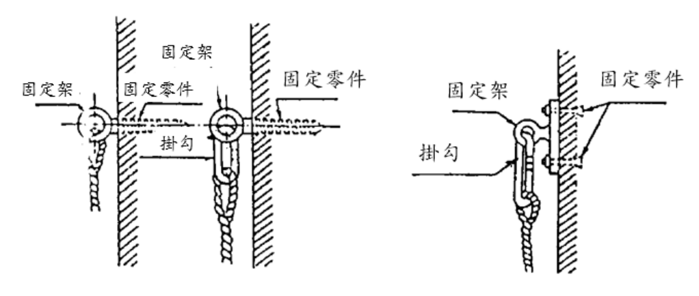

（２）判定方法

A.掛鉤應無明顯變形、損傷、生鏽、腐蝕等，且能容易、確實安裝在固定零件上。

B.固定架及固定零件應無明顯變形、損傷、生鏽、腐蝕等，能堅牢地安裝在安裝部，螺栓、螺帽應無鬆動或脫落。

３、收藏狀況

（１）檢查方法以目視確認收藏狀況有無異常。

（２）判定方法

A.收藏箱、收藏袋等應設置在開口部附近，且應以容易取出繩索之方式收藏。

B.收藏箱、收藏袋等應無明顯損傷、腐蝕等。

（七）避難橋

１、器具本體

（１）檢查方法以目視及操作確認圖18-13所示之避難橋有無損傷。

圖18-13   避難橋

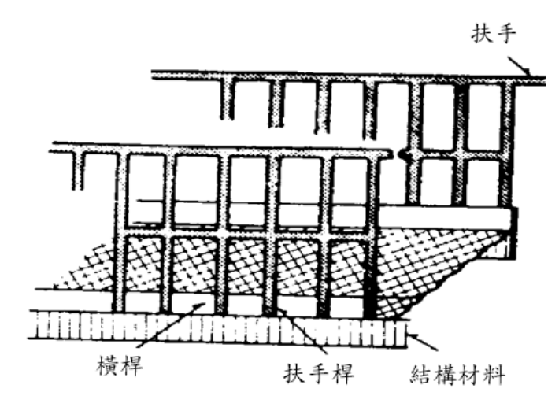

（２）判定方法

A.各部分應無明顯變形、損傷、生鏽、腐蝕等。

B.應具有安全上充份之掛架長度。

C.接合部應無龜裂、變形、損傷等。

D.地板面應無空隙。有斜度之地板其止滑部份，應無明顯之磨損等。

２、固定部

（１）檢查方法以目視確認安裝狀態有無異常。

（２）判定方法固定部應堅固而無鬆動。

三、綜合檢查綜合檢查是在完成外觀檢查及性能檢查之後實施，檢查時應使避難器具成使用狀態，確認其性能是否正常。

（一）避難梯

１、下降準備

（１）檢查方法

A.懸吊型者，應把懸吊用具安裝在支固器具上，鬆開金屬扣，使梯子從開口部放下，確認伸長狀態有無異常。

B.固定收藏型者，應鬆開金屬扣，確認梯子之展開狀態有無異常。

（２）判定方法

A.懸吊型者，梯子之全長應能順利伸長，突起向牆壁方向，牆壁與橫桿之間隔應有十公分以上，梯柱成垂直，橫桿成水平。

B.固定收藏型者，被收藏之梯柱應能順利展開，下端碰到堅固的地面，梯柱成垂直，橫桿成水平。

２、下降

（１）檢查方法確認下降時，各部份之狀態有無異常。

（２）判定方法在下降時應無障礙。懸吊型者，牆壁與橫桿之間隔應有十公分以上，固定收藏型者，梯柱及橫桿應無明顯地搖動。

３、收藏

（１）檢查方法確認在下降後，懸吊型者是否能拉上到開口部，或將上部以繩索綁起來吊到地上再恢復原狀，固定收藏型者是否能從開口部或地上恢復原狀。

（２）判定方法

A.懸吊型者，各部分應無變形，且能順暢地恢復原狀。

B.固定收藏型者，各部分應無變形，且能順利收藏，金屬扣亦能確實扣上。

（二）緩降機

１、下降準備

（１）檢查方法將支固器具設定成使用狀態，把緩降機裝上後確認能否安全下降。

（２）判定方法

A.拴緊緩降機連結部（掛鉤等）之環扣，應能完全地安裝在支固器具。

B.把繩子展開時，應無纏繞等，而能成直線垂下，繩子之長端應能到達地面上。

２、下降

（１）檢查方法依下列確認能否正常下降。

A.把附在短邊繩子之安全帶從頭部套入，將胸部之以束環栓緊。

B.握住兩條繩索（有制動器者操作制動器），走出外牆壁把體重加在繩子垂下去。

C.面向壁面，等身體穩定後把手從繩子處放開而下降。

D.下降完畢後，解開安全帶。

（２）判定方法

A.測量下降距離及下降時間，計算出下降速度，應在規定的下降速度範圍內。（平均的降落速度應在每秒 80 至 100cm，最大下降速度應在每秒 150cm 以內。）

B.下降後，實施前面所提之性能檢查，器具本體、支固器具等應無異常。

（３）注意事項

A.在剛要下降前，如果使下降一邊之繩索放鬆，將會使繩子受到激烈的負載，故須小心。

B.使用多人數用之緩降機時，須同時準備好下降姿勢後，再開始下降。

３、收藏

（１）檢查方法下降後，確認能否恢復原狀。

（２）判定方法各部份應無變形且能順暢地恢復原狀。

（３）注意事項在捲取繩子時，應使輪盤本身轉動而捲取繩子，以避免繩子扭曲。

救助袋

１、斜降式救助袋

（１）下降準備

A.檢查方法依下列確認是否能安全下降。

（A）上部檢查者之程序。

a.打開收藏箱。

b.解開引導繩之束結，拿起砂袋投下。

c.解開固定袋本體之皮帶。

d.等候地上檢查者之信號，使袋本體下降。

e.袋本體完成下降後，拉起入口零件。

（B）地上檢查者之程序

a.接受引導繩。

b.拉引導繩使袋本體不會卡到窗子或屋簷，而使袋本體下降。

c.打開要降落袋子之固定環蓋子。

d.把下部支持裝置的張設繩索前端之掛鉤掛在固定環，將張設繩索末端穿過滑輪之繩索中間，充份拉緊使袋本體的下部出口大約離地面 50 公分至 100 公分，將張設繩索倒拉而將此繩索放滑輪的繩索間固定。

B.判定方法

（A）放進收藏箱的狀況及滾筒的動作須順暢。

（B）引導繩應能確實安裝在袋本體或下部支持裝置。

（C）將袋子展開時，展開零件與入口零件之結合部，應無明顯伸長。（當袋本體有負載時，力的作用會不均衡，故須注意）

（D）袋本體的用布與展開部材之結合部，應無明顯磨損。

（E）袋本體與入口零件之結合部，應無破損及斷線。

（F）入口零件應能容易拉起。

（G）把袋子展開時，袋子應無妨礙下降之扭曲、一邊鬆動等變形之狀態。（下部出口與基地地面間，應有適當之間隔。）

（２）下降

A.檢查方法依下列確認是否能正常下降。

（A）要下降時，下降者須先與地上檢查者打信號，然後再下降。

（B）下降者先把腳放在階梯上，使腳先進入袋安裝框，調整好姿勢再下降。

（C）下降姿勢應依照使用方法下降。（因為下降時的初速愈快，下降速度會愈大而危險，因此絕對不可以加反作用而下降。）

B.判定方法

（A）下降應順暢。

（B）下降速度應適當正常。

（C）下降時之衝擊應緩慢。

C.注意事項

（A）為期綜合檢查能確實而仔細，應在上部（下降口）和地上（逃出口）各配置一名以上之檢查人員。

（B）為了減少身體之露出部份，檢查者應穿戴手套、工作服（長袖）等，以防止危害。

（C）由於袋本體只要拉出前端，剩餘部份會因本身重量自動降落，所以要注意不可讓手或衣服被捲進去。

（３）收藏

A.檢查方法依下列確認完成下降後，是否能恢復原狀。

（A）拉起之程序地上檢查者把支撐繩索放鬆至最大限長度，蓋上固定環的蓋子。

（B）地上檢查者消除支撐繩索的纏繞糾結，將下部支持裝置依各種袋子種類收藏，或把引導繩安裝在下部支持裝置前端的鉤子。

（C）上部檢查者與地上檢查者協力把袋本體拉上。（地上檢查者在開始拉上時，應拿著引導繩加以引導，以免袋本體卡到窗子或屋簷等障礙物。）

（D）引導繩應依順序拉上去，打捆成直徑約二十五公分的圓圈。

B.收藏之程序

（A）把安裝具的台階折疊起來。

（B）將入口零件拉進去折疊起來。

（C）將袋本體從上部反覆折疊，收進安裝具使之能在使用時得以圓滑地伸張。

（D）整理好之下部支持裝置和引導繩索，放在使用時容易取出之位置，將袋本體用皮帶栓緊。

（E）把收藏箱安裝好。

C.判定方法各部份應無變形等，且應能順利地恢復原狀。

D.注意事項在檢查後之收藏，應成使用時無障礙之收藏狀態。

２、直降式救助袋除了斜降式的下部支持裝置及固定環之項目外，關於操作展開、下降、拉上及收藏，應比照斜降式之檢查方法、判定方法及應注意事項加以確認。而直降式之下部出口距基地面之高度，應依救助袋之種類，確認各別必要適當之距離。

滑台

１、檢查方法

（１）半固定式者，應解開金屬扣，確認下部之展開狀態有無異常。

（２）由開口部滑降，以確認各部份之狀態有無異常。

２、判定方法

（１） 半固定式者之下部應能順利展開，與固定部之連接處及著地點，應無妨礙滑降之高低差異、障礙物等。

（２）滑降應順暢，而且滑降速度對著地應無危險。

（３）滑降時，各部份應無動搖，且應無變形、損傷、鬆動等。

３、注意事項檢查完了後，半固定式者須恢復原狀，使之處於備用狀態，金屬扣須確實扣上。

滑杆

１、檢查方法從開口部實際滑降，以確認降落狀況有無異常。

２、判定方法

（１）杆及上部和下部之固定架，應無明顯變形、損傷、鬆動等。

（２）降落應順暢。

避難繩

２、檢查方法

（１）將繩索由收藏箱、收藏袋等拿出，將掛鉤安裝在固定架上，從開口部向外放下，確認繩索之伸長狀態及掛鉤之安裝狀態有無異常。

（２）從開口部實際降落，以確認踏板之狀態有無異常。

３、判定方法

（１）繩索應能順利伸長，其下端須能到達地面上50公分以內。

（２）掛鉤及固定架應無異常，繩索應無明顯損傷、綻開、斷線等。

（３）踏板應無脫落、鬆動等，且能安全降落。

４、注意事項檢查完了後，應恢復正常之收藏狀態。

避難橋

１、檢查方法

（１）確認各部份有無變形、損傷等。

（２）移動型者，須進行搭橋操作，以確認搭橋狀態及各部份狀態有無異常。

２、判定方法

（１）各部份應無翹曲、明顯變形、損傷等，搭架長度不得有變化。

（２） 移動型者，應具有充份之塔架長度，與固定部或支持部之連接處，不得妨礙避難。

３、注意事項檢查後移動型者須恢復成原來之狀態。

### 附件　避難器具檢查表

> 本檢查表不辨識文字，改以原始 PDF 頁面截圖嵌入（共 3 頁，對應原 PDF 第 352–354 頁）；如需填寫或核對細部文字，請開啟[原始 PDF](../原始檔案/消防安全設備及必要檢修項目檢修基準/消防安全設備及必要檢修項目檢修基準.pdf)。

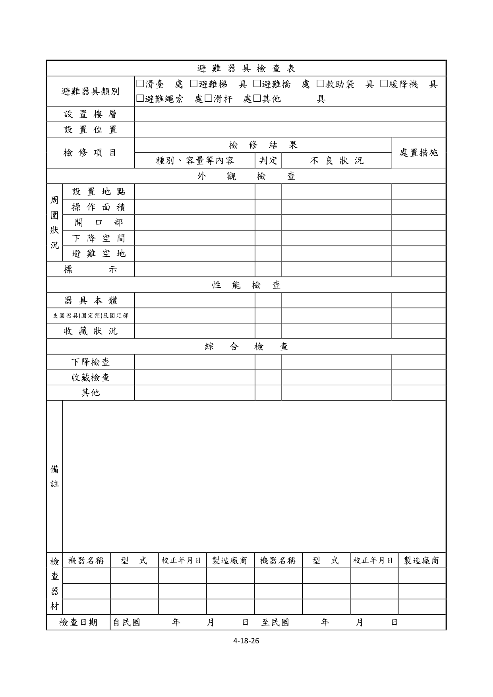

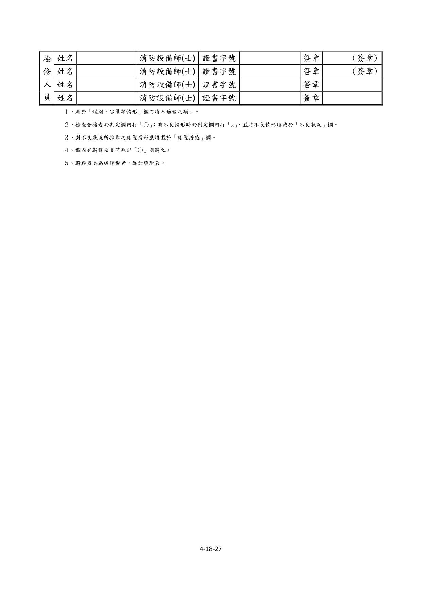

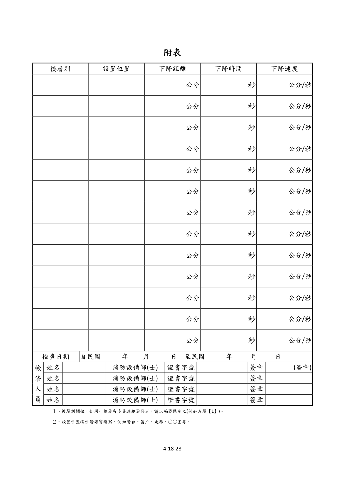
