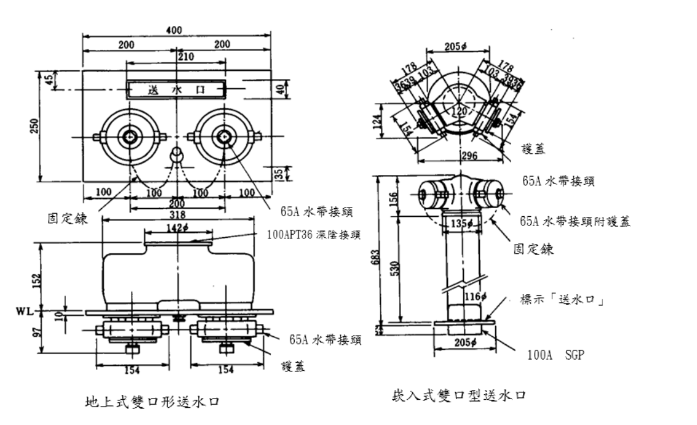
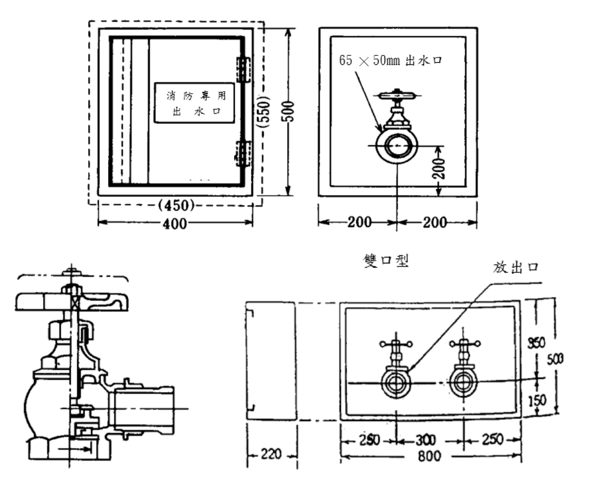
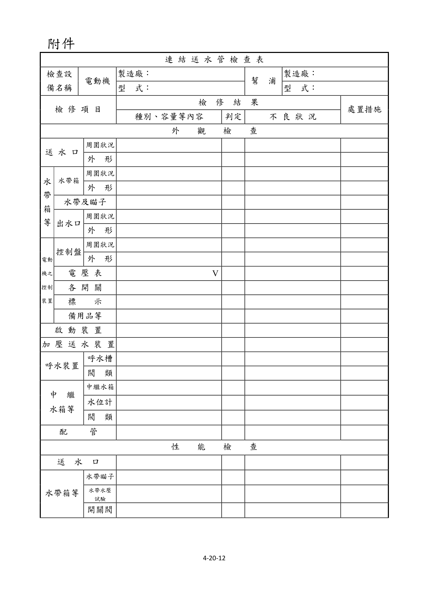
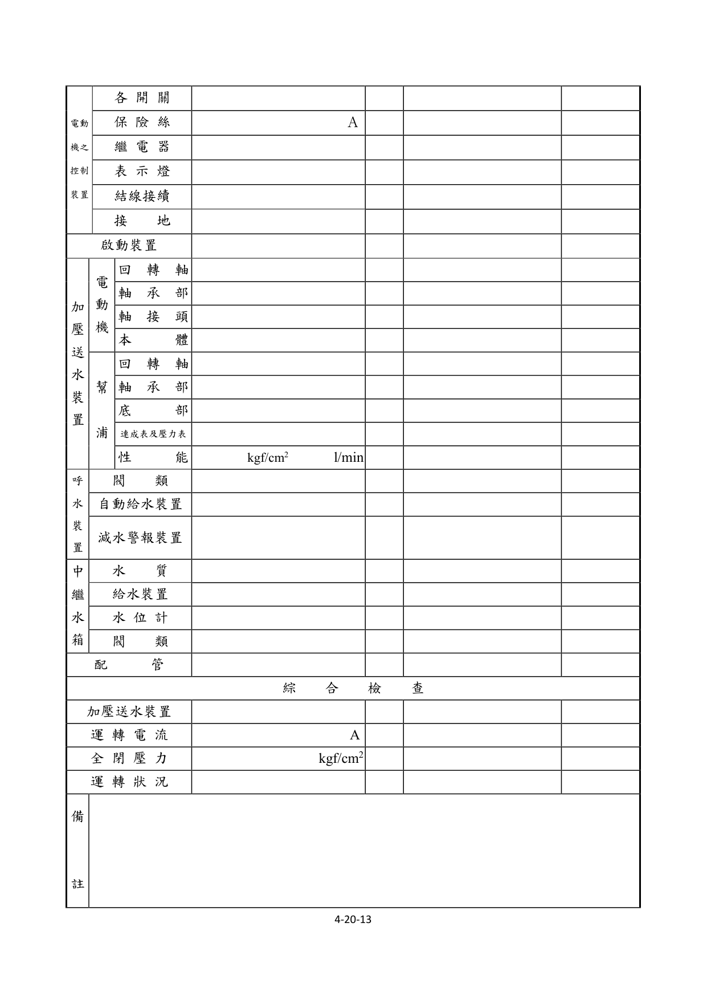
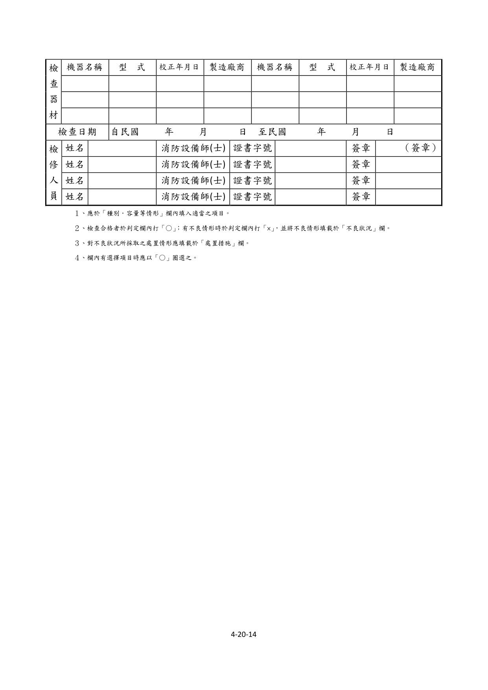

# 消防安全設備及必要檢修項目檢修基準　第二十章　連結送水管

> 版本日期：民國 114 年 1 月 9 日（修正）｜來源：內政部主管法規共用系統（glrs.moi.gov.tw，GL001285）PDF 轉換。114-01-09 修正六章：第一、九、十三、十七、十九、二十七章（其中第一、九、十九章之修正內容在檢修報告表／檢查表與附圖）。
>
> 📌 **免責聲明**：本檔由官方來源轉換與人工整理，可能有轉換或辨識誤差。**一切以主管機關（全國法規資料庫、內政部消防署）公告之現行版本為準**；如有疑義，以官方公告為主。後續 AI 代理人引用本檔時應主動提醒使用者此點，並於必要時自行上網查證正確版本。
>
> 🛈 表格與表單已依原始 PDF 線框以 `scripts/pdf_tables_extract.py` 重新辨識為結構化內容（issue #41）：編號附表為 Markdown 表格或逐列樹狀展開；章末檢修報告表／檢查表**不辨識文字**，改以原始 PDF 頁面截圖（PNG）嵌入；內文附圖與表內圖示亦以 PDF 截圖嵌入（圖檔與本檔同資料夾、檔名前綴同本檔）。表格數值／○×標記可能有辨識誤差，關鍵判斷請核對原始 PDF。
>
> 📎 原始 PDF（全文，114-01-09 版）：[消防安全設備及必要檢修項目檢修基準.PDF](../原始檔案/消防安全設備及必要檢修項目檢修基準/消防安全設備及必要檢修項目檢修基準.pdf)

一、外觀檢查

（一）送水口

１、檢查方法

（１）周圍狀況

A.確認周圍有無使用上及消防車接近之障礙。

B.確認連結送水管送水口之標示是否適當。

（２）外形以目視確認如圖 20-1 所示之送水口有無漏水、變形、異物阻塞等。

２、判定方法

（１）周圍狀況

A.應無消防車接近及送水作業上之障礙。

B.標示應無損傷、脫落、污損等。

（２）外形

A.快速接頭應無生鏽之情形。

B.應無漏水及砂、小石等異物阻塞現象。

C.設有保護裝置者，該保護裝置應無變形、損傷。

（二）水帶箱等

１、水帶箱

（１）檢查方法

A.周圍狀況確認周圍有無檢查上及使用上之障礙，及「水帶箱」之標示設置是否適當。

B.外形以目視及開關操作確認有無變形、損傷，及箱門能否確實開關。

圖 20-1   送水口

（２）判定方法

A.周圍狀況

(A)應無檢查上及使用上之障礙。

(B)標示應無污損、模糊不清部分。

B.外形

(A)應無變形、損傷等。

(B)箱門應能確實開關。

２、水帶及瞄子

（１）檢查方法以目視確認存放狀態之水帶及瞄子有無變形、損傷等，及有無依所需之數量設置於規定位置。

（２）判定方法

A.應無變形、損傷等。

B.應將所需之數量設置於規定位置。

３、出水口

（１）檢查方法

A.周圍狀況

(A)確認周圍有無檢查上及使用上之障礙。

(B)確認「出水口」之標示是否正常。

B.外形以目視確認圖 20-2 所示之出水口有無漏水、變形等情形，及無異物阻塞。

圖 20-2          出水口

（２）判定方法

A.周圍狀況

(A)周圍應無造成檢查上及使用上之障礙。

(B)標示應無損傷、脫落及污損等情形。

B.外形

(A)出水口保護箱應無變形、損傷及顯著腐蝕等，且箱門之開關應無異常現象。

(B)出水口應無導致漏水及水帶連接障礙之變形、損傷及顯著腐蝕等情形。

(C)應無砂或小石塊等異物阻塞。

(D)回轉把手應確實固定於主軸，應無鬆動、脫落等情形。

（三）電動機之控制裝置

１、檢查方法

（１）控制盤

A.周圍狀況確認周圍有無檢查上及使用上之障礙。

B.外形以目測確認有無變形、腐蝕等。

（２）電壓表

A.以目視確認有無變形、損傷等。

B.確認電源電壓是否正常。

（３）各開關以目視確認有無變形、損傷等，及開關位置是否正確。

（４）標示確認標示是否適當正常。

（５）備用品等確認是否備有保險絲、電燈泡等備用品及電氣回路圖等。

２、判定方法

（１）控制盤

A.周圍狀況應設置於火災不易波及之處所，且周圍應無造成檢查上及使用上之障礙。

B.外形應無變形、損傷及顯著腐蝕等。

（２）電壓計

A.應無變形、損傷等。

B.電壓表之指示值應在規定範圍內。

C.無電壓計者，電源表示燈應處於亮燈狀態。

（３）各開關應無變形、損傷及脫落等，且開關位置正常。

（４）標示

A.各開關名稱標示應無污損、模糊不清之情形。

B.標示銘板應無脫落。

（５）備用品

A.應備有保險絲、電燈泡等備用品。

B.應備有電氣回路圖及操作說明書等。

（四）啟動裝置

１、檢查方法

（１）周圍狀況確認操作部周圍有無造成檢查上及使用上之障礙，及其標示是否適當。

（２）外形以目視確認直接操作部及遠隔操作部有無變形、損傷等。

２、判定方法

（１）周圍狀況

A.周圍應無檢查上及使用上之障礙。

B.標示部份應無污損、模糊不清之情形。

（２）外形各開關應無變形、損傷之情形。

（五）加壓送水裝置

１、檢查方法以目視確認依圖 2-3 所示之幫浦及電動機等有無變形、腐蝕等。

２、判定方法應無變形、損傷、顯著腐蝕及銘板剝落等。

（六）呼水裝置

１、檢查方法

（１）呼水槽以目視確認依圖 2-4 所示之呼水槽有無變形、漏水或腐蝕等，及其水量是否在規定量以上。

（２）閥類以目視確認給水管等之閥類有無漏水、變形等，及其開、關之位置是否正常。

２、判定方法

（１）呼水槽應無變形、損傷、漏水或顯著腐蝕等，且其水量在規定量以上。

（２）閥類

A.應無漏水、變形、損傷等。

B.「常時開」或「常時關」之標示及開、關位置應正常。

（七）中繼水箱等

１、檢查方法

（１）中繼水箱由外部以目視確認有無變形、漏水、腐蝕等情形。

（２）水位計以目視確認有無變形、損傷等情形，及其指示值是否正常。

（３）閥類以目視確認排水管、補給水管等之閥類有無漏洩、變形等，及其開關位置是否正常。

２、判定方法

（１）中繼水箱應無變形、損傷、漏水、顯著腐蝕等。

（２）水位計應無變形、損傷等，且其指示值應正常。

（３）閥類

A.應無漏洩、變形、損傷等。

B.「常時開」或「常時關」之標示及開、關位置應正常。

（八）配管

１、檢查方法

（１）配管及接頭以目視確認有無漏洩、變形等，及有無被利用為其它物品之支撐、吊掛之用。

（２）配管固定支架以目視確認有無脫落、彎曲、鬆動等。

（３）閥類以目視確認有無漏洩、變形等，及其開、關位置是否正常。

２、判定方法

（１）配管及接頭

A.應無漏洩、變形、損傷等。

B.應無被利用為其它物品之支撐及吊掛之用。

（２）配管固定支架應無脫落、彎曲、及鬆動等。

（３）閥類

A.應無漏洩、變形、損傷等。

B.「常時開」及「常時關」之標示及開、關位置應正常。

二、性能檢查

（一）送水口

１、檢查方法

（１）確認墊圈有無老化等。

（２）確認快速接頭與水帶是否容易接合及分開。

２、判定方法

（１）墊圈應無老化、損傷等。

（２）與水帶之接合及分開應能容易進行。

（二）水帶箱等

１、檢查方法

（１）水帶及瞄子

A.以目視及手操作確認有無損傷、腐蝕及是否容易接合、分開。

B.製造年份超過 10 年或無法辨識製造年份之水帶，應將消防水帶兩端之快速接頭連接於耐水壓試驗機，並利用相關器具夾住消防水帶兩末端處，經確認快速接頭已確實連接及水帶內(快

速接頭至被器具夾住處之部分水帶)無殘留之空氣後，施以7kgf/cm² 以上水壓試驗 5 分鐘合格，始得繼續使用。但已經水壓試驗合格未達 3 年者，不在此限。

（２）出水口之開關閥以手操作確認是否容易開、關。

２、判定方法

（１）水帶及瞄子

A.應無損傷、顯著腐蝕等。

B.接合、分開應能容易進行，水帶應無破裂、漏水或與消防水帶用接頭脫落之情形。

（２）出水口之開關閥開、關操作應能容易進行。電動機之控制裝置

１、檢查方法

（１）各開關以螺絲起子及開、關操作，檢查端子有無鬆動及開關性能是否正常。

（２）保險絲確認有無損傷、熔斷及是否為所規定之種類、容量。

（３）繼電器確認有無脫落、端子鬆動、接點燒損、灰塵附著等，並操作各開關使繼電器動作，確認其性能。

（４）表示燈操作各開關確認有無正常亮燈。

（５）結線接續以目視及螺絲起子，確認有無斷線、端子鬆動等。

（６）接地以目視或三用電表確認有無腐蝕、斷線等。

２、判定方法

（１）各開關

A.端子應無鬆動、發熱等。

B.開、關性能應正常。

（２）保險絲

A.應無損傷、熔斷等。

B.應依電氣回路圖所定之種類、容量設置。

（３）繼電器

A.應無脫落、端子鬆動、接點燒損、灰塵附著等。

B.動作應正常。

（４）表示燈應無顯著劣化等，且能正常亮燈。

（５）結線接續應無斷線、端子鬆動、脫落、損傷等。

（６）接地應無顯著腐蝕、斷線等之損傷。啟動裝置

１、檢查方法操作直接操作部及遠隔操作部之開關，確認加壓送水裝置是否啟動。

２、判定方法加壓送水裝置應確實啟動。加壓送水裝置

１、電動機

（１）檢查方法

A.回轉軸以手轉動確認是否順暢回轉。

B.軸承部確認潤滑油有無顯著污濁、變質及是否達必要量。

C.軸接頭以扳手確認有無鬆動，及其性能是否正常。

D.本體操作啟動裝置使其啟動，確認性能是否正常。

（２）判定方法

A.回轉軸應能順暢回轉。

B.軸承部潤滑油應無顯著污濁、變質且充滿必要量。

C.軸接頭應無鬆動、脫落，且接合狀態牢固。

D.本體應無顯著發熱、異常振動、不規則或間斷之雜音，且回轉方向正確。

（３）注意事項除需操作啟動檢查性能外，其餘均需先切斷電源再進行檢查。

２、幫浦

（１）檢查方法

A.回轉軸以手轉動確認是否順暢回轉。

B.軸承部確認潤滑油有無顯著污濁、變質及是否達必要量。

C.填料部確認有無顯著之漏水。

D.連成表及壓力表關閉表計之控制閥將水排出，確認指針有無歸零。然後再打開表計之控制閥，操作啟動裝置後，確認指針是否正常動作。

E.性能先將幫浦吐出側之制水閥關閉之後，使幫浦啟動，然後緩緩的打開性能測試用配管之制水閥，由流量計及壓力表確認額定負荷運轉及全開點時之性能。

（２）判定方法

A.回轉軸應能順暢回轉。

B.軸承部潤滑油應無污濁、變質或異物侵入等情形，且充滿必要量。

C.填料部應無顯著漏水之情形。

D.連成計及壓力計歸零之位置及指針動作應正常。

E.性能應無異常振動、不規則或不連續的雜音，且於額定負荷運轉及全開點時之吐出壓力及吐出水量均達規定值以上。

（３）注意事項除需操作啟動檢查外，其餘均需先切斷電源再進行檢查。呼水裝置

１、檢查方法

（１）閥類以手操作確認開、關動作是否能容易進行。

（２）自動給水裝置

A.確認有無變形、腐蝕等。

B.打開排水閥，確認自動給水功能是否正常。

（３）減水警報裝置

A.確認有無變形、腐蝕等。

B.關閉補給水閥，再打開排水閥，確認其功能是否正常。

２、判定方法

（１）閥類開、關動作應能容易進行。

（２）自動給水裝置

A.應無變形、損傷、顯著腐蝕等。

B.當呼水槽之水量減少時，應能自動給水。

（３）減水警報裝置

A.應無變形、損傷、顯著腐蝕等。

B.當水量減少到二分之一時應發出警報。中繼水箱等

１、檢查方法

（１）水質打開人孔蓋，以目視及水桶採水，確認有無腐敗、浮游物、沉澱物等。

（２）給水裝置以目視確認有無變形、腐蝕等，並操作排水閥，確認其功能是否正常。

（３）水位計打開人孔蓋，用檢尺測量水位，確認水位計之指示值。

（４）閥類以手操作確認開、關操作是否容易進行。

２、判定方法

（１）水質應無腐敗、浮游物、沉澱物等。

（２）給水裝置

A.應無變形、損傷、顯著腐蝕等。

B.在減水狀態時應能供水，在滿水狀態下即停止供水。

（３）水位計指示值應正常。

（４）閥類開、關操作應能容易進行。配管

１、檢查方法

（１）閥類以手操作確認開、關操作是否能容易進行。

（２）排放管使加壓送水裝置處於關閉運轉之狀態，確認其排水是否正常。

２、判定方法

（１）閥類開關操作應能容易進行。

（２）排放管排放水量應大於下列公式所求得之計算值。

$$q = \frac{L_s \times C}{60 \times \Delta t}$$

- $q$：排放水量（l/min）
- $L_s$：幫浦關閉運轉時之出力（kw）
- $C$：860 Kcal（1kw-hr 時水之發熱量）
- $\Delta t$：30℃（幫浦內部之水溫上昇限度）

３、注意事項

排放管之排放水量與設計時之量相比較，應無顯著之差異。

三、綜合檢查

（一）檢查方法

１、有中繼幫浦者，將其切換至緊急電源狀態下，操作遠隔啟動裝置，確認該幫浦有無啟動。

２、由該幫浦電動機控制盤之電流表，確認運轉電流是否正常。

３、由該幫浦之壓力表，確認全閉壓力是否正常。

４、於幫浦及電動機運轉中，確認有無不規則之間斷聲音或異常振動之情形。

（二）判定方法

１、由遠隔啟動裝置之操作，應能確實啟動加壓送水裝置。

２、電動機之運轉電流值應在容許範圍內。

３、幫浦之全閉壓力應滿足該幫浦性能曲線之全閉壓力。

４、電動機及幫浦運轉中應無不規則之間斷聲音或異常振動之情形。注意事項檢查醫院等場所，因切換成緊急電源可能會造成困擾時，得使用常用電源進行檢查。

### 附件　連結送水管檢查表

> 本檢查表不辨識文字，改以原始 PDF 頁面截圖嵌入（共 3 頁，對應原 PDF 第 371–373 頁）；如需填寫或核對細部文字，請開啟[原始 PDF](../原始檔案/消防安全設備及必要檢修項目檢修基準/消防安全設備及必要檢修項目檢修基準.pdf)。

