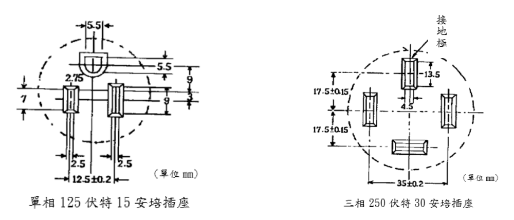
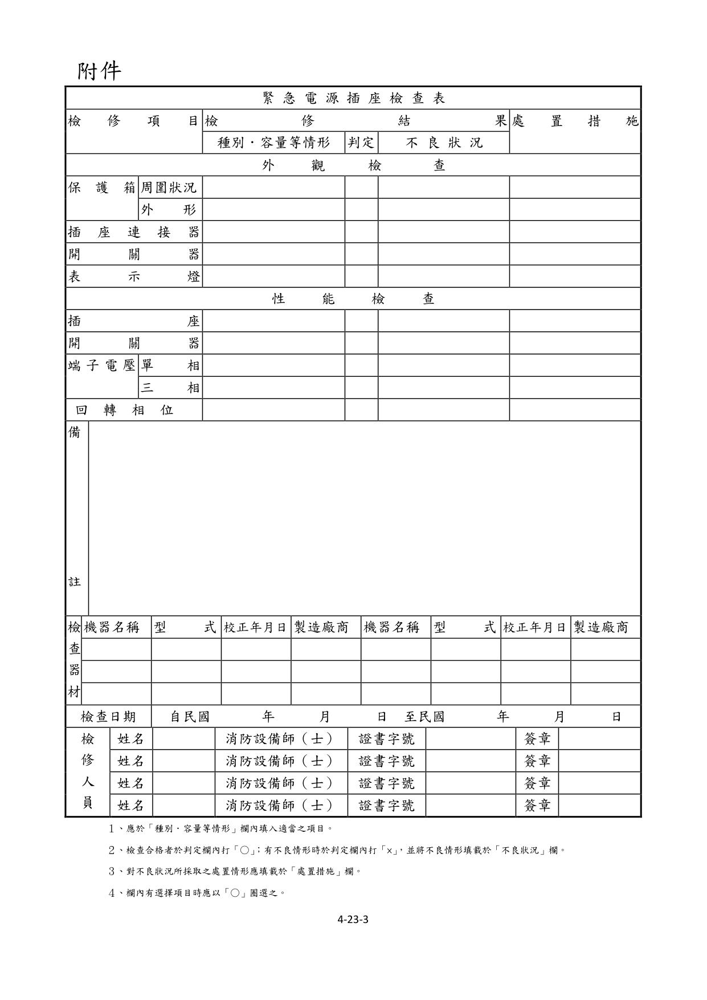

# 消防安全設備及必要檢修項目檢修基準　第二十三章　緊急電源插座

> 版本日期：民國 114 年 1 月 9 日（修正）｜來源：內政部主管法規共用系統（glrs.moi.gov.tw，GL001285）PDF 轉換。114-01-09 修正六章：第一、九、十三、十七、十九、二十七章（其中第一、九、十九章之修正內容在檢修報告表／檢查表與附圖）。
>
> 📌 **免責聲明**：本檔由官方來源轉換與人工整理，可能有轉換或辨識誤差。**一切以主管機關（全國法規資料庫、內政部消防署）公告之現行版本為準**；如有疑義，以官方公告為主。後續 AI 代理人引用本檔時應主動提醒使用者此點，並於必要時自行上網查證正確版本。
>
> 🛈 表格與表單已依原始 PDF 線框以 `scripts/pdf_tables_extract.py` 重新辨識為結構化內容（issue #41）：編號附表為 Markdown 表格或逐列樹狀展開；章末檢修報告表／檢查表**不辨識文字**，改以原始 PDF 頁面截圖（PNG）嵌入；內文附圖與表內圖示亦以 PDF 截圖嵌入（圖檔與本檔同資料夾、檔名前綴同本檔）。表格數值／○×標記可能有辨識誤差，關鍵判斷請核對原始 PDF。
>
> 📎 原始 PDF（全文，114-01-09 版）：[消防安全設備及必要檢修項目檢修基準.pdf](../原始檔案/消防安全設備及必要檢修項目檢修基準/消防安全設備及必要檢修項目檢修基準.pdf)

一、外觀檢查保護箱

１、檢查方法

（１）周圍狀況以目視確認周圍有無檢查上及使用上之障礙，及緊急電源插座上之標示是否正常。

（２）外形以開關操作確認有無變形、損傷等，及箱門是否可確實開、關。

２、判定方法

（１）周圍狀況

A.應無檢查上及使用上之障礙物。

B.保護箱面應有「緊急電源插座」之字樣，且字體應無污損、不鮮明部分。

（２）外形

A.應無變形、損傷、顯著腐蝕。

B.箱門可確實正常開、關。

插座

１、檢查方法應以目視確認有無變形、腐蝕及異物阻塞等。

２、判定方法緊急電源插座為單相交流 110V 用者，應依圖 23-1 所示(額定 150V，15A)之接地型插座。三相交流 220V 用則適用圖 23-2 所示(額定250V，30A)接地型插座，並確認應無變形、損傷、顯著腐蝕或異物阻塞等。

圖 23-1                圖 23-2

開關器

１、檢查方法以目視確認有無變形、損傷等，及其開關位置是否正常。

２、判定方法應無變形、損傷等，且開關位置應正常。

表示燈

１、檢查方法以目視確認有無變形、損傷等，及表示燈是否正常亮燈。

２、判定方法應無變形、損傷、脫落、燈泡故障等，且正常亮燈。

二、性能檢查插座

１、檢查方法確認插頭是否可輕易拔出及插入。

２、判定方法插頭應可輕易拔出及插入。

開關器

１、檢查方法以開關操作確認開、關性能是否正常。

２、判定方法開、關應能正常。

端子電壓

１、檢查方法

（１）單相以三用電表確認一般常用電源及緊急電源之單相交流端子電壓是否為規定值。

（２）三相以三用電表確認一般常用電源及緊急電源之三相交流端子電壓是否為規定值。

２、判定方法應於規定之範圍內。

回轉相位

１、檢查方法連接額定電壓 220V 之三相交流緊急電源插座，如與電動機連接時，應以相位計確認其是否依規定方向回轉。

２、判定方法應為正回轉(右向回轉)之方向。

### 附件　緊急電源插座檢查表

> 本檢查表不辨識文字，改以原始 PDF 頁面截圖嵌入（共 1 頁，對應原 PDF 第 399–399 頁）；如需填寫或核對細部文字，請開啟[原始 PDF](../原始檔案/消防安全設備及必要檢修項目檢修基準/消防安全設備及必要檢修項目檢修基準.pdf)。

