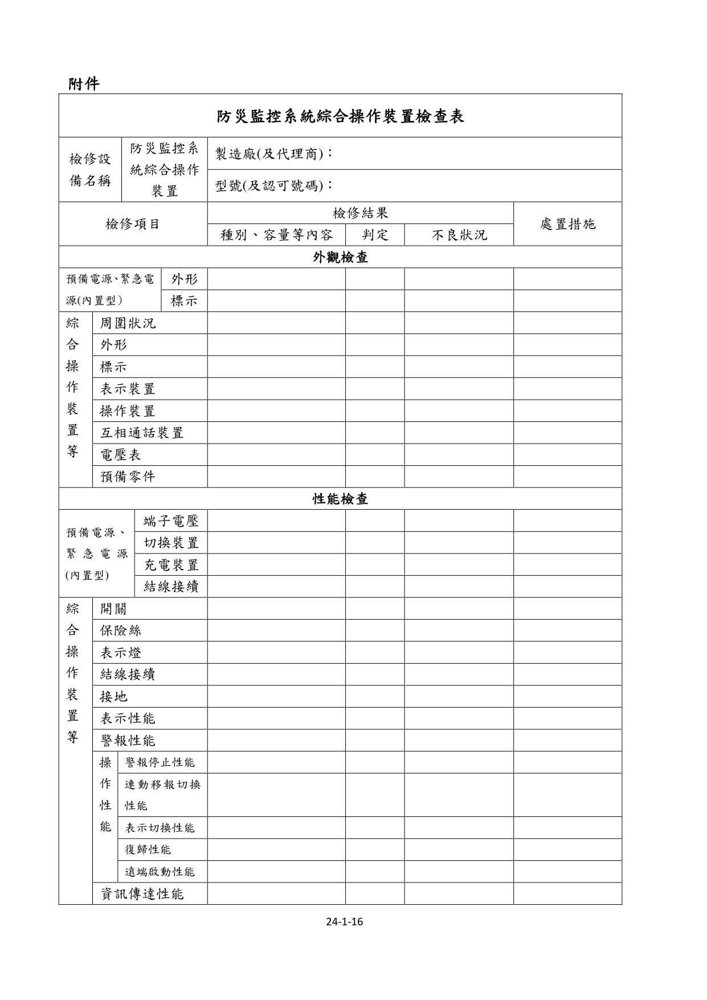
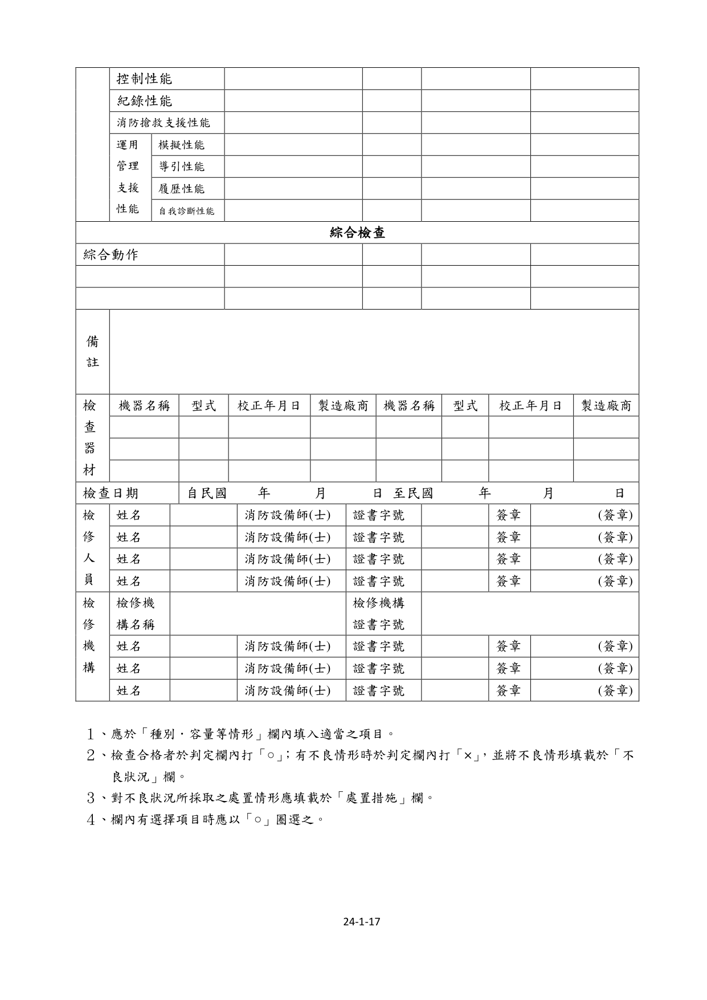

# 消防安全設備及必要檢修項目檢修基準　第二十四章之一　防災監控系統綜合操作裝置

> 版本日期：民國 114 年 1 月 9 日（修正）｜來源：內政部主管法規共用系統（glrs.moi.gov.tw，GL001285）PDF 轉換。114-01-09 修正六章：第一、九、十三、十七、十九、二十七章（其中第一、九、十九章之修正內容在檢修報告表／檢查表與附圖）。
>
> 📌 **免責聲明**：本檔由官方來源轉換與人工整理，可能有轉換或辨識誤差。**一切以主管機關（全國法規資料庫、內政部消防署）公告之現行版本為準**；如有疑義，以官方公告為主。後續 AI 代理人引用本檔時應主動提醒使用者此點，並於必要時自行上網查證正確版本。
>
> 🛈 表格與表單已依原始 PDF 線框以 `scripts/pdf_tables_extract.py` 重新辨識為結構化內容（issue #41）：編號附表為 Markdown 表格或逐列樹狀展開；章末檢修報告表／檢查表**不辨識文字**，改以原始 PDF 頁面截圖（PNG）嵌入；內文附圖與表內圖示亦以 PDF 截圖嵌入（圖檔與本檔同資料夾、檔名前綴同本檔）。表格數值／○×標記可能有辨識誤差，關鍵判斷請核對原始 PDF。
>
> 📎 原始 PDF（全文，114-01-09 版）：[消防安全設備及必要檢修項目檢修基準.PDF](../原始檔案/消防安全設備及必要檢修項目檢修基準/消防安全設備及必要檢修項目檢修基準.pdf)

一、 外觀檢查

（一） 預備電源與緊急電源（限內置型）

1. 檢查方式（1） 外形以目視確認有無變形、腐蝕等。（2） 標示以目視確認蓄電池銘板。

2. 判定方法（1） 外形

A.應無變形、腐蝕、龜裂。

B.電解液應無洩漏、導線之接續部應無腐蝕。（2） 標示種類、額定容量、額定電壓等標示應為正確。

（二） 綜合操作裝置(本體)

1. 檢查方式（1） 周圍狀況以目視確認周圍有無檢查上或使用上之障礙。（2） 外形以目視確認有無變形、顯著腐蝕等。（3） 標示以目視確認標示及其內容正確與否，且應貼有認可標示。（4） 表示裝置以目視確認有無污損、不明顯之部分，並操作確認是否能正確表示。（5） 操作裝置以目視確認有無變形、損傷、缺漏之部分，並操作確認是否能確實動作。（6） 相互通話裝置操作通話裝置確認是否可正常通話。

卷   第

（7） 電壓表

A. 以目視確認有無變形、損傷等。

B. 確認電源、電壓是否正常。（8） 預備品等以目視確認是否備有保險絲、燈泡等零件備品及安裝說明等。

2. 判定方法（1） 周圍狀況應設在經常有人之場所，確認周圍有無檢查上或使用上之障礙。（2） 外形應無變形、損傷、顯著腐蝕等情況。（3） 標示

A. 銘板應無剝落，且內容應無污損、不明顯之狀況。

B. 計時裝置應正確顯示日期時間。

C. 貼有認可標示。（4） 表示裝置應無污損、不明顯部分，並操作確認應正確表示。（5） 操作裝置應無變形、損傷、缺漏之部分，並操作應能確實動作。（6） 相互通話裝置設有綜合操作裝置之防災中心及副防災中心間或同一基地他棟建築物獨立設置之火警受信總機(限他棟建築物獨立設置火警受信總機能與防災中心通話者)皆應能同時通話。（7） 電壓表

A. 應無變形、損傷等。

B. 指示值應在規定範圍內。

C. 無電壓表者，其電源表示燈應正常顯示。（8） 預備品等有保險絲、燈泡等零件備品及安裝說明等。

卷   第

3. 注意事項（1） 有註記使用期限之零組件，應確認期限。（2） 電壓指示不正常之情況，應留意可能為充電不足、充電裝置或電壓計之故障等。（3） 充電回路使用電阻器等阻抗時，因有高溫之情況，非僅以發熱判定，亦應確認有無變色等。

二、 性能檢查

（一） 預備電源與緊急電源（限內置型）

1. 檢查方式（1） 端子電壓操作預備電源試驗開關，以電壓表等確認。（2） 切換裝置中斷常用電源回路開關等確認。（3） 充電裝置以目視確認。（4） 結線接續以目視及螺絲起子等確認。

2. 判定方法（1） 端子電壓電壓表等指示應為規定值以上。（2） 切換裝置常用電源為停電狀態時，自動切換為預備電源或緊急電源，將常用電源復舊時會自動切換成常用電源。（3） 充電裝置無變形、損傷、明顯腐蝕、異常發熱等情況。（4） 結線接續無斷線、端子鬆脫、脫落、損傷等。

（二） 綜合操作裝置(本體)

1. 檢查方式

卷   第

（1）開關類

A. 以目視確認開、關位置是否正常，並操作確認是否能正常操作。

B. 以目視確認端子狀態。（2）保險絲類

A. 以目視確認保險絲有無損傷、熔斷現象。

B. 以目視確認保險絲容量是否符合說明書等資料規定容量。（3）表示燈以所規定之操作確認表示燈狀態是否正常。（4）結線接續以目視或螺絲起子等確認有無斷線、端子鬆脫、脫落、損傷等現象。（5）接地以目視或電表等工具確認有無腐蝕、斷線等現象。（6）表示性能

A. 操作確認火警表示及異常信號是否正常。

B. 操作確認表 1 所示之表示項目是否正確。（7）警報性能操作確認表 2 所示之相關警報是否正確鳴動。（8）操作性能

A. 警報停止性能操作確認表 3 操作項目之警報音或音響警報音是否能停止。

B. 連動移報切換性能（A）連動將連動移報切換開關切入連動側，操作進行火警表示等試驗確認連動信號是否能正常輸出。（B）非連動連動移報切換開關切入非連動側，操作進行火警表示等試驗確認連動信號是否無輸出。

卷   第

C. 表示切換性能（A）操作畫面切換開關確認是否能正常切換且正確表示。（B）以 LCD 等畫面為表示狀態時，輸入後續信號下，選擇開關應有閃滅等警示，且操作該開關應能自動切換至後續信號表示畫面。

D. 復歸性能操作確認系統能否正常復歸。

E. 遠端啟動性能操作對應消防設備之種類，確認附表 3 之操作項目所列項目是否能正常動作。（9）資訊傳達性能操作確認資訊傳達構件或組件是否正常以及內線電話及與消防機關通話之專用電話是否正常。（10）控制性能操作確認構成系統部分之異常偵測或故障功能等是否正常。（11）記錄性能以目視確認及操作確認供記錄之耗材充足且能正確記錄火警等情資。（12）消防搶救支援性能操作確認供消防搶救支援之情資及資訊能正常表示及操作。（13）運用管理支援性能（限設有該性能之綜合操作裝置）

A. 模擬性能（A）操作確認在該模式下是否對消防安全設備等相關表示、警報或操作性能（以下稱「主要性能」）產生影響。（B）確認消防安全設備相關動作信號啟動時，是否切換回一般模式。

B. 導引性能操作確認是否對主要性能產生影響，且能正常動作。

C. 履歷性能

卷   第

操作確認是否對主要性能產生影響，且能正常動作。

D. 自我診斷性能（A）操作確認在該模式下是否對主要性能產生影響，且能正常動作。（B）確認消防安全設備相關動作信號啟動時是否切換回一般模式。

2. 判定方法（1）開關類

A. 開關位置及開關性能應正常。

B. 端子應無鬆脫或發熱現象。（2）保險絲類

A. 保險絲應無損傷、熔斷現象。

B. 保險絲容量應符合說明書等資料規定容量。（3）表示燈表示燈狀態應正常，無明顯劣化狀態。（4）結線接續無斷線、端子鬆脫、脫落、損傷等現象。（5）接地無明顯腐蝕、斷線等現象。（6）表示性能

A. 火災表示及異常信號應能正確表示。

B. 表 1 所示之表示項目應正確表示。（7）警報性能表 2 所示之相關警報應正確鳴動。（8）操作性能

A. 警報停止性能表 3 操作項目之警報音或音聲警報音應能確實停止。

B. 連動移報切換性能（A）連動連動信號應能正常輸出。

卷   第

（B）非連動連動信號應無輸出，且連動移報之切換裝置應有非連動狀態表示。

C. 表示切換性能（A）警戒區域圖等，應依規定圖例正確表示。（B）後續信號未顯示於畫面之狀態，其選擇切換開關應有閃滅等警示，且操作該開關時，應能自動切換至後續信號表示畫面。

D. 復歸性能應能正常復歸。

E. 遠端啟動性能對應消防設備之種類，附表 3 之操作項目所示項目應能正常動作。（9）資訊傳達性能

A. 資訊傳達構件或組件應正常動作。

B. 內線電話及與消防機關通話之專用電話應正常。（10）控制性能構成系統部分之異常偵測或故障功能等應正常。（11）記錄性能記錄使用之耗材充足且能正確記錄火警等情報。（12）消防搶救支援性能

A. LCD 等構成系統部分所動作之所有樓層平面圖及與該樓層有關之以下事項應能簡明表示：（A）發報之探測器、按下之火警發信機位置或警戒區域。（B）偵測瓦斯漏氣檢知器之位置及瓦斯遮斷閥之動作狀況。（C）構成防火區劃防火牆之表示，及常開式防火門、防火鐵捲門、遮煙捲簾、防火閘門、排煙閘門、可動式防煙壁等的動作情況。（D）排煙/進風機及排煙/進風口之作動情況。

卷   第

（E）發電機、中繼幫浦啟動運轉及緊急昇降機召回功能。

B. LCD 等應能針對下列各樓層平面圖(以分棟或防火區劃表示)，以簡明易操作之方式切換其表示。（A）火警探測器、火警發信機或瓦斯漏氣檢知器動作樓層（起火樓層）之平面圖。（B）起火樓以外之火警探測器、火警發信機或瓦斯漏氣檢知器動作樓層之平面圖。（C）起火樓直上層及直上二層之平面圖。（D）起火樓直下層之平面圖。（E）地下層各層之平面圖。（13）運用管理支援性能（限設有該性能之綜合操作裝置）

A. 模擬性能（A）對主要性能無產生影響，且能正常動作。（B）消防安全設備相關動作信號啟動時切換回一般模式。

B. 導引性能對主要性能無產生影響，且能正常動作。

C. 履歷性能對主要性能無產生影響，且能正常動作。

D. 自我診斷性能（A）對主要性能無產生影響，且能正常動作。（B）消防安全設備等相關動作信號啟動時切換回一般模式。

3. 注意事項進行連動移報測試時，因有自動滅火設備、緊急廣播設備、排煙設備等連動移報對象及自動滅火系統之作動隔離需確認，檢修時須特別留意。

三、 綜合檢查

（一） 檢查方式

卷   第

切換至預備電源或緊急電源狀態下，操作各消防安全設備及防火避難設施，並依表 2 及表 3 之相關警報項目及操作項目，確認其功能是否正常。

（二） 判定方法

1. 各消防安全設備及防火避難設施在表 2 及表 3 所列警報項目及操作項目須為正常。

2. 採 LCD 等表示方式者應符合表 1 相關規定。

3. 列印及記錄內容應正常無誤。

（三） 注意事項

1. 切換至蓄電池設備狀態下實施時，須考量蓄電池動作之容量時間。

2. 進行各消防安全設備綜合檢查時，以各記錄裝置記錄來確認。

表 1　消防設備種類／表示項目

- **室內消防栓設備**：1. 加壓送水裝置動作狀態 2. 加壓送水裝置電源中斷狀態 3. 呼水槽缺水狀態 4. 水源水槽缺水狀態 5. 綜合操作裝置電源狀態 6. 連動中斷狀態（限和火警自動警報設備之動作連動啟動）
- **自動撒水設備**：自動撒水受信總機之表示事項及下列事項： 1. 減壓狀態（限有需設定二次側壓力者） 2. 以流水檢知裝置動作表示放射區域圖 3. 加壓送水裝置動作狀態 4. 加壓送水裝置電源切斷狀態 5. 呼水槽缺水狀態 6. 水源水槽缺水狀態 7. 綜合操作裝置電源狀態 8. 手動狀態（限開放式撒水設備具自動啟動裝置者) 9. 火警探測器動作狀態（限預動式與火警自動警報設備動作連動啟動者) 10.連動中斷狀態（限與火警自動警報設備動作連動啟動者）
- **水霧滅火設備**：1. 以流水檢知裝置動作表示放射區域圖 2. 加壓送水裝置動作狀態 3. 加壓送水裝置電源中斷狀態 4. 呼水槽缺水狀態 5. 水源水槽缺水狀態 6. 綜合操作裝置電源狀態 7. 火警探測器動作狀態(限專用者) 8. 連動中斷狀態（限與火警自動警報設備動作連動啟動者）
- **泡沫滅火設備 (移動式除外)**：1. 以流水檢知裝置動作表示放射區域圖 2. 加壓送水裝置動作狀態 3. 加壓送水裝置電源中斷狀態 4. 呼水槽缺水狀態 5. 水源水槽缺水狀態 6. 綜合操作裝置電源狀態 7. 火警探測器動作狀態（限專用者） 8. 連動中斷狀態（限與火警自動警報設備之動作連動啟動者）
- **惰性氣體滅火設備 (移動式除外)**：1. 防護區域圖(如單獨設置控制盤於防護區域外，得免設置) 2. 音響警報裝置、探測器動作 3. 放射啟動 4. 啟動回路異常（接地故障或短路） 5. 放射滅火藥劑 6. 選擇閥關閉（限有設選擇閥者） 7. 壓力異常（限低壓式） 8. 手動狀態（限有自動啟動裝置者） 9. 綜合操作裝置電源狀態 10.連動中斷狀態（限與火警自動警報設備之動作連動啟動者）
- **鹵化性氣體滅火設備 (移動式除外)**：1. 防護區域圖(如單獨設置控制盤於防護區域外，得免設置) 2. 音響警報裝置、探測器動作 3. 放射啟動 4. 啟動回路異常（接地故障或短路） 5. 放射滅火藥劑 6. 選擇閥關閉（限有設選擇閥者） 7. 手動狀態（限有自動啟動裝置者） 8. 綜合操作裝置電源狀態 9. 連動中斷狀態（限與火警自動警報設備之動作連動啟動者）
- **乾粉滅火設備 (移動式除外)**：1. 防護區域圖(如單獨設置控制盤於防護區域外，得免設置) 2. 音響警報裝置、探測器動作 3. 放射啟動 4. 啟動回路異常（接地故障或短路） 5. 放射滅火藥劑 6. 選擇閥關閉（限有設選擇閥者） 7. 手動狀態（限有自動啟動裝置者） 8. 綜合操作裝置電源狀態 9. 連動中斷狀態（限與火警自動警報設備之動作連動啟動者）
- **室外消防栓設備**：1. 加壓送水裝置動作狀態 2. 加壓送水裝置電源中斷狀態 3. 呼水槽缺水狀態 4. 水源水槽缺水狀態 5. 綜合操作裝置電源狀態
- **火警自動警報設備**：火警受信總機表示事項及下列所事項： 1. 警戒區域圖（隨時表示） 2. 警戒區域圖上之火災警報 3. 綜合操作裝置電源狀態
- **瓦斯漏氣火警自動警報設備**：瓦斯漏氣火警受信總機表示事項及下列所事項： 1. 警戒區域圖（隨時表示） 2. 警戒區域圖上之瓦斯漏氣警報 3. 綜合操作裝置電源狀態
- **緊急廣播設備**：緊急廣播設備之操作部表示事項及下列所事項： 1. 連動中斷狀態（限與緊急電話、火警自動警報設備等動作連動者） 2. 綜合操作裝置電源狀態
- **避難引導燈具（限與火警自動警報設備連動者）**：1. 動作狀態 2. 連動切斷狀態 3. 綜合操作裝置電源狀態
- **緊急照明設備（限外置電源型）**：1. 切換至緊急電源 2. 減液警報（限具減液警報裝置之蓄電池設備）
- **排煙設備**：1. 排煙/進風口動作狀態 2. 排煙/進風機動作狀態 3. 通風設備或空調設備(限外循環式)停止 4. 自動閉鎖裝置動作位置 5. 綜合操作裝置電源狀態
- **連結送水管（限設置加壓送水裝置者）**：1. 加壓送水裝置動作狀態 2. 通話裝置動作狀態 3. 加壓送水裝置電源中斷狀態 4. 中繼水箱減（缺）水狀態 5. 綜合操作裝置電源狀態
- **緊急電源插座設備**：1. 緊急電源插座位置 2. 電源迴路導通狀態
- **無線通信輔助設備（限設置增幅器者）**：1. 端子位置 2. 電源中斷狀態
- **消防專用蓄水池**：1. 加壓送水裝置啟動(限由防災中心遙控啟動者) 2. 通話裝置動作狀態(限由防災中心遙控啟動者)
表 2　消防設備種類／警報項目

- **室內消防栓設備**：1. 加壓送水裝置電源中斷狀態 2. 缺水狀態（呼水槽或水源水槽）
- **自動撒水設備**：1. 流水檢知裝置動作狀態 2. 減壓狀態（限有需設定二次側壓力者） 3. 加壓送水裝置電源中斷狀態。 4. 缺水狀態（呼水槽或水源水槽）
- **水霧滅火設備**：1. 流水檢知裝置動作狀態 2. 加壓送水裝置電源中斷狀態 3. 缺水狀態（呼水槽或水源水槽）
- **泡沫滅火設備 (移動式除外)**：1. 流水檢知裝置動作狀態 2. 加壓送水裝置動作狀態 3. 缺水狀態（呼水槽或水源水槽）
- **惰性氣體滅火設備 (移動式除外)**：1. 音響警報裝置、探測器動作 2. 啟動回路異常（接地故障或短路） 3. 選擇閥之關閉（限表示燈亮燈之情況） 4. 壓力異常（限低壓式）
- **鹵化性氣體滅火設備 (移動式除外)**：1. 音響警報裝置、探測器動作 2. 選擇閥之關閉（限表示燈亮燈之情況） 3. 啟動回路異常（接地故障或短路）
- **乾粉滅火設備 (移動式除外)**：1. 音響警報裝置、探測器動作 2. 選擇閥之關閉（限表示燈亮燈之情況） 3. 啟動回路異常（接地故障或短路）
- **室外消防栓設備**：1. 加壓送水装置電源中斷狀態。 2. 缺水狀態（呼水槽或水源水槽）
- **火警自動警報設備**：火警受信總機警報事項
- **瓦斯漏氣火警自動警報設備**：瓦斯漏氣火警受信總機警報事項
- **排煙設備**：排煙/進風機動作狀態
- **連結送水管 (限設置加壓送水裝置場所)**：1. 加壓送水裝置電源中斷狀態 2. 缺水狀態（中繼水箱）
表 3　消防設備種類／操作項目

- **室內消防栓設備**：警報停止
- **自動撒水設備**：警報停止
- **水霧滅火設備**：警報停止
- **泡沫滅火設備**：警報停止
- **惰性氣體滅火設備**：警報停止
- **鹵化性氣體滅火設備**：警報停止
- **乾粉滅火設備**：警報停止
- **室外消防栓設備**：警報停止
- **火警自動警報設備**：火警自動警報設備之受信總機操作事項及下列事項： 1. 復歸 2. 連動移報切換 3. 表示切換 4. 具火警再鳴動之顯示狀態
- **瓦斯漏氣火警自動警報設備**：瓦斯漏氣火警自動警報設備之受信總機操作事項及下列事項： 1. 復歸 2. 連動移報切換 3. 表示切換
- **緊急廣播設備**：緊急廣播設備之操作部操作事項(分區/全區)
- **避難引導燈具（限與火警自動警報設備連動者）**：1. 一齊點燈 2. 手動點燈 3. 試驗切換
- **排煙設備**：1. 遠隔啟動 2. 警報停止
- **連結送水管（限設置加壓送水裝置者）**：1. 加壓送水裝置之遠隔啟動 2. 警報停止
### 附件　防災監控系統綜合操作裝置檢查表

> 本檢查表不辨識文字，改以原始 PDF 頁面截圖嵌入（共 2 頁，對應原 PDF 第 420–421 頁）；如需填寫或核對細部文字，請開啟[原始 PDF](../原始檔案/消防安全設備及必要檢修項目檢修基準/消防安全設備及必要檢修項目檢修基準.pdf)。

