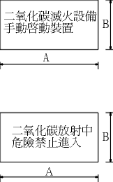
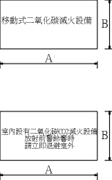

# 二氧化碳滅火設備各種標示規格

> 來源：內政部主管法規共用系統（使用者上傳列印 PDF OCR 轉換；2026-07 由使用者補上原始 DOC 並據以嵌圖）｜版本日期：民國 85 年 07 月 18 日（公發布）
>
> ⚠️ **法規快照**：本檔為入庫當下之版本，引用前請依 index.md「法規時效」核對官方現行版本。
>
> 📌 **免責聲明**：本檔由官方來源轉換與人工整理，可能有轉換或辨識誤差。**一切以主管機關（全國法規資料庫、內政部消防署）公告之現行版本為準**；如有疑義，以官方公告為主。後續 AI 代理人引用本檔時應主動提醒使用者此點，並於必要時自行上網查證正確版本。
>
> 🛈 發文字號：台（八五）內消字第8577247號函訂定。標示牌之尺寸 A／B 為圖示標註；標示牌外觀圖（圖 1、圖 2）取自原始 DOC 內嵌之消防署官網圖片快取（原連結 `www.nfa.gov.tw/law/img/fl-016.gif`、`fl-017.gif`），內文以純文字保留各牌面文字以利檢索。

一、本規格依各類場所消防安全設備設置標準第九十七條規定訂定之。

二、二氧化碳滅火設備使用之各種標示規格應符合下列規定：

（一）手動啟動裝置標示規格如下：

1. 尺寸 A：300 mm 以上；B：100 mm 以上。

2. 紅底白字。

標示牌文字（A 為長、B 為高）：「二氧化碳滅火設備　手動啟動裝置」（外觀見圖 1 上牌）。

（二）放射表示燈規格如下：

1. 尺寸 A：280 mm 以上；B：80 mm 以上。

2. 字體大小：第一行字長、寬為 35 mm 以上；第二行字長、寬為 25 mm 以上。

3. 平時底及字樣均為白色。

4. 點燈時白底紅字。

5. 燈具本體為紅色。

標示牌文字：「二氧化碳放射中　危險禁止進入」（外觀見圖 1 下牌）。

圖 1：（一）手動啟動裝置標示（上牌）、（二）放射表示燈（下牌）。取自原始 DOC 內嵌圖（fl-016.gif 快取）。

（三）移動放射方式標示規格如下：

1. 尺寸 A：300 mm 以上；B：100 mm 以上。

2. 紅底白字。

標示牌文字：「移動式二氧化碳滅火設備」（外觀見圖 2 上牌）。

（四）音響警報裝置標示規格如下，須設於室內明顯之處所：

1. 尺寸 A：480 mm 以上；B：270 mm 以上。

2. 黃底黑字。

3. 每字大小為 25 mm × 25 mm 以上。

標示牌文字：「室內設有二氧化碳 CO2 滅火設備　放射前警鈴響時　請立即退避室外」（外觀見圖 2 下牌）。

圖 2：（三）移動放射方式標示（上牌）、（四）音響警報裝置標示（下牌）。取自原始 DOC 內嵌圖（fl-017.gif 快取）。

---

## 附件

- **原始檔**：[二氧化碳滅火設備各種標示規格.DOC](附件/二氧化碳滅火設備各種標示規格/二氧化碳滅火設備各種標示規格.DOC)（Word 97 格式；牌面圖為文件內嵌之消防署官網圖片快取，已抽出為上方圖 1、圖 2）
