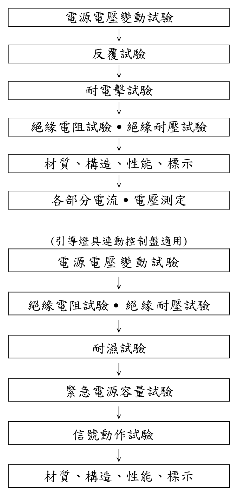
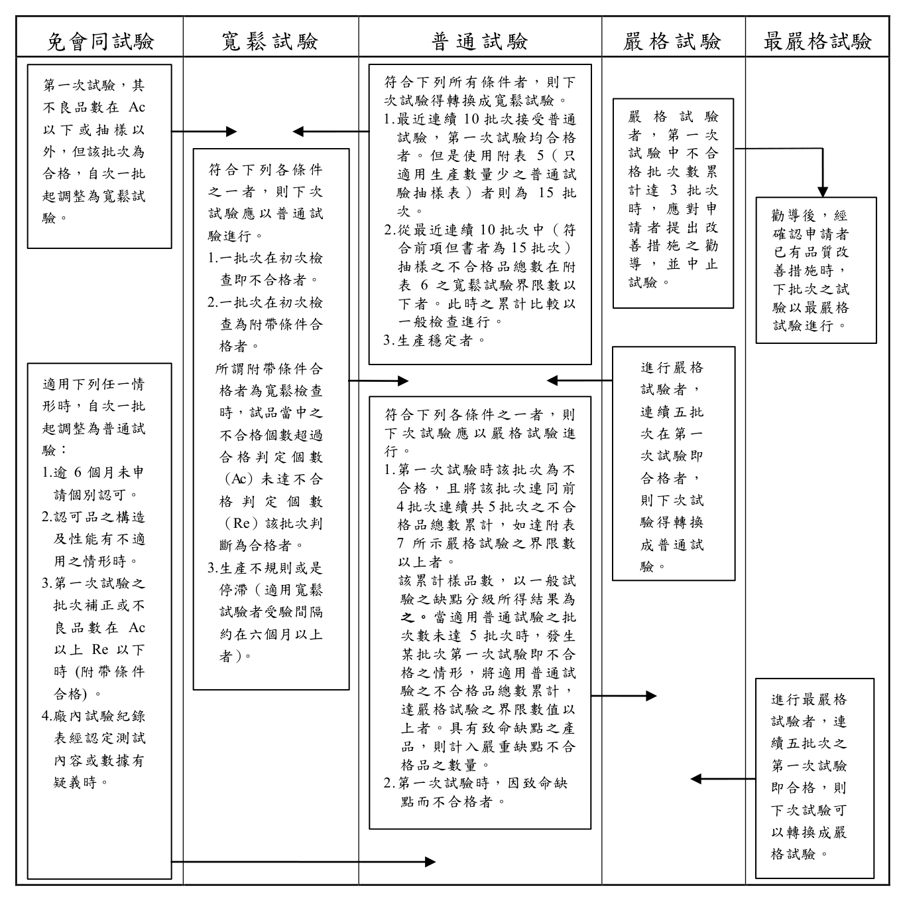

# 火警受信總機認可基準

> 來源：內政部消防署｜版本日期：民國 111 年 06 月 23 日
>
> ⚠️ **法規快照**：本檔為入庫當下之版本，引用前請依 index.md「法規時效」核對官方現行版本。
>
> 📌 **免責聲明**：本檔內容部分為 PDF／影像 OCR 與人工整理之結果，可能有辨識誤差。**一切以主管機關（內政部消防署）公告之現行版本為準**；如有疑義，以官方公告為主。後續 AI 代理人引用本檔時應主動提醒使用者此點，並於必要時自行上網查證正確版本。

---

## 壹、技術規範及試驗方法

### 一、適用範圍

火災自動警報及防災連動控制設備用火警受信總機，其構造、材質、性能等技術上之規範及試驗方法，應符合本基準之規定。

### 二、種類

火警受信總機型式分為 P 型受信總機（一般機種）及 R 型受信總機（特殊機種）。具有防災連動控制之設備者，則依其所連動控制之區分，分為排煙受信總機、自動撒水受信總機、自動泡沫受信總機、滅火連動控制盤、引導燈具連動控制盤及其他防火連動用控制盤；一機體同時具有兩種以上之控制功能者，稱為複合式受信總機，如「P 型複合式受信總機」、「R 型複合式受信總機」。

### 三、用語定義

#### （一）火警受信總機

具有連接火警發信機、探測器、火警警鈴、標示燈或其他附屬設備之功能者。

#### （二）P 型受信總機

係指接受由探測器或火警發信機所發出之信號於受信後，告知有關人員火警發生之設備，附有防災連動控制之設備者應同時啟動之。

#### （三）R 型受信總機

係指接受由探測器或火警發信機所發出之信號，或經中繼器或介面器轉換成警報信號，告知有關人員火警發生之設備，附有防災連動控制之設備者應同時啟動之。

#### （四）引導燈具連動控制盤

將發自於火警自動警報設備之信號予以中繼並傳達至引導燈具之裝置。

### 四、構造、材質及性能

#### （一）整體之構造、材質及性能

1. 在建築物上安裝時，應以毋需將火警受信總機內之零件卸下或穿孔而易於安裝為原則。但零件安裝板如以鉸鏈聯結而能將之迴旋者，不在此限。
2. 動作要確實，操作維護檢查及更換零件簡便且具耐用性，不受塵埃、濕氣之影響而有引發性能異常、失效之現象。
3. 外蓋用螺釘應防止脫落。
4. 外部配線應有易在端子台上固定之構造。
5. 燈泡或 LED 燈、保險絲等附屬零件，應可現場立即更換。
6. 不得以同一端子螺釘固定內外配線。
7. 在保險絲座、燈泡座等處，不得使用鋁質材料作為導電體。
8. 連接器應符合下列規定：

   （1）應確實固定，不得因振動等影響導電狀態。

   （2）端子之材質應為銅或銅合金，同時接觸部分須施予鍍銠、錫、鎳、金或銀等處理，且一組端子至少一端應具有彈性。

   （3）接觸部分應為雙層構造或圓針型。

   （4）印刷電路用連接器，其接觸部分應為雙層構造並予以鍍金處理。但為電腦使用之特殊者，因具充分接觸壓力，不在此限。

   （5）預備電源之連接器為專用者。

   （6）扁平電纜用連接器，除應符合上述（1）之規定外，僅可使用信號線。

9. 受信總機之外箱（殼）應使用不燃性或耐燃性材料；採耐燃材料者，應符合 CNS14535（塑膠材料燃燒試驗法）、UL94 或 IEC60695-11-10 規定之 V-2 規格或同等級以上，如為薄片材料，燃燒時有扭曲、收縮等情形之虞者，應符合上開規定之 VTM-2 規格或同等級以上。該外箱（殼）應設置接地端子，端子必須能固定線徑 1.6 mm 以上之電線，且須有接地標示及不得有不必要之開口。但因應實際需要連結其他設備且與其在構造上作為一體設置者之外部配線孔，不在此限。
10. 防蝕措施應符合下列規定：

    （1）抽插型之燈泡座應使用鐵製簧片，但不得以其為導電體。

    （2）若採取鍍鎘、鍍鎳、鍍鉻及鍍鋅等有效防蝕措施，則下列部分可使用鐵材。

    　　A. 蜂鳴器固定接體之彈簧。

    　　B. 電話插座之框架。

    　　C. 低壓導電部之螺釘。

11. 使用之配線應對承受負載具有充分之電流容量且接線部位要確實施工，並符合下列規定：

    （1）非束線之配線時，其電線之電流容量應在表 1 及表 2 規定值以下。但如係供電源變壓器初級輸入側使用時，其導體斷面積最低為 0.5 mm² 以上，且不可與其他配線結成束線。

#### 表 1　絞線電流容量

| 電線導體斷面積（mm²） | 電流容量（A） |
|---|---|
| 0.3 | 2.1 |
| 0.5 | 3.5 |
| 0.75 | 4.9 |
| 1.25 | 8.4 |
| 2.0 | 11.9 |
| 3.5 | 16.1 |
| 5.5 | 24.5 |

> 註：0.3 mm² 以下之電流密度為 7 A/mm²。

#### 表 2　單線電流容量

| 電線直徑（mm） | 電流容量（A） |
|---|---|
| 0.5 | 1.8 |
| 0.65 | 2.5 |
| 1.0 | 6.4 |

> 註：0.5 mm 以下之電流密度為 9 A/mm²。

   （2）束線時電流密度，絞線應在 4 A/mm² 以下，單線應在 4.8 A/mm² 以下。

   （3）固定束線時，為避免與固定器直接接觸，應先以絕緣膠帶捲繞後再固定之。

   （4）絞線連接部分，股線之斷線應在 20％ 以下。但殘餘股線之電流容量如大於最大負荷電流，且導體斷面積在 0.25 mm² 以上時，不在此限。

   （5）焊錫以紮接配線為原則，使用繞線時應在 6 圈以上。

   （6）印刷電路應符合下列規定：

   　　A. 配線之焊錫以插入配線孔為之，且一個配線孔不得有 2 條以上之配線。但供雜音設計用者，不在此限。

   　　B. 配線孔應有適當配線空隙。但配線導體面積過大時，不在此限。

   　　C. 基板之材質，其厚度應在 1.2 mm 以上，且接觸部位施予鍍金、鍍銀、鍍錫、鍍鎳、鍍銠等處理。

   （7）對於可能因外部配線短路產生之過大電流，而受到破壞之回路（零件、印刷電路之配線、導體等），應有適當之保護裝置。

12. 裝配零件時，應有防止其鬆動之裝置，並應符合下列規定：

    （1）扭轉開關等應以卡梢等金屬固定，不因轉動而有轉矩之產生，若為大扭力者，應有二處以上之固定或同等以上有效方法在軸上固定之。

    （2）扭轉開關、可變電阻及其他調整部或印刷電路基板等裝配零件，不得因振動、衝擊等而造成調整值之變化。

    （3）防止鬆動應以彈簧墊圈、防鬆螺釘為原則，上塗料以有效場合為限。

    （4）燈泡及電池試驗用電阻等易生高熱者，不得裝配於聚乙烯絕緣電線、塑膠及橡膠等易受熱影響之附近。

    （5）如具有可將機器之一部分拆卸的構造（例如印刷電路板與連接器、電池之連接器等），應具有僅能在正規位置裝回的機械性構造。但扁平電線之專用連接器在其末端已有記號者，不在此限。

    （6）電線以外有通電流之零件而有滑動或轉動軸等，可能有接觸不夠充分部分應施予適當措施，以防止接觸不良之情形發生。

13. 充電部分應裝於箱體內並加以標示之。但在安裝狀態下露出之充電部分，其構造應為手指無法直接接觸者。
14. 主電源超過 60 V 以上，其電源部分應有防觸電之裝置，並應符合下列規定：

    （1）受信總機之內部須裝設能同時開關主電源雙極之開關。

    （2）應於電源變壓器一次側之雙線及預備電源之一線裝設保險絲或斷路器，且均應設於機器之內部。

    （3）保險絲容量應為額定電壓時最大負荷電流之 1.5 倍至 2 倍。該範圍如未達到時，應取最接近值，但設於電源一次側者，不可低於 1.5 倍以下，設於電源二次側者及預備電源側時，應大於高壓時之最大負載電流。

    （4）因外部配線短路之過電流可能導致破壞半導體回路者，不可利用保險絲、斷路器，應使用適當之電氣保護設施。

    （5）對外部負載而設之保險絲容量，應為額定電壓時最大負載電流之 1.5 倍至 2 倍，且須大於高壓時之最大負載電流，其插入位置必須位於內外線配線之連接點附近。

    （6）主音響裝置作為外部負載時，不可設保險絲及斷路器。

    （7）受信總機正面應裝設能監視主電源之裝置（利用燈泡等之表示亦可），其應裝於電源一次側保險絲後至電源切換電驛之間，於停電或保險絲熔斷時，應能切換為預備電源。

    （8）應具主電源停電時能自動切換由預備電源供電，且主電源恢復供電時，能自動由預備電源切換為主電源供電之功能，且切換時不得影響警報信號之表示。

15. 受信總機裝在 0℃ 至 40℃ 之環境溫度內，應保持其功能正常，不得發生異狀。
16. 受信總機內部應裝設預備電源，但採其他有效措施者不在此限。
17. 受信總機正面應裝設能監視主回路之電壓裝置，此監視裝置應具探測電壓異常變化之功能，且應設在交直流電源切換裝置之後、復原開關等負載這一方。（單回路者除外）
18. 復原開關：應設專用之開關，且復原開關應為自動彈回型。
19. 地區警報音響裝置停止開關，依下列規定：

    （1）地區警報音響裝置停止開關使地區警報音響裝置定位於關閉期間，受信總機接受火災信號時，該開關應於一定時間內，將地區警報音響裝置自動切換為鳴動狀態（但地區警報音響裝置停止開關未設有預先關閉之功能，且每一火警分區能發出 2 個以上火災信號者，不在此限）。該「一定時間」係指 10 分鐘以內之任意時間。

    （2）受信總機再次接受火災信號或接受由火警發信機發出之火災信號時，應立即切換為鳴動狀態。

    （3）設有地區警報音響裝置完全停止開關者，該開關應設於受信總機內部（但該開關須進行 2 個以上操作步驟或需輸入密碼始能操作停止者，不在此限），且該開關動作時，受信總機面板上應具同步顯示之音響及燈號，並持續顯示至開關復歸為止。

20. 無法自動復原之開關，應加設聲音信號裝置或以閃滅表示燈等提醒人員注意。
21. 應有表示火警發信機動作之裝置。（單回路者除外）
22. 在受信總機面板上，應具有回路火災及斷線之個別試驗裝置，在某回路斷線或故障時，仍可做其他回路動作之試驗。（回路控制部具故障自動偵測功能者除外，但廠商須提供相關技術資料與測試說明）
23. 受信總機須有下列各項防止誤報之功能：

    （1）當外部配線（回路信號線除外）發生故障時。

    （2）受到振動、外力衝擊電力開關之開關動作或其他電器回路干擾時。

    （3）設有蓄積回路者，應有回路蓄積與非蓄積切換之裝置。

24. 除單回路受信總機外，設有蓄積回路功能者，應標示標稱蓄積時間及設有蓄積與非蓄積之切換裝置。（標稱蓄積時間應在 5 秒以上，總動作時間須在 60 秒以下）
25. 附有防災連動控制功能者應符合下列規定：

    （1）應能同時連動控制附屬之相關設備。

    （2）連動輸出裝置應有適當之保護裝置，在輸出異常時能確保受信總機功能正常，並設有端子記號及接線圖之明確標示。

    （3）撒水與泡沫回路動作時，其回路區域表示裝置可與外部感知動作信號同步。

    （4）受信回路及連動控制之電氣特性均需符合本基準之規定，且廠商並必須在火警受信總機內標示連動控制用之電氣規格。

26. 地區音響鳴動裝置之鳴動方式切換等，須符合下列規定：

    （1）須有全區鳴動之功能。

    （2）分區鳴動須符合下列規定：

    　　A. 設定之警戒區域能確實鳴動。

    　　B. 處於鳴動時，當收到新的火警信號或經過一定時間（10 分鐘以內）時，自動切換至全區鳴動。

    　　C. 設有可將分區鳴動切換至全區鳴動狀態之停止開關者，該開關應設於受信總機內部。但該開關須進行 2 個以上操作步驟或需輸入密碼始能操作停止者，不在此限。

    （3）火警受信總機須設有接受來自緊急廣播設備動作連動之輸入端子或具同等功能之裝置，於接受來自緊急廣播設備動作時之信號時，須自動停止地區警報音響裝置使其暫時停止鳴動，且受信總機面板上須具同步顯示之警示裝置（例：燈、音響或信息顯示等）。當緊急廣播設備動作連動信號停止後須自動開啟地區警報音響裝置使其恢復鳴動。

#### （二）零件之構造、材質及性能

1. 開關類

   （1）動作簡便確實，停止位置明確。

   （2）對各接點在最大使用電壓下經由電阻施予最大使用電流之 200％，反覆通電 10000 次（對電源主開關為 5000 次）後，其構造及性能不得發生異常情形。

   （3）接點應能適合最大使用電流容量且能耐腐蝕。

   （4）除自動彈回型之開關外，均應具備恢復原定位置之裝置。

2. 警報表示裝置

   警報表示裝置可分為火警表示裝置及斷線或故障表示裝置。

   （1）火警表示裝置

   　　A. 當受信總機收到火警信號時，紅色火警表示燈點亮，主音響警報裝置鳴響，且在區域表示裝置自動表示該警戒區域已有火警發生，同時地區警報音響裝置鳴響且標示燈裝置變為閃爍；上述火警表示在手動方式復舊前，應能保持該火警信號。（區域表示裝置單回路受信總機可免設）

   　　B. 標示燈平時保持明亮，火警時須變為閃爍狀態。使用預備電源供電時，可不亮。

   　　C. 火警表示燈，其警報區域表示，最少應具有兩個以上警報區域表示功能。（但單回路用途除外）

   　　D. 警報區域表示為數位型者，最少應能表示其所屬二個區域同時動作之性能，對第三個區域以上之警報信號，動作時亦能告知有關人員而不影響原來警報信號。

   　　E. 切換至預備電源時，不得影響上述火警警報之表示。但外部標示燈可不點亮。

   　　F. 自探測器感知動作或火警發信機等開始發出信號起至受信總機能完成接受信號之時間，應在 5 秒內做出警報動作。（但裝有回路蓄積功能時，則以標稱蓄積時間加 5 秒為準，其總和不得超過 60 秒）

   （2）斷線或故障表示裝置

   　　當受信總機探測器回路端至終端器間發生斷路或故障時，斷線表示燈點亮、斷線音響鳴響，且在區域表示裝置自動表示該回路已有故障或斷線發生。其表示方式應與火警警報表示方式有所區別。（區域表示裝置單回路受信總機可免設）

3. 電磁電驛

   （1）接點應使用 G、S 合金。（以金、銀合金或其他有效電鍍處理者）

   （2）接點能適合最大使用電流容量，在最大使用電壓下經由電阻負載於最大使用電流反覆動作試驗 30 萬次之後，其功能構造均不得有異常障礙發生。

   （3）電驛除密封型外應裝設適當護蓋，以避免塵埃等附著於電驛接點及可動作部位。

   （4）同一接點不得接至內部負載和外部負載做直接供應電力之用。

   （5）同一電驛不得同時使用於主電源變壓器之一次側及二次側。

4. 電壓指示裝置應符合下列規定：

   （1）容許誤差在 2.5% 以下。

   （2）應能顯示回路額定電壓之 130% 以上，210% 以下。

5. 保險絲

   應使用符合 CNS4978〔F01 型玻管式熔線〕、CNS4979〔F02 型玻管式熔線〕、CNS4980〔F05 型玻管式熔線〕、CNS4981〔F06 型瓷管式熔線〕之保險絲國家標準。

6. 音響裝置

   （1）置於無響室內，在正常電壓之 80％ 電壓時，距正面 1 m 處，主音響亦能發出 65 dB 以上。但警報音響如為斷續者，其基準斷續比為（鳴動：休止＝2：1），且休止或鳴動音響達到 85 dB 以下之時間必須在 2 秒以下。

   （2）在正常電壓下連續鳴響 8 小時後，其構造及功能不得有任何異狀。

   （3）供電線路與外殼間之絕緣電阻以直流 500 V 之絕緣電阻計測量，其電阻值須在 20 MΩ 以上。

7. 變壓器

   （1）應符合 CNS1264〔電訊用小型電源變壓器〕第 3.1 節、3.2 節、3.7 節之規定。

   （2）其容量應能耐其最大負載電流值之連續使用。

   （3）額定電壓應在 380 V 以下，且其外殼應接地。

8. 控制用電路板

   （1）銅箔應有與空氣隔離之保護膜處理。但焊接點除外。

   （2）電路板上超過 60 V 以上之電壓接點應有防觸電裝置，並標示之。

9. 預備電源

   （1）應裝設能試驗預備電源是否良好之裝置，但採其他有效措施者不在此限。

   （2）露出之電線應使用有著色者以資識別。（正電源須為紅色）

   （3）預備電源用電池應使用封閉型蓄電池，且其最小容量之標準須在監視狀態下連續使用 60 分鐘後，於各回路接上二個中繼器或二個火警警鈴使其動作時消耗電流能繼續供電 10 分鐘之容量（但消耗電量未超過實際監視狀態下之電量時，則以 60 分鐘監視狀態下之電流為準）。當計算受信總機區域負載裝置之消耗時以所能連接之回路數或中繼器之數量乘以二倍之動作消耗電流為準。（但乘以二倍後所得之數值超過 20 時則以 20 作計算）

   （4）附有防災連動控制之設備者，其預備電源容量計算方式比照上列（3）之規定。

   （5）須提供預備電池消耗容量之計算資料。

10. 送話機及受話機

    機能應能確實動作，具有耐用性，且在互相聯絡時，不得影響警報信號之傳遞。（具火警受信總機功能或具火警受信總機用途者）

#### （三）P 型受信總機之性能

除能個別試驗回路火災動作及斷線表示裝置外（單回路受信總機可免設），應具有能自動檢知經由探測器回路端至終端器間外部配線通電狀況之功能；此功能包括斷線表示燈、斷線故障音響、斷線區域表示設備（但單回路受信總機除外），且此裝置在操作中於其他回路接收到火警信號時，應能同時作火警區域表示。若同一回路接收到火警信號表示時應以火警表示優先。但連接之回線數只有一條時，得不具斷線表示裝置之試驗功能。

#### （四）R 型受信總機之性能

1. 應具有能個別試驗火警表示動作之裝置（具自動偵測功能者除外），同時應具能自動檢知中繼器回路端至終端器配線有無斷線，以及受信總機至中繼器間電線有無短路及斷線之裝置，且該裝置在操作中於其他回路有火警信號時，應能優先作火警表示（若同時其他有斷線信號亦能保有斷線表示），但火警信號以手動復原後，應能回復原斷線區域表示。
2. 當收到火警中繼器因主電源停電，保險絲斷路及火警偵測失效等信號時，能自動發出聲音信號及用表示燈表示有故障已經發生之裝置。

#### （五）其他事項

受信總機內部另須備妥下列各項附屬設備：

1. 終端設備。
2. 備用各種保險絲。

### 五、電源電壓變動試驗

受信總機之主電源及預備電源，其額定電壓在下列規定範圍變動時，不得發生功能異常之情形。

#### （一）主電源

額定電壓之 90％ 以上至 110％ 以下。

#### （二）預備電源

額定電壓之 85％ 以上至 110％ 以下。

### 六、反覆試驗

將受信總機之任一回路以額定電壓施予 1000 次之火警動作試驗後，對受信總機本身之構造及功能不得有異狀發生。

### 七、絕緣電阻試驗

- （一）受信總機之充電部與外殼間之絕緣電阻，以直流 500 V 之絕緣電阻計測量應在 5 MΩ 以上，交流輸入部位與外殼應在 50 MΩ 以上。

- （二）導線與導線外皮間之絕緣電阻以上述電阻計測量，應在 20 MΩ 以上。

- （三）交流電源部一次側與直流電源部間應有 50 MΩ。

- （四）但具有對絕緣異常之警報裝置者除外。

### 八、絕緣耐壓試驗

前點所述之各試驗部位之絕緣耐壓試驗以 50 Hz 或 60 Hz 近似正弦波，實效電壓在 500 V 之交流電通電 1 分鐘，能耐此電壓者為合格。如果受信總機額定電壓在 60 V 以上 150 V 以下者，則用 1000 V，超過 150 V 額定電壓者以其額定電壓乘以 2 再加 1000 V 之電壓試驗。但具有對地線絕緣異常之警報裝置者除外。

### 九、耐電擊試驗

在通電狀態下，電源接以電壓 500 V 之脈波寬 1 μsec 及 0.1 μsec，頻率 100 赫（Hz），串接 50 Ω 電阻，接於受信總機之兩端施予電擊試驗，持續 15 秒後，對其功能不得發生異常現象。

### 十、試驗之一般條件

除另有其他特別規格外，對受信總機進行試驗時，其室溫應在 0℃ 至 40℃ 之溫度範圍內，且相對濕度應在 45％ 以上，85％ 以下。

### 十一、標示

應於受信總機上易於辨識位置，以不易磨滅方法標示下列事項：

- （一）設備名稱及型號。

- （二）廠牌名稱或商標。

- （三）型式認可號碼。

- （四）製造年月。

- （五）電器特性。

- （六）檢附操作說明書及符合下列事項：

  1. 包裝受信總機之容器應附有簡明清晰之安裝及操作說明書、受信總機之回路圖及標準接線圖，並需要提供圖解輔助說明。說明書應包括產品安裝及操作之詳細指引及資料。同一容器裝有數個同型產品時，至少應有一份安裝及操作說明書。
  2. 若作為受信總機設備檢查及測試之用者，得詳述其檢查及測試之程序及步驟。
  3. 其他特殊注意事項。

- （七）保險絲之額定電流值及用途名稱。

- （八）具有連動控制之設備裝置，其端子之額定電壓、電流值。

- （九）蓄電池之額定電壓、容量及出廠年月或批號。

### 十二、新技術開發之火警受信總機

新技術開發之火警受信總機，依形狀、構造、材質及性能判定，如符合本基準規定及同等以上性能，並經中央消防主管機關認定者，得不受本基準之規範。

---

## 貳、型式認可作業

### 一、型式試驗之樣品

須提供樣品 1 個。

### 二、型式試驗之方法

#### （一）型式試驗流程

> 📷 截自原始 PDF「第 2 點完整條文」第 1 頁（內文頁 10）。

#### （二）試驗方法

依本認可基準壹、技術規範及試驗方法之規定。另引導燈具連動控制盤則依附錄【引導燈具連動控制盤】相關規定進行試驗，且信號回路為多回路時，應以最大回路數進行試驗。

### 三、型式試驗結果之判定

- （一）符合本認可基準所規定之技術規範者，該型式試驗結果視為「合格」。

- （二）有四、補正試驗所定事項者，得進行補正試驗，並以一次為限。

- （三）未符合本認可基準所規定之技術規範者，該型式試驗結果視為「不合格」。

### 四、補正試驗

符合下列情形之一者得進行補正試驗：

- （一）型式試驗之不良事項為申請資料不完備（設計錯誤除外）、標示遺漏、零件裝置不良或有肆、缺點判定方法之表 6 缺點判定表所列一般缺點或輕微缺點者。

- （二）試驗設備有不完備或缺點，致無法進行試驗者。

### 五、型式變更試驗之方法

型式變更試驗之樣品數、試驗流程等，應就型式變更之內容，依前述型式試驗進行。

### 六、型式區分、型式變更及輕微變更之範圍

型式區分、型式變更及輕微變更之範圍，依下表 3 之規定。

#### 表 3　型式區分、型式變更及輕微變更範圍表

| 區分 | 說明 | 項目 |
|---|---|---|
| 型式區分 | 型式認可之產品其主要性能、設備種類、動作原理不同，或經主管機關規定之必要區分者，須以單一型式認可做區分。 | 1. P 型火警受信總機、P 型複合式受信總機、R 型火警受信總機、R 型複合式受信總機。 2. 引導燈具連動控制盤： （1）信號回路： 　A. 閃滅（音聲引導）信號回路、消燈（減光）信號回路。 　B. 單回路、多回路。 （2）緊急電源：內置型、外置型。 |
| 型式變更 | 經型式認可之產品，其型式部分變更，有影響性能之虞，須施予試驗確認者，謂之。 | 1. 電路設計變更。（火警受信回路除外） 2. 蓄電池或蓄電池充電裝置變更。 3. 零件的功能、材質或構造。 4. 主電源的種類。 5. 主機能有影響的附屬裝置變更。（除去的情形除外） 6. 標稱蓄積時間變更。（限於時間的變更） |
| 輕微變更 | 經型式認可或型式變更認可之產品，其型式部分變更，不影響其性能，且免施予試驗確認，可藉由書面據以判定良否者，謂之。 | 1. 零件的安裝方式。 2. 外箱的材質與構造。 3. 電子零件變更。（規格、型式或製造者） （1）經認定或同等級品以上之電燈泡。 （2）經認定或同等級品以上之電磁繼電氣及開關。 （3）以下所示零件。（限於規定是合於使用條件） （4）印刷回路基板，以下所揭事項： 　A. 材質。 　B. 接續時，其材質厚度或接觸部的焊接方式。 （5）前（1）～（3）所示零件以外的電器零件。 4. 影響主要機能的附屬裝置變更。（限於使用經認可的電器回路） 5. 無影響主要機能的附屬裝置變更。 6. 下述電子回路變更。（限於同一回路電壓情形） （1）變更經認定之電源回路。 （2）變更經認定之充電回路。 （3）預備電源用蓄電池的變更。（限於同等級產品經第三公正單位檢驗合格或有國際安規之產品） （4）回路定數等輕微變更。 （5）電氣回路的部分變更。（限於經承認的回路） （6）前述變更伴隨著輕微的回路變更。 |

> 系列型號：在其主要性能、設備種類、動作原理相同原則下，可容許申請系列型號之型式認可或型式變更，試驗內容將針對不同項目或構件進行個別試驗或檢查。

### 七、試驗紀錄

有關上述型式試驗、補正試驗、型式變更試驗之結果，應詳細填載於型式試驗紀錄表（如附表 9、附表 11）。

---

## 參、個別認可作業

### 一、個別認可之方法

- （一）個別認可之抽樣試驗數量依附表 1 至附表 5 之抽樣表規定，抽樣方法依 CNS9042 規定進行抽樣試驗。

- （二）抽樣試驗之嚴寬等級可分為最嚴格試驗、嚴格試驗、普通試驗、寬鬆試驗及免會同試驗五種。

- （三）個別試驗通常將試驗項目分為以通常樣品進行之試驗（以下稱為「一般試驗」）以及對於少數樣品進行之試驗（以下稱為「分項試驗」）。

### 二、個別認可之樣品及抽樣方法

- （一）個別認可之樣品數依相關試驗之嚴寬等級以及批次大小所定（如附表 1 至附表 5）。

- （二）樣品之抽取如下所示：

  1. 抽樣試驗以每一批為單位。
  2. 樣品之多寡，應視整批成品（受驗數量＋預備品）數量之多寡及試驗等級，按抽樣表之規定抽取，並在重新編號之全部製品（受驗批）中，依隨機抽樣法（CNS 9042）隨意抽取，抽出之樣品依抽出順序編排序號。但受驗批量如在 300 個以上時，應依下列規定分為二段抽樣。

     （1）計算每群應抽之數量：當受驗批次在五群（含箱子及集運架等）以上時，每一群之製品數量應在 5 個以上之定數，並事先編定每一群之編碼；但最後一群之數量，未滿該定數亦可。

     （2）抽出之產品賦予群碼號碼：同群製品須排列整齊，且排列號碼應能清楚辨識。

     （3）確定群數及抽出個群，再從個群中抽出樣品：確定從所有群產品中可抽出五群以上之樣品，以隨機取樣法抽取相當數量之群，再由抽出之各群製品作系統式循環抽樣（由各群中抽取同一編號之製品），將受驗之樣品抽出。

     （4）依上述方法取得之製品數量超過樣品所需數量時，重複進行隨機取樣去除超過部分至達到所要數量。

- （三）一般試驗和分項試驗以相同之樣品試驗之。

### 三、試驗項目

一般試驗及分項試驗之項目如下表 4：

#### 表 4　一般試驗及分項試驗項目表

| 試驗區分 | 試驗項目 |
|---|---|
| 一般試驗 | 1. 構造、性能（火災動作、斷線表示性能、回路斷線火警優先性能）、標示。 2. 構造、性能（移報功能、無電壓狀態、短（斷）路保護、信號動作試驗等）、標示（引導燈具連動控制盤適用）。 |
| 分項試驗 | 電源電壓變動試驗、絕緣電阻絕緣耐壓試驗、性能（電壓電流測定、蓄積時間、延遲時間、預備電源性能情形）（引導燈具連動控制盤除外）。 |

### 四、缺點之等級及合格判定基準

- （一）試驗中發現之缺點，分為致命缺點、嚴重缺點、一般缺點及輕微缺點等四級。

- （二）各試驗項目之缺點內容，依肆、缺點判定方法規定，非屬該缺點判定表所列範圍之缺點者，則依消防機具器材及設備認可作業要點判定之。

### 五、批次之判定

批次合格與否，按下列規定判定之：抽樣表中，Ac 表示合格判定個數（合格判定時不良品數之上限），Re 表示不合格判定個數（不合格判定之不良品數之下限），具有二個等級以上缺點之製品，應分別計算其各不良品之數量。

- （一）抽樣試驗中各級不良品數均在合格判定個數以下時，應依表 1 調整其試驗等級，該批為合格。

- （二）抽樣試驗中任一級之不良品數在不合格判定個數以上時，該批為不合格。但該等不良品之缺點僅為輕微缺點時，得進行補正試驗，惟以一次為限。

- （三）抽樣試驗中不良品出現致命缺點，縱然該抽樣試驗中不良品數在合格判定個數以下，該批仍視為不合格。

### 六、個別認可結果之處置

#### （一）合格批次之處置

1. 整批雖經判定為合格，但受驗樣品中發現有不良品時，於使用預備品替換或修復後始為合格品。
2. 非受驗之樣品若於整批受驗製品中發現有缺點者，準依前款規定辦理。
3. 上述 1、2 兩種情形，如無預備品替換或無法修復調整者，應就其不良品部分之個數，判定為不合格。

#### （二）補正批次之處置

1. 接受補正試驗時，應提出初次試驗時所發現不良事項之改善說明書及不良品處理之補正試驗紀錄表。
2. 補正試驗之受驗樣品數以初次試驗之受驗樣品數為準。但該批次樣品經補正試驗合格，依參、六、（一）、1. 之處置後，仍未達受驗樣品數之個數時，則為不合格。

#### （三）不合格批次之處置

1. 不合格批次之產品接受再試驗時，應提出初次試驗時所發現不良事項之改善說明書及不良品處理之補正試驗紀錄表。
2. 接受再試驗時不得加入初次受驗樣品以外之樣品。
3. 個別認可不合格之批次不再受驗時，應在補正試驗紀錄表中，註明理由、廢棄處理及下批之改善處理等文件，向辦理認可試驗單位提出。

### 七、試驗嚴寬度等級之調整

#### （一）首次申請個別認可

試驗等級以普通試驗為之，其後之試驗等級調整，依表 5 之規定。

#### 表 5　試驗嚴寬度等級之調整

> 📷 截自原始 PDF「第 3 點完整條文」第 3 頁。

#### （二）補正試驗

初次試驗為寬鬆試驗者，以普通試驗為之；初次試驗為普通試驗者，以嚴格試驗為之；初次試驗為嚴格試驗者，以最嚴格試驗為之。

- （三）再受驗批次之試驗結果，不得計入試驗嚴寬分級轉換紀錄中。

### 八、免會同試驗

- （一）符合下列所有情形者，得免會同試驗：

  1. 達寬鬆試驗後連續十批第一次試驗均合格者。
  2. 累積受驗數量達 500 台以上。
  3. 取得 ISO 9001 認可登錄或國外第三公正檢驗單位通過者（產品具合格標識）。

- （二）實施免會同試驗時，基金會每半年至少派員會同實施抽驗一次，試驗項目依照個別認可試驗項目，若試驗不符合本基準規定時，該批次予以不合格處置，並次批恢復為普通試驗（會同試驗）。

- （三）符合免會同試驗資格者，如有下列情形之一時，該批樣品應即恢復為普通試驗（會同試驗）：

  1. 所提廠內試驗紀錄表有疑義時。
  2. 六個月內未申請個別認可者。
  3. 經使用者反應認可樣品有構造與性能不合本基準規定，經查證確實有不符合者。

### 九、下一批試驗之限制

對當批次個別認可之型式，於進行下次之個別認可時，係以該批之個別認可完成結果判定之處置後，始得施行下次之個別認可。

### 十、試驗之特例

有下列情形之一時，得在受理個別認可申請前，逕依預定之試驗日程實施試驗。此情形下須在確認產品之個別認可申請書受理後，才能判斷是否合格。

- （一）初次試驗因嚴重缺點或一般缺點經判定不合格者。

- （二）不需更換全部產品或部分產品，可容易選取、去除申請數量中之不良品或修正者。

### 十一、試驗設備發生故障或無法試驗時之處置

試驗開始後因試驗設備發生故障或其他原因致無法立即修復，經確認當日無法完成試驗時，得中止該試驗。並俟接獲試驗設備完成改善之通知後，重新擇定時間，依下列規定對該批施行試驗：

- （一）試驗之抽樣標準與初次試驗時相同。

- （二）不得進行補正試驗。

### 十二、其他

個別認可發現製品有其他不良事項，經認定該產品之抽樣標準及個別認可方法不適當者，得由中央主管機關另定個別認可方法及抽樣標準。

---

## 肆、缺點判定方法

各項試驗所發現之不良情形，其缺點之等級依表 6 之規定判定。

#### 表 6　缺點判定表

| 試驗項目 | 致命缺點 | 嚴重缺點 | 一般缺點 | 輕微缺點 |
|---|---|---|---|---|
| 缺點分類之原則 | 對人體有危害之虞或無法達到機具、器材及設備之基本功能者 | 雖非致命缺點，惟對機具、器材及設備之功能有產生重大障礙之虞者 | 雖非致命缺點或嚴重缺點，惟對各機具、器材及設備之功能有產生障礙之虞；或機具、器材及設備之構造與認可之型式有異；或標示錯誤，致使用上對機具、器材及設備的功能產生障礙之虞者 | 非屬於前開三款之輕微障礙 |
| 構造 | 造成主音響裝置可能無法鳴動之斷線、接觸不良、零配件缺陷及其他類似之致命性不良。 | 1. 在接受火災信號時，因零配件之裝設等有嚴重不良而會影響火災顯示。（如果會影響主音響之動作者除外。） 2. 試驗裝置（係指火災動作試驗、斷線試驗等各相關之裝置）於操作中時，無法由其他回線接受火災信號。 | 1. 會對火災顯示相關功能以外之火報功能造成影響之零配件裝設等之嚴重不良。 2. 會對火報功能（或移報功能）造成影響之明顯之傷痕或異物之殘留。 3. 可能會對功能造成影響之生銹。 | 1. 不影響火報功能（或移報功能）之零配件裝設等嚴重不良。 2. 零配件之裝設等有輕微不良。 3. 對功能不會造成影響之生銹。 |
| 標示 |  |  | 對火災顯示功能可能造成影響之標示錯誤。 | 標示錯誤（對火災顯示功能可能造成影響之情形除外。）、未標註或不明顯者。 |
| 絕緣電阻試驗․絕緣耐壓試驗 | 交流電源輸入側與外箱（外殼）間呈短路狀態。 | 1. 額定回路電壓超過 60V 時，絕緣電阻值未滿規定值。 2. 額定回路電壓超過 60V 時，在絕緣耐力試驗中未達到規定之耐用時間。 | 1. 額定回路電壓在 60V 以下時，絕緣電阻值未滿規定值。 2. 額定回路電壓在 60V 以下時，在絕緣耐力試驗中未達到規定之耐用時間。 |  |
| 性能－其他（與監視狀態有關） | 1. 從一開始就無法成為監視狀態。 | 1. 從一開始就在火災或氣體（瓦斯）洩漏之顯示〔指以主音響裝置（含包括副音響裝置）、火災燈（包括氣體洩漏燈）、地區燈或地區音響裝置所作之顯示（以下稱火災顯示）〕狀態。 2. 受信總機從一開始就是注意顯示（係指以注意燈、注意音響裝置及地區顯示裝置所作之顯式中之一部分或全部顯示）之動作狀態。 | 1. 從一開始就在火報功能（火災顯示之動作狀態除外）之動作狀態。 2. 從一開始就在故障顯示狀態（以可以發出火災信號之情形為限）。 3. 預備電源無法充電。 4. 電源燈及其他與火報功能（或移報功能）有關之狀態顯示燈不亮。 5. 開關注意燈（包括類似之裝置）不會動作。（以除了地區音響外可以顯示火災之情形為限。） | 1. 從一開始附屬裝置等就在動作狀態。 2. 從一開始附屬裝置就在故障顯示狀態（以不影響火報功能之情形為限）。 |
| 性能－其他（與一般性能有關） | 2. 接到火災信號時，主音響裝置不會鳴動。 | 3. 接到火災信號後，火災燈或地區燈不會亮燈。 4. 來自發信機之信號無法解除蓄積功能。 5. 蓄積式回線以非蓄積方式動作。 6. 2 信號式受信總機接到第 1 報火警信號時，副音響裝置不會鳴動。 7. 受信總機於接到已經達到注意顯示程度之火災訊息信號時，不會作注意顯示。 8. 主音響裝置不能逐次鳴動。 9. 接到火災信號後，動作標示燈不會亮燈。（引導燈具連動控制盤適用） | 6. 接到火災信號時，無法將該等信號向其他類似之火災報警功能相關裝置送信。 7. 無法保持應保持之顯示狀態。 8. 作火報功能（或移報功能）相關顯示之復歸操作時卻無法復歸。 9. 無法向發信機回送動作確認信號。 10. 無法與發信機等通話。 11. 發信機動作顯示燈不亮。 12. 受信總機無法作顯示溫度等之設定變更。 | 3. 接到火災信號時，無法轉報至外部連接之附屬裝置。 4. 接到設備動作信號時，無法作設備動作顯示。 5. 附屬裝置之功能不良（影響到火報功能之情形除外。） |
| 性能－其他（與蓄積時間、遲延時間有關） | 3. 由接到火災信號開始至顯示火災為止之時間（以下簡稱受信時間）超過 10 秒。 4. 蓄積時間超過公稱蓄積時間之 2 倍。 5. 遲延時間超過 120 秒。 | 10. 受信時間超過 6 秒、在 10 秒以下。 11. 蓄積時間未滿規定值下限之 80％ 或超過上限之 120％。 12. 遲延時間超過 72 秒、在 120 秒以下。 | 13. 受信時間超過 5 秒、在 6 秒以下。 14. 蓄積時間在規定值之 80％ 以上、95％ 未滿，或超過上限值之 105％、在 120％ 以下。 15. 遲延時間超過 60 秒、在 72 秒以下。 | 6. 蓄積時間在規定值之下限值 95％ 以上、未滿下限值，或超過上限值、在上限值 105％ 以下。 7. 遲延時間未滿標準遲延時間之 75％、或超過 125％。 |
| 性能－其他（與音響裝置之音壓有關） | 6. 主音響裝置之音壓未滿 50dB。 | 12. 主音響裝置之音壓在 50dB 以上、未滿規定值之 80％。 | 16. 主音響裝置之音壓在規定值之 80％ 以上、未滿 95％。 17. 主音響裝置以外之音響裝置不會鳴動（音壓未滿 50dB。） | 8. 主音響裝置之音壓在規定值之 95％ 以上、未滿規定值。 9. 主音響裝置以外之音響裝置音壓在 50dB 以上、未滿規定值。 |
| 性能－其他（與試驗裝置有關） |  | 13. 試驗裝置（係指火災動作試驗、斷線試驗等相關之裝置）於操作中時，無法由其他回線接受火災信號。 | 18. 試驗裝置無法發揮正常之功能。 19. 接到探測器、發信機或中繼器所發出來之異常（故障）信號，無法顯示該信號。 20. 電氣儀表功能不良。 | 10. 轉動式開關之旋鈕位置偏差。 11. 電氣儀表之精密度超過容許差、在容許差之 2 倍以下。 |

> 註：本表用語之定義如下：
>
> - （1）火災信號：包括火災動作信號、到達火災顯示或注意顯示程度之火災訊息信號以及氣體（瓦斯）洩漏信號。
> - （2）火災報警功能（火報功能）：係指火災警報設備或氣體（瓦斯）洩漏警報設備所具有之監視、警報、火災動作試驗、斷線試驗等功能。
> - （3）附屬裝置：係指與火災報警功能有關之裝置以外、組裝在機器中之裝置。
> - （4）附屬機器：係指與火災報警功能有關之裝置以外、不組裝在機器中之機器。
> - （5）零配件裝設之重大不良：係指與零配件有關之損傷或過與不足、與配線有關之斷線、接觸不良、忘記焊接、表層焊或繞捲不良（鬆動或未滿 3 圈）及其他類似之不良。
> - （6）零配件裝設之輕微不良：係指裝設狀態不良、配線狀態不良、忘記防鬆脫栓、與配線有關之焊接不良（忘記焊接、表層焊除外。）或繞捲欠佳（圈數在 3 以上、未滿 6）、保險絲之容量有誤及其他類似之不良。
> - （7）移報功能：係指引導燈具連動控制盤之移報功能者，其接收到火警受信總機或緊急廣播設備發出之信號，所具有之移報、短路、斷線試驗、信號動作試驗之功能。

> 註：原件嚴重缺點欄之編號 12 出現二次（「遲延時間超過 72 秒、在 120 秒以下」與「主音響裝置之音壓在 50dB 以上、未滿規定值之 80％」），本檔照錄。

---

## 伍、主要試驗設備

本基準各項試驗設備依表 7 所列設置。

#### 表 7　主要試驗設備一覽表

| 名稱 | 規格 | 數量 |
|---|---|---|
| 抽樣表 | 本基準中有關抽樣法之規定 | 1 份 |
| 亂數表 | CNS 9042 或本基準中有關之規定 | 1 份 |
| 尺寸量測器 | 1. 游標卡式（測定範圍 0 至 150 mm，精密度 1/50 mm，1 級品） 2. 分厘卡（測定範圍 0 至 25 mm，最小刻度 0.1 mm，精密度 ±0.005 mm） 3. 直尺（測定範圍 1-30 cm，最小刻度 1 mm） 4. 卷尺或布尺（測定範圍 1-5 m，最小刻度 1 mm） | 各 1 個 |
| 碼錶 | 1 分計，附橫算功能，精密度 1/10-1/100 sec | 1 個 |
| 溫、濕度計 | 電子式環境溫濕度計 | 1 個 |
| 多用途數字電表 | 準確度 ±0.1% | 1 個 |
| 數位式聲度針 | 符合 CNS13583（積分均值聲度表）或相關標準規定，TYPE1 等級噪音計，準確度 ±1 dB，量測範圍：30～130 dB(A) | 1 個 |
| 直流電源供應器 | 0～30 VDC 0～3 A | 1 個 |
| 自耦變壓器 | 110/220 V 0～260 V 30 A | 1 個 |
| 絕緣電阻計 | 低壓 回路 500 V | 1 個 |
| 絕緣耐壓試驗機 | 低壓 回路 2,000 V | 1 組 |
| 耐電擊試驗裝置 | 能進行耐電擊試驗之設備 | 1 個 |
| 耐濕試驗裝置 | 恆溫恆濕槽。適當的容量大小、溫度計、濕度計。 | 1 組 |

> 📷 「絕緣電阻計／絕緣耐壓試驗機」規格欄已依使用者核對更正為「低壓 回路」（原影像辨識之「旦路」係誤字）。

---

## 附表／附圖（附件）

- 表 3（型式區分、型式變更及輕微變更範圍表）與表 6（缺點判定表）已轉為 Markdown 表格；型式試驗流程圖、表 5（試驗嚴寬度等級之調整）已以原始 PDF 截圖嵌入本文相應位置。型式試驗紀錄表（附表 9、附表 11）、抽樣表（附表 1～5）、界限數表（附表 6、7）請對照原始分點 PDF（第 1～5 點）：
- 📎 原始檔置於 `原始檔案/火警受信總機認可基準/`（第 1～5 點完整條文 PDF）
- [第 1 點完整條文.pdf](原始檔案/第1點完整條文.pdf)
- [第 2 點完整條文.pdf](原始檔案/第2點完整條文.pdf)
- [第 3 點完整條文.pdf](原始檔案/第3點完整條文.pdf)
- [第 4 點完整條文.pdf](原始檔案/第4點完整條文.pdf)
- [第 5 點完整條文.pdf](原始檔案/第5點完整條文.pdf)
