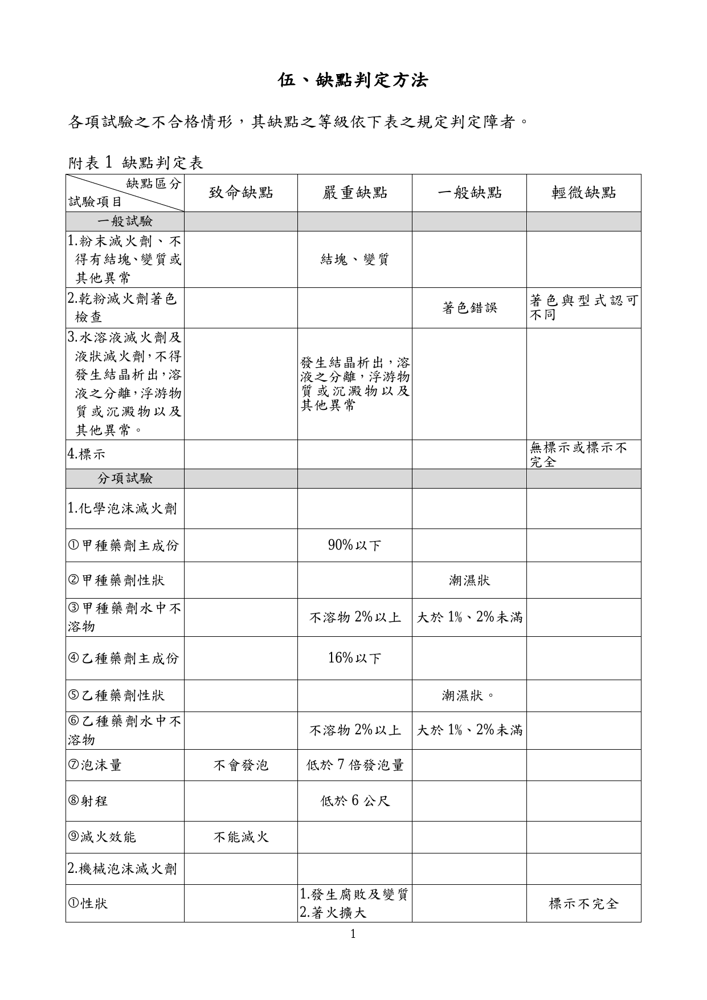
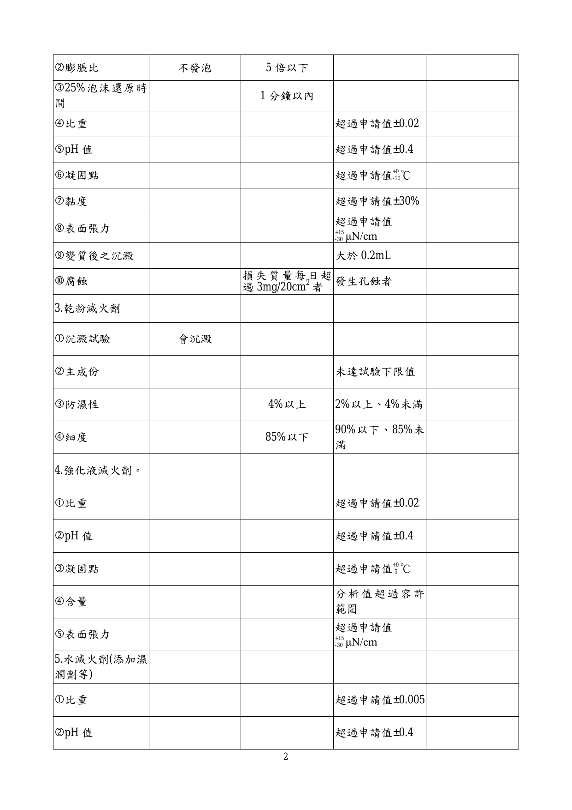
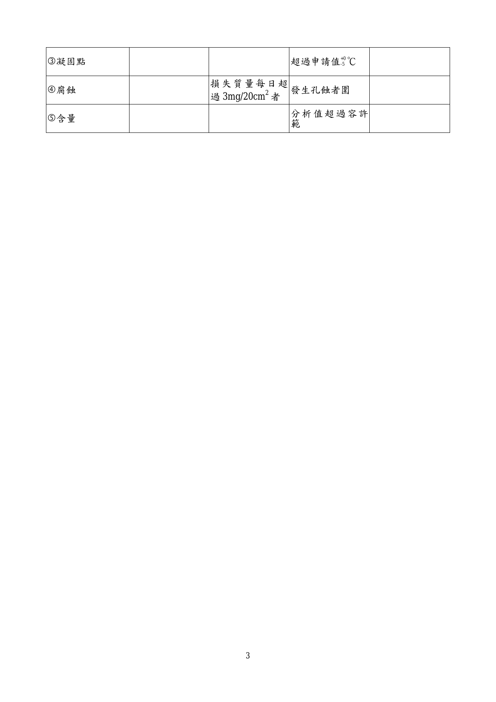

# 滅火器用滅火藥劑認可基準

> 來源：內政部消防署｜版本日期：民國 102 年 07 月 19 日
>
> ⚠️ **法規快照**：本檔為入庫當下之版本，引用前請依 index.md「法規時效」核對官方現行版本。
>
> 📌 **免責聲明**：本檔內容部分為 PDF／影像 OCR 與人工整理之結果，可能有辨識誤差。**一切以主管機關（內政部消防署）公告之現行版本為準**；如有疑義，以官方公告為主。後續 AI 代理人引用本檔時應主動提醒使用者此點，並於必要時自行上網查證正確版本。
>
> 🛈 本檔由 PDF（`pdftotext -layout`）轉換並人工整理（原始為分點 6 檔，已依序合併）。依三層表格原則：散文與簡單數值表、AQL 抽樣表已內嵌 markdown；複雜跨欄矩陣表、缺點判定表、紀錄表（表單）及附圖僅附文末原始 PDF 連結。公式以 LaTeX 呈現。

---

## 壹、技術規範及試驗方法

### 一、適用範圍

供滅火器使用之滅火藥劑（以下簡稱為滅火劑），其成份、性能等技術規範及試驗方法，應符合本基準之規定。

### 二、滅火劑之共通性質

#### （一）

滅火劑不得有顯著毒性或腐蝕性，且不得發生明顯之毒性或腐蝕性氣體。

#### （二）

水溶液滅火劑及液狀滅火劑，不得發生結晶析出，溶液之分離，浮游物質或沉澱物以及其他異常。

#### （三）

粉末滅火劑，不得發生結塊、變質或其他異常。

### 三、水滅火劑

水滅火器所充填之水，不得有顯著毒性或腐蝕性，且不得發生明顯之毒性或腐蝕性氣體。

### 四、二氧化碳滅火劑

二氧化碳滅火器所充之滅火劑，應符合中華民國國家標準（以下簡稱 CNS）195〔液體二氧化碳〕之規定。

### 五、化學泡沫滅火劑

#### （一）分類

本品分為甲種藥劑、乙種藥劑等 2 種。

1. 甲種藥劑：甲種藥劑經配製成甲種溶液，注入於滅火器之外殼容器。
2. 乙種藥劑：乙種藥劑經配製成乙種溶液，注入於滅火器之內殼容器。

#### （二）滅火劑

1. 甲種藥劑：除應符合 CNS 441〔化學泡沫滅火器〕規定外，並應符合下列規定：

   （1）主成份：甲種藥劑所含碳酸氫鈉（NaHCO₃）應在 90% 以上。

   （2）性狀：本品應為易溶於水之乾燥粉狀。

   （3）起泡劑：本品應加入適量之起泡劑、穩泡劑、增黏劑及防腐劑等，其數量以操作時能達到各該種滅火器標準規定之滅火效能為準。

   （4）檢驗：依 CNS 1216〔工業級碳酸氫鈉檢驗法〕之規定。

2. 乙種藥劑：除應符合 CNS 441〔化學泡沫滅火器〕規定外，並應符合下列規定：

   （1）主成份：乙種藥劑以硫酸鋁（Al₂(SO₄)₃‧nH₂O）為主成份，其氧化鋁含量應在 16% 以上。

   （2）性狀：本品應為易溶於水之乾燥粉狀。

   （3）檢驗：依 CNS 2073〔硫酸鋁（工業級）檢驗法〕國家標準之規定。

#### （三）性能

甲種、乙種藥劑之性能應符合下列之規定：

1. 本品依指定之方法溶解後，分別注入該項滅火劑適用，並已經檢驗合格之滅火器（原有滅火劑已取出並洗滌清潔）內，依照規定方法予以操作時，其射程、泡沫量、及滅火效能應符合該項藥劑所指定適用相關之泡沫滅火器國家標準之規定。

2. 水中不溶物：甲、乙兩種藥劑所含水不溶物（沉澱）均應在 1.0% 以下。且其測試之方法為稱取樣品 20 公克，溶於 500 毫升蒸餾水中，攪拌使之完全溶解後過濾，以蒸餾水洗滌之，將濾紙及不溶物置於坩堝內，以攝氏 100 度至 105 度烘箱中乾燥至重量不變，其重量減去坩堝及濾紙之重量，即為水不溶物之重量。水不溶物以下列計算式表示：

$$水不溶物百分比 = \frac{水中不溶物重量\,(\text{公克})}{樣品重\,(\text{公克})} \times 100\,(\%)$$

3. 為易於識別，甲、乙兩種藥劑之包裝必須先用塑膠袋分別密封。手提型用之藥劑每套用不易破裂之盒（或袋）合併裝於一盒（或一袋），輪架型用藥劑每套應合併裝於不易被壓破裂之厚紙箱或馬口鐵桶。在塑膠袋上分別以不易磨滅之方法標明「甲」「乙」字樣。

   （1）在盛裝甲乙兩種藥劑之塑膠袋上，分別標明藥劑名稱、重量、適用滅火器之種類、型式及容量、調配及裝置方法。

   （2）在盒或袋之外面，除註明上列各項外，並標明製造者名稱、商標及地址、製造年月。

### 六、機械泡沫滅火劑

#### （一）分類

係以表面活性劑或水成膜混合水溶液所產生泡沫之滅火劑。

#### （二）性狀

1. 泡沫滅火劑應施予防腐處理，但無腐敗及變質之虞者，不在此限。
2. 自滅火器所噴射之泡沫，應能保持耐火性能。
3. 滅火劑應為水溶液，液狀或粉末狀，如為液狀或粉末狀者，應能容易溶解於水，且於該滅火劑容器上標示「應使用飲用水溶解」等字樣（如在容器無法標示者則標示於包裝）。

#### （三）檢驗

1. 灌裝此滅火劑之滅火器，使其作動時，泡沫膨脹比在 5 倍以上，且 25% 還原時間在 1 分鐘以上。
2. 比重應在申請值 ±0.02 以內，其測定係依 CNS 12450〔液體比重測定法〕之規定實施。
3. pH 值應在申請值 ±0.4 以內，其測定係依 CNS 6492〔水溶液 pH 測定方法〕之規定實施。
4. 凝固點應在申請值 +0／-10℃ 以內，其測定係於內徑 18mm 之試管內採取試料 10mL，於試管中放入溫度計，以冰浴加以冷卻（不得急遽冷卻），並以溫度計加以攪拌，開始生成結晶的時候，由冰浴取出，並繼續攪拌，讀取結晶消失時之溫度。
5. 黏度應在申請值 ±30% 以內，其測定係依 CNS 3390〔透明與不透明液體黏度試驗法（動黏度及絕對黏度）〕之規定實施，試料之溫度為 20±1℃。
6. 表面張力（適用於添加表面活性劑之強化液）係測定原液及造成表面張力急遽變化之稀釋倍率（2 的 X 次方），應在申請值 +15／-30 μN/cm 以內，以吊環式（Du Nouy ring method）或吊板式（Wilhelmy plate method）實施之。
7. 變質後之沉澱應在 0.2mL 以下，依下列方式測定：

   （1）由約 200mL 玻璃之三角燒瓶中取出試料 150mL，加上軟木塞，在 65±2℃ 之環境中靜置 216 小時後恢復至室溫，使試料保持室溫溫度。

   （2）在 -18±2℃（如果凝固點低不會結凍，則用凝固點以下之溫度）之環境中靜置 24 小時後恢復至室溫，使試料保持室溫溫度。

   （3）將試料調整至 20±1℃，依 CNS 12261〔潤滑油沉澱價試驗法〕，在離心分離器用沉澱管中加入 100mL，以離心分離器使之旋轉 10 分鐘，然後讀取沉澱量。

   （4）再將離心分離器旋轉 3 分鐘，讀取沉澱量，重複進行，直到沉澱量沒有變化為止。

   （5）離心分離器之離心力，應有重力加速度之 600 至 700 倍。

8. 腐蝕（不得發生孔蝕，且每日質量之損失應在 3mg/20cm³ 以下）。腐蝕試驗依下列方式實施：

   （1）將鋼及鋁之試驗片，浸泡於液溫在 38±2℃ 之滅火藥劑中 21 天，觀察其有無質量之減少或孔蝕。

   （2）對於每一試料，準備如下規定之試驗片各 4 片。

   | 項目 | 規格 |
   |---|---|
   | 尺度 | 75mm × 12mm × 1.0mm |
   | 表面積 | 19.74 cm²（約 20 cm²） |
   | 材質 | 鋼 CNS 9278（SPCC）、鋁 CNS 2253（5052） |

   試驗片之表面，應為未加工之素面。

### 七、乾粉滅火劑

#### （一）

乾粉滅火劑係指施予防濕加工之鈉或鉀之重碳酸鹽或其他鹽類，以及磷酸鹽類，硫酸鹽類及其他具有防焰性能之鹽類（以下稱為磷酸鹽類），並符合下列各項規定：

1. 粉末細度，應能通過 CNS 386〔試驗篩〕之 80 篩網目（mesh）90% 以上者。
2. 於溫度 30±1℃，相對濕度 60% 之恆溫恆濕槽中，靜置 48 小時以上，使試樣達到恆量後，將試樣於 30±1℃，相對濕度 80% 之恆溫恆濕槽中，靜置 48 小時之試驗時，重量增加率應在 2% 以下。
3. 沉澱試驗，取試樣 5 公克均勻散佈於直徑 9cm 並盛有水 300ml 燒杯，於 1 小時內不發生沉澱。

#### （二）

各種乾粉之主成份，簡稱、著色等規定如下表：

#### 表一　各種乾粉滅火劑主成份、簡稱及著色

| 種類 | 簡稱 | 主成份 | 著色 |
|---|---|---|---|
| 1. 多效磷鹽乾粉 | ABC 乾粉 | 磷酸二氫銨（NH₄H₂PO₄）70% 以上 | 以白色或紫色以外顏色著色，且不得滲入白土（CLAY）2% 以上。 |
| 2. 普通乾粉 | BC 乾粉 | 碳酸氫鈉（NaHCO₃）90% 以上 | 白色 |
| 3. 紫焰乾粉 | KBC 乾粉 | 碳酸氫鉀（KHCO₃）85% 以上 | 淺紫色 |
| 4. 鉀鹽乾粉 | XBC 乾粉 | － | － |
| 5. 硫酸鉀乾粉 | XBC-SO | 硫酸鉀（K₂SO₄）70% 以上 | 白色 |
| 6. 氯化鉀乾粉 | XBC-CL | 氯化鉀（KCℓ）70% 以上 | 白色 |
| 7. 碳酸氫鉀與尿素化學反應物 | XBC-Monnex | （KHCO₃＋H₂NCONH₂）鉀為 27-29%，氮為 14-17% | 灰白色 |

> 備註：第 1～6 項各乾粉滅火劑之試驗下限值得有本表所列主成份數值乘以 5% 之誤差。

#### （三）檢驗

1. 視密度：秤取樣品 100 公克（±0.1 公克）於清淨乾燥燒杯內，用玻璃棒攪鬆後，經短頸漏斗緩慢地傾入 250ml 量筒中，然後用玻璃棒撥平樣品表面，靜置 60 秒，讀取樣品容積，依下式計算視密度（g/ml）。

$$視密度 = \frac{100\,(\text{g})}{讀取樣品容積\,(\text{ml})}$$

2. 防濕性：秤取樣品 10 公克放置於直徑為 6 公分之秤量瓶內，於溫度 30±1℃，相對濕度 60% 之恆溫恆濕槽中，使用濃度為 38.1% 之硫酸乾燥器，靜置 48 小時以上，使試樣達到恆量後，再將試樣於溫度 30±1℃，相對濕度 80% 恆溫恆濕槽中，使用過飽和氯化銨乾燥器，靜置 48 小時之試驗後，其結果應符合七、(一)、2、之規定。

$$防濕性 = \frac{相對濕度80\%時之重量 - 相對濕度60\%時之重量}{相對濕度60\%時之試樣重量} \times 100\,(\%)$$

3. 細度：秤取樣品 100±0.1 公克，以符合 CNS 386 之試驗篩秤其殘留篩上之樣品重量，依下式計算細度。

$$細度百分比 = \frac{100 - 殘留篩之樣品重\,(\text{公克})}{100} \times 100\,(\%)$$

4. 滅火劑之主成份依照下列方法檢驗：

   （1）前處理方法：秤取樣品約 1g 加 10ml 95% 以上之乙醇，於 50℃ 水浴 30 分鐘以破壞防濕性能後加水溶解，經過濾雜質後試驗。

   （2）碳酸氫鈉（或碳酸氫鉀）：秤取樣品 0.7 至 0.8 公克於錐形瓶中，加數滴中性無水酒精濕潤後加 0.1N NaOH 標準液 100ml，10% BaCl₂ 溶液 50ml 及酚酞指示劑 3 至 4 滴，充分振盪，以 0.1N H₂SO₄ 標準液送滴定至紅色消失，依下列計算 NaHCO₃ 含量。

   （3）NaHCO₃ 依壹、六、(三)、4、（2）之滴定法試驗。

   （4）KHCO₃ 由 HCO₃⁻ 換算時依本基準壹、六、(三)、4、（2）之滴定法試驗，由 K⁺ 換算時，依 CNS 8451〔肥料檢驗法－鉀之測定〕第 3 節四苯硼鈉容量法及第 4 節火燄光測定法或原子吸光譜測定法之規定辦理。

   （5）NH₄H₂PO₄ 依 CNS 8450〔肥料檢驗法－磷之測定〕第 4 節鉬釩磷酸鹽比色法及第 3.1 節喹啉容量法，對於磷之測定如以喹啉容量法試驗時，應以乙醇做為磷酸鹽滅火劑之去防濕溶劑，置於 70℃ 恆溫水浴中 10 分鐘後取出，做為磷酸鹽滅火劑之前處理方法。

   （6）K₂SO₄ 由 K⁺ 換算時與 KHCO₃ 相同，SO₄²⁻ 換算時，依 CNS 5239〔硫酸鉀檢驗法〕第 2.1.1 節以硫酸根含量測定硫酸鉀之含量。

   （7）KCl 以 K⁺ 換算時與 KHCO₃ 相同，由 Cl⁻ 換算時依 CNS 283〔工業鹽取樣法及化學分析法〕第 6 節之規定辦理。

   （8）KHCO₃ 加尿素中之鉀與 KHCO₃ 相同，氮可依 CNS 8449〔肥料檢驗法－氮之測定〕第 2.1 節硫酸法試驗之規定辦理。

### 八、強化液滅火劑

#### （一）

為鹼金屬鹽類之水溶液，呈鹼性反應。

#### （二）

比重應在申請值 ±0.02 以內，其測定係依 CNS 12450〔液體比重測定法〕之規定實施。

#### （三）

pH 值應在申請值 ±0.4 以內，其測定係依 CNS 6492〔水溶液 pH 測定方法〕之規定實施。

#### （四）

凝固點在 -20℃ 以下，其測定係於內徑 18mm 之試管內採取試料 10mL，於試管中放入溫度計，以冰浴加以冷卻（不得急遽冷卻），並以溫度計加以攪拌，開始生成結晶的時候，由冰浴取出，並繼續攪拌，讀取結晶消失時之溫度。

#### （五）

含量測定（適用於中性強化液），係在 pH 值為中性（申請值為 pH 6～8）之滅火藥劑中，針對該滅火藥劑之特性或性能會造成重要影響之成分進行，其分析按照成分的種類採取適當之方法。

#### （六）

表面張力（適用於添加表面活性劑之強化液）係測定原液及造成表面張力急遽變化之稀釋倍率（2 的 X 次方），應在申請值 +15／-30 μN/cm 以內，以吊環式（Du Nouy ring method）或吊板式（Wilhelmy plate method）實施之。

### 九、濕潤劑等

#### （一）

為提高水滅火器性能或改良其性狀，得混合或添加濕潤劑，防凍劑或其他藥劑等（以下稱為濕潤劑等）。

#### （二）

對於在水中添加濕潤劑等之滅火藥劑，為確認其性質，應就下列事項進行測定：

1. 比重應在申請值 ±0.005 以內，其測定係依 CNS 12450〔液體比重測定法〕之規定實施。
2. pH 值應在申請值 ±0.4 以內，其測定係依 CNS 6492〔水溶液 pH 測定方法〕之規定實施。
3. 凝固點應在申請值 +0／-5℃ 以內，其測定係於內徑 18mm 之試管內採取試料 10mL，於試管中放入溫度計（其最小刻度在 0.2℃ 以下），以冰浴加以冷卻（不得急遽冷卻），並以溫度計加以攪拌，開始生成結晶的時候，由冰浴取出，並繼續攪拌，讀取結晶消失時之溫度。
4. 腐蝕（不得發生孔蝕，且每日質量之損失應在 3mg/20cm³ 以下）。腐蝕試驗依下列方式實施：

   （1）將鋼及鋁之試驗片，浸泡於液溫在 38±2℃ 之滅火藥劑中 21 天，觀察其有無質量之減少或孔蝕。

   （2）對於每一試料，準備如下規定之試驗片各 4 片。尺度：75mm × 12mm × 1.0mm；表面積：19.74 cm²（約 20 cm²）；材質：鋼 CNS 9278（SPCC）、鋁 CNS 2253（5052）。試驗片之表面，應為未加工之素面。

5. 含量：含量係就濕潤劑等之中，對於該滅火藥劑之性質或性能會造成重要影響之成分分析之。其分析係採適合該濕潤劑等種類之方法。

#### （三）

濕潤劑等不得使滅火劑之性狀或性能受到不良影響。

### 十、包裝

滅火劑應妥予儲存於適當容器，以免產生稀釋、濃縮、結塊、吸濕、變質及其他異常現象。

### 十一、標示

滅火劑容器上（如在容器上不適於標示者則標示在包裝上）應標示下列項目：

1. 品名
2. 適用滅火器之種類
3. 使用方法
4. 使用上應注意事項
5. 製造年月
6. 滅火藥劑之容量或重量
7. 製造廠商名稱或其商標

---

## 貳、型式認可作業

### 十二、型式試驗之試驗項目及樣品數

#### （一）試驗區分為一般試驗及分項試驗，項目及樣品數如下：

> 📋 **表二（型式試驗項目及樣品數表）**：原始 PDF 為跨欄合併表（試驗區分／試驗項目／樣品數三欄，且樣品數欄混合列出五類滅火劑之取樣規格），版面交錯難以乾淨轉換。關鍵內容摘錄如下，完整對照請見文末原始 PDF（第 2 點，第 1 頁）。

**一般試驗項目**：
1. 粉末滅火劑，不得有結塊、變質或其他異常。
2. 粉末滅火劑著色檢查。
3. 水溶液滅火劑及液狀滅火劑，不得發生結晶析出，溶液之分離，浮游物質或沉澱物以及其他異常。
4. 標示。

**一般試驗各類滅火劑取樣量（樣品數欄）**：
- ① 化學泡沫滅火劑：7 套
- ② 機械泡沫滅火劑：17 瓶（120ml/瓶）
- ③ 乾粉滅火劑：11 包（150g/包）
- ④ 強化液滅火劑：17 瓶（120ml/瓶）
- ⑤ 水滅火劑：17 瓶（120ml/瓶）

**分項試驗項目及樣品數**：

| 滅火劑類別 | 試驗項目 | 樣品數 |
|---|---|---|
| 1. 化學泡沫滅火劑 | 甲種藥劑主成份、性狀、水中不溶物 | 1 包 |
| | 乙種藥劑主成份、性狀、水中不溶物 | 1 包 |
| | 泡沫量 | 1 套 |
| | 射程 | 1 套 |
| | 滅火效能 | 4 套 |
| 2. 機械泡沫滅火劑 | 性狀 | 1 瓶 |
| | 膨脹比及還原時間 | 2 瓶 |
| | 比重 | 3 瓶 |
| | pH 值 | 3 瓶 |
| | 凝固點 | 3 瓶 |
| | 黏度 | 2 瓶 |
| | 表面張力 | 2 瓶 |
| | 變質後之沉澱 | 2 瓶 |
| | 腐蝕 | 2 瓶 |
| 3. 乾粉滅火劑 | 沉澱試驗 | 3 包 |
| | 主成份 | 2 包 |
| | 防濕性 | 3 包 |
| | 細度 | 2 包 |
| 4. 強化液滅火劑 | 比重 | 3 瓶 |
| | pH 值 | 3 瓶 |
| | 凝固點 | 3 瓶 |
| | 含量（適用於中性） | 2 瓶 |
| | 表面張力（適用於添加表面活性劑） | 2 瓶 |
| 5. 水滅火劑（添加濕潤劑等） | 比重 | 3 瓶 |
| | pH 值 | 3 瓶 |
| | 凝固點 | 3 瓶 |
| | 腐蝕 | 2 瓶 |
| | 含量 | 2 瓶 |

> 備註：甲、乙種藥劑分別用塑膠袋包裝密封後將合併裝於一盒稱之為一套。

#### （二）腐蝕試驗金屬試片（限機械泡沫或添加濕潤劑等之水滅火劑）

| 試驗片之材質 | 試驗片之尺度（mm） | 數量（片） |
|---|---|---|
| 鋼 CNS 9278（SPCC） | 75 × 12 × 1.0 | 10（含備用） |
| 鋁 CNS 2253（5052） | 75 × 12 × 1.0 | 10（含備用） |

### 十三、型式區分

| 藥劑種類 | 型式區分 |
|---|---|
| 1. 水滅火劑（添加濕潤劑等） | 水滅火劑（添加濕潤劑等） |
| 2. 二氧化碳滅火劑 | 二氧化碳滅火劑 |
| 3. 化學泡沫滅火劑 | 甲種藥劑 |
| | 乙種藥劑 |
| 4. 機械泡沫滅火劑 | 表面活性劑泡沫滅火劑 |
| | 水成膜泡沫滅火劑 |
| 5. 乾粉滅火劑 | 多效磷鹽乾粉（A.B.C 乾粉） |
| | 普通乾粉（B.C 乾粉） |
| | 紫焰乾粉（KBC 乾粉） |
| | 鉀鹽乾粉（XBC 乾粉） |
| | 硫酸鉀乾粉（XBC-SO） |
| | 氯化鉀乾粉（XBC-CL） |
| | 碳酸氫鉀與尿素化學反應物（XBC-Monnex） |
| 6. 強化液滅火劑 | 強化液滅火劑 |

### 十四、型式試驗結果判定

1. 符合本認可基準規定者，該型式試驗結果視為「合格」；依「缺點判定表」（附表 1）判定未符合本認可基準規定者，該型式試驗結果視為「不合格」。
2. 符合下述十五、補正試驗所定事項者，得進行補正試驗，並以一次為限。

### 十五、補正試驗

符合下列規定者得進行補正試驗：

1. 型式試驗之不良事項為申請資料不完備、標示遺漏者。
2. 試驗設備不完備或有缺失，致無法進行試驗者。

### 十六、輕微變更

係指變更之範圍為標示、標識及乾粉著色等，其變更不致對其形狀、構造、材質、成份及性能產生影響者。

### 十七、試驗紀錄

申請型式認可應填載產品規格明細表（如附表 2）、型式試驗紀錄表（如附表 3）。

---

## 參、個別認可作業

### 十八、方法

#### （一）

個別認可依照 CNS 9042 規定進行抽樣試驗。

#### （二）

抽樣試驗之嚴寬等級分為寬鬆試驗、普通試驗、嚴格試驗及最嚴格試驗四種。

### 十九、抽樣

#### （一）

個別認可所需之試料數目，係根據檢查之嚴格程度及批次大小，依附表 5 至附表 8 所列抽樣表中列定之數目，依據抽樣表先抽取一般試驗之樣品數，再由一般試驗之樣品數中，抽取分項試驗之樣品數。

#### （二）樣品之抽樣依下列規定：

1. 抽樣試驗應以每一批為單位。
2. 樣品之多寡，應視整批成品（受驗數量＋預備品）數量之多寡及試驗等級，按抽樣表之規定抽取，並在重新編號之全部製品（受驗批）中，依隨機抽樣法（CNS 9042）隨意抽取，抽出之樣品依抽出順序編排序號。但受驗批次數量在 300 個以上時，應依下列規定分為二段抽樣：

   （1）計算每群應抽之數量：當受驗批次在五群（含箱子及集運架等）以上時，每一群之製品數量應在 5 個以上之定數，並事先編定每一群之編碼；但最後一群之數量，未滿該定數亦可。

   （2）抽出之產品賦予群碼號碼：同群製品須排列整齊，且排列號碼應能清楚辨識。

   （3）確定群數及抽出個群，再從個群中抽出樣品：確定從所有群產品中可抽出五群以上之樣品，以隨機取樣法抽取相當數量之群，再由抽出之各群製品作系統式循環抽樣（由各群中抽取同一編號之製品），將受驗之樣品抽出。

   （4）依上述方法取得之製品數量超過樣品所需數量時，重複進行隨機取樣去除超過部分至達到所要數量。

### 二十、試驗項目

#### （一）試驗區分為一般試驗及分項試驗如下：

**一般試驗**：
1. 粉末滅火劑，不得有結塊、變質或其他異常。
2. 粉末滅火劑著色檢查。
3. 水溶液滅火劑及液狀滅火劑，不得發生結晶析出，溶液之分離，浮游物質或沉澱物以及其他異常。
4. 標示。

**分項試驗**：
1. 化學泡沫滅火劑：甲種藥劑主成份、性狀、水中不溶物；乙種藥劑主成份、性狀、水中不溶物；泡沫量。
2. 機械泡沫滅火劑：性狀、膨脹比及還原時間、比重、pH 值、凝固點、黏度、表面張力、變質後之沉澱。
3. 乾粉滅火劑：沉澱試驗、主成份、防濕性、細度。
4. 強化液滅火劑：比重、pH 值、凝固點、含量（適用於中性強化液）、表面張力（適用於添加表面活性劑之強化液）。
5. 水滅火劑（添加濕潤劑等）：比重、pH 值、凝固點、含量。

> 備註：甲、乙種藥劑分別用塑膠袋包裝密封後將合併裝於一盒稱之為一套。

#### （二）

個別試驗結果，應填載「個別試驗紀錄表」（附表 4）。

### 二十一、結果判定

合格與否，依抽樣表、缺點判定表及下列規定判定之。一般試驗及分項試驗，應分別計算其不良品之數量。

#### （一）

抽樣試驗中，一般試驗及分項試驗之不良品數，均於合格判定個數以下時，視該批為合格。且下一批可依二十三、試驗嚴寬度等級之調整更換較寬鬆之試驗等級。

#### （二）

抽樣試驗中，一般試驗及分項試驗，任一試驗之不良品數在不合格判定個數以上時，視該批為不合格。下一批依二十三、試驗嚴寬度等級之調整更換較嚴格之試驗等級。但該等不良品之缺點僅為輕微缺點時，得進行補正試驗，惟以一次為限。

#### （三）

抽樣試驗中出現致命缺點之不良品時，即使該抽樣試驗中不良品數在合格判定個數以下，該批仍視為不合格。下一批依二十三、試驗嚴寬度等級之調整更換較嚴格之試驗等級。

### 二十二、結果之處置

#### （一）合格批次之處置

1. 當批次雖經判定為合格，但受驗樣品中如發現有不良品時，應使用預備品替換或修復該等不良品數量後，方視整批為合格品。
2. 當批次雖經判定為合格，其不良品部分之個數，如無預備品替換或無法修復調整者，仍判定為不合格。

#### （二）補正批次之處置

1. 接受補正試驗時，應提出初次試驗時所發現不良事項之改善說明書及不良品處理後之補正試驗合格紀錄表。
2. 補正試驗之受驗樣品數以初次試驗之受驗樣品數為準。

#### （三）不合格批次之處置

1. 不合格批次之產品接受再試驗時，應提出初次試驗時所發現不良事項之改善說明書，及不良品處理之補正試驗合格紀錄表。
2. 不合格批次之產品接受再試驗時，不得加入初次試驗受驗製品以外之製品。
3. 不合格之批次不再試驗時，應向認可機構備文說明理由及其廢棄處理等方式。

### 二十三、試驗嚴寬度等級之調整

首次申請個別認可：試驗等級以普通試驗為之，其後之試驗等級調整，依下表之規定。

> 📋 **表三（試驗嚴寬度等級調整轉換條件表）**：以四欄（寬鬆／普通／嚴格／最嚴格試驗）並列各自之升降級條件，條文冗長且跨欄對照，完整內容請見文末原始 PDF（第 3 點）。重點轉換條件摘錄如下：
> - **普通→寬鬆**：須符合下列所有條件——(1) 最近連續 10 批次接受普通試驗，第一次試驗均合格者；(2) 從最近連續 10 批次中抽樣之不合格品總數在附表 9 寬鬆試驗界限數以下者（累計比較以一般檢查進行）。
> - **普通→嚴格**：符合下列各條件之一——(1) 第一次試驗時該批次為不合格，且將該批次連同前 4 批次連續共 5 批次之不合格品總數累計，達附表 10 所示嚴格試驗之界限數以上者（具致命缺點之產品計入嚴重缺點不合格品數量）；(2) 第一次試驗時因致命缺點而不合格者。
> - **寬鬆→普通**：符合下列各條件之一——(1) 一批次在初次檢查即不合格者；(2) 一批次在初次檢查為附帶條件合格者（寬鬆檢查時試品中不合格個數超過 Ac 未達 Re，該批判斷為合格者）。
> - **嚴格→普通**：進行嚴格試驗者，連續五批次在第一次試驗即合格者。
> - **嚴格→最嚴格**：嚴格試驗者第一次試驗中不合格批次數累計達 3 批次時，應對申請者提出改善措施之勸導並中止試驗；勸導後經確認已有品質改善措施時，下次試驗以最嚴格試驗進行。
> - **最嚴格→嚴格**：進行最嚴格試驗者，連續五批次之第一次試驗即合格，則下次試驗得轉換成嚴格試驗。

### 二十四、個別認可試驗之限制

當批次完成上述之個別認可試驗完整程序後，方能申請及執行下一批次之個別認可試驗。

### 二十五、其他

個別認可時，若發現製品有其他不良事項，經認定該產品之抽樣標準及個別認可方法不適當時，得另訂個別認可方法及抽樣標準。

---

## 肆、主要試驗設備

#### 表四　主要試驗設備

| 試驗設備等 | 規格 | 數量 |
|---|---|---|
| 計算機 | 8 位數以上 | 1 台 |
| 電子天平 | 0～180g | 1 台 |
| 電子秤 | 0～2100g、0～5100g | 各 1 台 |
| 滴定管 | 0～50 ml | 2 組 |
| 恆溫恆濕機 | 0～85℃、30～95RH | 1 台 |
| 烘箱 | Rt～300℃ | 1 台 |
| 恆溫水槽 | Rt～100℃ | 1 台 |
| 篩網 | 80 mesh | 2 個 |
| CO₂ 純度裝置 | 供檢測 CO₂ 濃度裝置 | 1 組 |
| 數位式滴定器 | 0～50 ml | 2 組 |
| 比重計 | 1.7～2.0（最小刻度 0.002） | 1 組 |
| pH 計 | 可以讀出酸鹼度（pH 值）至小數第二位 | 1 式 |
| 溫度計 | -30～50℃（最小刻度在 0.2℃ 以下） | 1 支 |
| 冷卻器 | 適合冰浴凝固點之測定 | 1 個 |
| 試管 | ψ18mm | 2 個 |
| 離心機 | 一般離心機，相對離心力 600～700 rcf | 1 台 |
| 離心管 | 符合 CNS 12261 潤滑油沉澱價試驗法圖 1 錐形離心管 | 2 支 |
| 表面張力計 | 0～500 dynes/cm（mN/m），精度 ±1% | 1 台 |
| 黏度計 | 0.9～100 cSt | 1 支 |
| 黏度計用水槽 | 0～50℃，精度 ±1% | 1 台 |

---

## 伍、缺點判定方法

各項試驗之不合格情形，其缺點之等級依「缺點判定表」（附表 1）之規定判定。

> 📷 截自原始 PDF「第 5 點完整條文」第 1～3 頁。重點門檻摘錄如下：
>
> **一般試驗**
> - 粉末滅火劑（不得結塊、變質）：結塊、變質 → 嚴重缺點。
> - 乾粉滅火劑著色檢查：著色錯誤 → 一般缺點；著色與型式認可不同 → 輕微缺點。
> - 水溶液／液狀滅火劑（不得結晶析出等）：發生結晶析出、溶液分離、浮游物質或沉澱物及其他異常 → 嚴重缺點。
> - 標示：無標示或標示不完全 → 輕微缺點。
>
> **分項試驗（化學泡沫滅火劑）**
> - 甲種藥劑主成份：90% 以下 → 嚴重缺點。
> - 甲種藥劑性狀：潮濕狀 → 一般缺點。
> - 甲／乙種藥劑水中不溶物：不溶物 2% 以上 → 嚴重缺點；大於 1%、未滿 2% → 一般缺點。
> - 乙種藥劑主成份：16% 以下 → 嚴重缺點。
> - 乙種藥劑性狀：潮濕狀 → 一般缺點。
> - 泡沫量：不會發泡 → 致命缺點；低於 7 倍發泡量 → 嚴重缺點。
> - 射程：低於 6 公尺 → 嚴重缺點。
> - 滅火效能：不能滅火 → 致命缺點。
>
> **分項試驗（機械泡沫滅火劑）**
> - 性狀：1. 發生腐敗及變質、2. 著火擴大 → 嚴重缺點；標示不完全 → 輕微缺點。
> - 膨脹比：不發泡 → 嚴重缺點；5 倍以下 → 一般缺點。
> - 25% 泡沫還原時間：1 分鐘以內 → 一般缺點。
> - 比重：超過申請值 ±0.02 → 一般缺點。
> - pH 值：超過申請值 ±0.4 → 一般缺點。
> - 凝固點：超過申請值 +0／-10℃ → 一般缺點。
> - 黏度：超過申請值 ±30% → 一般缺點。
> - 表面張力：超過申請值 +15／-30 μN/cm → 一般缺點。
> - 變質後之沉澱：大於 0.2mL → 一般缺點。
> - 腐蝕：損失質量每日超過 3mg/20cm² 者 → 嚴重缺點；發生孔蝕者 → 一般缺點。
>
> **分項試驗（乾粉滅火劑）**
> - 沉澱試驗：會沉澱 → 嚴重缺點。
> - 主成份：未達試驗下限值 → 一般缺點。
> - 防濕性：4% 以上 → 一般缺點；2% 以上、未滿 4% → 輕微缺點。
> - 細度：85% 以下 → 一般缺點；90% 以下、85% 未滿 → 輕微缺點。
>
> **分項試驗（強化液滅火劑）**
> - 比重：超過申請值 ±0.02 → 一般缺點。
> - pH 值：超過申請值 ±0.4 → 一般缺點。
> - 凝固點：超過申請值 +0／-5℃ → 一般缺點。
> - 含量：分析值超過容許範圍 → 一般缺點。
> - 表面張力：超過申請值 +15／-30 μN/cm → 一般缺點。
>
> **分項試驗（水滅火劑：添加濕潤劑等）**
> - 比重：超過申請值 ±0.005 → 一般缺點。
> - pH 值：超過申請值 ±0.4 → 一般缺點。
> - 凝固點：超過申請值 +0／-5℃ → 一般缺點。
> - 腐蝕：損失質量每日超過 3mg/20cm² 者 → 嚴重缺點；發生孔蝕者 → 一般缺點。
> - 含量：分析值超過容許範圍 → 一般缺點。
>
> 🛈 上述各缺點分級之欄位歸屬（致命／嚴重／一般／輕微）係依原 PDF 跨欄版面研判，部分儲存格對位可能有誤差，引用前請核對原始 PDF（第 5 點，第 1～3 頁）。

---

## 附表

> 抽樣表（附表 5～8）及界限數（附表 9、10）已內嵌如下。**缺點判定表（附表 1）見上節「伍」摘錄；產品規格明細表（附表 2）、型式試驗紀錄表（附表 3）、個別試驗紀錄表（附表 4）屬空白表單，僅附文末原始 PDF 連結。**

### 附表 5　普通試驗抽樣表

> Ac：合格判定個數；Re：不合格判定個數。空白處沿用上方箭頭指示之抽樣方式。
> 備考：1. 乾粉每 1 試料數取樣最少 500g。2. 化學泡沫滅火劑為甲、乙種藥劑，分別用塑膠袋包裝密封後合併裝於一盒稱之為一套，即為 1 樣品數。3. 機械泡沫滅火劑、強化液滅火劑、水滅火劑（添加濕潤劑等）每 1 試料數取樣最少 500ml。

| 批次 | 一般試驗 樣品數 | 嚴重 Ac/Re | 一般 Ac/Re | 輕微 Ac/Re | 分項 樣品數 | 分項嚴重 Ac/Re | 分項一般 Ac/Re |
|---|---|---|---|---|---|---|---|
| 1〜8 | 2 | | | | | | |
| 9〜15 | 2 | | | | | | |
| 16〜25 | 3 | | | | | | |
| 26〜50 | 3 | | 0/1 | | | | |
| 51〜90 | 5 | | | | | | |
| 91〜150 | 5 | | | 1/2 | 2 | 0/1 | 0/1 |
| 151〜280 | 8 | | | | | | |
| 281〜500 | 8 | | 2/3 | | | | |
| 501〜1,200 | 13 | | | | | | |
| 1,201〜3,200 | 13 | 0/1 | 1/2 | 3/4 | | | |
| 3,201〜10,000 | 20 | | | | | | |
| 10,001〜35,000 | 20 | | 2/3 | 5/6 | | | |
| 35,001〜150,000 | 32 | | | | 3 | 0/1 | 0/1 |
| 150,001〜500,000 | 32 | | 3/4 | 7/8 | | | |
| 500,001 以上 | 50 | 1/2 | 5/6 | 10/11 | | | |

### 附表 6　寬鬆試驗抽樣表

> 備考同附表 5。

| 批次 | 一般試驗 樣品數 | 嚴重 Ac/Re | 一般 Ac/Re | 輕微 Ac/Re | 分項 樣品數 | 分項嚴重 Ac/Re | 分項一般 Ac/Re |
|---|---|---|---|---|---|---|---|
| 1〜8 | 2 | | | | | | |
| 9〜15 | 2 | | | | | | |
| 16〜25 | 2 | | | | | | |
| 26〜50 | 2 | | | | | | |
| 51〜90 | 2 | | | | | | |
| 91〜150 | 2 | | 0/2 | 1/2 | | | |
| 151〜280 | 3 | | | | | | |
| 281〜500 | 3 | | | 1/3 | 2 | 0/1 | 0/1 |
| 501〜1,200 | 5 | | | | | | |
| 1,201〜3,200 | 5 | 0/1 | 1/2 | 2/4 | | | |
| 3,201〜10,000 | 8 | | | | | | |
| 10,001〜35,000 | 8 | | 1/3 | 2/5 | | | |
| 35,001〜150,000 | 13 | | | | | | |
| 150,001〜500,000 | 13 | | 2/4 | 3/6 | | | |
| 500,001 以上 | 20 | 1/2 | 2/5 | 5/8 | | | |

### 附表 7　嚴格試驗抽樣表

> 備考同附表 5。

| 批次 | 一般試驗 樣品數 | 嚴重 Ac/Re | 一般 Ac/Re | 輕微 Ac/Re | 分項 樣品數 | 分項嚴重 Ac/Re | 分項一般 Ac/Re |
|---|---|---|---|---|---|---|---|
| 1〜8 | 2 | | | | | | |
| 9〜15 | 2 | | | | | | |
| 16〜25 | 3 | | | | | | |
| 26〜50 | 3 | | | | | | |
| 51〜90 | 5 | | | | | | |
| 91〜150 | 5 | | 0/1 | | | | |
| 151〜200 | 8 | | | 1/2 | 3 | 0/1 | 0/1 |
| 201〜500 | 8 | | | | | | |
| 501〜1,200 | 13 | | | 2/3 | | | |
| 1,201〜3,200 | 13 | | | | | | |
| 3,201〜10,000 | 20 | | | | | | |
| 10,001〜35,000 | 20 | 0/1 | 1/2 | 3/4 | | | |
| 35,001〜150,000 | 32 | | | | | | |
| 150,001〜500,000 | 32 | | 2/3 | 5/6 | | | |
| 500,001 以上 | 50 | 1/2 | 3/4 | 8/9 | | | |

### 附表 8　最嚴格試驗抽樣表

> 備考同附表 5。

| 批次 | 一般試驗 樣品數 | 嚴重 Ac/Re | 一般 Ac/Re | 輕微 Ac/Re | 分項 樣品數 | 分項嚴重 Ac/Re | 分項一般 Ac/Re |
|---|---|---|---|---|---|---|---|
| 1〜8 | 2 | | | | | | |
| 9〜15 | 2 | | | | | | |
| 16〜25 | 3 | | | | | | |
| 26〜50 | 3 | | 0/1 | | | | |
| 51〜90 | 5 | | | | | | |
| 91〜150 | 5 | | | | 3 | 0/1 | 0/1 |
| 151〜280 | 8 | | | | | | |
| 281〜500 | 8 | | 0/1 | | | | |
| 501〜1,200 | 13 | | | | | | |
| 1,201〜3,200 | 13 | | 1/2 | | | | |
| 3,201〜10,000 | 20 | | | | | | |
| 10,001〜35,000 | 20 | | 2/3 | | 4 | 0/1 | 0/1 |
| 35,001〜150,000 | 32 | | | | | | |
| 150,001〜500,000 | 32 | 0/1 | 1/2 | 3/4 | | | |
| 500,001 以上 | 50 | 1/2 | 2/3 | 5/6 | | | |

> 🛈 附表 5～8 抽樣表原始 PDF 為箭頭跨欄（↑／↓）合併呈現，部分批次列之 Ac/Re 係沿用上方或下方數值。本表依原檔版面對位填列，空白格表示沿用箭頭指示之抽樣方式，引用前請核對原始 PDF（第 5 點，第 12～13 頁）。

### 附表 9　寬鬆試驗界限數

> ※ 表示樣品累計數未達轉換成寬鬆試驗之充分條件。本表適用於最近連續 10 批受普通試驗，第一次試驗時均合格者之樣品數累計。

| 累積樣品數 | 嚴重缺點 | 一般缺點 | 輕微缺點 |
|---|---|---|---|
| 10〜64 | ※ | ※ | ※ |
| 65〜79 | ※ | ※ | 0 |
| 80〜99 | ※ | ※ | 1 |
| 100〜129 | ※ | ※ | 2 |
| 130〜159 | ※ | ※ | 4 |
| 160〜199 | ※ | 0 | 6 |
| 200〜249 | ※ | 1 | 9 |
| 250〜319 | ※ | 2 | 12 |
| 320〜399 | ※ | 4 | 15 |
| 400〜499 | ※ | 6 | 19 |
| 500〜624 | ※ | 9 | 25 |
| 625〜799 | 0 | 12 | 31 |
| 800〜999 | 1 | 15 | 39 |
| 1,000〜1,249 | 2 | 19 | 50 |
| 1,250〜1,574 | 4 | 25 | 63 |

### 附表 10　嚴格試驗界限數

| 累積樣品數 | 嚴重缺點 | 一般缺點 | 輕微缺點 |
|---|---|---|---|
| 1 | 2 | 2 | 2 |
| 2 | 2 | 2 | 3 |
| 3 | 2 | 3 | 3 |
| 4 | 2 | 3 | 4 |
| 5 | 2 | 3 | 4 |
| 6〜7 | 2 | 3 | 4 |
| 8〜9 | 2 | 3 | 5 |
| 10〜12 | 2 | 4 | 5 |
| 13〜14 | 3 | 4 | 6 |
| 15〜19 | 3 | 4 | 7 |
| 20〜24 | 3 | 5 | 7 |
| 25〜29 | 3 | 5 | 8 |
| 30〜39 | 3 | 6 | 10 |
| 40〜49 | 4 | 7 | 11 |
| 50〜64 | 4 | 7 | 13 |
| 65〜79 | 4 | 8 | 15 |
| 80〜99 | 5 | 10 | 17 |
| 100〜129 | 5 | 11 | 20 |
| 130〜159 | 6 | 13 | 24 |
| 160〜199 | 7 | 15 | 28 |
| 200〜249 | 7 | 17 | 33 |
| 250〜319 | 8 | 20 | 40 |
| 320〜399 | 10 | 24 | 48 |
| 400〜499 | 11 | 28 | 60 |
| 500〜624 | 13 | 33 | 76 |
| 625〜799 | 15 | 40 | 95 |

---

## 陸、引用參考資料

| 標準編號 | 名稱 |
|---|---|
| CNS 195 | 液體二氧化碳 |
| CNS 283 | 工業鹽取樣法及化學分析法 |
| CNS 386 | 試驗篩 |
| CNS 441 | 化學泡沫滅火器 |
| CNS 1216 | 工業級碳酸氫鈉檢驗法 |
| CNS 2073 | 硫酸鋁（工業級）檢驗法 |
| CNS 5239 | 硫酸鉀檢驗法 |
| CNS 8449 | 肥料檢驗法－氮之測定 |
| CNS 8450 | 肥料檢驗法－磷之測定 |
| CNS 8451 | 肥料檢驗法－鉀之測定 |
| CNS 12450 | 液體比重測定法 |
| CNS 6492 | 水溶液 pH 測定方法 |
| CNS 3390 | 透明與不透明液體黏度試驗法（動黏度及絕對黏度） |
| CNS 12261 | 潤滑油沉澱價試驗法 |
| CNS 9278 | 冷軋碳鋼鋼片及鋼帶 |
| CNS 2253 | 鋁及鋁合金片、捲及板 |

---

## 附表／附圖（附件）

- 缺點判定表（附表 1）已以原始 PDF 截圖嵌入「伍、缺點判定方法」；其餘複雜表、紀錄表、附圖請對照原始分點 PDF（第 1～6 點）：
- 📎 原始檔置於 `原始檔案/滅火器用滅火藥劑認可基準/`（第 1～6 點完整條文 PDF）
