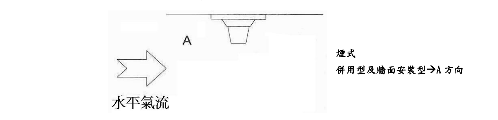
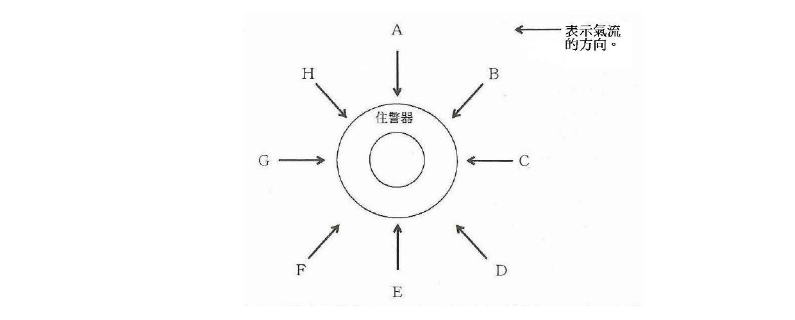
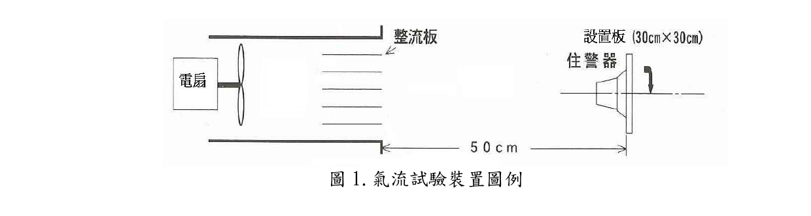
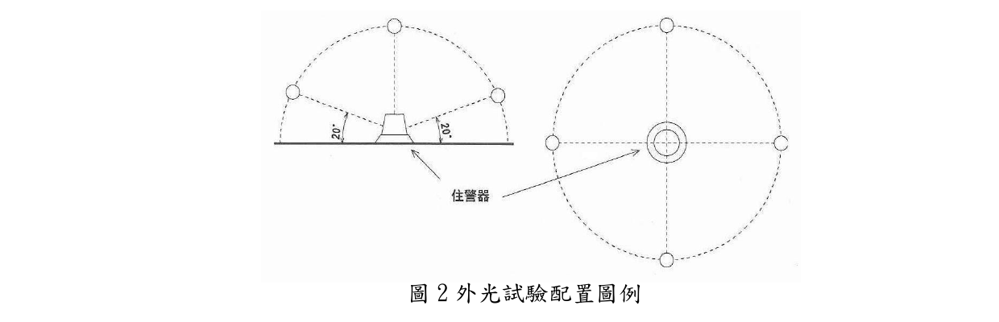
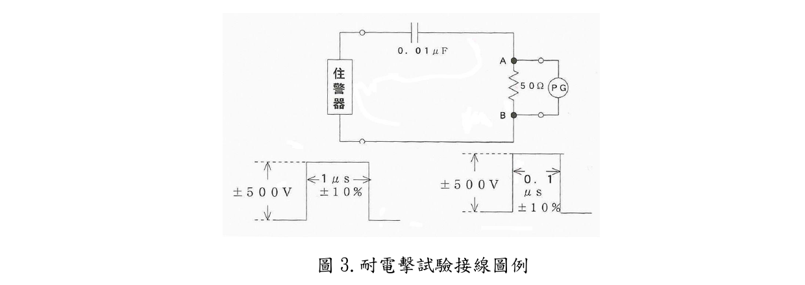
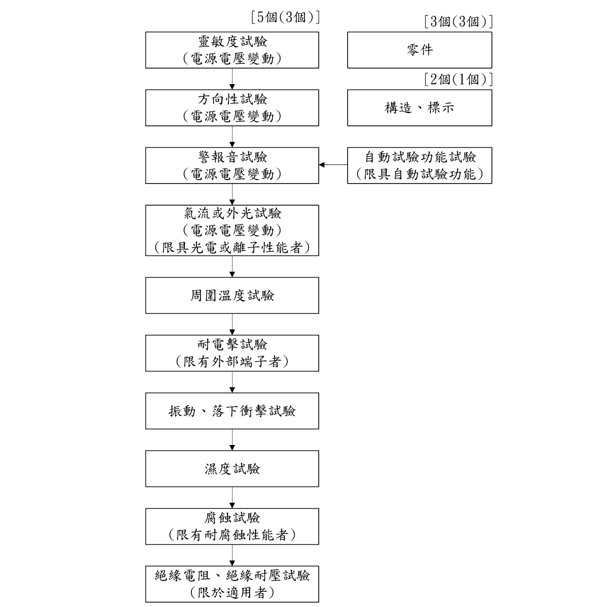
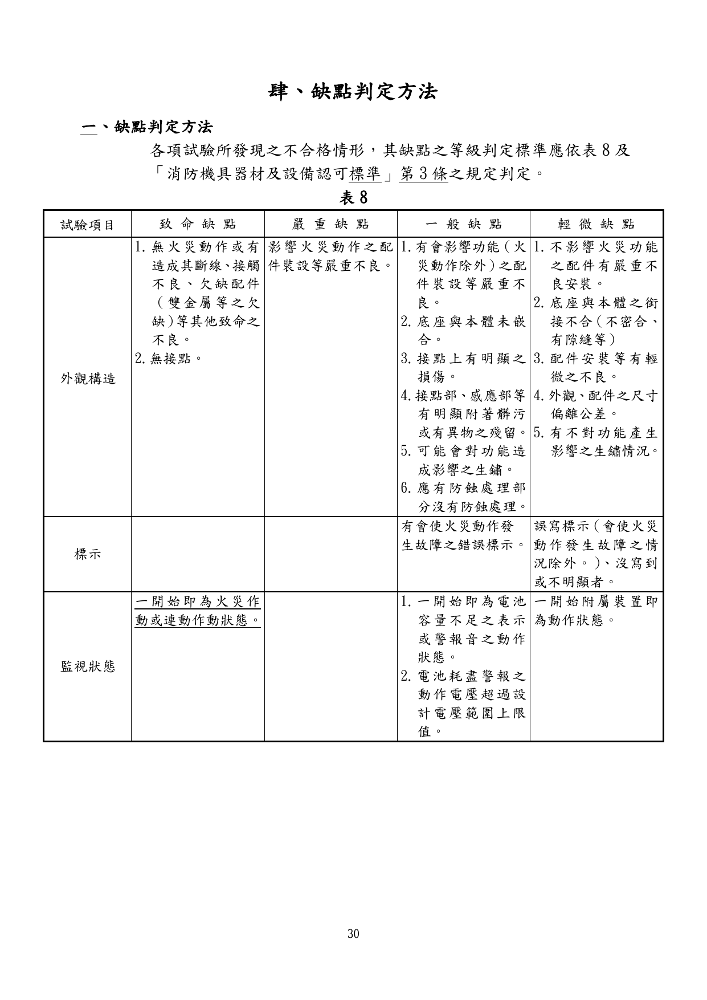
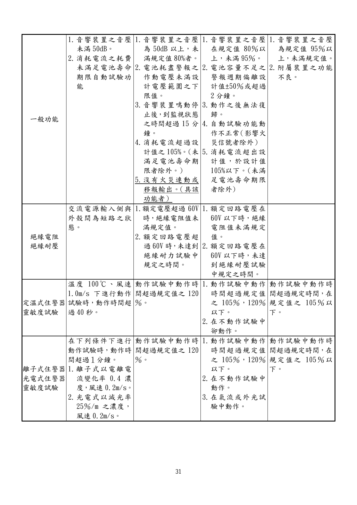
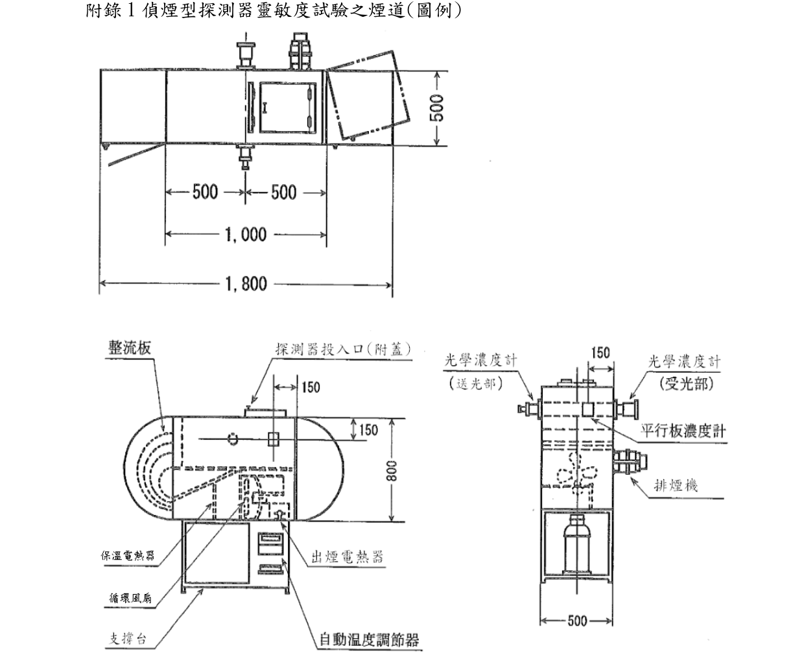
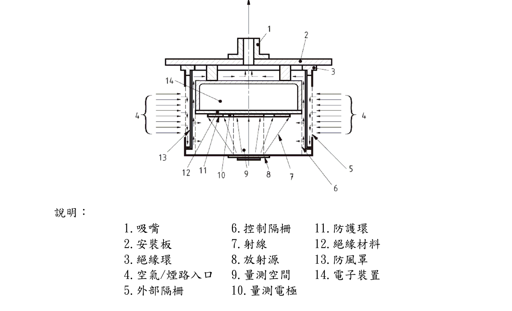

# 住宅用火災警報器認可基準

> 來源：內政部消防署｜版本日期：107 年 5 月 3 日內授消字第 1070821742 號令修正發布
>
> ⚠️ **法規快照**：本檔為入庫當下之版本，引用前請依 index.md「法規時效」核對官方現行版本。
>
> 📌 **免責聲明**：本檔內容部分為 PDF／影像 OCR 與人工整理之結果，可能有辨識誤差。**一切以主管機關（內政部消防署）公告之現行版本為準**；如有疑義，以官方公告為主。後續 AI 代理人引用本檔時應主動提醒使用者此點，並於必要時自行上網查證正確版本。
>
> 🛈 本檔由 PDF（`pdftotext -layout`）轉換並人工整理。依三層表格原則：散文與簡單數值表、AQL 抽樣表已內嵌 markdown；複雜跨欄矩陣表、缺點判定表、紀錄表（表單）及附圖僅附文末原始 PDF 連結。公式以 LaTeX 呈現。

---

## 壹、技術規範及試驗方法

### 一、適用範圍

住宅用火災警報器（以下簡稱住警器），其構造、材質及性能等技術規範及試驗方法，應符合本基準之規定。

### 二、用語定義

#### （一）住宅用火災警報器

住警器係指為防範居室火災而能早期偵測及報知之警報器，由偵測部及警報部所構成之設備，得具有自動試驗功能或無線式功能。依種類可區分為定溫式住宅用火災警報器（以下稱「定溫式住警器」）、離子式住宅用火災警報器（以下稱「離子式住警器」）及光電式住宅用火災警報器（以下稱「光電式住警器」）。依電源供應方式可分為內置電池、外部電源及併用型（外部電源及內置電池併用，以下相同）。

#### （二）定溫式住宅用火災警報器

係指對局部場所之周圍溫度達到一定溫度以上時，發出火災警報之住警器。

#### （三）離子式住宅用火災警報器

係指利用離子化電流受煙之影響而產生變化原理，對局部場所周圍空氣中含煙濃度達到某一限度時，發出火災警報之住警器。

#### （四）光電式住宅用火災警報器

係指利用光電束子之受光量受煙之影響而產生變化原理，對局部場所周圍空氣中含煙濃度達到某一限度時，發出火災警報之住警器。

#### （五）自動試驗功能

係指藉由此試驗功能自動確認住警器相關功能是否維持正常之裝置者。

#### （六）無線式功能

係指附加無線裝置（可發射或接收電波）之住警器所具備，能將火災訊號透過無線傳輸方式連動其它住警器或移報輸出至其它連線裝置之功能。

#### （七）電源供應方式

住警器電源供應方式可分為內置電池、外部電源及併用型。以內置電池以外之方式供電者，除由插座、分電盤或其他方式直接供給電力外，其中途不可經由開關裝置，且需有預防因外部電源中斷而導致住警器功能異常之措施。

### 三、構造與功能

#### （一）應能確實動作且易於操作、附屬零件易於更換

1. 住警器在下列(1)或(2)之情況中，應能確實持續發出警報：

   （1）外部電源者：以額定電壓之 ±10％ 範圍內變動時（變動範圍有指定時，以該變動範圍為準）。

   （2）內置電池者：以住警器設計動作電壓之上下限值範圍內變動時。

2. 住警器之消耗電流不得超過該住警器之設計範圍。
3. 需更換保險絲之住警器應置備更換用之保險絲。

#### （二）應具有易於安裝及更換之構造，且應符合下列規定

1. 安裝於底座時，不需拆取外罩或打開裝設孔等情況下，應能容易安裝及更換構造。但外罩如為可容易開啟之構造者則不在此限。
2. 外部電源採交流供電者，其電源線附有插頭應符合 CNS690【配線用插接器】之規定，且應於外殼上標明其額定電壓。
3. 外部電源之住警器，具有極性電源配線者應採取防止誤接之措施。在此情況中，若發生電源配線誤接時，住警器功能不得產生異常。

#### （三）零件耐久性

使用之零件、配線、印刷基板等需具耐久性，且不能超過其說明書、型錄等所記載之額定容許值。

#### （四）外殼材質

正常使用狀態下，住警器不得因溫度變化導致外殼變形，外殼材質應符合 CNS14535【塑膠材料燃燒試驗法】或 UL94【Tests for Flammability of Plastic Materials for Parts in Devices and Appliances】V-2 以上或同等級以上之耐燃材料。

#### （五）外部配線

外部配線應具有充分之電流容量並應正確連接，且能承受任何方向之 20N 拉力達 1 分鐘，拉力不會傳遞到導線和電池端子連接器間之接頭上，也不會傳遞到導線和住警器電路板間之接頭上。

#### （六）零件安裝

零件應安裝正確且不易鬆脫，如採用可變電阻或調整部等功能之零件，不得因振動或衝擊等產生變動。

#### （七）帶電部保護

帶電部應有充分保護且人員不易從外部碰觸，並應符合下列規定：

1. 帶電部外露者，應使用合適之保護裝置，無法從外部碰觸之構造。
2. 額定電壓超過 60V 者，應採用塗裝以外之絕緣方法。

#### （八）氣流方向與傾斜

不得因偵測部所受之氣流方向不同，而使住警器相關功能發生顯著變動，且住警器以其平面位置為定點，使之傾斜 45 度情況下，不得功能異常。

1. 偵測部接收氣流方向如下：

   （1）安裝於天花板或牆面之定溫式住警器，於天花板面安裝時，應以垂直方向給予氣流；於牆面安裝者，以水平任意方向（若有指定安裝方向者，應從牆面安裝之住警器之上方或下方之方向，以下相同）各給予氣流。

   （2）安裝於牆面之定溫式住警器，於牆面安裝狀態下，以水平任意方向給予氣流。

   （3）離子式住警器及光電式住警器於天花板面或牆面安裝時，以水平任意方向各給予氣流。

   

   

   > 📷 截自原始 PDF 第 7 頁（內文頁 3）。

2. 住警器之方向性試驗如下：

   （1）針對其安裝狀態，如下圖所示，任意以每 45 度刻度從 A 至 H 之 8 個方向給予氣流。

   

   > 📷 截自原始 PDF 第 8 頁（內文頁 4）。

   （2）前述「不得使功能發生顯著變動」係指在試驗風速在 0.2 m/s 時，符合本基準壹、十四靈敏度試驗之動作試驗規定。

   （3）「使傾斜 45 度情況下」係指天花板安裝情況及牆面安裝情況，在各自狀態下傾斜 45 度。

#### （九）火災警報

火災警報應符合下列規定：

1. 藉由警報音（包含音聲者，以下相同）發出火災警報之住警器音壓，依下列方式，施加規定之電壓時，於無響室中距離警報器中心前方 1m 處，音壓應有 70 dB 以上，且此狀態應能持續 1 分鐘以上。

   （1）使用電池之住警器，施加電壓應為使住警器有效動作之電壓下限值。

   （2）由電池以外電力供給之住警器，施加電壓值應為額定電壓 ±10％ 範圍間。

2. 具有多段性音壓增加功能者，應在發出警報音開始 10 秒以內到達 70dB。
3. 火災警報音如為斷續鳴動時，應依下列規定：

   （1）休止時間（鳴動時間中之無音時間除外）在 2 秒以下，鳴動時間在休止時間以上。

   （2）在鳴動時間中，警報音音壓未滿 70 dB 之部分稱為無音時間，警報音鳴動時間應在無音時間以上。

   （3）鳴動時間中之無音時間應在 2 秒以下。

4. 火災警報音以警報音和語音組合鳴動者依下列規定：

   （1）休止時間（警報音與語音組合鳴動時間中之無音時間除外，以下相同）在 2 秒以下，鳴動時間在休止時間以上。

   （2）在鳴動時間中，警報音音壓未滿 70 dB 之部分以無音時間做計算，且警報音和語音組合之時間應在無音時間以上。

   （3）警報音和語音組合時，鳴動時間中之無音時間應在 2 秒以下。

   （4）火災警報音之音壓，係指警報音部分的音壓。

   （5）語音與警報音之鳴動時間比率為 1.5 以內。

   （6）語音，為國語。但若為國語與其他語言交互鳴動之情況，不在此限。

5. 發出火災警報音以外之警報音及包含具自動試驗功能之異常警報音時，火災警報音應為可明確識別之聲音。
6. 音壓試驗方法如下：

   （1）於無響室中，將住警器安裝在背板（300 ㎜×300 ㎜×20 ㎜之木板）上，保持懸空之狀態。

   （2）試驗裝置應符合 CNS 13583【積分均值聲度表】之聲度表（噪音計）或分析儀，具有量測 A 加權及有時間加權之音壓值特性。

   （3）試驗採用 A 加權分析，以儀器最小範圍之時間常數，測定其最大音壓值。

#### （十）電池耗盡警報及電池更換

電池耗盡警報及電池更換應符合下列規定：

1. 住警器電池電壓在有效動作之電壓下限值時，應能自動以閃滅或音響方式表示電池即將耗盡，且在尚未以手動方式停止前，能持續警示 72 小時以上。
2. 電池耗盡警報使用之建議警報音依下列規定：

   （1）建議警報音應具有規定之間隔及音色（基本頻率大概為「嗶」音）且應具有能充分聽見之音壓。

   （2）具有合併自動試驗功能者，該自動試驗功能相關異常警報音應採用壹、三、(十五)、2、(1)之建議警報音。

3. 電池耗盡警報使用之警報方式為前項 2. 規定之警報以外者，依下列規定：

   （1）警報在每 2 分鐘內動作 1 次以上，可持續 72 小時。

   （2）僅以標示燈發出警報者，除須具有表示電池耗盡之標示外，標示燈之閃滅應在每 2 分鐘內重複 10 次以上（包含連續亮燈動作），該動作可持續 72 小時以上。

   （3）電池耗盡警報與自動試驗功能相關異常警報應有明顯之區別。但如電池壽命超過住警器汰換期限者，不在此限。

4. 住警器電池使用期限在正常使用及定時檢測（每月 1 次，每次 10 秒之檢測頻率）狀態下，應有 3 年以上之使用期限，在型式認可申請時應附有電池容量計算書，並應考量下列設計需求：

   （1）一般監視狀態之消耗電流。

   （2）非火災警報之消耗電流。

   （3）檢測時之消耗電流。

   （4）具有供給附屬裝置電源者，其連接該附屬裝置中監視及動作狀態之消耗電流。

   （5）電池之自然放電電流。

   （6）其他設計中必要之消耗電流。

   （7）設計安全餘裕度（安全係數）。

5. 電池之使用期限依電池製造者建議之消耗電流計算之。
6. 電池耗盡警報之動作電壓下限值，應在住警器有效動作電壓下限值以上，且於電池耗盡警報動作後，如發生火災警報應能維持正常警報音（70dB 以上）至少 4 分鐘以上。
7. 可更換電池之住警器，電池（含具有線頭式整體者）應可容易拆裝且具有防止電池誤接之措施。且如發生電池誤接，住警器不應造成損壞。
8. 電池容量僅能以手動方式確認者，對使用之電池以平均監視電流之 50 倍電流值，進行 526 小時加速放電試驗，再行火災警報音試驗，應能維持正常警報音（70dB 以上）至少 1 分鐘以上。
9. 製造商設計之使用期限超過 3 年，或產品本體自主標示使用（汰換）年限超過 3 年者，則依上揭 4 至 8 項採對應之電池容量計算或放電時間進行實測確認。

#### （十一）藉由開關操作可停止火災警報之住警器

須在藉由操作該開關而停止火災警報時，於 15 分鐘內自動復歸至正常監視狀態者並符合下列規定：

1. 火災警報之停止時間不得任意變動。
2. 火災警報停止開關兼動作試驗開關者，該開關應採取可再試驗之方式。

#### （十二）光電式住警器之光源

光電式住警器之光源應為半導體元件。

#### （十三）偵測部網狀材料

偵測部應具有網目尺寸在 (1.3±0.05)mm 以下之網狀材料，並符合下列規定：

1. 網或圓孔板為金屬線編織而成或金屬板上鑽有孔洞之網狀材料。
2. 以金屬以外物品作為網狀材料時，應採用在一般使用狀態下不因熱而變形之材質。

#### （十四）使用放射性物質之住警器

應對該放射性物質進行輻射源防護，且輻射源應無法從外部直接碰觸，火災時亦無法輕易破壞者。

1. 離子式住警器之輻射量應低於 1.0 μCi。
2. 應依行政院原子能委員會，對含有放射性產品之回收管制規定辦理。
3. 在發生火災時，應具能將放射源固定於支固器上，不會脫落之構造。

#### （十五）附有自動試驗功能之住警器

應能自動以閃滅或音響等方式表示功能異常，且在尚未以手動方式停止前，能持續警示 72 小時以上。

1. 確認住警器是否功能維持正常，係指以偵測部動作之方式、檢出偵測部之出力值等方式檢查，來確認住警器功能是否正常。
2. 自動試驗功能相關異常警報所使用建議警報音，依下列規定：

   （1）建議警報音應有規定之間隔及音色（基本頻率大概為「嗶、嗶、嗶」之聲音），且應具有能充分聽見之音壓。

   （2）合併擁有電池耗盡警報功能者，該電池耗盡警報採用壹、三、(十)、2.、(1) 中建議警報音。

3. 自動試驗功能之異常警報使用前項 2. 規定警報以外之警報者依下列規定：

   （1）警報應在每 2 分鐘內發出 1 次以上，且該動作可以持續 72 小時以上。但警報音之警報不得發生與前項 2.(1) 規定之警報有混雜之情況。

   （2）僅以標示燈發出警報者，除能明確知道異常之標示外，其標示燈之閃滅在每 2 分鐘內應重複 10 次以上，且該動作可以持續 72 小時以上（包含持續亮燈動作）。

   （3）自動試驗功能之異常警報應與電池耗盡警報區別分辨。

   （4）應可識別出其他功能異常警報與自動試驗功能警報。但因其他功能異常而必須更換住警器之警報，不在此限。

#### （十六）住警器內含電源變壓器者

依下列規定：

1. 電源變壓器需符合 CNS1264【電訊用小型電源變壓器】或具同等性能以上之規定，且其容量可連續耐最大使用電流者。
2. 警鈴用變壓器之額定 2 次電壓及電流值在 30V、3A 以下；或者是 60V、1.5A 以下。
3. 設置回路保護裝置者，應設有該保護裝置動作顯示之功能。

#### （十七）輔助警報或附屬裝置

住警器如安裝具有本基準所列功能以外之輔助警報或附屬裝置者，其裝置不得影響住警器正常功能。

#### （十八）住警器具有無線式功能者

應符合下列規定：

1. 應取得國家通訊傳播委員會認可驗證機關（構）核發之低功率射頻電機型式認證證明，且不得干擾合法通信。
2. 所發射信號之電場強度值，在距離該住警器 3 m 位置處，應在設計值以上。
3. 有接收電波功能者，在距離該住警器 3 m 位置處，可接收發信信號之最低電場強度值，應在設計值以下。
4. 無線裝置之火災信號的受信及發信，應符合下列規定：

   （1）探測發生火災之住警器，其無線裝置在接收到火災信號（發出警報音），至發信所需時間應在 5 秒以內。

   （2）無線裝置在持續接受火災信號期間，應斷續性發出該當信號。但從其它住警器或連線裝置能確認接收火災主旨的功能或具定期通信確認功能（無線式住警器通信狀態於一定時間內以 1 次以上之比例確認，若通信狀態減退，能發出異常警報）者，則不在此限。

   （3）前述（1）及（2）之試驗，應經國家通訊傳播委員會認可之國內外電信設備測試實驗室測試合格。

5. 設有可確認無線式功能之試驗按鈕或定期通信確認功能之裝置。

#### （十九）連動型或移報輸出型住警器

探測到火災發生之連動型或移報輸出型住警器，其火災警報不得受其它連動型住警器或其它連線裝置之開關操作而停止。

### 四、氣流試驗

離子式住警器（包含兼具定溫式住警器性能者），於通電狀態下，投入風速 5 公尺/秒之氣流中，5 分鐘內不得發出警報，試驗方式如下：

（一）氣流試驗裝置依圖 1 之圖例配置。

（二）取下離子式住警器及安裝板之狀態下，調整風扇之速度使距離整流板 50 公分位置之氣流速度為 (5±0.5) 公尺/秒。

（三）以煙最容易流入之方向做為試驗氣流方向（水平氣流），於試驗 5 分鐘後回轉 90 度，進行垂直之氣流試驗。

> 📷 截自原始 PDF 第 13 頁（內文頁 9）。

### 五、外光試驗

光電式住警器（包含兼具定溫式住警器性能者）於通電狀態下，使用白熾燈管，以照度 5000lux 之強光依照射 10 秒、停止照射 10 秒之動作，反覆 10 次後，再持續照射 5 分鐘，試驗過程中不得發出警報，試驗方式如下：

（一）外光試驗裝置依圖 2 之圖例配置。

（二）配置白熾燈使光電式住警器之表面照度為 (5000±50) lux。

> 📷 截自原始 PDF 第 14 頁（內文頁 10）。

### 六、周圍溫度試驗

方式如下：

（一）住警器必須於周圍溫度為 0℃ 以上 40℃ 以下時，功能亦不得發生異常。

（二）住警器於正常使用狀態下，於溫度 (0±2)℃ 及 (40±2)℃ 各放置 12 小時。

（三）試驗結束後，進行靈敏度試驗之動作試驗確認功能是否異常。

### 七、腐蝕試驗

方式如下：

（一）具有耐腐蝕性能之住警器必須在 5 公升試驗用容器倒入每公升溶有 40 公克之硫代硫酸鈉之水溶液 500cc，再用 1N 濃度之硫酸 156cc 稀釋 1000cc 水之酸液，以 1 天 2 次每次取此酸溶液 10cc 加入於試驗容器中，使其產生二氧化硫（SO₂）氣體，而住警器於正常使用狀態下，置於此氣體中 4 天。上述試驗必須於溫度 (45±2)℃ 之狀態下進行。

（二）在試驗中發出警報者不判定其合格與否。

（三）試驗後，擦拭附著在外部之水滴，在相對濕度不超過 85％ 之室溫中放置 1 天至 4 天，再進行靈敏度試驗之動作試驗確認功能是否異常。

（四）非具有耐腐蝕性能之住警器，免施此試驗。

### 八、振動試驗

方式如下：

（一）住警器在通電狀態下，給予每分鐘 1000 次全振幅 1mm 之任意方向振動連續 10 分鐘後，不得發生異狀。

（二）住警器在無通電狀態下，給予每分鐘 1000 次全振幅 4mm 之任意方向振動連續 60 分鐘後，對其構造及功能不得發生異常。

（三）住警器使用懸掛等簡易設置方法，於實施該試驗時，不得自裝設板上脫落。

（四）試驗後確認變形、龜裂、破損、配件脫落、配件裝設鬆弛等狀況。

（五）試驗後再進行靈敏度試驗之動作試驗確認功能是否異常。

### 九、落下衝擊試驗

方式如下：

（一）住警器給予任意方向之最大加速度 50g（g 為重力加速度）衝擊 5 次後，對其構造及功能不得發生異狀。

（二）住警器使用懸掛等簡易設置方法，於實施該試驗時，不得自裝設板上脫落。

（三）試驗後確認變形、龜裂、破損、配件脫落、配件裝設鬆弛等狀況。

（四）試驗後再進行靈敏度試驗之動作試驗確認功能是否異常。

### 十、耐電擊試驗

配有外部配線端子之住警器於通電狀態下，電源接以 500V 電壓之脈波寬 1μs 及 0.1μs，頻率 100 赫茲（HZ），串接 50Ω 之電阻後，接於住警器之二端予以電擊試驗，各試驗 15 秒後，對其功能不得發生異常現象，並須符合下列規定：

（一）試驗接線回路及電壓波形依圖 3 所示圖例。

（二）進行試驗之端子與連動型之信號回路相關，試驗回路以直徑 0.9 ㎜ 以上，長 1m 以下之電線接續。

（三）試驗後再進行靈敏度試驗之動作試驗確認功能是否異常。

（四）無外部配線端子之住警器免施此試驗。

> 📷 截自原始 PDF 第 16 頁（內文頁 12）。

### 十一、濕度試驗

住警器必須於通電狀態下，以溫度 (40±2)℃ 放置於相對濕度 95％（＋0％、−5％）之空氣中 4 天，應可持續處於正確適當之監視狀態，試驗方式如下：

（一）「正確適當之監視狀態」是指在試驗中，正常之持續監視下，應不發出火災警報、電池耗盡警報或自動試驗功能異常警報者。

（二）試驗初期放入試驗箱時發出火災警報者，不做合格與否之判定。

（三）試驗後再進行靈敏度試驗之動作試驗確認功能是否異常。

### 十二、絕緣電阻試驗

住警器之絕緣端子間（不包含移報火災警報信號之無電壓接點端子），及帶電部與金屬製外殼間之絕緣電阻，以直流 500V 之絕緣電阻計測量時應在 50MΩ 以上。

### 十三、絕緣耐壓試驗

住警器之帶電部與金屬製外殼間之絕緣耐壓，應用 50 Hz 或 60 Hz 近似正弦波而其實效電壓在 500V 之交流電通電 1 分鐘，能耐此電壓者為合格，但額定電壓在 60V 以上 150V 以下者，用 1000V 電壓，額定電壓超過 150V 則以額定電壓乘以 2 倍再加上 1000V 之電壓作試驗。

### 十四、靈敏度試驗

#### （一）離子式住警器

1. 離子式住警器之靈敏度在依其種別不同施予表 1 所列 K、V、T 及 t 值時，進行下列各項試驗符合者為合格。

#### 表 1　離子式住警器靈敏度試驗數值表

| 種別 | K | V | T（秒） | t（分） |
|---|---|---|---|---|
| 1 種 | 0.19 | 0.2 以上　0.4 以下 | 60 | 5 |
| 2 種 | 0.24 | 0.2 以上　0.4 以下 | 60 | 5 |

   （1）動作試驗：含有電離電流變化率 1.35K 濃度之煙，以風速 V 公尺/秒之速度吹向時，T 秒以內得發出火災警報。

   （2）不動作試驗：含有電離電流變化率 0.65K 濃度之煙，以風速 V 公尺/秒之速度吹向時，t 分鐘以內不得發出火災警報。

2. 離子式住警器於靈敏度試驗前，須將住警器置於室溫下強制通風 30 分鐘後再進行試驗。
3. 離子式住警器靈敏度試驗機及煙霧濃度量測設備（離子電離量測設備）應符合附錄 1 及附錄 3 之圖例規定。
4. 風速在 (0.4±0.05) 公尺/秒場合中之煙濃度需進行濃度補正，動作試驗以平行板濃度計指示值加上 0.03；不動作試驗以平行板濃度計指示值加上 0.02 後之數值。

#### （二）光電式住警器

1. 光電式住警器之靈敏度試驗，應依其種別不同施予符合下表 2 所列 K、V、T 及 t 值時，進行下列各項試驗符合者為合格。

#### 表 2　光電式住警器靈敏度試驗數值表

| 種別 | K | V | T（秒） | t（分） |
|---|---|---|---|---|
| 1 種 | 5 | 0.2 以上　0.4 以下 | 60 | 5 |
| 2 種 | 10 | 0.2 以上　0.4 以下 | 60 | 5 |

   （1）動作試驗：含有每公尺減光率 1.5K 濃度之煙，以風速 V 公尺/秒之速度吹向時，T 秒以內得發出火災警報。

   （2）不動作試驗：含有每公尺減光率 0.5K 濃度之煙，以風速 V 公尺/秒之速度吹向時，t 分鐘以內不得發出火災警報。

2. 光電式住警器於靈敏度試驗前，須將住警器置於室溫下強制通風 30 分鐘後再進行試驗。
3. 光電式住警器靈敏度試驗機及煙霧濃度量測設備（光學濃度計）應符合附錄 1 及附錄 2 之圖例規定。

#### （三）定溫式住警器

1. 定溫式住警器之靈敏度應依下列規定試驗：

   （1）動作試驗：投入溫度 (81.25±2)℃、風速 (1±0.2) 公尺/秒之垂直氣流時，於 40 秒內（安裝於壁面者，用以下公式計算時間 t 秒內）發出火災警報。

$$t = 40\,\frac{\log_{10}\left(1+\dfrac{65-\theta_r}{16.25}\right)}{\log_{10}\left(1+\dfrac{65}{16.25}\right)}$$

- $t$：動作時間（秒）
- $\theta_r$：室溫（℃）

   （2）不動作試驗：投入溫度 (50±2)℃、風速 (1±0.2) 公尺/秒之垂直氣流時，10 分內不得動作。

2. 定溫式住警器靈敏度試驗機應可調整試驗風洞之溫度（溫度設定範圍 50℃～100℃）與風速〔設定範圍 (0.8～1.2) 公尺/秒〕且能提供穩定溫度與風速之特性，另應具備可以將氣流方向與住警器安裝狀態之底座面呈水平方式放入該住警器之構造。

### 十五、電場強度試驗

（一）電場強度之試驗場所，為周圍無反射電波之物體，且無阻礙測量的金屬物體，係半電波暗室（Semi Anechoic Chamber）或全電波暗室（Fully Anechoic Chamber）。於半電波暗室試驗時，其無線式住警器及測試用天線間之地板，以可吸收電磁波之材料物體或電波穿透性佳之材質進行（其擺放方式應符合 CISPR 16-1-4 Site voltage standing wave ratio（SVSWR）設置規範）。

（二）在正常使用情況下，無線式住警器應安裝在木材或其他絕緣材料所作成之板子或回轉台上，將放置無線式住警器之基板面設置於距離地面 1.5 m 之高度。

（三）測試用天線，係指使用於測量頻率的半波長共振型偶極天線、廣域型天線等直線偏波天線，其天線中心部分設置於距離地面 1.5 m 之高度。

（四）無線式住警器與測試用天線中心之間隔為 3 m。

（五）測試時，無線式住警器的電源電壓以額定電壓的狀態進行。

（六）測試時，頻譜分析儀之設定，應依下列規定：

1. 最大電場強度：

   （1）頻率掃描範圍約為 20dB 頻寬之 5 倍，中心頻率為主頻頻道。

   （2）解析頻寬大於欲測發射之 20dB 頻寬，視訊頻寬不小於解析頻寬。

   （3）掃描時間為自動，檢波功能為峰值，訊號軌跡為最大保留（Max Hold）。

   （4）利用記號至波峰（Mark to Peak）功能以標記發射之波峰，顯示之數值即為峰值輸出功率。

   （5）上述之測試步驟應注意外接之衰減與纜線損失。

2. 最小電場強度：

   （1）頻率掃描範圍約為 20dB 頻寬之 5 倍，中心頻率為主頻頻道。

   （2）解析頻寬大於欲測發射之 20dB 頻寬，視訊頻寬不小於解析頻寬。

   （3）掃描時間為自動，檢波功能為峰值，訊號軌跡為最小保留（Min Hold）。

   （4）利用記號至波峰（Mark to Peak）功能以標記發射之波峰，顯示之數值即為峰值輸出功率。

   （5）上述之測試步驟應注意外接之衰減與纜線損失。

（七）具有發射電波功能者，其電場強度試驗，應依下列規定：

1. 測試時，使無線式住警器之火災信號保持持續發射狀態。如使用火災信號以外之信號進行測試，則此訊號需具火災信號相同之電場強度。
2. 旋轉無線式住警器，檢測 8 個以上方向之電場強度（能以全方向來檢測時以全方向為主，下同），確認測定值均在設計值以上。
3. 檢測水平極化及垂直極化，其檢測用天線應分別與地面呈垂直、水平設置狀態。在該設置狀態下，具有可確認電波通信狀態之功能，且其操作說明書應記載有關設置時如何確認電波通信狀態之內容，並以申請人所設計極化值為準，於電場強度最大及最小方向，應在設計值（最大值及最小值）以上。

（八）具有接收電波功能者，其電場強度試驗，應依下列規定：

1. 操作發射信號裝置，發射訊號強度應為與無線式住警器接收靈敏度（設計值）相當之電場強度。
2. 旋轉無線式住警器，檢測 8 個以上方向（以全方向平均量測），確認該住警器可接收信號（住警器應在該信號發射後 5 秒內發出警報音）。
3. 檢測水平極化及垂直極化，其檢測用天線應分別與地面呈垂直、水平設置狀態。在該設置狀態下，具有可確認電波通信狀態之功能，且其操作說明書應記載有關設置時如何確認電波通信狀態之內容，並依申請者之設計極化值進行確認。
4. 依據前述第 2 點及第 3 點，確認天線端之發射強度皆在無線式住警器之有效接收範圍後，將無線式住警器置換為另一測試用天線，量測其電場強度，其值應在設計之最小值以下。

（九）前述（七）及（八）之試驗，應經國家通訊傳播委員會認可之國內外電信設備測試實驗室測試合格。

### 十六、試驗環境

除前項試驗有環境要求外，進行試驗必須符合下列環境規定：

（一）環境溫度 5℃ 以上 35℃ 以下。

（二）相對濕度 45％ 以上 85％ 以下。

### 十七、標示

住警器應於本體上之明顯易見處，以不易抹滅之方法，標示下列事項（進口產品亦須以中文標示）。

（一）住宅用火災警報器之文字。

（二）產品種類名稱、種別、型式及型號。

（三）型式認可編號。

（四）產地。

（五）製造年月或批號。

（六）製造商名稱或商標。

（七）電氣特性（含外部電源之額定電壓、電流或內置電池電壓及型式等）。

（八）有耐腐蝕性能者，標示耐腐蝕性能之文字。

（九）具有自動試驗功能者，標示自動試驗功能之文字。

（十）具有數個功能之住警器之種類標示應將具有之種類合併註記。

（十一）只限安裝於壁面或天花板面者，應註明壁面安裝專用或天花板面安裝專用。

（十二）離子式住警器應標示放射性物質之符號。

（十三）住警器為具無線式功能者，應附有審驗合格標籤，其式樣載於國家通訊傳播委員會認可驗證機關（構）核發之低功率射頻電機型式認證證明。

（十四）檢附操作說明書及符合下列項目：

1. 包裝住警器之容器應附有簡明清晰之安裝及操作說明書，並提供圖解輔助說明。說明書應包括產品安裝及操作之詳細指引及資料，同一容器裝有數個同型產品時，至少應有一份安裝及操作說明書。
2. 若作為住警器檢查及測試之用者，得詳述其檢查及測試之程序及步驟。
3. 有定期通信確認機能者，需標示定期通信確認的設計時間。
4. 其他特殊注意事項。

### 十八、新技術開發之住警器

新技術開發之住警器，依形狀、構造、材質及性能判定，如符合本基準規定及同等以上性能者，並經中央消防主管機關認定者，得不受本基準之規範。

### 十九、主要試驗設備

依表 3 設置。

#### 表 3　主要試驗設備

| 試驗設備名稱 | 規格內容 | 數量 | 備註 |
|---|---|---|---|
| 尺寸測定器 | 鋼尺、游標卡尺 | 各 1 | |
| 交流電源供應器 | 110V、220V、60Hz | 1 | 定期校正 |
| 直流電源供應器 | 30V/3A | | |
| 環境溫濕度計 | 環境紀錄器（±5%） | 1 | 定期校正 |
| 絕緣電阻計 | 測定電壓 DC500V、DC1000V 以上 | 1 | 定期校正 |
| 絕緣耐壓機 | 測定電壓 500～2000Vac 範圍可調 | 1 | 定期校正 |
| 耐電擊試驗設備 | 高頻雜訊模擬器，可調整衝擊波為方波；可設定測試電壓 500V，脈波寬 1μs、0.1μs | 1 | |
| 風速計 | 0.1～20.0（m/s）測定範圍（±5%） | 1 | 定期校正 |
| 數位式三用電錶 | 電流測定 0～1A 以上，解析度 0.1mA（±1%）；電壓測定 0～300V 以上，解析度 0.1V（±1%）；電阻測定 0～100MΩ 以上，解析度 1Ω（±1%） | 1 | 定期校正 |
| 音壓位準試驗裝置 | 1. 無響室：符合 CNS 14657 或同等國際規範。2. 音壓位準量測之聲度表（噪音計）或分析儀：符合 CNS 13583 或相當標準之 Type 1 等級噪音計，準確度 ±1 dB。3. 噪音計或分析儀須能分析頻率範圍。 | 各 1 | 噪音計需定期校正 |
| 氣流試驗設備 | 裝置須符合基準設置規定，風速應可維持 (5±0.5)m/s 範圍之穩定氣流 | 1 | |
| 外光試驗設備 | 裝置須符合基準設置規定，照度應可維持 (5000±50)lux 範圍 | 1 | |
| 溫度濕度試驗裝置 | 恆溫恆濕機，溫度調整 −10～100℃，解析度 0.1℃（±5%）；濕度調整 80～95％（20～45℃ 間）（±5%） | 1 | 定期校正 |
| 振動試驗機 | 振動頻率每分鐘 1000 次以上，全振幅 4mm | 1 | |
| 落下衝擊試驗機 | 最大加速度 (50±5)g | 1 | |
| 腐蝕試驗裝置 | 1. 5 公升試驗用容器。2. 硫代硫酸鈉、硫酸、氯化氫、氨氣等。3. 恆溫設備（溫度 (45±2)℃） | 各 1 | |
| 靈敏度試驗裝置 | 離子式：附錄 1 及 3 規定；光電式：附錄 1 及 2 規定；定溫式：應符合壹、十五、(三) 規定（按原檔目次標示為靈敏度試驗，惟內文定溫式靈敏度規定列於壹、十四、(三)，見原檔核對） | 1 | |

> 🛈 表 3「直流電源供應器」原檔未標數量，請核對原始 PDF（第 18 頁）。

---

## 貳、型式認可作業

### 一、型式試驗之方法

型式與型式變更試驗項目、樣品數及流程如下：

> 📷 截自原始 PDF 第 23 頁（內文頁 19）。樣品數摘錄如下：
>
> - 靈敏度試驗：型式認可 5 個（型式變更 3 個）。
> - 零件、自動試驗功能試驗等：型式認可 3 個（型式變更 3 個）。
> - 構造、標示：型式認可 2 個（型式變更 1 個）。
> - 自靈敏度試驗開始到絕緣電阻、絕緣耐壓試驗為相同之樣品。

（一）流程圖中〔〕內為每個試驗項目之樣品，其中（）內為型式變更之樣品，（）外為型式認可之樣品，從靈敏度試驗開始到絕緣電阻、絕緣耐壓之樣品為相同之樣品。

（二）周圍溫度試驗、耐電擊試驗、振動試驗、落下衝擊試驗、濕度試驗及腐蝕試驗等各項試驗後需再進行靈敏度試驗之動作試驗，確認功能是否異常。

（三）消耗電流之測定於靈敏度試驗時實施。

### 二、型式試驗結果之判定

方式如下：

（一）符合本認可基準所規定之技術規範者，該型式試驗結果或型式變更試驗結果視為「合格」。

（二）符合補正試驗所列事項者，得進行補正試驗，惟以一次為限。

（三）未符合本認可基準所規定之技術規範者，該型式試驗結果或型式變更試驗結果視為「不合格」。

### 三、補正試驗

（一）型式試驗有下列情形之一者，得申請補正試驗：

1. 設計資料不完備（設計有誤除外）。
2. 設計資料之誤記、漏記、計算錯誤等。
3. 影響功能之零件安裝等嚴重不良（零件之損傷或不足或配線有斷線、連接不良、忘記焊接或焊接中有孔洞造成之焊接不良，以下相同）。
4. 安裝底座與本體之嵌合不符（不密合、隙縫等）。
5. 零件安裝等輕微不良（部品之安裝不良、配線狀態不良、忘記施予鬆脫之防止、配線上焊接不良（忘記焊接或焊接中有孔洞造成焊接不良除外）或是保險絲容量不同，以下相同）。
6. 外觀、配件尺寸超出公差。
7. 標示之誤載（可能使火災警報產生妨礙之情況除外）、未記載或不明顯。
8. 附屬裝置之功能不良（具有型式認可編號者除外）。

（二）試驗機構試驗設備有不完備或缺點時，致無法進行試驗之情形，亦得申請補正試驗。

### 四、型式變更之試驗方法

型式變更試驗之樣品數、試驗流程等，應就型式變更之內容，依型式試驗之方法進行試驗。

### 五、型式區分、型式變更及輕微變更之範圍

依表 4 規定。

#### 表 4　型式區分、型式變更及輕微變更之範圍

| 區分 | 說明 | 項目 |
|---|---|---|
| 型式區分 | 型式認可之產品其主要性能、設備種類、動作原理不同，或經中央主管機關認定之必要區分者，須以單一型式認可做區分。 | 1. 設備種類不同（離子式、光電式、定溫式或兼具多種性能之警報器）。2. 感度種類不同。3. 使用環境溫度範圍不同。4. 耐腐蝕型。5. 內部電池、外部電源及併用型。6. 附有自動試驗功能者。7. 附有無線式功能者。 |
| 型式變更 | 經型式認可之產品，其型式部分變更，有影響性能之虞，須施予試驗確認者。 | 1. 會影響感熱部及偵測部以外功能之部分材質、構造或形狀之變更。2. 回路（除發出火災警報部分之回路）之變更。3. 會影響主功能之附屬裝置之追加或變更（去除之情況除外）。4. 電源變壓器或有關此項之變更。5. 火災警報發生裝置（只限單項品）之變更。6. 伴隨消耗電流增加之回路、電子配件等之變更。7. 更換時期相關設計變更。8. 追加電池（只限於認可之放電特性、電池容量等對電池壽命有影響者）及電池壽命相關設計變更。註：型式變更試驗對應前項變更內容後，可省略相關部分之前項型式試驗項目。 |
| 輕微變更 | 經型式認可或型式變更認可之產品，其型式部分變更，不影響其性能，且免施予試驗確認，可藉由書面據以判定良否者。 | 1. 標示事項或標示位置（含技術手冊）。2. 外殼形狀（不影響功能）、構造或材質（限已認可且使用於被認可條件範圍內）。3. 接點形狀或材質（限已認可）。4. 底座等構造或材質（限材質已認可）。5. 端子之形狀、構造或材質。6. 主要部分（外箱除外）之構造或材質（限已認可）。7. 零件之安裝方法。8. 零件之額定、型式或製造者（已認可之配件限於該配件認可額定範圍內）。9. 半導體、電阻、電容器等（限額定符合使用條件者）。10. 變更同等規格之認可之零件或同等以上者。11. 變更電池（限不影響已認可之放電特性、電池容量等電池壽命者）。12. 充電回路（限已認可）。13. 影響主功能之附屬裝置之變更（已認可之電器回路等）。14. 不影響主功能之附屬裝置之附加（包含具有型式編號者）。15. 伴隨回路定數等輕微之電器回路變更者。 |

### 六、試驗紀錄

產品明細表格式如附表 7。型式試驗、補正試驗、型式變更試驗之結果，應詳細填載於型式試驗紀錄表（如附表 8）。

---

## 參、個別認可作業

### 一、個別認可之方法

依下列規定辦理：

（一）依 CNS9042「隨機抽樣法」規定進行抽樣試驗。

（二）抽樣試驗之嚴寬等級，分為寬鬆試驗、普通試驗、嚴格試驗、最嚴格試驗。

（三）個別認可之試驗項目分為一般樣品之試驗（以下稱為「一般試驗」），以及少數樣品之試驗（以下稱為「分項試驗」）。

### 二、批次之判定基準

（一）受驗品按不同種類（如表 5 所示）及型式依其試驗嚴寬等級區分，但同一或類似產品者為同一生產流程、品管流程及製造年月，並由登錄機構認定無妨礙之型式產品，可將二個以上之型式產品視為同一批次。

#### 表 5　同一批次判定

| 種類 | 批次 |
|---|---|
| 離子式住警器 | 同一批 |
| 光電式住警器 | 同一批 |
| 定溫式住警器 | 同一批 |

（二）申請者不得指定將某部分產品列為同一批次。

（三）以每批為單位，將試驗結果登記在個別認可試驗紀錄表（附表 9）中。

### 三、個別認可之樣品數及抽樣方法

（一）個別認可之樣品數，應依個別認可試驗之嚴寬等級及批量（如附表 1 至附表 4）規定辦理。另受驗數量為少量之普通試驗，由申請者依附表 5 申請認可作業。

（二）樣品之抽樣依下列規定：

1. 抽樣試驗應以每一批次為單位。
2. 樣品數應依受驗批次數量（受驗數＋預備品）及試驗嚴寬等級，按抽樣表之規定抽取，並在事先已編號之製品（受驗批次）中，依隨機抽樣法（CNS 9042）隨意抽取，抽出之樣品依抽樣順序逐一編號。但受驗批量如在 501 個以上時，應依下列規定分為二階段抽樣。

   （1）計算每群應抽之數量：當受驗批次在 5 群（含箱子及集運架等）以上時，每一群之製品數量應在 5 個以上之定數，並事先編定每一群之編碼；但最後一群之數量，未滿該定數亦可。

   （2）抽出之產品予以群碼號碼：同群製品須排列整齊，且排列號碼應能清楚辨識。

   （3）確定群數及抽出個群，再從個群中抽出樣品：確定從所有群產品中可抽出五群以上之樣品，以隨機取樣法抽取相當數量之群，再由抽出之各群製品作系統式循環抽樣（由各群中抽取同一編號之製品），將受驗之樣品抽出。

   （4）依上述方法取得之製品數量超過樣品所需數量時，重複進行隨機取樣去除超過部分至達到所要數量。

（三）個別認可之分項試驗樣品數依據附表 1 至附表 4 先抽取一般試驗之樣品數，再由一般試驗之樣品數中抽取所需之樣品數。

### 四、試驗項目

（一）一般試驗及分項試驗項目，依表 6 規定。

#### 表 6　個別認可試驗項目

| 區分 | 試驗項目 | 備註 |
|---|---|---|
| 一般試驗 | 靈敏度試驗（動作試驗）、標示、外觀構造 | 樣品數：依據附表 1 至附表 4 之各式試驗抽樣表抽取 |
| 分項試驗 | 靈敏度試驗（不動作試驗）、氣流或外光試驗（限光電式或離子式住警器）、絕緣電阻及絕緣耐壓試驗（限外部電源及併用型）、火災連動或移報輸出、音壓、特性〔(1) 電池耗盡警報、(2) 火災警報停止〕、自動試驗功能（限具該功能者）、消耗電流測定（限使用內置電池者） | 分項試驗樣品，以一般試驗之靈敏度試驗動作試驗中較快之樣品進行 |

（二）試驗方法依「壹、技術規範及試驗方法」規定。

（三）個別試驗紀錄表使用附表 9。

### 五、缺點之分級及合格判定基準

（一）在試驗中發現之缺點，其嚴重程度依「消防機具器材及設備認可標準」規定，區分為致命缺點、嚴重缺點、一般缺點、輕微缺點等 4 級。

（二）各試驗項目之缺點內容，依本基準肆、缺點判定方法規定，非屬該判定方法所列範圍內之缺點者，依「消防機具器材及設備認可標準」之分級原則判定之。

### 六、批次之合格判定

批次合格與否，依附表 1 至附表 4 之抽樣表與下列規定判定：

（一）抽樣表中，Ac 表示合格判定個數（合格判定之不良品數上限），Re 表示不合格判定個數（不合格判定之不良品數下限），具有二個等級以上缺點之樣品，應分別計算各不良品之數量。

（二）抽樣試驗中各級不良品數均在合格判定個數以下時，應依八、嚴寬度等級之調整所列試驗嚴寬度條件調整試驗等級，且視該批為合格。

（三）抽樣試驗中任一級之不良品數在不合格判定個數以上時，視該批為不合格。但該等不良品之缺點僅為輕微缺點時，得進行補正試驗，惟以一次為限。

（四）抽樣試驗中出現致命缺點之不良品時，即使該抽樣試驗中不良品數在合格判定個數以下，該批仍視為不合格。

### 七、個別試驗結果之處置

#### （一）合格批次之處置

1. 整批雖經判定為合格，但受驗樣品中如發現有不良品時，仍應使用預備品替換或修復該等不良品後，方可視為合格品。
2. 即使為非受驗之樣品，若於整批受驗樣品中發現有缺點者，準依前款規定。
3. 上開 1.、2. 情形，如無預備品替換或無法修復調整者，應就其不良品部分之個數，判定為不合格。

#### （二）補正批次之處置

1. 接受補正試驗時，應提出第一次試驗時所發現不良事項之改善說明書及不良品處理後之補正試驗試驗合格紀錄表。
2. 補正試驗之受驗樣品數以第一次試驗之受驗數為準。但該批樣品經補正試驗合格，經依前（一）、1. 處置後，仍未達受驗樣品數之個數時，則視為不合格。

#### （三）不合格批次之處置

1. 不合格批次之產品接受再試驗時，應提出第一次試驗時所發現不良事項之改善說明書及不良品處理之再試驗試驗合格紀錄表。
2. 接受再試驗時，不得加入第一次試驗受驗樣品以外之製品。
3. 個別試驗不合格之批次不再受驗時，應於再試驗紀錄表中，註明理由、廢棄處理及下批之改善處理等文件，向辦理試驗單位提出。

### 八、試驗嚴寬度等級之調整

（一）第一次申請個別認可時，其試驗等級以普通試驗為之，並依表 7 規定進行調整。

> 📋 **表 7（試驗嚴寬度等級調整表）**：以四欄（寬鬆／普通／嚴格／最嚴格試驗）並列各自之升降級條件，跨欄對照且條文冗長，請見文末原始 PDF（第 27 頁）。重點轉換條件摘錄：
>
> - **普通→寬鬆**（符合下列之一）：1. 最近連續 10 批次接受普通試驗，第一次試驗均合格者（用附表 5 者為 15 批次）；2. 從最近連續 10 批次（用附表 5 者為 15 批次）抽樣之不合格品總數在附表 6 寬鬆試驗界限數以下者（累計比較以一般試驗樣品進行）；3. 生產穩定者。
> - **普通→嚴格**（符合下列之一）：1. 第一次試驗時該批次為不合格，且將該批次連同前 4 批次連續共 5 批次之不合格品總數累計達附表 5 嚴格試驗界限數以上者（具致命缺點者計入嚴重缺點不合格品數量；適用普通試驗批次未達 5 批次時，將適用普通試驗之不合格品總數累計達界限數以上者亦同）；2. 第一次試驗時因致命缺點而不合格者。
> - **寬鬆→普通**（符合下列之一）：1. 一批次第一次試驗即不合格；2. 一批次第一次檢查為附帶條件合格（樣品不合格個數超過 Ac 但未達 Re 而判合格）；3. 生產不規則或停滯（適用寬鬆試驗者受驗間隔在六個月以上）。
> - **嚴格→普通**：進行嚴格試驗者，連續 5 批次第一次試驗即合格。
> - **嚴格→最嚴格**：嚴格試驗者第一次試驗中不合格批次數累計達 3 批次時，應對申請者提出改善措施勸導並中止試驗，自下一批次調整為最嚴格試驗。
> - **最嚴格→嚴格**：勸導後經確認申請者已有品質改善措施時，下批次以最嚴格試驗進行；進行最嚴格試驗者連續 5 批次第一次試驗即合格，則下次試驗得轉換成嚴格試驗。

> 🛈 表 7 多處轉換條件分別援引「附表 5 嚴格試驗界限數」「附表 6 寬鬆試驗界限數」，與本檔附表編號一致（本基準附表 5 為嚴格界限數、附表 6 為寬鬆界限數），引用前請核對原始 PDF（第 27、36、37 頁）。

（二）有關補正試驗及再試驗批次之試驗分等，第一次試驗為寬鬆試驗者，以普通試驗為之；第一次試驗為普通試驗者，以嚴格試驗為之；第一次試驗為嚴格試驗者，以最嚴格試驗為之。再試驗批次之試驗結果，不得計入試驗寬鬆等級轉換紀錄中。

### 九、免會同試驗

（一）符合下列所有情形者，得免會同試驗：

1. 達寬鬆試驗後連續十批第一次試驗均合格者。
2. 累積受驗數量達 2000 個以上。
3. 取得 TAF（或其他 IAF 相互承認認證機構）所認可驗證機構發給之 ISO 9001 驗證證書（其驗證範圍應涵蓋本認可品目）或經國外第三公證單位檢驗合格（產品具合格標識）。

（二）實施免會同試驗時，檢測單位每半年至少派員會同實施抽驗一次，試驗項目依照個別認可試驗項目，若試驗不符合本基準規定時，該批次予以不合格處置，次批恢復為普通試驗（會同試驗）。

（三）符合免會同試驗資格者，如有下列情形之一時，該批樣品應即恢復為普通試驗（會同試驗）：

1. 所提廠內試驗紀錄表有疑義時。
2. 六個月內未申請個別認可者。
3. 經使用者反應認可樣品有構造與性能不合本基準規定，經檢測單位確認確實有不符合者。

### 十、下一批次試驗之限制

個別認可如要進行下一批次試驗時，須於該批次個別認可試驗結束，且試驗結果處理完成後，始得實施下一批次之個別認可。

### 十一、試驗之特例

有下列情形之一時，得在受理個別認可申請前，依預訂之試驗日程實施試驗，但須在確認產品之個別認可申請書受理後，才能夠判斷是否合格。

（一）第一次試驗因嚴重缺點或一般缺點判定不合格者。

（二）不需更換全部或部分產品，可容易將不良品之零件更換、去除或修正者。

### 十二、試驗設備發生故障時之處置

試驗開始後，因試驗設備發生故障或其他原因致無法立即修復，經確認當日無法完成試驗時，則中止該試驗。並俟接獲試驗設備完成改善之通知後，重新排定時間，依下列規定對該批實施試驗：

（一）試驗之抽樣標準與第一次試驗時相同。

（二）不得進行六、批次之合格判定（三）之補正試驗。

### 十三、其他

個別認可時，若發現受驗樣品有其他不良事項，經認定該產品之抽樣標準及個別認可方法不適當時，得由中央消防主管機關另訂個別認可方法及抽樣標準。

---

## 肆、缺點判定方法

各項試驗所發現之不合格情形，其缺點之等級判定標準應依表 8 及「消防機具器材及設備認可標準」第 3 條之規定判定，分為致命缺點、嚴重缺點、一般缺點及輕微缺點四級，涵蓋外觀構造、標示、監視狀態、一般功能、絕緣電阻／絕緣耐壓、定溫式靈敏度試驗、離子式／光電式靈敏度試驗等項目。

> 📷 截自原始 PDF 第 34～35 頁（內文頁 30～31）。重點門檻（常考者）摘錄：
>
> - **一般功能（音壓）**：音壓未滿 50dB ＝致命缺點；50dB 以上未滿規定值 80％ ＝嚴重缺點；規定值 80％ 以上未滿 95％ ＝一般缺點；規定值 95％ 以上未滿規定值 ＝輕微缺點。
> - **一般功能（消耗電流）**：消耗電流之耗費未滿足電池壽命期限（自動試驗功能）＝致命缺點；超過設計值之 105%（未滿足電池壽命期限者除外）＝一般缺點；超出設計值於設計值 105% 以下（未滿足電池壽命期限者除外）＝輕微缺點。
> - **一般功能（其他）**：音響鳴動停止後到監視狀態時間超過 15 分鐘 ＝一般缺點；電池容量不足之警報週期偏離設計值 ±50％ 或超過 2 分鐘 ＝一般缺點；沒有火災連動或移報輸出（具該功能者）＝一般缺點；動作之後無法復歸 ＝一般缺點。
> - **定溫式靈敏度試驗**：溫度 100℃、風速 1.0m/s 動作試驗時動作時間超過 40 秒 ＝致命缺點；動作時間超過規定值之 120％ ＝嚴重缺點；超過規定值之 105％ 至 120％ 以下 ＝一般缺點；超過規定時間在規定值 105％ 以下 ＝輕微缺點。
> - **離子式／光電式靈敏度試驗**：動作試驗（離子式電離電流變化率 0.4 濃度、風速 0.2m/s；光電式減光率 25％/m 濃度、風速 0.2m/s）動作時間超過 1 分鐘 ＝致命缺點；動作時間超過規定值之 120％ ＝嚴重缺點；105％ 至 120％ 以下 ＝一般缺點；超過規定時間在 105％ 以下 ＝輕微缺點；不動作試驗中卻動作、或氣流／外光試驗中動作 ＝一般缺點。

---

## 附表

> 抽樣表（附表 1～4）及界限數（附表 5、6）已內嵌如下。**產品明細表（附表 7）、型式試驗紀錄表（附表 8）、個別認可試驗紀錄表（附表 9）屬空白表單，附錄 1～3（煙道與量測儀器圖例）含圖示，僅附文末原始 PDF 連結（附錄 2、3 之計算公式內嵌如下）。**
>
> 備註（附表 1～4）：Ac 為合格判定個數，Re 為不合格判定個數。↓：採用箭頭下方第一個抽樣方式（樣品數超過批內數量時則採全試驗）；↑：採用箭頭上方第一個抽樣方式。空白欄位沿用箭頭指示之抽樣方式。

### 附表 1　普通試驗抽樣表

| 批量 | 一般 樣品數 | 一般-嚴重 Ac/Re | 一般-一般 Ac/Re | 一般-輕微 Ac/Re | 分項 樣品數 | 分項-嚴重 Ac/Re | 分項-一般 Ac/Re | 分項-輕微 Ac/Re |
|---|---|---|---|---|---|---|---|---|
| 1～8 | 2 | | | | | | | |
| 9～15 | 2 | | | | | | | |
| 16～25 | 3 | | 0/1 | | | | | |
| 26～50 | 5 | | | | | | | |
| 51～90 | 5 | | | 1/2 | | | | |
| 91～150 | 8 | | 2/3 | 3/4 | 3 | 0/1 | 0/1 | 0/1 |
| 151～280 | 13 | 0/1 | 1/2 | 3/4 | | | | |
| 281～500 | 20 | | 2/3 | 5/6 | 5 | 0/1 | 0/1 | 0/1 |
| 501～1,200 | 32 | | 3/4 | 7/8 | | | | |
| 1,201～3,200 | 50 | 1/2 | 5/6 | 10/11 | | | | |
| 3,201～10,000 | 80 | 2/3 | 7/8 | 14/15 | 8 | 0/1 | 0/1 | 1/2 |
| 10,001～35,000 | 125 | 3/4 | 10/11 | 21/22 | | | | |
| 35,001～150,000 | 200 | 5/6 | 14/15 | ↑ | | | | |

### 附表 2　寬鬆試驗抽樣表

| 批量 | 一般 樣品數 | 一般-嚴重 Ac/Re | 一般-一般 Ac/Re | 一般-輕微 Ac/Re | 分項 樣品數 | 分項-嚴重 Ac/Re | 分項-一般 Ac/Re | 分項-輕微 Ac/Re |
|---|---|---|---|---|---|---|---|---|
| 1～8 | 2 | | | | | | | |
| 9～15 | 2 | | | | | | | |
| 16～25 | 2 | | 0/2 | | | | | |
| 26～50 | 2 | | | | | | | |
| 51～90 | 2 | | | 1/2 | | | | |
| 91～150 | 3 | | 1/3 | 2/4 | 2 | 0/1 | 0/1 | 1/2 |
| 151～280 | 5 | 0/1 | 1/2 | 2/4 | | | | |
| 281～500 | 8 | | 1/3 | 2/5 | 3 | 0/1 | 1/2 | 2/3 |
| 501～1,200 | 13 | | 2/4 | 3/6 | | | | |
| 1,201～3,200 | 20 | 1/2 | 2/5 | 5/8 | | | | |
| 3,201～10,000 | 32 | 1/3 | 3/6 | 7/10 | 5 | 1/2 | 2/3 | 3/4 |
| 10,001～35,000 | 50 | 2/4 | 5/8 | 10/13 | | | | |
| 35,001～150,000 | 80 | 2/5 | 7/10 | ↑ | | | | |

> 🛈 附表 2「151～280」「91～150」列輕微缺點 Ac/Re 欄，原 PDF 版面數字並排（如「2　4」），本檔研判為 Ac/Re=2/4，請核對原始 PDF（第 33 頁）。

### 附表 3　嚴格試驗抽樣表

| 批量 | 一般 樣品數 | 一般-嚴重 Ac/Re | 一般-一般 Ac/Re | 一般-輕微 Ac/Re | 分項 樣品數 | 分項-嚴重 Ac/Re | 分項-一般 Ac/Re | 分項-輕微 Ac/Re |
|---|---|---|---|---|---|---|---|---|
| 1～8 | 2 | | | | | | | |
| 9～15 | 2 | | | | | | | |
| 16～25 | 3 | | | | | | | |
| 26～50 | 5 | | | | | | | |
| 51～90 | 5 | | 0/1 | | | | | |
| 91～150 | 8 | | | 1/2 | 5 | 0/1 | 0/1 | 1/2 |
| 151～280 | 13 | | | 2/3 | | | | |
| 281～500 | 20 | 0/1 | 1/2 | 3/4 | 8 | 0/1 | 1/2 | 2/3 |
| 501～1,200 | 32 | | 2/3 | 5/6 | | | | |
| 1,201～3,200 | 50 | | 3/4 | 8/9 | | | | |
| 3,201～10,000 | 80 | 1/2 | 5/6 | 12/13 | 13 | 1/2 | 2/3 | 3/4 |
| 10,001～35,000 | 125 | 2/3 | 8/9 | 18/19 | | | | |
| 35,001～150,000 | 200 | 3/4 | 12/13 | ↑ | | | | |

### 附表 4　最嚴格試驗抽樣表

| 批量 | 一般 樣品數 | 一般-嚴重 Ac/Re | 一般-一般 Ac/Re | 一般-輕微 Ac/Re | 分項 樣品數 | 分項-嚴重 Ac/Re | 分項-一般 Ac/Re | 分項-輕微 Ac/Re |
|---|---|---|---|---|---|---|---|---|
| 1～8 | 2 | | | | | | | |
| 9～15 | 2 | | | | | | | |
| 16～25 | 3 | | 0/1 | | | | | |
| 26～50 | 5 | | | | | | | |
| 51～90 | 5 | | | | | | | |
| 91～150 | 8 | 0/1 | | 1/2 | 8 | 0/1 | 0/1 | 1/2 |
| 151～280 | 13 | | 1/2 | | | | | |
| 281～500 | 20 | | 2/3 | | 13 | 0/1 | 1/2 | 2/3 |
| 501～1,200 | 32 | 0/1 | 1/2 | 3/4 | | | | |
| 1,201～3,200 | 50 | | 2/3 | 5/6 | | | | |
| 3,201～10,000 | 80 | | 3/4 | 8/9 | 20 | 1/2 | 2/3 | 3/4 |
| 10,001～35,000 | 125 | 1/2 | 5/6 | 12/13 | | | | |
| 35,001～150,000 | 200 | 2/3 | 8/9 | ↑ | | | | |

> 🛈 附表 5（適用生產數量少之普通試驗抽樣表）：原 PDF 目次列有此表（第 35～36 頁間），惟正文於同頁僅見「附表 5 嚴格試驗之界限數」標題，**適用生產數量少之普通試驗抽樣表之表格內容於文字層未完整抽出**，請見文末原始 PDF 核對。

### 附表 5　嚴格試驗之界限數

| 累計樣品數 | 嚴重缺點 | 一般缺點 | 輕微缺點 |
|---|---|---|---|
| 1 | 2 | 2 | 2 |
| 2 | 2 | 2 | 3 |
| 3 | 2 | 3 | 3 |
| 4 | 2 | 3 | 4 |
| 5 | 2 | 3 | 4 |
| 6～7 | 2 | 3 | 4 |
| 8～9 | 2 | 3 | 5 |
| 10～12 | 2 | 4 | 5 |
| 13～14 | 3 | 4 | 6 |
| 15～19 | 3 | 4 | 7 |
| 20～24 | 3 | 5 | 7 |
| 25～29 | 3 | 5 | 8 |
| 30～39 | 3 | 6 | 10 |
| 40～49 | 4 | 7 | 11 |
| 50～64 | 4 | 7 | 13 |
| 65～79 | 4 | 8 | 15 |
| 80～99 | 5 | 10 | 17 |
| 100～129 | 5 | 11 | 20 |
| 130～159 | 6 | 13 | 24 |
| 160～199 | 7 | 15 | 28 |
| 200～249 | 7 | 17 | 33 |
| 250～319 | 8 | 20 | 40 |
| 320～399 | 10 | 24 | 48 |
| 400～499 | 11 | 28 | 60 |
| 500～624 | 13 | 33 | 76 |
| 625～799 | 15 | 40 | 95 |

### 附表 6　寬鬆試驗之界限數

> ※ 表示樣品累計數未達轉換成寬鬆試驗之充分條件。本表適用於最近連續 10 批次（適用附表 5 抽樣表為 15 批次）接受普通試驗，第 1 次試驗時均合格者之樣品數累計，也適用於超過 10 批次之試驗結果累計。

| 累計樣品數 | 嚴重缺點 | 一般缺點 | 輕微缺點 |
|---|---|---|---|
| 10～64 | ※ | ※ | ※ |
| 65～79 | ※ | ※ | 0 |
| 80～99 | ※ | ※ | 1 |
| 100～129 | ※ | ※ | 2 |
| 130～159 | ※ | ※ | 4 |
| 160～199 | ※ | 0 | 6 |
| 200～249 | ※ | 1 | 9 |
| 250～319 | ※ | 2 | 12 |
| 320～399 | ※ | 4 | 15 |
| 400～499 | ※ | 6 | 19 |
| 500～624 | ※ | 9 | 25 |
| 625～799 | 0 | 12 | 31 |
| 800～999 | 1 | 15 | 39 |
| 1,000～1,249 | 2 | 19 | 50 |
| 1,250～1,574 | 4 | 25 | 63 |

### 附錄 2　煙霧量測儀器（光學濃度計）減光率換算

光學濃度計適用於偵煙型光電式探測器靈敏度試驗使用。減光率長度單位為公尺，故對應使用之試驗裝置送光部和受光部之間之距離應以 Lambert 法則換算為每公尺之減光率：

$$E_n = \left[\,1 - \left\{1 - \left(\frac{E_1}{100}\right)\right\}^{n}\,\right] \times 100$$

- $E_n$：相當於 1m 之減光率對應使用之試驗裝置送光部和受光部之間之距離後換算之減光率（％）
- $E_1$：相當於 1m 之減光率（％）
- $n$：使用之試驗裝置送光部和受光部之間之距離（m）

發光部以白熾燈泡（色溫 2,800±30 K）組成，受光部以接近視感度（受光感度特性接近波長 550nm 者）之硒光電池或受光半導體元件組成。試驗裝置之減光率，使用減光濾片在試驗濃度範圍內，調整指示值與插入該減光過濾片之指示值在 ±2%/m 內。

### 附錄 3　煙霧量測儀器（電離量測設備）

電離量測設備適用於偵煙型離子式探測器靈敏度試驗使用，由量測電離室、電子放大器和能連續吸入煙霧之系統組成。

放射源特性如下：

- 同位素：Am241
- 放射性：130kBq（3.5 μci）±5%
- 平均 α 能量：4.5MeV ±5%
- 電極板直徑 27mm。

在以下條件時，潔淨氣流下之電離室阻抗應為 $1.9 \times 10^{11}\,\Omega \pm 5\%$（電離室電流為 100pA）：

- 壓力：(101.3±1) kpa
- 溫度：(25±2)℃
- 濕度：(55±20)%

吸入系統應能在大氣壓下以 30L/min ±10% 之速度以連續、穩定之方式將空氣吸入設備內。

> 📷 截自原始 PDF 第 47、49 頁（內文頁 43、45）。附錄 2（光學濃度計）為純文字，無圖示。

---

## 附表／附圖（附件）

- 圖 1～3、氣流方向與方向性試驗圖示、型式試驗流程圖、缺點判定表（表 8）及附錄 1、3 圖例均已以原始 PDF 截圖嵌入本文相應位置。試驗嚴寬度調整表（表 7）、產品明細表（附表 7）、型式試驗紀錄表（附表 8）、個別認可試驗紀錄表（附表 9）、附表 5 適用生產數量少之普通試驗抽樣表等，請對照原始 PDF：
- 📎 [住宅用火災警報器認可基準.pdf](../原始檔案/住宅用火災警報器認可基準/住宅用火災警報器認可基準.pdf)
