# 火警探測器認可基準

> 來源：內政部消防署｜版本日期：97 年 5 月 19 日內授消字第 0970822075 號令發布
>
> ⚠️ **法規快照**：本檔為入庫當下之版本，引用前請依 index.md「法規時效」核對官方現行版本。
>
> 📌 **免責聲明**：本檔內容部分為 PDF／影像 OCR 與人工整理之結果，可能有辨識誤差。**一切以主管機關（內政部消防署）公告之現行版本為準**；如有疑義，以官方公告為主。後續 AI 代理人引用本檔時應主動提醒使用者此點，並於必要時自行上網查證正確版本。

---

## 壹、技術規範及試驗方法

### 一、適用範圍

供各類場所消防安全設備設置標準規定設置火警自動警報設備所使用之火警探測器，其構造、材質、性能等技術上之規範及試驗方法，應符合本基準之規定。

### 二、用語定義

#### （一）火警探測器

火警探測系統的一個元件，至少包含一個感應器，以規律性的週期或持續監控至少一種與燃燒有關的物理或化學現象，並將至少一種相關信號傳送至控制及操作顯示設備，分類如下：

1. 依防水性能區分：防水型、非防水型。
2. 依防腐蝕性能區分：耐酸型、耐鹼型、普通型。
3. 依有無再用性區分：再用型、非再用型。
4. 依有無防爆功能區分：防爆型、非防爆型。
5. 依蓄積動作之有無區分：蓄積型、非蓄積型。
6. 依動作原理區分：

   （1）差動式局限型探測器：周圍溫度上升率在超過一定限度時即會動作，僅針對某一局限地點之熱效率有反應。

   （2）差動式分布型探測器：周圍溫度上升率在超過一定限度時即會動作，針對廣大地區熱效率之累積產生反應。

   （3）定溫式局限型探測器：周圍溫度達到一定溫度以上時，即會產生動作，外觀為非電線狀。

   （4）定溫式線型探測器：周圍溫度達到一定溫度以上時，即會產生動作，外觀為電線狀。

   （5）補償式局限型探測器：兼具差動式局限型及定溫式局限型二種性能。

   （6）離子式探測器：周圍空氣中含煙濃度達到某一限度時即會動作，原理係利用離子化電流受煙影響而產生變化。

   （7）光電式探測器：周圍空氣中含煙濃度達到某一限度時即會動作，原理係利用光電束子之受光量受到煙之影響而產生變化，並可分為散亂光型及減光型。

   （8）火焰式探測器：指當火焰放射出來之紫外線或紅外線之變化在定量以上時會發出火災信號之型式中，利用某一局部處所之紫外線或紅外線引起光電元件受光量之變化而動作。可分為紫外線式、紅外線式、紫外線紅外線併用式、複合式。

   （9）複合式探測器：具有上述兩種以上偵測功能。

#### （二）火災信號

顯示已經發生火災之信號。

#### （三）火災訊息信號

與因火災產生之熱或煙之程度及其他與火災之程度有關之信號。

### 三、環境溫度適用範圍

差動式、補償式、離子式、光電式、火焰式探測器應在 0℃ 至 50℃ 溫度範圍內；另定溫式探測器應在零下 10℃ 至其標稱動作溫度減 20℃ 之溫度範圍內確實動作，且不得影響其功能。

### 四、構造及材質

#### （一）構造

1. 不得因氣流方向改變而影響探測功能。
2. 應有排除水分侵入之功能。
3. 接點部之間隙及其調節部應牢固固定，不得因作調整後而有鬆動之現象。
4. 探測器之底座視為探測器的一部位，且可與本體連結試驗 1000 次後，內部接觸彈片不得發生異狀及功能失效。
5. 探測器之接點不得露出在外。
6. 差動式局限型有排氣裝置者，其排氣裝置不可使用會氧化之物質而影響其正常排氣功能。
7. 差動式分布型探測器裝有空氣管者，應符合下列規定：

   （1）容易測試其漏氣、阻力及接點水位高。

   （2）容易測試空氣管之漏氣或阻塞，且應具有測試完畢後，可將試驗復原之措施。

   （3）應使用整條空氣管全長應有 20 公尺以上，其內徑及管厚應均勻，不得有傷痕、裂痕、扭曲、腐蝕等有害瑕疵。

   （4）空氣管之厚度應在 0.3mm 以上。

   （5）空氣管之外徑應在 1.94mm 以上。

8. 差動式分布型探測器中採用熱電偶或熱半導體者，應符合下列規定：

   （1）易於測試出檢測體之動作電壓。

   （2）具容易測試熱電偶有無斷線及導電體電阻之構造，且應具有測試完畢後，可將試驗復原之裝置。

9. 局限型之離子式及光電式探測器與平面位置有 45° 傾斜時，差動式者有 5° 傾斜時，仍不致有功能異狀。探測器應裝設能表示已動作之指示設備，但補償式探測器及防爆型探測器在動作時有連接至受信總機表示確有動作機能者，則不在此限。
10. 光電式探測器應符合下列規定：

    （1）所使用光源之光束變化應少，且能耐長時間之使用。

    （2）光電元件應不得有靈敏度劣化或疲勞現象，且能耐長時間之使用。

    （3）能容易清潔檢知部位。

11. 離子式探測器之輻射量應低於 1.0μCi，且不得對人體有危害。
12. 採用放射線物質者，應將該物質密封且不易由外部接觸，當火災發生時亦不易破壞。
13. 含有放射性物質之探測器，應依行政院原子能委員會對含有放射性產品之管制須知辦理。
14. 火焰式探測器應符合下列規定：

    （1）受光元件（受光體）不得有靈敏度劣化或疲勞現象，且能耐長時間之使用。

    （2）能容易清潔檢知部位。

    （3）應設置動作標示裝置。但該探測器如能與可以顯示信號發信狀態之受信總機連接者，不在此限。

    （4）如係有髒汚監視功能，當檢知部位產生可能影響檢知部分功能時，能自動向受信總機發出該等信號。

15. 火警探測器內附有電磁電驛者應符合下列規定：

    （1）所有接點應使用Ｇ、Ｓ合金。（金、銀合金或其他有效電鍍處理者）

    （2）接點能適合最大使用電流容量，在最大使用電壓下經由電阻負載於最大使用電流反覆動作試驗 30 萬次之後，其功能構造均不得有異常障礙發生。

    （3）電驛除密封型外，其餘應裝設適當護蓋，以避免塵埃等附著於電驛接點及可動作部位。

    （4）同一接點不得接至內部負載和外部負載做直接供應電力之用。

    （5）同一電驛不得同時使用於主電源變壓器之一次側及二次側。

#### （二）材質

1. 感知部與外線接觸端，應採用不生銹之材質。
2. 探測器之接點應使用金銀或銀鈀合金，或具有同等以上之導電率及抗氧化性之金屬物質。
3. 探測器之露出部分（於裝設時手能接觸部分，但不含確認燈蓋、發光二極體及各指示標籤）應使用不燃性或耐燃性材料。

### 五、抗拉試驗

應於腐蝕試驗後進行，施加負載時間為 10 秒，連接線之芯線截面積應在 0.5mm² 以上，若連接線與本體結合時，需利用焊接等方法以固定之。差動式分布型探測器之線狀感熱部及定溫式線型探測器，應符合下列規定：

（一）將試片之一端予以固定後，離 25 公分處施以 10kgf 的拉力負荷後，不得有拉斷且功能無影響。

（二）裝接線狀部分之零件不能於裝接後，使線條發生異狀。

（三）探測器之端子對每一極要預備 2 個。

（四）除差動式分布型探測器之線狀感熱部及定溫式線型探測器外，以電線代替端子之型式者，其電線數量每極應有 2 根，且對每根電線施予 2kgf 抗拉負荷試驗，不致發生拉斷且對其功能不發生異狀。

### 六、靈敏度試驗

#### （一）差動式局限型探測器

應按照種別施予下列各項試驗，其數值符合表 1 所列 K、V、N、T、M、k、v、n、t、m 各值。

#### 表 1　差動式局限型探測器靈敏度試驗數值表

| 種別 | 動作試驗 階段上升 K | 動作試驗 階段上升 V | 動作試驗 階段上升 N | 動作試驗 直線上升 T | 動作試驗 直線上升 M | 不動作試驗 階段上升 k | 不動作試驗 階段上升 v | 不動作試驗 階段上升 n | 不動作試驗 直線上升 t | 不動作試驗 直線上升 m |
|---|---|---|---|---|---|---|---|---|---|---|
| 1 種 | 20 | 70 | 30 | 10 | 4.5 | 10 | 50 | 1 | 2 | 15 |
| 2 種 | 30 | 85 | 30 | 15 | 4.5 | 15 | 60 | 1 | 3 | 15 |

1. 動作試驗

   （1）較室溫高 K℃ 之溫度，以風速 V cm/sec 之高溫氣流垂直方向吹向時，應在 N 秒內動作。

   （2）自室溫狀態下以平均每分鐘 T℃ 直線升溫速度之水平氣流吹向時，應在 M 分鐘以內動作。

2. 不動作試驗

   （1）較室溫高 k℃ 之溫度，以風速 v cm/sec 之高溫氣流垂直方向吹向時，應在 n 分鐘內不動作。

   （2）自室溫開始以平均每分鐘 t℃ 直線升溫速度之水平氣流吹向時，應在 m 分鐘以內不動作。

#### （二）差動式分布型探測器

按照溫度上升率及其種別必須符合表 2 規定：

#### 表 2　差動式分布型探測器靈敏度試驗數值表

| 種別 | t₁（℃） | t₂（℃） |
|---|---|---|
| 1 種 | 7.5 | 1 |
| 2 種 | 15 | 2 |
| 3 種 | 30 | 4 |

1. 動作試驗：離檢出部位（感知部）最遠處之空氣管 20 公尺部分，每分鐘 t₁℃ 直線昇溫速度，應在 1 分鐘內動作。
2. 不動作試驗：空氣管全部在每分鐘 t₂℃ 直線昇溫速度時，7 分 30 秒內不得動作。

#### （三）定溫式探測器

1. 標稱動作溫度之設定以探測器本身標示之動作溫度值為標稱溫度值，其動作時間以下列計算公式計算之（標稱定溫點是以 55℃ 至 150℃ 為準）。
2. 試驗依照下列方法進行，其數值應符合表 3 規定：

   （1）動作試驗：標稱動作溫度之 125% 熱風以 1m/sec 之垂直氣流吹向時應在表 3 之時間內動作。

#### 表 3　定溫式探測器靈敏度試驗數值表

| 種別 | 室溫（θᵣ）零度 | 室溫（θᵣ）零度以外 |
|---|---|---|
| 特種 | 40 秒 | 室溫 θᵣ（度）時之動作時間 t（秒）依下列公式計算之 |
| 1 種 | 120 秒 | 室溫 θᵣ（度）時之動作時間 t（秒）依下列公式計算之 |
| 2 種 | 300 秒 | 室溫 θᵣ（度）時之動作時間 t（秒）依下列公式計算之 |

$$t = \frac{t_0 \cdot \log_{10}\left(1 + \dfrac{\theta - \theta_r}{\delta}\right)}{\log_{10}\left(1 + \dfrac{\theta}{\delta}\right)}$$

> 備註：
>
> - $t_0$：表示室溫在 0℃ 時之動作時間。（單位：秒）
> - $\theta$：表示標稱動作溫度。（單位：℃）
> - $\delta$：表示標稱動作溫度與動作試驗溫度之差。（單位：℃）

   （2）不動作試驗：用較標稱動作溫度低 10℃ 而以 1m/sec 之風速垂直吹向時，在 10 分鐘內不動作。

#### （四）補償式局限型探測器

1. 標稱定溫點以 55℃ 至 150℃ 之間為準。
2. 按其種別依照下列方法測試，並應符合表 4 所列之 K、V、N、T、M、S、k、v、n、t、m 各值。

#### 表 4　補償式局限型探測器靈敏度試驗數值表

| 種別 | 動作試驗 階段上升 K | 動作試驗 階段上升 V | 動作試驗 階段上升 N | 動作試驗 直線上升 T | 動作試驗 直線上升 M | 動作試驗 定溫式 S | 不動作試驗 階段上升 k | 不動作試驗 階段上升 v | 不動作試驗 階段上升 n | 不動作試驗 直線上升 t | 不動作試驗 直線上升 m |
|---|---|---|---|---|---|---|---|---|---|---|---|
| 1 種 | 20 | 70 | 30 | 10 | 4.5 | 55 以上 150 以下 | 10 | 50 | 1 | 2 | 10 |
| 2 種 | 30 | 85 | 30 | 15 | 4.5 | 55 以上 150 以下 | 15 | 60 | 1 | 3 | 10 |

3. 動作試驗

   （1）較室溫高 K℃ 之溫度，以風速 V cm/sec 之垂直氣流直接吹向時，應在 N 秒鐘內動作。

   （2）自室溫開始以每分鐘 T℃ 之直線升溫速度之水平氣流吹向時，應在 M 分鐘以內動作。

   （3）自室溫開始以每分鐘 1℃ 之直線升溫速度之水平氣流吹向時，應在較 S 低 10℃ 溫度至較 S 高 10℃ 溫度範圍內動作。

4. 不動作試驗

   （1）較室溫高 k℃ 之溫度，以風速 v cm/sec 之垂直氣流吹向時，應在 n 分鐘內不得動作。

   （2）自室溫開始以平均每分鐘 t℃ 之直線上升速度之水平氣流吹向時，應在較 S 低 10℃ 溫度範圍下 m 分鐘以內不得動作。

#### （五）離子式探測器

1. 離子式局限型探測器之蓄積時間（係指於探測出周圍之空氣含有一定濃度以上之煙起，繼續感應，直到發出火災信號之時間。以下同。），應在 5 秒以上、60 秒以內，標稱蓄積時間則在 10 秒以上、60 秒以內，以每 10 秒為刻度。
2. 經下列各項之試驗且符合表 5 所規定之數值。

#### 表 5　離子式探測器靈敏度試驗數值表

| 種別 | K | V | T | t |
|---|---|---|---|---|
| 特種 | 0.19 | 20～40 | 30 | 5 |
| 1 種 | 0.24 | 20～40 | 30 | 5 |
| 2 種 | 0.28 | 20～40 | 30 | 5 |

> 備註：K 表示標稱動作電離電流變化率。

3. 動作試驗：含有電離電流變化率 1.35K 濃度煙之氣流，以風速 V cm/sec 之速度吹向時，對非蓄積型者應在 T 秒內，對於蓄積型者應在標稱蓄積時間以上動作，但此時間不得超過標稱蓄積時間加 T 秒。（但總時間不得超過 60 秒）
4. 不動作試驗：含有電離電流變化率 0.65K 濃度煙之氣流，以風速 V cm/sec 吹向時，在 t 分鐘以內不動作方為合格。

#### （六）光電式探測器

1. 光電式局限型探測器應符合下列規定：

   （1）光電式局限型探測器之蓄積時間，應在 5 秒以上、60 秒以內，標稱蓄積時間則在 10 秒以上、60 秒以內，以每 10 秒為刻度。

   （2）光電式局限型探測器之靈敏度應經下列各項之試驗且符合表 6 所規定之數值。

#### 表 6　光電式局限型探測器靈敏度試驗數值表

| 種別 | K | V | T | t |
|---|---|---|---|---|
| 1 種 | 5 | 20～40 | 30 | 5 |
| 2 種 | 10 | 20～40 | 30 | 5 |
| 3 種 | 15 | 20～40 | 30 | 5 |

> 備註：
>
> 1. K 值表示標稱動作濃度，亦即用減光率來表示，所謂減光率即發光部與受光部相隔一定距離，而在此空間中有煙存在時會減少其光度。
> 2. 以標示靈敏度為種類者：K 值係以探測器本身濃度標示值(％)，以其標示值之 130% 為動作試驗值(％)，以標示值之 70% 為不動作試驗值(%)。（但 K 值不得超過 5 不得小於 2，並歸類於 1 種之種別）

   （3）動作試驗：含有每公尺減光率 1.5K 濃度之煙，以風速 V cm/sec 之氣流吹向時，對非蓄積型者應在 T 秒內，對於蓄積型應在標稱蓄積時間以上動作，但此時間不得超過標稱蓄積時間加 T 秒。（但總時間不得超過 60 秒）

   （4）不動作試驗：含有每公尺減光率 0.5K 濃度之煙，以風速 V cm/sec 之氣流吹向時，在 t 分鐘以內不得動作。

2. 光電式分離型探測器應符合下列規定：

   （1）光電式分離型探測器之蓄積時間及標稱蓄積時間壹、六、（六）、1、（1）之規定。

   （2）光電式分離型探測器之標稱監視距離，在 5 公尺以上、100 公尺以下，以每 5 公尺為刻度。

   （3）光電式分離型探測器之靈敏度，相對於其類別、標稱蓄積時間及標稱監視距離，Ｋ１、Ｋ２、Ｔ及ｔ之值應符合表 7 所規定之數值。

#### 表 7　光電式分離型探測器靈敏度試驗數值表

| 種別 | Ｌ１ | Ｋ１ | Ｋ２ | Ｔ | ｔ |
|---|---|---|---|---|---|
| 1 種 | 45 公尺未滿 | 0.8×Ｌ１＋29 | 0.3×Ｌ２ | 30 | 2 |
| 1 種 | 45 公尺以上 | 65 | 0.3×Ｌ２ | 30 | 2 |
| 2 種 | 45 公尺未滿 | Ｌ１＋40 | 0.3×Ｌ２ | 30 | 2 |
| 2 種 | 45 公尺以上 | 85 | 0.3×Ｌ２ | 30 | 2 |

> 備註：
>
> 1. Ｌ１為標稱監視距離之最小值，Ｌ２為標稱監視距離之最大值。
> 2. Ｋ１及Ｋ２為與煙濃度相當之減光濾光片之性能，以減光率表示。此時之減光率係以尖峰波長為 940 奈米之發光二極體為光源，以靈敏度尖峰值接近紅外線部分之受光部進行測定。

   （4）動作試驗：當於送光部與受光部間設置具有對應Ｌ１之Ｋ１性能之減光濾光片時，非蓄積型之型式應在Ｔ秒以內發出火災信號，蓄積型之型式應在Ｔ秒以內感應後，於較標稱蓄積時間短 5 秒之時間以上、長 5 秒之時間以內發出火災信號。

   （5）不動作試驗：當於送光部與受光部間設置具有對應Ｌ２之Ｋ２的性能之減光濾光片時，在ｔ分鐘以內不會動作。

#### （七）火焰式探測器

1. 標稱監視距離，係按照每 5 度視角加以規定，未滿 20 公尺時以每 1 公尺為刻度，20 公尺以上時，以每 5 公尺為刻度。
2. 靈敏度應符合下列規定：

   （1）動作試驗：相對於探測器之分類及每一視角之標稱監視距離，將Ｌ及ｄ之值作如表 8 之規定時，在距離探測器之水平距離Ｌ公尺處，以一邊長度為ｄ公分之正方形燃燒盤燃燒正庚烷，應在 30 秒以內發出火災信號。

#### 表 8　火焰式探測器動作試驗數值表

| 分類 | Ｌ（公尺） | ｄ（公分） |
|---|---|---|
| 室內型 | 標稱監視距離之 1.2 倍之值 | 33 |
| 室外型 | 標稱監視距離之 1.4 倍之值 | 70 |

   （2）不動作試驗：紫外線及紅外線之受光量，在前款動作試驗中受光量之四分之一時，在 1 分鐘內不會動作。

#### （八）靈敏度試驗之條件

上述靈敏度試驗，應將探測器放置於與室溫相同之強制通風環境下 30 分鐘以後才進行試驗，此強制通風工作須於每一試驗前進行之。

### 七、老化試驗

差動式、離子式、光電式探測器要放置在 50℃ 空氣中，補償式或定溫式探測器則放置在較標稱動作溫度低 20℃ 之空氣中，持續通電狀態保持 30 天後，其構造及功能均不得發生異常。

### 八、防水試驗

防水型探測器之防水試驗，將探測器浸入於 0.3％ 食鹽水中，而探測器之安裝座面應保持在水面下 5 公分位置，如此浸泡 30 分鐘較常溫升高溫度 20℃ 後再經 2 小時才恢復至原來溫度，此項試驗反覆做二次之後，試驗其功能不得有異狀。

### 九、腐蝕試驗

對於普通型者要施行下列第（一）項試驗，對耐酸型者要施行第（二）項及第（三）項之試驗，對耐鹼性者要施行第（二）項及第（四）項試驗後，其功能不得有異狀才合格，上述各項試驗應在溫度 45℃ 下進行，使用空氣管者，應將空氣管緊靠纏繞於直徑 100mm 圓條上，使用感知線型者將線狀感熱部緊密纏繞於直徑 100mm 圓條上做試驗，試驗中的動作，不做合格與否之判定。

（一）在 5 公升試驗用容器倒入每公升溶有 40 公克之硫代硫酸鈉之水溶液 500cc，再用 1N 濃度之硫酸 156cc 稀釋 1000cc 水之酸液以 1 天 2 次每次取此酸溶液 10cc 加入於試驗容器中，使其發生二氧化硫（SO₂）氣體，而將探測器於在此氣體中連續通電 4 天。

（二）用與（一）項同樣試液、環境條件下連續通電放置 8 天，這項試驗反覆做二次。

（三）在每公升含 1mg 濃度之氯化氫(HCl)氣體中，連續通電放置 16 天。

（四）在每公升中含有 10mg 濃度氨氣體（NH₃）中，連續通電放置 16 天。

### 十、反覆試驗

非再用型除外，其他探測器之動作原理為接點方式者，經由電阻負載對此接點給予額定電壓及額定電流接通後，在此測試狀態下：

#### （一）差動式、定溫式及補償式探測器

1. 對特種及第 1 種者以較溫室或標稱動作溫度高 30℃ 之氣流中，直至動作狀態後，再放在同室溫之強制通風下冷卻至恢復原狀止，如此操作反覆 1000 次試驗後，對其構造及功能不得發生異狀。
2. 對第 2 種者要高 40℃，對第 3 種要用較高 60℃ 之氣流施予前項相同程序試驗。

#### （二）離子式、光電式、火焰式探測器

在其動作原理及動作電壓下，如此反覆操作 1000 次測試後，對其構造及功能不得發生異狀。

### 十一、振動試驗

（一）將探測器在通電狀態下，給予每分鐘 1000 次全振幅 1mm 之任意方向振動連續 10 分鐘後，不得發生異狀。

（二）將探測器在無通電狀態下，給予每分鐘 1000 次全振幅 4mm 之任意方向振動連續 60 分鐘後，對其構造及功能不得發生異狀。

### 十二、落下衝擊試驗

將探測器給予任意方向之最大加速度 50g（g 為重力加速度），撞擊 5 次後，對其功能不得發生異常現象。

### 十三、粉塵試驗

將探測器在通電狀態下與含有減光率在每 30 公分 20% 濃度之粉塵空氣接觸 15 分鐘後，對其構造及功能不得發生異常現象，做本項試驗時，應在溫度 20±10℃，相對溼度 40±10% 環境下進行，試驗中的動作，不做合格與否之判定。差動式局限型、差動式分布型、定溫式局限型、定溫式線型及補償式局限型等感熱型探測器可省略本試驗。

### 十四、耐電擊試驗

在通電狀態下，電源接以 500V 電壓之脈波寬 1μsec 及 0.1μsec，頻率 100 赫茲(HZ)，串接 50Ω 之電阻後，接於探測器之二端予以電擊試驗，各試驗 15 秒鐘後，對其功能不得發生異常現象。但無電路板結構者之探測器可省略本試驗。

### 十五、溼度試驗

探測器在通電狀態下放在溫度 40±2℃，相對溼度 90～95% 之空氣中連續四天後，不得發生異常現象，且須符合下列規定，試驗中的動作，不做合格與否之判定：

（一）差動式局限型、差動式分布型、定溫式局限型、定溫式線型及補償式局限型及火焰式探測器，在室溫下經強制通風 30 分鐘後靈敏度應能正常。

（二）離子式、光電式探測器不經強制通風下，亦不得發生誤動作，但再做靈敏度試驗間需強制通風 30 分鐘。

### 十六、再用性試驗

將再用型探測器放置在 150℃，風速 1m/sec 氣流中，對定溫式者測試 2 分鐘，對其他型者測試 30 秒鐘後，其構造及功能不得發生異狀，試驗中的動作，不做合格與否之判定。但差動分布型及離子式、光電式探測器等探測器可省略本試驗。

### 十七、絕緣電阻試驗

探測器之端子與外殼間之絕緣電阻，以直流 500V 之絕緣電阻計測量時應在 50MΩ 以上才合格，但定溫式線型探測器每 1 公尺應在 1000MΩ 以上。

### 十八、絕緣耐壓試驗

端子與外殼間之絕緣耐壓試驗，應用 50 HZ 或 60 HZ 近似正弦波而其實效電壓在 500V 之交流電通電 1 分鐘，能耐此電壓者為合格，但額定電壓在 60V 以上 150V 以下者，用 1000V 電壓，額定電壓超過 150V 則以額定電壓乘以 2 倍再加上 1000V 之電壓作試驗。

### 十九、標示

應於本體上之明顯易見處，以不易磨滅之方法，標示下列事項（進口產品亦需以中文標示），線型探測器等無法在本體標示者，應以適當之標籤標示：

（一）產品種類名稱及型號。

（二）製造廠名稱或商標。

（三）型式認可號碼。

（四）製造年月或批號。

（五）電氣特性(含額定 AC 或 DC 電壓、電流等)。

（六）屬防水型、防爆型、非再用型、蓄積型須另行標示，且蓄積型應標示蓄積時間。

（七）差動式分布型探測器中有使用空氣管者，應標明空氣管之長度限制，其他分布型者則標示可裝置感熱器最多個數及電氣導體之電阻值等。

（八）檢附操作說明書及符合下列項目：

1. 包裝火警探測器之容器應附有簡明清晰之安裝及操作說明書，並提供圖解輔助說明。說明書應包括產品安裝及操作之詳細指引及資料，同一容器裝有數個同型產品時，至少應有一份安裝及操作說明書。
2. 若作為火警探測器設備檢查及測試之用者，得詳述其檢查及測試之程序及步驟。
3. 其他特殊注意事項。

---

## 貳、型式認可作業

### 一、型式試驗之樣品

型式試驗須提供樣品 10 個（非再用型 50 個），差動式分布型探測器空氣管需樣本 100m。

### 二、型式試驗之方法

#### （一）型式試驗流程與樣品數

型式試驗之試驗項目及試驗流程如下：

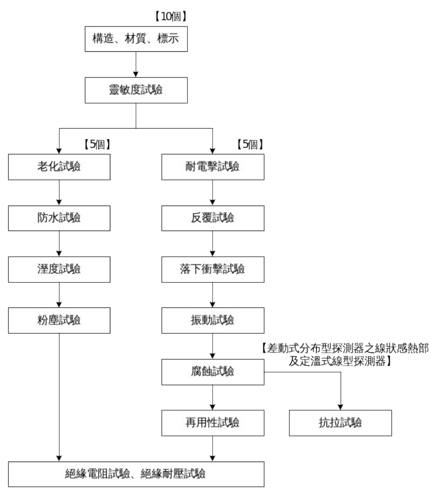

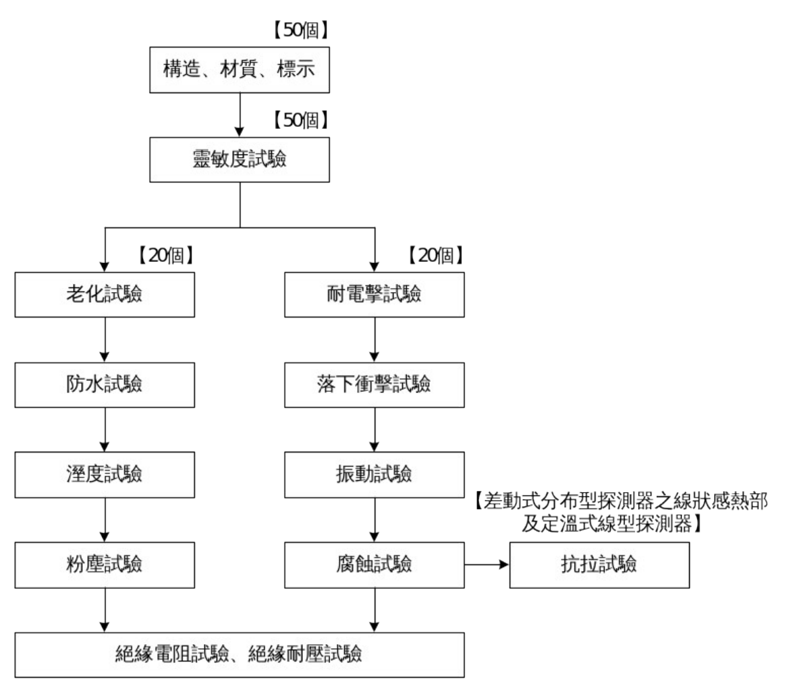

> 📷 截自原始檔內文頁 13～14。

1. 從耐電擊試驗至再用性試驗，由老化試驗至粉塵試驗每一試驗過程結束後皆需以靈敏度試驗來確認探測器功能是否異常。如果係非再用型探測器，則在靈敏度試驗取 50 個試驗樣品，先對其全部作不動作試驗，之後再對其 5 個實施動作試驗，除了這 5 個以外之 45 個，繼續分別以 20 個作耐電擊試驗，以 20 個作老化試驗，在每一檢查項目之靈敏度試驗，均先實施不動作試驗，然後以其中 5 個實施動作試驗，重複進行檢查。
2. 差動式分布型探測器之線狀感熱部及定溫式線型探測器之試驗樣品數，係將每 1m 長度視為 1 個進行檢查。

#### （二）試驗之方法

試驗方法依照「壹、技術規範及試驗方法」規定。

#### （三）試驗之紀錄

型式試驗的結果，使用附表 8 予以紀錄之。

### 三、型式試驗結果之判定

型式試驗之結果判定如下：

（一）符合本認可基準所規定之技術規範者，該型式試驗結果為合格。

（二）符合下述五、補正試驗所定事項者，得進行補正試驗，並以一次為限。

（三）未符合本認可基準所規定之技術規範者，該型式試驗結果為不合格。

### 四、補正試驗

符合下列事項之一者得進行補正試驗：

（一）型式試驗之不良事項如為申請資料不完備（設計錯誤除外）、標示遺漏、零件裝置不良或符合表 12 之一般缺點或輕微缺點者。

（二）試驗設備有不完備或缺點，致無法進行試驗之情形。

### 五、型式變更試驗之方法

型式變更試驗之樣品數、試驗流程等，應就型式變更之內容，依前述型式試驗進行。

### 六、型式區分、型式變更及輕微變更範圍

型式區分、型式變更及輕微變更範圍如表 9。

#### 表 9　型式區分、型式變更及輕微變更範圍

| 區分 | 說明 | 項目 |
|---|---|---|
| 型式區分 | 型式認可之產品其主要性能、設備種類、動作原理不同，或經中央主管機關規定之必要區分者，須以單一型式認可做區分。 | 1. 設備種類不同：差動式局限型、差動式分布型、定溫式局限型、定溫式線型、補償式局限型、離子式、光電式、複合式、火焰式等探測器。 2. 多信號。 3. 感度種類不同。 4. 動作溫度、濃度不同。 5. 防水型、非防水型。 6. 耐酸型、耐鹼型。 7. 再用型、非再用型。 8. 蓄積型、非蓄積型。 9. 標稱監視距離。 10. 監視角度。 11. 屋內型、屋外型。 |
| 型式變更 | 經型式認可之產品，其型式部分變更，有影響性能之虞，須施予試驗確認者。 | 1. 多信號數追加。 2. 變更動作電壓或電流。 3. 有影響主要性能的附屬裝置之材質、構造變更。 4. 變更標稱監視距離。（火焰探測器為每個視野角的標稱監視距離） 5. 感熱元件及檢知部除外，有影響性能部份的材質構造及形狀變更。 |
| 輕微變更 | 經型式認可或型式變更認可之產品，其型式部分變更，不影響其性能，且免施予試驗確認，可藉由書面據以判定良否者。 | 1. 接點方式、形狀及材質。 2. 基板材質。 3. 標示事項或標示位置。 4. 安裝方式。 5. 電子零件變更額定值、規格、型式或製造者。（但不影響設備性能者） 6. 零件（電子零件以外） 　（1）外殼材質。 　（2）外殼形狀及構造。 　（3）上揭（1）、（2）以外零件。（但不影響設備性能者） 7. 電子回路變更。（但不影響設備性能者） 8. 對主機能無影響之附屬裝置變更。 |

### 七、試驗紀錄

產品明細表格式如附表 7。有關上述型式試驗、補正試驗、型式變更試驗之結果，應詳細填載於型式試驗紀錄表（如附表 8）。

---

## 參、個別認可作業

### 一、個別認可之方法

（一）個別認可依照 CNS 9042 規定進行抽樣試驗。

（二）抽樣試驗之嚴寬等級依程序分為最嚴格試驗、嚴格試驗、普通試驗、寬鬆試驗及免會同試驗五種。

（三）個別試驗通常將試驗項目分為以通常樣品進行之試驗（以下稱為「一般試驗」）以及對於少數樣品進行之試驗（以下稱為「分項試驗」）。

### 二、個別認可之樣品

個別認可之樣品數以及樣品之抽樣方法如下：

#### （一）個別認可之樣品數

由該個別認可之相關試驗之嚴寬等級以及批次大小（如附表 1 至附表 4）所定。

#### （二）樣品之抽取如下所示

1. 抽樣試驗以每一批次為單位。
2. 樣品之多寡，應視整批成品（受驗數量＋預備品）數量之多寡及試驗等級，按抽樣表之規定抽取，並在重新編號之全部製品（受驗批）中，依隨機抽樣法（CNS 9042）隨意抽取，抽出之樣品依抽出順序編排序號。但受驗批量如在 300 個以上時，應依下列規定分為二段抽樣。

   （1）計算每群應抽之數量：當受驗批次在五群（含箱子及集運架等）以上時，每一群之製品數量應在 5 個以上之定數，並事先編定每一群之編碼；但最後一群之數量，未滿該定數亦可。

   （2）抽出之產品賦予群碼號碼：同群製品須排列整齊，且排列號碼應能清楚辨識。

   （3）確定群數及抽出個群，再從個群中抽出樣品：確定從所有群產品中可抽出五群以上之樣品，以隨機取樣法抽取相當數量之群，再由抽出之各群製品作系統式循環抽樣（由各群中抽取同一編號之製品），將受驗之樣品抽出。

   （4）依上述方法取得之製品數量超過樣品所需數量時，重複進行隨機取樣去除超過部分至達到所要數量。

3. 一般試驗和分項試驗以不同之樣品試驗之。

### 三、試驗項目

（一）一般試驗以及分項試驗之項目如表 10 所述。

#### 表 10　一般及分項試驗項目

| 試驗區分 | 試驗項目 |
|---|---|
| 一般試驗 | 構造、材質、標示 靈敏度試驗 |
| 分項試驗 | 絕緣電阻、絕緣耐壓試驗 防水試驗（防水型探測器） 抗拉試驗（差動式分布型探測器之線狀感熱部及定溫式線型探測器） |

（二）試驗方法：試驗方法依照「壹、技術規範及試驗方法」。

（三）個別試驗的紀錄使用附表 9。

### 四、缺點之分級及合格判定基準

依下列規定區分缺點及合格判定基準（AQL）。

（一）試驗中發現之缺點，其嚴重程度依「消防機具器材及設備認可作業要點」規定，區分為致命缺點、嚴重缺點、一般缺點及輕微缺點等四級。

（二）各試驗項目之缺點內容，依本基準肆、缺點判定方法規定，非屬該判定方法所列範圍內之缺點者，依「消防機具器材及設備認可作業要點」之分級原則判定。

### 五、個別認可結果之判定

受測批量合格與否，依抽樣表及下列規定判定之。抽樣表中，Ac 表示合格判定個數（合格判定時，不良品數之上限），Re 表示不合格判定個數（不合格判定時，不良品數之下限）。一般試驗及分項試驗，應分別計算其不良品之數量。

（一）抽樣試驗中，一般試驗及分項試驗之不良品數，均於合格判定個數以下時，視該批為合格。且下一批可依下述第八項「試驗嚴寬度等級之調整」更換較寬鬆之試驗等級。

（二）抽樣試驗中，一般試驗及分項試驗，任一試驗之不良品數在不合格判定個數以上時，視該批為不合格。並應依下述第八項「試驗嚴寬度等級之調整」更換較嚴格之試驗等級。但該等不良品之缺點僅為輕微缺點時，得進行補正試驗，惟以一次為限。

（三）抽樣試驗中出現致命缺點之不良品時，即使該抽樣試驗中不良品數在合格判定個數以下，該批仍視為不合格。並應依下述第八項「試驗嚴寬度等級之調整」更換較嚴格之試驗等級。

### 六、個別認可結果之處置

#### （一）合格批量之處置

1. 當批量雖經判定為合格，但受驗樣品中如發現有不良品時，應使用預備品替換或修復該等不良品數量後，方視整批為合格品。
2. 即當批量雖經判定為合格，其不良品部分之個數，如無預備品替換或無法修復調整者，仍判定為不合格。

#### （二）補正批量之處置

1. 接受補正試驗時，應提出初次試驗時所發現不良事項之改善說明書及不良品處理後之補正試驗合格紀錄表。
2. 補正試驗之受驗樣品數以初次試驗之受驗樣品數為準。

#### （三）不合格批量之處置

1. 不合格批量之產品接受再試驗時，應提出初次試驗時所發現不良事項之改善說明書，及不良品處理之補正試驗合格紀錄表。
2. 不合格批量之產品接受再試驗時，不得加入初次試驗受驗製品以外之製品。
3. 不合格之批量不再試驗時，應向認可機構備文說明理由及其廢棄處理等方式。

### 七、個別認可試驗嚴寬度等級之調整

（一）試驗等級以普通試驗為標準，並依表 11 規定進行轉換。

（二）有關補正試驗及再受驗批次之試驗等級調整，第一次試驗為寬鬆試驗者，以普通試驗為之；第一次試驗為普通試驗者，以嚴格試驗為之；第一次試驗為嚴格試驗者，以最嚴格試驗為之。此再受驗批次之試驗結果，不得計入試驗嚴寬分級轉換紀錄中。

#### 表 11　試驗嚴寬度等級之調整

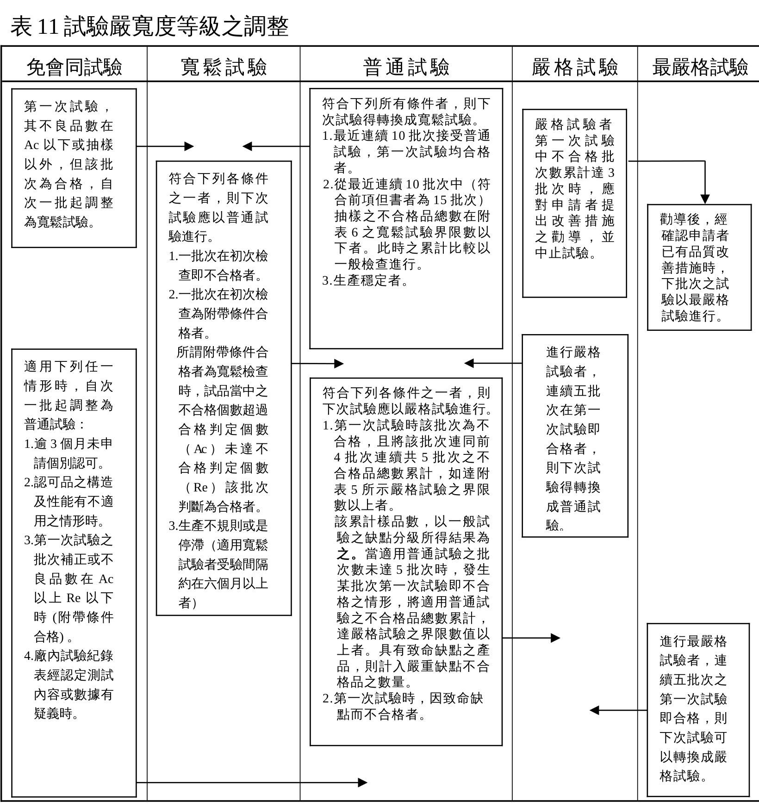

> 📷 截自原始檔內文頁 20。
>
> 🛈 普通試驗欄第 2 項之「符合前項但書者為 15 批次」，原件第 1 項並無但書，本檔照錄。

### 八、免會同試驗

（一）符合下列所有情形者，得免會同試驗：

1. 達寬鬆試驗後連續十批第一次試驗均合格者。
2. 累積受驗數量達 2000 個以上。
3. 取得 ISO 9001 認可登錄或國外第三公正檢驗單位通過者（產品具合格標識）。

（二）實施免會同試驗時，檢測單位每半年至少派員會同實施抽驗一次，試驗項目依照個別認可試驗項目，若試驗不符合本基準規定時，該批次予以不合格處置，並次批恢復為普通試驗（會同試驗）。

（三）符合免會同試驗資格者，如有下列情形之一時，該批樣品應即恢復為普通試驗（會同試驗）：

1. 所提廠內試驗紀錄表有疑義時。
2. 六個月內未申請個別認可者。
3. 經使用者反應認可樣品有構造與性能不合本基準規定，經檢測單位確認確實有不符合者。

### 九、個別認可試驗之限制

當批量完成上述之個別認可試驗完整程序後，方能申請及執行下一批量之個別認可試驗。

### 十、免施試驗之範圍

差動式分布型、光電式分離型及火焰式探測器等進口產品得免施一般試驗之靈敏度試驗，申請免施試驗應檢附下列資料：

（一）產品進口報單。

（二）國外第三公證機構認可（證）標示。

（三）出廠測試相關證明文件。

### 十一、個別認可試驗設備發生故障之處置

試驗開始後因試驗設備發生故障，確認當日無法完成試驗時，則中止該試驗。應俟接獲試驗設備完成改善之通知後，重新擇定時間，依下列規定對該批施行試驗。

（一）試驗之抽樣標準與初次試驗時相同。

（二）該試驗不得進行補正試驗。

### 十二、其他

個別認可時，若發現製品有其他不良事項，經認定該產品之抽樣標準及個別認可方法不適當時，得由中央主管機關另訂個別認可方法及抽樣標準。

---

## 肆、缺點判定方法

各項試驗所發現之不合格情形，其缺點之等級依表 12 之規定判定。

#### 表 12　缺點判定表

| 試驗項目 | 致命缺點 | 嚴重缺點 | 一般缺點 | 輕微缺點 |
|---|---|---|---|---|
| 分類 | 可能造成人體之傷害或無法發揮機具之基本功能者 | 不屬於致命缺點，但會對機具等之功能產生重大妨礙者 | 不屬於致命缺點或嚴重缺點，但會對機具等之功能產生妨礙之情形、機具等之構造與經型式承認機具不同或有會造成在使用時妨礙之錯誤標示者 | 有不屬嚴重缺點或一般缺點之輕微妨礙故障者 |
| 探測器－共通－與監視狀態有關 | 從一開始探測器就是在未連接狀態。 | 從一開始就在火災信號或火災訊息信號之發信狀態。 | 1、從一開始動作標示裝置等就在動作狀態（火災信號或火災訊息信號之發信狀態除外）。 2、從一開始就在故障或類似信號之發信狀態（以可以發出火災信號或火災訊息信號之狀態為限）。 | 1、從一開始附屬裝置等就在動作狀態。 2、從一開始就在故障或類似信號之發信狀態（以有關附屬裝置之信號為限） |
| 探測器－共通－與絕緣電阻、耐壓有關 |  |  | 1、額定回路電壓超過 60V 時，絕緣電阻值未滿規定值。 2、額定回路電壓超過 60V 時，在絕緣耐壓試驗中未達到規定之耐用時間。 | 1、額定回路電壓在 60V 以下時，絕緣電阻值未滿規定值。 2、額定回路電壓在 60V 以下時，在絕緣耐壓試驗中未達到規定之耐用時間。 |
| 探測器－共通－與一般功能有關 | 無法發出火災信號或火災訊息信號。 | 1、動作後無法復歸。 2、特有信號之定址號碼不同。 3、在防水試驗中，絕緣電阻未滿 1 MΩ。 | 1、探測器動作時，無法將該等訊息向動作確認燈及其他類似之火災報警功能相關裝置送信。 2、動作標示裝置不動作。 3、在防水試驗中，絕緣電阻值未滿 1 MΩ 以上之規定值。 4、無法向附屬裝置發送火災信號或火災訊息信號。 | 附屬裝置之功能等有不良之情形。 |
| 探測器－共通－與試驗功能有關 |  |  | 試驗功能無法正常動作（對火災信號或火災訊息信號造成影響者除外。） |  |
| 探測器－共通－與構造有關 | 1、造成可能或無法發出火災信號或火災訊息信號之斷線、接觸不良、零配件缺陷（洩漏電阻、熱偶等之缺陷）及其他類似之致命性不良。 2、無接點。 | 1、對發送火災信號或火災訊息信號之功能造成影響之試驗裝置或零配件之裝設等有嚴重不良。 2、基板與本體無法嵌合。 | 1、對火災功能（火災信號或火災訊息信號之發信功能除外）造成影響之試驗裝置或零配件之裝設等有嚴重不良。 2、接點上有顯著之損傷。 3、在接點部分、感應部分等有明顯之髒污附著或異物殘留。 4、可能會對功能造成影響之生銹。 5、在簧膜室等需要防蝕處理處未做防蝕處理。 | 1、對火災功能或試驗裝置功能無影響之零配件，其裝設等有嚴重不良。 2、試驗裝置或零配件之裝設等有輕微不良。 3、基板與本體有無法確實嵌合（偏位、縫隙等）之情形。 4、外觀、零配件之尺度偏離公差值。 5、對功能不致造成影響之生銹。 |
| 探測器－共通－與標示有關 |  |  | 1、對火災信號或火災訊息信號之發信功能可能造成影響之標示錯誤。 2、定址標示與探測器號碼不同。 | 1、標示錯誤（對火災信號或火災訊息信號之發信功能可能造成影響之情形除外）。 2、未標註或不明顯者。 |
| 探測器－相對於種類不同之功能關係－差動式局限型 | 以下列之條件實施階段上升動作試驗時，在 30 秒內不動作。 1、第 1 種，為第 2 種之試驗條件。 2、第 2 種，為溫度 45 度、風速 105 cm/s | 1、實施階段上升動作試驗時，其動作時間超過規定時間之 120﹪。 2、實施直線上升動作試驗時，其動作時間超過規定時間之 120﹪。 | 1、實施階段上升動作試驗時，其動作時間超過規定時間之 105﹪，在 120﹪ 以下。 2、實施直線上升動作試驗時，其動作時間超過規定時間之 105﹪，在 120﹪ 以下。 3、在不動作試驗時動作。 | 1、實施階段上升動作試驗時，其動作時間超過規定時間、在規定值之 105﹪ 以下。 2、實施直線上升動作試驗時，其動作時間超過規定時間、在規定值之 105﹪ 以下。 |
| 探測器－相對於種類不同之功能關係－差動式分布型（空氣管式） | 1、洩漏電阻值未滿設計值之 50﹪。 2、接點水高值超過設計值之 2 倍。 | 1、洩漏電阻值未滿規定值下限之 80﹪ 或超過上限之 120﹪。 2、接點水高值未滿規定值下限之 80﹪ 或超過上限之 120﹪。 3、等價容量未滿規定值下限之 80﹪ 或超過上限之 120﹪。 | 1、洩漏電阻值在規定值下限之 80﹪ 以上未滿 95﹪ 或超過 105﹪ 在 120﹪ 以下。 2、接點水高值在規定值下限之 80﹪ 以上未滿 95﹪ 或超過 105﹪ 在 120﹪ 以下。 3、等價容量在規定值下限之 80﹪ 以上未滿 95﹪ 或超過 105﹪ 在 120﹪ 以下。 4、在接點開放試驗中接點不開放。 | 1、洩漏電阻值在規定值下限之 95﹪ 以上、未滿下限值，或超過上限值、在上限值 105﹪ 以下。 2、接點水高值在規定值下限之 95﹪ 以上、未滿下限值，或超過上限值、在上限值 105﹪ 以下。 3、等價容量在規定值下限之 95﹪ 以上、未滿下限值，或超過上限值、在上限值 105﹪ 以下。 |
| 探測器－相對於種類不同之功能關係－差動式分布型（非空氣管式） | 1、檢出器之動作電壓超過設計值之 2 倍。 2、感熱部分之熱感應電壓未滿設計值之 1/2。 | 1、檢出器之動作電壓未滿規定值下限之 80﹪ 或超過上限之 120﹪。 2、感熱部分之熱感應電壓未滿規定值下限之 80﹪ 或超過上限之 120﹪。 | 1、檢出器之動作電壓在規定值下限之 80﹪ 以上未滿 95﹪ 或超過 105﹪ 在 120﹪ 以下。 2、在接點開放試驗中接點不開放。 3、感熱部分之熱感應電壓在規定值下限之 80﹪ 以上未滿 95﹪ 或超過 105﹪ 在 120﹪ 以下。 | 1、檢出器之動作電壓在規定值下限之 95﹪ 以上、未滿下限值，或超過上限值、在上限值 105﹪ 以下。 2、感熱部分之熱感應電壓在規定值下限之 95﹪ 以上、未滿下限值，或超過上限值、在上限值 105﹪ 以下。 |
| 探測器－相對於種類不同之功能關係－定溫式局限型 | 以標稱動作溫度之 150﹪ 之溫度、風速 100 cm/s、實施動作試驗時，在當時之室溫中未在規定之時間以內動作。 | 在動作試驗時，其動作時間超過規定值之 120﹪。 | 1、在動作試驗時，其動作時間超過規定值之 105﹪，在 120﹪ 以下。 2、在不動作試驗時動作。 | 在動作試驗時，其動作時間超過規定時間、在規定值之 105﹪ 以下。 |
| 探測器－相對於種類不同之功能關係－補償式局限型 | 以下列之條件實施階段上升動作試驗時，在 30 秒內不動作、及在定溫點動作試驗中比標稱定溫點高超過 30 度仍不動作。 （1）第 1 種，為第 2 種之試驗條件。 （2）第 2 種，為溫度 45 度、風速 105 cm/s | 1、實施階段上升動作試驗時，其動作時間超過規定時間之 120﹪。 2、實施直線上升動作試驗時，其動作時間超過規定時間之 120﹪。 3、在定溫點動作試驗中，動作溫度較標稱定溫點高超過 20 度。 | 1、實施階段上升動作試驗時，其動作時間超過規定時間之 105﹪，在 120﹪ 以下。 2、實施直線上升動作試驗時，其動作時間超過規定時間之 105﹪，在 120﹪ 以下。 3、在不動作試驗時動作。 4、在定溫點動作試驗中，動作溫度未滿較標稱定溫點低 15 度或較標稱定溫點高超過 20 度之溫度以下。 | 1、實施階段上升動作試驗時，其動作時間超過規定時間、在規定值之 105﹪ 以下。 2、實施直線上升動作試驗時，其動作時間超過規定時間、在規定值之 105﹪ 以下。 3、在定溫點動作試驗中，動作溫度在較標稱定溫點低 15 度之溫度以上未滿低 10 度之溫度或超過較標稱定溫點高 10 度之溫度而在高 15 度之溫度以下。 |
| 探測器－相對於種類不同之功能關係－離子式局限型、光電式局限型、光電式分離型 | 1、以下列之條件實施動作試驗時，動作時間（如係蓄積型，為動作時間減去蓄積時間後之時間。以下在本表中同。）超過 30 秒（如係第 3 種或光電式分離型之第 2 種，則為 60 秒）。 （1）第 1 種及光電式分離型之第 2 種，為第 2 種之試驗條件。 （2）離子式局限型第 2 種以及第 3 種，為第 3 種之試驗條件。 2、蓄積時間超過標稱蓄積時間之 2 倍。 | 1、在動作試驗時，其動作時間超過規定值之 120﹪。 2、蓄積時間未滿規定值下限之 80﹪ 或超過上限之 120﹪。 3、為光電式分離型，卻無法設定監視距離。 | 1、在動作試驗時，其動作時間超過規定值之 105﹪，在 120﹪ 以下 2、在不動作試驗時動作。 3、蓄積時間在規定值之 80﹪ 以上、95﹪ 未滿，或超過上限值之 105﹪、在 120﹪ 以下。 | 1、在動作試驗時，其動作時間超過規定時間、在規定值之 105﹪ 以下。 2、蓄積時間在規定值之下限值 95﹪ 以上、未滿下限值，或超過上限值、在上限值 105﹪ 以下。 |
| 探測器－相對於種類不同之功能關係－火焰式 | 在標稱監視距離之 2/3 距離處實施動作試驗時，其動作時間超過 30 秒。 | 在動作試驗時，其動作時間超過規定值之 120﹪。 | 1、在動作試驗時，其動作時間超過規定值之 105﹪，在 120﹪ 以下。 2、在不動作試驗時動作。 3、髒污監視功能不動作。 | 在動作試驗時，其動作時間超過規定時間、在規定值之 105﹪ 以下。 |

> 備考：
>
> 1. 複合式局限型探測器得依其具有之性能分別準用該分類之規定。
> 2. 如係多信號探測器，得就其具有之種類別（特種、第 1 種、第 2 種或第 3 種）、標稱動作溫度等分別適用本表之規定。
> 3. 本表用語之定義如下：
>    - 火災報警功能：係指火災警報設備所具有之監視、警報、火災顯示試驗、導通試驗功能等功能。
>    - 附屬裝置：係指與火災報警功能有關之裝置以外組裝在機器中之裝置。
>    - 零配件裝設之重大不良：係指與零配件有關之損傷或過與不足、與配線有關之斷線、接觸不良、忘記焊接、表層焊或繞捲不良（鬆動或未滿 3 圈）及其他類似之不良。
> 4. 零配件裝設之輕微不良：係指裝設狀態不良、配線狀態不良、忘記防鬆脫栓、與配線有關之焊接不良（忘記焊接、表層焊除外。）或繞捲欠佳（圈數在 3 以上、未滿 6）、保險絲之容量有誤及其他類似之不良。

---

## 伍、主要試驗設備

本基準各項試驗設備依表 13 所列設置。

#### 表 13　試驗設備項目表

| 項目 | 規格 | 數量 |
|---|---|---|
| 抽樣表 | 本基準附表 1 至附表 4 之規定 | 1 份 |
| 亂數表 | CNS 9042 或本基準中有關之規定 | 1 份 |
| 計算器 | 8 位數以上工程用電子計算器 | 1 只 |
| 碼錶 | 1 分計，附計算功能，精密度 1/10 至 1/100 sec | 1 個 |
| 尺寸測量器－游標卡尺 | 測定範圍：0 至 150 mm，精密度 1/50 mm，1 級品 | 1 個 |
| 尺寸測量器－分厘卡 | 測定範圍：0 至 25 mm，最小刻度 0.1 mm，精密度 ±0.005 mm | 1 個 |
| 尺寸測量器－深度量規 | 指示盤之精度：小圓分 10 格，每格 0.01 mm；大圓分 100 格，每格 0.1 mm | 1 個 |
| 尺寸測量器－直尺 | 測定範圍：1 至 30 cm，最小刻度 1 mm | 1 個 |
| 尺寸測量器－卷尺（布尺） | 測定範圍：1 至 5 m，最小刻度 1 mm | 1 個 |
| 風速計 | 測定範圍：0.05～20.0（m/s），精密度 ±1% | 1 個 |
| 數位式三用電表 | 電流測定範圍：0 至 30 mA 以上 電阻測定範圍：0 至 20 MΩ 以上 電壓測定範圍：AC 或 DC 0 至 2000 V 以上 | 1 個 |
| 抗拉試驗裝置 | 抗拉試驗設備（拉力 10 kgf 以上，精密度 ±1%） | 1 套 |
| 靈敏度試驗裝置 | 定溫式局限型靈敏度試驗機 （1）設定溫度 150℃，精密度 ±2.5%。 （2）風速 0.2～1.0 m/sec，精密度 ±0.1 m/sec。 差動式階段上昇用靈敏度試驗機 （1）垂直氣流試驗機。 （2）設定溫度 20℃、30℃，精密度 ±2.5%。 （3）風速 0.2～1.0 m/sec，精密度 ±0.1 m/sec。 差動式直線上昇用靈敏度試驗機 （1）水平氣流試驗機。 （2）設定溫度 2、3、10、15℃/min，精密度 ±2.5%。 （3）風速 0.2～1.0 m/sec，精密度 ±0.1 m/sec。 偵煙式局限型光電式靈敏度試驗機 （1）水平氣流試驗機。 （2）光學濃度計。 （3）發煙箱。 （4）風速 0.2～1.0 m/sec，精密度 ±0.1 m/sec。 （5）校正用光學濾鏡。 偵煙式局限型離子式靈敏度試驗機 （1）水平氣流試驗機。 （2）離子式濃度計。 （3）發煙箱。 （4）風速 0.2～1.0 m/sec，精密度 ±0.1 m/sec。 | 各 1 套 |
| 老化試驗裝置 | 老化試驗箱（溫度為室溫～150℃） | 1 套 |
| 防水試驗裝置 | 防水試驗槽（水槽溫度為室溫～80℃） | 1 套 |
| 腐蝕試驗裝置 | 5 公升試驗用容器 硫代硫酸鈉、硫酸、氯化氫、氨氣等 恆溫設備（恆溫 45℃±2℃） | 各 1 套 |
| 反覆試驗裝置 | 依動作原理反覆進行 1000 次動作之試驗設備 | 1 套 |
| 振動試驗裝置 | 振動試驗機（振動頻率每分鐘 1000 次以上，全振幅 4 mm） | 1 套 |
| 落下衝擊試驗裝置 | 衝擊試驗機（最大加速度 100 g 以上） | 1 套 |
| 粉塵試驗機裝置 | 粉塵試驗機 光學濃度計 溫度 20～30℃，濕度 40～50%。 | 1 套 |
| 耐電擊試驗裝置 | 耐電擊試驗機 1. 衝擊波形為方波 2. 可設定測試電壓 500 V，脈波寬為 1 μs、0.1 μs。測試頻率 100 Hz。 | 1 套 |
| 溼度試驗裝置 | 恆溫恆濕機（溫度為 40℃±2℃、濕度為 95%±2.5%） | 1 套 |
| 再用性試驗裝置 | 風洞試驗機（溫度 150℃，風速 1 m/sec） | 1 套 |
| 絕緣電阻計 | 測定電壓 DC 500 V、1000 V 以上 | 1 套 |
| 絕緣耐壓試驗機 | 測試電壓為 2000 V 以上 | 1 套 |

---

## 陸、附表

### 附表 1　普通試驗抽樣表

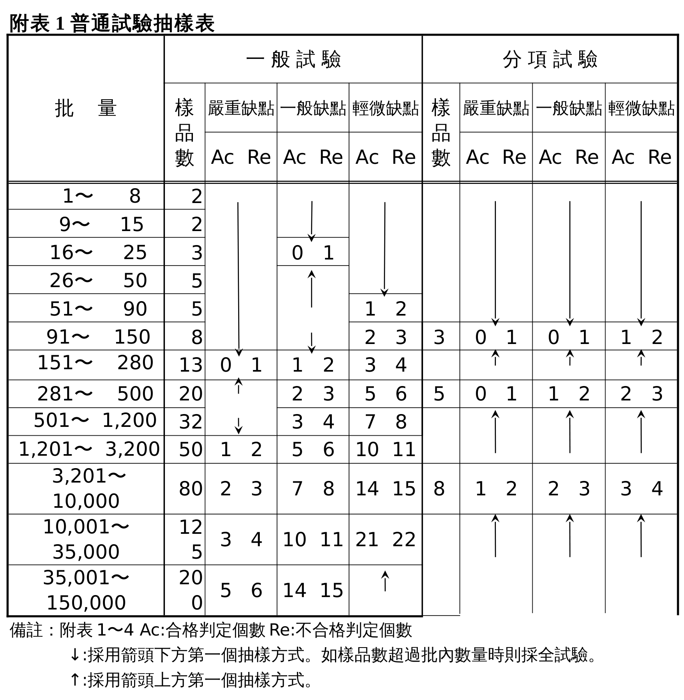

> 📷 截自原始檔內文頁 28。

### 附表 2　寬鬆試驗抽樣表

> 📷 截自原始檔內文頁 29。

### 附表 3　嚴格試驗抽樣表

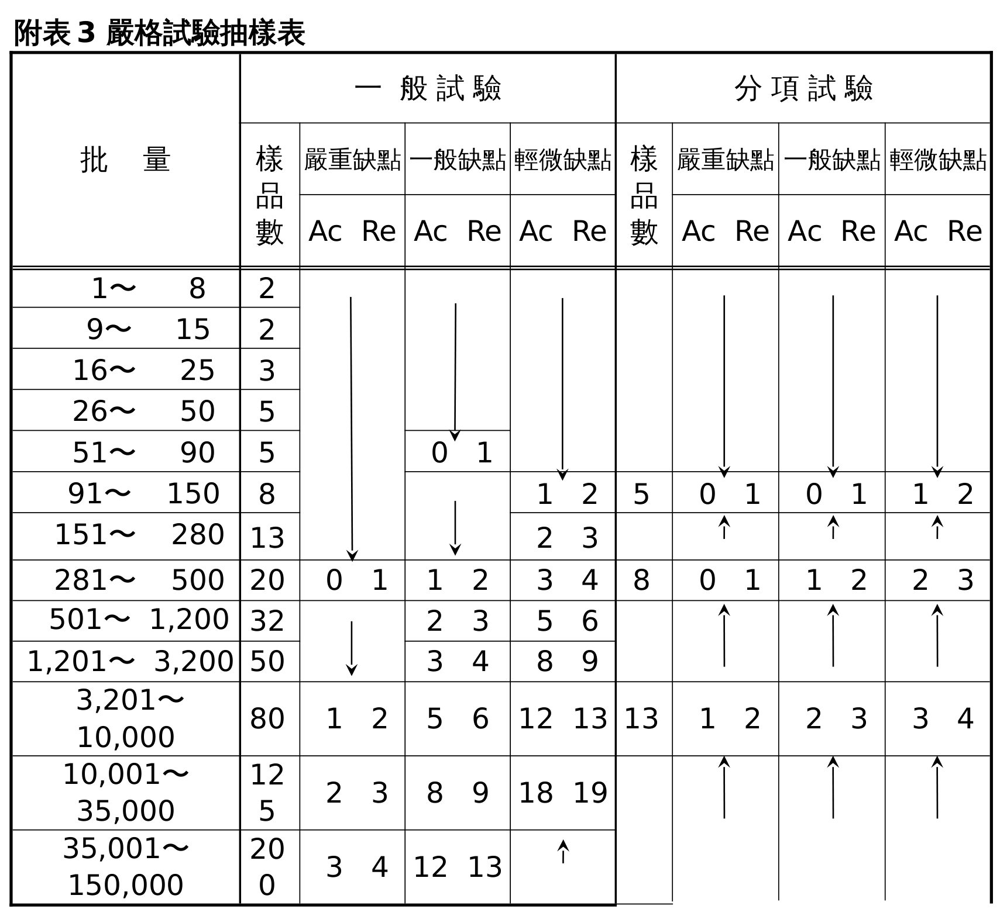

> 📷 截自原始檔內文頁 30。

### 附表 4　最嚴格試驗抽樣表

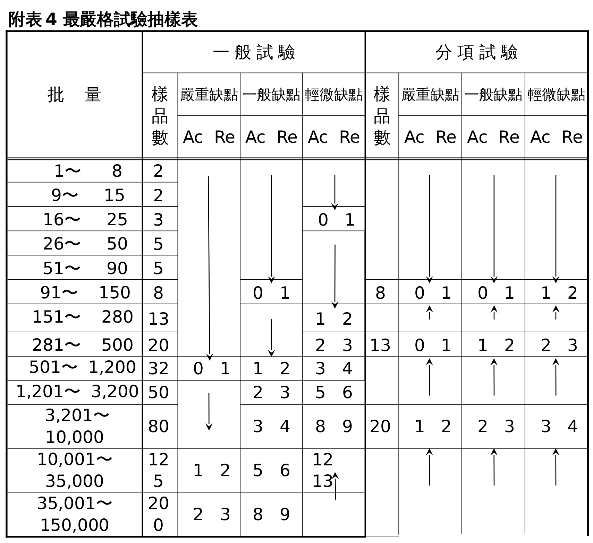

> 📷 截自原始檔內文頁 31。

### 附表 5　嚴格試驗之界限數

| 累計樣品數 | 嚴重缺點 | 一般缺點 | 輕微缺點 |
|---|---|---|---|
| 1 | 2 | 2 | 2 |
| 2 | 2 | 2 | 3 |
| 3 | 2 | 3 | 3 |
| 4 | 2 | 3 | 4 |
| 5 | 2 | 3 | 4 |
| 6～7 | 2 | 3 | 4 |
| 8～9 | 2 | 3 | 5 |
| 10～12 | 2 | 4 | 5 |
| 13～14 | 3 | 4 | 6 |
| 15～19 | 3 | 4 | 7 |
| 20～24 | 3 | 5 | 7 |
| 25～29 | 3 | 5 | 8 |
| 30～39 | 3 | 6 | 10 |
| 40～49 | 4 | 7 | 11 |
| 50～64 | 4 | 7 | 13 |
| 65～79 | 4 | 8 | 15 |
| 80～99 | 5 | 10 | 17 |
| 100～129 | 5 | 11 | 20 |
| 130～159 | 6 | 13 | 24 |
| 160～199 | 7 | 15 | 28 |
| 200～249 | 7 | 17 | 33 |
| 250～319 | 8 | 20 | 40 |
| 320～399 | 10 | 24 | 48 |
| 400～499 | 11 | 28 | 60 |
| 500～624 | 13 | 33 | 76 |
| 625～799 | 15 | 40 | 95 |

### 附表 6　寬鬆試驗之界限數

> ＊表示樣品累計數未達轉換成寬鬆試驗之充分條件。本表適用於最近連續十批次接受普通試驗，第一次試驗時均合格者之樣品數累計。

| 累計樣品數 | 嚴重缺點 | 一般缺點 | 輕微缺點 |
|---|---|---|---|
| 10～64 | ＊ | ＊ | ＊ |
| 65～79 | ＊ | ＊ | 0 |
| 80～99 | ＊ | ＊ | 1 |
| 100～129 | ＊ | ＊ | 2 |
| 130～159 | ＊ | ＊ | 4 |
| 160～199 | ＊ | 0 | 6 |
| 200～249 | ＊ | 1 | 9 |
| 250～319 | ＊ | 2 | 12 |
| 320～399 | ＊ | 4 | 15 |
| 400～499 | ＊ | 6 | 19 |
| 500～624 | ＊ | 9 | 25 |
| 625～799 | 0 | 12 | 31 |
| 800～999 | 1 | 15 | 39 |
| 1,000～1,249 | 2 | 19 | 50 |
| 1,250～1,574 | 4 | 25 | 63 |

### 附表 7 之 1　火警探測器產品明細表

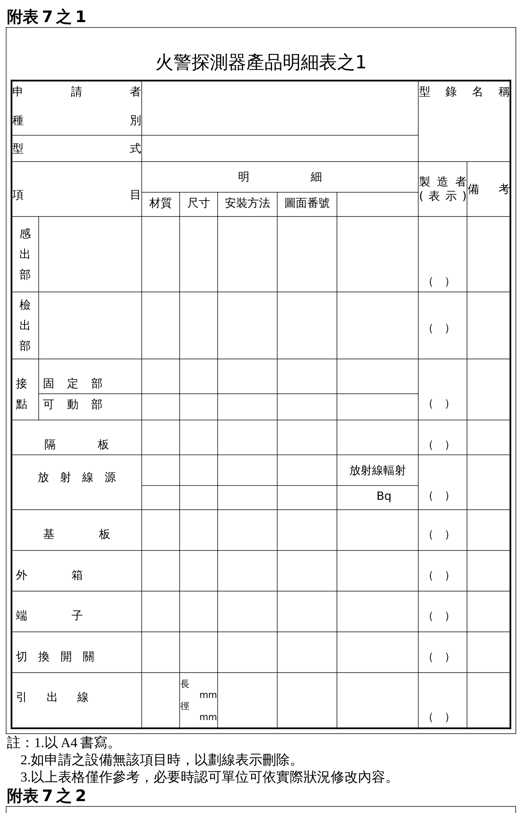

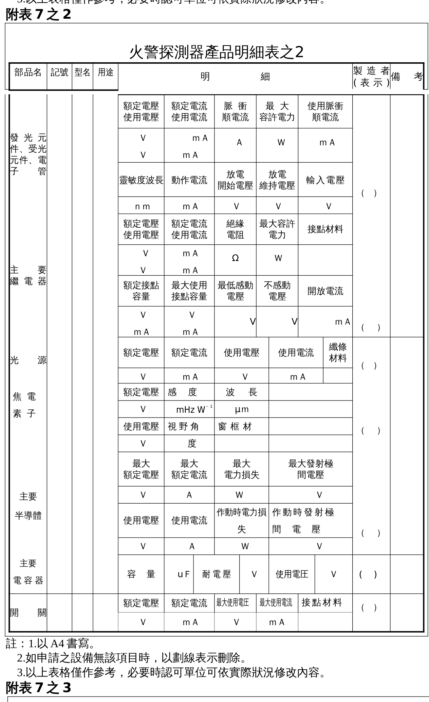

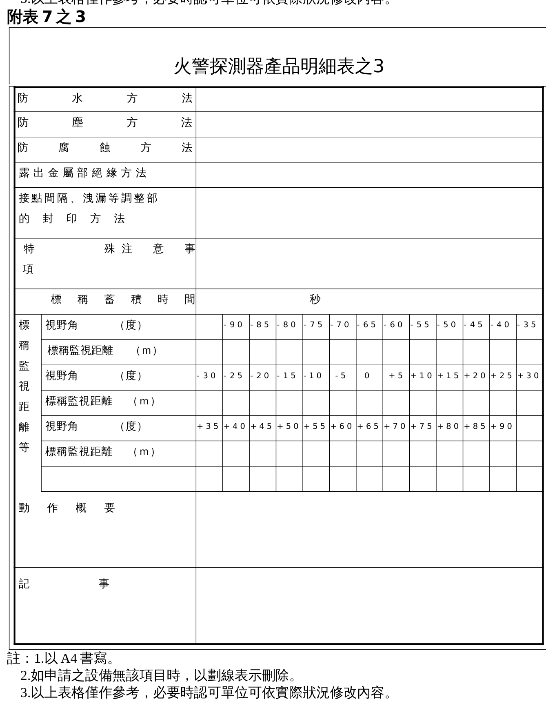

> 📷 截自原始 DOC 轉檔（LibreOffice→PDF）。

### 附表 8　火警探測器型式試驗紀錄表

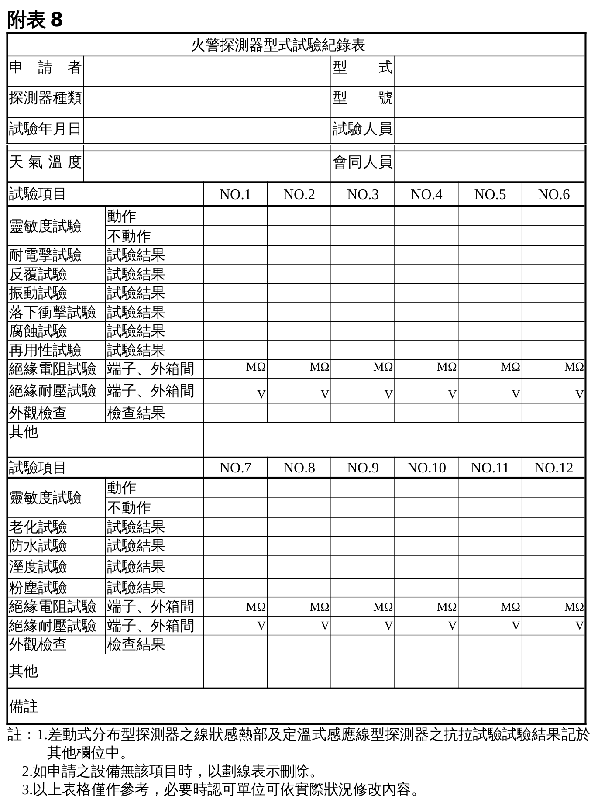

> 📷 截自原始 DOC 轉檔（LibreOffice→PDF）。

### 附表 9　火警探測器個別試驗紀錄表

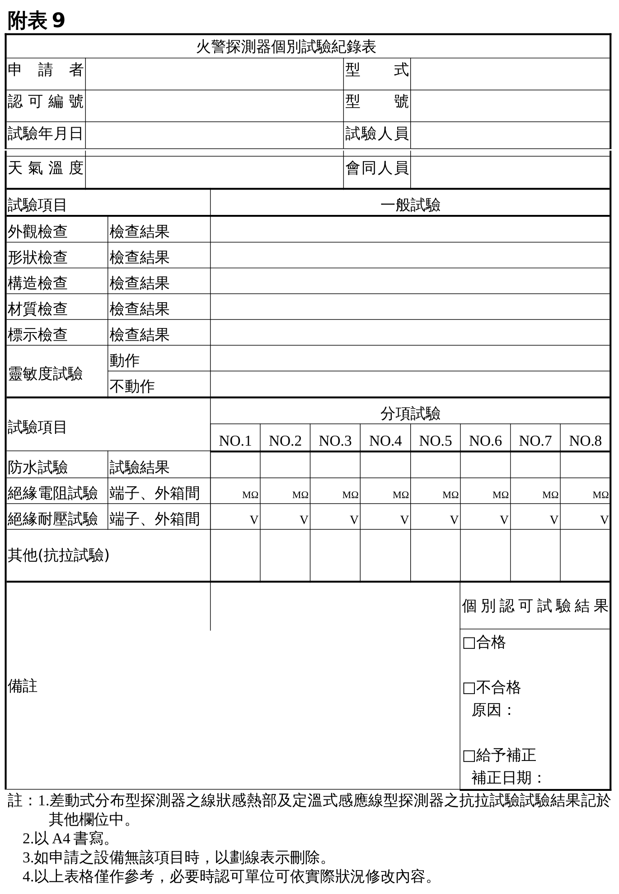

> 📷 截自原始 DOC 轉檔（LibreOffice→PDF）。

---

## 附表／附圖（附件）

- 表 12（缺點判定表）、表 13（試驗設備項目表）及附表 5、附表 6（界限數）已轉為 Markdown 表格；型式試驗流程圖、表 11、附表 1～4（抽樣表）、附表 7 之 1～之 3（產品明細表）、附表 8、附表 9（紀錄表）均已以截圖嵌入本文相應位置。原始檔：
- 📎 [火警探測器認可基準.doc](../原始檔案/火警探測器認可基準/火警探測器認可基準.doc)
