# 一齊開放閥認可基準

> 來源：內政部消防署｜版本日期：民國 108 年 12 月 5 日內授消字第 1080823335 號令修正發布
>
> ⚠️ **法規快照**：本檔為入庫當下之版本，引用前請依 index.md「法規時效」核對官方現行版本。
>
> 📌 **免責聲明**：本檔內容部分為 PDF／影像 OCR 與人工整理之結果，可能有辨識誤差。**一切以主管機關（內政部消防署）公告之現行版本為準**；如有疑義，以官方公告為主。後續 AI 代理人引用本檔時應主動提醒使用者此點，並於必要時自行上網查證正確版本。

---

## 壹、技術規範及試驗方法

### 一、適用範圍

本基準適用於消防用自動撒水設備、水霧滅火設備及自動泡沫滅火設備等所使用之一齊開放閥（限與配管連接部之內徑在 300 mm 以下者）裝置。

### 二、構造及性能

#### （一）基本構造

1. 依據一齊開放閥控制部之構造可以分為加壓型、減壓型、電動型、電磁型等四種。
2. 閥體平時呈關閉狀態，由控制部啟動始能開啟。
3. 閥體開啟後如遇供水中斷時，可再供水流通過。
4. 閥體內各部之截面積必須大於閥體接孔內徑及閥座內徑。
5. 本體及其他零件應能容易檢查換修。
6. 本基準所稱一齊開放閥各部構造及名稱如圖例（以減壓型為例，如附圖一）。

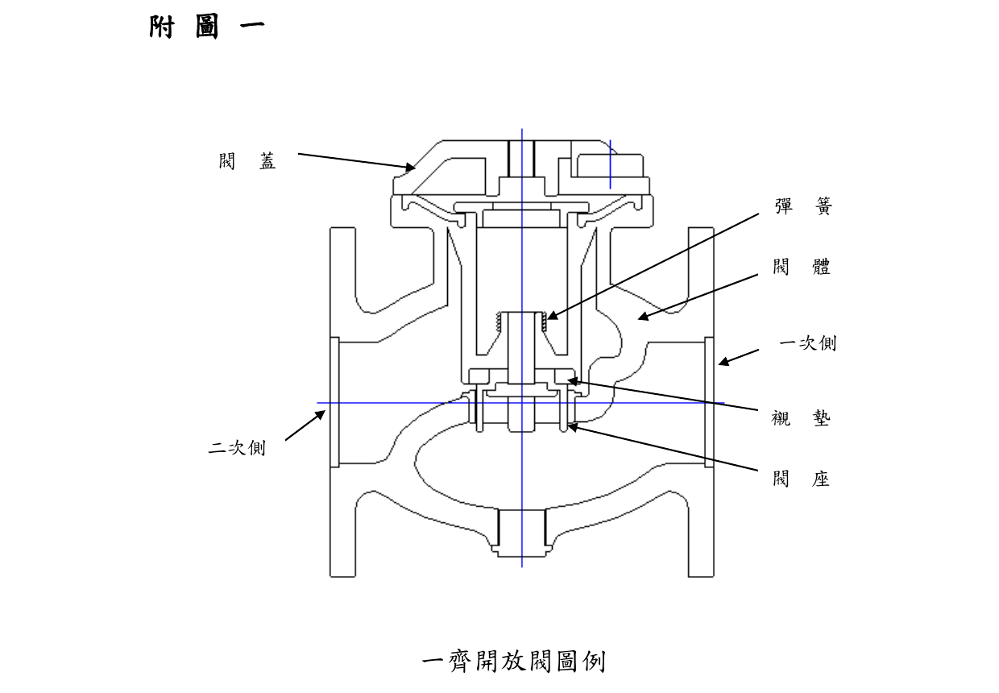

> 📷 截自原始 PDF 第 34 頁（內文頁 31）。
7. 一齊開放閥之內徑係指與配管連接部分之尺度，其規格大小如下表（表一）所示：

#### 表一　標稱內徑規格

| 內徑(mm) | 25 | 32 | 40 | 50 | 65 | 80 | 100 | 125 | 150 | 200 | 250 | 300 |
|---|---|---|---|---|---|---|---|---|---|---|---|---|
| A（公制-mm） | 25 | 32 | 40 | 50 | 65 | 80 | 100 | 125 | 150 | 200 | 250 | 300 |
| B（英制-in） | 1 | 1¼ | 1½ | 2 | 2½ | 3 | 4 | 5 | 6 | 8 | 10 | 12 |

> 註：配管部份應符合 CNS 6445 或 CNS 4626 之要求。

8. 與配管連接部分使用凸緣或螺紋以外之工法，應便於安裝且不致產生使用上之障礙。
9. 與配管連接使用的凸緣部或螺紋部之外徑尺寸，應符合表二所列規定值。

#### 表二　凸緣部及螺紋部尺寸（單位：mm）

| 標稱內徑 | 標稱壓力 | 凸緣部 外徑 | 凸緣部 中心圓直徑 | 凸緣部 螺栓孔數 | 凸緣部 螺栓孔直徑 | 凸緣部厚度 青銅 | 凸緣部厚度 鑄鐵 | 凸緣部厚度 鑄鋼 | 螺紋部 螺紋規格 PT | 螺紋部 有效螺紋長度 | 螺紋部 二面寬（青銅） |
|---|---|---|---|---|---|---|---|---|---|---|---|
| 25 | 10K | 125 | 90 | 4 | 19 | 14 |  |  | 1 | 16 | 44 |
| 25 | 16K |  |  |  |  |  |  |  |  |  |  |
| 25 | 20K |  |  |  |  |  |  |  |  |  |  |
| 32 | 10K | 135 | 100 | 4 | 19 | 16 |  |  | 1¼ | 18 | 54 |
| 32 | 16K |  |  |  |  |  |  |  |  |  |  |
| 32 | 20K |  |  |  |  |  |  |  |  |  |  |
| 40 | 10K | 140 | 105 | 4 | 19 | 16 | 20 | 16 | 1½ | 19 | 60 |
| 40 | 16K | 140 | 105 | 4 | 19 |  | 20 | 16 |  |  |  |
| 40 | 20K | 140 | 105 | 4 | 19 |  |  | 22 |  |  |  |
| 50 | 10K | 155 | 120 | 4 | 19 | 16 | 20 | 16 | 2 | 21 | 74 |
| 50 | 16K | 155 | 120 | 8 | 19 |  | 20 | 16 |  |  |  |
| 50 | 20K | 155 | 120 | 8 | 19 |  |  | 22 |  |  |  |
| 65 | 10K | 175 | 140 | 4 | 19 | 18 | 22 | 18 | 2½ | 24 | 90 |
| 65 | 16K | 175 | 140 | 8 | 19 |  | 22 | 18 |  |  |  |
| 65 | 20K | 175 | 140 | 8 | 19 |  |  | 24 |  |  |  |
| 80 | 10K | 185 | 150 | 8 | 19 | 18 | 22 | 18 | 3 | 26 | 105 |
| 80 | 16K | 200 | 160 | 8 | 23 |  | 24 | 20 |  |  |  |
| 80 | 20K | 200 | 160 | 8 | 23 |  |  | 26 |  |  |  |
| 100 | 10K | 210 | 175 | 8 | 19 |  | 24 | 20 |  |  |  |
| 100 | 16K | 225 | 185 | 8 | 23 |  | 26 | 22 |  |  |  |
| 100 | 20K | 225 | 185 | 8 | 23 |  |  | 28 |  |  |  |
| 125 | 10K | 250 | 210 | 8 | 23 |  | 24 | 20 |  |  |  |
| 125 | 16K | 270 | 225 | 8 | 25 |  | 26 | 22 |  |  |  |
| 125 | 20K | 270 | 225 | 8 | 25 |  |  | 30 |  |  |  |
| 150 | 10K | 280 | 240 | 8 | 23 |  | 26 | 22 |  |  |  |
| 150 | 16K | 305 | 260 | 12 | 25 |  | 28 | 24 |  |  |  |
| 150 | 20K | 305 | 260 | 12 | 25 |  |  | 32 |  |  |  |
| 200 | 10K | 330 | 290 | 12 | 23 |  | 26 | 22 |  |  |  |
| 200 | 16K | 350 | 305 | 12 | 25 |  | 30 | 26 |  |  |  |
| 200 | 20K | 350 | 305 | 12 | 25 |  |  | 34 |  |  |  |
| 250 | 10K | 400 | 355 | 12 | 25 |  | 30 | 24 |  |  |  |
| 250 | 16K | 430 | 380 | 12 | 27 |  | 34 | 28 |  |  |  |
| 250 | 20K | 430 | 380 | 12 | 27 |  |  | 38 |  |  |  |
| 300 | 10K | 445 | 400 | 16 | 25 |  | 32 | 24 |  |  |  |
| 300 | 16K | 480 | 430 | 16 | 27 |  | 36 | 30 |  |  |  |
| 300 | 20K | 480 | 430 | 16 | 27 |  |  | 40 |  |  |  |

> 註：「二面寬－青銅」係指 25、32、40、50、65、80 之青銅質螺紋口型一齊開放閥，其螺紋部分之外圍六角面之對邊寬度。

#### （二）外觀

1. 鑄造品內外面均不得存有砂孔、毛邊、砂燒結、咬砂、裂痕、銹蝕等情形。
2. 切削加工斷面，不得有損傷或加工不良等現象，必要時應予加工使其平滑。
3. 液體流通部分須平滑及清潔，不得殘留有切削粉末等情形。
4. 襯墊應適切安裝定位。

#### （三）尺度

1. 應確認直接影響性能部分，是否在圖面所記載之容許誤差範圍內。
2. 依下列（1）至（4）測量配管連接部分(凸緣或螺牙)之尺度、閥體兩面寬、閥體之厚度及凸緣之平行度。

   （1）凸緣或螺牙尺度之容許誤差，應依 CNS 7120「管凸緣尺度公差」之規定。

   （2）凸緣兩端面間尺度之容許誤差，應在 ±2.0 mm 以內。

   （3）閥體鑄品厚度，應在下表（表三）所列數值以上。

#### 表三　閥體鑄品最小厚度（單位：mm）

| 標稱壓力 | 材質 | 25 | 32 | 40 | 50 | 65 | 80 | 100 | 125 | 150 | 200 | 250 | 300 |
|---|---|---|---|---|---|---|---|---|---|---|---|---|---|
| 10K | 青銅 | 3 | 3.5 | 4 | 4.5 | 5.5 | 6 | 7 |  |  |  |  |  |
| 10K | 鑄鐵 |  |  | 7 | 7 | 8 | 8 | 10 | 11 | 13 | 15 | 17 | 20 |
| 10K | 鑄鋼 |  |  | 7 | 8 | 8 | 8 | 9 | 9 | 9 | 10 | 12 | 14 |
| 16K | 青銅 |  |  | 4.5 | 5 | 6 | 6.5 | 7.5 |  |  |  |  |  |
| 16K | 鑄鐵 |  |  | 7 | 9 | 10 | 10 | 11 | 13 | 14 | 16 | 18 | 21 |
| 16K | 鑄鋼 |  |  | 7 | 8 | 8 | 8 | 9 | 9 | 10 | 12 | 14 | 17 |
| 20K | 鑄鋼 |  |  | 8 | 8 | 9 | 9 | 10 | 11 | 12 | 15 | 15 | 21 |

> 註：表頭之 25 至 300 為內徑（mm）。

   （4）凸緣平行度以兩面寬之最大誤差值，應在下表（表四）所列數值以下。

#### 表四　凸緣平行度最大誤差（單位：mm）

| 標稱壓力＼標稱口徑 | 25 | 32 | 40 | 50 | 65 | 80 | 100 | 125 | 150 | 200 | 250 | 300 |
|---|---|---|---|---|---|---|---|---|---|---|---|---|
| 10K | 1.1 | 1.2 | 1.2 | 1.4 | 1.5 | 1.6 | 1.8 | 1.5 | 1.6 | 1.9 | 2.3 | 1.9 |
| 16K |  |  | 1.2 | 1.4 | 1.5 | 1.7 | 2.0 | 1.6 | 1.8 | 2.0 | 2.5 | 2.1 |
| 20K |  |  | 1.2 | 1.4 | 1.5 | 1.7 | 2.0 | 1.6 | 1.8 | 2.0 | 2.5 | 2.1 |

#### （四）核對設計圖面

一齊開放閥之各部構造、尺度及加工方法等，應與申請所提設計圖面記載內容相符。

1. 與性能有直接關係之圖說，應註明許可公差。
2. 各零組件之圖說應註明製造方法（例如鑄造方法、裝配方向等）。

### 三、材質

#### （一）一齊開放閥各部分之材質，應符合下表（表五）規定或具有同等性能以上者。

#### 表五　各部材質

| 構造 | 國家標準總號 | 國家標準名稱 | 適用材料 |
|---|---|---|---|
| 本體（閥體） | CNS 2472 | 灰口鑄鐵件 | FC200 以上 |
| 本體（閥蓋） | CNS 7147 | 高溫高壓用鑄鋼件 | SCPH21 以上 |
| 本體（閥體／閥蓋） | CNS 4125 | 青銅鑄件 | BC6 以上 |
| 閥座 | CNS 4125 | 青銅鑄件 | BC6 以上 |
| 閥座 | CNS 3270 | 不銹鋼棒 | 304 級以上 |
| 彈簧 | CNS 8397 | 彈簧用不銹鋼線 | 304 級以上 |
| 襯墊 | CNS 3550 | 工業用橡膠墊料 | BⅡ714 級以上 |

（二）可能產生銹蝕部位應施予防銹處理。

（三）橡膠、合成樹脂等應使用不易變形之材質。

（四）襯墊、隔膜片所使用之橡膠、合成樹脂等應檢附下列文件。

1. 規格明細表：應詳載成分明細及拉力強度、伸展度及硬度等資料。
2. 試驗報告書：在 65℃ 的環境下，將上述物體投入下列各水溶液，經浸泡 7 日後進行試驗。記錄其浸泡前後的拉力強度、伸展度、硬度、體積變化率及吸水率。並載明下列（1）至（4）所使用之藥劑種類及型號。

   （1）蛋白質泡沫水溶液

   （2）合成界面活性泡沫水溶液

   （3）水成膜泡沫水溶液

   （4）3％氯化鈉水溶液

   但供該一齊開放閥流通之加壓液體，如非上述（1）至（4）所列之任何一種時，則不需進行此項試驗。

### 四、最高使用壓力範圍

一齊開放閥一次側（流入本體之流入側，以下相同）之最高使用壓力範圍係指使用壓力範圍（不致使一齊開放閥產生功能障礙之壓力範圍）之最大值，以下亦同，應符合下表（表六）所列之規定值。

#### 表六　最高使用壓力範圍

| 標稱壓力 | 壓力範圍（kgf/cm²） |
|---|---|
| 10 K | 10 以上　14 以下 |
| 16 K | 16 以上　22 以下 |
| 20 K | 20 以上　28 以下 |

一齊開放閥之最低使用壓力為其申請值，最高使用壓力應符合上表之規定。

### 五、耐壓試驗

#### （一）閥體及主要構件之耐壓試驗

1. 以側蓋或水壓試驗用壓板封閉閥體兩端，在閥的一次側與二次側部分依下表（表七）所列之壓力值試驗 2 分鐘後，不得有漏水、變形、損傷及破壞等不良情形。

#### 表七　耐壓試驗壓力

| 標稱壓力 | 試驗壓力（kgf/cm²） |
|---|---|
| 10 K | 20 |
| 16 K | 32 |
| 20 K | 40 |

2. 控制部的閥蓋、螺栓等之襯套或螺紋部產生 0.2 ml/min 以下之洩漏時，需加強鎖緊固定，但每個螺栓僅限一回。（控制部閥蓋使用複數螺栓固定時，需將所有螺栓加強鎖緊一回）
3. 一齊開放閥之開關軸使用襯墊構造並有加強鎖緊之裝置時，應加強鎖緊。

#### （二）控制部耐壓試驗

利用壓力進行開啟之控制部，施以上表（表七）所列壓力值試驗 2 分鐘後，不得有漏水、變形、損傷或破壞之情形產生。如對一次側以不同壓力加壓於控制部者，則以該控制部最高使用壓力之 1.5 倍壓力進行水壓試驗。控制部不適用水壓進行試驗時，可用空氣壓力進行試驗。此時，以目測、觀察壓力計指針變化或進行功能試驗加以確認。

#### （三）閥座耐壓試驗

閥座於關閉狀態下進行試驗，試驗時閥體以側蓋或水壓試驗用壓板封閉兩端，在閥的二次側設開口部，在閥的一次側施以上表（表七）所列壓力值試驗 2 分鐘後，閥座（包含閥本身）不得產生變形、損傷或破壞情形。

#### （四）閥座洩漏試驗

1. 以側蓋或水壓試驗用壓板封閉閥體兩端，在二次側裝上刻度吸量管，在一次側施以下表（表八）所列的壓力值進行試驗 2 分鐘。

#### 表八　閥座洩漏試驗壓力

| 標稱壓力（kgf/cm²） | 水壓試驗壓力（kgf/cm²） |
|---|---|
| 10K | 15 |
| 16K | 24 |
| 20K | 30 |

2. 加壓 2 分鐘後，每 30 秒以刻度吸量管測量洩漏量，並以下列計算公式計算洩漏比（以四捨五入取至小數第三位）。

$$\text{洩漏比}\,(\alpha) = \text{洩漏量}\,(\text{ml}) \times \frac{25}{\text{閥座口徑}\,(\text{mm})}$$

3. 刻度吸量管之最小刻度，內徑 80A 以下者為 0.01 ml，內徑超過 80A 者為 0.02 ml。

### 六、性能試驗

一齊開放閥應於控制部動作後 15 秒內開啟出水；但內徑超過 200 mm 者，則需於 60 秒內開啟出水；且以流速 4.5 m/sec 之加壓水流通 30 分鐘試驗後，不得產生性能障礙；但內徑 80 mm 以下者，以流速 6 m/sec 進行試驗。

#### （一）動作試驗

1. 動作試驗以附圖（如附圖二）之試驗裝置進行試驗。
2. 以最高使用壓力及最低使用壓力分別進行試驗。
3. 加壓型及減壓型控制部應使用內徑 15A、長 10 m 之配管。但因特殊設計而無法使用內徑 15A 之配管時，得使用申請圖上所載之配管。
4. 電動型及電磁型應使用申請者設計之電源規格。
5. 試驗流程：

   （1）減壓型

   ① 關閉 V7，打開 V1、V2、V3、V4、V5 及 V6。

   ② 操作 V0，調整 P1 及 P4 之壓力達到規定壓力，關閉 V5。

   ③ 調整完以後，確認開放閥二次側配管內排水狀況，關閉 V6，在打開 V5 同時開始計時，測量一齊開放閥全開所需時間。

   （2）加壓型

   ① 關閉 V5，打開 V1、V2、V3、V4、V6 及 V7。

   ② 操作 V0，調整 P1 及 P5 之壓力達到所定壓力，關閉 V7。

   ③ 調整完以後，確認開放閥二次側配管內排水狀況，關閉 V6，在打開 V7 同時開始計時，測量一齊開放閥全開所需時間。

   （3）電動型或電磁型

   ① 關閉 V3 及 V7，打開 V1、V2、V4 以及 V6。

   ② 操作 V0，調整 P1 之壓力達到所定壓力。

   ③ 確認開放閥二次側配管內排水狀況，關閉 V6，施以控制動力並開始計時，測量一齊開放閥全開所需時間。

6. 動作時間係指自控制部動作至一齊開放閥全開之時間。試驗二次求其平均值為動作時間，此時小數點以下第二位四捨五入至小數第一位。

#### （二）最大流量放水試驗

1. 使用附圖（如附圖二）之試驗裝置，依下表（表九）最大流量放水 30 分鐘，再依上揭進行動作試驗。

#### 表九　各內徑最大流量與流速

| 內徑(mm) | 25 | 32 | 40 | 50 | 65 | 80 | 100 | 125 | 150 | 200 | 250 | 300 |
|---|---|---|---|---|---|---|---|---|---|---|---|---|
| 最大流量（l/min） | 180 | 290 | 450 | 700 | 1200 | 1800 | 2100 | 3300 | 4800 | 8500 | 13000 | 19000 |
| 流速（m/sec） | 6.0 | 6.0 | 6.0 | 6.0 | 6.0 | 6.0 | 4.5 | 4.5 | 4.5 | 4.5 | 4.5 | 4.5 |

2. 前項試驗中發現異常時，得視需要進行拆解檢查。

### 七、標示

#### （一）一齊開放閥應於本體上之明顯易見處，以不易磨滅之方法，標示下列事項（進口產品亦需以中文標示）：

1. 產品種類名稱及型號
2. 型式認可號碼
3. 製造廠名稱或商標
4. 製造年份
5. 製造批號
6. 內徑、標稱壓力及一次側之使用壓力範圍
7. 相當於直管長度之壓力損失值
8. 標示流水方向之箭頭（應於閥體上以鑄造方式標示，惟特殊構造者，可以管壁熔接方式標示）
9. 安裝方向（水平或垂直）
10. 一齊開放閥控制部開啟之壓力使用範圍（僅限於控制部使用之壓力與一次側之壓力不相同者）
11. 控制動力所使用的流體種類（僅限於控制動力使用加壓水以外之流體壓力者）
12. 控制動力的種類（僅限於控制動力不以壓力為控制方式者）

（二）上揭標示事項中有關「製造批號」、「一次側之使用壓力範圍」及「相當於直管長度之壓力損失值」，於標示時應將標示事項名稱一併標示。

### 八、相當於直管長度（等價管長）之壓力損失值計算

（一）依附圖之試驗裝置進行試驗，以表九對應內徑之最大流量放水時，壓力損失以最小刻度 0.02 kgf/cm² 之壓力計測量。

（二）測量二次取其平均值為壓力損失值，此值以四捨五入取至小數第三位。

（三）等價管長以下列計算式計算。

$$L = 0.0115 \times \frac{D^{4.87}}{Q^{1.85}} \times \Delta P$$

- $L$：等價管長（m）
- $\Delta P$：壓力損失值（kgf/cm²）
- $D$：直管內徑〔與一齊開放閥之閥體內徑相同大小之配管用碳鋼管（CNS 6445、4626 之內徑）〕，單位（mm）
- $Q$：流量（l/min）

（四）與一齊開放閥之閥體內徑相同大小之配管非使用碳鋼管材質者，亦應提供等價管長之計算方式。

（五）等價管長計算以四捨五入取至小數第二位。

### 九、新技術開發之一齊開放閥

新技術開發之一齊開放閥，依形狀、構造、材質及性能判定，如符合本基準規定同等以上性能，並經中央消防主管機關認定者，得不受本基準之規範。

---

## 貳、型式認可作業

### 一、型式試驗之方法

#### （一）試驗項目及樣品數

型式試驗之試驗項目及其所須樣品數如下表（表十二）所列。

#### 表十二　型式試驗項目及樣品數

| 試驗項目 | 內徑 25 至 150（樣品數） | 內徑 200 至 300（樣品數） |
|---|---|---|
| 構造 | 2 | 1 |
| 材質 | 2 | 1 |
| 標示 | 2 | 1 |
| 耐壓力－閥體 | 2 | 1 |
| 耐壓力－控制部 | 2 | 1 |
| 耐壓力－閥座 | 2 | 1 |
| 耐壓力－閥座洩漏 | 2 | 1 |
| 性能－動作 | 2 | 1 |
| 性能－最大流量放水 | 2 | 1 |

#### （二）試驗流程

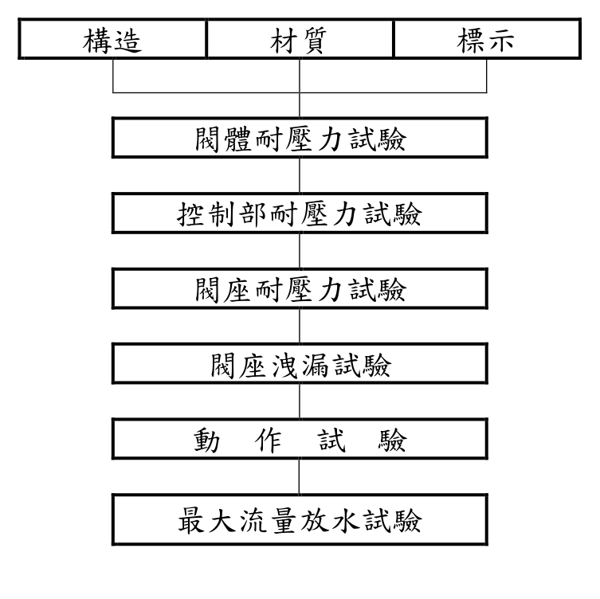

> 📷 截自原始 PDF 第 13 頁（內文頁 10）。

### 二、型式試驗結果之判定

（一）符合本認可基準所規定之技術規範，未發現缺點者，則型式試驗結果為「合格」。

（二）符合下述三、補正試驗所揭示之事項者，得進行補正試驗一次。

（三）不符本認可基準所規定之技術規範，試驗結果發現不合格情形者，則該型式試驗結果為「不合格」。

### 三、補正試驗

型式試驗判定結果如與下表（表十三）所列得進行補正試驗之缺點項目內容相符，得進行補正試驗一次，其試驗方法及樣品數依本認可基準之型式試驗方法進行。

#### 表十三　得進行補正試驗之缺點內容

| 試驗項目 | 缺點內容 |
|---|---|
| 標示及申請書方面 | 1. 標示脫落、誤記、無法判別。 2. 申請文件不完全（誤記、記載不全等輕微錯誤，不包含設計錯誤）。 |
| 構造方面 | 1. 凸緣部的尺寸和標準尺寸不符。 2. 接續螺紋的尺寸和標準尺寸不符。 |

### 四、型式變更試驗之方法

型式變更試驗之樣品數、試驗流程比照型式試驗，並依據型式變更內容進行型式變更試驗。

### 五、型式變更試驗範圍

有關一齊開放閥之型式變更範圍如下：

（一）零組件之性能、構造或材質。

（二）控制部與一次側之投影面積承受壓力比值。

（三）最大流量放水。

（四）使用壓力範圍。

### 六、型式試驗結果之填載

有關上述型式試驗、補正試驗、型式變更試驗之結果，應詳細填載於型式試驗紀錄表（如附表八）。

---

## 參、個別認可作業

### 一、個別認可之抽樣方法

（一）個別認可之抽樣試驗數量依附表一至附表五之抽樣表規定，抽樣方法依 CNS 9042 規定辦理。

（二）抽樣試驗之分等依程度分為寬鬆試驗、普通試驗、嚴格試驗及最嚴格試驗四種。

### 二、個別認可之試驗項目

（一）個別試驗通常將試驗項目分為一般樣品之試驗（以下稱為「一般試驗」）及分項樣品之試驗（以下稱為「分項試驗」）。

（二）試驗項目及樣品數：一般試驗及分項試驗之試驗項目及其所需樣品數如下表（表十四）所列。

#### 表十四　個別認可試驗項目及樣品數

| 區分 | 試驗項目 | 備註 |
|---|---|---|
| 一般試驗 | 構造、材質、標示 | 樣品數：依據附表一至附表五之各式試驗抽樣表抽取。 |
| 分項試驗 | 耐壓力（閥體、控制部、閥座、閥座洩漏）、性能（動作） | 同上 |

（三）試驗流程

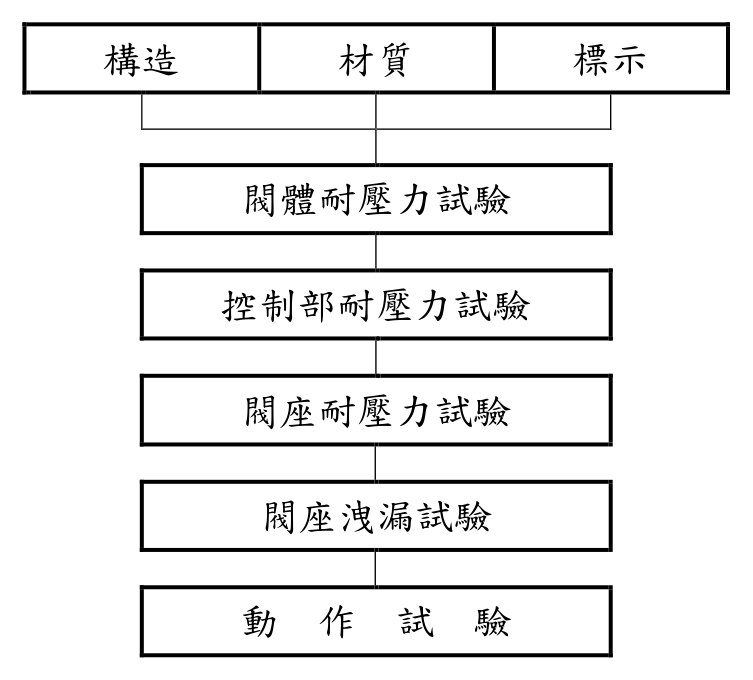

> 📷 截自原始 PDF 第 16 頁（內文頁 13）。

（四）試驗方法：試驗方法除依本基準壹、技術規範及試驗方法之外，其尺度檢查亦依照本基準之規定進行。

### 三、批次之判定基準

個別認可中之受驗批次判定如下：

（一）受驗品按各不同受驗廠商，依其試驗等級之區分列為同一批次。

1. 加壓型之閥體構造、控制部等主要構造及標稱壓力相同之樣品。
2. 減壓型之閥體構造、控制部等主要構造及標稱壓力相同之樣品。

（二）新產品與已受驗之型式不同項目僅有下表（表十五）所示項目者，自第一次受驗開始即可列為同一批次；如其不同項目非下表（表十五）所示項目，惟經過連續 10 批次普通試驗，且均於第一次即合格者，得列入已受驗合格之批次。

#### 表十五　得列為同一批次之不同項目

| 項次 | 項目名稱 |
|---|---|
| 1 | 本體及其主要零件之材質 |
| 2 | 控制部使用之電源規格 |
| 3 | 最大流量 |
| 4 | 使用壓力範圍 |
| 5 | 凸緣規格 |

（三）以每批次為單位，將試驗結果登記在個別認可申請表、個別認可試驗記錄表（如附表九）中，將一併處理之型式號碼以記號等方式紀錄於備註欄之中。

（四）申請者不得指定將某部分產品列為同一批次。

### 四、缺點之分級及合格判定基準

依下列規定區分缺點及合格判定基準（AQL）。

（一）試驗中發現之缺點，其嚴重程度依「消防機具器材及設備認可作業要點」規定，區分為致命缺點、嚴重缺點、一般缺點及輕微缺點等四級。

（二）各試驗項目之缺點內容，依本基準肆、缺點判定方法規定，非屬該判定方法所列範圍內之缺點者，依「消防機具器材及設備認可作業要點」之分級原則判定。

### 五、批次合格之判定

批次合格與否，依抽樣表，按下列規定判定之：抽樣表中，Ac 表示合格判定個數（合格判定時不良品數之上限），Re 表示不合格判定個數（不合格判定之不良品數之下限），具有二個等級以上缺點之樣品，應分別計算其各不良品之數量。

（一）抽樣試驗中，各級不良品數均於合格判定個數以下時，應依試驗等級之調整所列之試驗嚴寬度為條件更換其試驗等級，且視該批次為合格。

（二）抽樣試驗中，任一級之不良品數在不合格判定個數以上時，視該批為不合格，但該等不良品之缺點僅為輕微缺點時，得進行補正試驗，惟以一次為限。

（三）抽樣試驗中出現致命缺點之不良品時，即使該抽樣試驗中不良品數在合格判定個數以下，該批仍視為不合格。

### 六、個別認可結果之處置

（一）合格批次之處置

1. 整批雖經判定為合格，但受驗樣品中如發現有不良品時，仍應使用預備品替換或修復之後方可視為合格品。
2. 即使為非受驗之樣品，如於整批受驗樣品中發現有缺點者，準依前款之規定。
3. 上述 1、2 兩款情形，如無預備品替換或無法修復調整者，應就其不良品部分之個數，判定為不合格。

（二）補正批次之處置

1. 接受補正試驗時，應提出第一次試驗時所發現不良事項之改善說明書及不良品處理之補正試驗用廠內試驗紀錄表。
2. 補正試驗之受驗樣品數以第一次試驗之受驗樣品數為準。但該批次樣品經補正試驗合格，依本基準參、六、（一）、1. 之處置後，仍未達受驗樣品數之個數時，則視為不合格。

（三）不合格批次之處置

1. 不合格批次之產品接受再試驗時，應提出第一次試驗時所發現不良事項之改善說明書及不良品處理之補正試驗用廠內試驗紀錄表。
2. 接受再試驗時不得加入第一次受驗樣品以外之樣品。
3. 個別認可不合格之批次不再受驗時，應在補正試驗用廠內試驗紀錄表中，註明理由、廢棄處理及下批之改善處理等文件，向辦理試驗單位提出。

### 七、試驗嚴寬度等級之調整

（一）首次申請個別認可，其試驗等級以普通試驗為之，其後之試驗調整，則依下表（表十六）之規定。

#### 表十六　試驗嚴寬度等級之調整

| 寬鬆試驗 | 普通試驗 | 嚴格試驗 | 最嚴格試驗 |
|---|---|---|---|
| 有下列情形之一時，自下一批次試驗應調整為普通試驗。 1. 一批次在第一次試驗即不合格者。 2. 一批次在第一次試驗為附帶條件合格者。所謂附帶條件合格者為寬鬆試驗時，樣品當中之不合格個數超過合格判定個數（Ac）未達不合格判定個數（Re）該批次判定為合格者。 3. 生產不規則或是停滯（適用寬鬆試驗者受驗間隔約在六個月以上者） | 一、符合下列情形之一，自下一批次試驗應調整為嚴格試驗。 1. 第一次試驗時該批次為不合格，且將該批次連同前 4 批次連續共 5 批次之不合格品總數累計，如達附表 6 所示嚴格試驗之界限數以上者。該累計樣品數，以一般試驗之缺點分級所得結果為之。當適用普通試驗之批次數未達 5 批次時，發生某批次第一次試驗即不合格之情形，將適用普通試驗之不合格品總數累計，達嚴格試驗之界限數值以上者。具有致命缺點之產品，則計入嚴重缺點不合格品之數量。 2. 第一次試驗時，因致命缺點而不合格者。 二、符合下列全部條件時，下一批次試驗可調整為寬鬆試驗。 1. 最近連續 10 批次接受普通試驗，第一次試驗均合格者。但是使用附表 5（適用生產數量少之普通試驗抽樣表）者則為 15 批次。 2. 從最近連續 10 批次中（符合前項但書者為 15 批次）抽樣之不合格品總數在附表 7 之寬鬆試驗界限數以下者。此時之累計比較以一般試驗為之。 3. 生產穩定者。 | 一、符合下列規定時，自下一批次試驗應調整為最嚴格試驗。 1. 適用嚴格試驗者，第一次試驗中不合格批次數累計達 3 批次時，應對申請者提出改善措施之勸導，並中止試驗。 2. 勸導後，經確認申請者已有品質改善措施時，下批次之試驗以最嚴格試驗進行。 二、連續五批次均於第一次試驗即合格，則下次試驗得轉換成普通試驗。 | 一、連續五批次之第一次試驗即合格，則下一批次試驗得轉換成嚴格試驗。 |

> 註：原件之試驗嚴寬度等級調整表與缺點判定表均編為「表十六」，且無表十、表十一及表十七，非本檔誤植或漏收。

（二）有關補正試驗及再試驗批次之試驗分等，第一次試驗為寬鬆試驗者，以普通試驗為之；第一次試驗為普通試驗者，以嚴格試驗試驗之；第一次試驗為嚴格試驗者，以最嚴格試驗為之。再試驗批次之試驗結果，不得計入試驗寬鬆度轉換紀錄中。

### 八、下一批次試驗之限制

個別認可要進行下一批次試驗時，需在上一批次個別認可試驗結束且試驗結果處理完成後，才能進行下一批次之個別認可。

### 九、試驗之特例

有下列二項情形時，得在受理個別認可申請前，依預定之試驗日程進行試驗。

（一）第一次試驗因嚴重缺點或一般缺點不合格者。

（二）申請批次中可易於將不良品之零件更換、去除或修正者。

### 十、試驗設備發生故障時之處置

試驗開始後因試驗設備發生故障或其他原因致無法立即修復，經確認當日無法完成試驗時，則中止該試驗。並俟接獲試驗設備完成改善之通知後，重新排定時間，進行試驗時，抽樣標準同第一次試驗，但該狀況不適用補正試驗。

### 十一、其他

個別認可時，若發現受驗樣品有其他不良事項，經認定該產品之抽樣標準及個別認可方法不適當時，得另訂個別認可方法及抽樣標準。

---

## 肆、缺點判定方法

各項試驗所發現之不合格情形，其缺點之等級依「缺點判定表」之規定判定，分為致命缺點、嚴重缺點、一般缺點及輕微缺點四級，涵蓋基本構造、外觀、構造及性能（尺度）、材質、標示、耐壓、動作、最大流量放水等試驗項目。

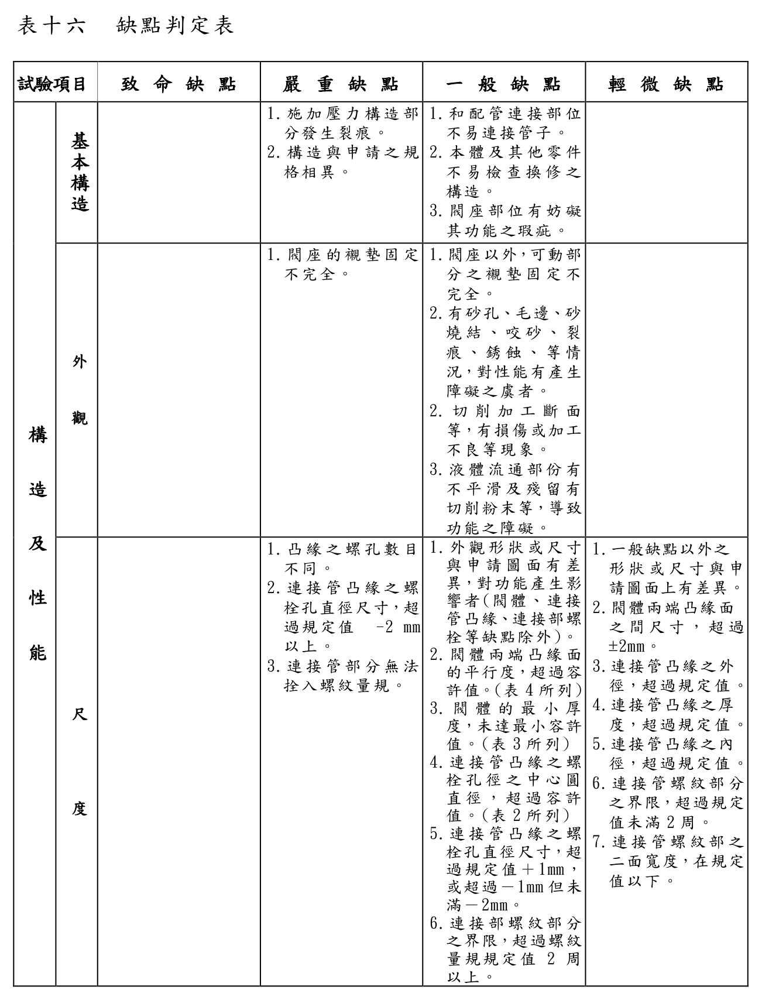

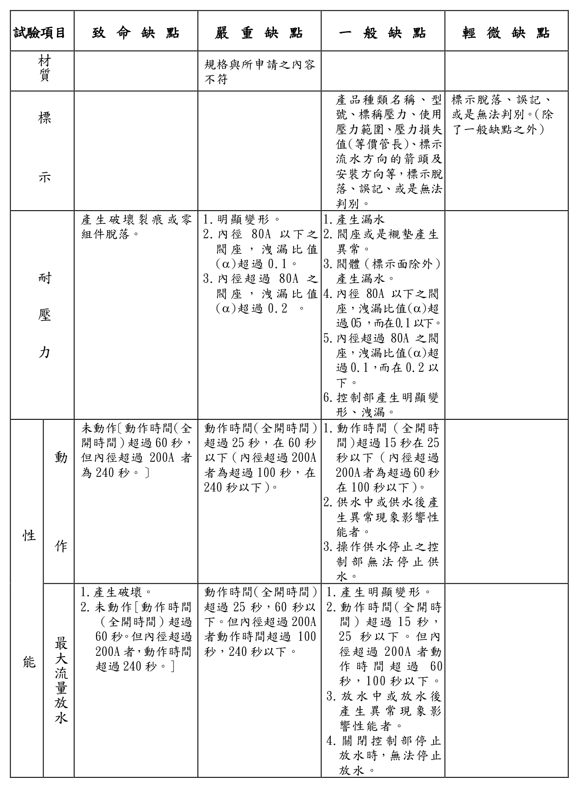

> 📷 截自原始 PDF 第 21～22 頁（內文頁 18～19）。重點門檻（常考者）摘錄：
> - **動作試驗**：未動作（全開時間超過 60 秒；內徑＞200A 者為 240 秒）＝嚴重缺點；全開時間超過 25 秒在 60 秒以下（內徑＞200A 者超過 100 秒在 240 秒以下）＝一般缺點；全開時間超過 15 秒在 25 秒以下（內徑＞200A 者超過 60 秒在 100 秒以下）＝輕微缺點。
> - **閥座洩漏**：內徑 80A 以下洩漏比超過 0.1、內徑超過 80A 洩漏比超過 0.2 ＝一般缺點；80A 以下洩漏比超過 0.05 在 0.1 以下、超過 80A 洩漏比超過 0.1 在 0.2 以下 ＝輕微缺點。

---

## 伍、主要試驗設備

本基準各項試驗設備依表十八所列設置，未列示之設備亦需經評鑑核可後准用之。

#### 表十八　主要試驗設備

| 項目 | 規格 | 數量 |
|---|---|---|
| 抽樣表 | 本基準附表一至附表七之規定 | 1 份 |
| 亂數表 | CNS 9042 | 1 份 |
| 計算器 | 8 位數以上工程用電子計算器 | 1 只 |
| 放大鏡 | 8 倍左右 | 1 個 |
| 加壓送水裝置 | 壓力 10 kgf/cm²，流量 1,000 l/min | 1 組 |
| 動作試驗裝置－控制輸入用放水口 | 如附圖二所示 | 1 組 |
| 動作試驗裝置－流量測定用放水口 | 如附圖二所示 | 1 組 |
| 動作試驗裝置－壓力計 | 最高刻度為試驗壓力的 1.5 倍，最小刻度 0.02 kgf/cm² | 1 組 |
| 刻度吸量管 | 最小刻度 0.01 ml（口徑 80A 以下，容量 1 ml）／0.02 ml（口徑超過 80A，容量 2 或 3 ml） | 1 組 |
| 耐壓力試驗裝置 | 能夠施以該一齊開放閥之耐壓力試驗壓力之 1.5 倍以上 | 1 組 |
| 碼錶 | 1 分計，附計算功能，精密度 1/10 至 1/100 sec | 2 個 |
| 尺寸測量器－游標卡尺 | 測定範圍 0 至 150 mm，精密度 1/50 mm，1 級品 | 1 個 |
| 尺寸測量器－螺紋量規 | 推拔螺紋用 PT 1/2、3/4 | 1 個 |
| 尺寸測量器－分離卡 | 測定範圍 0 至 25 mm，最小刻度 0.1 mm，精密度 ±0.005 mm | 1 個 |
| 尺寸測量器－深度量規 | 指示盤之精度：小圓分 10 格每格 0.01 mm，大圓分 100 格每格 0.1 mm | 1 個 |
| 尺寸測量器－直尺 | 測定範圍 1 至 30 cm，最小刻度 1 mm | 1 個 |
| 尺寸測量器－卷尺(布尺) | 測定範圍 1-5 m，最小刻度 1 mm | 1 個 |
| 內視鏡 | 能夠檢查裝置內部者 | 1 個 |
| 溫度計 | 0℃ 至 50℃，最小刻度 1℃ | 1 個 |
| 標準壓力計 | 測定範圍 0 kgf/cm² 至 35 kgf/cm² | 1 個 |

---

## 附表

> 附表一至附表五（抽樣表）之備註：Ac 為合格判定個數；Re 為不合格判定個數；↓ 表採用箭頭下方第一個抽樣方式（如樣品數超過批內數量時則採全試驗）；↑ 表採用箭頭上方第一個抽樣方式。

### 附表一　普通試驗抽樣表

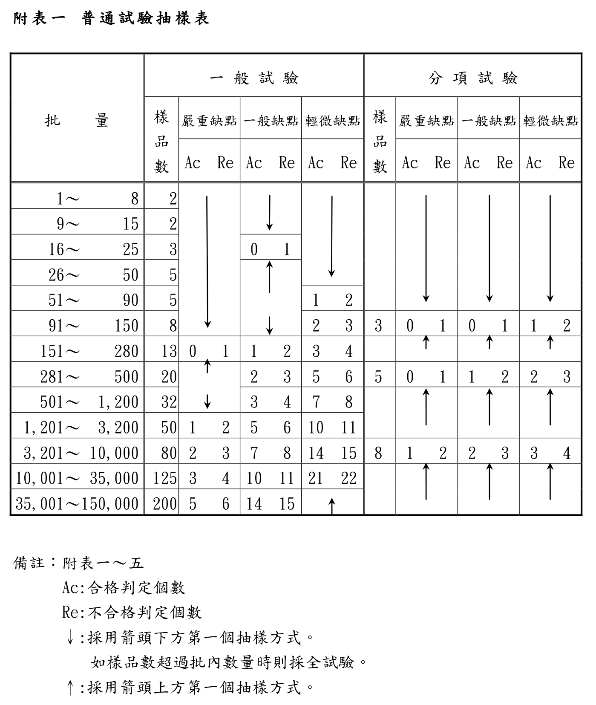

> 📷 截自原始 PDF 第 24 頁（內文頁 21）。判定個數請以原始 PDF 核對。

### 附表二　寬鬆試驗抽樣表

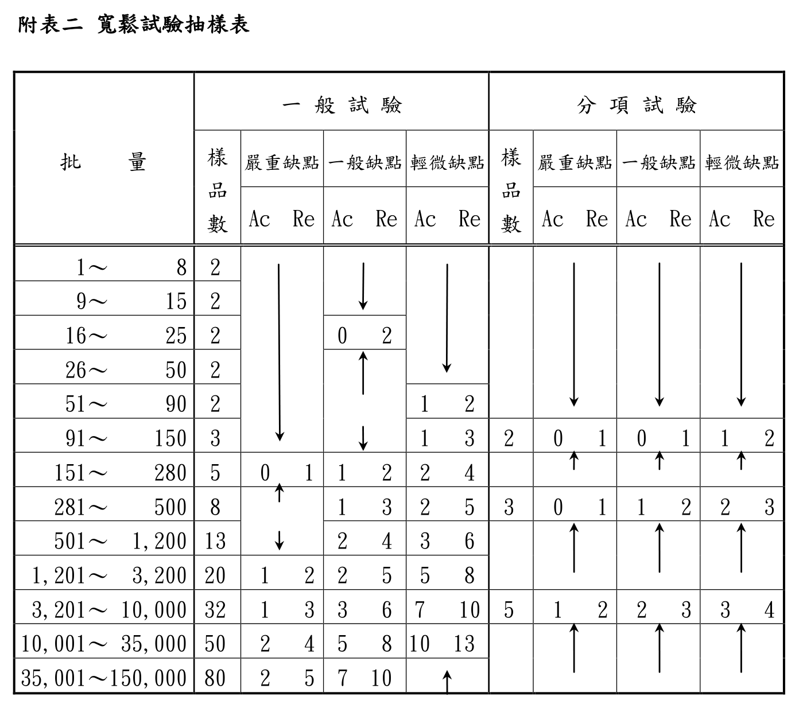

> 📷 截自原始 PDF 第 25 頁（內文頁 22）。判定個數請以原始 PDF 核對。

### 附表三　嚴格試驗抽樣表

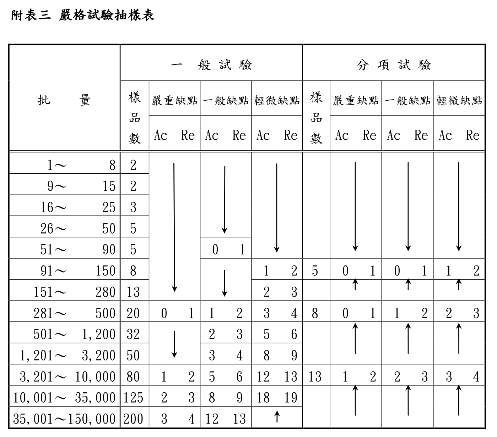

> 📷 截自原始 PDF 第 26 頁（內文頁 23）。判定個數請以原始 PDF 核對。

### 附表四　最嚴格試驗抽樣表

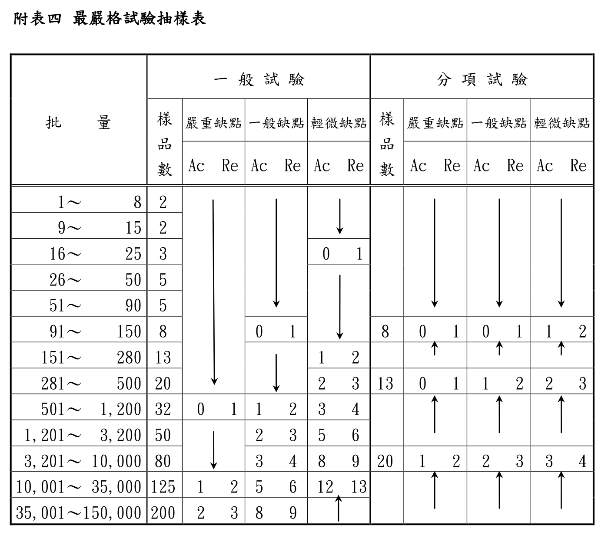

> 📷 截自原始 PDF 第 27 頁（內文頁 24）。判定個數請以原始 PDF 核對。

### 附表五　適用生產數量少之普通試驗抽樣表

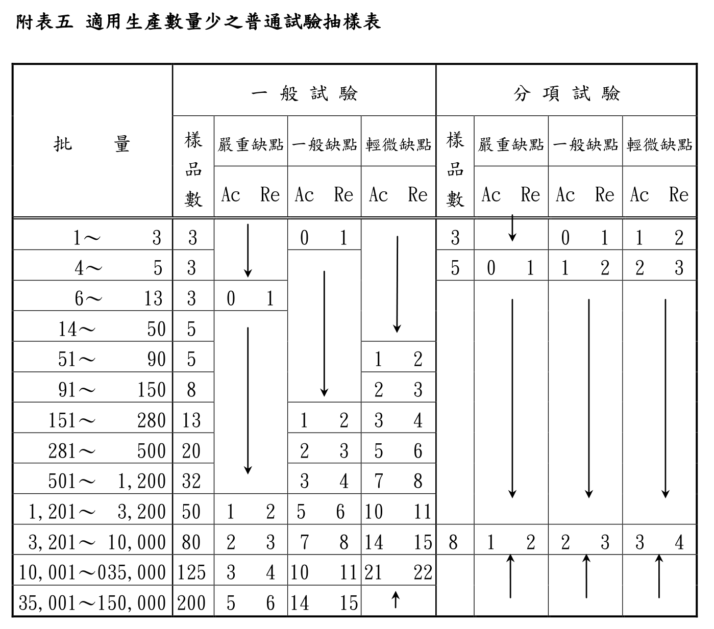

> 📷 截自原始 PDF 第 28 頁（內文頁 25）。判定個數請以原始 PDF 核對。

### 附表六　嚴格試驗之界限數

| 累計樣品數 | 嚴重缺點 | 一般缺點 | 輕微缺點 |
|---|---|---|---|
| 1 | 2 | 2 | 2 |
| 2 | 2 | 2 | 3 |
| 3 | 2 | 3 | 3 |
| 4 | 2 | 3 | 4 |
| 5 | 2 | 3 | 4 |
| 6〜7 | 2 | 3 | 4 |
| 8〜9 | 2 | 3 | 5 |
| 10〜12 | 2 | 4 | 5 |
| 13〜14 | 3 | 4 | 6 |
| 15〜19 | 3 | 4 | 7 |
| 20〜24 | 3 | 5 | 7 |
| 25〜29 | 3 | 5 | 8 |
| 30〜39 | 3 | 6 | 10 |
| 40〜49 | 4 | 7 | 11 |
| 50〜64 | 4 | 7 | 13 |
| 65〜79 | 4 | 8 | 15 |
| 80〜99 | 5 | 10 | 17 |
| 100〜129 | 5 | 11 | 20 |
| 130〜159 | 6 | 13 | 24 |
| 160〜199 | 7 | 15 | 28 |
| 200〜249 | 7 | 17 | 33 |
| 250〜319 | 8 | 20 | 40 |
| 320〜399 | 10 | 24 | 48 |
| 400〜499 | 11 | 28 | 60 |
| 500〜624 | 13 | 33 | 76 |
| 625〜799 | 15 | 40 | 95 |

### 附表七　寬鬆試驗之界限數

> ＊表示樣品累計數未達轉換成寬鬆試驗之充分條件。本表適用於最近連續十批次接受普通試驗，第一次試驗時均合格者之樣品數累計。

| 累計樣品數 | 嚴重缺點 | 一般缺點 | 輕微缺點 |
|---|---|---|---|
| 10〜64 | ＊ | ＊ | ＊ |
| 65〜79 | ＊ | ＊ | 0 |
| 80〜99 | ＊ | ＊ | 1 |
| 100〜129 | ＊ | ＊ | 2 |
| 130〜159 | ＊ | ＊ | 4 |
| 160〜199 | ＊ | 0 | 6 |
| 200〜249 | ＊ | 1 | 9 |
| 250〜319 | ＊ | 2 | 12 |
| 320〜399 | ＊ | 4 | 15 |
| 400〜499 | ＊ | 6 | 19 |
| 500〜624 | ＊ | 9 | 25 |
| 625〜799 | 0 | 12 | 31 |
| 800〜999 | 1 | 15 | 39 |
| 1000〜1,249 | 2 | 19 | 50 |
| 1250〜1,574 | 4 | 25 | 63 |

### 附表八　一齊開放閥型式試驗紀錄表

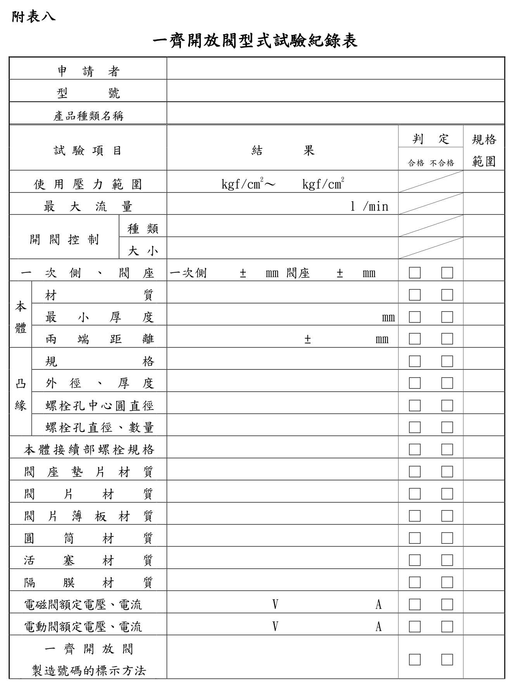

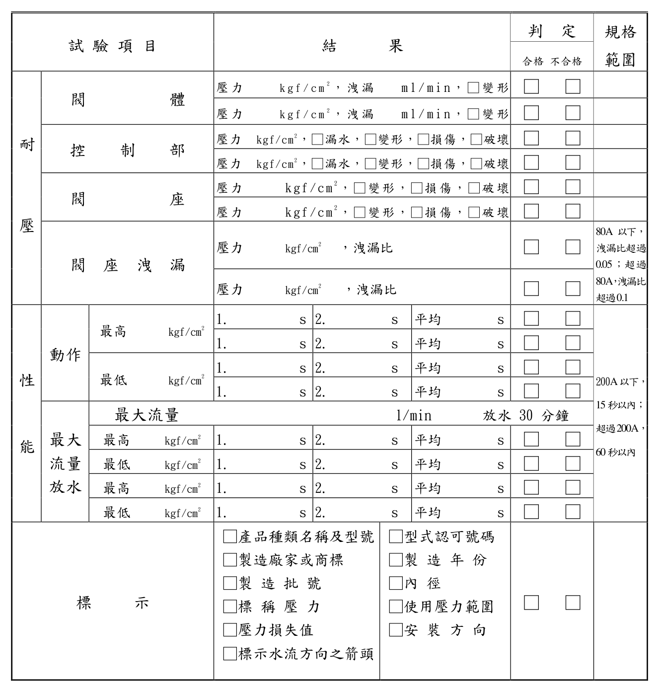

> 📷 截自原始 PDF 第 31～32 頁（內文頁 28～29）。

### 附表九　一齊開放閥個別認可試驗紀錄表

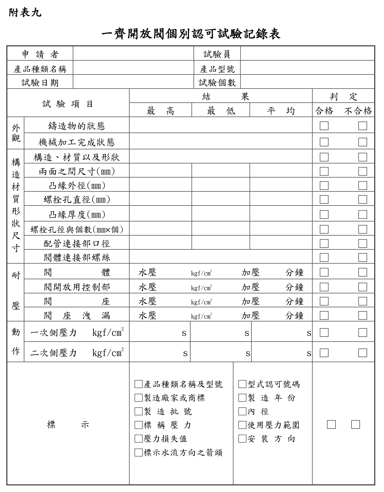

> 📷 截自原始 PDF 第 33 頁（內文頁 30）。

### 附圖二　一齊開放閥試驗裝置

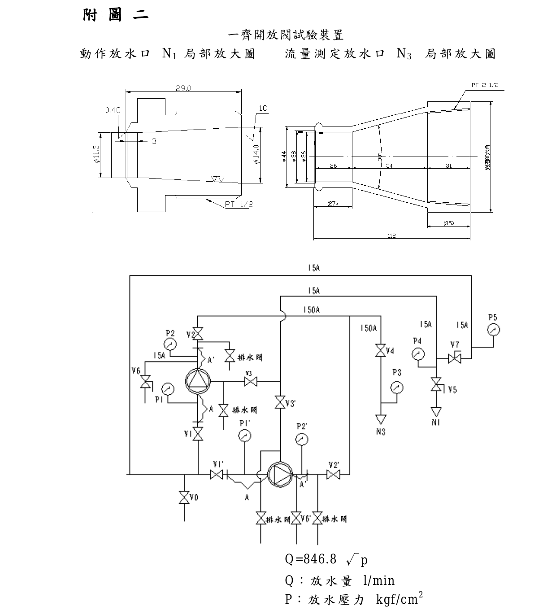

> 📷 截自原始 PDF 第 35 頁（內文頁 32）。

附圖二（一齊開放閥試驗裝置）之流量測定放水口放水量計算式：

$$Q = 846.8\sqrt{P}$$

- $Q$：放水量（l/min）
- $P$：放水壓力（kgf/cm²）

---

## 附表／附圖（附件）

- 附表一至附表五（抽樣表）、附表八（型式試驗紀錄表）、附表九（個別認可試驗紀錄表）、缺點判定表、型式試驗流程圖、個別認可試驗流程圖、附圖一（一齊開放閥圖例）及附圖二（試驗裝置圖）均已以原始 PDF 截圖嵌入本文相應位置。原始檔：
- 📎 [一齊開放閥認可基準（108.12.05）.pdf](../原始檔案/一齊開放閥認可基準/一齊開放閥認可基準（108.12.05）.pdf)
