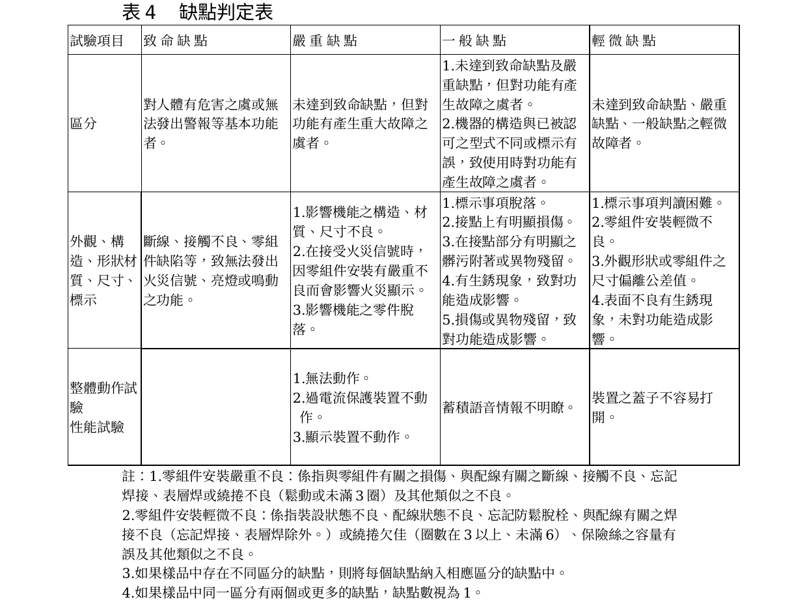

# 119 火災通報裝置認可基準

> 來源：內政部消防署｜版本日期：民國 109 年 04 月 17 日
>
> ⚠️ **法規快照**：本檔為入庫當下之版本，引用前請依 index.md「法規時效」核對官方現行版本。
>
> 📌 **免責聲明**：本檔內容部分為 PDF／影像 OCR 與人工整理之結果，可能有辨識誤差。**一切以主管機關（內政部消防署）公告之現行版本為準**；如有疑義，以官方公告為主。後續 AI 代理人引用本檔時應主動提醒使用者此點，並於必要時自行上網查證正確版本。
>
> 🛈 本檔由原始 ODT（content.xml）擷取並人工整理。依三層表格原則：散文與簡單表格已內嵌 markdown；缺點判定表（表 4）以原始 ODT 轉檔截圖嵌入原文位置；附表 1～4 抽樣表、附表 5/6 界限數及紀錄表（附表 7~10）原 ODT 內文未含表格內容（屬另頁／表單），僅附文末原始檔連結。關鍵頻率／電源數值以行內標註。

---

## 壹、技術規範及試驗方法

### 一、適用範圍

火災發生時，為能將火災訊息即時通報至當地消防機關，有關 119 火災通報裝置之技術規範及試驗方法等，應符合本基準之規定。

### 二、用語定義

（一）**119 火災通報裝置**：指火災發生時，藉由操作手動啟動裝置或火警自動警報設備之連動啟動功能，透過公眾交換電話網路與消防機關連通，以蓄積語音進行通報，並可進行通話之裝置。

（二）**手動啟動裝置**：指火災通報專用之按鈕、通話裝置、遠端啟動裝置等。

（三）**蓄積語音**：預先錄製語音訊息供火災通報時傳達訊息。

（四）**通報信號音**：顯示係由 119 火災通報裝置所發出通報之音響。

（五）**連動啟動功能**：指 119 火災通報裝置透過火警自動警報設備的探測器動作而啟動，並向消防機關發出通報。

### 三、外觀、構造、形狀、材質及尺寸試驗

（一）撥號信號（119）以複頻撥號方式發出信號。

（二）在發出撥號信號並偵測應答後，蓄積語音應能自動送出，且蓄積語音需為自始播放之模式。

（三）蓄積語音應依下列規定：

1. 由通報信號音與自動語音所組成。
2. 自動語音應符合下列規定：
   - （1）透過操作手動啟動裝置，其自動語音訊息應包括火災表示、建築物所在地址、建築物名稱、聯絡電話及結尾語（確認後請掛斷回撥）等相關內容。
   - （2）透過連動啟動功能，其自動語音訊息應表示火警自動警報設備啟動、建築物所在地址、建築物名稱、聯絡電話及結尾語（確認後請掛斷回撥）等相關內容。
3. 蓄積語音訊息應儲存於適當之記憶體中。

（四）應有禁止通報時撥接電話之措施。

（五）119 火災通報裝置不得設有足以影響火災通報功能之附屬裝置。

（六）監視常用電源之裝置應設於明顯易見之位置。

（七）電源回路應設置適當之過電流保護裝置。

（八）**預備電源**應依下列規定：

1. 當常用電源停電，持續 60 分鐘待機狀態後，需保有 10 分鐘以上可進行火災通報之電源容量。
2. 預備電源應為密閉型蓄電池。

（九）額定電壓超過 60V 以上之金屬製外箱，應設接地端子。

（十）119 火災通報裝置之通信介面、電磁相容及電氣安全應符合國家通訊傳播委員會所訂「公眾交換電話網路終端設備技術規範」，並經審驗合格。

（十一）應以申請圖面（含廠內試驗紀錄表）確認下列項目：

1. 主要電壓、消耗電流、絕緣阻抗、連續動作溫度上升之設計值及測定值。
2. 易腐蝕材料之防蝕、零件裝置、配線材料、連接部、充電部及絕緣材料等。
3. 手動啟動裝置動作時以中文字幕或國語音效顯示。
4. 手動啟動裝置之防止誤操作裝置。
5. 蓄積語音儲存時間。
6. 預備電源容量。
7. 信號音。
8. 蓄積語音訊息之儲存記憶體種類。
9. 附屬裝置。
10. 外觀、構造、形狀、材質及尺寸應與申請圖面相符。
11. 電源被拔除之防止措施。

### 四、整體動作試驗

開啟電源開關後，操作手動啟動裝置，確認顯示及其動作情形。試驗時手動啟動裝置應可輕易確實操作且無動作異常情形。

### 五、性能試驗

性能試驗應視需要以 119 火災通報裝置模擬試驗裝置及模擬電話迴路確認。

#### （一）手動啟動裝置試驗

依申請圖面註記之方法操作手動啟動裝置，反覆操作 10 次以上，確認可送出撥號信號。撥號信號應立即送出，且需有完成動作時之顯示。

#### （二）電話迴路切換試驗

連接 119 火災通報裝置之電話迴路通話時，操作手動啟動裝置，應可捕捉到模擬電話迴路並強制切換至發信狀態。

#### （三）優先通報試驗

操作手動啟動裝置時確認模擬消防機關為第一順位之通報對象。

#### （四）蓄積語音訊息試驗

1. 透過操作手動啟動裝置，其通報信號音之基本頻率約為 **800 Hz±3% 之單音，連續 3 音並重複 2 次**。
2. 透過連動啟動功能，其通報信號音之基本頻率為 **440 Hz 以上之單音，連續 2 音並重複 2 次**（第二音的頻率約為第一音頻率的六分之五，即 $f_2 \approx \frac{5}{6}f_1$）。
3. 自動語音訊息的內容應清楚明瞭且為電子迴路所合成之女聲發音。
4. 每一區段之蓄積語音應在 **30 秒以內**，蓄積語音訊息應於模擬消防機關應答時即行開始。

#### （五）蓄積語音等訊息送出試驗

在揚聲器前方 50 公分位置確認模擬電話迴路送出時的撥號信號音、蓄積語音訊息及回撥信號音。測試時聲音應明瞭且清晰。

#### （六）再撥號試驗

於模擬消防機關通話時，確認可自動重新撥號。重新撥號時需持續且確實動作。

#### （七）通話功能及回撥應答試驗

1. 每一區段之蓄積語音訊息應持續重複送出，直到模擬消防機關操作送出回撥信號。
2. 模擬消防機關操作送出回撥信號時，需可正確偵測回撥信號，確認受信時可以音效表示。
3. 確認對於前項之確認回撥的應答，應可進行清晰通話。
4. 20 秒內未收到回撥信號，應可重複進行撥號。
5. 在蓄積語音訊息送出時，以手動操作，確認可迅速切換到通話狀態，並可清晰通話。

#### （八）火災通報功能影響試驗

如具火災通報以外之功能，應確認該功能動作時不會對火災通報功能造成有害之影響。

#### （九）預備電源切換試驗

重複操作 3 次，確認常用電源的回路切斷時自動切換為預備電源、及常用電源復歸時能自動切回常用電源。

#### （十）電壓變動試驗

常用電源應在額定電壓的 **90﹪及 110﹪之間**，預備電源應在 **85﹪及 110﹪之間**，確認 119 火災通報裝置動作。

#### （十一）撥號信號等送出試驗（單機功能）

當無電話迴路時，確認撥號信號的送出及蓄積語音訊息可清楚顯示，且單機功能不影響其他功能。

#### （十二）手動啟動裝置優先機能試驗

連動啟動使蓄積語音送出時，操作手動啟動裝置後確認狀況。因連動啟動將一區段蓄積語音送出後，應能再送出蓄積語音。

### 六、附屬裝置試驗

裝置之連動啟動功能，其檢查與判定方法皆參照第五點之性能試驗進行確認，不會影響 119 火災通報裝置本體之火災通報功能。

### 七、標示檢查

（一）應於本體上之明顯易見處，以不易磨滅之方法，標示下列事項（進口產品亦需以中文標示）：

1. 裝置名稱及型號
2. 製造廠商名稱或商標
3. 製造年月
4. 額定電壓（V）
5. 預備電源的廠牌、種類、電壓、容量
6. 操作方法概要及注意事項
7. 國家通訊傳播委員會審驗合格標籤
8. 型式認可號碼
9. 119 火災通報裝置各操作部分名稱及操作內容
10. 產地

前 1~10 項應於明顯易見處以不易磨滅之印刷、刻印或不易取下之銘板標示，標示內容須與申請圖面符合。

（二）檢附操作說明書及符合下列事項：

1. 應附有簡明清晰之安裝、接線及操作說明，並提供圖解輔助說明。
2. 包括產品安裝、接線及操作之詳細注意事項及資料。同一容器裝有數個同型產品時，至少應有一份安裝及操作說明書。
3. 詳述其檢查及測試之程序及步驟。
4. 其他特殊注意事項（特別是安全注意事項）。

### 八、119 火災通報裝置之新技術開發

119 火災通報裝置之新技術開發，其形狀、構造及性能判定，如符合本基準規定及同等以上性能，並經中央消防主管機關認定確實可於火災發生時向消防機關發出火災通報，得不受本基準之規範。

---

## 貳、型式認可作業

### 一、型式試驗之方法

（一）119 火災通報裝置及其搭配之遠端啟動裝置樣品數如附表 8 所示。

（二）試驗項目及流程如下：1. 外觀、構造、形狀、材質及尺寸試驗 → 2. 整體動作試驗 → 3. 性能試驗 → 4. 附屬裝置試驗 → 5. 標示檢查。

### 二、型式試驗結果之判定

（一）符合本認可基準所規定之技術規範，未發現缺點者，型式試驗結果為「合格」。

（二）符合下述三、補正試驗所揭示之事項者，得進行補正試驗一次。

（三）不符本認可基準所規定之技術規範，發現不合格情形者，型式試驗結果為「不合格」。

### 三、補正試驗

（一）型式試驗中構造檢查不良事項，如為本認可基準肆、缺點判定方法之表 4 缺點判定表所列輕微缺點者，得進行補正試驗一次。

（二）補正試驗所需樣品數如附表 8 所示，並依本認可基準之型式試驗方法進行。

### 四、型式變更試驗之方法

型式變更試驗之樣品數、試驗流程等，應就型式變更之內容依本認可基準之型式試驗方法進行。

### 五、試驗紀錄

有關上述型式試驗、補正試驗、型式變更試驗之結果，應詳細填載於型式試驗記錄表（如附表 9）。

### 六、型式區分、型式變更及輕微變更範圍

#### 表 1　型式區分、型式變更及輕微變更範圍

| 區分 | 說明 | 項目 |
|---|---|---|
| 型式區分 | 主要性能、設備種類、動作原理不同，或經中央主管機關規定之必要區分者，須以單一型式認可做區分。 | 外殼形狀；電路設計 |
| 型式變更 | 型式部分變更，有影響性能之虞，須施予試驗確認者。 | 手動啟動裝置之變更；監視方式之變更；主電源種類之變更；預備電源之變更；會影響主功能之附屬裝置之追加或變更；會影響主功能之部分零件、材料、尺寸 |
| 輕微變更 | 型式部分變更，不影響性能，免施試驗，可藉書面判定者。 | 1. 不影響性能之構造、材質、尺寸變更；2. 標示事項內容之變更；3. 變更同等規格之認可之零件或同等以上者 |

### 七、型式認可之基本設計資料

（一）構造、零件裝置名稱、尺寸及材質等：1. 記載尺寸、名稱之完成圖說；2. 尺寸、名稱（CNS 規定之材質、符號）；3. 電器回路圖；4. 構件組合圖；5. 應標示事項的內容、標示位置；6. 使用方法、操作注意事項等；7. 保養、檢查要領說明書。

（二）性能計算書：1. 蓄積語音儲存時間（每一區段蓄積語音秒數）；2. 預備電池容量（常用電源停電持續 60 分鐘待機後，需保有 10 分鐘以上可進行火災通報之電源容量）；3. 蓄積語音訊息（通報信號音與語音訊息內容）。

### 八、119 火災通報裝置明細表

如附表 7，應具備：（一）型號欄位記載申請的型號名稱；（二）功能欄記載基本元件資料；（三）電源電壓、容量欄記載常用電源及預備電源資料；（四）動作概要記載動作流程。

---

## 參、個別認可作業

### 一、個別認可之抽樣方法

（一）抽樣試驗數量依附表 1 至附表 4 之抽樣表規定，抽樣方法依 CNS 9042 規定辦理。

（二）抽樣試驗之分等依程度分為寬鬆試驗、普通試驗、嚴格試驗及最嚴格試驗四種。

### 二、個別認可之試驗項目

（一）試驗項目及樣品數如附表 8。（二）試驗方法依本基準規定。

### 三、批次之判定基準

（一）受驗品按各不同受驗廠商，依其試驗等級之區分列為同一批次。

（二）新產品與已受驗之型式不同項目僅有下表（表 2）所示項目者，自第一次受驗開始即可列為同一批次；如其不同項目非表 2 所示項目，惟經連續 10 批次普通試驗且均於第一次即合格者，得列入已受驗合格之批次。

#### 表 2　批次判定項目表

| 項次 | 項目名稱 |
|---|---|
| 1 | 經型式變更者 |
| 2 | 變更之內容在型式變更範圍內，且經型式變更認可者 |
| 3 | 受驗品相同但申請者不同者 |

（三）以每批次為單位，將試驗結果登記在個別認可申請表、個別認可試驗記錄表（如附表 10）中。

（四）申請者不得指定將某部分產品列為同一批次。

### 四、缺點之分級及合格判定基準

（一）試驗中發現之缺點，依「消防機具器材及設備認可標準」規定，區分為致命缺點、嚴重缺點、一般缺點及輕微缺點等四級。

（二）各試驗項目之缺點內容，依本基準肆、缺點判定方法規定；非屬該判定方法所列範圍內之缺點者，依「消防機具器材及設備認可標準」之分級原則判定。

### 五、批次合格之判定

Ac 表合格判定個數（不良品數之上限），Re 表不合格判定個數（不良品數之下限），具二個等級以上缺點之樣品分別計算各不良品數量。

（一）各級不良品數均於合格判定個數以下時，依試驗等級之調整更換試驗嚴寬度，視該批次為合格。

（二）任一級之不良品數在不合格判定個數以上時，視該批為不合格；但該等不良品之缺點僅為輕微缺點時，得進行補正試驗一次。

（三）出現致命缺點之不良品時，即使不良品數在合格判定個數以下，該批仍視為不合格。

### 六、個別認可結果之處置

（一）合格批次：發現不良品時應使用預備品替換或修復後方視為合格品；無預備品替換或無法修復者，就其不良品個數判定為不合格。

（二）補正批次：接受補正試驗時應提出改善說明書及補正試驗合格紀錄表；受驗樣品數以第一次試驗為準。

（三）不合格批次：接受再試驗時應提出改善說明書及補正試驗合格紀錄表，不得加入第一次受驗樣品以外之樣品；不再受驗時應備文說明理由、廢棄處理及下批改善處理。

### 七、試驗嚴寬度等級之調整

（一）首次申請以普通試驗為之，其後依表 3 轉換：

- **普通 → 寬鬆**：最近連續 10 批次接受普通試驗第一次均合格，且抽樣不合格品總數在附表 6 寬鬆試驗界限數以下。
- **寬鬆 → 普通**：一批次初次檢查即不合格、或初次檢查為附帶條件合格（不合格個數超過 Ac 未達 Re 而判為合格）、或生產不規則停滯（受驗間隔約六個月以上）。
- **普通 → 嚴格**：第一次試驗該批次不合格且連同前 4 批次共 5 批次之不合格品累計達附表 5 嚴格試驗界限數以上；或普通試驗批次未達 5 批次時發生某批次第一次即不合格而累計達界限數（致命缺點計入嚴重缺點數量）；或因致命缺點不合格。
- **嚴格 → 普通**：連續五批次第一次試驗即合格。
- **嚴格 → 最嚴格**：嚴格試驗第一次試驗中不合格批次累計達 3 批次時，提出改善勸導並中止試驗；勸導後確認已改善時，下次以最嚴格試驗進行。
- **最嚴格 → 嚴格**：連續五批次之第一次試驗即合格。

（二）補正試驗及再試驗批次之分等：第一次寬鬆者以普通、普通者以嚴格、嚴格者以最嚴格為之；再試驗結果不計入轉換紀錄。

### 八、下一批次試驗之限制

需在上一批次個別認可試驗結束且試驗結果處理完成後，才能進行下一批次之個別認可。

### 九、試驗設備發生故障時之處置

試驗開始後因設備故障致當日無法完成試驗時則中止；俟設備改善後重新排定時間試驗，抽樣標準同第一次試驗，但該狀況不適用補正試驗。

### 十、其他

個別認可時若發現受驗樣品有其他不良事項，經認定抽樣標準及個別認可方法不適當時，得由中央主管機關另定個別認可方法及抽樣標準。

---

## 肆、缺點判定方法

各項試驗所發現之不合格情形，其缺點之等級依表 4 規定判定，分為致命、嚴重、一般、輕微四級。

> 📷 截自原始 ODT 轉檔（LibreOffice→PDF）第 16 頁。重點摘錄：
> - 四級定義：致命＝對人體有危害之虞或無法發出警報等基本功能；嚴重＝對功能有重大故障之虞；一般＝對功能有故障之虞、或構造與認可型式不同／標示有誤致功能故障之虞；輕微＝前三者以外之輕微故障。
> - 外觀構造：斷線／接觸不良／零組件缺陷致無法發出火災信號、亮燈或鳴動 ＝致命；影響機能之構造材質尺寸不良、零件脫落 ＝嚴重；標示脫落、接點明顯損傷／髒污、生銹影響功能 ＝一般；標示判讀困難、零組件輕微安裝不良、尺寸偏離公差、表面生銹未影響功能 ＝輕微。
> - 整體動作／性能試驗：無法動作／過電流保護不動作／顯示裝置不動作 ＝嚴重；蓄積語音情報不明瞭 ＝一般；裝置蓋子不易打開 ＝輕微。
> - 註：繞捲不良（鬆動或未滿 3 圈）屬嚴重不良；繞捲欠佳（3 圈以上未滿 6 圈）屬輕微不良。

---

## 伍、主要試驗設備

#### 表 5　主要試驗設備

| 品名 | 規格 | 數量 |
|---|---|---|
| 抽樣表 | 本基準附表 1 至附表 4 之規定 | 1 式 |
| 亂數表 | CNS 9042 或本基準有關之規定 | 1 部 |
| 計算器 | 8 位數以上工程用電子計算器 | 1 個 |
| 溫濕度記錄器 | 一般市面上販售品 | 1 台 |
| 碼錶 | 解析度 1/100 sec | 1 個 |
| 尺寸測量器－游標卡尺 | 測定範圍 0 至 150 ㎜，最小刻度 1/100 ㎜ | 1 個 |
| 尺寸測量器－分釐卡 | 測定範圍 0 至 25 ㎜，最小刻度 1/100 ㎜ | 1 個 |
| 尺寸測量器－直尺 | 測定範圍 1 至 30 ㎝，最小刻度 1 ㎜ | 1 個 |
| 尺寸測量器－卷尺（布尺） | 測定範圍 1-15 m，最小刻度 1 cm | 1 個 |
| 試驗裝置 | 除能以電話迴路進行性能測試外，須具備可實際測試之模擬裝置（如模擬消防機關回撥功能） | 1 式 |
| 數位式電表 | 電流 0 至 30 mA 以上；電阻 0 至 20 MΩ 以上；電壓 0 至 1000V 以上 AC 或 DC | 1 台 |
| 試驗用電源裝置 | 可進行電壓變動試驗之裝置 | 1 台 |
| 頻譜分析儀 | 須能分析頻率範圍之裝置 | 1 台 |

---

## 附表／附圖（附件）

- 抽樣表（附表 1 普通／2 寬鬆／3 嚴格／4 最嚴格）、界限數（附表 5 嚴格／6 寬鬆）、產品明細表（附表 7）、試驗項目及數量（附表 8）、型式試驗紀錄表（附表 9）、個別試驗紀錄表（附表 10）等，原始 ODT 內文未含表格內容（屬另頁／表單），請對照原始檔：
- 📎 [119火災通報裝置認可基準規定內容.odt](../原始檔案/119火災通報裝置認可基準/119火災通報裝置認可基準規定內容.odt)
