# 泡沫噴頭認可基準

> 來源：內政部消防署｜版本日期：**民國 101 年 11 月 14 日訂定**
>
> 🛈 **與舊版之關係**：內政部消防署「消防法令查詢系統」另列有**民國 90 年 11 月 30 日訂定**之《泡沫噴頭認可基準》並標示為**已廢止**（頁面標題前冠「廢」）——該廢止版即為本版之前身，本檔所收為現行之 101-11-14 訂定版。**引用歷年考古題時務必留意此版本更替**：民國 101 年 11 月 14 日以前之試題，其標準答案係依已廢止之舊版命題，數值可能與本檔不同（實例見 [`index.md` 之 25% 還原時間說明](index.md#️-泡沫噴頭-25-還原時間題庫標準答案與兩份法源皆不一致引用此題務必先讀本節)）。
>
> ⚠️ **法規快照**：本檔為入庫當下之版本，引用前請核對官方現行版本。
>
> 📌 **免責聲明**：本檔內容為 PDF 轉換與人工整理之結果，可能有辨識誤差。**一切以主管機關（內政部消防署）公告之現行版本為準**；如有疑義，以官方公告為主。後續 AI 代理人引用本檔時應主動提醒使用者此點，並於必要時自行上網查證正確版本。
>
> 🛈 本檔由 PDF（`pdftotext -layout`）轉換並人工整理。依三層表格原則：散文與簡單數值表（表 1～表 14）已內嵌 markdown；**附表 1～5（抽樣表，三層跨欄表頭）、附圖 1～4、放射時間計算圖 1～4、型式試驗流程圖、附錄之附圖，均以原始 PDF 頁面截圖嵌入原文位置**；**附表 6～8（產品明細表、型式試驗紀錄表等表單）僅附文末原始 PDF 連結**。公式以 LaTeX 呈現。

---

## 壹、技術規範及試驗方法

泡沫滅火設備所使用之泡沫噴頭，其構造、材質、性能等技術規範及試驗方法，應符合下列規定：

### 一、構造

#### （一）組成

由本體、錐形螺帽、空氣吸入口、濾網或迴水板等之全部或部分所構成。

#### （二）外觀

1. 泡沫噴頭裝置於配管上時，不得有損害機能之變形或破損等情形。
2. 內外表面不得有破損或造成使用上障礙之砂孔、毛邊、砂燒結、咬砂、刮痕、龜裂等現象。
3. 流體經過部分，應適當加工並清理乾淨。
4. 沖壓加工品無龜裂或顯著沖壓皺褶。
5. 濾網使用金屬網者，紋路表面不得有造成使用上障礙之刮痕、龜裂、剝落、變形，或編織點錯誤、紋路交錯點鬆落等現象。

#### （三）核對設計圖面

噴頭之形狀及尺度應與申請所提設計圖面內容相符。

### 二、材質

#### （一）

不得因日久變質而致影響性能。

#### （二）

應為金屬材質，符合國家標準（如表 1 所示）或具同等以上強度，具耐蝕性及耐熱性者。

#### 表 1　材質之國家標準

| 組成 | 國家標準總號 | 標準名稱 | 適用材料 |
|---|---|---|---|
| 本體 | CNS 10442 | 銅及銅合金棒 | C3604、C3771 |
| 本體 | CNS 4125 | 青銅鑄件 | BC6、BC6C |
| 本體 | CNS 3270 | 不鏽鋼 | 304 級以上 |
| 濾網 | CNS 3476 | 不鏽鋼線 | 304 級以上 |
| 濾網 | CNS 3270 | 不鏽鋼棒 | 304 級以上 |
| 迴水板 | CNS 4383 | 黃銅板及捲片 | C2600、C2680、C2720、C2801 級以上 |
| 壓緊圈、銅環、錐形螺帽、螺釘 | CNS 10442 | 銅及銅合金棒 | C3601、C3602、C3603、C3604 級以上 |
| 壓緊圈、銅環、錐形螺帽、螺釘 | CNS 3270 | 不鏽鋼棒 | 304 級以上 |

### 三、強度試驗

使用附圖 1 或附圖 2 所示之試驗裝置，將噴頭施以使用壓力上限值之 1.5 倍水壓放射 2 分鐘後，不得發生脫落、變形、破損或功能異常等情形。

### 四、放射量試驗

使用附圖 1 所示之整流筒，以清水在使用壓力之上限值及下限值，各放射約 1 分鐘或測定 50 ℓ（或 100 ℓ）通過點之時間，以換算每分鐘之放射量。該放射量應在噴頭標準放射量 ＋5～0 % 之範圍內。

### 五、泡沫分布試驗

使用泡沫分布試驗裝置（如附圖 2），依所採泡沫藥劑種類及混合濃度之上、下限值，在泡沫噴頭裝置高度之上、下限位置，以使用壓力之上限值及下限值，分別使泡沫噴頭放射 1 分鐘，以測量各採集盤之泡沫水溶液重量，單一採集盤之泡沫水溶液平均值及最低值，均應在下表（表 2）之規定值以上。泡沫水溶液比重以 ℓ 計算之。

#### 表 2　單一採集盤之泡沫水溶液量（單位：ℓ/min）

| 泡沫藥劑種類 | 平均值 | 最低值 |
|---|:---:|:---:|
| 蛋白泡沫滅火藥劑 | 0.65 | 0.26 |
| 合成界面活性劑泡沫滅火藥劑 | 0.80 | 0.32 |
| 水成膜泡沫滅火藥劑 | 0.37 | 0.15 |

#### （一）裝置高度

從採集盤上緣垂直計算至噴頭下端。裝置高度不得大於其使用範圍之下限值，並不得小於其上限值，裝置間隔距離則為 3 m 以上。

#### （二）採集總面積

先分別取得平均長度、寬度（由兩端及中心點測得之三個數值，取其平均值），再依下列公式計算。

$$\text{平均長度(m)} \times \text{平均寬度(m)} - 0.4\,(\text{m}^2) = \text{採集總面積}(\text{m}^2)$$

#### （三）放射時間之量測

自閥門開啟至閥門關閉之時間為 60 秒。但試驗設備係採圖 1 至圖 4 之任一種方式者，依圖示方式計算其放射時間。

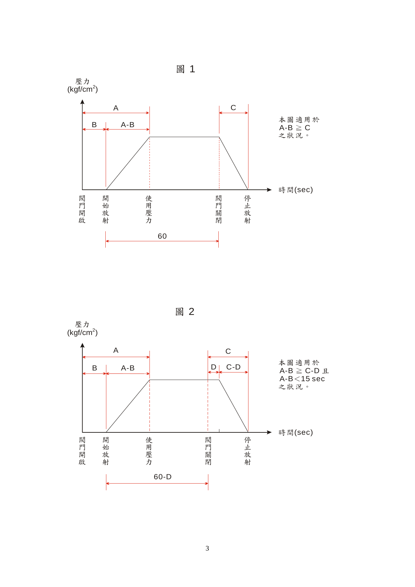

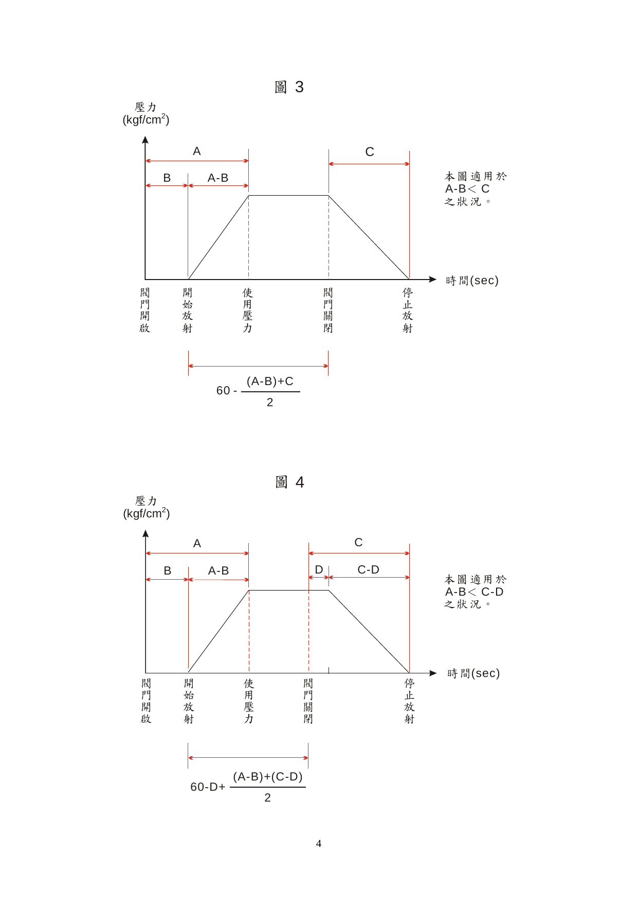

> 📷 截自原始 PDF「壹、技術規範及試驗方法」第 3～4 頁。四圖之適用條件與放射時間計算式如下（A＝開始放射、B＝閥門開啟、C＝閥門關閉、D＝停止放射之對應時點）：
>
> | 圖 | 適用狀況 | 放射時間 |
> |:---:|---|---|
> | 圖 1 | $A-B \geq C$ | $60$ |
> | 圖 2 | $A-B \geq C-D$ 且 $A-B < 15$ sec | $60-D$ |
> | 圖 3 | $A-B < C$ | $60 - \dfrac{(A-B)+C}{2}$ |
> | 圖 4 | $A-B < C-D$ | $60-D+\dfrac{(A-B)+(C-D)}{2}$ |

#### （四）

上開試驗實施前，應先記錄下述時間：自閥門開啟至泡沫噴頭開始放射之時間、自閥門開啟至達到使用壓力的上限或下限為止之時間、自閥門關閉至泡沫噴頭停止放射之時間。

#### （五）

採集盤之容器，由受檢者分別標示其重量，試驗實施前應抽取其中 10 個採集盤，測定其重量。標示重量和測定重量相差達 20 g 以上時，全部採集盤均須測重。

#### （六）

測定時應使用桿秤或其他經校正之量重工具。

#### （七）

採集盤所採集之泡沫水溶液量接近合格與否之判定值時，須以更準確之測定方法再行量測。如泡沫自採集盤溢流入鄰接之採集盤，測定時得不考慮採集盤間液量之增減。

#### （八）

試驗結果如未達表 2 之規定值以上，惟仍符合下列各項條件者，得視為合格：

1. 未達表 2 所列規定值之採集盤在 5 個以下者。
2. 未達規定值之採集盤，與其超過規定值之各鄰接採集盤合計量之平均值，在表 3 規定之平均值以上。未達規定值之採集盤相互連接，可視之為群組，計算其與鄰接採集盤合計量之平均值。供計算平均值之採集盤，不得計算 2 次以上。
3. 分布量比所求得之上限值及下限值均不得超過 1.20，其計算方式如下：

$$\frac{\text{4 個放射量試驗試樣之平均放射量}\,(\ell/\text{min})}{\text{採集總面積}\,(\text{m}^2)} = \text{每單位面積之平均放射量}\,(\ell/\text{min}/\text{m}^2)$$

$$\frac{\text{每單位時間採集之泡沫水溶液合計}\,(\ell/\text{min})}{\text{採集總面積}\,(\text{m}^2)} = \text{每單位面積之實測泡沫水溶液量}\,(\ell/\text{min}/\text{m}^2)$$

$$\frac{\text{每單位時間單位面積之實測泡沫水溶液量}}{\text{每單位面積之平均放射量}} = \text{分布量比}$$

### 六、放射密度

與泡沫分布試驗同時進行，其單位面積之泡水溶液放射密度應符合下表（表 3）之規定。

#### 表 3　單位面積之泡水溶液放射密度（單位：ℓ/min‧m²）

| 泡沫藥劑種類 | 單位面積之泡水溶液放射密度 |
|---|:---:|
| 蛋白泡沫滅火藥劑 | 6.5 |
| 合成界面活性劑泡沫滅火藥劑 | 8.0 |
| 水成膜泡沫滅火藥劑 | 3.7 |

### 七、發泡倍率試驗

依附圖 3 所示之試驗裝置，配置四個噴頭，在所使用藥劑之濃度上限值及下限值，以使用壓力之上限值及下限值進行放射，測量其發泡倍率（試驗方法如附錄 1 或 2）。該發泡倍率須在五倍以上。兩個量筒中，其中如有一個未達規定值者，分別依放射壓力上限值及下限值所得之平均值來判定。

### 八、25% 還原時間試驗

與發泡倍率試驗同時進行（試驗方法如附錄 1 或 2）。發泡後，其 25% 還原時間應在下表（表 4）所列之規定值以上。兩個量筒中，如其中一個未達規定值者，分別依放射壓力上限值及下限值所得之平均值來判定。

#### 表 4　25% 還原時間（單位：sec）

| 泡沫藥劑種類 | 25% 還原時間 |
|---|:---:|
| 蛋白泡沫滅火藥劑 | 60 |
| 合成界面活性劑泡沫滅火藥劑 | 30 |
| 水成膜泡沫滅火藥劑 | 60 |

### 九、滅火試驗

依附圖 2 配置四個泡沫噴頭，並依附圖 4 所示，下方置一鐵製燃燒盤（長 200 cm × 寬 100 cm × 高 20 cm），燃燒盤內注入水 60 ℓ、汽車用無鉛汽油（符合 CNS 12614 者）60 ℓ。泡沫噴頭之裝置位置應在其裝置高度下限值處（高度之量測係指自下方燃燒盤上緣起至噴頭下端間之距離），依各該滅火藥劑種類及其濃度下限值之泡沫水溶液，於點火 1 分鐘後，以泡沫噴頭使用壓力下限值放射 1 分鐘。須能於 1 分鐘內有效滅火，且放射停止後，1 分鐘內不得復燃。

滅火時，有關泡沫水溶液放射時間之量測，依五、（三）之規定為之。

### 十、標示

在泡沫噴頭表面顯而易見處，以鑄造或刻印等不易磨滅之方法，詳實標示下列規定事項，並對照申請圖說，檢查是否符合。

（一）製造廠名稱或商標

（二）製造年份

（三）型號

### 十一、試驗之一般條件

施行各項試驗之試驗場所之標準狀態及各項試驗結果之數值計算法應符合下列規定：

#### （一）試驗場所之標準狀態

試驗場所之溫度及濕度，原則上以標準溫度狀態（20±15 ℃）、標準濕度狀態（65±20 ％）、微風狀態（風速在 3.4 m/sec 以下）為準。但泡沫分布試驗及滅火試驗，則應控制在無風狀態（風速在 0.5 m/sec 以下）進行試驗。溫度及濕度在試驗開始時及完成時均應記錄。

#### （二）試驗結果之數值計算法

各項試驗結果所得數據，依數值修整法（參考 CNS 11296〔量、單位及符號之總則〕之附錄 B）加以修整，其修整間隔應依下表（表 5）之規定。

#### 表 5　數值修整間隔

| 項目（量） | 修整間隔 |
|---|---|
| 放射壓力 | 使用壓力計刻度之 1/2 |
| 放射量 | 0.1 kg |
| 泡沫分布量 | 5 g 或 5 mℓ |
| 時間 | 0.1 sec |
| 發泡倍率 | 1/10 倍 |
| 試驗裝置尺寸 | 10 mm 或 1 cm |

型式試驗前，應確認泡沫原液比重、PH 值及粘度，並加以記錄。

---

## 貳、型式認可作業

### 一、型式試驗之樣品

型式試驗須提供樣品 20 個（型式變更時亦同）。

### 二、型式試驗之方法

#### （一）試驗項目及樣品數

型式試驗之試驗項目及其所需試樣數如下表（表 6）所示。

#### 表 6　型式試驗項目及樣品數

| 試驗項目 | 型式認可（型式變更）樣品數 |
|---|:---:|
| 外觀‧標示試驗 | 20 |
| 組成‧形狀及尺度試驗 | 20 |
| 放射量試驗 | 20 |
| 強度試驗 | 4 |
| 泡沫分布試驗 | 4 |
| 發泡倍率試驗 | 4 |
| 25% 還原時間試驗 | 4 |
| 滅火試驗 | 4 |

#### （二）試驗流程

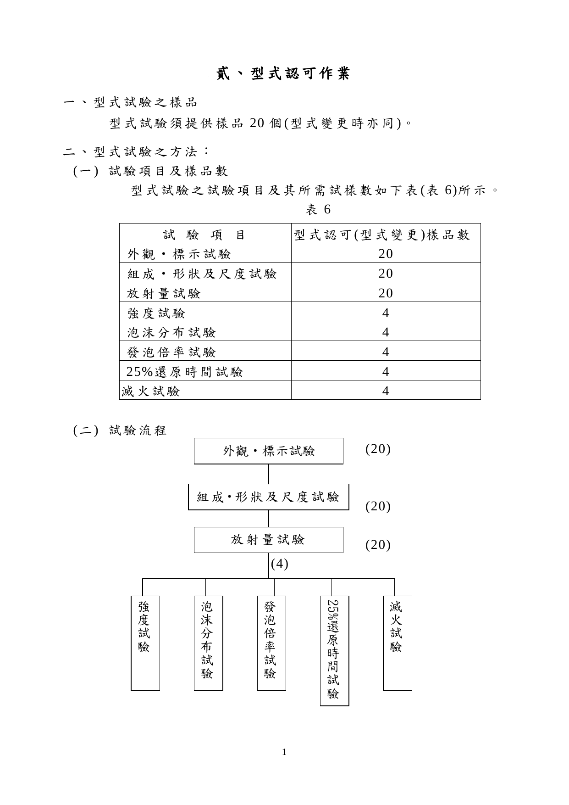

> 📷 截自原始 PDF「貳、型式認可作業」第 1 頁。流程為：外觀‧標示試驗（20）→ 組成‧形狀及尺度試驗（20）→ 放射量試驗（20）→ 自其中取 4 個，分別進行強度試驗、泡沫分布試驗、發泡倍率試驗、25% 還原時間試驗、滅火試驗。

#### （三）試驗方法

試驗方法依本認可基準壹、技術規範及試驗方法之規定。

1. 有關尺度之測定項目，依下表（表 7）之規定量測。

#### 表 7　型式試驗之尺度測定項目

| 測定項目 | 型式試驗 |
|---|:---:|
| 最大直徑 | Ο |
| 全高 | Ο |
| 濾網網目 | ※Ο |
| 噴嘴口徑 | Ο |
| 裝接部螺紋 | Ο |
| 空氣吸入口 | Ο |
| 錐形螺帽 | Ο |
| 迴水板 | Ο |
| 其他重要部分 | Ο |

> 備註：
> 1. Ο 係指需測定項目；※ 係表示確認網目變形之加工品，應與申請時所載之網目材料相符。
> 2. 裝接部螺紋之量測須使用界限計等專用之測定儀器。

2. 有關泡沫分布、發泡倍率、25% 還原時間及滅火性能試驗等項目之實施，依下表（表 8）之規定。

#### 表 8　各試驗之實施條件

| 混合濃度 | 裝置高度 | 使用壓力 | 型式試驗（申請時） | 型式變更 | 個別認可 | 試驗項目 |
|:---:|:---:|:---:|:---:|:---:|:---:|---|
| 上限 | 上限 | 上限 | ◎ | ─ | ─ | 分布 |
| 上限 | 上限 | 下限 | ◎ | ─ | ─ | 分布 |
| 上限 | 下限 | 上限 | ◎ | ─ | ─ | 分布／發泡 |
| 上限 | 下限 | 下限 | ◎ | ─ | ─ | 發泡 |
| 下限 | 上限 | 上限 | ◎ | ─ | ─ | 還原 |
| 下限 | 上限 | 下限 | ◎ | ─ | ─ | 還原 |
| 下限 | 下限 | 上限 | ◎ | ○ | ○ | 還原 |
| 下限 | 下限 | 下限 | ◎ | ○ | ○ | 滅火 |

> 備註：
> 1. ◎ 係指申請時需提出廠內試驗成績記錄表。
> 2. ○ 係指實際實施之條件項目。
>
> ⚠️ 本表原件為跨欄合併之矩陣（「試驗項目」欄以合併儲存格橫跨多列標示「分布」「發泡」「還原」「滅火」），上表已依原件對應關係逐列展開，**欄位對應請以原始 PDF 核對**。

### 三、型式試驗結果之判定

型式試驗之結果判定如下：

（一）符合本認可基準所規定之技術規範者，則型式試驗結果為「合格」。

（二）符合下述四所揭示之事項者，得進行補正試驗一次。

（三）未符合本認可基準所規定之技術規範者，則型式試驗結果為「不合格」。

### 四、補正試驗

型式試驗之不良事項，如為本認可基準肆、缺點判定表所列之一般缺點或輕微缺點者，得補正試驗一次。

補正試驗依前述型式試驗之方法進行。

### 五、型式變更之試驗方法

型式變更試驗之樣品數、試驗流程等，仍依型式試驗之方法進行。

### 六、型式區分

有關泡沫噴頭之型式區分及型式變更範圍，依下表（表 9）之規定。

#### 表 9　型式區分、型式變更及輕微變更

| 型式區分 | 型式變更 | 輕微變更 |
|---|---|---|
| 1. 使用不同種類之泡沫滅火藥劑者。 2. 使用壓力範圍或放射量不同者。 3. 外觀或形狀完全相異者。 | 1. 本體材質變更。 2. 錐形螺帽及噴嘴口徑、形狀之變更。 3. 空氣吸入口之形狀、尺寸變更。 4. 濾網或迴水板之形狀、尺寸變更。 5. 連接配管之裝接螺紋變更。 | 1. 標示內容及標示方法之變更。 2. 耐蝕加工方法變更。 3. 尺度之容許誤差之變更。 |

### 七、

產品規格明細表及型式試驗紀錄表（廠內試驗紀錄表）格式如附表 6 至附表 8。

---

## 參、個別認可作業

### 一、個別認可之抽樣方法

#### （一）

個別認可之抽樣試驗數量依附表 1 至附表 5 之抽樣表規定，抽樣方法依 CNS 9042 規定辦理。

#### （二）

抽樣試驗之分等依程度分為寬鬆試驗、普通試驗、嚴格試驗及最嚴格試驗四種。

### 二、個別認可之試驗項目

#### （一）試驗項目及樣品數

個別認可之試驗項目及其所需樣品數如下表（表 10）所示。

#### 表 10　個別認可試驗項目及樣品數

| 試驗項目 | 個別認可樣品數 |
|---|---|
| 外觀‧標示試驗 | 依附表 1 至附表 4 之抽樣表中一般試驗之試樣數 |
| 組成‧形狀及尺度試驗 | 依附表 1 至附表 4 之抽樣表中一般試驗之試樣數 |
| 放射量試驗 | 依附表 1 至附表 4 之抽樣表中特別試樣試驗之試樣數 |
| 強度試驗 | 依附表 1 至附表 4 之抽樣表中特別試樣試驗之試樣數 |
| 泡沫分布試驗 | 4 |
| 發泡倍率試驗 | 2 |
| 25% 還原時間試驗 | 2 |

#### （二）

有關尺度之測定項目，依下表（表 11）之規定量測。

#### 表 11　個別認可之尺度測定項目

| 測定項目 | 型式試驗 |
|---|:---:|
| 最大直徑 | Ο |
| 全高 | Ο |
| 濾網網目 | ※Ο |
| 裝接部螺紋 | Ο |

> 備註：
> 1. Ο 係指需測定項目；※ 係表示確認網目變形之加工品，應與申請資料所載之網目材料相符。
> 2. 裝接部螺紋之量測須使用界限計等專用之測定儀器。

#### （三）

有關泡沫分布、發泡倍率、25% 還原時間等試驗項目之實施，準用表 8 之規定。

### 三、批次之判定基準

個別認可中之受驗批次判定如下：

（一）受驗品按各不同受驗工廠別，依其試驗等級之區分，列為同一批。

（二）試驗結果應依批別登載於試驗紀錄表中，其型號應分別註記於備註欄中。

（三）申請者不得指定將某部分產品列為同一批。

### 四、缺點之分級及合格判定基準

缺點區分及指定合格判定基準依下列規定：

（一）試驗中發現之缺點，依消防機具器材及設備認可作業要點第十九點規定，分為致命缺點、嚴重缺點、一般缺點及輕微缺點等四級。

（二）各試驗項目之缺點內容，依肆、缺點判定表之規定，非屬該缺點判定表所列範圍之缺點者，則依上開規定判定之。

### 五、批次之判定

批次合格與否，按下列規定判定之：

抽樣表中，Ac 表示合格判定個數（合格判定時不良品數之上限），Re 表示不合格判定個數（不合格判定之不良品數之下限），具有二個等級以上缺點之製品，應分別計算其各不良品之數量。

（一）抽樣試驗中各級不良品數均在合格判定個數以下時，應依表 12 調整其試驗等級，且該批視為合格。

（二）抽樣試驗中任一級之不良品數在不合格判定個數以上時，該批視為不合格。但該不良品之缺點僅為一般缺點或輕微缺點時，得補正試驗一次。

（三）抽樣試驗中出現致命缺點之不良品時，即使該抽樣試驗中不良品數在合格判定個數以下，該批仍視為不合格。

### 六、個別認可結果之處置

依下列規定，進行個別認可結果之後續處理。

#### （一）合格批次之處置

1. 該批雖經判定為合格，但受驗樣品中如發現有不良品時，應使用預備品替換或修復之後視為合格品。
2. 即使為非受驗之樣品，若於整批受驗製品中發現有缺點者，準依前款之規定。
3. 上述 1、2 款兩種情形，如無預備品替換或無法修復調整者，應就其不良品部分之個數，判定為不合格。

#### （二）補正批次之處置

1. 接受補正試驗時，應提出第一次試驗時所發現不良事項之改善說明書及不良品處理之補正試驗用廠內試驗紀錄表。
2. 補正試驗之受驗數以第一次試驗之受驗數為準。但該批製品經補正試驗合格，依上述（一）、1 之處置後，仍未達受驗數之個數時，則視為不合格。

#### （三）不合格批次之處置

1. 不合格批次之產品接受再試驗時，應提出第一次試驗時所發現不良事項之改善說明書及不良品處理之補正試驗用廠內試驗紀錄表。
2. 接受再試驗時不得加入第一次試驗受驗製品以外之製品。
3. 個別認可不合格之批次不再受驗時，應依補正試驗用廠內試驗紀錄表之樣式，註明理由、廢棄處理及下批之改善處理等文件，向辦理試驗單位提出。

### 七、試驗設備發生故障或無法試驗時之處置

試驗開始後因試驗設備發生故障或其他原因致無法立即修復，經確認當日無法完成試驗時，得中止該試驗。並俟接獲試驗設備完成改善之通知後，重新擇定時間，依下列規定對該批製品施行試驗。

（一）試驗之抽樣標準與第一次試驗時相同。

（二）補正試驗應依前述六、（二）之規定。

### 八、試驗等級之調整

首次申請個別認可，其試驗等級以普通試驗為之，其後之試驗等級調整，則依下表（表 12）之規定：

#### 表 12　試驗等級之調整

| 等級 | 調整規定 |
|---|---|
| **寬鬆試驗** | 有下列情形之一者，自次一批起調整為普通試驗： 一、第一次試驗之批次不合格。 二、五批中有二批補正試驗或附加條件後合格。 |
| **普通試驗** | 一、符合下列全部條件時，自次一批起調整為嚴格試驗： 　1. 第一次試驗之批次不合格。 　2. 第一次試驗不合格之批次與前四批，合計連續五批（未滿五批時，以實際批數計算）之試樣中，不良品之總數達嚴格試驗之界限數以上。（致命缺點以嚴重缺點累計） 二、五批中出現有二批補正，自次一批起調整為嚴格試驗。 三、符合下列全部條件時，自次一批起調整為寬鬆試驗： 　1. 第一次試驗連續十批均合格。 　2. 在三個月以內有申請個別認可者。 |
| **嚴格試驗** | 一、第一次試驗累計有三批次不合格，自次一批起調整為最嚴格試驗。（進行品質勸導改善） 二、第一次試驗連續五批均合格，自次一批起調整為普通試驗。 |
| **最嚴格試驗** | 一、完成品質改善後，以此等級進行試驗。 二、第一次試驗連續五批均合格，自次一批起調整為嚴格試驗。 |

### 九、其他

寬鬆試驗之受檢個數未達 281 個時，依普通試驗之方式進行。

---

## 肆、缺點判定表

各項試驗所發現之不良情形，其缺點之等級依下表（表 13）之規定判定。

#### 表 13　缺點判定表

| 試驗項目 | 致命缺點 | 嚴重缺點 | 一般缺點 | 輕微缺點 |
|---|---|---|---|---|
| 外觀、標示、組成、形狀、尺度 | — | 1. 申請之構造、材質與實際不符。 2. 零組件脫落。 | 1. 標示事項脫落。 2. 出現有影響性能之砂孔、龜裂、變形或加工不良等情形。 3. 螺紋無法鎖緊達一圈以上。 4. 推拔螺紋尺度以環規測量時，超過 1 個螺峰以上。 5. 濾網、迴水板等之龜裂或變形等不良情形。 | 1. 標示事項有誤或判讀困難。 2. 尺度容許誤差不符。 3. 銘板剝離。 4. 對施工者產生不便。 5. 未達破壞強度之變形、皺摺。 6. 螺紋無法鎖緊達半圈以上一圈以下。 |
| 強度 | — | 濾網、迴水板脫落。 | 濾網、迴水板等有變形或鬆脫等不良情形。 | — |
| 放射量 | — | 1. 超過標準值 15 ﹪以上。 2. 低於標準值 5 ﹪以上。 | 1. 超過標準值達 10 ﹪以上，但未滿 15 ﹪。 2. 低於標準值 5 ﹪以下。 | 超過標準值達 5 ﹪以上，但未滿 10 ﹪。 |
| 泡沫分布量 | — | 1. 平均值未達規定值。 2. 未滿規定最低值之採集盤在 6 個以上；或在 5 個以下但仍未符合判定基準。 3. 分布量比超過 1.20。 | — | — |
| 發泡倍率與 25 ﹪還原時間 | — | 未達規定值。 | — | — |

---

## 伍、主要試驗設備

泡沫噴頭進行試驗時所需之設備，應依下表（表 14）之規定。

#### 表 14　主要試驗設備

| 項目 | 規格 | 數量 |
|---|---|---|
| 抽樣表 | 本標準中有關抽樣法之規定 | 1 份 |
| 亂數表 | CNS 2779 或本標準中有關之規定 | 1 份 |
| 乾濕球溫度計 | 一般市面上販售品 | 1 只 |
| 加壓送水裝置 | — | 一組 |
| 磅秤 | 量測範圍：需為測重對象物重量之 1.5 倍，最小刻度 1 g。 | 1 台 |
| 量測器 | 游標卡尺、環規、深度規、分厘卡、直尺、捲尺等 | 1 個 |
| 溫度計 | 0〜50 ℃、最小刻度 1 ℃ | 1 個 |
| 碼錶 | — | 2 個 |
| 壓力計試驗器 | 適用壓力校正 | 1 個 |
| 壓力器 | 0.5 級 150 mm 0〜15 kgf/cm² 1.5 級 100 mm 0〜20 或 25 kgf/cm² | 各 1 個以上 |
| 放射試驗設備 | — | 1 個 |
| 發泡倍率、25% 還原時間試驗設備 | 泡沫滅火設備、發泡倍率及 25% 還原時間測定方法（如附錄 1 及附錄 2） | 1 套 |
| 滅火試驗設備 | 認可基準附圖 2、附圖 4 所規定者 | 1 套 |
| 混合槽 | — | 1 套 |

---

## 附表

### 附表 1　普通試驗抽樣表

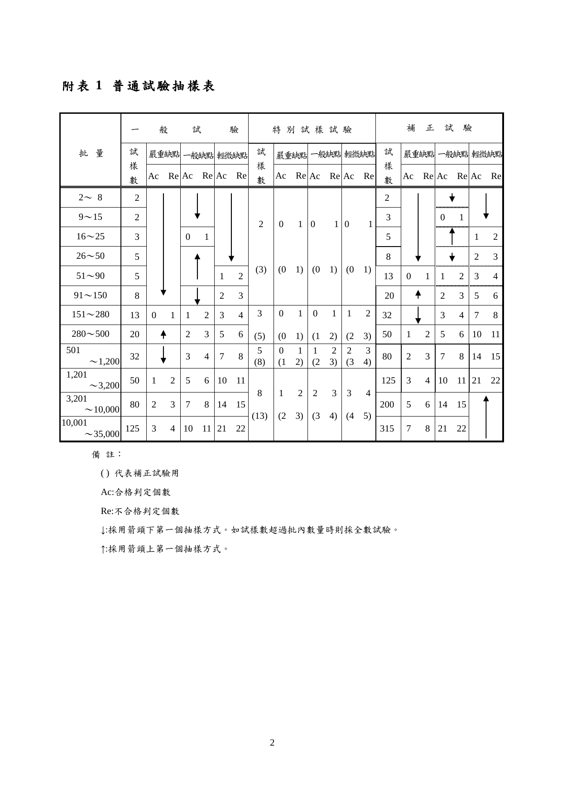

### 附表 2　寬鬆試驗抽樣表

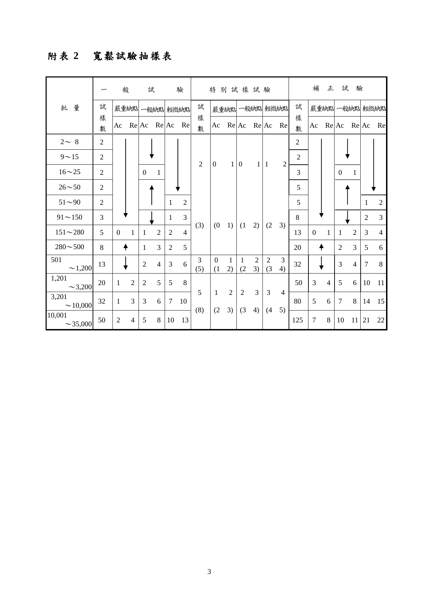

### 附表 3　嚴格試驗抽樣表

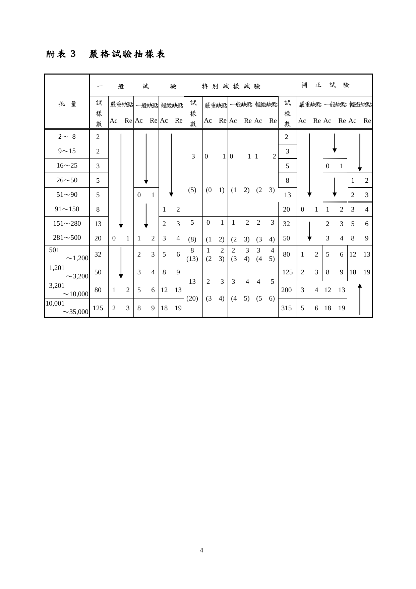

### 附表 4　最嚴格試驗抽樣表

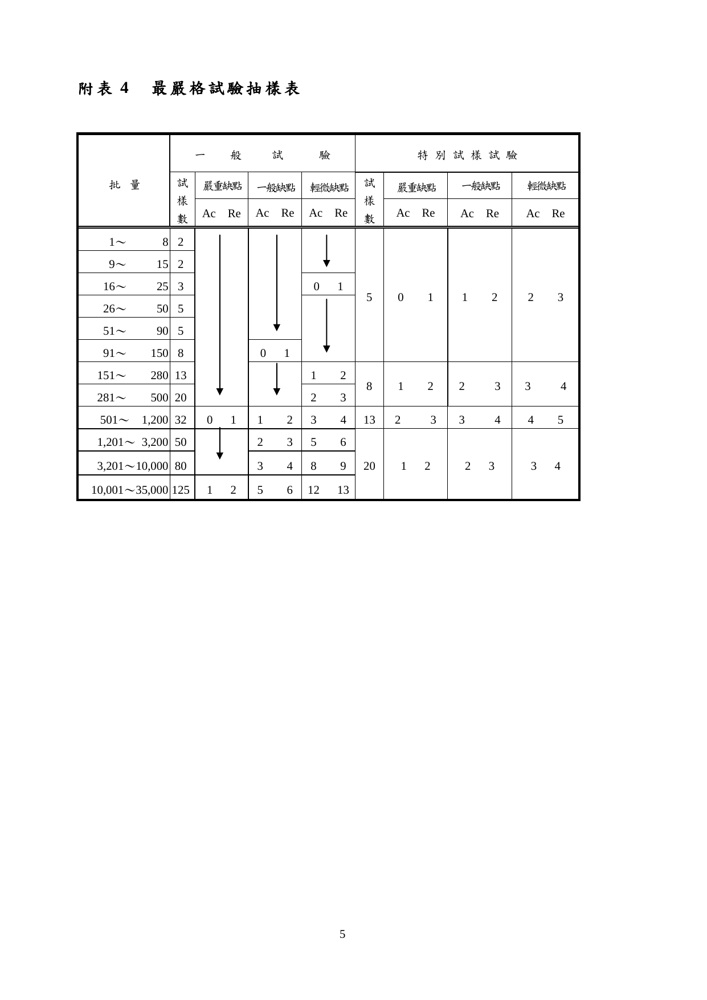

> 📷 附表 1～4 截自原始 PDF「伍、主要試驗設備」第 2～5 頁。四表均為「一般試驗／特別試樣試驗／補正試驗」× 「嚴重缺點／一般缺點／輕微缺點」× 「Ac／Re」之三層跨欄表頭，markdown 無法乾淨呈現，故以截圖保留。**判定個數請以原始 PDF 核對。**

### 附表 5　嚴格試驗之界限數

| 累計試樣數 | 嚴重缺點 | 一般缺點 | 輕微缺點 |
|---|:---:|:---:|:---:|
| 1 | 2 | 2 | 2 |
| 2 | 2 | 2 | 3 |
| 3 | 2 | 3 | 3 |
| 4 | 2 | 3 | 4 |
| 5 | 2 | 3 | 4 |
| 6〜7 | 2 | 3 | 4 |
| 8〜9 | 2 | 3 | 5 |
| 10〜12 | 2 | 4 | 5 |
| 13〜14 | 3 | 4 | 6 |
| 15〜19 | 3 | 4 | 7 |
| 20〜24 | 3 | 5 | 7 |
| 25〜29 | 3 | 5 | 8 |
| 30〜39 | 3 | 6 | 10 |
| 40〜49 | 4 | 7 | 11 |
| 50〜64 | 4 | 7 | 13 |
| 65〜79 | 4 | 8 | 15 |
| 80〜99 | 5 | 10 | 17 |
| 100〜129 | 5 | 11 | 20 |
| 130〜159 | 6 | 13 | 24 |
| 160〜199 | 7 | 15 | 28 |
| 200〜249 | 7 | 17 | 33 |
| 250〜319 | 8 | 20 | 40 |
| 320〜399 | 10 | 24 | 48 |
| 400〜499 | 11 | 28 | 60 |
| 500〜624 | 13 | 33 | 76 |
| 625〜799 | 15 | 40 | 95 |
| 800〜999 | 17 | 48 | ╳ |
| 1000〜1249 | 20 | 60 | ╳ |
| 1250〜1574 | 24 | 76 | ╳ |

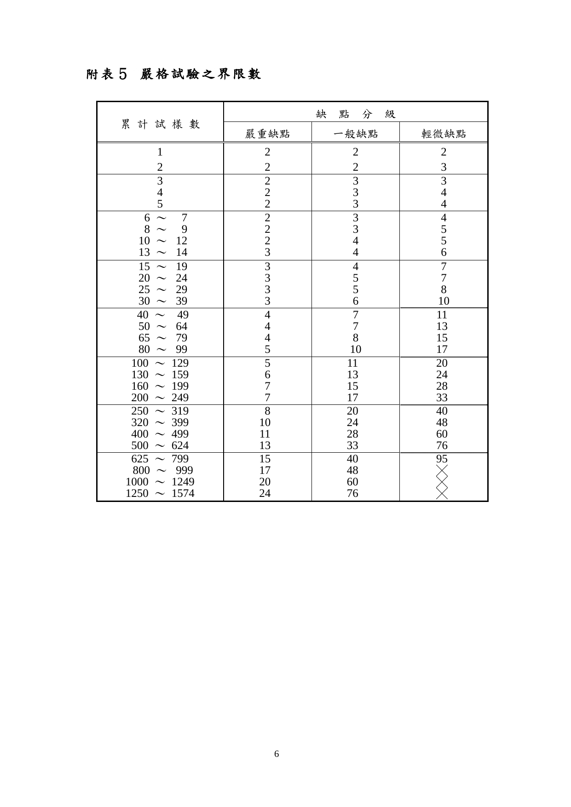

> 📷 併附原始 PDF 截圖（「伍、主要試驗設備」第 6 頁）供核對；╳ 表該欄無界限數。

### 附表 6～附表 8（表單，僅附原始 PDF 連結）

> 📋 **附表 6　泡沫噴頭產品明細表**、**附表 7　泡沫噴頭型式試驗紀錄表**（含附表 7 之 1～7 之 4）、**附表 8**：均為供填寫之空白表單（含大量欄框與簽章欄），非可查詢之規範內容，**請見文末原始 PDF「伍、主要試驗設備」第 7～12 頁**。

---

## 附圖

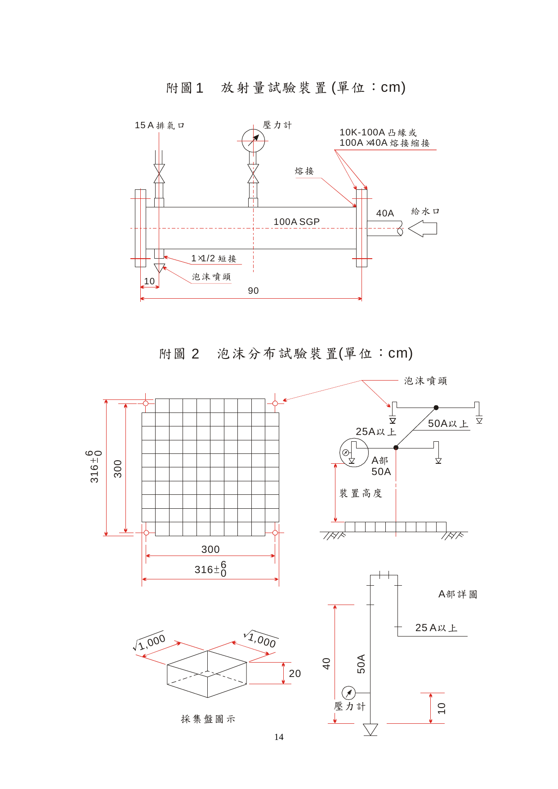

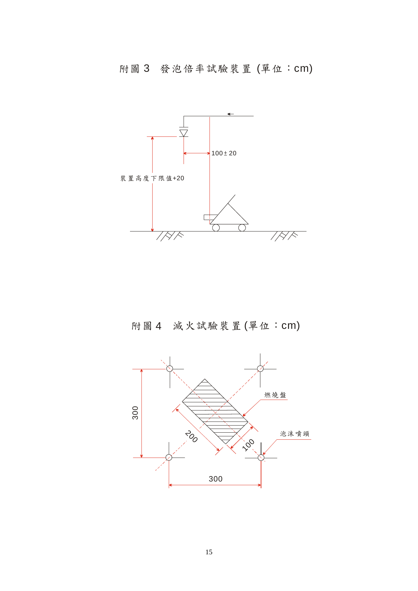

> 📷 截自原始 PDF「伍、主要試驗設備」第 14～15 頁。

---

## 附錄 1　發泡倍率及 25% 還原時間測定方法（蛋白泡沫、合成界面活性劑之低發泡者）

### 一、適用範圍

本測定方法適用於使用蛋白泡沫滅火藥劑或合成界面活性劑中之低發泡者。

### 二、必備器具

#### （一）發泡倍率測定器具

1. 1400 mℓ 容量之泡沫試料容器──2 個（如圖 2）。
2. 泡沫試料採集器──1 個（如圖 1）。
3. 量秤──1 個。

#### （二）25 ﹪還原時間測定器具

1. 碼錶──2 個。
2. 泡沫試料容器台──1 個（如圖 3）。
3. 100 mℓ 容量之透明容器──4 個。

### 三、泡沫試料之採集方法

在發泡面積內之指定位置，將 2 個內容積 1400 mℓ 之泡沫試料容器置於泡沫試料採集器之位置，在該容器未盛滿泡沫前持續置於採集器上。泡沫盛滿後即按下碼錶讀秒，同時將採集自泡沫頭撒下泡沫試料移至外部，以直棒將容器表面推平，清除過多之泡沫及附著在容器外側與底部之泡沫，對該試料進行分析。

### 四、測定方法

#### （一）發泡倍率

發泡倍率係測量在未混入空氣前之泡沫水溶液與最終發泡量之比率。故應預先測出泡沫試料容器重量，次將泡沫試料測量至公克單位，再利用下列公式計算之。

$$1400\ \text{m}\ell \div \text{扣除容器重量後之淨重(g)} = \text{發泡倍率}$$

#### （二）25 ﹪還原時間

泡沫之 25 ﹪還原時間，係指自所採集之泡沫消泡為泡沫水溶液量，還原至全部泡沫水溶液量之 25 ﹪止所需之時間。因其特別著重水之保持能力及泡沫之流動性，故以下列方法測定。

測定還原時間係以測量發泡倍率時所用之試料進行，如將泡沫試料之淨重分為四等分，即可得所含泡水溶液量之 25 ﹪（單位 mℓ），為測得還原至此量所需時間，應先將試料容器置於容器台上，在一定時間內以 100 mℓ 透明容器承接還原於容器底部之水溶液。

玆舉一例如下：

假設泡沫試料之淨重為 180 g，25 ﹪容量值為 $180 \div 4 = 45$（mℓ），故測定至還原 45 mℓ 所需時間，以判定其性能。

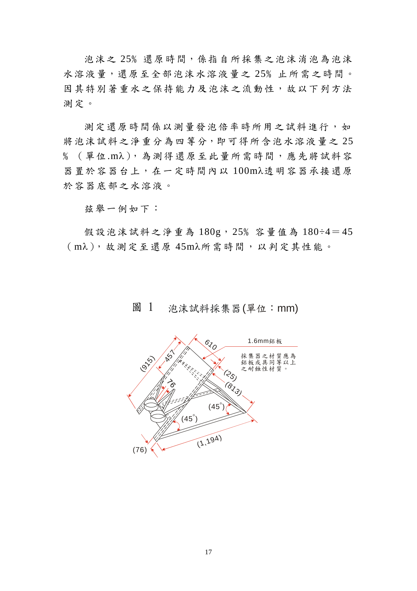

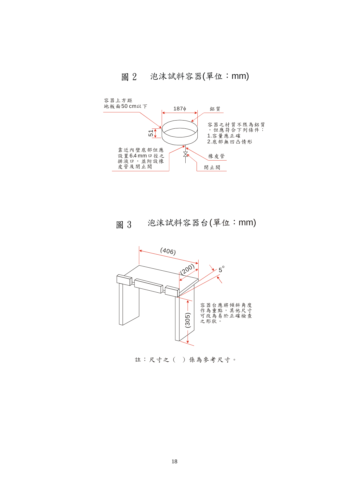

> 📷 截自原始 PDF「伍、主要試驗設備」第 17～18 頁。採集器之材質應為鋁板或具同等以上之耐蝕性材質。

---

## 附錄 2　發泡倍率及 25% 還原時間測定方法（水成膜泡沫滅火藥劑）

### 一、適用範圍

本測定方法適用於使用水成膜泡沫滅火藥劑發泡者。

### 二、必備器具

#### （一）發泡倍率測定器具

1. 內容積 1000 mℓ 具刻度之量筒──2 個。
2. 泡沫試料採集器──1 個（如圖 4）。
3. 1000 g 計量器（或與此相近似者）──1 個。

#### （二）25 ﹪還原時間測定器具

1. 碼錶──2 個。
2. 內容積 1000 mℓ 具刻度之量筒──2 個。

### 三、泡沫試料之採集方法

將 1000 mℓ 附刻度之量筒 2 個之泡沫試料採集器置於發泡面積之指定位置，至量筒充滿泡沫為止採集試料，如泡沫盛滿後即按下碼錶讀秒，同時將採集自泡沫頭撒下之泡沫試料移至外部，清除多餘之泡沫及附著在量筒外側與底部之泡沫，對該試料進行分析。

### 四、測定方法

#### （一）發泡倍率

發泡倍率係測量在未混入空氣前之泡沫水溶液與最終發泡量之比率。故應預先測出刻度 1000 mℓ 量筒之容器重量，次將泡沫試料測量至公克單位，再利用下列公式計算之。

$$1000\ \text{m}\ell \div \text{扣除容器重量後淨重換算之試料體積(m}\ell) = \text{發泡倍率}$$

#### （二）25 ﹪還原時間

泡沫之 25 ﹪還原時間，係指自所採集之泡沫消泡為泡沫水溶液量，還原至全部泡沫水溶液量之 25 ﹪止所需之時間。因其特別著重水之保持能力及泡沫之流動性，故以下列方法測定。

測定還原時間係以測量發泡倍率時所用之試料進行，如將泡沫試料之淨重分為四等分，即可得所含泡沫水溶液量之 25 ﹪（單位 mℓ），為測得還原至此量所需時間，應先將量筒置於平面上，利用量筒上之刻度觀察泡沫水溶液還原至 25 ﹪之所需時間。

玆舉一例如下：假設泡沫試料之淨重為 200 g，1 g 換算 1 mℓ，25 ﹪容量值為 $200 \div 4 = 50$（mℓ），故測定至還原 50 mℓ 所需時間，以判定其性能。

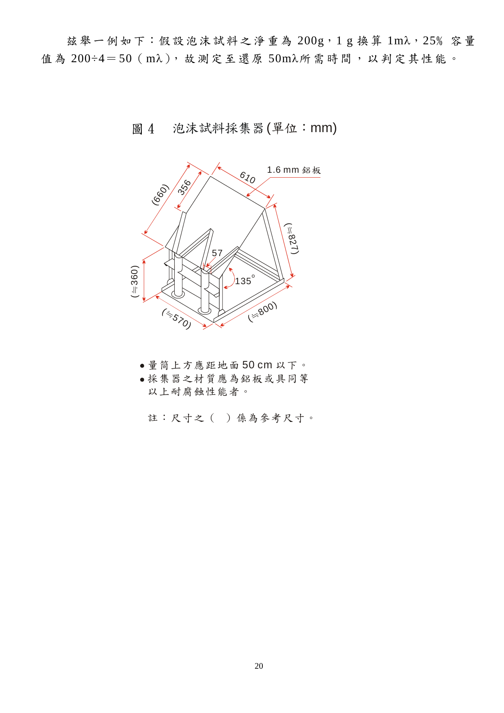

> 📷 截自原始 PDF「伍、主要試驗設備」第 20 頁。

---

## 原始檔案

- 📎 [泡沫噴頭認可基準_壹_技術規範及試驗方法.pdf](../原始檔案/泡沫噴頭認可基準/泡沫噴頭認可基準_壹_技術規範及試驗方法.pdf)（7 頁）
- 📎 [泡沫噴頭認可基準_貳_型式認可作業.pdf](../原始檔案/泡沫噴頭認可基準/泡沫噴頭認可基準_貳_型式認可作業.pdf)（3 頁）
- 📎 [泡沫噴頭認可基準_參_個別認可作業.pdf](../原始檔案/泡沫噴頭認可基準/泡沫噴頭認可基準_參_個別認可作業.pdf)（4 頁）
- 📎 [泡沫噴頭認可基準_肆_缺點判定表.pdf](../原始檔案/泡沫噴頭認可基準/泡沫噴頭認可基準_肆_缺點判定表.pdf)（1 頁）
- 📎 [泡沫噴頭認可基準_伍_主要試驗設備.pdf](../原始檔案/泡沫噴頭認可基準/泡沫噴頭認可基準_伍_主要試驗設備.pdf)（20 頁，含附表 1～8、附圖 1～4、附錄 1～2）
