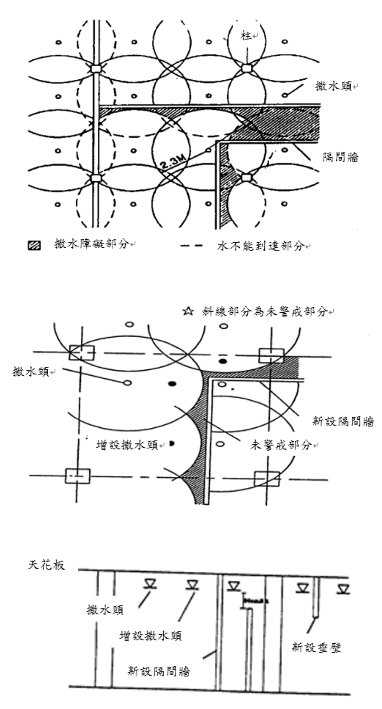
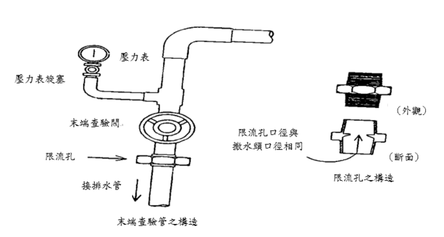
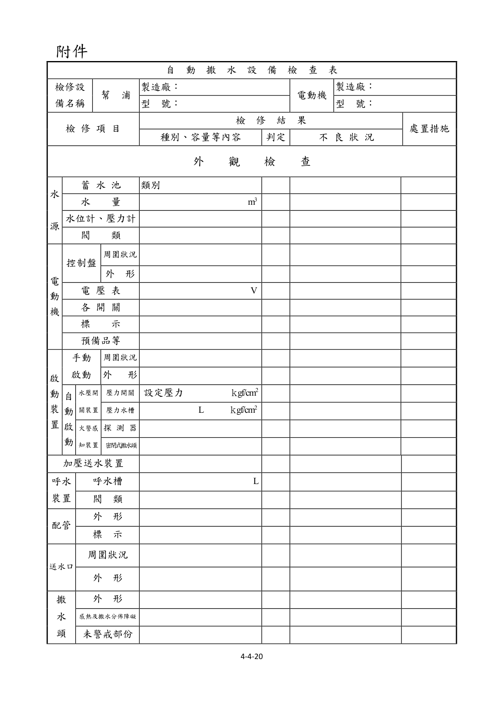
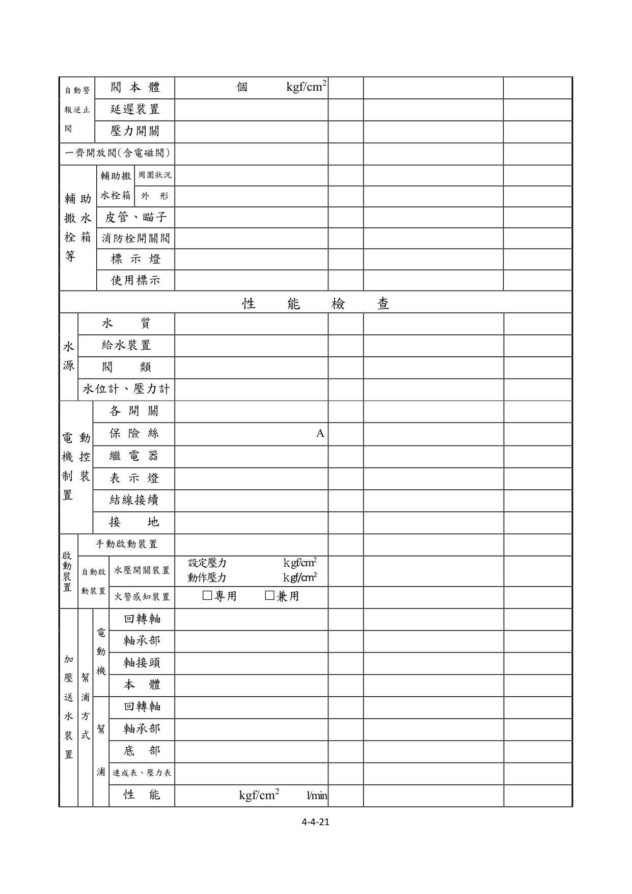
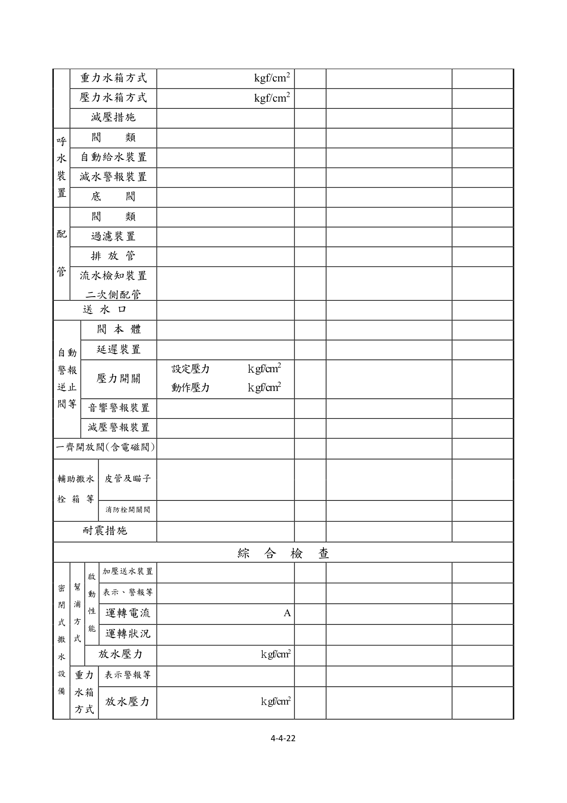
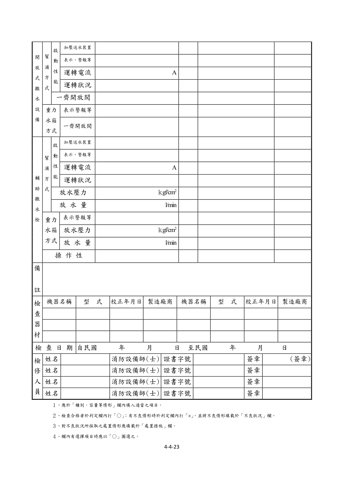

# 消防安全設備及必要檢修項目檢修基準　第四章　自動撒水設備

> 版本日期：民國 114 年 1 月 9 日（修正）｜來源：內政部主管法規共用系統（glrs.moi.gov.tw，GL001285）PDF 轉換。114-01-09 修正六章：第一、九、十三、十七、十九、二十七章（其中第一、九、十九章之修正內容在檢修報告表／檢查表與附圖）。
>
> 📌 **免責聲明**：本檔由官方來源轉換與人工整理，可能有轉換或辨識誤差。**一切以主管機關（全國法規資料庫、內政部消防署）公告之現行版本為準**；如有疑義，以官方公告為主。後續 AI 代理人引用本檔時應主動提醒使用者此點，並於必要時自行上網查證正確版本。
>
> 🛈 表格與表單已依原始 PDF 線框以 `scripts/pdf_tables_extract.py` 重新辨識為結構化內容（issue #41）：編號附表為 Markdown 表格或逐列樹狀展開；章末檢修報告表／檢查表**不辨識文字**，改以原始 PDF 頁面截圖（PNG）嵌入；內文附圖與表內圖示亦以 PDF 截圖嵌入（圖檔與本檔同資料夾、檔名前綴同本檔）。表格數值／○×標記可能有辨識誤差，關鍵判斷請核對原始 PDF。
>
> 📎 原始 PDF（全文，114-01-09 版）：[消防安全設備及必要檢修項目檢修基準.PDF](../附件/消防安全設備及必要檢修項目檢修基準/消防安全設備及必要檢修項目檢修基準.PDF)

一、外觀檢查

（一）水源

１、檢查方法

（１）水箱、蓄水池由外部以目視確認有無變形、漏水、腐蝕等。

（２）水量由水位計確認或打開人孔蓋用檢尺測量。

（３）水位計及壓力表用目視確認有無變形、損傷，指示值是否正常。

（４）閥類以目視確認排水管、補給水管、給氣管等之閥類，有無漏水、變形、損傷等，及其開、關位置是否正常。

２、判定方法

（１）水箱、蓄水池應無變形、損傷、漏水、漏氣及顯著腐蝕等痕跡。

（２）水量應確保在規定量以上。

（３）水位計及壓力表應無變形、損傷，且指示值應正常。

（４）閥類

A.應無漏水、變形、損傷等。

B.「常時開」或「常時關」之標示及開、關位置應保持正常。

（二）電動機之控制裝置

１、檢查方法

（１）控制盤

A.周圍狀況確認周圍有無檢查及使用上之障礙。

B.外形以目視確認有無變形、腐蝕。

（２）電壓計

A.以目視確認有無變形、損傷。

B.確認電源、電壓是否正常。

（３）各開關以目視確認有無變形、損傷及開、關位置是否正常。

（４）標示確認是否正確標示。

（５）預備品確認是否備有保險絲、燈泡、回路圖及說明書等。

２、判定方法

（１）控制盤

A.周圍狀況應設置於火災不易波及之位置，且周圍應無檢查及使用上之障礙。

B.外形應無變形、損傷、顯著腐蝕等。

（２）電壓表

A.應無變形、損傷等。

B.電壓表之指示值應在所定之範圍內。

C.無電壓表者，電源指示燈應亮著。

（３）各開關應無變形、損傷、脫落等，且開關位置應正常。

（４）標示

A.各開關之名稱標示應無污損及不明顯部分。

B.標示銘板應無剝落。

（５）預備品

A.應備有保險絲、燈泡等預備品。

B.應備有回路圖及操作說明書等。

（三）啟動裝置

１、手動啟動裝置

（１）檢查方法

A.周圍狀況以目視確認周圍有無檢查及使用上之障礙，及標示是否適當。

B.外形以目視確認有無變形、損傷等。

（２）判定方法

A.周圍狀況

(A)應無檢查及使用上之障礙。

(B)標示應無污損及不明顯部分。

B.外形開關閥應無損傷、變形。

２、自動啟動裝置

（１）檢查方法

A.啟動用水壓開關裝置(A)壓力開關以目視確認有無變形、損傷等。

(B)啟動用壓力水槽以目視確認有無變形、損傷、漏水、腐蝕等，及壓力表指示值是否適當正常。

B.火警感知裝置

(A)探測器a.外形以目視確認有無變形、腐蝕等。b.感知區域確認探測器範圍設定是否恰當。c.適應性確認是否設置適當型式之探測器。d.性能障礙以目視確認感知部分有無被塗上油漆，或因裝潢而妨礙熱氣流等。

(B)密閉式撒水頭以目視確認有無火警感知障礙，及因裝修油漆、異物附著等動作障礙。

（２）判定方法

A.啟動用水壓開關裝置

(A)壓力開關應無變形、損傷等。

(B)啟動用壓力水槽應無變形、損傷、漏水、漏氣、顯著腐蝕等，且壓力表之指示值應正常。

B.火警感知裝置

(A)探測器a.外形應無變形、損傷、脫落、顯著腐蝕等。b.感知區域設置的型式、探測範圍面積及裝置高度均符合規定。c.適應性應為適合設置場所之探測器。d.性能障礙應無被油漆及裝修妨礙熱氣流或煙之流動現象。

(B)密閉式撒水頭a.撒水頭周圍應無感熱障礙。b.應無被油漆、異物附著、漏水、變形等。

（四）加壓送水裝置

１、檢查方法以目視確認幫浦及電動機等有無變形、腐蝕等。

２、判定方法應無變形、損傷、顯著腐蝕及銘板剝落等。

（五）呼水裝置

１、檢查方法

（１）呼水槽以目視確認有無變形、漏水、腐蝕，及水量是否在規定量以上。

（２）閥類以目視確認給水管等之閥類有無漏水、變形等，及其開、關位置是否正常。

２、判定方法

（１）呼水槽應無變形、損傷、漏水、顯著腐蝕等，及水量應在規定量以上。

（２）閥類

A.應無漏水、變形、損傷等。

B.「常時開」或「常時關」之標示及開、關位置應正常。

（六）配管

１、檢查方法

（１）立管及接頭以目視確認有無洩漏、變形等及被利用為支撐、吊架等。

（２）立管固定用支架以目視及手觸摸確認有無脫落、彎曲、鬆動等。

（３）閥類以目視確認有無洩漏、變形等，及開、關位置是否正常。

（４）過濾裝置以目視確認有無洩漏、變形等。

（５）標示確認「制水閥」、「末端查驗閥」等之標示是否適當正常。

２、判定方法

（１）立管及接頭

A.應無洩漏、變形、損傷等。

B.應無被利用為支撐、吊架等。

（２）立管固定用之支架應無脫落、彎曲、鬆動等。

（３）閥類

A.應無洩漏、變形、損傷等。

B.「常時開」或「常時關」之標示及開、關位置應正常。

（４）過濾裝置應無洩漏、變形、損傷等。

（５）標示應無損傷、脫落、污損等。

（三）送水口

１、檢查方法

（１）周圍狀況

A.確認周圍有無使用上及消防車接近之障礙。

B.確認「自動撒水送水口」之標示是否正常。

（２）外形以目視確認有無漏水、變形、異物阻塞等。

２、判定方法

（１）周圍狀況

A.應無消防車接近及消防活動上之障礙。

B.標示應無損傷、脫落、污損等。

（２）外形

A.快速接頭應無生鏽。

B.應無漏水及砂、垃圾等異物阻塞現象。

（四）撒水頭

１、檢查方法

（１）外形

A.以目視確認有無洩漏、變形等。

B.以目視確認有無被利用為支撐、吊架使用等。

（２）感熱及撒水分布障礙以目視確認周圍有無感熱及撒水分布之障礙。

（３）未警戒部分確認有無如圖4-1所示，因隔間變更應無設置撒水頭，而造成未警戒之部分。

圖4-1   未警戒部分圖例

２、判定方法

（１）外形

A.應無洩漏、變形等。

B.應無被利用為支撐、吊架使用。

（２）感熱及撒水分布障礙

A.撒水頭周圍應無感熱、撒水分布之障礙。

B.撒水頭應無被油漆、異物附著等。

C.於設有撒水頭防護蓋之場所，其防護蓋應無損傷、脫落等。

（３）未警戒部分應無因隔間、垂壁、風管管道等之變更、增設、新設等，而造成未警戒部分。

（五）自動警報逆止閥及流水檢知裝置

１、檢查方法

（１）閥本體

A.以目視確認本體、附屬閥類、配管及壓力表等有無漏水、變形等。

B.確認壓力表指示值是否正常。

C.以目視確認附屬閥類之開關位置是否正常。

（２）延遲裝置以目視確認有無變形、腐蝕等。

（３）壓力開關以目視確認有無變形、損傷等。

２、判定方法

（１）閥本體

A.本體、附屬閥類、壓力表及配管應無漏水、變形、損傷等。

B.壓力表指示值正常。

C.「常時開」或「常時關」之標示及開、關位置應正常。

（２）延遲裝置應無變形、損傷、顯著腐蝕等。

（３）壓力開關應無變形、損傷等。

（六）一齊開放閥（含電磁閥）撒水頭

１、檢查方法以目視確認有無洩漏、變形、腐蝕等。

２、判定方法應無洩漏、變形、顯著腐蝕等。

（七）補助撒水栓箱等撒水頭

１、補助撒水栓箱

（１）檢查方法

A.周圍狀況以目視確認周圍有無檢查及使用上之障礙，又「補助撒水栓」之標示是否正常。

B.外形以目視及開、關操作確認有無變形、損傷，及箱門是否能確實開、關。

（２）判定方法

A.周圍狀況

(A)應無檢查及使用上之障礙。

(B)標示應無污損或不明顯部分。

B.外形

(A)應無變形、損傷。

(B)箱門開、關狀況應良好。

２、皮管及瞄子

（１）檢查方法以目視確認有無變形、損傷。

（２）判定方法

A.應無變形、損傷。

B.應有長二十公尺皮管及直線水霧兩用瞄子一具。

３、消防栓開關閥

（１）檢查方法以目視確認有無洩漏、變形等。

（２）判定方法應無洩漏、變形等。

４、標示燈

（１）檢查方法以目視確認有無變形、損傷及亮燈。

（２）判定方法

A.應無變形、損傷、脫落等。

B.在距離十公尺十五度角處亦能容易辨識。

５、使用標示

（１）檢查方法確認標示是否適當及明顯。

（２）判定方法應無污損、不明顯部分。

二、性能檢查

（一）水源

１、檢查方法

（１）水質打開人孔蓋以目視及水桶採水，確認有無腐敗、浮游物、沈澱物等。

（２）給水裝置

A.確認有無變形、腐蝕等，及操作排水閥確認給水功能是否正常。

B.如不便用操作排水閥檢查給水功能時，可使用下列方法：

(A)使用水位電極控制給水者，拆除其電極回路之配線，形成減水狀態，確認其是否能自動給水；其後再將拆掉之電極回路配線接上復原，形成滿水狀態，確認其給水能否自動停止。

(B)使用浮球水栓控制給水者，以手動操作將浮球沒入水中，形成減水狀態，使其自動給水；其後使浮球復原，形成滿水狀態，使給水自動停止。

（３）水位計及壓力表

A.水位計之量測係打開人孔蓋，用檢尺測量水位，並確認水位計之指示值。

B.壓力表之量測係關閉壓力表開關及閥類，並放出壓力表之水，使指針歸零後，再打開壓力表開關及閥類，並確認指針之指示值。

（４）閥類用手操作確認開、關動作是否容昜進行。

２、判定方法

（１）水質應無顯著腐蝕、浮游物、沈澱物等。

（２）給水裝置

A.應無變形、損傷、顯著腐蝕。

B.於減水狀態應能自動給水，於滿水狀態應能自動停止供水。

（３）水位計及壓力表

A.水位計之指示值應正常。

B.在壓力表歸零的位置、指針的動作狀況及指示值應正常。

（４）閥類開、關操作應能容易進行。

（二）電動機之控制裝置

１、檢查方法

（１）各開關以螺絲起子及開、關操作，確認端子有無鬆動及開、關性能是否正常。

（２）保險絲確認有無損傷、熔斷及是否為所規定之種類及容量。

（３）繼電器確認有無脫落、端子鬆動、接點燒損、灰塵附著，並操作各開關使繼電器動作，確認其性能。

（４）表示燈操作各開關確認有無亮燈。

（５）結線接續以目視及螺絲起子確認有無斷線、端子鬆動等。

（６）接地以目視或回路計確認有無腐蝕、斷線等。

２、判定方法

（１）各開關

A.端子應無鬆動、發熱。

B.開、關性能應正常。

（２）保險絲

A.應無損傷、熔斷。

B.應依回路圖所規定種類及容量設置。

（３）繼電器

A.應無脫落、端子鬆動、接點燒損、灰塵附著等。

B.動作應正常。

（４）標示燈應無顯著劣化，且應能正常亮燈。

（５）結線接續應無斷線、端子鬆動、脫落、損傷等。

（６）接地應無顯著腐蝕、斷線等。

（三）啟動裝置

１、手動啟動裝置

（１）檢查方法

A.使用開放式撒水頭者。將一齊開放閥二次側之止水閥關閉，再打開測試用排水閥然後操作手動啟動開關，確認加壓送水裝置是否啟動。

B.使用密閉式撒水頭者直接操作控制盤上啟動按鈕，確認加壓送水裝置是否啟動。

（２）判定方法閥的操作應容易進行，且加壓送水裝置應能確實啟動。

２、自動啟動裝置

（１）檢查方法

A.啟動用水壓開關裝置

(A)以目視及螺絲起子，確認壓力開關之端子有無鬆動。

(B)確認設定壓力值是否恰當，且由操作排水閥使加壓送水裝置啟動，確認動作壓力值是否適當。

B.火警感知裝置使用加熱試驗器把探測器加熱，使探測器動作，確認加壓送水裝置是否啟動。

（２）判定方法

A.啟動用水壓開關裝置

(A)壓力開關之端子應無鬆動。

(B)設定壓力值應適當，且加壓送水裝置應能依設定壓力正常啟動。

B.火警探測器

(A)依火警自動警報設備之檢查要領判定。

(B)加壓送水裝置應能確實啟動。

（四）加壓送水裝置

１、幫浦方式

（１）電動機

A.檢查方法

(A)回轉軸用手轉動，確認是否能圓滑地回轉。

(B)軸承部確認潤滑油有無污損、變質及是否達必要量。

(C)軸接頭以扳手確認有無鬆動及性能是否正常。

(D)本體操作啟動裝置使其啟動，確認性能是否正常。

B.判定方法

(A)回轉軸應能圓滑地回轉。

(B)軸承部潤滑油應無污損、變質等，且達必要量。

(C)軸接頭應無脫落、鬆動，且接合狀態牢固。

(D)本體應無顯著發熱、異常振動、不規則或不連續之雜音，且回轉方向正確。

C.注意事項除需操作啟動檢查性能外，其餘均需先切斷電源。

（２）幫浦

A.檢查方法

(A)回轉軸用手轉動確認是否能圓滑的轉動。

(B)軸承部確認潤滑油有無污損、變質及是否達必要量。

(C)底部確認有無顯著的漏水。

(D)連成表及壓力表關掉表計之控制水閥將水排出，確認指針是否指在 0 之位置，再打開表計之控制水閥，操作啟動裝置確認指針是否正常動作。

(E)性能先將幫浦吐出側之制水閥關閉之後，使幫浦啟動，然後緩緩的打開性能測試用配管之制水閥，由流量計及壓力表確認額定負荷運轉及全開點時之性能。

B.判定方法

(A)回轉軸應能圓滑轉動。

(B)軸承部潤滑油應無污損、變質、混入異物等，且達必要量。

(C)底座應無顯著的漏水。

(D)連成表及壓力表位置及指針之動作應正常。

(E)性能應無異常振動、不規則或不連續的雜音，且於額定負荷運轉及全開點時之吐出壓力及吐出水量均達規定值以上。

C.注意事項除需操作啟動檢查性能外，其餘均需先行切斷電源。

２、重力水箱方式

（１）檢查方法打開末端查驗閥測定最高點及最低點的壓力，確認其壓力值。

（２）判定方法應為設計上之壓力值。

３、壓力水箱方式

（１）檢查方法在打開排氣閥的狀況下，確認能否自動啟動加壓。

（２）判定方法壓力降低自動啟動裝置應能自動啟動及停止。

（３）注意事項排氣閥打開的狀況下，為防止高壓造成危害，閥類需慢慢開啟。

４、減壓措施

（１）檢查方法

A.以目視確認減壓閥有無洩漏、變形。

B.使用密閉式撒水頭者，應打開距加壓送水裝置最近及最遠端的末端查驗閥，確認壓力是否在規定之範圍內。

C.使用補助撒水栓，打開加壓送水裝置最近及最遠開關閥，確認是否在規定之範圍內。

（２）判定方法

A.應無洩漏、變形、損傷等。

B.撒水頭放水壓力應在 1kgf／cm² 以上 10 kgf／cm² 以下。

C.補助撒水栓放水壓力應在 2.5 kgf／cm² 以上 10 kgf／cm² 以下。

（五）呼水裝置

１、檢查方法

（１）閥類用手操作確認開、關動作是否容易進行。

（２）自動給水裝置

A.確認有無變形、腐蝕等。

B.打開排水閥，確認其性能是否正常。

（３）減水警報裝置

A.確認有無變形、腐蝕等。

B.關閉補給水閥，再打開排水閥，確認減水警報功能是否正常。

（４）底閥

A.拉上吸水管或檢查用鍊條，確認有異物附著或阻塞。

B.打開幫浦本體上呼水漏斗之制水閥，確認有無從漏斗連續溢水出來。

C.打開幫浦本體上呼水漏斗之制水閥，然後關閉呼水管之制水閥，確認底閥之閥止效果是否正常。

２、判定方法

（１）閥類開、關動作應容易進行。

（２）自動給水裝置

A.應無變形、損傷、顯著腐蝕等。

B.當呼水槽之水量減少到一半時，應能自動給水。

（３）減水警報裝置

A.應無變形、損傷、顯著腐蝕等。

B.當水量減少到一半時應發出警報。

（４）底閥

A.應無異物附著、阻塞等吸水障礙。

B.呼水漏斗應能連續溢水出來。

C.呼水漏斗的水應無減少。

（六）配管

１、檢查方法

（１）閥類用手操作確認開、關動作是否容易進行。

（２）過濾裝置分解打開確認過濾網有無變形、異物堆積。

（３）排放管（防止水溫上升裝置）使加壓送水裝置啟動呈關閉運轉狀態，確認排放管排水是否正常。

（４）流水檢知裝置之二次側配管關閉乾式或預動式一次側之制水閥後，打開二次側配管之排水閥，確認是否能適當之排水。

２、判定方法

（１）閥類開、關操作能容易進行。

（２）過濾裝置過濾網應無變形、損傷、異物堆積等。

（３）排放管排放水量應在下列公式求得量以上

$$q = \frac{L_s \times C}{60 \times \Delta t}$$

- $q$：排放水量（l/min）
- $L_s$：幫浦關閉運轉時之出力（kw）
- $C$：860 Kcal（1kw-hr 時水之發熱量）
- $\Delta t$：30℃（幫浦內部之水溫上昇限度）

（４）流水檢知裝置之二次側配管配管之二次側應無積水。

（七）送水口

１、檢查方法

（１）檢查襯墊有無老化等。

（２）確認快速接頭及水帶是否容易接上及分開。

２、判定方法

（１）襯墊應無老化、損傷等。

（２）與水帶之接合及分開應容易進行。

（八）自動警報逆止閥（或流水檢知裝置）

１、檢查方法

（１）閥本體

A.操作警報逆止閥（或檢知裝置）之試驗閥或末端查驗閥，確認閥本體、附屬閥類及壓力表等之性能是否正常。

B.對於二次側需要預備水者，需確認預備水之補給水源需達到必要之水位。

（２）延遲裝置確認延遲作用及自動排水裝置是否能有效排水。

（３）壓力開關

A.以螺絲起子確認端子有無鬆動。

B.確認壓力值是否適當及動作壓力是否適當正常。

（４）音響警報裝置及表示裝置

A.操作排水閥確認警報裝置之警鈴、蜂鳴器或水鐘等是否確實鳴動。

B.檢查表示裝置之表示燈等有無損傷，並確認標示是否確實。

（５）減壓警報裝置關閉制水閥及加壓閥後，打開排氣閥減壓，確認達到設定壓力後能否發出警報。

２、判定方法

（１）閥本體性能應保持正常。

（２）延遲裝置

A.延遲作用應正常。

B.自動排水裝置應能有效排水。

（３）壓力開關

A.端子應無鬆動。

B.設定壓力值應適當。

C.應依設定壓力值正常動作。

（４）音響警報裝置及表示裝置應能確實鳴動及正常表示。

（５）減壓警報裝置

A.動作壓力應正常。

B.應能確實發出警報。

（九）一齊開放閥

１、檢查方法

（１）以螺絲起子確認電磁閥之端子是否鬆動。

（２）關閉一齊閥放閥二次側之止水閥，再打開測試用排水閥，然後操作手動啟動開關，檢查其性能是否正常。

２、判定方法

（１）端子應無鬆動脫落。

（２）一齊開放閥應能確實開啟放水。

（十）補助撒水栓箱

１、檢查方法

（１）皮管及瞄子以目視及手操作確認有無損傷、腐蝕，及瞄子的手動開關裝置是否能容易操作。

（２）消防栓開關閥用手操作確認消防栓開關閥是否容易進行 。

２、判定方法

（１）皮管及瞄子

A.應無損傷及顯著腐蝕等。

B.開、關操作應能容易進行。

（２）消防栓開關閥開、關操作應能容易進行。

３、注意事項檢查後，關閉消防栓開關閥，並排出皮管內之水，關閉瞄子開關，並將水帶及瞄子收置於補助撒水栓箱內。

（十一）耐震措施

１、檢查方法

（１）牆壁或地板上貫通部分有無變形、損傷等，並確認防震軟管接頭有無變形、損傷、顯著腐蝕等。

（２）以目視及扳手確認儲水槽及加壓送水裝置等之裝配固定有無異常。

２、判定方法

（１）防震軟管應無變形、損傷、顯著腐蝕等，且牆壁或地板上貫通部分的間隙、充填部分均保持原來施工時之狀態。

（２）儲水槽及加壓送水裝置安裝部分所使用之基礎螺絲、螺絲帽，應無變形、損傷、鬆動、顯著腐蝕等，且安裝固定部分應無損傷。

三、綜合檢查

（一）密閉式撒水設備

１、檢查方法切換成緊急電源供電狀態，然後於最遠支管末端，打開查驗閥，確認系統性能是否正常。並由下列步驟確認放水壓力。

（１）應設有與撒水頭同等放水性能之限流孔。（如圖4-2）

（２）打開末端查驗閥，啟動加壓送水裝置後，確認壓力表之指示值。

（３）對加壓送水裝置最近及最遠的末端查驗閥進行放水試驗。

圖 4-2   末端查驗閥

２、判定方法

（１）幫浦方式

A.啟動性能

(A)加壓送水裝置應能確實啟動。

(B)表示、警報等正常。

(C)電動機之運轉電流值應在容許範圍內。

(D)運轉中應無不規則、不連續及異常發熱及振動。

B.放水壓力。末端查驗管之放水壓力應在1 kgf/cm²以上10 kgf/cm²以下。

（２）重力水箱及壓力水箱方式

A.表示、警報等表示、警報等應正常。

B.放水壓力末端查驗管之放水壓力應在1 kgf/cm²以上10 kgf/cm²以下。

３、注意事項於檢查類似醫院之場所時，因切換成緊急電源可能會造成困擾時，得使用常用電源檢查。

（二）開放式撒水設備

１、檢查方法切換成緊急電源供電狀態，然後於最遠一區，依下列步驟確認性能是否正常。

（１）關閉一齊開放閥二次側之止水閥。

（２）由操作手動啟動裝置或自動啟動裝置，使加壓送水裝置啟動。

２、判定方法

（１）幫浦方式

A.啟動性能等

(A)加壓送水裝置應確實啟動。

(B)表示、警報等應正常。

(C)電動機之運轉電流應在容許範圍內。

(D)運轉中應無不規則、不連續之雜音或異常之振動、發熱等。

B.一齊開放閥一齊開放閥動作應正常。

（２）重力水箱及壓力水箱方式

A.表示、警報等表示及警報等應正常。

B.一齊開放閥一齊開放閥應正常動作。

C.注意事項於檢查類似醫院之場所，因切換成緊急電源可能會造成困擾時，得使用常用電源檢查。

（三）補助撒水栓

１、檢查方法

（１）切換成緊急電源狀況，用任一補助撒水栓確認其操作性能是否正常。

（２）放水試驗依下列程序確認

A.打開補助撒水栓，確認加壓送水裝置是否能啟動。

B.放水壓力用下列方法測試；

(A)測量瞄子直線放水壓力時，將壓力表之進水口，放置於瞄子前端瞄子口徑的二分之一距離處，讀取壓力表的指示值。

(B)放水量依下列計算式計算:

$$Q = 0.653 D^2 \sqrt{P}$$

- $Q$：瞄子放水量（l/min）
- $D$：瞄子口徑（mm）
- $P$：瞄子壓力（kgf/cm²）

（３）操作性確認皮管之延長及收納是否能容易進行。

２、判定方法

（１）幫浦方式

A.啟動性能

(A)加壓送水裝置應能確實啟動。

(B)表示、警報等應正常。

(C)電動機之運轉電流值應在容許的範圍內。

(D)運轉中應無不連續、不規則之雜音及異常之振動、發熱現象。

B.放水壓力應在2.5kgf/cm²以上10kgf/cm²以下。

C.放水量應在60l/min以上。

（２）重力水箱方式及壓力水箱方式

A.表示、警報等表示、警報應正常。

B.放水壓力應在 2.5 kgf/cm² 以上 10 kgf/cm² 以下。

C.放水量應在 60l/min 以上。

（３）操作性應能容易延長及收納。

### 附件　自動撒水設備檢查表

> 本檢查表不辨識文字，改以原始 PDF 頁面截圖嵌入（共 4 頁，對應原 PDF 第 73–76 頁）；如需填寫或核對細部文字，請開啟[原始 PDF](../附件/消防安全設備及必要檢修項目檢修基準/消防安全設備及必要檢修項目檢修基準.PDF)。

