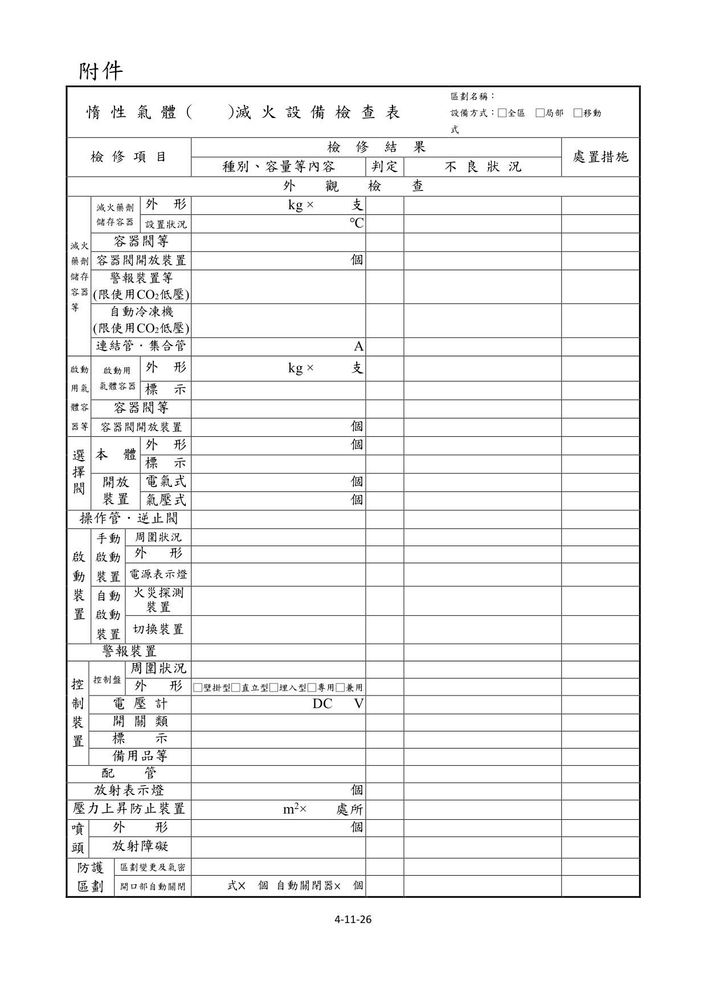
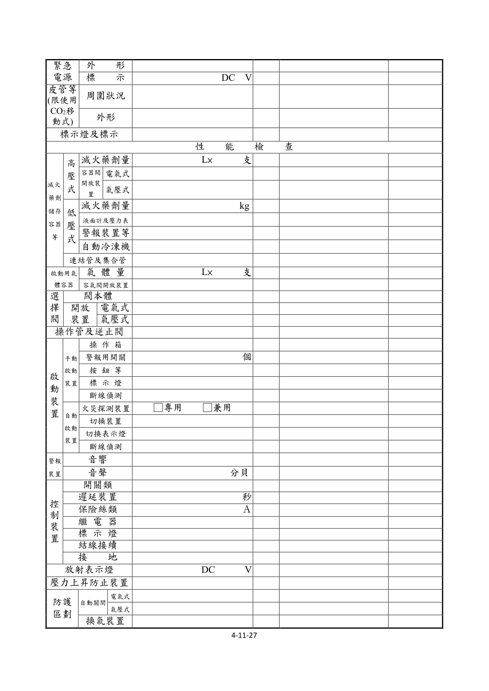
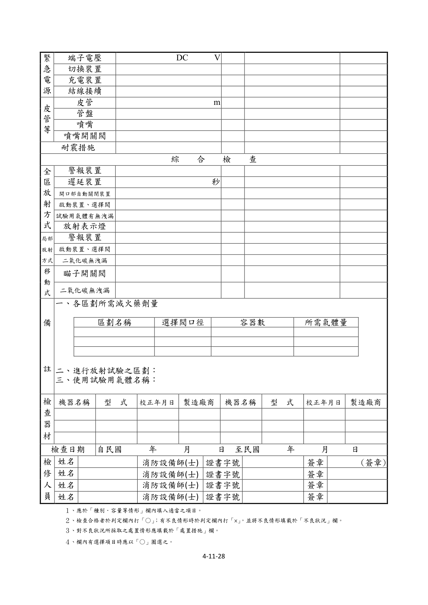
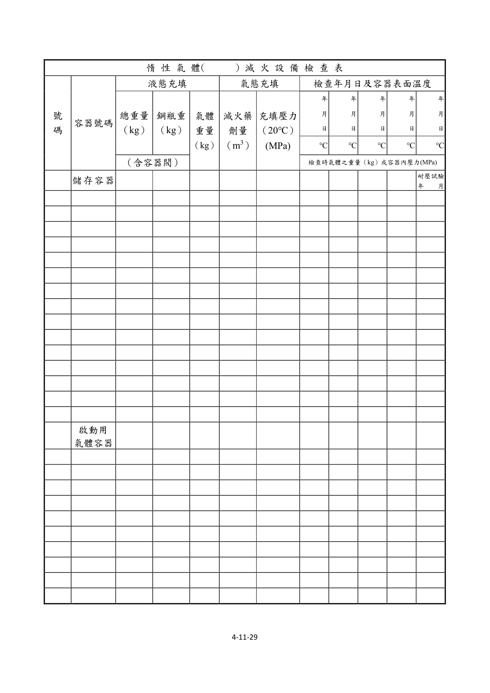

# 消防安全設備及必要檢修項目檢修基準　第十一章　惰性氣體滅火設備

> 版本日期：民國 114 年 1 月 9 日（修正）｜來源：內政部主管法規共用系統（glrs.moi.gov.tw，GL001285）PDF 轉換。114-01-09 修正六章：第一、九、十三、十七、十九、二十七章（其中第一、九、十九章之修正內容在檢修報告表／檢查表與附圖）。
>
> 📌 **免責聲明**：本檔由官方來源轉換與人工整理，可能有轉換或辨識誤差。**一切以主管機關（全國法規資料庫、內政部消防署）公告之現行版本為準**；如有疑義，以官方公告為主。後續 AI 代理人引用本檔時應主動提醒使用者此點，並於必要時自行上網查證正確版本。
>
> 🛈 表格與表單已依原始 PDF 線框以 `scripts/pdf_tables_extract.py` 重新辨識為結構化內容（issue #41）：編號附表為 Markdown 表格或逐列樹狀展開；章末檢修報告表／檢查表**不辨識文字**，改以原始 PDF 頁面截圖（PNG）嵌入；內文附圖與表內圖示亦以 PDF 截圖嵌入（圖檔與本檔同資料夾、檔名前綴同本檔）。表格數值／○×標記可能有辨識誤差，關鍵判斷請核對原始 PDF。
>
> 📎 原始 PDF（全文，114-01-09 版）：[消防安全設備及必要檢修項目檢修基準.PDF](../附件/消防安全設備及必要檢修項目檢修基準/消防安全設備及必要檢修項目檢修基準.PDF)

一、外觀檢查

（一）惰性氣體滅火藥劑儲存容器等

１、滅火藥劑儲存容器

檢查方法

外形

（A）以目視確認儲存容器、固定架、各種計量儀器有無變形、腐蝕等情形。

（B）以目視確認容器本體是否確實固定於固定架上。

（C）對照設計圖面，確認設置之鋼瓶數。

設置狀況

（A）確認設在專用鋼瓶室之鋼瓶，應有適當之固定措施；設於防護區域內之鋼瓶，應置於不燃性或難燃性材料製成之防護箱內。

（B）確認設置場所是否設有照明設備、明亮窗口，及周圍有無障礙物。並確認是否確保供操作及檢查之空間。

（C）確認周圍濕度有無過高，及周圍溫度是否在 40℃以下。

（D）確認有無遭日光曝曬、雨水淋濕之虞。

判定方法

外形

（A）應無變形、損傷、明顯腐蝕、生鏽或塗裝剝離等情形。

（B）以推押容器之方式，確認容器本體應確實固定在固定架或底座上。

（C）容器瓶數依規定數量設置。

設置狀況

（A）設在在專用鋼瓶室之鋼瓶，應有適當之固定措施；但設於防護區域內時，應置於不燃性或難燃性材料製成之防護箱內。

（B）具適當採光，且應無檢查及使用上之障礙。

（C）具濕度未過高，且溫度在 40℃以下。

（D）應無遭日光曝曬、雨水淋濕之虞。

２、容器閥等

檢查方法

以目視確認容器閥有無變形、腐蝕等情形。

判定方法

無變形、破損、明顯腐蝕等情形。

３、容器閥開放裝置

檢查方法

以目視確認容器閥開放裝置有無變形、脫落等情形。

判定方法

容器閥開放裝置應確實裝接於容器閥本體上，如為電氣式者，導線應無劣化或斷裂，如為氣壓式者，操作管及其連接部分應無鬆弛或脫落之情形。具有手動啟動裝置之開放裝置，其操作部應無明顯之銹蝕情形。應裝設有安全栓或安全插梢 (限有該裝置者)。

注意事項

檢查時，為防止產生誤放事故，請勿予以強烈之衝擊。

４、警報裝置及安全裝置等（限二氧化碳滅火設備低壓式者）

（１）檢查方法

A.設於低壓式儲存容器之警報用接點壓力表、壓力開關等，以目視確認其不得有變形、損傷等情形。

B.應以目視確認安全裝置、破壞板等不得有損傷等情形。

（２）判定方法

A.壓力警報裝置沒有變形、損傷或脫落等情形。

B.安全裝置等沒有損傷、異物阻塞等情形。

５、自動冷凍機（限二氧化碳滅火設備低壓式者）

（１）檢查方法A 以目視確認各種配管及本體有無變形、腐蝕等情形。

B.以目視確認冷凍機之底架有無鬆弛情形，且是否確實固定。

C.設於安全閥、洩放閥及壓力表等裝置之閥類，應確認其是否處於「開」之狀態。

D.確認其有無漏油之情形。

（２）判定方法

A.各種配管及本體應無變形、損傷、龜裂、塗裝剝離或明顯腐蝕等情形。

B.冷凍機之底架應確實固定。

C.安全閥等閥體應處於「開」之位置。

D.應無漏油之情形。

６、連結管及集合管

檢查方法

以目視確認有無變形、腐蝕等情形，及是否確實連接。

判定方法

應無變形、損傷、明顯腐蝕等情形，並應確實連接。

啟動用氣體容器等

１、啟動用氣體容器

檢查方法

外形

（A）以目視確認有無變形、腐蝕等情形，及是否裝設有容器收存箱。

（B）確認收存箱之箱門或類似開閉裝置之開關狀態是否良好。

標示

確認收存箱之表面是否設有記載該防護區劃名稱或防護對象物名稱及操作方法。

判定方法

外形

（A）應無變形、損傷、塗裝剝離或明顯腐蝕等情形，且收存箱及容器應確實固定。

（B）收存箱之箱門開關狀態應良好。

標示

應無損傷、脫落、污損等情形。

２、容器閥

檢查方法

以目視確認容器閥有無變形、腐蝕等情形。

判定方法

應無變形、損傷、明顯腐蝕等情形。

３、容器閥開放裝置

檢查方法

以目視確認容器閥開放裝置有無變形、脫落等情形。

判定方法

容器閥開放裝置應確實裝接在容器閥本體上，如為電氣式者，導線應無劣化或斷裂，如為氣壓式者，操作管及其連接部分應無鬆弛或脫落之情形。具有手動啟動裝置之開放裝置，其操作部應無明顯之鏽蝕情形。應裝設有安全栓或安全插梢。

注意事項

檢查時，為防止產生誤放事故，請勿予以強烈之衝擊。

選擇閥

１、本體

檢查方法

外形

以目視確認選擇閥有無變形、腐蝕等情形，且是否設於防護區域以外之處所。

標示

應確認其附近是否標明選擇閥之字樣及所屬防護區域或防護對象名稱，且是否設有記載操作方法之標示。

判定方法

外形

應無變形、損傷、明顯腐蝕等情形，且應設於防護區域以外之處所。

標示

應無損傷、脫落、污損等情形。

２、開放裝置

檢查方法

以目視確認有無變形、脫落等情形，及是否確實裝設在選擇閥上。

判定方法

應無變形、損傷、脫落等情形，且確實裝接在選擇閥上。

操作管及逆止閥

１、檢查方法以目視確認有無變形、損傷等情形，及是否確實連接。核對設計圖面，確認逆止閥裝設位置、方向及操作管之連接路徑是否正常。

２、判定方法應無變形、損傷、明顯腐蝕等情形，且已確認連接。依設計圖面裝設配置。

啟動裝置

１、手動啟動裝置

檢查方法

周圍狀況

（A）確認操作箱周圍有無檢查及使用上之障礙，及設置位置是否適當。

（B）確認啟動裝置及其附近有無標示所屬防護區域名稱或防護對象名稱與標示操作方法、及其保安上之注意事項是否適當。

（C）確認啟動裝置附近有無「手動啟動裝置」標示。

外形

（A）以目視確認操作箱有無變形、脫落等現象。

（B）確認箱面紅色之塗裝有無剝離、污損等現象。

電源表示燈確認有無亮燈及其標示是否正常。

（２）判定方法

A.周圍狀況

（A）其周圍應無檢查及使用上之障礙，並應設於能看清區域內部且操作後能容易退避之防護區域附近。

（B）標示應無損傷、脫落、污損等現象。

外形

（A）操作箱應無變形、損傷、脫落等現象。

（B）紅色塗裝應無剝離、污損等現象電源標示燈保持亮燈，且該標示應有所屬防護區域名稱、防護對象物名稱。

２、自動啟動裝置

檢查方法

火災探測裝置準用火警自動警報設備之檢查要領確認之。

自動、手動切換裝置

（A）以目視確認有無變形、脫落等情形，及其切換位置是否正常。

（B）確認自動、手動及操作方法之標示是否正常。

判定方法

A.火災探測裝置準用火警自動警報設備之檢查要領確認之。

B.自動、手動切換裝置

（A）應無變形、損傷、脫落等情形，且切換位置須處於定位。

（B）標示應無污損、模糊不清之情形。

警報裝置

１、檢查方法以目視確認語音（揚聲器）、蜂鳴器、警鈴等警報裝置有無變形、脫落等現象。平時無人駐守者之防火對象物等處所，確認是否設有音聲警報裝置。使用二氧化碳氣體全區域放射方式者，確認音響警報裝置是否採用人語發音。確認有無設有「音響警報裝置」之標示。

２、判定方法警報裝置應無變形、損傷、脫落等情形。平時無人駐守者之防火對象物等處所，應以語音為警報裝置。使用二氧化碳氣體全區域放射方式者，音響警報裝置應採用人語發音。

警報裝置之標示正常並應設於必要之處所，且無損傷、脫落、污損等情形。

控制裝置

１、檢查方法控制盤

A.周圍狀況確認周圍有無檢查及使用上之障礙。外形以目視確認有無變形、腐蝕等現象。電壓計以目視確認有無變形、破損等情形。確認電源電壓是否正常。開關類以目視確認有無變形、損傷等情形，及開關位置是否正常。

標示

確認標示是否正常。備用品等確認是否備有保險絲、燈泡等備用品及回路圖、操作說明書等。

２、判定方法控制盤

A.周圍狀況應設於不易受火災波及之位置，且其周圍應無檢查及使用上之障礙。外形應無變形、損傷、明顯腐蝕等現象。

（２）電壓計應無變形、損傷等情形。電壓計之指示值在規定範圍內。無電壓計者，其電源表示燈應亮燈。開關類應無變形、損傷、脫落等情形，且開關位置正常。標示開關等之名稱應無污損、模糊不清等情形。面板不得剝落。

備用品等

A.應備有保險絲、燈泡等備用品。

B.應備有回路圖、操作說明書等。

配管

１、檢查方法管及接頭以目視以目視確認有無損傷、腐蝕等情形，且有無供作其他物品之支撐或懸掛吊具。金屬支撐吊架以目視及手觸摸等方式，確認有無脫落、彎曲、鬆弛等情形。

２、判定方法管及管接頭應無損傷、明顯腐蝕等情形。應無作為其他物品之支撐或懸掛吊具。金屬支撐吊架應無脫落、彎曲、鬆弛等情形。

放射表示燈

１、檢查方法以目視確認防護區劃出入口處，設置之放射表示燈有無變形、腐蝕等情形。

２、判定方法放射表示燈之設置場所正常，且應無變形、損傷、明顯腐蝕、文字模糊不清等情形。壓力上昇防止裝置（使用二氧化碳氣體者除外）

１、檢查方法以目視確認設置之壓力上昇防止裝置有無變形、損傷、腐蝕等情形及是否正確設置。

２、判定方法壓力上昇防止裝置應無變形、損傷、明顯腐蝕等情形及正確設置。

噴頭

１、外形

檢查方法

以目視確認有無變形、腐蝕等現象。

判定方法

應無變形、損傷、明顯腐蝕、阻塞等情形。

２、放射障礙

檢查方法

以目視確認周圍有無造成放射障礙之物品，及裝設角度是否正常。

判定方法周圍應無造成放射障礙之物品。噴頭之裝設應能將藥劑擴散至整個防護區域或防護對象物，且裝設角度應無明顯偏移之情形。

防護區劃

１、區劃變更及氣密

檢查方法

A.滅火設備設置後，有無因增建、改建、變更等情形，造成防護區劃之容積及開口部增減之情形，應核對設計圖面確認之。

B.局部放射方式者，其防護對象物之形狀、數量、位置等有無變更，應核對設計圖面確認之。

C.附門鎖之開口部，應以手動方式確認其開關狀況。

D.滅火設備設置後，有無因增設管（道）線造成氣密降低之情形，以目視確認有無明顯漏氣之開口。

判定方法

A.開口部不得設於面對安全梯、特別安全梯或緊急昇降機間。

B.防護區劃之開口部，因有降低滅火效果之虞或造成保安上之危險，應設有自動關閉裝置。使用二氧化碳氣體者，位於防護區域自樓地板起高度三分之二以下之開口部，均應設置自動關閉裝置。

C.使用二氧化碳氣體者，未設自動關閉裝置之開口部總面積，供電信機械室使用時，應在圍壁面積百分之一以下，其他處所則應在防護區域體積值或圍壁面積值兩者中較小數值百分之十以下。

D.設有自動門鎖者，應符合下列規定。

（A）應裝置完整，且門之關閉確實順暢。

（B）應無門檔、障礙物等物品，且平時保持關閉狀態。

E.防護區劃內無因增設管（道）線造成明顯漏氣之開口。

２、開口部之自動關閉裝置

檢查方法

以目視確認有無變形、損傷等情形。

判定方法

應無變形、損傷、明顯腐蝕等情形。緊急電源（限內置型者）

１、外形

檢查方法

以目視確認蓄電池本體周圍之狀況，有無變形．損傷、洩漏、腐蝕等現象。

判定方法設置位置之通風換氣應良好，且無灰塵、腐蝕性氣體之滯留及明顯之溫度變化等情形。蓄電池組支撐架應堅固。應無明顯變形、損傷、龜裂等情形。電解液應無洩漏，且導線連接部應無腐蝕之情形。

２、標示

檢查方法

確認是否正常設置。

判定方法

應標示額定電壓值及容量。

（十四）皮管、管盤、瞄子及瞄子開關閥(限使用二氧化碳氣體移動式)

１、周圍狀況

（１）檢查方法確認設置場所是否容易接近，且周圍有無妨礙操作之障礙物。

（２）判定方法周圍應無檢查及使用上之障礙。

２、外形

（１）檢查方法以目視確認收捲狀態之皮管有無變形、腐蝕等現象。

（２）判定方法

A.皮管應整齊收捲於管盤上，且皮管應無變形、明顯龜裂等老化現象。

B.皮管、管盤、瞄子及瞄子開關閥應無變形、損傷、顯著腐蝕等情形，且瞄子開關閥應在「關」之位置。

（十五）標示燈及標示(限使用二氧化碳氣體移動式)

１、檢查方法確認標示燈「移動式二氧化碳滅火設備」之標示，是否正常設置。

２、判定方法

（１）標示燈應無變形、損傷等情形，且正常亮燈。

（２）標示應無損傷、脫落、污損等情形。

二、性能檢查

（一）惰性氣體滅火藥劑儲存容器等(使用低壓二氧化碳氣體者除外)

１、滅火藥劑量

檢查方法

依下列方法確認之。

使用台秤測定計之方法。

（A）將裝設在容器閥之容器閥開放裝置、連接管、操作管及容器固定器具取下。

（B）將容器置於台秤上，測定其重量計算至小數點第一位。

（C）藥劑量則為測定值扣除容器閥及容器重量後所得之值。

使用水平液面計之方法

（A）插入水平液面計電源開關，檢查其電壓值。

（B）使容器維持平常之狀態，將容器置於液面計探針與放射源之間。

（C）緩緩使液面計檢出部上下方向移動，當發現儀表指針振動差異較大時，由該位置即可求出自容器底部起之藥劑存量高度。

（D）液面高度與藥劑量之換算，應使用專用之換算尺為之。

使用鋼瓶液面計之方法

（A）打開保護蓋緩慢抽出表尺。

（B）當表尺被鋼瓶內浮球之磁性吸引而停頓時，讀取表尺刻度。

（C）對照各廠商所提供之專用換算表讀取藥劑重量。

（D）需考慮溫度變化造成之影響。以其他原廠技術手冊規範之藥劑量檢測方式量測。

判定方法

將藥劑量之測定結果與重量表或圖面明細表核對，其差值應在充填值10％以下。

注意事項

以水平液面計測定時

（A）不得任意卸取放射線源（鈷 60），萬一有異常時，應即時連絡專業處理單位。

（B）鈷 60 有效使用年限約為 3 年，如已超過時，應即時連絡專業單位處理或更換。

（C）使用具放射源者，應經行政院原子能源委員會許可登記。

共同事項

（A）因容器重量頗重（約 150 kg），有傾倒或操作時應加以注意。

（B）測量後，應將容器號碼、充填量記載於重量表、檢查表上。

（C）當滅火藥劑量或容器內壓減少時，應迅即進行調查，並採取必要之措施。.

（D）二氧化碳滅火設備之充填比應在 1.5 以上。

（E）使用具放射源者，應取得行政院原子能委員會之許可登記。

２、容器閥開放裝置電氣式容器閥之開放裝置檢查方法

（A）將裝設在容器閥之容器閥開放裝置取下，確認撞針、切割片或電路板有無彎曲、斷裂或短缺等情形。

（B）操作手動啟動裝置，確認電氣動作是否正常。

（C）拔下安全栓或安全插銷，以手動操作，確認動作是否正常。

（D）動作後之復歸，應確認於切斷通電或復舊操作時，是否可正常復歸定位。

（E）取下端子部之護蓋，以螺絲起子確認端子有無鬆弛現象。

（F）將容器閥開放裝置回路從主機板離線以確認其斷線偵測功能。

判定方法

（A）撞針、切割片或電路板應無彎曲、斷裂或短缺等情形。

（B）以規定之電壓可正常動作，並可確實以手動操作。

（C）應可正常復歸。

（D）應無端子鬆動、導線損傷、斷線等情形。

（E）將回路線離線時主機應發出斷線故障訊號。

注意事項

操作手動啟動裝置時，應將所有電氣式容器閥開放裝置取下。

氣壓式容器閥之開放裝置

檢查方法

（A）將裝設在容器閥之容器閥開放裝置取下，確認活塞桿或撞針有無彎曲、斷裂或短缺等情形。

（B）具有手動操作功能者，將安全栓拔下，以手動方式使其動作，確認撞針之動作，彈簧之復歸動作是否正常。

判定方法

（A）活塞桿、撞針應無彎曲、斷裂或短缺等情形。

（B）動作及復歸動作應正常。

３、連結管及集合管

檢查方法

以板手確認連接部位有無鬆動之情形判定方法連接部位應無鬆動之情形。

（二）使用低壓二氧化碳氣體滅火藥劑儲存容器等

１、滅火藥劑量

（１）檢查方法以液面計確認藥劑是否依規定量充填。

（２）判定方法藥劑儲存量應在規定量以上。

２、液面計及壓力表

（１）檢查方法

A.確認有無變形、損傷等情形，並以肥皂水測試連接部分是否有洩漏等現象。

B.確認各種壓力表是否指示在規定之壓力值。

（２）判定方法

A.應無變形、損傷、洩漏等情形。

B.指示值應正常。

３、警報裝置及安全裝置等

（１）檢查方法暫時將開關閥關閉，取下附接點之壓力表、壓力開關及安全閥等，使用試驗用氮氣確認其動作有無異常。

（２）判定方法警報裝置等應在下列動作壓力範圍內動作，且功能正常。

- 37 kgf/cm²　破壞板動作壓力
- 30 kgf/cm²　破壞板動作壓力
- 25 kgf/cm²　安全閥起噴壓力
- 23 kgf/cm²　壓力上升警報
- 22 kgf/cm²　冷涷機啟動（常用壓力範圍）
- 21 kgf/cm²　冷涷機停止（常用壓力範圍）
- 19 kgf/cm²　壓力下降警報

（３）注意事項檢查後，務必將安全閥、壓力表之開關置於「開」之位置。

４、自動冷凍機

（１）檢查方法

A.冷凍機啟動．停止功能之檢查，應依前項 3 之規定，使接點壓力表動作，確認其運轉狀況是否正常。

B.冷媒管路系統，應以肥皂水測試，確認其有無洩漏之情形。

C.冷媒管路系統中裝設有液態氨者，須確認運轉中液態氨白色泡沫之發生狀態。

（２）判定方法

A.冷凍機應正常運轉。

B.冷凍機運轉中，不得發現白色泡沫持續發生 1～2 分鐘以上。

５、連結管及集合管

（１）檢查方法以扳手確認連接部分有無鬆動之情形。

（２）判定方法連接部分應無鬆動現象。

（三）啟動用氣體容器等

１、氣體量

檢查方法

依下列規定確認之。將裝在容器閥之容器閥開放裝置、操作管卸下，自容器收存箱中取出。使用可測定達 20 kg之彈簧秤或秤重計，測量容器之重量。核對裝設在容器上之面板或重量表所記載之重量。

判定方法

二氧化碳或氮氣之重量，其記載重量與測得重量之差值，應在充填量 10％以下。

２、容器閥開放裝置

檢查方法

電氣式者，準依前（一）之 2 之（1）之 A 規定確認之。手動式者，應將容器閥開放裝置取下，以確認活塞桿或撞針有無彎曲、斷裂或短缺等情形，及手動操作部之安全栓或封條是否能迅速脫離。

判定方法

活塞桿、撞針等應無彎曲、斷裂或短缺等情形。應可確實動作。

（四）選擇閥

１、閥本體

檢查方法

以扳手確認連接部分有無鬆動等現象。以試驗用氣體確認其功能是否正常。

判定方法

連接部分不得有鬆弛等情形，且性能應正常。

２、開放裝置電氣式選擇閥開放裝置

檢查方法

（A）取下端子部之護蓋，確認末端處理、結線接續之狀況是否正常。

（B）操作供該選擇閥使用之啟動裝置，使開放裝置動作。

（C）啟動裝置復歸後，在控制盤上切斷電源，以拉桿復歸方式，使開放裝置復歸。

（D）以手動操作開放裝置，使其動作後，依前（C）之同樣方式使其復歸。

判定方法

（A）以端子盤連接者，應無端子螺絲鬆動，及端子護蓋脫落等現象。

（B）以電氣操作或手動操作均可使其確實動作。

（C）選擇閥於「開」狀態時，拉桿等之扣環應成解除狀態。

注意事項

與儲存容器之電氣式開放裝置連動者，應先將開放裝置自容器閥取下。

氣壓式選擇閥開放裝置

檢查方法

（A）使用試驗用二氧化碳容器（內容積 1 公升以上，二氧化碳藥劑量 0.6 kg以上），自操作管連接部加壓，確認其動作是否正常。

（B）移除加壓源時，選擇閥由彈簧之動作或操作拉桿，確認其有無復歸。

判定方法

（A）活塞桿應無變形、損傷之情形，且動作確實。

（B）選擇閥於「開」狀態時，確認插梢應呈突出狀態，且拉桿等之扣環應成解除狀態。

注意事項

實施加壓試驗時，操作管連接於儲存容器開放裝置者，應先將開放裝置自容器閥取下

（五）操作管及逆止閥

１、檢查方法以扳手確認連接部分有無鬆弛等現象。取下逆止閥，以試驗用氣體確認逆止閥功能有無正常。

２、判定方法連接部分應無鬆動等現象。逆止閥之功能應正常。

（六）啟動裝置

１、手動啟動裝置操作箱

檢查方法

由開、關操作確認箱門是否能確實開關。

判定方法箱門應能確實開、關。警報用開關檢查方法打開箱門，確認警報用開關不得有變形、損傷等情形，及警報裝置有無正常鳴響。

判定方法

（A）操作箱之箱門打開時，該系統之警報裝置應能正常鳴響。

（B）應無變形、損傷、脫落、端子鬆動、導線損傷、斷線等現象。

注意事項

警報用開關與操作箱之箱門間未設有微動開關者，當操作警報用按鈕時，警報裝置應能正常鳴響。

按鈕等

檢查方法

（A）將藥劑儲存容器或啟動用氣體容器之容器閥開放裝置自容器閥取下，打開操作箱箱門，確認按鈕等有無變形、損傷等情形。

（B）操作該操作箱之放射用啟動按鈕或放射用開關，以確認其動作狀況。

（C）再進行上述試驗，於遲延裝置之時間範圍內，當操作緊急停止按鈕或緊急停止裝置時，確認容器閥開放裝置是否動作。

判定方法

（A）應無變形、損傷、端子鬆動等情形。

（B）放射用啟動按鈕應於警報音響動作後始可操作。

（C）操作放射用啟動按鈕後，遲延裝置開始動作，電氣式容器閥開放裝置應正常動作。

（D）緊急停止功能應正常。標示燈檢查方法操作開關，以確認有無亮燈。

判定方法

應無明顯之劣化情形，且應正常亮燈。斷線偵測檢查方法將手動啟動裝置回路線從控制主機板離線。

判定方法

將回路線離線時主機應發出斷線故障訊號。

２、自動啟動裝置

火災探測裝置

檢查方法及判定方法

有關其檢查，準用火警自動警報設備之檢查要領確認之。

注意事項

受信總機或專用控制盤上之自動、手動切換裝置，應置於「手動」之位置。

自動、手動切換裝置

檢查方法

（A）將儲存容器用或啟動氣體容器用之容器閥開放裝置自容器閥取下。

（B）如為「自動」時，將切換裝置切換至「自動」之位置，使探測器或受信總機內探測器回路之端子短路。

（C）如為「手動」時，將切換裝置切換至「手動」之位置，使探測器或受信總機內探測器回路之端子短路。

（D）應依每一防護區域或防護對象物分別確認其功能。

判定方法

下列功能應正常。

（A）如為「自動」時

a.警報裝置鳴動。

b.火警表示燈亮燈。

c.遲延裝置動作。

d.通風換氣裝置停止。

e.容器閥開放裝置動作。

（B）如為「手動」時

a.警報裝置鳴動。

b.火警表示燈亮燈。

注意事項

（A）檢查時應一併進行警報裝置、控制裝置之性能檢查。

（B）使裝置動作時，應先將容器閥開放裝置取下才進行。自動、手動切換表示燈檢查方法確認是否能正常亮燈。

判定方法

應無明顯劣化之情形，且應正常亮燈。斷線偵測檢查方法將自動啟動裝置回路線從控制主機板離線。

判定方法

將回路線離線時主機應發出斷線故障訊號

（七）警報裝置

１、音響警報

檢查方法

每一防護區域或防護對象物，應進行探測器或手動啟動裝置之警報操作，以確認有無正常鳴動。音量應使用噪音計測定之。

判定方法

每一防護區域或防護對象物之警報系統應正確，且距警報裝置一公尺處之音量應在九十分貝以上。

２、音聲警報（語音警告）檢查方法依前項檢查要領，連續進行兩次以上，在發出正常之警鈴等警告音響後，確認有無發出語音警報。

判定方法

警報系統動作區域正確，且距揚聲器一公尺處之音量應在九十分貝以上。語音警報啟動後，須先發出警鈴等警告音響，再播放退避之語音內容。

（八）控制裝置

１、開關類

檢查方法

以螺絲起子及開關操作確認端子有無鬆動，及開關功能是否正常。

判定方法

端子應無鬆動，且無發熱之情形。應可正常開、關。

２、遲延裝置

檢查方法

遲延裝置之動作時限，應依前（六）之啟動裝置檢查方法進行檢查，操作啟動按鈕後，測定至容器閥開放裝置動作所需時間。

判定方法

動作時限應在二十秒以上，且在設計時之設定值範圍內。

注意事項

使裝置動作時，應先將容器閥開放裝置取下才進行。

３、保險絲類

檢查方法

確認有無損傷、熔斷之情形及是否為規定之種類及容量。

判定方法應無損傷、熔斷之情形。應依回路圖上所示之種類及容量設置。

４、繼電器

檢查方法

確認有無脫落、端子鬆動、接點燒損、灰塵附著等情形，並藉由開關之操作，使繼電器動作，以確認其功能。

判定方法

應無脫落、端子鬆動、接點燒損、灰塵附著等情形。應正常動作。

５、標示燈

檢查方法

由開關操作，以確認有無亮燈。

判定方法

應無明顯之劣化情形，且應正常亮燈。

６、結線接續

檢查方法

以目視及螺絲起子確認有無斷線、端子鬆動等情形。

判定方法

應無斷線、端子鬆動、脫落、損傷等情形。

７、接地

檢查方法

以目視或三用電表，確認有無腐蝕、斷線等情形。

判定方法

應無顯著腐蝕、斷線等之損傷現象。

（九）放射表示燈

１、檢查方法以手動方式使壓力開關動作，或使控制盤內之表示回路端子短路，以確認有無亮燈。

２、判定方法應正常亮燈。

（十）壓力上昇防止裝置

１、檢查方法施以設計動作壓力，確認壓力上昇防止裝置能否正常動作開啟。

２、判定方法壓力上昇防止裝置應能正常動作開啟。

（十一）防護區劃

１、自動關閉裝置以電氣動作者（鐵捲門、馬達、閘板）檢查方法操作手動啟動裝置，確認自動關閉裝置之關閉狀態有無異常。

判定方法

（A）各自動關閉裝置均應確實動作，且於遲延裝置之動作時限內達到關閉狀態。

（B）對於設在出入口之鐵捲門，或無其他出入口可退避者，應設有當操作啟動按鈕後，於延遲時間內可完全關閉之遲延裝置，及鐵捲門關閉後，滅火藥劑方能放射出之構造。

注意事項

操作手動啟動裝置時，應先將容器閥開放裝置取下後再進行。以氣壓動作者（閘板等）檢查方法

（A）使用試驗用氣體（試驗用啟動氣體、氮氣或空氣），連接通往自動關閉裝置之操作管。

（B）釋放試驗用氣體，確認自動關閉裝置之關閉狀態有無異常。

（C）確認有無氣體自操作管、自動關閉裝置洩漏，自動關閉裝置於釋放加壓壓力後有無自動復歸，及其復歸狀態是否異常。

判定方法

（A）所有自動關閉裝置均應能確實動作。

（B）如為復歸型者，應能確實復歸。

注意事項

使用氮氣或空氣時，應加壓至大約30kgf/cm²。

２、換氣裝置

檢查方法

操作手動啟動裝置，確認換氣裝置於停止狀態時有無異常。

判定方法

所有換氣裝置，應於遲延裝置之動作時限範圍內確實保持停止狀態。

注意事項

操作手動啟動裝置時，應先將容器閥開放裝置取下後再進行。換氣裝置如與滅火後之滅火藥劑排出裝置共用時，應自防護區域外進行復歸運轉。

（十二）緊急電源（限內置型者）

１、端子電壓

檢查方法

以電壓計測定確認充電狀態通往蓄電池充電回路之端子電壓。操作電池試驗用開關，由電壓計確認其容量是否正常。

判定方法

應於充電裝置之指示範圍內。操作電池試驗用開關約三秒，該電壓計安定時之容量，應在電壓計之規定電壓值範圍內。

注意事項

進行容量試驗時，約三秒後，俟電壓計之指示值穩定，再讀取數值。

２、切換裝置

檢查方法

切斷常用電源，以電壓計或由電源監視用表示燈確認電源之切換狀況。

判定方法

緊急電源之切換可自動執行。復舊狀況正常。

３、充電裝置

檢查方法

以三用電表確認變壓器、整流器等之功能。

判定方法

變壓器、整流器等應無異常聲音、異臭、異常發熱、顯著灰塵或損傷等情形。電流計或電壓計應指示在規定值以上。具有充電電源監視燈者，應正常亮燈。

４、結線接續

檢查方法

以目視及螺絲起子確認有無斷線、端子鬆動等情形。

判定方法

應無斷線、端子鬆動、脫落、損傷等情形。

（十三）皮管、管盤、噴嘴及噴嘴開關閥(限使用二氧化碳氣體移動式)

1、皮管

（１）檢查方法

A.自管盤將皮管取出，旋轉皮管與金屬接頭部分，確認其有無鬆動現象。

B.確認整條皮管有無因老化產生割裂或明顯龜裂等現象。

C.自皮管接頭至噴嘴之長度，應確認是否維持設置時之狀態。

（２）判定方法皮管連接部應無鬆動，皮管損傷、老化等情形，且皮管長度應在二十公尺以上。

２、管盤

（１）檢查方法取出皮管，確認其是否可容易收捲。

（２）判定方法皮管之拉取、收捲應保持順暢。

３、噴嘴

（１）檢查方法

A.確認皮管、握把、噴嘴之連接部應無鬆動之情形，噴嘴有無因灰塵、塵垢而造成阻塞現象。

B.手持噴嘴握把部分，確認其有無適當之危害防止措施。

（２）判定方法噴嘴應無堵塞、顯著腐蝕等情形，握把部分應有為防止凍傷而設置之木製或合成樹脂製把手，且應無損傷、脫落之現象。

４、噴嘴開關閥

（１）檢查方法以手動操作噴嘴開關閥，確認其動作是否適當。

（２）判定方法開關閥之開關應能容易操作。

（十四）耐震措施

１、檢查方法應確認設於容許變位量較大部分之可撓式管接頭及貫穿牆、樓地板部分，有無變形、損傷等情形，及耐震措施是否恰當。以目視及螺絲起子確認儲存容器等之支撐固定架有無異常。

２、判定方法可撓式管接頭等應無變形、損傷、明顯腐蝕等情形，且貫穿牆、樓地板部分之間隙、充填部，應維持設置施工時之狀態。使用在儲存容器等之支撐固定架之錨定螺栓、螺帽，應無變形、損傷、鬆動、明顯腐蝕等情形，且支撐固定架應無損傷。

三、綜合檢查

（一）全區放射方式及局部放射方式將電源切換為緊急電源狀態，依下列各點規定進行檢查。惰性氣體滅火設備全區放射方式應依設置之系統數量進行抽樣檢查，其抽樣分配方式如表11-1例示。抽測之系統放射區域在二區以上時，應至少擇一放射區域實施放射試驗；進行放射試驗系統，應於滅火藥劑儲存容器標示放射日期。

表11-1 惰性氣體滅火設備全區放射方式之綜合檢查抽樣分配表

| 設置數量（套）＼年限 | 第1年 | 第2年 | 第3年 | 第4年 | 第5年 | 第6年 | 第7年 | 第8年 | 第9年 | 第10年 |
|---|---|---|---|---|---|---|---|---|---|---|
| 1 |  |  |  |  |  |  |  |  |  | 1 |
| 2 |  |  |  |  |  |  |  |  | 1 | 1 |
| 3 |  |  |  |  |  |  |  | 1 | 1 | 1 |
| 4 |  |  |  |  |  |  | 1 | 1 | 1 | 1 |
| 5 |  |  |  |  |  | 1 | 1 | 1 | 1 | 1 |
| 6 |  |  |  |  | 1 | 1 | 1 | 1 | 1 | 1 |
| 7 |  |  |  | 1 | 1 | 1 | 1 | 1 | 1 | 1 |
| 8 |  |  | 1 | 1 | 1 | 1 | 1 | 1 | 1 | 1 |
| 9 |  | 1 | 1 | 1 | 1 | 1 | 1 | 1 | 1 | 1 |
| 10 | 1 | 1 | 1 | 1 | 1 | 1 | 1 | 1 | 1 | 1 |
| 11 | 1 | 1 | 1 | 1 | 1 | 1 | 1 | 1 | 1 | 2 |
| 12 | 1 | 1 | 1 | 1 | 1 | 1 | 1 | 1 | 2 | 2 |
| 13 | 1 | 1 | 1 | 1 | 1 | 1 | 1 | 2 | 2 | 2 |
| 14 | 1 | 1 | 1 | 1 | 1 | 1 | 2 | 2 | 2 | 2 |
| 15 | 1 | 1 | 1 | 1 | 1 | 2 | 2 | 2 | 2 | 2 |
| 16 | 1 | 1 | 1 | 1 | 2 | 2 | 2 | 2 | 2 | 2 |
| 17 | 1 | 1 | 1 | 2 | 2 | 2 | 2 | 2 | 2 | 2 |
| 18 | 1 | 1 | 2 | 2 | 2 | 2 | 2 | 2 | 2 | 2 |
| 19 | 1 | 2 | 2 | 2 | 2 | 2 | 2 | 2 | 2 | 2 |
| 20 | 2 | 2 | 2 | 2 | 2 | 2 | 2 | 2 | 2 | 2 |
| 21 | 2 | 2 | 2 | 2 | 2 | 2 | 2 | 2 | 2 | 3 |

備註：系統設置數量超過21套者，依其比例類推分配。

１、全區放射方式

（１）檢查方法

A.高壓式者依下列規定

（A）以空氣或氮氣進行放射試驗，所需空氣量或氮氣量，應就放射區域應設滅火藥劑量之 10％核算，每公斤以表 11-2所列公升數之比例核算，每次試驗最多放出 5 支。

表11-2 惰性氣體滅火藥劑每公斤核算空氣量或氮氣量

| 滅火藥劑 | 每公斤核算空氣量或氮氣量（公升) |
|---|---|
| 二氧化碳 | 55 |
| 氮氣 | 100 |
| IG-55 | 100 |
| IG-541 | 100 |

（B）檢查時應注意下列事項

a.充填空氣或氮氣之試驗用氣體容器壓力，應與該滅火設備之儲存容器之充填壓力大約相等。

b.使用啟動用氣體容器之設備者，應準備與設置數量相同之氣體容器數。

c.應準備必要數量供塞住集合管部或容器閥部及操作管部之帽蓋或塞子。

（C）檢查前，應就儲存容器部分事先備好下列事項

a.暫時切斷控制盤等電源設備。

b.將自儲存容器取下之容器閥開放裝置及操作管連接裝設在試驗用氣體容器上。

c.除放射用儲存容器外，應取下連接管，用帽蓋等塞住集合管。除試驗用氣體容器外，應取下連接管後用帽蓋蓋住集合管部。

d.應塞住放射用以外之操作管。

e.確認除儲存容器部外，其他部分是否處於平常設置狀態。確認儲存容器部分外之其餘部分是否處於平時設置狀況。

f.控制盤等設備電源，應在「開」之位置。

（D）檢查時，啟動操作應就下列方式擇一進行

a.手動式，應操作手動啟動裝置使其啟動。

b.自動式者，應將自動、手動切換裝置切換至「自動」位置，使探測器動作、或使受信機、控制盤探測器回路端子短路，使其啟動。

B.低壓式者依下列規定

（A）應進行放射試驗，其放射試驗所需之藥劑量，為該放射區域所設滅火藥劑量之 10％以上，或使用 40 公升氮氣 5 瓶以上作為替代藥劑放射。

（B）檢查應依下列事項進行。

a.啟動裝置、警報裝置、遲延裝置、換氣裝置、自動關閉裝置（以氣壓動作者除外）等，應依前述性能檢查之要領個別實施，以確認其動作是否確實。

b.放射檢查，應依下列任一方式確認其動作是否確實。

（a）以手動操作儲存容器之放出閥或閉止閥及選擇閥，藉液面計確認其藥劑量，並放射至防護區域或防護對象物，以確認其放射系統、氣壓動作之自動關閉裝置及放射表示燈之動作狀況。

（b）使用氮氣進行時，將氮氣減壓至規定壓力值作為壓力源，連接於放射區域之選擇閥等，以手動操作選擇閥使其放射，確認氣壓動作之自動關閉裝置及放射表示燈之動作狀況。

（２）判定方法

A.警報裝置應確實鳴響。

B.遲延裝置應確實動作。

C.開口部等之自動關閉裝置應能正常動作，換氣裝置應確實停止。

D.指定防護區劃之啟動裝置及選擇閥能確實動作，可放射試驗用氣體。

E.配管內之試驗用氣體應無洩漏情形。

F.放射表示燈應確實亮燈。

（３）注意事項

A.檢查結束後，應將檢查時使用之試驗用氣體容器，換裝回復為原設置之儲存容器。

B.在未完成完全換氣前，不得進入放射區域。遇不得已之情形非進入時，應著空氣呼吸器。

C.完成檢查後，應確實將所有裝置回復定位。

２、局部放射方式

（１）檢查方法準依前1、（1）之規定進行確認。

（２）判定方法

A.警報裝置應確實鳴響。

B.指定系統之啟動裝置及選擇閥應能確實動作，且可放射二氧化碳。

C.配管內之二氧化碳應無洩漏情形。

（３）注意事項準依前1、（3）之規定。

（二）移動式(限使用二氧化碳氣體者)

１、檢查方法

（１）進行放射試驗，其所需試驗用氣體量為 5 支噴射瞄子內以該設備一具儲存容器量為之。

（２）檢查後，供藥劑再充填期間所使用之儲存容器替代設備，應準備與放射儲存容器同一型式之產品 1 支。

（３）放射用之儲存容器應處於正常狀態，其它容器，應採取適當塞住其容器閥之措施。

（４）以手動操作拉出皮管，確認放射狀態是否正常。

２、判定方法

（１）指定之容器閥開放裝置動作，皮管拉出及瞄子開關閥應無異常之情形，可正常放射二氧化碳。

（２）皮管及皮管連接部分應無二氧化碳之洩漏。

３、注意事項

（１）完成檢查後，高壓式者，應將檢查時使用之儲藏容器等換為替代容器，進行再充填。

（２）完成檢查後，應將所有裝置回復定位。

### 附件　惰性氣體滅火設備檢查表

> 本檢查表不辨識文字，改以原始 PDF 頁面截圖嵌入（共 4 頁，對應原 PDF 第 236–239 頁）；如需填寫或核對細部文字，請開啟[原始 PDF](../附件/消防安全設備及必要檢修項目檢修基準/消防安全設備及必要檢修項目檢修基準.PDF)。

