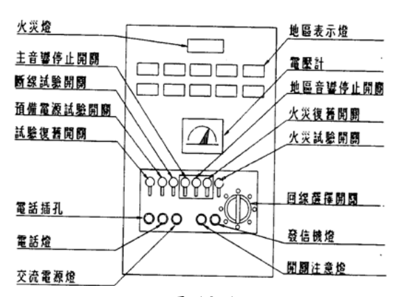
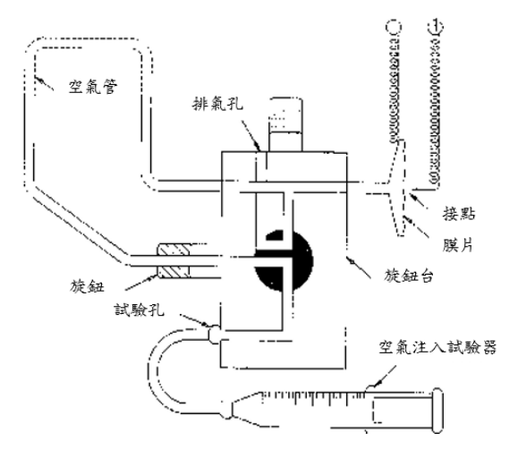
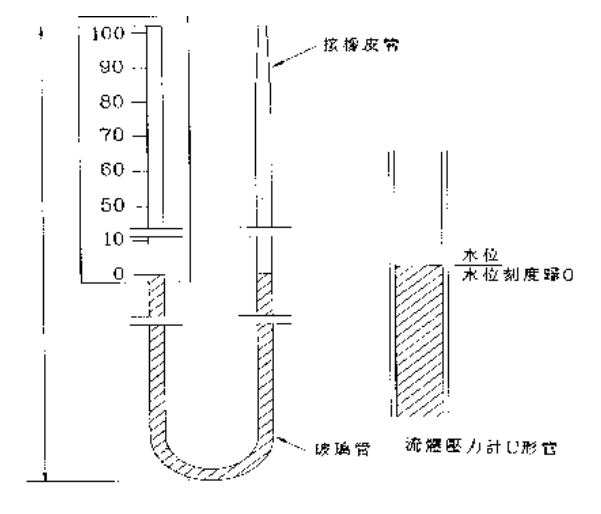
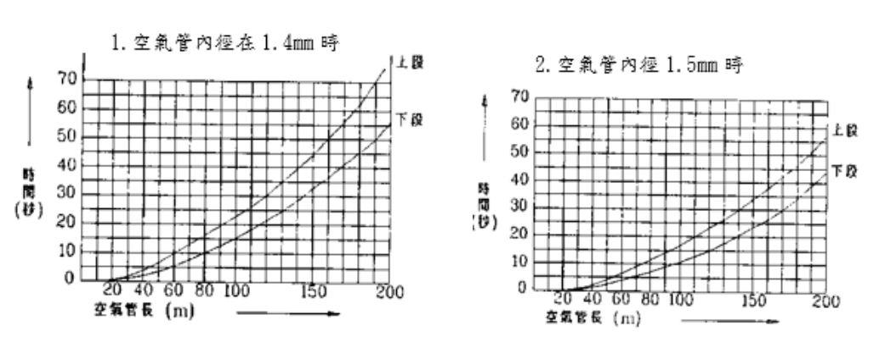
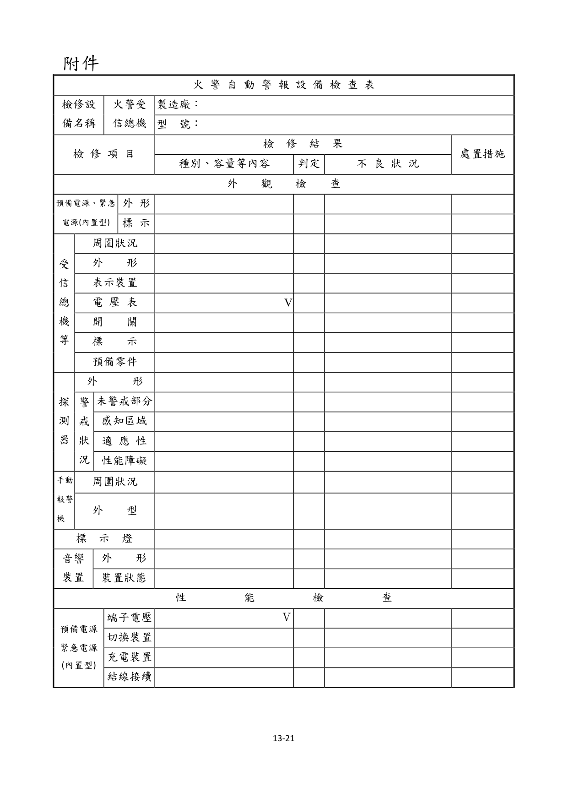
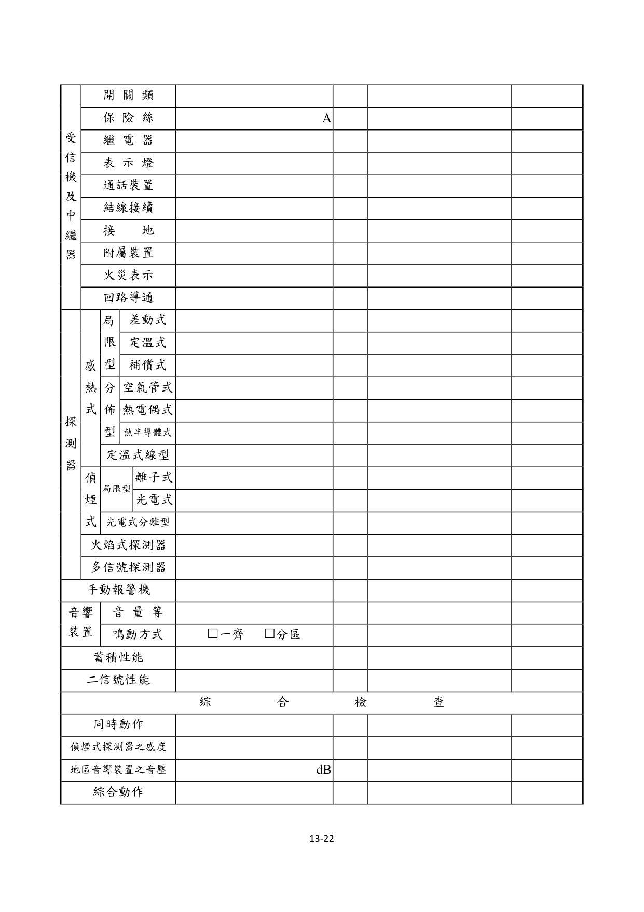
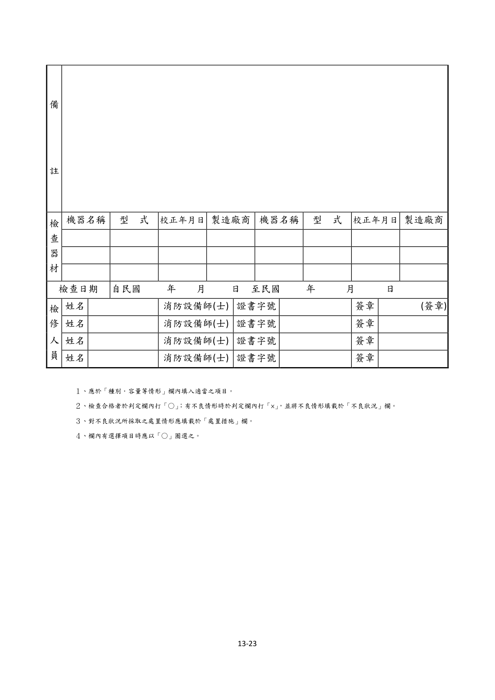
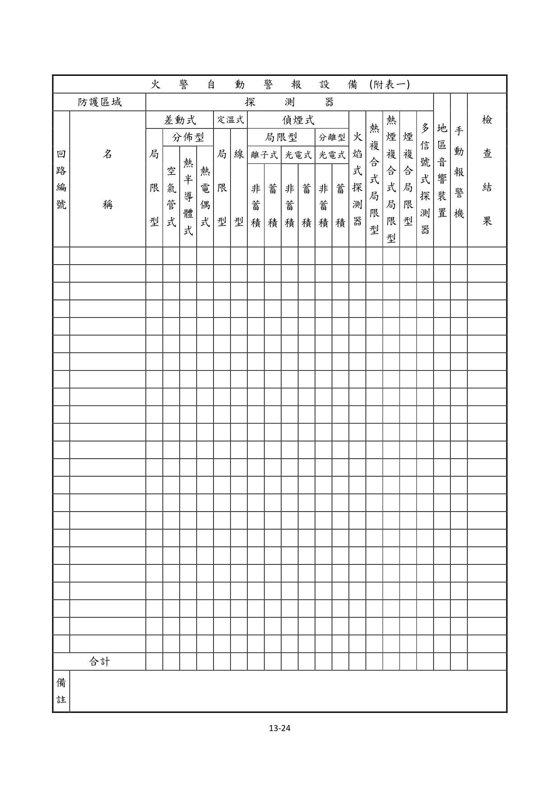
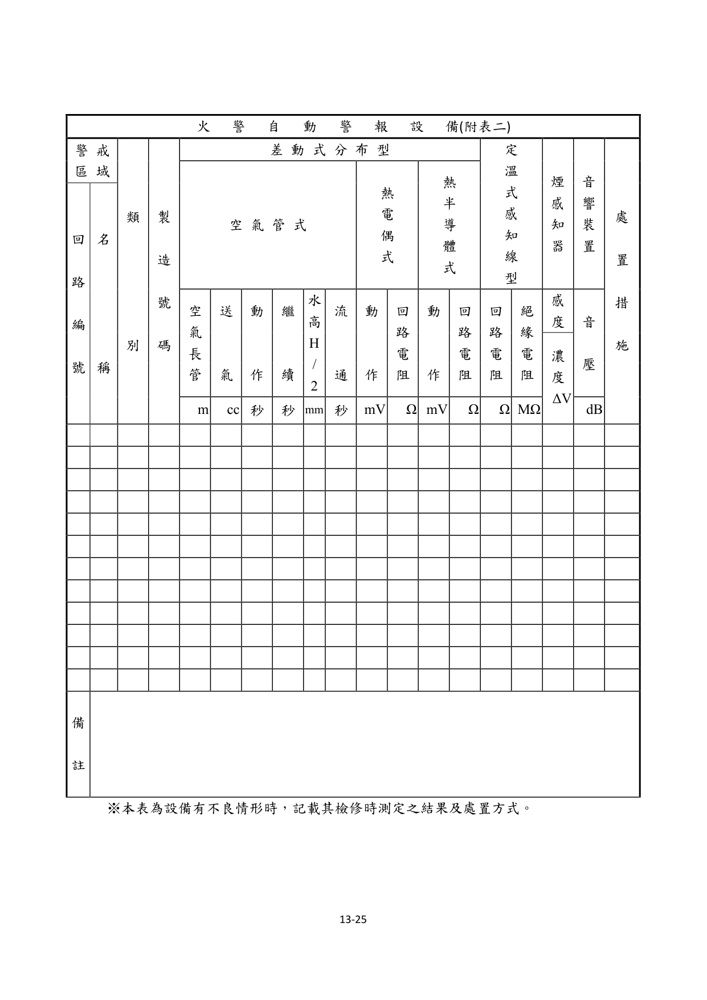

# 消防安全設備及必要檢修項目檢修基準　第十三章　火警自動警報設備

> 版本日期：民國 114 年 1 月 9 日（修正）｜來源：內政部主管法規共用系統（glrs.moi.gov.tw，GL001285）PDF 轉換。114-01-09 修正六章：第一、九、十三、十七、十九、二十七章（其中第一、九、十九章之修正內容在檢修報告表／檢查表與附圖）。
>
> 📌 **免責聲明**：本檔由官方來源轉換與人工整理，可能有轉換或辨識誤差。**一切以主管機關（全國法規資料庫、內政部消防署）公告之現行版本為準**；如有疑義，以官方公告為主。後續 AI 代理人引用本檔時應主動提醒使用者此點，並於必要時自行上網查證正確版本。
>
> 🛈 表格與表單已依原始 PDF 線框以 `scripts/pdf_tables_extract.py` 重新辨識為結構化內容（issue #41）：編號附表為 Markdown 表格或逐列樹狀展開；章末檢修報告表／檢查表**不辨識文字**，改以原始 PDF 頁面截圖（PNG）嵌入；內文附圖與表內圖示亦以 PDF 截圖嵌入（圖檔與本檔同資料夾、檔名前綴同本檔）。表格數值／○×標記可能有辨識誤差，關鍵判斷請核對原始 PDF。
>
> 📎 原始 PDF（全文，114-01-09 版）：[消防安全設備及必要檢修項目檢修基準.PDF](../附件/消防安全設備及必要檢修項目檢修基準/消防安全設備及必要檢修項目檢修基準.PDF)

一、外觀檢查

（一）預備電源與緊急電源（限內置型）

１、檢查方法

（１）外形以目視確認有無變形、腐蝕等。

（２）標示以目視確認蓄電池銘板。

２、判定方法

（１）外形

A.應無變形、腐蝕、龜裂。

B.電解液應無洩漏、導線之接續部應無腐蝕。

（２）標示應與受信機上標示之種別、額定容量及額定電壓相符。受信總機及中繼器

１、檢查方法

（１）周圍狀況確認周圍有無檢查上或使用上之障礙。

（２）外形以目視確認有無變形、腐蝕等。

（３）火警分區之表示裝置以目視確認有無污損等。

（４）電壓表

A.以目視確認有無變形、損傷等。

B.確認電源、電壓是否正常。

（５）開關以目視確認開、關位置是否正常。

（６）標示確認如圖 13-1 例示各開關名稱之標示是否正常。

圖 13-1

（７）預備零件等確認是否備有保險絲、燈泡等零件及回路圖等。

２、判定方法

（１）周圍狀況應設在經常有人之場所（中繼器除外），且應依下列保持檢查上及使用上必要之空間。

A.受信機應設在其門開關沒有障礙之位置。

B.受信機前應確保一公尺以上之空間。

C.受信機背面有門者，其背面應確保檢查必要之空間。

（２）外形應無變形、損傷、明顯腐蝕等。

（３）火警分區之表示裝置應無污損、不明顯部分。

（４）電壓表

A.應無變形、損傷等。

B.電壓表之指示值應在所定之範圍內。

C.無電壓表者，其電源表示燈應亮燈。

（５）開關開、關位置應正常。

（６）標示

A.應貼有檢驗合格證。

B.各開關之名稱應無污損、不明顯部分

C.銘板應無脫落。

（７）預備品

A.應備有保險絲、燈泡等零件。

B.應備有回路圖、操作說明書等。

C.應備有識別火警分區之圖面資料。探測器

１、檢查方法

（１）外形以目視確認有無變形、腐蝕等。

（２）警戒狀況

A.未警戒部分確認設置後有無因用途變更、隔間變更等形成之未警戒部分。

B.感知區域確認設定是否恰當。

C.適應性確認是否設置適當之探測器。

D.性能障礙以目視確認有無被塗漆，或因裝修造成妨礙熱氣流、煙流動之障礙。

２、判定方法

（１）外形應無變形、損傷、脫落、明顯腐蝕等。

（２）警戒狀況

A.未警戒部分應無設置後因用途變更、隔間變更等形成之未警戒部分。

B.感知區域

(A)火焰探測器以外之探測器應設置符合其探測區域及裝置高度之探測器之種別及個數。

(B)火焰探測器監視空間或監視距離應適當正常。

C.適應性應設置適合設置場所之探測器。

D.性能障礙

(A)應無被塗漆。

(B)光電式分離型探測器之受光部，應無日光直射等影響性能之顧慮。

(C)火焰探測器應無日光直射等影響性能之顧慮。

(D)應無因裝修造成妨礙熱氣流、煙流動之障礙。

３、注意事項

（１）不能設置偵煙式探測器或熱煙複合式局限型探測器之場所，應依表 13-1 選設。

（２）有發生誤報或延遲感知之虞處，應依表 13-2 選設。

（３）火焰探測器，其每一個被牆壁區劃之區域，由監視空間各部分到探測器之距離，應在其標稱監視距離之範圍內。

表 13-1　不能設置偵煙式探測器或熱煙複合式局限型探測器場所之探測器選設表

**場所：灰塵、粉末會大量滯留之場所**
- 具體例示：垃圾收集場、貨物堆放場、油漆室、紡織、木材、石材之加工場所
- 差動式局限型 1種：○
- 差動式局限型 2種：○
- 差動式分布型 1種：○
- 差動式分布型 2種：○
- 補償式局限型 1種：○
- 補償式局限型 2種：○
- 定溫式 特種：○
- 定溫式 1種：○
- 火焰式探測器：○
- 備考：１、甲類場所之地下層、無開口樓層及十一層以上之部分，雖可設置火焰探測器，但於火焰探測器監視顯著困難時，得設置適用之感熱式探測器。２、設置差動式分布型探測器時，其檢出器應有防止塵埃、粉塵侵入之措施。３、設置補償式局限型探測器時，應使用防水型。４、設於紡織，木材加工場所等有火災急速擴大顧慮之場所之定溫式探測器，應儘可能使用特種且標稱動作溫度在 75℃ 以下者。

**場所：水蒸氣會大量滯留之場所**
- 具體例示：蒸氣洗淨室、更衣室、熱水室、消毒室等
- 差動式局限型 1種：×
- 差動式局限型 2種：×
- 差動式分布型 1種：×
- 差動式分布型 2種：○
- 補償式局限型 1種：×
- 補償式局限型 2種：○
- 定溫式 特種：○
- 定溫式 1種：○
- 火焰式探測器：×
- 備考：１、差動式分布型探測器或補償式局限型探測器，限使用於不發生急遽溫度變化之場所。２、設置差動式分布型探測器時，其檢出器應有防止水蒸氣進入之措施。３、設置補償式局限型探測器時，應使用防水型。４、設置定溫式探測器時，應使用防水型。

**場所：會散發腐蝕性氣體之場所**
- 具體例示：電鍍工場、蓄電池室、污水處理場等
- 差動式局限型 1種：×
- 差動式局限型 2種：×
- 差動式分布型 1種：○
- 差動式分布型 2種：○
- 補償式局限型 1種：○
- 補償式局限型 2種：○
- 定溫式 特種：○
- 定溫式 1種：○
- 火焰式探測器：×
- 備考：１、設置差動式分布型探測器時，探測器應有被覆，且檢出器應為不受腐蝕性氣體影響之型式或設有防止腐蝕性氣體侵入之措施。２、設置補償式局限型探測器或定溫式探測器時，應針對腐蝕性氣體之性狀，使用耐酸型或耐鹼型。３、設置定溫式探測器時，應儘可能使用特種。

**場所：平時煙會滯留之場所**
- 具體例示：廚房、烹調室、熔接作業場所等
- 差動式局限型 1種：×
- 差動式局限型 2種：×
- 差動式分布型 1種：×
- 差動式分布型 2種：×
- 補償式局限型 1種：×
- 補償式局限型 2種：×
- 定溫式 特種：○
- 定溫式 1種：○
- 火焰式探測器：×
- 備考：於廚房、烹調室等有高濕度顧慮場所之探測器，應使用防水型。

**場所：顯著高溫之場所**
- 具體例示：乾燥室、殺茵室、鍋爐室、鑄造場、放映室、攝影棚等
- 差動式局限型 1種：×
- 差動式局限型 2種：×
- 差動式分布型 1種：×
- 差動式分布型 2種：×
- 補償式局限型 1種：×
- 補償式局限型 2種：×
- 定溫式 特種：○
- 定溫式 1種：○
- 火焰式探測器：×
- 備考：—

**場所：排放廢氣會大量滯留之場所**
- 具體例示：停車場、車庫、貨物處理所、車道、發電機室、卡車調車場、引擎測試室等
- 差動式局限型 1種：○
- 差動式局限型 2種：○
- 差動式分布型 1種：○
- 差動式分布型 2種：○
- 補償式局限型 1種：○
- 補償式局限型 2種：○
- 定溫式 特種：○
- 定溫式 1種：○
- 火焰式探測器：○
- 備考：甲類場所之地下層，無開口樓層及11層以上之部分，可設置火焰探測器，但於火焰探測器監視顯著困難時，得設置適用之感熱式探測器。

**場所：煙會大量流入之場所**
- 具體例示：配膳室、廚房前室、廚房內之食品庫、廚房周邊之走廊及通道、餐廳等
- 差動式局限型 1種：○
- 差動式局限型 2種：○
- 差動式分布型 1種：○
- 差動式分布型 2種：○
- 補償式局限型 1種：○
- 補償式局限型 2種：○
- 定溫式 特種：○
- 定溫式 1種：○
- 火焰式探測器：×
- 備考：１、設於存放固體燃料可燃物之配膳室、廚房前室等之定溫式探測器，應儘可能使用特種。２、廚房周邊之走廊及通道、餐廳等處所，不可使用定溫式探測器。

**場所：會結露之場所**
- 具體例示：以石棉瓦或鐵板做屋頂之倉庫工場、套裝型冷凍機專用之存放室、密閉室之地下倉庫、冷凍室之周邊等
- 差動式局限型 1種：×
- 差動式局限型 2種：×
- 差動式分布型 1種：○
- 差動式分布型 2種：○
- 補償式局限型 1種：○
- 補償式局限型 2種：○
- 定溫式 特種：○
- 定溫式 1種：○
- 火焰式探測器：×
- 備考：１、設置補償式局限型探測器或定溫式探測器時，應使用防水型。２、補償式局限型探測器限使用於不發生急遽溫度變化之場所。

**場所：設有用火設備其火焰外露之場所**
- 具體例示：玻璃工場、有熔鐵爐之場所、熔接作業場所、廚房、鑄造所、鍛造所等
- 差動式局限型 1種：×
- 差動式局限型 2種：×
- 差動式分布型 1種：×
- 差動式分布型 2種：×
- 補償式局限型 1種：×
- 補償式局限型 2種：×
- 定溫式 特種：○
- 定溫式 1種：○
- 火焰式探測器：×
- 備考：—
表 13-2　有發生誤報或延遲感知之虞處之探測器選設表

**場所：因吸煙而有煙滯留之換氣不良場所**
- 具體例示：會議室、接待室、休息室、控制室、康樂室、後台（演員休息室）、咖啡廳、餐廳、等侯室、酒吧等之客房、集會堂、宴會廳等
- 差動式：○ 、
- 補償式：○
- 定溫式：—
- 離子式型 非蓄積型：—
- 離子式型 蓄積型：—
- 光電式型 非蓄積型：—
- 光電式型 蓄積型：○
- 光電式分離型 非蓄積型：○
- 光電式分離型 蓄積型：○
- 火焰式探測器：—
- 備考：—

**場所：作為就寢設施使用之場所**
- 具體例示：飯店（旅館、旅社）之客房、休息（小睡）房間等
- 差動式：—
- 補償式：—
- 定溫式：—
- 離子式型 非蓄積型：—
- 離子式型 蓄積型：○
- 光電式型 非蓄積型：—
- 光電式型 蓄積型：○
- 光電式分離型 非蓄積型：○
- 光電式分離型 蓄積型：○
- 火焰式探測器：—
- 備考：—

**場所：有煙以外微粒子浮游之場所**
- 具體例示：地下街通道（通路）等
- 差動式：—
- 補償式：—
- 定溫式：—
- 離子式型 非蓄積型：—
- 離子式型 蓄積型：○
- 光電式型 非蓄積型：—
- 光電式型 蓄積型：○
- 光電式分離型 非蓄積型：○
- 光電式分離型 蓄積型：○
- 火焰式探測器：○
- 備考：—

**場所：容易受風影響之場所**
- 具體例示：大廳（門廳）、禮拜堂、觀覽場、在大樓頂上之機械室等。
- 差動式：、
- 補償式：—
- 定溫式：—
- 離子式型 非蓄積型：—
- 離子式型 蓄積型：—
- 光電式型 非蓄積型：—
- 光電式型 蓄積型：○
- 光電式分離型 非蓄積型：○
- 光電式分離型 蓄積型：○
- 火焰式探測器：○
- 備考：設差動式探測器時，應使用分布型

**場所：煙須經長時間移動方能到達探測器之場所**
- 具體例示：走廊、樓梯、通道、傾斜路、昇降機機道等
- 差動式：—
- 補償式：—
- 定溫式：—
- 離子式型 非蓄積型：—
- 離子式型 蓄積型：—
- 光電式型 非蓄積型：○
- 光電式型 蓄積型：—
- 光電式分離型 非蓄積型：○
- 光電式分離型 蓄積型：○
- 火焰式探測器：—
- 備考：—

**場所：有成為燻燒火災之虞之場所**
- 具體例示：電話機械室、通信機器室、電腦室、機械控制室等
- 差動式：—
- 補償式：—
- 定溫式：—
- 離子式型 非蓄積型：—
- 離子式型 蓄積型：—
- 光電式型 非蓄積型：○
- 光電式型 蓄積型：○
- 光電式分離型 非蓄積型：○
- 光電式分離型 蓄積型：○
- 火焰式探測器：—
- 備考：—

**場所：大空間且天花板高等熱、煙易擴散之場所**
- 具體例示：體育館、飛機停機庫、高天花板倉庫、工場、觀眾席上方等探測器裝置高度在 8 公尺以上之場所
- 差動式：○
- 補償式：—
- 定溫式：—
- 離子式型 非蓄積型：—
- 離子式型 蓄積型：—
- 光電式型 非蓄積型：—
- 光電式型 蓄積型：—
- 光電式分離型 非蓄積型：○
- 光電式分離型 蓄積型：○
- 火焰式探測器：○
- 備考：差動式探測器應使用分布型

手動報警機

１、檢查方法

（１）周圍狀況確認周圍有無檢查上或使用上之障礙。

（２）外形以目視確認有無變形、腐蝕及按鈕保護板損壞等。

２、判定方法

（１）周圍狀況應無檢查上及使用上之障礙。

（２）外形應無變形、損傷、脫落、顯著腐蝕，按鈕保護板損壞等。標示燈

１、檢查方法以目視確認有無變形、損傷、及是否亮燈。

２、判定方法

（１）應無變形、損傷、脫落、燈泡損壞等。

（２）與裝置面成十五度角在十公尺距離內應能容易識別。音響裝置

１、檢查方法

（１）外形以目視確認有無變形、腐蝕等。

（２）裝置狀態以目視確認有無脫落及妨礙音響效果之障礙。

２、判定方法

（１）外形應無變形、損傷、明顯腐蝕。

（２）裝置狀態應無脫落、鬆動及妨礙音響效果之障礙。

二、性能檢查

（一）預備電源及緊急電源（限內置型）

１、檢查方法

（１）端子電壓操作預備電源試驗開關，由電壓表確認。

（２）切換裝置由受信總機內部之電源開關動作確認。

（３）充電裝置以目視確認有無變形、腐蝕、發熱等。

（４）結線接續以目視或螺絲起子確認有無斷線、端子鬆動等。

２、判定方法

（１）端子電壓電壓表之指示應正常（電壓表指針指在紅色線以上）

（２）切換裝置自動切換緊急電源，常用電源恢復時自動切換成常用電源。

（３）充電裝置

A.應無變形、損傷、明顯腐蝕等。

B.應無異常發熱。

（４）結線接續應無斷線、端子鬆動、脫落、損傷等。

３、注意事項

（１）預備電源之容量超過緊急電源時，得取代緊急電源。

（２）充電回路使用抵抗器者，因為會變成高溫，故不能以發熱即判斷為異常，應以是否變色等來判斷。

（３）電壓表之指示不正常時，應考量是否為充電不足、充電裝置、電壓表故障。受信機及中繼器

１、開關類

（１）檢查方法以螺絲起子及開、關操作確認端子有無鬆動及開關性能是否正常。

（２）判定方法

A.應無端子鬆動、發熱。

B.開、關操作應正常。

２、保險絲類

（１）檢查方法確認有無損傷、熔斷等，及是否為所定之種類、容量。

（２）判定方法

A.應無損傷、熔斷等。

B.應使用回路圖所示之種類、容量。

３、繼電器

（１）檢查方法確認有無脫落、端子鬆動、接點燒損、灰塵附著，及由試驗裝置使繼電器動作確認其性能。

（２）判定方法

A.應無脫落、端子鬆動、接頭燒損、灰塵附著。

B.動作應正常。

４、標示燈

（１）檢查方法由開關之操作確認是否亮燈。

（２）判定方法應無明顯劣化，且應正常亮燈。

５、通話裝置

（１）檢查方法設兩台以上受信機時，由操作相互間之送受話器，確認能否同時通話。

（２）判定方法應能同時通話。

（３）注意事項

A.受信總機處相互間設有對講機時，該對講機亦應實施檢查。

B.同一室內或場所內設有二台以上受信總機時，相互間得免設通話裝置。

６、結線接續

（１）檢查方法以螺絲起子確認有無斷線、端子鬆動等。

（２）判定方法應無斷線、端子鬆動、脫落、損傷等。

７、接地

（１）檢查方法以目視或三用電表確認有無腐蝕、斷線等。

（２）判定方法應無明顯腐蝕、斷線等之損傷。

８、附屬裝置

（１）檢查方法

A.移報受信總機作火災表示試驗，確認火災信號是否自動地移報到副機。

B.消防栓連動操作手動報警機確認消防栓幫浦是否自動啟動。

（２）判定方法

A.移報副機之移報應正常進行。

B.消防栓連動消防栓幫浦應自動啟動。

９、火災表示

（１）檢查方法依下列步驟進行火災表示試驗確認。此時，試驗每一回路確認其保持性能後操作復舊開關，再進行下一回路之測試。

A.蓄積式將火災試驗開關開到試驗側，再操作回路選擇開關，進行每一回路之測試，確認下列事項。

(A)主音響裝置及地區音響裝置是否鳴動，且火災燈及地區表示裝置之亮燈是否正常。

(B)蓄積時間是否正常。

B.二信號式將火災試驗開關開到試驗側，再操作回路選擇開關，依正確之方法進行，確認於第一信號時主音響裝置或副音響裝置是否鳴動及地區表示裝置之亮燈是否正常，於第二信號時主音響裝置、地區音響裝置之鳴動及火災燈、地區表示裝置之亮燈是否正常。

C.其他將火災試驗開關開到試驗側，再操作回路選擇開關，依正確之方法進行，確認主音響裝置、地區音響裝置之鳴動及火災燈、地區表示裝置之亮燈是否正常。

（２）判定方法

A.各回路之表示窗與編號應對照符合，火災燈、地區表示裝置之亮燈及音響裝置之鳴動、應保持性能正常。

B.對於蓄積式受信機除前項Ａ外，其蓄積之測定時間，應在受信機設定之時間加五秒以內。

C.於二信號式受信機除前項Ａ外，應確認下列事項。

(A)於第一信號時主音響裝置或副音響裝置之鳴動及地區標示裝置之亮燈應正常。

(B)於第二信號時主音響裝置、地區音響裝置之鳴動及火災燈、地區表示裝置之亮燈應正常。

１０、回路導通依下列方式進行回路斷線試驗，並確認之。

（１）檢查方法

A.將回路斷線試驗開關開到試驗側。

B.依序旋轉回路選擇開關。

C.各回路由試驗用計器之指示值確認是否在所定範圍，或斷線表示等確認之。

（２）判定方法試驗用計器之指示值應在所定之範圍，或斷線表示燈亮燈。

（３）注意事項

A.有斷線表示燈者，斷線時亮燈。

B.具有自動斷線監視方式者，應將回路作成斷線狀態確認其性能。探測器

１、感熱型探測器（多信號探測器除外。以下相同）

（１）局限型

A.檢查方法

(A)定溫式及差動式（再用型）使用加熱試驗器對探測器加熱，確認到動作之時間及警戒區域之表示是否正常。

(B)定溫式（非再用型）按下表 13-3 選取檢查數量，依再用型探測器進行加熱試驗。

表 13-3 探測器選取檢查數量表

| 探測器之設置數量 | 選取檢查數量 |
|---|---|
| 1以上10以下 | 1 |
| 11以上50以下 | 2 |
| 51以上100以下 | 4 |
| 101以上 | 7 |

B.判定方法(A)動作時間應在表 13-4 時間以內。

表 13-4 探測器之動作時間表（單位：秒）

| 探測器 | 特種 | 1種 | 2種 | 3種 |
|---|---|---|---|---|
| 差動式局限型 | ─ | 30 | 30 | ─ |
| 定溫式局限型 | 40 | 60 | 120 | ─ |
| 離子式局限型／光電式局限型 | ─ | 30 | 60 | 90 |
| 光電式分離型 | ─ | 30 | 30 | ─ |

> **備註**：定溫式局限型當其標稱動作溫度與周圍溫度之差超過五十度時，其動作時間得加倍計算

(B)火警分區之表示應正常。

C.注意事項

(A)應使用所規定之加熱試驗器。

(B)檢查設在有因可燃性氣體滯留而有引火之虞之場所及高壓變電室等有感電之虞之場所之探測器時，應由差動式局限型試驗器或回路試驗用按鈕等試驗器進行。

(C)非再用型之探測器，因做過測驗後即不能再使用，所以測試後應立即更換新品。

(D)非再用型探測器之每次測試時應輪流選取，可於圖面或檢查表上註記每次選取之位置。又在選出之探測器中，發現有不良品時，應再重新抽選實施檢查。

(E)對於連接蓄積性能之回路，亦可先行解除其蓄積性能。

（２）分布型

A.空氣管式(A)檢查方法a.火災動作試驗（空氣注入試驗）依下列方式，將相當於探測器動作空氣壓之空氣量，使用空氣注入試驗器（5cc 用）（以下稱「空氣注入器」）送入，確認其至動作之時間及火警分區之表示是否正常。(a)依圖 13-2，將空氣注入器接在檢知器之試驗孔上，再將試驗旋塞配合調整至動作試驗位置。

圖 13-2(b)注入檢出器所標示之空氣量。

(c)測定注入空氣後至動作之時間。b.動作持續試驗作火災動作試驗，測定探測器動作之後，至復舊之時間，確認探測器之動作持續是否正常。

(B)判定方法a.動作時間及動作持續時間，應在檢出器貼附之範圍表所

示值內。b.火警分區之表示應正常。

(C)注意事項a.火災動作試驗注入之空氣量，因探測器感度種別或空氣管長度不一，如注入規定量以上之空氣，恐有損壞膜片之虞，應特別注意。b.具有注入之空氣不通過逃氣孔之構造者，注入規定量之空氣後，應立即將試驗旋塞歸定位。c.於空氣管式之火災動作或動作持續試驗，不動作或測定之時間超過範圍時，或與前次檢查之測定值相差幅度大時，應即確認空氣管與旋塞台之連接部位是否栓緊，且應進行流通試驗及接點水高試驗。(a)流通試驗

I.檢查方法將空氣注入空氣管，並依下列事項確認空氣管有無洩漏、堵塞、凹陷及空氣管長度。(I)在檢出器之試驗孔或空氣管之一端連接流體壓力計，將試驗旋塞配合調整至動作試驗位置，並在另一端連接空氣注入器。(II)以空氣注入器注入空氣，使流體壓力計之水位由零上升至約 100ｍｍ即停止水位。如水位不停止時，有可能由連接處洩漏，應即中止試驗予以檢查。(III)由試驗旋塞，測定開啟送氣口使上升水位下降至 1/2 之時間。（流通時間）(IV)有關流體壓力計之處置如下：測定流通時間使用之流體壓力計（U 型玻璃管），內徑約 3mm 如圖 13-3 形狀，通常是由底部加水至 100mm左右，對準 0 之刻度。刻度約達 130mm 左右，標示於玻璃管上。

圖 13-3

使用流體壓力計時，玻璃管內之水因表面張力成圓形，但可於底部觀察調整至歸零。又水位上升與下降時，會有 0.1 至 0.3mm 之差，故以上升時作為標準。II.判定方法對空氣管長之流通時間，應在圖 13-4 所示之範圍內。

圖 13-4 空氣管流通曲線

(b)接點水高試驗

I.檢查方法將空氣管由旋塞台取下，連接流體壓力計及空氣注入器，並將試驗旋塞調整至接點水高試驗位置，再緩緩注入空氣，確認接點閉合時之水位（接點水位高）。II.判定方法接點水高值，應在檢出器標示值之範圍內。

B.熱電偶式(A)檢查方法

a.火災動作試驗依下列步驟由試驗器將動作電壓附加在檢出器，確認其動作時之電壓（動作電壓值）及火警分區之表示是否正常。

(a)將試驗器之開關調整至動作試驗側，連接檢出器。

(b)操作刻度盤，對檢出器緩緩附加電壓，測定動作時之電壓值。b.回路合成阻抗試驗用儀表繼電器試驗器可以試驗者，將試驗器之插頭插入檢出器，進行規定之操作。其他之試驗器，將熱電偶回路由檢出器端子切離，確認回路之阻抗值是否正常。

(B)判定方法a.動作電壓值，應在檢出器標示值之範圍內。b.回路合成阻抗值，應在各檢出器標示值以下。c.火警分區之表示應正常。

(C)注意事項應使用規定之試驗器。

C.熱半導體式

(A)檢查方法使用試驗器按照熱電偶式之檢查方法進行。但對於感熱部之裝置面未滿八公尺者，得準用差動式局限型探測器之加熱試驗，進行測試。

(B)判定方法準用熱電偶式或差動式局限型探測器之標準。

(C)注意事項應使用規定之試驗器。

（３）定溫式線型

A.檢查方法

(A)動作試驗操作設在探測器末端之回路試驗器，確認火警分區之表示是否正常。

(B)回路合成阻抗試驗依下列步驟確認探測器回路之配線與感知線之合成阻抗值：a.拆下受信總機之外線，將擬測定之回路未端短路。b.回路中插入終端電阻者，使終端電阻短路。c.以三用電表測定探測器回路之配線與感知線之合成阻抗值。

B.判定方法

(A)動作試驗火警分區之表示應正常。

(B)回路合成阻抗試驗合成阻抗值應在探測器標示值以下。

C.注意事項使電源電壓下降至額定電壓之百分之八十，實施動作試驗，確實動作時，得省略回路合成阻抗試驗。

２、偵煙型探測器（多信號探測器除外，以下相同。）

（１）局限型

A.檢查方法使用加煙試驗器，確認偵煙型探測器到動作之時間及警戒區域之表示是否正常。

B.判定方法

(A) 探測器加煙後到動作之時間，應在表 13-5 所示之時間內。

(B) 蓄積型探測器之動作時間，應在表 13-5 所示之時間加其標稱蓄積時間及五秒之時間內。

(C) 火警分區之表示應正常。

表 13-5 探測器之動作時間表（單位：秒）

| 探測器 | 1種 | 2種 | 3種 |
|---|---|---|---|
| 離子式局限型／光電式局限型 | 30秒 | 60秒 | 90秒 |

C.注意事項

(A) 應使用規定之加煙試驗器。

(B) 發煙材應使用試驗器之指定品。

(C) 加煙試驗時，應不受裝置面氣流之影響。

(D) 對於連接蓄積性能之回路，亦可先行解除其蓄積性能。

（２）分離型

A.檢查方法使用減光罩，確認探測器之動作及火警分區之表示是否正常。

B.判定方法

(A) 插入減光罩後到動作之時間，應在 30 秒內。

(B) 蓄積型探測器之動作時間，應在 30 秒加其標稱蓄積時間及五秒之時間內。

(C) 火警分區之表示應正常。

C.注意事項

(A) 應使用規定之減光罩。

(B)對於連接蓄積性能之回路，亦可先行解除其蓄積性能。

３、火焰式探測器

（１）檢查方法使用火焰探測器用動作試驗器，確認探測器之動作及火警分區之表示是否正常。

（２）判定方法

A.探測器之動作時間，應在 30 秒內

B.火警分區之表示應正常。

４、多信號探測器（含複合式探測器）

（１）檢查方法準用前述 1 及 2 確認之。

（２）判定方法

A.探測器之動作時間，應在前述之 1 及 2 規定之時間內。

B.火警分區之表示應正常。

（３）注意事項準用前述 1 及 2 規定。手動報警機

１、檢查方法操作按鈕或送受話器（通話裝置），確認是否動作。

２、判定方法音響裝置應鳴動，有確認燈者，確認燈應亮燈。音響裝置

１、檢查方法

（１）音量設於有其他機械發出噪音處所者，使該分區探測器或手動報警機動作，確認其音壓及音色。

（２）鳴動方式使探測器或手動報警機動作，確認地區音響裝置之鳴動方式是否正確。

２、判定方法

（１）音壓音壓及音色與其他機械發出之噪音，應有明顯區別且清晰。

（２）鳴動方式

A.一齊鳴動全棟之地區音響自動地一齊鳴動。

B.分區鳴動建築物在五層以上，且總樓地板面積超過三千平方公尺者，其地區音響裝置應依下列所示分區鳴動，必要時可以手動操作一齊鳴動。

(A) 起火層為地上二層以上時，限該樓層與其直上兩層及其直下層鳴動。

(B)起火層為地面層時，限該樓層與其直上層及地下層各層鳴動。

(C)起火層為地下層時，限地面層及地下層各層鳴動。蓄積性能（限有蓄積性能者）

１、檢查方法

（１）選定表 13-6 定數量之感熱探測器、偵煙式探測器及火焰式探測器，使用各型探測器之試驗器，使各個探測器動作，確認其至火災表示時間是否正常。

表 13-6 探測器之選定個數表

| 火警分區數 | 感熱式探測器 | 偵煙式探測器 | 火焰探測器 |
|---|---|---|---|
| 50以下 | 1 | 1 | 1 |
| 51以上 | 2 | 2 | 2 |

（２）對於有蓄積性能之中繼器或受信機，操作手動報警機時，應與其設定之時間無關，確認其是否能自動地火災表示。

２、判定方法

（１）對感熱式探測器加熱時，應於下表 13-7 示之時間加蓄積式中繼器或受信總機設定之蓄積時間之合計時間（最大 20 秒）內動作。

表 13-7 探測器之動作時間表（單位：秒）

| 探測器 | 特種 | 1種 | 2種 |
|---|---|---|---|
| 差動式局限型／補償式局限型 | ─ | 30秒 | 30秒 |
| 定溫式局限型 | 40秒 | 60秒 | 120秒 |

（２）對偵煙式探測器加煙測試時，應於下列時間內動作：

A.非蓄積型：表 13-8 示之時間加蓄積式中繼器或受信總機設定之蓄積時間之合計時間（最大 60 秒）。

表 13-8 探測器之動作時間表（單位：秒）

| 探測器 | 1種 | 2種 | 3種 |
|---|---|---|---|
| 離子式局限型／光電式局限型 | 30秒 | 60秒 | 90秒 |

B.蓄積型表 13-8 所示之時間加蓄積型之標稱蓄積時間與蓄積式中繼器或受信機設定之蓄積時間之合計時間（最大 60 秒）再加上 5秒。

C.以火焰式探測器用動作試驗器之紅外線或紫外線照射時，30秒加上蓄積式中繼器或受信機設定之蓄積時間之合計時間（最大 20 秒）。

D.有蓄積性能之中繼器或受信機，使手動報警機動作時，其蓄積性能應自動解除，且立即火災表示。

３、注意事項進行蓄積性能檢查，選擇探測器時，應輪流選取，並應於圖面或檢查表上註記每次選取之位置。

（七）二信號性能（限有二信號性能者）

１、檢查方法

（１）於任一回路，使用加熱試驗器或加煙試驗器使探測器動作，確認第一信號及第二信號之火災表示是否正常。

（２）操作手動報警機時，不論第一信號及第二信號，確認其是否立即進行火災表示。

２、判定方法

（１）第一信號時，主音響或副音響裝置應鳴動及地區表示燈應亮燈。

（２）第二信號時，主音響及地區音響裝置應鳴動且火災燈及地區表示燈應亮燈。

（３）操作手動報警機時，主音響及地區音響裝置應鳴動，火災燈及地區表示燈應亮燈。

三、綜合檢查

（一）同時動作

１、檢查方法操作火災試驗開關及回路選擇開關，不要復舊使任意五回路（不滿五回路者，全部回路），進行火災動作表示試驗。

２、判定方法受信機（含副機）應正常動作，主音響及地區音響裝置之全部或接續該五回路之地區音響裝置應鳴動。

偵煙式探測器、煙複合式探測器或熱煙複合式探測器之感度。

１、檢查方法進行外觀清潔後，依下列步驟確定探測器之感度。

（１）局限型

A.取下偵煙式探測器，進行外觀清潔。

B.使用偵煙式探測器用感度試驗器，進行感度（濃度）試驗，確認其感度是否在探測器所定之範圍內。

C.按前述Ａ之步驟確認其感度正常者，即再裝回原位，裝置後使用加煙試驗器，進行動作之確認。

（２）分離型

A.使用適合該分離型探測器之減光罩進行動作及不動作試驗。

B.清潔分離型探測器之送光器及受光器鏡片時，應依正確之方法使其回復到初期時狀態。

２、判定方法感度應在所定之範圍內。

３、注意事項

（１）取下偵煙式探測器之場所，應即裝上替代之探測器，不可使其形成未警戒區域，應將此紀錄在檢查表上。

（２）偵煙式探測器用感度試驗器及減光罩，應使用規定之器材。地區音響裝置之音壓

１、檢查方法距音響裝置設置位置中心一公尺處，使用噪音計，確認其音壓。

２、判定方法音壓應在九十分貝以上。（85 年 6 月 30 日前取得建造執照者為八十五分貝）

３、注意事項

（１）警鈴於收藏箱內者，應維持原狀測定其音壓。

（２）音壓使用簡易或普通噪音計測定。綜合檢查

１、檢查方法切換成緊急電源或預備電源供電狀態，使用加熱試驗器等使任一探測器動作，依下列步驟確認其性能是否正常。

（１）應遮斷受信總機之常用電源主開關或分電盤之專用開關。

（２）進行任一探測器加熱或加煙試驗時，在受信總機處應確認其火警分區之火災表示裝置是否正常亮燈、主音響及地區音響裝置是否正常鳴動。

２、判定方法火災表示裝置應正常亮燈、音響裝置應正常鳴動。

### 附件　火警自動警報設備檢查表

> 本檢查表不辨識文字，改以原始 PDF 頁面截圖嵌入（共 5 頁，對應原 PDF 第 288–292 頁）；如需填寫或核對細部文字，請開啟[原始 PDF](../附件/消防安全設備及必要檢修項目檢修基準/消防安全設備及必要檢修項目檢修基準.PDF)。

