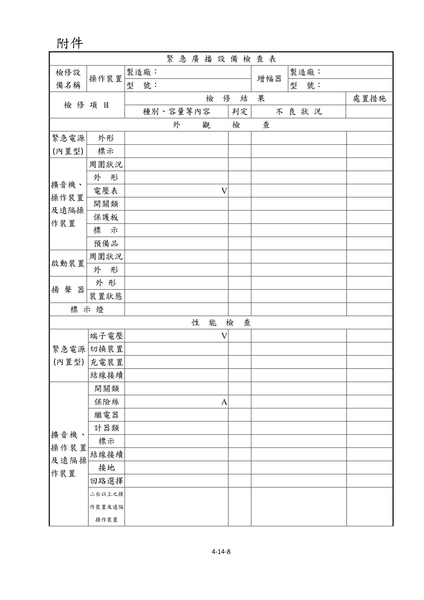
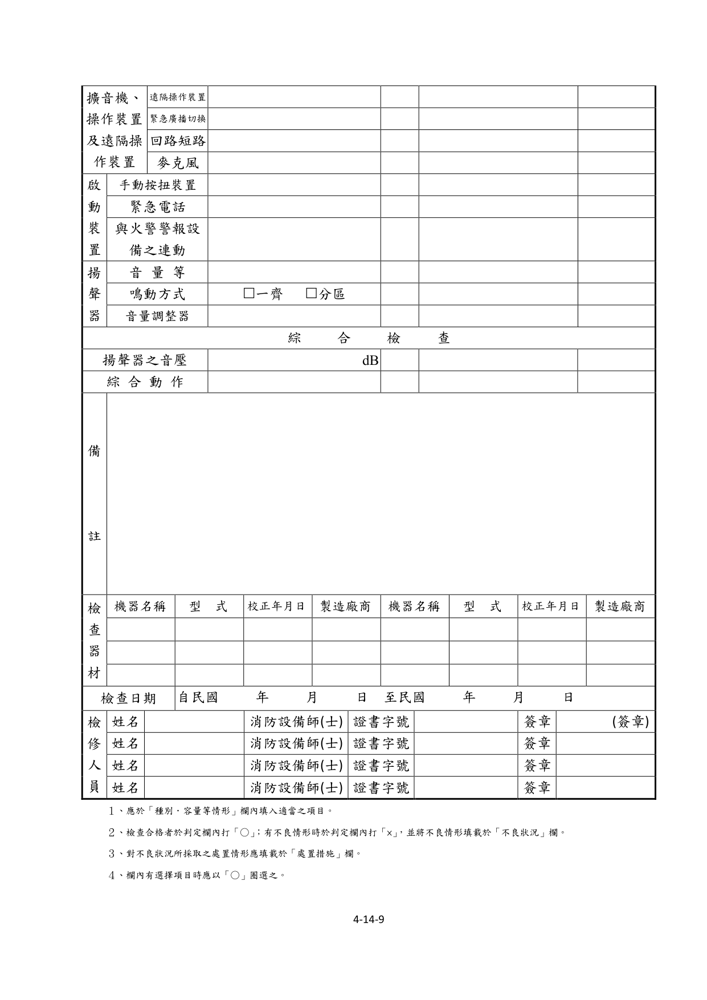

# 消防安全設備及必要檢修項目檢修基準　第十四章　緊急廣播設備

> 版本日期：民國 114 年 1 月 9 日（修正）｜來源：內政部主管法規共用系統（glrs.moi.gov.tw，GL001285）PDF 轉換。114-01-09 修正六章：第一、九、十三、十七、十九、二十七章（其中第一、九、十九章之修正內容在檢修報告表／檢查表與附圖）。
>
> 📌 **免責聲明**：本檔由官方來源轉換與人工整理，可能有轉換或辨識誤差。**一切以主管機關（全國法規資料庫、內政部消防署）公告之現行版本為準**；如有疑義，以官方公告為主。後續 AI 代理人引用本檔時應主動提醒使用者此點，並於必要時自行上網查證正確版本。
>
> 🛈 表格與表單已依原始 PDF 線框以 `scripts/pdf_tables_extract.py` 重新辨識為結構化內容（issue #41）：編號附表為 Markdown 表格或逐列樹狀展開；章末檢修報告表／檢查表**不辨識文字**，改以原始 PDF 頁面截圖（PNG）嵌入；內文附圖與表內圖示亦以 PDF 截圖嵌入（圖檔與本檔同資料夾、檔名前綴同本檔）。表格數值／○×標記可能有辨識誤差，關鍵判斷請核對原始 PDF。
>
> 📎 原始 PDF（全文，114-01-09 版）：[消防安全設備及必要檢修項目檢修基準.PDF](../附件/消防安全設備及必要檢修項目檢修基準/消防安全設備及必要檢修項目檢修基準.PDF)

一、外觀檢查

（一）緊急電源（限內置型）

１、檢查方法

（１）外形以目視確認有無變形、腐蝕等。

（２）標示以目視確認蓄電池銘板是否適當。

２、判定方法

（１）外形

A.應無變形、損傷、龜裂等。

B.電解液應無洩漏、導線之接續部應無腐蝕。

（２）標示應標示規定之電壓及容量。

（二）擴音機、操作裝置及遠隔操作裝置

１、檢查方法

（１）周圍狀況確認周圍有無檢查以及使用上之障礙。

（２）外形確認有無變形、腐蝕等。

（３）電壓表

A.以目視確認有無變形、損傷等。

B.確認電源電壓是否正常。

（４）開關類以目視確認開關位置是否正常。

（５）保護板以目視確認有無變形、脫落等。

（６）標示確認開關之名稱標示是否正確。

（７）預備零件確認是否備有保險絲、燈泡等零件及回路圖。

２、判定方法

（１）周圍狀況

A.操作部及遠隔操作裝置應設在經常有人之處所。

B.應有檢查上及使用上之必要空間。

（２）外形應無變形、損傷、脫落、明顯腐蝕等。

（３）電壓計

A.應無變形、損傷等。

B.電壓計指示值應在規定範圍內。

C.無電壓計者，電源表示燈應亮燈。

（４）開關類開關位置應正常。

（５）保護板應無變形、損傷、脫落等。

（６）標示

A.開關名稱應無污損、不鮮明部分。

B.銘板應無龜裂。

（７）預備零件

A.應備有保險絲、燈泡等預備零件。

B.應備有回路圖及操作說明書。

（三）啟動裝置

１、檢查方法

（１）周圍狀況確認周圍有無檢查上及使用上之障礙，及是否標示「啟動裝置」。

（２）外形以目視確認有無變形、腐蝕及按鈕保護板有無破損等。

２、判定方法

（１）周圍狀況

A.應無檢查上及使用上之障礙。

B.應無標示污損、不鮮明之部分。

（２）外形應無變形、損傷、脫落、明顯腐蝕及按鈕保護板破損之情形。

（四）揚聲器

１、檢查方法

（１）外形以目視確認有無變形、腐蝕等。

（２）裝置狀態以目視確認有無脫落及妨礙音響效果之物。

２、判定方法

（１）外形應無變形、損傷、明顯腐蝕等。

（２）裝置狀態應無脫落、鬆動及妨礙音響效果之物品。

（五）標示燈

１、檢查方法以目視確認有無變形、損傷等及是否亮燈。

２、判定方法

（１）應無變形、損傷、脫落等，且保持亮燈。

（２）標示燈與裝置面成十五度角，在十公尺距離內應均能明顯易見。

二、性能檢查

（一）緊急電源（限內置型）

１、檢查方法

（１）端子電壓操作緊急電源試驗開關，由電壓計確認。

（２）切換裝置操作常用電源開關，確認其動作。

（３）充電裝置以目視確認有無變形、腐蝕、發熱等。

（４）結線接續以目視或螺絲起子確認有無斷線、端子鬆動等。

２、判定方法

（１）端子電壓電壓表之指示值應正常（電壓計指針在紅色線以上）。

（２）切換裝置自動切換成緊急電源，常用電源恢復時自動切換成常用電源。

（３）充電裝置

A.應無變形、損傷、明顯腐蝕等。

B.應無異常之發熱。

（４）結線接續應無斷線、端子鬆動、脫落、損傷等。擴音機、操作裝置及遠隔操作裝置

１、開關類

（１）檢查方法以目視及開、關操作確認端子有無鬆動及開、關性能是否正常。

（２）判定方法

A.應無端子鬆動及發熱等。

B.開、關功能應正常。

２、保險絲類

（１）檢查方法確認有無損傷、熔斷等，及是否為所定之種類及容量。

（２）判定方法

A.應無損傷、熔斷等。

B.應使用回路圖所示之種類及容量等。

３、繼電器

（１）檢查方法確認有無脫落、端子鬆動、接點燒損、灰塵附著，及由開關操作使繼電器動作確認其性能。

（２）判定方法

A.應無脫落、端子鬆動、接點燒損、灰塵附著。

B.動作應正常。

４、計器類

（１）檢查方法由開關之操作及廣播，確認電壓表及出力計是否正常動作。

（２）判定方法指針之動作應正常。

５、表示燈

（１）檢查方法由開關之操作確認是否亮燈。

（２）判定方法應無明顯劣化，且應正常亮燈。

６、結線接續

（１）檢查方法以目視及螺絲起子確認有無斷線、端子鬆動、脫落、損傷等。

（２）判定方法應無斷線、端子鬆動、脫落、損傷等。

７、接地

（１）檢查方法以目視或三用電表確認有無腐蝕、斷線等。

（２）判定方法應無明顯腐蝕、斷線等之損傷。

８、回路選擇

（１）檢查方法操作樓層別選擇開關或一齊廣播開關，確認回路選擇是否確實進行。

（２）判定方法被選定之回路，其樓層別動作表示及火災燈應正常亮燈。

９、二台以上之操作裝置或遠隔操作裝置。

（１）檢查方法

A.設有二台以上之操作裝置或遠隔操作裝置時，使其相互動作，確認其廣播分區是否正確，及相互之操作裝置或遠隔操作裝置之表示是否正確。

B.對同時通話設備，確認是否能相互通話。

（２）判定方法

A.使其中一台操作裝置或遠隔操作裝置動作時，其相互之性能應正常，且廣播分區及操作裝置或遠隔操作裝置之表示正常。

B.應能相互呼應及清楚通話。

１０、遠隔操作裝置

（１）檢查方法操作操作部及遠隔操作裝置任一操作開關時，確認是否正常動作。

（２）判定方法

A.操作部或遠隔操作裝置動作之繼電器、監聽揚聲器、出力計等，應動作。

B.由遠隔操作裝置之啟動裝置，應能進行一齊廣播。

C.操作遠隔操作裝置之回路選擇開關，應能對任一樓層廣播。

D.由遠隔操作裝置之監聽揚聲器，應能確認廣播內容。

１１、緊急廣播切換

（１）檢查方法與一般廣播兼用時，於一般廣播狀態，進行緊急廣播時，確認是否切換成緊急廣播。

（２）判定方法應確實切換成緊急廣播，且在未以手動復舊前，應正常持續緊急廣播之動作狀態。

１２、回路短路

（１）檢查方法於警報音響播送狀態，進行回路短路時，確認其他回路是否發生性能障礙。

（２）判定方法於短路之回路，遮斷短路保護回路，或於表示已短路之同時，對其他回路之廣播應無異常。

１３、麥克風（限發出音聲警報者）

（１）檢查方法於操作裝置使用音聲警報鳴動，再由麥克風進行廣播，確認音聲警報是否自動地停止。

（２）判定方法由麥克風之廣播啟動同時，音聲警報音響應即停止。且於麥克風之廣播終了時，音聲警報即開始鳴動。啟動裝置

１、檢查方法

（１）手動按鈕開關操作手動按鈕開關，確認是否動作。

（２）火警自動警報設備之手動報警機。

A.操作火警自動警報設備之手動報警機，確認廣播設備是否確實啟動，自動進行火災廣播。

B.操作緊急電話（分機），於操作部（主機）呼出鳴動之同時，確認能否相互通話。

C.操作二具以上之緊急電話（分機），確認於操作部是否可任意選擇通話，且此時被遮斷之緊急電話是否能聽到講話音。

（３）與火警自動警報設備之連動使火警自動警報設備動作，確認是否能確實連動。

２、判定方法

（１）手動按鈕開關在操作部應發出音響警報及火災音響信號。

（２）火警自動警報設備之手動報警機

A.應能自動地進行火災廣播。

B.操作部（主機）呼出鳴動，且應能明確相互通話。

C.應能任意選擇通話，且此時被遮斷之緊急電話亦應能聽到講話音。

（３）與火警自動警報設備之連動

A.於受信火災信號後，自動地啟動廣播設備，其火災音響信號或音響裝置應鳴動。

B.起火層表示燈應亮燈。

C.起火層表示燈至火災信號復舊前，應保持亮燈。揚聲器

１、音量等

（１）檢查方法設於有其他機械之噪音處所者，藉由操作裝置或遠隔操作裝置之操作，確認其音量及音色。

（２）判定方法音量及音色應有別於其他機械之噪音。

２、鳴動方式

（１）檢查方法操作操作裝置，由進行廣播中，確認揚聲器是否正確鳴動。

（２）判定方法

A.一齊鳴動全棟之揚聲器應一齊鳴動。

B.分區鳴動應能進行下列所示之分區鳴動。

(A)起火層為地上二層以上時限該樓層與其直上二層及其直下一層鳴動。

(B)起火層為地面層時限該樓層與其直上層及地下層各層鳴動。

(C)起火層為地下層時。限地面層及地下層各層鳴動。

C.相互鳴動設有二台以上操作裝置或遠隔操作裝置之建築物，由任一操作裝置或遠隔操作裝置均能使揚聲器鳴動。

（３）音量調整器

A.檢查方法於緊急廣播狀態，操作音量調整器時，確認緊急廣播是否有障礙。

B.判定方法不論音量調整器之調整位置在何位置，均應能有效進行緊急廣播。

三、綜合檢查揚聲器之音壓

１、檢查方法距揚聲器一公尺處，使用噪音計（Ａ特性），確認是否可得規定之音壓。

２、判定方法揚聲器之音壓，Ｌ級 92 分貝以上，Ｍ級 87 分貝以上，Ｓ級 84 分貝以上。綜合檢查

１、檢查方法切換成緊急電源供電狀態，操作任一啟動裝置或操作裝置之緊急廣播開關，或受信由火警自動警報設備啟動之信號，確認是否進行火災表示及正常廣播。

２、判定方法火災表示及揚聲器之鳴動應正常。

### 附件　緊急廣播設備檢查表

> 本檢查表不辨識文字，改以原始 PDF 頁面截圖嵌入（共 2 頁，對應原 PDF 第 300–301 頁）；如需填寫或核對細部文字，請開啟[原始 PDF](../附件/消防安全設備及必要檢修項目檢修基準/消防安全設備及必要檢修項目檢修基準.PDF)。

