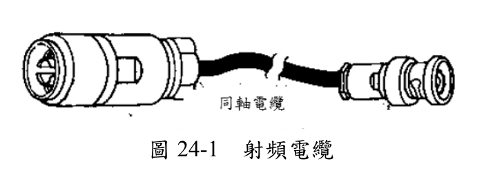
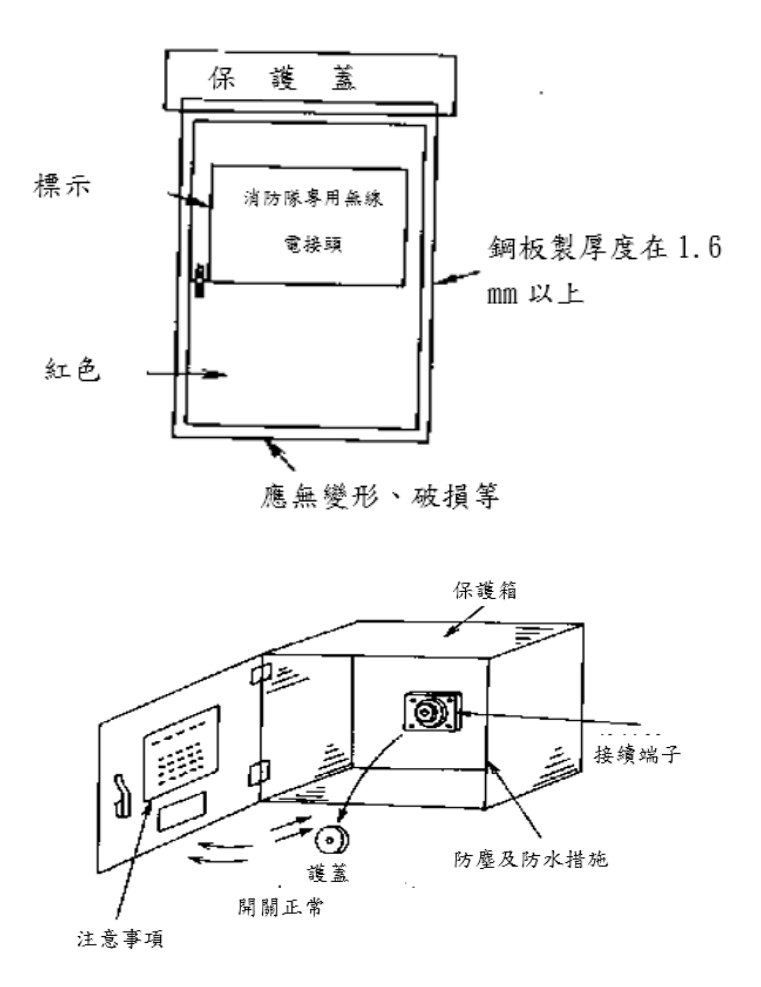
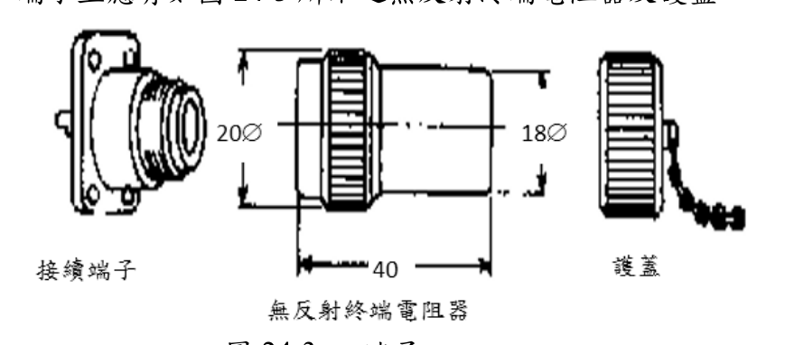
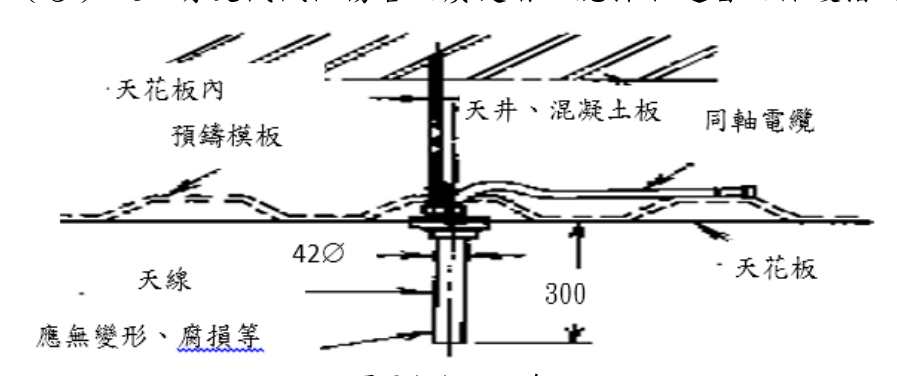
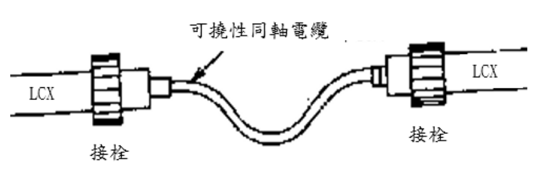
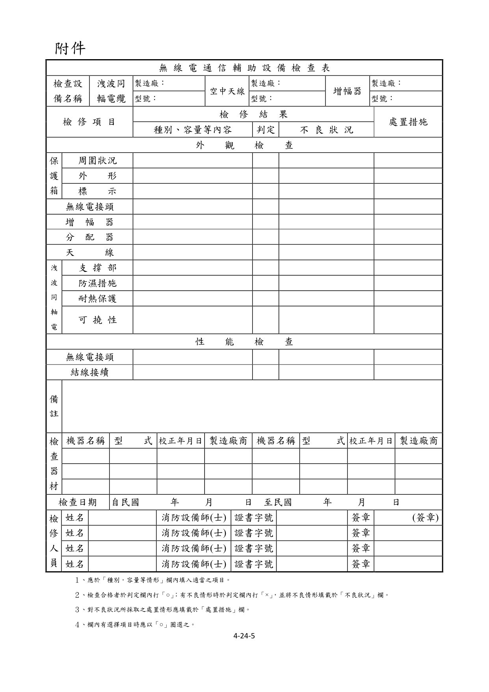

# 消防安全設備及必要檢修項目檢修基準　第二十四章　無線電通信輔助設備

> 版本日期：民國 114 年 1 月 9 日（修正）｜來源：內政部主管法規共用系統（glrs.moi.gov.tw，GL001285）PDF 轉換。114-01-09 修正六章：第一、九、十三、十七、十九、二十七章（其中第一、九、十九章之修正內容在檢修報告表／檢查表與附圖）。
>
> 📌 **免責聲明**：本檔由官方來源轉換與人工整理，可能有轉換或辨識誤差。**一切以主管機關（全國法規資料庫、內政部消防署）公告之現行版本為準**；如有疑義，以官方公告為主。後續 AI 代理人引用本檔時應主動提醒使用者此點，並於必要時自行上網查證正確版本。
>
> 🛈 表格與表單已依原始 PDF 線框以 `scripts/pdf_tables_extract.py` 重新辨識為結構化內容（issue #41）：編號附表為 Markdown 表格或逐列樹狀展開；章末檢修報告表／檢查表**不辨識文字**，改以原始 PDF 頁面截圖（PNG）嵌入；內文附圖與表內圖示亦以 PDF 截圖嵌入（圖檔與本檔同資料夾、檔名前綴同本檔）。表格數值／○×標記可能有辨識誤差，關鍵判斷請核對原始 PDF。
>
> 📎 原始 PDF（全文，114-01-09 版）：[消防安全設備及必要檢修項目檢修基準.PDF](../附件/消防安全設備及必要檢修項目檢修基準/消防安全設備及必要檢修項目檢修基準.PDF)

一、外觀檢查保護箱

１、檢查方法

（１）周圍狀況確認周圍有無造成檢查上及使用上之障礙。

（２）外形以目視及開關之操作確認有無變形、灰塵侵入，及箱門之開、關是否確實。

（３）標示確認標示是否正常。

２、判定方法

（１）周圍狀況應無造成檢查上及使用上之障礙。

（２）外形

A.應無變形、損傷、明顯腐蝕等。

B.保護箱應無明顯鏽蝕。

C.保護箱內部應無灰塵、水份之侵入。

D.箱門可確實開、關。

E.設置於地面之保護箱，需為不可任意開、關之構造。

F.圖 24-1 所示之射頻電纜應收存於保護箱內。

（３）標示

A.圖 24-2 所示之保護箱箱面並標示有「消防隊專用無線電接頭」字樣。

B.圖 24-2 所示之保護箱箱內明顯易見之位置，應標示有最大容許輸入、可使用之頻率域帶及注意事項。

C.標示應無污損、模糊不清之部分。

D.面板應無剝落之現象。無線電接頭

１、檢查方法以目視確認有無變形、損傷等，及有無「無反射終端電阻器」或護蓋。

２、判定方法

（１）應無變形、損傷、明顯腐蝕之情形。

圖 24-1     射頻電纜

圖 24-2

（２）端子上應有如圖 24-3 所示之無反射終端電阻器及護蓋。

圖 24-3         端子

增幅器

１、檢查方法確認設置場所是否適當。

２、判定方法

（１）設置場所應為防災中心、中央管理室等平時有人駐守之居室，且以不燃材料之牆、地板、天花板建造，開口部設有甲種或乙種防火門之居室。

（２）應設於具防火性能之管道間內。分配器等

１、檢查方法確認連接部位之防水措施有無異常。

２、判定方法橡皮襯墊等應無劣化。空中天線

１、檢查方法

以目視確認圖 24-4 所示之天線有無變形、腐蝕之情形，且有無造成通行及避難上之障礙。

２、判定方法

（１）應無變形、腐蝕之情形。

（２）應無造成通行及避難上之障礙。

（３）設於有受機械性傷害之虞處者，應採取適當之保護措施。

圖 24-4     天線

洩波同軸電纜

１、檢查方法

（１）支撐部以目視確認金屬支架有無變形、脫落，且有無堅固支撐。

（２）防濕措施以目視確認連接部分之防濕措施是否正常。

（３）耐熱保護

以目視確認有無損傷、脫落等。

（４）可撓性確認連接用同軸電纜是否具可撓性。

２、判定方法

（１）支撐部金屬支架應無變形、損傷、脫落等，且應堅固支撐。

（２）防濕措施圖 24-5 所示之接頭應無變形、損傷、鬆弛等，且能有效防濕。

圖 24-5      接栓

（３）耐熱保護應無損傷、脫落等。

（４）可撓性連接用同軸電纜應具可撓性。

二、性能檢查無線電接頭

１、檢查方法確認接頭連接器是否可輕易裝接或脫離。

２、判定方法連接器可確實且輕易裝接或分離。結線接續

１、檢查方法以目視或螺絲起子確認有無斷線、端子鬆動等。

２、判定方法應無斷線、端子鬆動、脫落、損傷。

### 附件　無線電通信輔助設備檢查表

> 本檢查表不辨識文字，改以原始 PDF 頁面截圖嵌入（共 1 頁，對應原 PDF 第 404–404 頁）；如需填寫或核對細部文字，請開啟[原始 PDF](../附件/消防安全設備及必要檢修項目檢修基準/消防安全設備及必要檢修項目檢修基準.PDF)。

