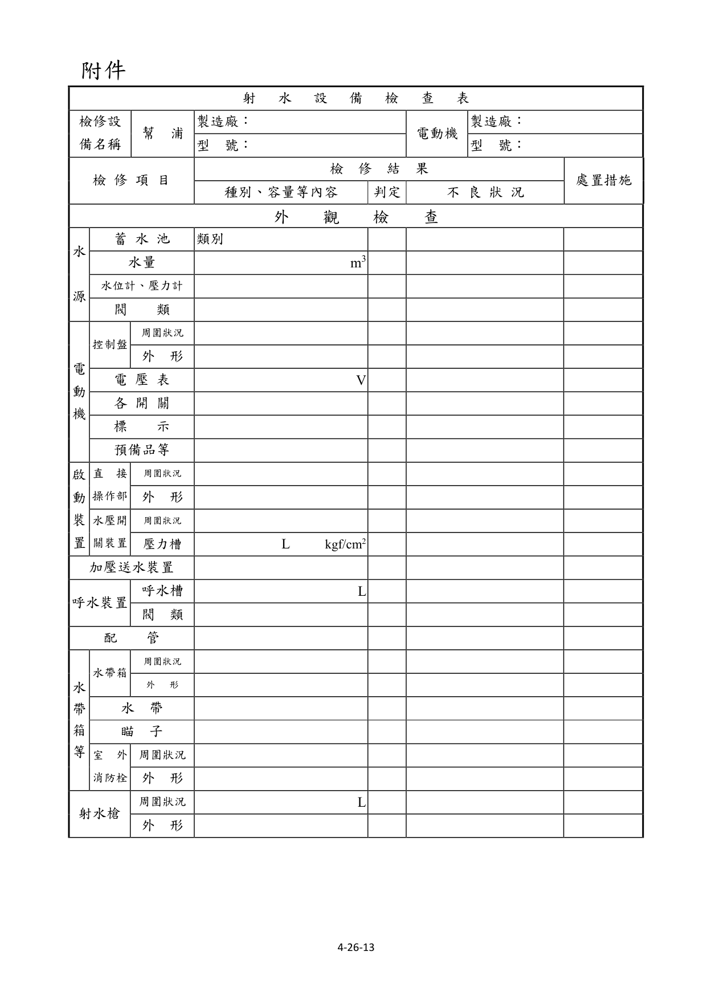
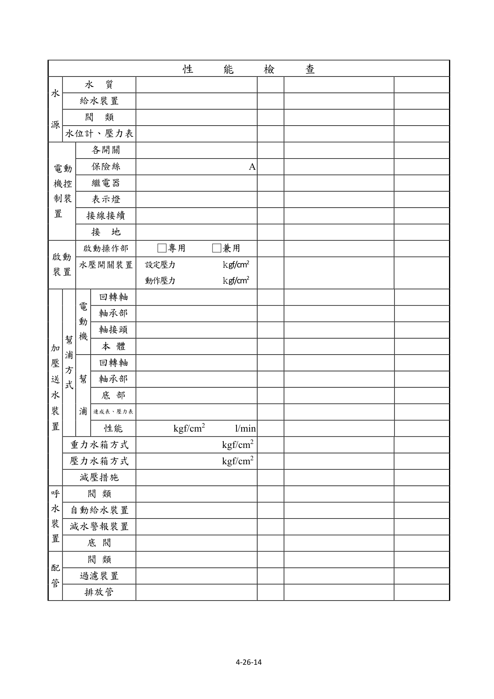
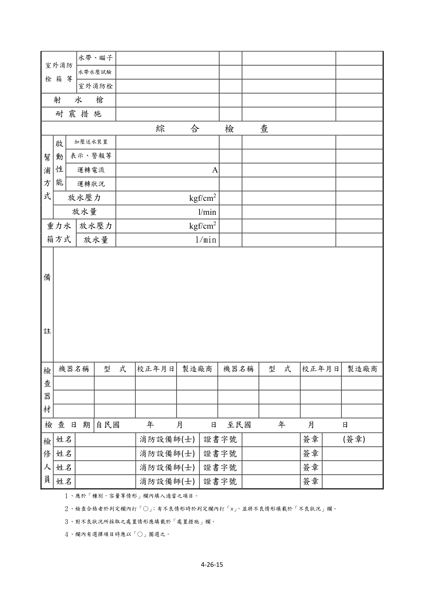

# 消防安全設備及必要檢修項目檢修基準　第二十六章　射水設備

> 版本日期：民國 114 年 1 月 9 日（修正）｜來源：內政部主管法規共用系統（glrs.moi.gov.tw，GL001285）PDF 轉換。114-01-09 修正六章：第一、九、十三、十七、十九、二十七章（其中第一、九、十九章之修正內容在檢修報告表／檢查表與附圖）。
>
> 📌 **免責聲明**：本檔由官方來源轉換與人工整理，可能有轉換或辨識誤差。**一切以主管機關（全國法規資料庫、內政部消防署）公告之現行版本為準**；如有疑義，以官方公告為主。後續 AI 代理人引用本檔時應主動提醒使用者此點，並於必要時自行上網查證正確版本。
>
> 🛈 表格與表單已依原始 PDF 線框以 `scripts/pdf_tables_extract.py` 重新辨識為結構化內容（issue #41）：編號附表為 Markdown 表格或逐列樹狀展開；章末檢修報告表／檢查表**不辨識文字**，改以原始 PDF 頁面截圖（PNG）嵌入；內文附圖與表內圖示亦以 PDF 截圖嵌入（圖檔與本檔同資料夾、檔名前綴同本檔）。表格數值／○×標記可能有辨識誤差，關鍵判斷請核對原始 PDF。
>
> 📎 原始 PDF（全文，114-01-09 版）：[消防安全設備及必要檢修項目檢修基準.PDF](../附件/消防安全設備及必要檢修項目檢修基準/消防安全設備及必要檢修項目檢修基準.PDF)

一、外觀檢查水源

１、檢查方法

（１）水箱、蓄水池由外部以目視確認有無變形、漏水、腐蝕等。

（２）水量由水位計確認或打開人孔蓋用檢尺測量。

（３）水位計及壓力表以目視確認有無變形、損傷，指示值是否正確。

（４）閥類以目視確認排水管、補給水管、給氣管等之閥類，有無洩漏、變形、損傷等，及其開關位置是否正常。

２、判定方法

（１）水箱、蓄水池應無變形、損傷、漏水、漏氣及顯著腐蝕等痕跡。

（２）水量應確保在規定量以上。

（３）水位計及壓力表應無變形、損傷，且指示值應正常。

（４）閥類

A.應無洩漏、變形、損傷等。

B.「常時開」或「常時關」之標示及開、關位置應保持正常。

電動機之控制裝置

１、檢查方法

（１）控制盤

A.周圍狀況確認周圍有無檢查及使用上之障礙。

B.外形以目視確認有無變形、腐蝕等。

（２）電壓表

A.以目視確認有無變形、腐蝕。

B.確認電源、電壓是否正常。

（３）各開關以目視確認有無變形、損傷及開關位置是否正常。

（４）標示確認是否正確標示。

（５）預備品等確認是否備有保險絲、燈泡、回路圖及說明書等。

２、判定方法

（１）控制盤

A.周圍狀況應設置於火災不易波及之位置，且周圍應無檢查及使用上之障礙。

B.外形應無變形、損傷、顯著腐蝕等。

（２）電壓表

A.應無變形、損傷等。

B.電壓表之指示值應在所定之範圍內。

C.無電壓表者，電源表示燈應亮著。

（３）各開關應無變形、損傷、脫落等，且開、關位置應正常。

（４）標示

A.各開關之名稱標示應無污損及不明顯部分。

B.標示銘板應無剝落。

（５）預備品等

A.應備有保險絲、燈泡等預備品。

B.應備有回路圖及操作說明書等。

啟動裝置

１、啟動操作部

（１）檢查方法

A.周圍狀況以目視確認周圍有無檢查及使用上之障礙及標示是否適當。

B.外形以目視確認直接操作部及遠隔操作部，有無變形、損傷等。

（２）判定方法

A.周圍狀況

（A）應無檢查及使用上之障礙。

（B）標示應無污損及不明顯部分。

B.外形閥類各開關應無損傷、變形等。

２、啟動用水壓開關裝置

（１）檢查方法

A.壓力開關以目視確認有無變形、損傷等。

B.啟動用壓力槽以目視確認有無變形、漏水、腐蝕等，及壓力表之指示值是否適當正常。

（２）判定方法

A.壓力開關應無變形、損傷等。

B.啟動用壓力水槽應無變形、腐蝕、漏水、漏氣、顯著腐蝕等，且壓力表之指示值應正常。

加壓送水裝置

１、檢查方法以目視確認幫浦及電動機等有無變形、腐蝕等。

２、判定方法應無變形、損傷、顯著腐蝕及銘板剝落等。

呼水裝置

１、檢查方法

（１）呼水槽以目視確認呼水槽，有無變形、漏水、腐蝕等，及水量是否在規定量以上。

（２）閥類以目視確認給水管之閥類有無洩漏、變形等，及其開、關位置是否正常。

２、判定方法

（１）呼水槽應無變形、損傷、漏水、顯著腐蝕等，及水量應在規定量以上。

（２）閥類

A.應無洩漏、變形、損傷等。

B.「常時開」或「常時關」之標示及開關位置應正常。

配管

１、檢查方法

（１）立管及接頭以目視確認有無洩漏、變形等及被利用做為其他東西之支撐、吊架等。

（２）立管固定用之支撐及吊架以目視及手觸摸確認有無脫落、彎曲、鬆動等。

（３）閥類以目視確認有無洩漏、變形等，及開、關位置是否正常。

（４）過濾裝置以目視確認過濾裝置有無洩漏、變形等。

２、判定方法

（１）立管及接頭

A.應無洩漏、變形、損傷等。

B.應無被利用做為其他東西之支撐及吊架等。

（２）立管固定用之支撐及吊架應無脫落、彎曲、鬆動等。

（３）閥類

A.應無洩漏、變形、損傷等。

B.「常時開」或「常時關」之標示及開關位置應正常。

（４）過濾裝置應無洩漏、變形、損傷等。

水帶箱等

１、水帶箱

（１）檢查方法

A.周圍狀況以目視確認周圍有無檢查及使用上之障礙，及「水帶箱」之標示字樣是否適當正常。

B.外形以目視及開、關操作，確認有無變形、損傷等，及箱門是否能確實開、關。

（２）判定方法

A.周圍狀況

（A）應無檢查及使用上之障礙。

（B）標示字樣應無污損及不明顯部分。

B.外形

（A）應無變形、損傷等。

（B）箱門之開、關狀況應良好。

２、水帶及瞄子

（１）檢查方法以目視確認置於箱內之瞄子、水帶有無變形、損傷及數量是否足夠。

（２）判定方法

A.應無變形、損傷。

B.設置室外消防栓者應配置口徑六十三公厘及長二十公尺水帶二條、瞄子一具及開關把手一把。

３、室外消防栓

（１）檢查方法

A.周圍的狀況以目視確認周圍有無檢查及使用上之障礙，及消防栓之標示是否正常。

B.外形以目視及開、關操作，確認有無變形、損傷等，及地下式箱蓋是否能確實開、關。

（２）判定方法

A.周圍狀況

（A）應無檢查及使用上之障礙。

（B）標示字樣應無污損及不明顯部分。

B.外形

（A）應無變形、洩漏、損傷等。

（B）地下式之箱蓋應能確實開關。

射水槍

１、檢查方法

（１）周圍的狀況以目視確認周圍有無檢查及使用上之障礙。

（２）外形以目視及開、關操作，確認有無變形、損傷等。

２、判定方法

（１）周圍狀況應無檢查及使用上之障礙。

（２）外形應無變形、洩漏、損傷等。

二、性能檢查水源

１、檢查方法

（１）水質打開人孔蓋以目視及水桶採水，確認有無腐敗、浮游物、沈澱物等。

（２）給水裝置

A.確認有無變形、腐蝕等，及操作排水閥確認給水功能是否正常。

B.如不便用操作排水閥檢查給水功能時，可使用下列方法：

（A）使用水位電極控制給水者，拆除其電極回路之配線，形成減水狀態，確認其是否能自動給水；其後再將拆掉之電極回路線接上復原，形成滿水狀態，確認其給水能否自動停止。

（B）使用浮球水栓控制給水者，以手動操作將浮球沒入水中，形成減水狀態，使其自動給水；其後使浮球復原，形成滿水狀態，使給水自動停止。

（３）水位計及壓力表

A.水位計之量測係打開人孔蓋，用檢尺測量水位，並確認水位計之指示值。

B.壓力表之量測係關閉壓力表開關及閥類，並放出壓力表之水，使指針歸零後，再打開壓力表開關及閥類，並確認指針之指示值。

（４）閥類用手操作確認開、關動作是否能容昜進行。

２、判定方法

（１）水質應無腐臭、浮游物、沈澱物之堆積等。

（２）給水裝置

A.應無變形、損傷、顯著腐蝕。

B.於減水狀態能自動給水，於滿水狀態能自動停止供水。

（３）水位計及壓力表

A.水位計之指示值應正常。

B.在壓力表歸零的位置、指針的動作狀況及指示值應正常。

（４）閥類開、關操作應能容易地進行。

電動機之控制裝置

１、檢查方法

（１）各開關以螺絲起子及開、關操作，確認端子有無鬆動及開關性能是否正常。

（２）保險絲確認有無損傷、熔斷及是否為所規定之種類及容量。

（３）繼電器確認有無脫落、端子鬆動、接點燒損、灰塵附著，並操作各開關使繼電器動作，確認機能。

（４）表示燈操作各開關確認有無亮燈。

（５）結線接續以目視及螺絲起子確認有無斷線、端子鬆動等。

（６）接地以目視或回路計確認有無腐蝕、斷線等。

２、判定方法

（１）各開關

A.端子應無鬆動、發熱。

B.開、關性能應正常。

（２）保險絲

A.應無損傷、熔斷。

B.應依回路圖所規定種類及容量設置。

（３）繼電器

A.應無脫落、端子鬆動、接點燒損、灰塵附著等。

B.動作應正常。

（４）表示燈應無顯著劣化，且能正常點燈。

（５）結線接續應無斷線、端子鬆動、脫落、損傷等。

（６）接地應無顯著腐蝕、斷線等。

啟動裝置

１、檢查方法

（１）啟動操作部操作直接操作部及遠隔操作部之開關，確認加壓送水裝置能否啟動。

（２）啟動用水壓開關裝置

A.以目視及螺絲起子，確認壓力開關之端子有無鬆動。

B.確認設定壓力值是否恰當，且由操作排水閥使加壓送水裝置啟動，確認動作壓力值是否適當。

２、判定方法

（１）啟動操作部加壓送水裝置應能確實啟動。

（２）啟動用水壓開關裝置

A.壓力開關之端子應無鬆動。

B.設定壓力值適當，且加壓送水裝置依設定壓力正常啟動。加壓送水裝置（限幫浦方式）

１、電動機

（１）檢查方法

A.回轉軸用手轉動，確認是否能圓滑地回轉。

B.軸承部確認潤滑油有無污損、變質及是否達必要量。

C.軸接頭以扳手確認有無鬆動、性能是否正常。

D.本體操作啟動裝置使其啟動，確認性能是否正常。

（２）判定方法

A.回轉軸應能圓滑的回轉。

B.軸承部潤滑油應無污損、變質且達必要量。

C.軸接頭應無脫落、鬆動，且接合狀態牢固。

D.本體應無顯著發熱、異常振動、不規則或不連續之雜音，且回轉方向正確。

（３）注意事項除需操作啟動檢查性能外，其餘均需先切斷電源。

２、幫浦

（１）檢查方法

A.回轉軸用手轉動確認是否能圓滑地回轉。

B.軸承部確認潤滑油有無污損、變質及是否達必要量。

C.底座確認有無顯著漏水。

D.連成表及壓力表關掉表計之控制水閥將水排出，確認指針是否指在 0 之位置，再打開表計之控制水閥，操作啟動裝置確認指針是否正常動作。

E.性能先將幫浦吐出側之制水閥關閉之後，使幫浦啟動，然後緩緩的打開性能測試用配管之制水閥，由流量計及壓力表確認額定負荷運轉及全開點時之性能。

（２）判定方法

A.回轉軸應能圓滑地轉動。

B.軸承部潤滑油應無污損、變質，且達必要量。

C.底座應無顯著漏水。

D.連成表及壓力表位置及指針動作應正常。

E.性能應無異常振動、不規則或不連續之雜音，且於額定負荷運轉及全開點時之吐出壓力及吐出水量均達規定值以上。

（３）注意事項除需操作啟動檢查性能外，其餘均需先行切斷電源。

３、減壓措施

（１）檢查方法以目視確認減壓閥等有無變形、洩漏等。

（２）判定方法

A.應無洩漏、變形、損傷等。

B.射水設備之放水壓力應在 3.5kgf／cm² 以上。

呼水裝置

１、檢查方法

（１）閥類用手操作確認開關動作是否容易進行。

（２）自動給水裝置

A.確認有無變形、腐蝕等。

B.打開排水閥，檢查自動給水功能是否正常。

（３）減水警報裝置

A.確認有無變形、腐蝕等。

B.關閉補給水閥，再打開排水閥，確認減水警報功能是否正常。

（４）底閥

A.拉上吸水管或檢查用鍊條，確認有無異物附著或阻塞。

B.打開幫浦本體上呼水漏斗之制水閥，確認有無從漏斗連續溢水出來。

C.打開幫浦本體上呼水漏斗之制水閥，然後關閉呼水管之制水閥，確認底閥之逆止效果是否正常。

２、判定方法

（１）閥類開、關動作應能容易地進行。

（２）自動給水裝置

A.應無變形、損傷、顯著腐蝕等。

B.當呼水槽之水量減少時，應能自動給水。

（３）減水警報裝置

A.應無變形、損傷、顯著腐蝕等。

B.當水量減少到二分之一時應發出警報。

（４）底閥

A.應無異物附著、阻塞等吸水障礙。

B.呼水漏斗應能連續溢水出來。

C.呼水漏斗的水應無減少。

配管

１、檢查方法

（１）閥類用手操作確認開、關動作是否容易進行。

（２）過濾裝置分解打開確認過濾網有無變形、異物堆積。

（３）排放管（防止水溫上升裝置）使加壓送水裝置啟動呈關閉運轉狀態，確認排放管排水是否正常。

２、判定方法

（１）閥類開、關操作應能容易進行。

（２）過濾裝置過濾網應無變形、損傷、異物堆積等。

（３）排放管排放水量應在下列公式求得量以上。

$$q = \frac{L_s \times C}{60 \times \Delta t}$$

- $q$：排放水量（l/min）
- $L_s$：幫浦關閉運轉時之出力（kw）
- $C$：860 Kcal（1kw-hr 時水之發熱量）
- $\Delta t$：30℃（幫浦內部之水溫上昇限度）

室外消防栓箱等

１、檢查方法

（１）水帶及瞄子

A.以目視確認有無損傷、腐蝕，及用手操作確認是否容易拆接。

B.製造年份超過 10 年或無法辨識製造年份之水帶，應將消防水帶兩端之快速接頭連接於耐水壓試驗機，並利用相關器具夾住消防水帶兩末端處，經確認快速接頭已確實連接及水帶內(快速接頭至被器具夾住處之部分水帶)無殘留之空氣後，施以6kgf/cm² 以上水壓試驗 5 分鐘合格，始得繼續使用。但已經水壓試驗合格未達 3 年者，不在此限。

（２）室外消防栓用手操作確認開、關操作是否容易。

２、判定方法

（１）水帶及瞄子

A.應無損傷、腐蝕。

B.應能容易拆、接，水帶應無破裂、漏水或與消防水帶用接頭脫落之情形。

（２）室外消防栓開、關操作應能容易進行。

射水槍

１、檢查方法用手操作確認開、關操作是否容易。

２、判定方法開、關操作應能容易進行。

耐震措施

１、檢查方法

（１）牆壁或地板上貫通部分有無變形、損傷等，並確認防震軟管接頭有無變形、損傷、顯著腐蝕等。

（２）以目視及扳手確認加壓送水裝置等之裝配固定是否有異常。

２、判定方法

（１）防震軟管應無變形、損傷、顯著腐蝕等，且牆壁或地板上貫通部分的間隙、充填部分均保持原來施工時之狀態。

（２）加壓送水裝置的安裝部分所使用之基礎螺絲、螺絲帽，應無變形、損傷、鬆動、顯著腐蝕等，且安裝固定部分應無損傷。

三、綜合檢查檢查方法切換成緊急電源供電狀態，操作直接操作部及遠隔操作部啟動裝置，確認各項性能。其放水壓力及放水量之檢查方法如下：

１、以全部射水設備（超過二具時，選擇最遠最高處之二具）做放水試驗。

２、測量室外消防栓瞄子直線放水之壓力或射水槍時，將壓力表之進水口，放置於瞄子前端瞄子口徑的二分之一距離處或射水槍前端口徑的二分之一距離處，讀取壓力表的指示值。

３、放水量依下列計算式計算

$$Q = 0.653 D^2 \sqrt{P}$$

- $Q$：放水量（l/min）
- $D$：口徑（mm）
- $P$：放水壓力（kgf/cm²）

判定方法

１、啟動性能

（１）加壓送水裝置應確實啟動。

（２）表示、警報等應正常。

（３）電動機之運轉電流值應在容許範圍內。

（４）運轉中應無不規則、不連續之雜音或異常之振動、發熱等。

２、放水壓力應在 3.5kgf/cm² 以上。

３、放水量每具應在 450l/min 以上。

### 附件　射水設備檢查表

> 本檢查表不辨識文字，改以原始 PDF 頁面截圖嵌入（共 3 頁，對應原 PDF 第 451–453 頁）；如需填寫或核對細部文字，請開啟[原始 PDF](../附件/消防安全設備及必要檢修項目檢修基準/消防安全設備及必要檢修項目檢修基準.PDF)。

