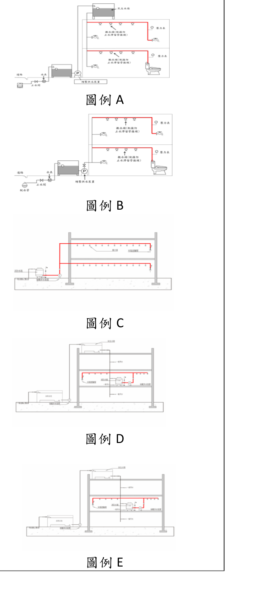

# 消防安全設備測試報告書測試方法及判定要領　第四章之一　水道連結型自動撒水設備
>
> 📌 **免責聲明**：本檔由官方來源轉換與人工整理，可能有轉換或辨識誤差。**一切以主管機關（全國法規資料庫、內政部消防署）公告之現行版本為準**；如有疑義，以官方公告為主。後續 AI 代理人引用本檔時應主動提醒使用者此點，並於必要時自行上網查證正確版本。

> 本檔為「消防安全設備測試報告書測試方法及判定要領」之 第四章之一，依「測試項目（儘量為單一元件）→ 測試方法 → 判定要領」階層整理（不保留原表格框）。
>
> 📎 原始 PDF：[第 4-1 點完整條文.PDF](../附件/消防安全設備測試報告書測試方法及判定要領/第 4-1 點完整條文.PDF)
>
> ⚠️ 版本日期請依官方原文核對（本要領含多章修正規定）。配管材質適用範圍圖例 A～E 已自原始 PDF 擷取內嵌（見「材質」項），數值與粗紅線範圍仍以原始 PDF 為準。
> 🗓️ **版本沿革（2026-07-04 網路查證）**：本要領可查得之修正紀錄為 97.01.15、105.04.29、108.08.20（內授消字第 1080823020 號令，修正第二章、第四章之一、第九章、第十一章之一、第二十二章）、109.06.05（修正第十一章之一）；查證時未見更新之修正發布（另 114 年消防署曾徵集修正意見），原始訂定日期未能自公開檢索確認。引用前請以內政部主管法規共用系統（GL001274）／消防署法令查詢系統（FL090767）現行版為準。

### 甲、外觀試驗

**測試項目：水源**
- 測試方法：以目視確認水源之狀況。
- 判定要領：種類．構造應適當正常；水量應確保規定以上之水量；給水裝置應適當正常；應採取防止地震變形損傷之耐震措施。

**測試項目：增壓供水裝置（限有裝設者）**
- 測試方法：以目視確認設置場所及增壓供水裝置之狀況。
- 判定要領：設置場所檢修便利且無火災損害之虞；型式應使用取得經濟部標準檢驗局商品檢驗標識之產品；最大流量、最高揚程及輸入功率等型式應符合取得經濟部標準檢驗局商品檢驗通過之規格。

**測試項目：配管．配件及閥類**
- 測試方法：以目視確認設置狀況及配管等之設置狀況。
- 判定要領：
  - 設置狀況：應無損傷變形並適當設置；民生水箱共用式室內水平配管應避免傾斜；使用合成樹脂管或自來水用戶用水設備標準規範之塑膠管（聚乙烯、聚氯乙烯、聚乙烯夾鋁、內襯聚乙烯之聚氯乙烯、ABS、聚丁烯、玻璃纖維強化塑膠管），其立管應設於防火構造之管道間，垂直及水平配管應敷設於耐燃材料內保護。
  - 材質：民生水箱共用式連結撒水頭之配管材質應符合自來水配管相關規定；獨立水箱式配管材質應符合 CNS6445、4626、6331 或同等以上者（或經認可之合成樹脂管），或自來水用戶用水設備標準規定之各式塑膠管／碳鋼鋼管／鎳鉻鐵合金管／不銹鋼管或鋼管；設置於高層建築物之配管管材應符合建築技術規則規定；配管材質適用範圍依原檔圖例 A～E 之粗紅線辦理（圖例 A、B 為既有自來水管線所分接增設之管線，圖例 C、D、E 為消防水箱二次側起至末端所有配管）。圖例如下（2026-07-05 自原始 PDF 擷取內嵌；五圖即水道連結型五種設置類型：A、B 民生水箱共用式，C 地面水箱型、D 屋頂水箱型、E 樓層水箱型）：

  - 防蝕等其他措施：屋外或潮濕場所露出之金屬配管須施以防銹塗裝等防蝕措施（不銹鋼鋼管不在此限）；民生水箱共用式應配接防止水滯留之管接頭、配管末端連結水龍頭或馬桶水箱等日常生活用水設施使配管內水源流動不滯留並配置壓力表。

**測試項目：撒水頭**
- 測試方法：以目視確認水道連結型撒水頭之設置狀況。
- 判定要領：配置應適當正常且無未警戒部分、撒水頭周圍應無妨礙熱感知及撒水分布之物；裝置方向應適當正常；標示溫度應配合設置場所；構造．性能應為認可品。

**測試項目：末端查驗閥（限採用獨立水箱式）**
- 測試方法：以目視確認設置場所、查驗閥及標示之狀況。
- 判定要領：設置場所應設於放水壓力預測為最低之配管部分；構造一次側應設壓力表、二次側應設與撒水頭同等放水性能之限流孔；標示應在附近明顯易見處標示「末端查驗閥」字樣。

**測試項目：使用標示**
- 測試方法：以目視確認標示之狀況。
- 判定要領：應無汙損、不明顯部分。

### 乙、性能試驗

**測試項目：動作試驗**
- 測試方法：打開排水閥將水箱內的水排出（水箱給水裝置動作）；打開水龍頭或末端查驗閥降低配管內的壓力（增壓供水裝置動作，限有裝設者）。
- 判定要領：給水裝置應開始動作、給水；增壓供水裝置應開始動作。

### 丙、綜合試驗

**測試項目：放水試驗**
- 測試方法：在末端查驗閥（壓力錶）測定放水壓力及放水量。
- 判定要領：放水壓力應在 0.5kgf/cm²（0.05MPa）以上，放水量應在 30 l/min 以上；放水量依公式 $Q = K\sqrt{P}$（$Q$：放水量 l/min；$P$：放水壓力 kgf/cm²；$K$：係數）。
