# 滅火器認可基準

> 來源：內政部消防署｜版本日期：民國 109 年 12 月 31 日（內授消字第 1090823278 號令修正發布）
>
> ⚠️ **法規快照**：本檔為入庫當下之版本，引用前請依 index.md「法規時效」核對官方現行版本。
>
> 📌 **免責聲明**：本檔內容部分為 PDF／影像 OCR 與人工整理之結果，可能有辨識誤差。**一切以主管機關（內政部消防署）公告之現行版本為準**；如有疑義，以官方公告為主。後續 AI 代理人引用本檔時應主動提醒使用者此點，並於必要時自行上網查證正確版本。
>
> 🛈 本檔由 PDF（`pdftotext -layout`）轉換並人工整理，已對照原始 PDF 逐表核對。依三層表格原則：散文與簡單數值表（表 1～15、表 17、表 18 及貳、參、肆各表）已內嵌 markdown；各尺寸圖、流程圖、氮氣容許公差曲線（表 16）及缺點判定表（附表 1）以原始 PDF 截圖嵌入原文位置；紀錄表（附表 2～4）、抽樣表（附表 5～8）、界限數表（附表 9、10）僅附文末原始 PDF 連結。公式以 LaTeX 呈現。

---

## 壹、技術規範及試驗方法

### 一、適用範圍

水滅火器、泡沫滅火器、二氧化碳滅火器、乾粉滅火器及強化液滅火器，其構造、材質、性能等技術規範及試驗方法應符合本基準之規定。

### 二、用語定義及滅火器分類

（一）用語定義

1. 滅火器：指使用水或其他滅火藥劑（以下稱為滅火藥劑）驅動噴射壓力，進行滅火用之器具，且由人力操作者。但以固定狀態使用及噴霧式簡易滅火器具，不適用之。

2. A 類火災：又稱普通火災，指木材、紙張、纖維、棉毛、塑膠、橡膠等之可燃性固體引起之火災。

3. B 類火災：又稱油類火災，指石油類、有機溶劑、油漆類、油脂類等可燃性液體及可燃性固體引起之火災。

4. C 類火災：又稱電氣火災，指電氣配線、馬達、引擎、變壓器、配電盤等通電中之電氣機械器具及電氣設備引起之火災。

5. D 類火災：又稱金屬火災，指鈉、鉀、鎂、鋰與鋯等金屬物質引起之火災。

（二）滅火器分類

1. 依滅火器用滅火藥劑認可基準規定之滅火藥劑分類如下：

   （1）水滅火器：指水或水混合、添加濕潤劑等，以壓力放射進行滅火之滅火器。

   （2）強化液滅火器：指使用強化液滅火藥劑，以壓力放射進行滅火之滅火器。

   （3）泡沫滅火器：指使用化學或機械泡沫滅火藥劑，以壓力放射進行滅火之滅火器。

   （4）二氧化碳滅火器：指使用液化二氧化碳，以壓力放射進行滅火之滅火器。

   （5）乾粉滅火器：指使用乾粉滅火藥劑，以壓力放射進行滅火之滅火器。

2. 依驅動壓力方式分類如下：

   （1）加壓式滅火器：係以加壓用氣體容器之作動所產生之壓力，使滅火器放射滅火藥劑之滅火器。

   （2）蓄壓式滅火器：係以滅火器本體內部壓縮空氣、氮氣（以下稱為「壓縮氣體」）或二氧化碳等之壓力，使滅火器放射滅火藥劑之滅火器。

3. 住宅用滅火器：除各類場所消防安全設備設置標準規定應設一單位以上滅火效能值之滅火器外之住家場所用滅火器。

4. 大型滅火器：各滅火器所充填之滅火藥劑量在下列規格值以上者稱之：

   （1）機械泡沫滅火器：20ℓ 以上。

   （2）二氧化碳滅火器：45kg 以上。

   （3）乾粉滅火器：18kg 以上。

   （4）水滅火器、化學泡沫滅火器：80ℓ 以上。

   （5）強化液滅火器：60ℓ 以上。

5. 車用滅火器：裝設在車上使用之滅火器，除一般滅火器試驗規定外，並應符合壹、二十九振動試驗規定者。

### 三、適用性

（一）各種滅火器適用之火災類別如表 1。

（二）各種滅火器用滅火藥劑應符合「滅火器用滅火藥劑認可基準」之規定；滅火器用滅火藥劑尚未取得型式認可者，應與滅火器同時提出型式認可申請。

表 1　滅火器適用之火災類別

| 火災分類 | 水 | 泡沫 | 二氧化碳 | 強化液 | 乾粉 ABC 類 | 乾粉 BC 類 | 乾粉 D 類 |
|---|---|---|---|---|---|---|---|
| A 類火災 | ○ | ○ | × | ○ | ○ | × | × |
| B 類火災 | △ | ○ | ○ | △ | ○ | ○ | × |
| C 類火災 | △ | △ | ○ | △ | ○ | ○ | × |
| D 類火災 | × | × | × | × | × | × | ○ |

備註：

1. 「○」表示適用，「×」表示不適用，「△」表示有條件試驗合格後適用。

2. 水滅火器以霧狀放射者，亦可適用 B 類火災。

3. 乾粉：（1）適用 B、C 類火災者：包括普通、紫焰鉀鹽等乾粉。（2）適用 A、B、C 類火災者：多效乾粉（或稱 A.B.C 乾粉）。（3）適用 D 類火災者：指金屬火災乾粉，不適用本認可基準。

4. 二氧化碳滅火器及乾粉滅火器適用 C 類火災者，係指電氣絕緣性之滅火藥劑，本基準未規範滅火效能值之檢測，免予測試。

5. 水滅火器、泡沫滅火器及強化液滅火器經依下列規定試驗合格或提具國內外第三公證機構合格報告者，得標示適用 C 類火災：

   （1）電極板：1m×1m 之金屬板。

   （2）電極板電壓及與噴嘴之距離：35kV（50cm）、100kV（90cm）。

   （3）實施噴射試驗時，漏電電流應在 0.5mA 以下。

6. 適用 B、C 類火災之乾粉與適用 A、B、C 類火災之乾粉不可錯誤或混合使用。

### 四、滅火效能值

滅火器依照下列規定之測試方法，除住宅用滅火器外，其滅火效能之數值，應在 1 單位以上。但大型滅火器之滅火效能值適用於 A 類火災者，應在 10 單位以上；適用於 B 類火災者，應在 20 單位以上。

（一）第一種滅火試驗

1. 對象：適用測試 A 類火災滅火器之滅火效能值。

2. 方法：

   （1）使用圖 1(a) 之第 1 模型或圖 1(b) 之第 2 模型施行試驗。但第 2 模型只能使用 1 個。圖 1(c) 第 3 模型僅適用於住宅用滅火器之 A 類滅火效能合格與否之判定試驗。

   （2）模型之配列方法如圖 2(a) 及圖 2(b) 所示：

   - a. 採用 S 個（係指任意數值，以下同）之第 1 模型時，如圖 2(a)。
   - b. 採用 S 個之第 1 模型及 1 個第 2 模型時，如圖 2(b)。

   （3）於第 1 模型之燃燒盤內盛入 3.0ℓ 汽油（或正庚烷），於第 2 模型之燃燒盤內則盛入 1.5ℓ 汽油（或正庚烷），依序點火，但如圖 2(b) 情形時應由第 1 模型開始點火。

   （4）滅火動作，應於第 1 個模型點火 3 分鐘後開始，並按照模型順序點火。施行滅火之模型，尚有餘焰時不得對下一個模型進行滅火。

   （5）操作滅火器人員得穿著防火衣及面具，實施滅火實驗時，應與滅火模型保持 1 公尺以上距離。

   （6）應在風速 0.5m/s 以下之環境狀態進行。

   （7）室內試驗場所之設施，參考陸、附件之規定。

   （8）用於本試驗之火災模型，使用之木材規定如下：

   - a. 木材使用含水率應介於 10% 至 14% 間。
   - b. 木材長度（L）容許公差介於 −5mm 至 +10mm 之間，寬度（W）及厚度（H）容許公差為 ±1mm。

3. 判定：滅火藥劑噴射完畢時，並無餘焰，且噴射完畢後 2 分鐘以內不再復燃者，可判定已完全熄滅。

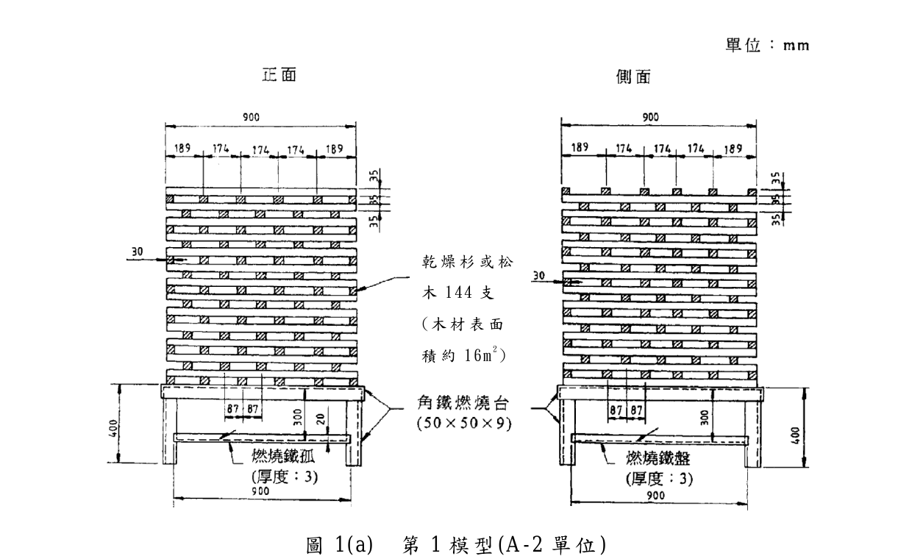

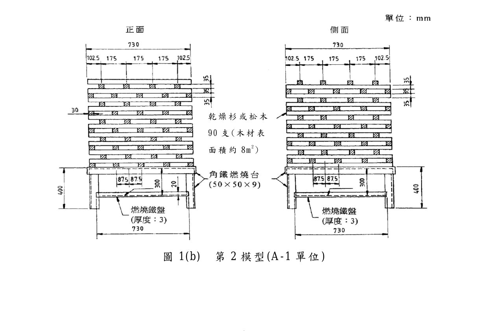

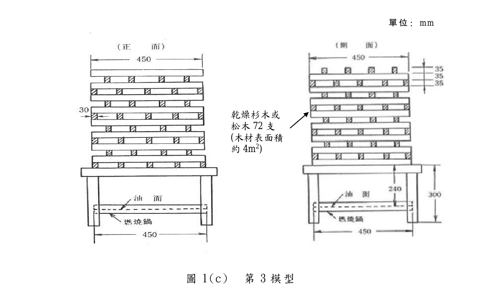

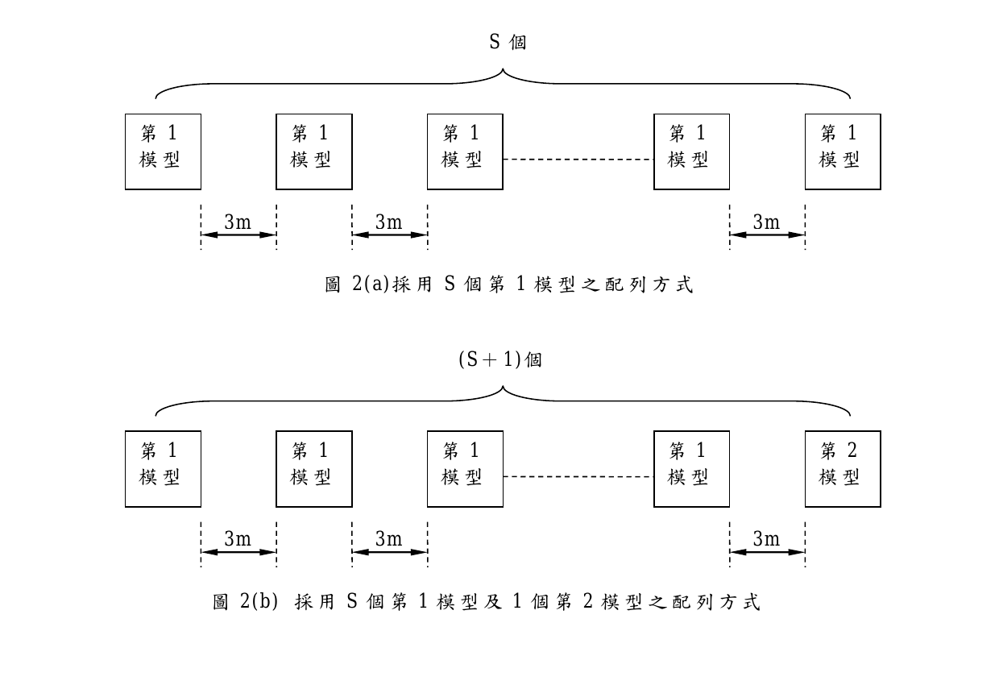

> 📷 以上截自原始 PDF 第 8～9 頁（內文頁 4～5）。

4. 實施第 1 種滅火試驗時，滅火器對 A 類火災之滅火效能值，如完全滅火 S 個第 1 模型時，為 $S \times 2$ 之值。如完全滅火 S 個之第 1 模型及 1 個第 2 模型時，為 $2S + 1$ 之值。

（二）第二種滅火試驗

1. 對象：適用測試 B 類火災滅火器之滅火效能值。

2. 方式：

   （1）模型應如圖 3 所示，並於表 2 所列模型中，採用模型號碼數值 1 以上之 1 個模型來測試。

   （2）滅火動作應於點火 1 分鐘後開始。

   （3）操作滅火器人員得穿著防火衣及面具。實施滅火試驗時，應與油盤保持 1 公尺以上距離。

   （4）應在風速 0.5m/s 以下之環境狀態進行，B-20 以上可於室外進行試驗（應在風速 3.0m/s 以下之環境狀態進行）。

3. 判定：滅火藥劑噴射完畢後 1 分鐘以內不再復燃者，可判定已完全熄滅。

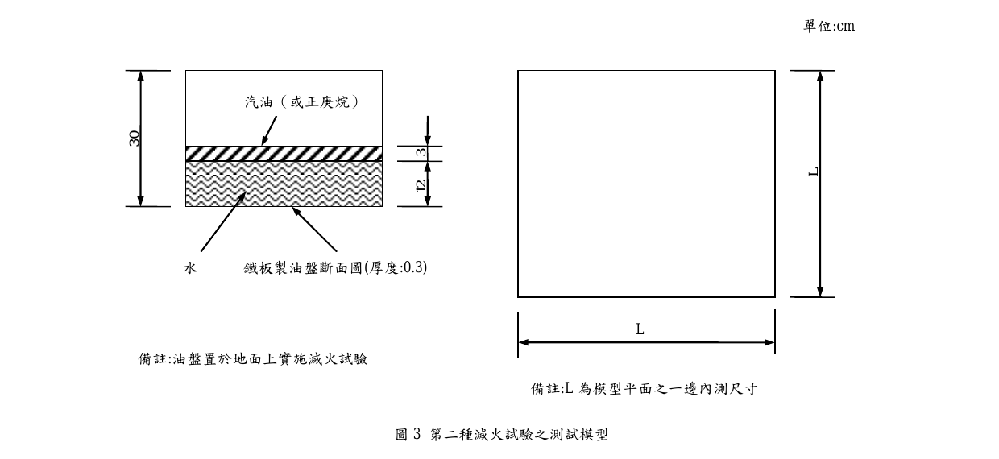

> 📷 截自原始 PDF 第 10 頁（內文頁 6）。

（三）合格判定

1. A、B 類滅火試驗第 1 次不合格者得再測試一次，並以第 2 次測試結果，作為判定依據。

2. 如係 A、B 類滅火器者，應先撲滅 A 類火災模型合格後，始可進行 B 類火災之滅火試驗，A 類火災滅火試驗不合格時，不得再進行 B 類火災滅火試驗。

（四）得免作滅火試驗之情形

1. 大型滅火器之滅火效能值，足認定其具有經型式認可之滅火效能值同等以上之值者。

2. 經國外第三公證機構認證，其滅火效能值足供認定具本基準滅火效能值同等以上之性能者。

表 2　適用 B 類火災滅火效能值之試驗模型

| 模型號碼 | 燃燒表面積（m²） | 模型一邊之長度 L（cm） | 汽油量（公升） | 滅火效能值 |
|---|---|---|---|---|
| 1 | 0.2 | 44.7 | 6 | B-1 |
| 2 | 0.4 | 63.3 | 12 | B-2 |
| 3 | 0.6 | 77.5 | 18 | B-3 |
| 4 | 0.8 | 89.4 | 24 | B-4 |
| 5 | 1.0 | 100 | 30 | B-5 |
| 6 | 1.2 | 109.5 | 36 | B-6 |
| 8 | 1.6 | 126.5 | 48 | B-8 |
| 10 | 2.0 | 141.3 | 60 | B-10 |
| 12 | 2.4 | 155.0 | 72 | B-12 |
| 14 | 2.8 | 167.4 | 84 | B-14 |
| 16 | 3.2 | 178.9 | 96 | B-16 |
| 18 | 3.6 | 189.7 | 108 | B-18 |
| 20 | 4.0 | 200.0 | 120 | B-20 |
| 24 | 4.8 | 219.1 | 144 | B-24 |
| 26 | 5.2 | 228.0 | 156 | B-26 |
| 28 | 5.6 | 237.0 | 168 | B-28 |
| 30 | 6.0 | 244.9 | 180 | B-30 |
| 32 | 6.4 | 252.4 | 192 | B-32 |
| 40 | 8.0 | 282.8 | 240 | B-40 |

### 五、操作機構

（一）滅火器除由其固定架取下之動作，背負動作以及取下其安全插梢之動作外，應以一動作能容易且確實開始噴射為原則。但小氣瓶放置於容器外面之加壓式滅火器及背負式滅火器得在二動作以內，輪架式滅火器得在三動作以內開始噴射。

（二）滅火器應依表 3 所列之滅火器分類及放射機構與操作方法，即可作動開始噴射。但背負式及輪架式滅火器者，不適用之。

（三）滅火器之安全插梢、手輪（回轉把手）、壓把、按鈕等操作部位，應以容易辨認之處置及簡明不易磨滅方式標示操作方法。

表 3　滅火器放射機構與操作方法

| 滅火器之分類 | 水滅火器 | 泡沫滅火器 | 二氧化碳滅火器 | 乾粉滅火器 | 強化液滅火器 |
|---|---|---|---|---|---|
| 放射機構：蓄壓式 | ○ | ○ | ○ | ○ | ○ |
| 放射機構：加壓式 | ○ | ○ | 　 | ○ | 　 |
| 操作方法：握緊壓把 | ○ | ○ | ○ | ○ | ○ |

備註：

1. 蓄壓式係常時將本體容器內之滅火藥劑利用氮氣、空氣等予以蓄壓，應安裝指示壓力錶者。

2. 二氧化碳係為液化氣體以充填於容器內之滅火藥劑本身之蒸氣壓來加壓者。構造雖為蓄壓式，但得不安裝指示壓力錶。

3. 加壓式係於使用時，將本體容器內之滅火藥劑，予以加壓者。一般之加壓氣體使用二氧化碳或氮氣並儲存於鋼瓶。

4. 型號 40 以上加壓式泡沫滅火器及型號 100 以上加壓式乾粉滅火器，應使用以氮氣為加壓氣體之容器。

### 六、耐蝕及防銹

（一）滅火器各部應使用優良質材料製造，與所充填滅火藥劑有接觸部分，應以不得被該滅火藥劑所腐蝕之材料製造（以下稱為耐蝕材料），或將該部分施予耐蝕加工，且與大氣有接觸部分，應使用不易生銹之材料製造或將該部分施予防銹加工。

（二）各種滅火器之耐蝕，防銹加工及塗裝，規定如表 4。但符合壹、十一、本體容器所用材質之厚度表 6 所列耐蝕性材質製造者，不適用之。

表 4　滅火器之耐蝕、防銹加工及塗裝

| 種類 | 筒體內部 | 筒體外部 |
|---|---|---|
| 水滅火器、泡沫滅火器、強化液滅火器 | 耐蝕及防銹加工後，塗裝環氧族樹脂或施予 PVC 皮膜加工，但滅火藥劑無腐蝕性者除外。 | 耐蝕及防銹加工後，施以烤漆或使用靜電塗裝、粉體塗裝等任何一種噴漆。 |
| 二氧化碳滅火器 | 噴砂處理或耐蝕防銹加工 | 耐蝕及防銹加工後，施以烤漆或使用靜電塗裝、粉體塗裝等任何一種噴漆。 |
| 乾粉滅火器 | 耐蝕及防銹加工 | 耐蝕及防銹加工後，施以烤漆或使用靜電塗裝、粉體塗裝等任何一種噴漆。 |

（三）容器內外經過耐蝕及防銹加工之滅火器，應剖開檢查，加工層不得有破裂，剝離，鼓起，生銹等現象，容器外底座應具耐摩擦或保護漆膜之措施。

（四）筒體外部，不含滅火器底部、把手、軟管、護蓋等，其紅色部應為筒體表面積 25% 以上，在設置狀態下，可以從任何角度確認紅色部。但圓點花樣等設計裝飾、銘牌與其圖示及使用方法表示部等之紅色，不計入紅色部之範圍。

（五）耐腐蝕試驗：滅火器容器本體內側與所充填滅火藥劑接觸部分，依下列規定實施耐腐蝕試驗：

1. 供試驗用之滅火器，應已完成壹、十二、本體容器之耐壓試驗。

2. 對於滅火器與所充填滅火藥劑接觸之部分施以表 5 所列之耐腐蝕試驗時，應不得發生生銹或其他異常情形。但符合壹、十一、本體容器所用材質之厚度表 6 所列耐蝕性材質製造之滅火器，得免實施耐腐蝕試驗。

表 5　滅火器耐腐蝕試驗

| 分類 | 耐腐蝕試驗 |
|---|---|
| 滅火器所充填之滅火藥劑為具鹼性者 | 浸入 3% 之氫氧化鈉水溶液 14 天 |
| 滅火器所充填之滅火藥劑為具酸性者 | 浸入 3% 之硫酸水溶液 14 天 |

註：

1. 上表「鹼性」係指酸鹼值超過 pH8 者；「酸性」係指未滿 pH6 者。

2. 耐腐蝕試驗係加入本體容器 50% 容量之試驗液，在室內常溫下，將容器本體成水平靜置，使試驗液浸泡涵蓋至本體容器之熔接線以上。

（六）耐蝕漆膜防銹試驗：依表 6 所列非耐蝕性材質取與滅火器本體相同材質之試驗片，依下列規定實施耐蝕漆膜防銹試驗：

1. 本項試驗之試驗片規定如下：

   - a. A 試驗片：(a) 大小為 50mm×150mm×（與滅火器本體容器相同厚度）。(b) 與滅火器本體容器相同材質。(c) 使用與滅火器相同之油漆，以相同之加工方法，在試驗片兩面漆上與滅火器漆層相同厚度之漆膜。
   - b. B 試驗片：(a) 大小為 50mm×150mm×0.3mm。(b) 材質為軟鋼板，符合 CNS 4622〔熱軋軟鋼板、鋼片及鋼帶〕或具同等以上之耐蝕性材質製造。(c) 使用與滅火器相同之油漆，以相同之加工方法，在試驗片兩面漆上與滅火器漆層相同厚度之漆膜。

2. 彎曲試驗：以 B 試驗片（共 5 片）實施試驗，將漆膜面向外之試驗片，靠在直徑為 10mm 之圓棒外圍，使其在 1 秒鐘內彎曲 180 度，除距離彎曲部分兩端 10mm 內範圍，其餘之漆膜不得發生裂開或剝離情形。

3. 衝擊試驗：以 A 試驗片（共 5 片）實施試驗，將漆膜面向上之試驗片固定於鋼製台面上，以前端裝有直徑 25mm 鋼球、重 300g 重物，於距離漆膜面 50cm 之高處，使鋼球向下掉落至漆膜面上，不得發生漆膜裂開或剝離情形。

4. 腐蝕試驗：以四周 10mm 部分用固體石蠟包覆之 A 試驗片（共 2 片），依上開（五）實施耐腐蝕試驗，除了試驗片四周 10mm 內，其餘之漆膜不得發生裂開、剝離、鼓起、生銹、顏色變化或顯著光澤變化等情形。

### 七、虹吸管

虹吸管之材質應為符合壹、十一、本體容器所用材質之厚度表 6 所列耐蝕性材質製造，如使用塑膠（聚合材料）者，應符合下列試驗規定，或提具國內外第三公證機構合格報告：

（一）先取 1 個自虹吸管切下寬為 12.7mm 之環狀樣品置於兩個平行鋼板間，以 5mm/min 進行壓縮試驗，並記錄施力及變形關係。

（二）再將 1 具完整的虹吸管及自虹吸管切下寬為 12.7mm 之環狀樣品（2 個），完全浸沒在滅火藥劑容器中，確定上開樣品無互相接觸。將該容器置於 100±3°C 恆溫箱 90 天後（或 87±3°C 恆溫箱 210 天後），在任何測試或尺寸測量進行前，暴露於 23±2°C 下冷卻至少 24 小時。

（三）將上開第 2 項環樣品置於兩個平行鋼板間，以 5mm/min 進行壓縮試驗，並記錄施力及變形關係，其試驗性能不得低於上開第 1 項測試前之壓壞強度值。如壓縮試驗無法取得材料特性有意義之測試數據結果者，得採 CNS 15606-1〔塑膠-抗拉性能測定法第 1 部：通則〕拉伸強度試驗，其試驗性能不得低於原拉伸強度之 40%。

（四）將上開虹吸管裝設於滅火器內，施以壹、十九、耐衝擊強度試驗後，不得發生破裂或損壞。

### 八、老化試驗

滅火器平時未承受壓力，於操作噴射時受壓之護蓋、栓塞、墊圈、噴嘴、軟管、濾網等構件，應為符合壹、十一、本體容器所用材質之厚度表 6 所列耐蝕性材質製造；如使用塑膠（聚合材料）者，需置於 100±3°C 恆溫箱 70 天（或 87±3°C 恆溫箱 180 天）後，將上開構件裝設於滅火器後，施以壹、十九、耐衝擊強度試驗，不得發生破裂或損壞。

### 九、噴射性能試驗

將滅火器放置於使用溫度範圍上、下限 ±2℃ 及 20±5℃ 環境中各保持 12 小時以上，取出立即以正常操作方法噴射時，應符合下列規定：

（一）操作噴射時，能使滅火藥劑迅速有效噴射。

（二）噴射時間為 10 秒鐘以上。

（三）具有效滅火之噴射距離，僅適用於 A 類火災之滅火器，應為 1m 以上；適用 A 類及 B 類火災或僅適用於 B 類火災之滅火器，應為在第二種滅火試驗中模型一邊之長度加上 1m 之距離（小數點以下無條件捨去）以上。

（四）能噴射所充填滅火藥劑容量或重量 90%（化學泡沫滅火藥劑為 85%）以上之量。

### 十、使用溫度範圍

在下列規定之滅火器溫度範圍使用時，能正常操作且有效發揮滅火及噴射性能。但以 10℃ 為單位加以擴大，仍能正常操作且有效發揮滅火及噴射性能者，不在此限。

（一）化學泡沫滅火器：5℃ 以上，40℃ 以下。

（二）其他滅火器：0℃ 以上，40℃ 以下。

### 十一、本體容器所用材質之厚度

滅火器本體容器所用材質之厚度應符合表 6 及下列（一）至（三）所訂厚度之換算規定：

表 6　滅火器本體容器所用材質之厚度（區分：加壓式滅火器或蓄壓式滅火器之本體容器）

| 材質性質 | 材質規定 | 內徑 | 板厚（mm） |
|---|---|---|---|
| 非耐蝕性 | 以符合 CNS 4622〔熱軋軟鋼板、鋼片及鋼帶〕或 CNS 9278〔冷軋碳鋼鋼片及鋼帶〕材質或具同等以上機械性能材質製造 | 內徑 120mm 以上 | 1.2 以上 |
| 非耐蝕性 | （同上） | 內徑未滿 120mm | 1.0 以上 |
| 耐蝕性 | 以符合 CNS 2253〔鋁及鋁合金片、捲及板〕、CNS 11073〔銅及銅合金板及捲片〕、CNS 10443〔銅及銅合金線〕、CNS 8497〔熱軋不銹鋼鋼板、鋼片及鋼帶〕或 CNS 8499〔冷軋不銹鋼鋼板、鋼片及鋼帶〕所列之耐蝕性材質或具同等以上耐蝕性材質製造 | 內徑 100mm 以上 | 1.0 以上 |
| 耐蝕性 | （同上） | 內徑未滿 100mm | 0.8 以上 |

（一）滅火器本體容器之材質為低碳鋼者，應符合下列規定：

1. 鋼材應可熔接加工，且材質中碳之最大含量（質量分率）為 0.25%，硫之最大含量為 0.05%，磷之最大含量為 0.05%。

2. 本體容器之最小厚度依下列公式計算，但應在 0.70mm 以上。

$$S = \frac{D}{300} + K \geq 0.7\,\text{mm}$$

- $S$：本體容器之最小厚度。
- $D$：容器之外徑，非圓柱形之容器，取滅火器容器之最大外對角線計算之。
- $K$ 值：當 $D \leq 80$ 時，取 0.45。當 $80 < D \leq 100$ 時，取 0.50。當 $D > 100$ 時，取 0.70。

（二）本體容器之材質使用不銹鋼鋼料製造者，應符合下列規定：

1. 材料之含碳量（質量分率）為未滿 0.03% 之沃斯田鐵不銹鋼（如 ASTM A240 所列 304L 不銹鋼）。

2. 容器上部之端板及底座與筒身熔接接合處，應以完全退火處理。

3. 本體容器之最小厚度依下列公式計算，但應在 0.64mm 以上。

$$S = \frac{D}{600} + K \geq 0.64\,\text{mm}$$

- $S$、$D$ 之說明與十一、（一）相同。
- $K$ 值取 0.3。

（三）本體容器之材質如使用鋁材者，應符合下列規定：

1. 容器之構造應為無縫之結構。

2. 本體容器之最小厚度依下列公式計算，但應在 0.71mm 以上。

$$S = \frac{D}{300} + K \geq 0.71\,\text{mm}$$

- $S$、$D$ 及 $K$ 值之說明與十一、（一）相同。

### 十二、本體容器之耐壓試驗

滅火器本體容器之耐壓，應依表 7 規定，以水壓施行 5 分鐘之試驗，不得發生洩漏、破損變形，亦不得產生圓周長 0.5% 以上之永久變形。

表 7　滅火器本體容器之耐壓

| 滅火器種類 | 非耐蝕材料：蓄壓式 | 非耐蝕材料：加壓式 | 備註 |
|---|---|---|---|
| 水滅火器及強化液滅火器 | 蓄壓壓力之 2.5 倍（小數點以下無條件進位） | － | 使用耐蝕性材質者所列壓力之 80%。 |
| 泡沫滅火器 | 蓄壓壓力之 2.5 倍（小數點以下無條件進位） | 36kgf/cm² | 使用耐蝕性材質者所列壓力之 80%。 |
| 二氧化碳滅火器 | 250kgf/cm² | － | 依據 CNS 12242〔無縫鋼製高壓氣體容器〕之有關規定。試驗後之永久膨脹率應為 10% 以下。 |
| 乾粉滅火器 | 蓄壓壓力之 2.5 倍（小數點以下無條件進位） | 36kgf/cm² | 在 40℃ 之閉鎖壓力或調整壓力之最大值為 12-18kgf/cm² |

### 十三、護蓋、栓塞、灌裝口及墊圈

（一）護蓋、栓塞及灌裝口之間，應以不易脫落之方法，嵌裝墊圈。

（二）護蓋或栓塞依壹、十二規定施行耐壓試驗時，不得有洩漏及顯著之變形。

（三）護蓋或栓塞之嵌合部位，於嵌裝墊圈時，其嵌合狀態應確實且按本體容器區分，分別作耐壓試驗時，能充分耐壓，且與灌裝口堅固嵌合。

（四）為灌裝滅火藥劑，需取下護蓋或栓塞時，應設置能將本體容器內壓力完全減壓之有效減壓孔或減壓溝。護蓋或栓塞，於開始減壓之前，應能耐本體容器內之壓力。

（五）墊圈應不會被所灌裝滅火藥劑侵蝕，且滅火器於使用溫度範圍內使用時，不得對該滅火器之機能產生不良影響。

### 十四、閥體

（一）滅火器之閥體應符合下列規定：

1. 除依下列（二）規定之閥以外，以 55kgf/cm² 施行耐壓試驗 1 分鐘後，不得有洩漏及顯著變形。

2. 手轉式（回轉把手式）之閥，應有旋轉 1¼ 轉以下，能全開之構造。

3. 閥開啟時，該閥不得有分解或脫落現象。

4. 閥本體應採用 CNS 10442〔銅及銅合金棒〕之材質或同等以上強度及耐蝕性材質製造。

（二）應適用 CNS 12242〔無縫鋼製高壓氣體容器〕之蓄壓式滅火器及滅火器之加壓用氣體容器（設有作動封板者除外），應依 CNS 11176〔二氧化碳、鹵化烷及乾粉等滅火設備用容器閥安全裝置及破壞板〕等標準，設置容器閥，且該容器閥亦應符合下列規定：

1. 閥本體應採用 CNS 11073〔銅及銅合金板、捲片〕、CNS 10442〔銅及銅合金棒〕等標準之材質或同等以上強度及耐蝕性材質製造。

2. 裝於二氧化碳滅火器或灌裝二氧化碳作為加壓氣體之容器，其閥本體應以 250kgf/cm² 壓力；裝於其他者，應以裝設該容器閥之容器耐壓試驗壓力，施行 5 分鐘之水壓試驗，不得發生洩漏及明顯變形。

3. 與裝設該閥之容器之內部氣體溫度為 40℃ 時之內部壓力相等之壓力，以此氣體壓力加壓 5 分鐘試驗時，閥不得有漏氣或顯著之變形。

4. 應設有安全閥。

### 十五、軟管

（一）滅火器應裝置軟管。但二氧化碳滅火器所裝滅火藥劑量未滿 4kg 者，乾粉滅火器所裝滅火藥劑量在 2kg 以下及泡沫滅火器之滅火藥劑量在 3 公升以下等，均不適用。

（二）滅火器用軟管應符合下列規定：

1. 依壹、十二規定施行耐壓試驗時，軟管不得發生洩漏或顯著之變形。

2. 應有足夠長度及內徑，能有效噴射滅火藥劑，且應符合壹、三十五之規定。

3. 於使用溫度範圍內，應具有耐久性且能順利操作。

4. 二氧化碳滅火器之軟管，應符合壹、三十一、（二）規定。

### 十六、噴嘴

（一）滅火器之噴嘴，不得安裝開閉式及切換式之裝置（但輪架式滅火器除外）。背負式滅火器或加壓式乾粉滅火器則可裝開閉式噴嘴。

（二）滅火器之噴嘴，應符合下列規定：

1. 內面應加工平滑。

2. 開閉式或切換式噴嘴之開閉或切換操作，應圓滑且噴射滅火藥劑時不得發生洩漏或其他障礙。

3. 開閉式噴嘴，以 3kgf/cm² 壓力加予水壓 5 分鐘試驗時，不得發生洩漏。

4. 開放式噴嘴裝有栓塞者，於使用溫度範圍內，不得發生洩漏且作動時應能確實噴射滅火藥劑。

### 十七、過濾網

化學泡沫滅火器其連接至噴嘴或軟管之藥劑導管（如無藥劑導管之滅火器則為噴嘴），在本體容器內之開口部，應依下列規定裝設過濾網：

（一）過濾網網目之最大徑，應為噴嘴最小徑之 3/4 以下。

（二）過濾網網目部分之合計面積，應為噴嘴開口部最小剖面積之 30 倍以上。

### 十八、液位標示

滅火器本體容器內面，應有充填滅火藥劑液位之簡明標示。但蓄壓式滅火器或乾粉滅火器不適用之。

### 十九、耐衝擊強度

滅火器對搬運或作動操作引起之意外摔落、衝擊等，應有充分之耐衝擊強度，且應使用具有耐久性之良質堅固之材料製造。

### 二十、防止滅火藥劑之洩漏

滅火器應設有防止洩漏裝置，以免因溫度上昇、振動等使所充填之滅火藥劑洩漏。但無發生洩漏之虞之構造者，不適用之。

### 二十一、安全插梢

滅火器裝有安全插梢者，應符合下列規定：

（一）設有安全插梢者應有防止意外之裝置。

（二）安全插梢以一個動作即可容易拉拔，且有不影響拉拔動作之封條。

（三）手提式滅火器並應符合下列規定：

1. 材料應符合 CNS 3476〔不銹鋼線〕之 SUS 304 不銹鋼線規定或有同等以上之耐蝕性及耐候性材料。

2. 除拉拔動作以外之動作，不得容易脫落。

### 二十二、攜帶或搬運之裝置

（一）滅火器重量（不含固定掛鉤、背負帶或輪架之重量）在 28kg 以下者應為手提式或背負式，超過 28kg 而在 35kg 以下者應為輪架式或背負式，超過 35kg 以上者應為輪架方式。

（二）滅火器之把手、車把、背負帶或輪架應堅固，且適合滅火器攜帶、搬運及操作。

### 二十三、安全閥

（一）滅火器之安全閥應符合下列規定：

1. 能將本體容器內之壓力有效減壓。

2. 有不能擅自分解或調整之構造。

3. 安全閥之安裝螺紋應符合 CNS 10848〔高壓鋼瓶閥〕規定，且嵌入墊圈時確實與裝接部嵌合。

4. 封板式者，應在噴出口處加封。

5. 標示「安全閥」字樣。

（二）滅火器本體容器（限無縫鋼製高壓氣體容器）或容器閥以外之閥，所裝之安全閥，應符合表 8 規定。

表 8　安全閥作動壓力範圍（安全閥作動壓力（kgf/cm²）之範圍）

| 設有安全閥滅火器之區分 | 作動壓力的上限值 | 作動壓力的下限值：封板式 | 作動壓力的下限值：彈簧式 |
|---|---|---|---|
| 加壓式滅火器：具有開閉式噴嘴者 | P×1.3 | P×1.1 | P×1.0 |
| 加壓式滅火器：具有開閉式噴嘴以外之噴嘴者 | P×0.9 | R×1.1 | R×1.0 |
| 蓄壓式滅火器 | Q×1.3 | Q×1.1 | Q×1.0 |

備註：

1. P：(A) 具有加壓用高壓氣體容器及壓力調整器之滅火器之本體容器者調整壓力之最大值。(B) 上述 (A) 以外之本體容器，其內部溫度為 40℃ 時之閉塞壓力值之最大值。

   Q：蓄壓式滅火器之本體容器，以其內部溫度為 40℃ 時，壓力錶表示蓄壓之上限值。

   R：本體容器內部溫度為 40℃ 時，噴射中本體容器之內部壓力之最大值。

2. 滅火器之使用溫度範圍超過 40℃ 者，以其最高溫度進行檢測。

（三）裝設在二氧化碳滅火器及充填二氧化碳或氮氣之加壓用高壓氣體容器之容器閥上之安全閥，應符合 CNS 11176〔二氧化碳、鹵化烷及乾粉等滅火設備用容器閥、安全裝置及破壞板〕之相關規定。

### 二十四、加壓用氣體容器

（一）內容積超過 100cm³ 之加壓用氣體容器，應符合下列規定：

1. 充填氣體後，將容器置 40℃ 溫水中，施以 2 小時浸水試驗時，不得發生洩漏現象。

2. 裝置於本體容器內部之加壓用氣體容器之外面，不得被充填於本體容器之滅火藥劑所腐蝕，而且標示塗料等不得剝落。

3. 裝於本體容器外部之加壓用氣體容器，對來自外部之衝擊有保護措施。

4. 使用二氧化碳之加壓用氣體容器所灌裝之二氧化碳，每 1g 有 1.5cm³ 以上之內容積。

5. 作動封板，於 180kgf/cm² 以上鋼瓶設計破壞壓力之 3/4 以下之壓力，施以水壓試驗時，應能破裂。

（二）內容積 100cm³ 以下之加壓用氣體容器，應符合壹、二十四、（一）、1 至 4 及下列規定：

1. 灌裝二氧化碳者以 250kgf/cm² 之壓力，如灌裝氮氣者以最高灌裝壓力之 5/3 倍壓力，實施水壓試驗 2 分鐘時，不得發生洩漏或異常膨脹。

2. 作動封板，依壹、二十四、（二）、1 規定之壓力，實施水壓試驗時，不得被破壞。

3. 加壓用高壓容器封板被破壞時，不得對周圍產生危險。

### 二十五、壓力調整器

（一）應符合 CNS 12896〔氣體熔接截割（切斷）用壓力調整器〕規定，但放出能力部分除外。

（二）應為不能任意分開或作調整之構造。

（三）壓力錶表示調整壓力之範圍，應以綠色標示之。

### 二十六、氣體導入管

加壓式滅火器本體容器內之氣體導入管，以 36 kgf/cm² 之壓力；加壓用氣體容器與滅火器本體容器之間裝有壓力調整器，或未裝壓力調整器，僅裝開閉閥者，其加壓用氣體容器至壓力調整器或開關閥之間之氣體導入管，則以 200 kgf/cm² 之壓力，各施以水壓試驗 5 分鐘，不得發生洩漏或顯著變形。

### 二十七、指示壓力錶

蓄壓式滅火器（二氧化碳滅火器除外）應裝設符合下列規定之指示壓力錶：

（一）指示壓力錶之指示壓力容許差，施以下列試驗時，應在使用壓力範圍壓力值之 ±10% 以內。

1. 使用壓力上限值之 2 倍壓力，施以繼續 30 分鐘之靜壓試驗。

2. 從零加壓至使用壓力上限值後，再減壓至零，以每分鐘 15 次之速度操作，反覆作 1000 次。

3. 將壓力錶收納於重量 1kg 之木箱內，由高度 50cm 處向硬木地板面自然落下。

4. 將環境溫度自 0℃ 至 40℃ 之溫度範圍，作變化之試驗。

（二）刻度標示應容易辨認。

（三）指針及刻度盤應使用耐蝕性金屬製成。

（四）壓力檢出部位及其連接部應具耐久性。

（五）將外殼浸入在溫度 40℃ 水中 20 分鐘，不得有洩漏，且壓力被閉塞在外殼內時，應具有效減壓之構造。

（六）指示壓力錶之安裝螺紋，應符合 CNS 494〔平行管螺紋〕、CNS 495〔推拔管螺紋〕或中央主管機關認可之規定，且當壓力錶裝配時應能與裝接部確實吻合相配。

（七）表示使用壓力之範圍，應使用綠色標示之。

### 二十八、驅動氣體

作為滅火器噴射壓力之壓力源，於滅火器所充填之驅動氣體對滅火藥劑之性能或性狀不得產生不良影響。蓄壓式乾粉滅火器之驅動氣體應使用氮氣，加壓式乾粉滅火器所裝之加壓用氣體容器，50 型以下者使用二氧化碳，100 型以上者應使用氮氣。僅水系滅火器才可使用空氣或氮氣。

### 二十九、振動試驗（車用型）

車用滅火器應依圖 A 至 C 之方式安裝，施以全振幅 2mm，振動數每分鐘 2000 次頻率之上下振動試驗。依圖 A 及 B 方式者，應測試 2 小時；依圖 C 方式者，應測試 4 小時後，上開均不得發生洩漏、龜裂、破斷或顯著之變形。滅火器附有固定架者，以固定架代替安裝裝置實施試驗，固定架亦不得發生顯著之損傷及其他障礙。

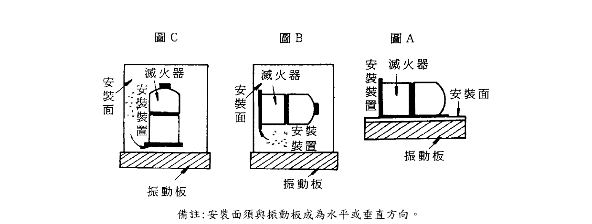

> 📷 截自原始 PDF 第 22 頁（內文頁 18）。

### 三十、作動軸及氣體導入管

將噴射壓力之壓力源氣體導入滅火器之本體容器內之作動軸或氣體導入管，應符合下列規定：

（一）作動軸能將加壓用氣體容器之蓋，容易且確實開啟之構造及強度。

（二）氣體導入管能將噴射壓力之壓力源氣體，有效導入滅火器本體容器內之構造及強度。

### 三十一、充填比

（一）二氧化碳滅火器本體容器充填滅火藥劑之容積應符合表 9 規定：

表 9　二氧化碳滅火器之充填比

| 滅火藥劑種類 | 滅火藥劑重量每 1kg 之容器容積 |
|---|---|
| 二氧化碳 | 1500cm³ 以上 |

（二）二氧化碳滅火器軟管不受壹、十五規定之限制，施以下列試驗時不得發生洩漏、龜裂、明顯變形及其他障礙之情形：

1. 將軟管拉直狀態下，以 160kgf/cm² 之壓力，施予水加壓試驗 5 分鐘。

2. 將軟管彎成與軟管外徑 5 倍相同內徑之環狀時，施予 120kgf/cm² 水壓試驗 5 分鐘。

3. 輪架式滅火器於噴管手把處應設置控制閥。

（三）二氧化碳滅火器噴管（鐵管部分）之周圍，應使用隔熱材料之手把包覆。

（四）手提式二氧化碳滅火器之喇叭噴管應使用非吸濕性，且與電氣絕緣之強韌材料製造。10 型以上二氧化碳滅火器之喇叭噴管長度包括手把應為 35cm 以上。

（五）二氧化碳滅火器之噴管及其連結零件，依上開（二）、1 之規定壓力，試予 5 分鐘水壓試驗時，不得發生脫離、洩漏或其他障礙。

### 三十二、高壓氣體容器

應符合 CNS 12242〔無縫鋼製高壓氣體容器〕之滅火器容器及加壓用氣體容器之規定。

### 三十三、保持裝置

（一）手提式滅火器（車用滅火器除外）應有能使該滅火器保持穩定狀態之掛鉤。但能垂直放置者不適用之。

（二）保持用掛鉤應能容易取下滅火器之構造者。

### 三十四、標示

本基準所規定之標示應為不易磨滅之方式予以標示，其測試之方法為以目視檢查並且以手持一片浸水之棉片擦拭 15 秒，再以一片浸石油精（petroleum spirit）之棉片摩擦 15 秒後，標示之內容仍應容易識別，而標籤之標示亦不得有捲曲現象。測試中之石油精應採用芳香族成份不得超過總體積 0.1% 之脂溶劑，其丁烷值為 29，沸點為 65℃，蒸發點為 69℃，密度為 0.66kg/ℓ。

（一）除住宅用滅火器標示另依壹、三十七（三）規定外，滅火器本體容器（包括進口產品），應用中文以不易磨滅之方法，在滅火器設置狀態下，以軟管或噴嘴左方 90 度位置為中心，左右不超過 150 度之範圍內，標示下列事項：

1. 設備名稱及型號。

2. 廠牌名稱或商標。

3. 型式、型式認可號碼。

4. 製造年月。

5. 使用溫度範圍。

6. 不可使用於 B 類火災、C 類火災者，應標明。

7. 對 A 類火災及 B 類火災之滅火效能值。

8. 噴射時間。

9. 噴射距離。

10. 製造號碼或製造批號。

11. 使用方法及圖示。

12. 製造廠商（名稱、電話、地址及商品原產地。屬進口產品者，並應標示進口商名稱、電話、地址及產地名稱）。

13. 施以水壓試驗之壓力值。

14. 應設安全閥者應標示安全閥之作動壓力。

15. 充填滅火藥劑之容量或重量。

16. 總重量（所充填滅火藥劑以容量表示者除外）。

17. 使用操作上應注意事項（至少應包括汰換判定方法、自行檢查頻率及安全放置位置等）。

18. 加壓式滅火器或蓄壓式滅火器。

（二）如係車用滅火器，應以紅色字標示「車用」，字體大小為每字 1.8×1.8cm 以上。

（三）滅火器本體容器，應依下列規定，設置圓形之適用火災類別標示：

1. 所充填滅火藥劑容量在 2ℓ 或重量在 3kg 以下者，半徑應 1cm 以上；超過 2ℓ 或 3kg 者，半徑為 1.5cm 以上。

2. 適用火災之圖例如圖 4。

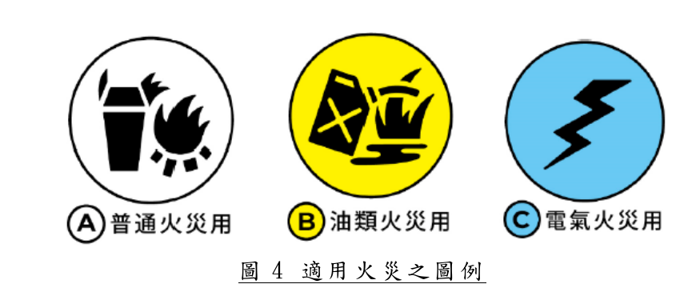

> 📷 截自原始 PDF 第 24 頁（內文頁 20）。

3. 切換噴嘴，所適用火災分類有不同之滅火器，如適用 B 類火災之噴嘴者，以黑色字明確標示「△△噴嘴時適用於油類火災」字樣；適用電氣火災（C 類火災）之噴嘴者，以白色字明確標示「○○噴嘴時適用於電氣火災」字樣。

4. 上開 2 及 3 規定圖案及字樣以外部分，普通火災用者以白色，油類火災用者以黃色，電氣火災用者以藍色作底完成。

### 三十五、滅火器規格

各種滅火器其規格包括型號，滅火藥劑充填量，滅火效能值，噴射距離，噴射時間，蓄壓壓力，加壓用氣體量，軟管規格，無縫鋼瓶等，得參考表 10 至表 13 所列規格進行試驗；進口品符合國外第三公證機構認證者，得載明引用本基準或國外標準，與測試之標準值及結果值，進行比對或換算後，申請規格登錄或試驗。

表 10　水滅火器規格

| 型號 | 充填量 ℓ（以上） | 滅火效能值 | 噴射距離（m） | 噴射時間（秒） | 蓄壓壓力 kgf/cm² | 軟管・內徑（mm）及長度（m） |
|---|---|---|---|---|---|---|
| 3 | 3 | A-2 | 6 以上 | 30 以上 | 7±0.7 | 能有效噴射 |
| 6 | 6 | A-2 | 6 以上 | 40 以上 | 7±0.7 | 能有效噴射 |
| 8 | 8 | A-2 | 6 以上 | 50 以上 | 7±0.7 | 能有效噴射 |

表 11　機械泡沫滅火器規格

| 滅火藥劑 | 型號 | 充填量 ℓ（以上） | 滅火效能值 | 噴射距離 m（20℃） | 噴射時間 秒（20℃） | 蓄壓壓力 kgf/cm² | 加壓式 N₂ 或空氣容量（以上） | 軟管・內徑（mm）及最小長度（m） |
|---|---|---|---|---|---|---|---|---|
| 水成膜泡沫 | 3 | 3 | A-1，B-5 或 A-1，B-6 | 3～7 | 30～50 | 7±0.7 | － | － |
| 水成膜泡沫 | 6 | 6 | A-1，B-10 或 A-2，B-12 | 3～7 | 48～67 | 7±0.7 | － | 能有效噴射 |
| 水成膜泡沫 | 8 | 8 | A-2，B-14 或 A-3，B-16 | 3～7 | 62～101 | 7±0.7 | － | 能有效噴射 |
| 水成膜泡沫 | 20 | 20 | A-4，B-20 或 A-8，B-20 | 4～10 | 70～87 | 10.5±0.7 | － | 13φ×0.7 |
| 水成膜泡沫 | 40 | 40 | A-8，B-20 | 7 以上 | 70 以上 | 13.7±0.7 | 1,500L | 19φ×10 |
| 水成膜泡沫 | 60 | 60 | A-10，B-20 | 7 以上 | 80 以上 | 13.7±0.7 | 2,500L | 19φ×15 |
| 水成膜泡沫 | 80 | 80 | A-10，B-20 | 7 以上 | 80 以上 | 13.7±0.7 | 3,000L | 19φ×15 |
| 表面活性劑泡沫 | 2 | 2 | A-1，B-3 | 3～6 | 36 | 7±0.7 | － | 能有效噴射 |
| 表面活性劑泡沫 | 3 | 3 | A-2，B-5 | 3～7 | 36～55 | 7±0.7 | － | 能有效噴射 |
| 表面活性劑泡沫 | 6 | 6 | A-3，B-8 | 3 以上 | 45 以上 | 7±0.7 | － | 能有效噴射 |
| 表面活性劑泡沫 | 8 | 8 | A-4，B-12 | 4 以上 | 45 以上 | 7±0.7 | － | 能有效噴射 |
| 表面活性劑泡沫 | 20 | 20 | A-10，B-20 | 5 以上 | 60 以上 | 10.5±0.7 | － | 13φ×0.7 |
| 表面活性劑泡沫 | 40 | 40 | A-10，B-20 | 5 以上 | 60 以上 | 13.7±0.7 | 1,500L | 能有效噴射×10 |
| 表面活性劑泡沫 | 60 | 60 | A-10，B-20 | 7 以上 | 80 以上 | 13.7±0.7 | 2,500L | 19φ×15 |
| 表面活性劑泡沫 | 80 | 80 | A-10，B-20 | 7 以上 | 80 以上 | 13.7±0.7 | 3,000L | 19φ×15 |

表 12　二氧化碳滅火器規格

| 型號 | 充填量 kg | 滅火效能值 | 噴射距離 m | 噴射時間 秒 | 軟管・內徑（mm）及最小長度（m） | 無縫鋼瓶重量 kg | 無縫鋼瓶容積 L |
|---|---|---|---|---|---|---|---|
| 5 | 2.3 | B-1，C | 1.7 以上 | 10 以上 | 能有效噴射 | 6.0 以下 | 3.45 以上 |
| 10 | 4.5 | B-4，C | 2.3 以上 | 10 以上 | 能有效噴射×0.70 | 10.0 以下 | 6.75 以上 |
| 15 | 6.8 | B-6，C | 2.3 以上 | 14 以上 | 能有效噴射×0.70 | 14.5 以下 | 10.2 以上 |
| 20 | 9.0 | B-6，C | 2.3 以上 | 15 以上 | 能有效噴射×0.70 | 16.0 以下 | 13.5 以上 |
| 50 | 22.5 | B-8，C | 4.3 以上 | 25 以上 | 能有效噴射×4.5 | 50.0 以下 | 34.5 以上 |
| 100 | 45.0 | B-20，C | 4.3 以上 | 35 以上 | 能有效噴射×7.5 | 85.0 以下 | 67.5 以上 |

表 13　乾粉滅火器規格

| 型號 | 乾粉種類 | 充填量 kg（以上） | 滅火效能值 | 噴射距離 m | 噴射時間 秒 | 蓄壓壓力 kgf/cm² | 加壓式 CO₂(g) | 加壓式 N₂(ℓ)（以上） | 軟管內徑（mm）及最小長度（m） |
|---|---|---|---|---|---|---|---|---|---|
| 3 | ABC | 1.0 | A-1，B-2，C | 2 以上 | 10 以上 | 10.5±0.7 | 18 | － | 能有效噴射 |
| 5 | ABC | 1.8 | A-1，B-4，C | 3 以上 | 10 以上 | 10.5±0.7 | 30 | － | 能有效噴射 |
| 10 | ABC | 3.5 | A-3，B-10，C | 5 以上 | 10 以上 | 13.7±0.7 | 60 | － | 能有效噴射 |
| 10 | BC | 4.0 | B-8，C | 5 以上 | 10 以上 | 13.7±0.7 | 60 | － | 能有效噴射 |
| 10 | KBC | 3.5 | B-12，C | 5 以上 | 10 以上 | 13.7±0.7 | 60 | － | 能有效噴射 |
| 10 | XBC | 3.0 | B-16，C | 5 以上 | 10 以上 | 13.7±0.7 | 60 | － | 能有效噴射 |
| 20 | ABC | 6.5 | A-5，B-16，C | 5 以上 | 12 以上 | 13.7±0.7 | 155 | － | 能有效噴射 |
| 20 | BC | 8.0 | B-14，C | 5 以上 | 12 以上 | 13.7±0.7 | 155 | － | 能有效噴射 |
| 20 | KBC | 6.5 | B-18，C | 5 以上 | 12 以上 | 13.7±0.7 | 155 | － | 能有效噴射 |
| 20 | XBC | 5.5 | B-24，C | 5 以上 | 12 以上 | 13.7±0.7 | 155 | － | 能有效噴射 |
| 30 | ABC | 10.0 | A-5，B-24，C | 5 以上 | 14 以上 | 13.7±0.7 | 235 | － | 能有效噴射 |
| 30 | BC | 12.0 | B-16，C | 5 以上 | 14 以上 | 13.7±0.7 | 235 | － | 能有效噴射 |
| 30 | KBC | 10.0 | B-26，C | 5 以上 | 14 以上 | 13.7±0.7 | 235 | － | 能有效噴射 |
| 30 | XBC | 8.5 | B-30，C | 5 以上 | 14 以上 | 13.7±0.7 | 235 | － | 能有效噴射 |
| 50 | ABC | 18.0 | A-8，B-30，C | 6 以上 | 30 以上 | 16.5±0.7 | 450 | － | 13φ×0.7 |
| 50 | BC | 20.0 | B-20，C | 6 以上 | 30 以上 | 16.5±0.7 | 450 | － | 13φ×0.7 |
| 50 | KBC | 18.0 | B-32，C | 6 以上 | 30 以上 | 16.5±0.7 | 450 | － | 13φ×0.7 |
| 50 | XBC | 15.0 | B-40，C | 6 以上 | 30 以上 | 16.5±0.7 | 450 | － | 13φ×0.7 |
| 100 | ABC | 36.0 | A-10，B-30，C | 7 以上 | 40 以上 | 16.5±0.7 | － | 1500 | 19φ×10 |
| 100 | BC | 30.0 | B-20，C | 7 以上 | 40 以上 | 16.5±0.7 | － | 1500 | 19φ×10 |
| 100 | KBC | 36.0 | B-32，C | 7 以上 | 40 以上 | 16.5±0.7 | － | 1500 | 19φ×10 |
| 100 | XBC | 30.0 | B-40，C | 7 以上 | 40 以上 | 16.5±0.7 | － | 1500 | 19φ×10 |
| 150 | ABC | 54.0 | A-10，B-30，C | 7 以上 | 50 以上 | 16.5±0.7 | － | 2500 | 19φ×15 |
| 150 | BC | 60.0 | B-20，C | 7 以上 | 50 以上 | 16.5±0.7 | － | 2500 | 19φ×15 |
| 150 | KBC | 54.0 | B-32，C | 7 以上 | 50 以上 | 16.5±0.7 | － | 2500 | 19φ×15 |
| 150 | XBC | 45.0 | B-40，C | 7 以上 | 50 以上 | 16.5±0.7 | － | 2500 | 19φ×15 |
| 200 | ABC | 72.0 | A-10，B-30，C | 7 以上 | 60 以上 | 16.5±0.7 | － | 3000 | 19φ×15 |
| 200 | BC | 80.0 | B-20，C | 7 以上 | 60 以上 | 16.5±0.7 | － | 3000 | 19φ×15 |
| 200 | KBC | 72.0 | B-32，C | 7 以上 | 60 以上 | 16.5±0.7 | － | 3000 | 19φ×15 |
| 200 | XBC | 60.0 | B-40，C | 7 以上 | 60 以上 | 16.5±0.7 | － | 3000 | 19φ×15 |

### 三十六、容許公差

滅火器充填之滅火藥劑重量（或總重量），加壓用容器所充填之二氧化碳重量、氮氣壓力以及軟管內徑之容許公差，應符合表 14 至表 17 之規定。

表 14　滅火藥劑重量或總重量之容許公差

| 藥劑表示重量 | 總重量容許公差 |
|---|---|
| 1kg 未滿 | +80g～−40g |
| 1kg 以上～2kg 未滿 | +100g～−80g |
| 2kg 以上～5kg 未滿 | +200g～−100g |
| 5kg 以上～8kg 未滿 | +300g～−200g |
| 8kg 以上～10kg 未滿 | +400g～−300g |
| 10kg 以上～20kg 未滿 | +600g～−400g |
| 20kg 以上～40kg 未滿 | +1,000g～−600g |
| 40kg 以上～100kg 未滿 | +1,600g～−800g |
| 100kg 以上 | +2,400g～−1,000g |

表 15　二氧化碳重量之容許公差

| 充填量 | 容許公差 |
|---|---|
| 5g 以上～10g 未滿 | +0.6g～−1.0g |
| 10g 以上～20g 未滿 | ±3g |
| 20g 以上～50g 未滿 | ±5g |
| 50g 以上～200g 未滿 | ±10g |
| 200g 以上～500g 未滿 | ±20g |
| 500g 以上 | ±30g |

表 16　氮氣之容許公差

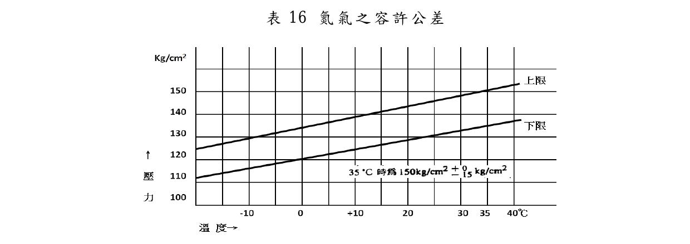

> 📷 截自原始 PDF 第 28 頁（內文頁 24）。本表為「壓力（kg/cm²）－溫度（℃）」之上下限曲線圖（35℃ 時為 150kg/cm²，容許公差 +0／−15 kg/cm²）。

表 17　軟管內徑之容許公差

| 標稱內徑 | 容許公差 |
|---|---|
| 10mm 以下 | ±0.5mm |
| 超過 10mm | ±1.0mm |

### 三十七、住宅用滅火器

（一）住宅用滅火器應為蓄壓式滅火器，且不具更換或充填滅火藥劑之構造。滅火器以接著劑將外蓋等固定在本體容器上者，如將其外蓋打開所需之力達 50 牛頓米（N·m）以上者，即視為不能再更換或充填滅火藥劑之構造。

（二）住宅用滅火器應依下列規定實施試驗：

1. 住宅用滅火器外觀構造及性能準用本基準壹、三、適用性；十一、本體容器所用材質之厚度；十二、本體容器之耐壓試驗；十三、護蓋、栓塞、灌裝口及墊圈；十四、閥體；十五、軟管；十六、噴嘴；十九、耐衝擊強度；二十一、安全插梢；二十二、攜帶或搬運之裝置；二十三、安全閥；二十七、指示壓力錶；三十三、保持裝置之規定。

2. 住宅用滅火器準用本基準壹、六、耐蝕及防銹規定，但筒體外部可使用非紅色塗裝。

3. 住宅用滅火器準用本基準壹、九、噴射性能試驗規定，應能噴射所充填滅火藥劑容量或重量為 85% 以上之量。

4. 實施下列普通火災至電氣火災滅火性能試驗各 3 次：

   A. 普通火災

   （1）使用圖 1(c) 之模型，木材使用杉木或松木，其含水率應介於 10% 至 14% 間。

   （2）木材長度（L）容許公差介於 −5mm 至 +10mm 之間，寬度（W）及厚度（H）容許公差為 ±1mm。

   （3）在油盤中，加入 0.6ℓ 之無鉛汽油或正庚烷，加以點火。

   （4）於點火 3 分鐘後，進行滅火。

   （5）噴射時採全量噴放。

   （6）依前述（1）至（5）規定進行滅火試驗，滅火藥劑噴放完畢時，木材模型上不得有殘焰，且 2 分鐘內不得復燃。

   B. 高溫油鍋火災

   （1）火災滅火試驗模型、油炸鍋、瓦斯爐等裝置如圖 5。

   （2）油炸鍋應為鋼製鍋，厚度 2.5mm 以上，其開口部分直徑為 300(±10)mm，加入食用油 1ℓ 時，其油面直徑為 230(±5)mm。

   （3）供瓦斯爐使用之燃氣，為液化石油氣。

   （4）試驗用油應使用著火溫度為 360℃～370℃ 之食用油。若達 370℃ 時仍未能著火，則在熱電偶偵測溫度 370℃ 時強制點火，於熱電偶偵測溫度到達 400℃ 時開始滅火。

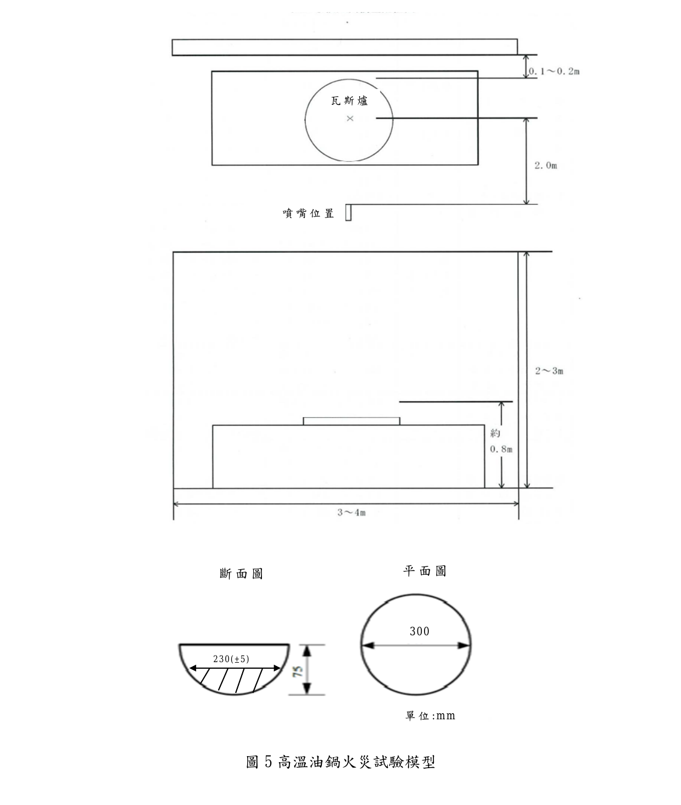

> 📷 截自原始 PDF 第 30 頁（內文頁 26）。

   （5）應在鍋子中心軸距離油面以下垂直深度 (10±3)mm 處，利用熱電偶偵測溫度。

   （6）持續放射至滅火器藥劑全部噴放完畢，且不得由模型之背面進行滅火放射。

   （7）依（1）及（6）規定進行滅火試驗時，於滅火藥劑噴放過程中不得造成火勢擴大、實驗用油噴濺等情形，且噴放完畢後 1 分鐘內不得復燃。

   C. 電氣火災

   依壹、三、（二）表 1 備註 5 規定實施試驗合格。

   D. 合格判定

   （1）實施上開普通火災至電氣火災滅火性能試驗各 3 次，3 次試驗應至少有 2 次能滅火。

   （2）A 類火災試驗，在第 1 次試驗噴射完畢後，4 分鐘內不再復燃者，得免作第 2 次試驗。

   （3）對於高溫油鍋火災，如有下列情形之一者，視為無法滅火：

   - a. 產生油之噴濺或對滅火人員可能造成燒傷之危險。
   - b. 滅火時，火焰高度超過油炸鍋上緣 1.8 m。
   - c. 滅火時，火焰高度超過油炸鍋上緣 1.2 m 且持續 3 秒鐘以上。

（三）標示

住宅用滅火器本體容器，應在滅火器設置狀態下，正對指示壓力錶，左右不超過 150 度之範圍內，標示下列事項：

1. 住宅用滅火器標示類別，依表 18 規定：

表 18　住宅用滅火器標示類別

| 住宅用滅火器類別 | 住宅用滅火器滅火藥劑成分 |
|---|---|
| 住宅用水滅火器 | 水（含濕潤劑）等 |
| 住宅用乾粉滅火器 | 磷酸鹽、硫酸鹽等 |
| 住宅用強化液滅火器 | 強化液（鹼性）；強化液（中性） |
| 住宅用機械泡沫滅火器 | 水成膜泡沫；表面活性劑泡沫 |

2. 使用方法及圖示。

3. 使用溫度範圍。

4. 適用火災之圖示（如圖 6）。

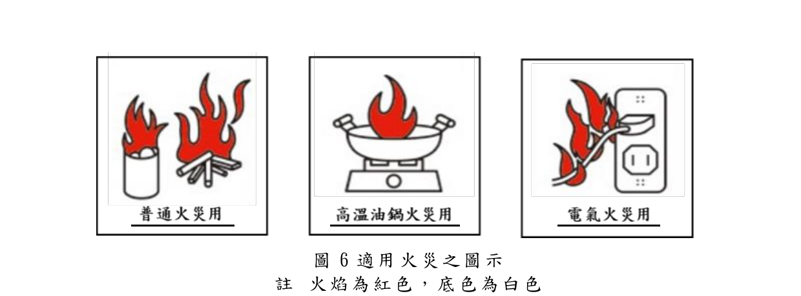

> 📷 截自原始 PDF 第 32 頁（內文頁 28）。

5. 噴射時間。

6. 噴射距離。

7. 製造號碼或製造批號。

8. 製造年月。

9. 製造廠商。

10. 型式、型式認可號碼。

11. 所充填之滅火藥劑容量或重量。

12. 使用操作應注意事項：

    （1）使用期間及使用期限之注意事項。

    （2）指示壓力錶之注意事項。

    （3）滅火藥劑不得再填充使用之說明。

    （4）使用時之安全注意事項。

    （5）放置位置等相關資訊。

    （6）日常檢查相關事項。

    （7）高溫油鍋火災使用時之安全注意事項。

    （8）其他使用上應注意事項。

### 三十八、新技術開發之滅火器

新技術開發之滅火器，依形狀、構造、材質及性能判定，如具有本基準規定同等以上性能，並經中央消防主管機關認定者，得不受本基準之全部或部分規範。

## 貳、型式認可作業

### 一、型式試驗之試驗項目及樣品數、試驗流程

（一）試驗項目及樣品數：

| 試驗區分 | 試驗項目 | 樣品數 |
|---|---|---|
| 一般試驗 | 1. 適用性　2. 標示 | 6 具 |
| 分項試驗 | 1. 安全插梢　2. 保持裝置　3. 過濾網（化學泡沫滅火器）　4. 液位標示（化學泡沫滅火器）　5. 攜帶或搬運之裝置　6. 壓力調整器（輪架式）　7. 蓄壓壓力　8. 耐衝擊強度　9. 振動試驗（車用型）　10. 噴射距離、噴射時間　11. 操作機構　12. 滅火效能值　13. 滅火藥劑充填量　14. 噴射性能試驗　15. 使用溫度範圍　16. 軟管規格　17. 無縫鋼瓶規格　18. 耐蝕及防銹　19. 本體容器所用材質之厚度　20. 本體容器之耐壓試驗　21. 護蓋、栓塞、灌裝口及墊圈　22. 閥體　23. 軟管　24. 噴嘴　25. 防止滅火藥劑之洩漏　26. 安全閥　27. 加壓用氣體量　28. 加壓用氣體容器　29. 氣體導入管　30. 指示壓力錶　31. 作動軸及氣體導入管　32. 充填比　33. 高壓氣體容器 | 7 具 |
| 分項試驗 | 34. 滅火藥劑 \* | 1 具 |
| 分項試驗 | 35. 虹吸管 | 2 具 \*\* |
| 分項試驗 | 36. 老化試驗 | 1 具 \*\* |
| 分項試驗 | 37. 電氣火災 | 2 具 \*\* |
| 分項試驗 | 38. 住宅用滅火器 | 8 具 |

\* 依滅火器用滅火藥劑認可基準之規定，實施下表所列之試驗。但滅火藥劑已取得個別認可，並提具其滅火器所填充藥劑即為該認可品之佐證資料者，不在此限。

| 滅火劑之種類 | 試驗項目 |
|---|---|
| 強化液 | 外觀、比重、pH 值、凝固點、表面張力 \*\*\* |
| 泡沫（化學泡沫） | 外觀、水中不溶解物 |
| 泡沫（機械泡沫） | 外觀、比重、pH 值、凝固點、表面張力、發泡倍率及 25% 還原時間、黏度試驗 |
| 乾粉 | 外觀、視密度、細度、沈澱、主成份、防濕 |
| 水（含濕潤劑等） | 外觀、比重、pH 值、凝固點 |
| 二氧化碳 | 主成份 |

\*\* 視必要須另行準備之滅火器數量。

\*\*\* 僅適用添加表面活性劑之強化液。

（二）型式認可試驗流程：

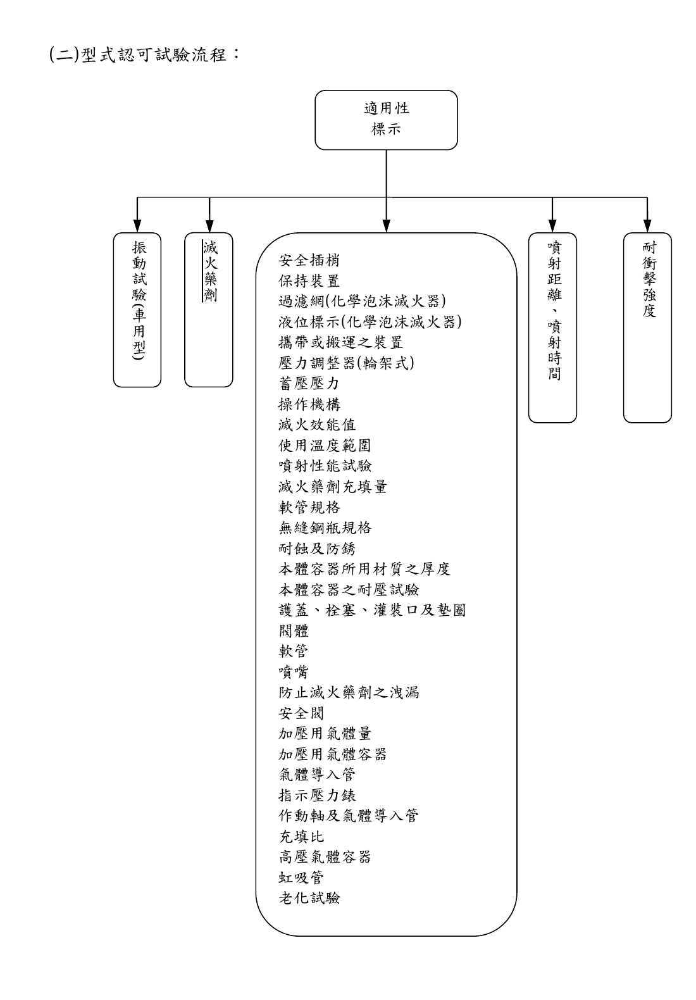

> 📷 截自原始 PDF 第 35 頁（內文頁 31）。

### 二、結果判定

（一）符合本基準者，該型式試驗結果為「合格」。

（二）符合貳、三補正試驗所定事項者，得進行補正試驗一次。

### 三、補正試驗

符合下列情形之一者得進行補正試驗：

（一）型式試驗之不良事項如為申請資料不完備（設計錯誤除外）、標示遺漏、零件裝置不良。

（二）試驗設備不完備或有缺點，致無法進行試驗者。

（三）依附表 1「缺點判定表」判定輕微缺點合計 3 項（含）以下者。

### 四、型式區分、型式變更及輕微變更之範圍

（一）範圍如下：

| 型式區分 | 型式變更 | 輕微變更 |
|---|---|---|
| 依滅火藥劑種類主成份區分如下： 1. 乾粉滅火藥劑： （1）ABC 乾粉為主成份者。 （2）BC 乾粉為主成份者。 （3）KBC 乾粉為主成份者。 （4）XBC 乾粉為主成份者。 （5）XBC-SO 乾粉為主成份者。 （6）XBC-CL 乾粉為主成份者。 （7）XBC-MONNEX 乾粉為主成份者。 2. 機械泡沫滅火藥劑 （1）表面活性劑為主成份者。 （2）水成膜為主成份者。 3. 化學泡沫滅火藥劑 4. 水滅火藥劑 （1）添加濕潤劑等。 （2）未添加濕潤劑等。 5. 二氧化碳滅火藥劑 6. 強化液滅火藥劑 | 1. 充填量。 2. 滅火效能值。 3. 噴射距離。 4. 噴射時間。 5. 蓄壓壓力。 6. 軟管內徑及長度。 7. 容器材質。 8. 放射機構。 9. 車用型。 | 1. 壓把、提把材質、表面處理。 2. 塑膠底座、螢光零件。 3. 閥體表面處理。 4. 移動方式（輪架型）。 5. 軟管、安全插梢等零件固定方式。 6. 接頭、彎頭、通管等零件材質及表面處理。 7. 封節、封籤材質樣式。 8. 產品標示內容。 |

### 五、型式變更之試驗方法

型式變更試驗之樣品數、試驗流程等，應就型式變更之內容，依前揭型式試驗進行。

### 六、試驗紀錄

申請型式認可應填載「產品規格明細表」（如附表 2）；有關型式試驗、補正試驗、型式變更試驗之結果，應詳細載於「型式試驗紀錄表」（如附表 3）。

## 參、個別認可作業

### 一、方法

（一）個別認可依 CNS 9042 規定進行抽樣試驗。

（二）抽樣試驗之嚴寬等級分為寬鬆試驗、普通試驗、嚴格試驗及最嚴格試驗 4 種。

### 二、抽樣

（一）個別認可所需之試料數目，係根據檢查之嚴格程度及批次大小，依附表 5 至附表 8 所列抽樣表中列定之數目，依據抽樣表先抽取一般試驗之樣品數，再由一般試驗之樣品數中，抽取分項試驗之樣品數。

（二）樣品之抽樣依下列規定：

1. 抽樣試驗應以每一批為單位，並依下表分類作區分。

| 攜帶方式 | 滅火藥劑 | 驅動壓力方式 | 抽樣批次 |
|---|---|---|---|
| 手提式 | 乾粉 | 蓄壓式 | 同一批次 |
| 手提式 | 乾粉 | 加壓式 | 同一批次 |
| 手提式 | 強化液 | 蓄壓式 | 同一批次 |
| 手提式 | 強化液 | 加壓式 | 同一批次 |
| 手提式 | 化學泡沫 | － | 同一批次 |
| 手提式 | 機械泡沫 | 蓄壓式 | 同一批次 |
| 手提式 | 機械泡沫 | 加壓式 | 同一批次 |
| 手提式 | 二氧化碳 | － | 同一批次 |
| 手提式 | 水（加浸潤劑） | 蓄壓式 | 同一批次 |
| 手提式 | 水（加浸潤劑） | 加壓式 | 同一批次 |
| 輪架式 | 乾粉 | 蓄壓式 | 同一批次 |
| 輪架式 | 乾粉 | 加壓式（啟動封板式） | 同一批次 |
| 輪架式 | 乾粉 | 加壓式（啟動封板式以外） | 同一批次 |
| 輪架式 | 強化液 | 蓄壓式 | 同一批次 |
| 輪架式 | 強化液 | 加壓式 | 同一批次 |
| 輪架式 | 化學泡沫 | － | 同一批次 |
| 輪架式 | 機械泡沫 | 蓄壓式 | 同一批次 |
| 輪架式 | 機械泡沫 | 加壓式 | 同一批次 |
| 輪架式 | 二氧化碳 | － | 同一批次 |

2. 樣品之多寡，應視整批成品（受驗數量＋預備品）數量之多寡及試驗等級，按抽樣表之規定抽取，並在重新編號之全部製品（受驗批）中，依隨機抽樣法（CNS 9042）隨意抽取，抽出之樣品依抽出順序編排序號。但受驗批次數量在 300 個以上時，應依下列規定分為二段抽樣：

   （1）計算每群應抽之數量：當受驗批次在 5 群（含箱子及集運架等）以上時，每一群之製品數量應在 5 個以上之定數，並事先編定每一群之編碼；但最後一群之數量，未滿該定數亦可。

   （2）抽出之產品賦予群碼號碼：同群製品須排列整齊，且排列號碼應能清楚辨識。

   （3）確定群數及抽出個群，再從個群中抽出樣品：確定從所有群產品中可抽出 5 群以上之樣品，以隨機取樣法抽取相當數量之群，再由抽出之各群製品作系統式循環抽樣（由各群中抽取同一編號之製品），將受驗之樣品抽出。

   （4）依上述方法取得之製品數量超過樣品所需數量時，重複進行隨機取樣去除超過部分至達到所要數量。

### 三、試驗項目

（一）分為一般試驗及分項試驗，項目分別如下表：

| 試驗區分 | 試驗項目 |
|---|---|
| 一般試驗 | 1. 核對原型式認可技術資料。　2. 標示　3. 蓄壓壓力 |
| 分項試驗 | 1. 噴射距離、噴射時間　2. 操作機構　3. 噴射性能（常溫）　4. 滅火藥劑充填量　5. 無縫鋼瓶規格　6. 本體容器所用材質之厚度　7. 本體容器之耐壓試驗　8. 安全閥　9. 滅火藥劑 \* |

\* 依滅火器用滅火藥劑認可基準之規定，實施下表所列之試驗。但滅火藥劑已取得個別認可，並提具其滅火器所填充藥劑即為該認可品之佐證資料者，不在此限。

| 滅火劑之種類 | 試驗項目 |
|---|---|
| 強化液 | 外觀、比重、pH 值、凝固點 |
| 泡沫（化學泡沫） | 外觀、水中不溶解物 |
| 泡沫（機械泡沫） | 外觀、比重、pH 值、凝固點、表面張力、發泡倍率及 25% 還原時間、黏度試驗 |
| 乾粉 | 外觀、視密度、細度、沈澱、主成份、防濕 |
| 水（含濕潤劑等） | 外觀、比重、pH 值、凝固點 |
| 二氧化碳 | 主成份 |

（二）個別認可試驗流程：

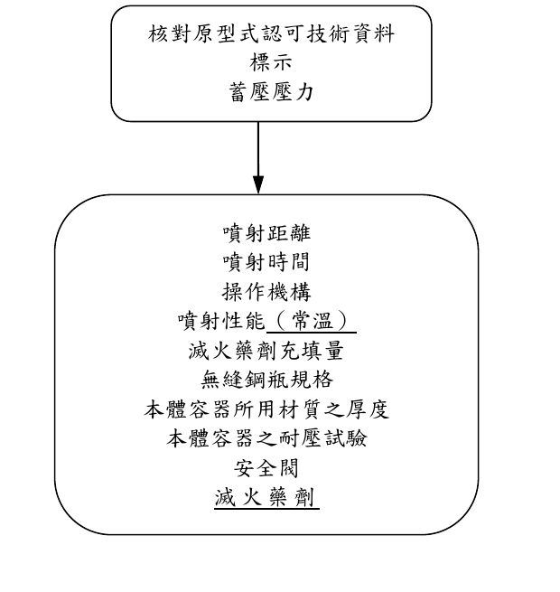

> 📷 截自原始 PDF 第 39 頁（內文頁 35）。

（三）個別試驗結果，應填載「個別試驗紀錄表」（附表 4）中。

### 四、結果判定

試驗結果合格與否，依抽樣表、缺點判定表及下列規定判定之。一般試驗及分項試驗，應分別計算其不良品之數量。

（一）抽樣試驗中，一般試驗及分項試驗之不良品數，均於合格判定個數以下時，該批為合格。且下一批可依參、六、試驗嚴寬度等級之調整更換較寬鬆之試驗等級。

（二）抽樣試驗中，一般試驗及分項試驗，任一試驗之不良品數在不合格判定個數以上時，該批為不合格。下一批依參、六、試驗嚴寬度等級之調整更換較嚴格之試驗等級。但該等不良品之缺點僅為輕微缺點時，得進行補正試驗，惟以 1 次為限。

（三）抽樣試驗中出現致命缺點之不良品時，即使該抽樣試驗中不良品數在合格判定個數以下，該批仍為不合格。下一批依參、六、試驗嚴寬度等級之調整更換較嚴格之試驗等級。

### 五、結果處置

（一）合格批次之處置

1. 當批次雖經判定為合格，但受驗樣品中如發現有不良品時，應使用預備品替換或修復該等不良品數量後，方視整批為合格品。

2. 即當批次雖經判定為合格，其不良品部分之個數，如無預備品替換或無法修復調整者，仍判定為不合格。

（二）補正批次之處置

1. 接受補正試驗時，應提出初次試驗時所發現不良事項之改善說明書及不良品處理後之補正試驗合格紀錄表。

2. 補正試驗之受驗樣品數以初次試驗之受驗樣品數為準。

（三）不合格批次之處置

1. 不合格批量之產品接受再試驗時，應提出最初試驗時所發現不良事項之改善說明書，及不良品處理之補正試驗合格紀錄表。

2. 不合格批量之產品接受再試驗時，不得加入初次試驗受驗製品以外之製品。

3. 不合格之批次不再試驗時，應向認可機構備文說明理由及其廢棄處理等方式。

### 六、試驗嚴寬度等級之調整

（一）首次申請個別認可：試驗等級以普通試驗為之，其後之試驗等級調整，依下列規定（原文為「寬鬆試驗／普通試驗／嚴格試驗／最嚴格試驗」四欄之轉換流程表，此處整理為轉換規則；原表請見文末原始 PDF）：

1. **普通試驗 → 寬鬆試驗**：符合下列所有條件者，則下次試驗得轉換成寬鬆試驗：

   （1）最近連續 10 批次接受普通試驗，第 1 次試驗均合格者。

   （2）從最近連續 10 批次中抽樣之不合格品總數在附表 9 之寬鬆試驗界限數以下者。此時之累計比較以一般檢查進行。

2. **寬鬆試驗 → 普通試驗**：符合下列各條件之一者，則下次試驗應以普通試驗進行：

   （1）一批次在初次檢查即不合格者。

   （2）一批次在初次檢查為附帶條件合格者。所謂附帶條件合格者為寬鬆檢查時，試品當中之不合格個數超過合格判定個數（Ac）未達不合格判定個數（Re）該批次判斷為合格者。

3. **普通試驗 → 嚴格試驗**：符合下列各條件之一者，則下次試驗應以嚴格試驗進行：

   （1）第 1 次試驗時該批次為不合格，且將該批次連同前 4 批次連續共 5 批次之不合格品總數累計，如達附表 10 所示嚴格試驗之界限數以上者。該累計樣品數，以一般試驗之缺點分級所得結果為之。當適用普通試驗之批次數未達 5 批次時，發生某批次第 1 次試驗即不合格之情形，將適用普通試驗之不合格品總數累計，達嚴格試驗之界限數值以上者。具有致命缺點之產品，則計入嚴重缺點不合格品之數量。

   （2）第 1 次試驗時，因致命缺點而不合格者。

4. **嚴格試驗 → 普通試驗**：進行嚴格試驗者，連續 5 批次在第 1 次試驗即合格者，則下次試驗得轉換成普通試驗。

5. **嚴格試驗 → 最嚴格試驗**：嚴格試驗者，第 1 次試驗中不合格批次數累計達 3 批次時，應對申請者提出改善措施之勸導，並中止試驗。勸導後，經確認申請者已有品質改善措施時，則下次試驗應以最嚴格試驗進行。

6. **最嚴格試驗 → 嚴格試驗**：進行最嚴格試驗者，連續 5 批次之第 1 次試驗即合格，則下次試驗得轉換成嚴格試驗。

（二）補正試驗：初次試驗為寬鬆試驗者，以普通試驗為之；初次試驗為普通試驗者，以嚴格試驗為之；初次試驗為嚴格試驗者，以最嚴格試驗為之。

（三）再受驗批次之試驗結果，不得計入試驗嚴寬分級轉換紀錄中。

### 七、下一批試驗之限制

對當批次個別認可之型式，於進行下次之個別認可時，係以該批之個別認可完成結果判定之處置後，始得施行下次之個別認可。

### 八、試驗之特例

有下列情形之一時，得在受理個別認可申請前，逕依預定之試驗日程實施試驗。此情形下須在確認產品之個別認可申請書受理後，才能判斷是否合格。

（一）初次試驗因嚴重缺點或一般缺點經判定不合格者。

（二）不需更換全部產品或部分產品，可容易選取、去除申請數量中之不良品或修正者。

### 九、試驗設備發生故障或無法試驗時之處置

試驗開始後因試驗設備發生故障或其他原因致無法立即修復，經確認當日無法完成試驗時，得中止該試驗。並俟接獲試驗設備完成改善之通知後，重新擇定時間，依下列規定對該批施行試驗：

（一）試驗之抽樣標準與初次試驗時相同。

（二）不得進行補正試驗。

### 十、其他

（一）個別認可發現製品有其他不良事項，經認定該產品之抽樣標準及個別認可方法不適當者，得由中央消防主管機關另定個別認可方法及抽樣標準。

（二）輪架式滅火器如受檢批量在 280 具以下，則不受附表抽樣之規範，依下列規定辦理：

1. 受檢批量每累計 150 具，抽樣 1 具依個別認可試驗項目試驗，有附表 1 所列任何缺點者即判定不合格。

2. 未達抽樣批量之個別認可應檢具原廠出廠報告，經審查相關文件及實地查核產品後得免驗。

## 肆、主要試驗設備

| 試驗設備 | 規格 | 數量 |
|---|---|---|
| 抽樣表 | 本基準中有關抽樣法之規定 | 1 份 |
| 亂數表 | CNS 9042 隨機抽樣法 | 1 份 |
| 計算機 | 8 位數以上 | 1 台 |
| 計量秤 | 秤量為計量物質量的約 1.5 倍 | 1 台 |
| 尺寸測定器 | 游標卡尺、螺紋量規、深度量規、分厘卡、內規、外規、直尺及捲尺、外徑量尺 | 1 式 |
| 圓筒形刻度量測器 | 容量 100ml 及 1000ml | 各 1 個 |
| 水壓試驗裝置 | 可以做滅火器耐壓試驗壓力的 1.5 倍之加壓裝置 | 1 台 |
| 壓力計 | 最高刻度為該滅火器耐壓試驗壓力及閉塞壓力 1.5 倍 | 各 1 個 |
| 碼錶 | 60 秒計 | 2 個 |
| 照明器具 | 適合該滅火器的內部檢查 | 1 個 |
| 振動試驗機（車用） | 縱、橫方向全振幅 2mm、每分鐘 2000 回轉 | 1 台 |
| 水槽式膨脹率測試槽（小型） | 供手提式二氧化碳滅火器鋼瓶膨脹率試驗 | 1 套 |
| 水槽式膨脹率測試槽（大型） | 供輪架式二氧化碳滅火器鋼瓶膨脹率試驗 | 1 套 |
| 電子式溫濕度計 | −20℃～＋70℃，最小刻度 0.1℃、0～100%RH | 1 個 |
| 氣密試驗槽（限蓄壓式） | 可以浸漬滅火器大小 | 1 台 |
| 安全閥動作試驗機 | 能確認使用於該滅火器之安全閥的動作 | 1 台 |
| 溫水槽 | 可以浸漬加壓用氣體容器之大小 | 1 個 |
| 氣密試驗槽 | 適合該滅火器之內筒試驗 | 1 台 |
| 滅火試驗設備 | 如陸、附件「滅火試驗設備規格」 | 1 套 |
| 壓力錶試驗機 | 使用壓力之上限值之二倍壓力，施以繼續 30 分鐘之靜壓試驗、從 0kgf/cm² 加壓至使用壓力上限值後，再減壓至 0kgf/cm²，如此操作以每分鐘 15 次之速度，反覆作 1000 次。 | 1 套 |
| 風速計 | 0～40m/s、最小刻度 0.1 m/s | 1 台 |
| 分光儀 | 能夠分析銅、鋁、合金鋼等材質 | 1 台 |
| 耐衝擊強度試驗機 | 荷重 30kg 以上、高度 1.5m 以上 | 1 台 |
| 老化試驗機 | 符合本基準壹、七及壹、八規定設備 | 1 台 |
| 壓縮試驗機 | 符合本基準壹、七規定設備 | 1 台 |
| 住宅用滅火器滅火試驗設備 | 符合本基準壹、三十七（二）4 規定設備 | 1 套 |
| 恆溫設備 | 符合本基準壹、九規定設備，溫度範圍 −20℃～70℃ | 1 台 |

## 伍、缺點判定方法

各項試驗所發現之不合格情形，其缺點之等級依附表 1「缺點判定表」之規定判定。

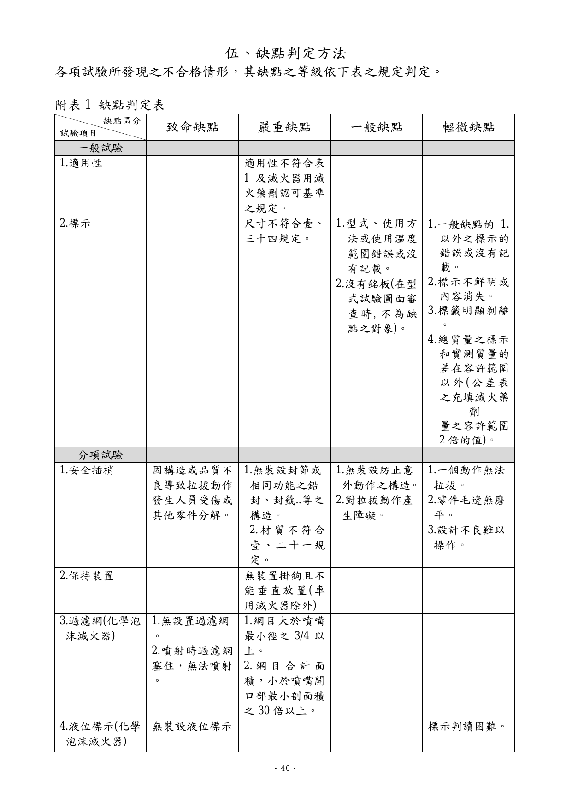

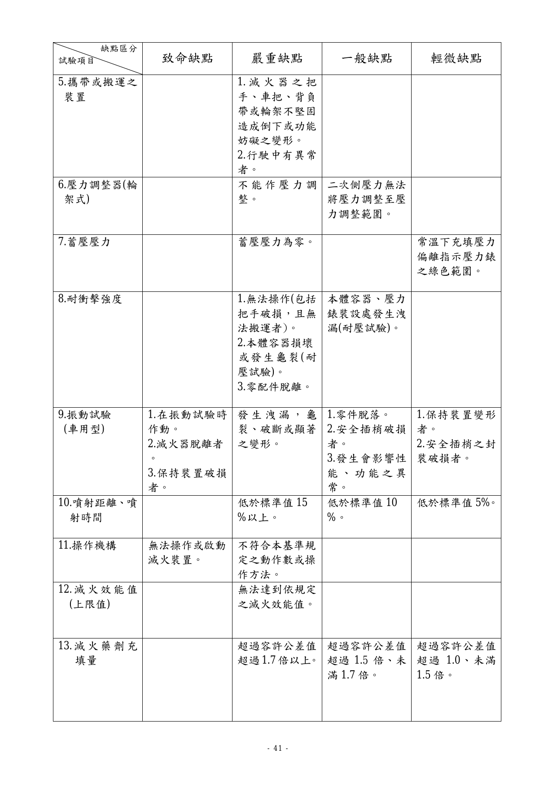

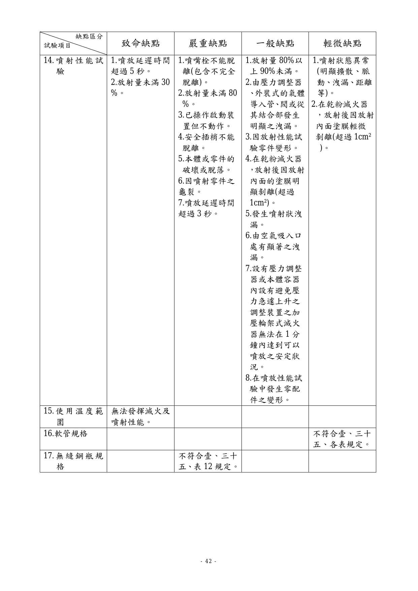

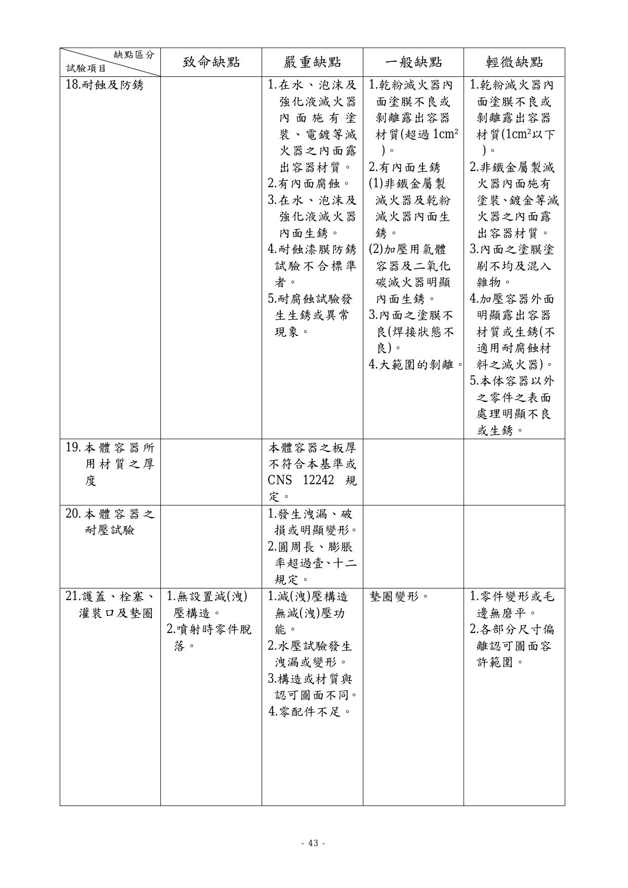

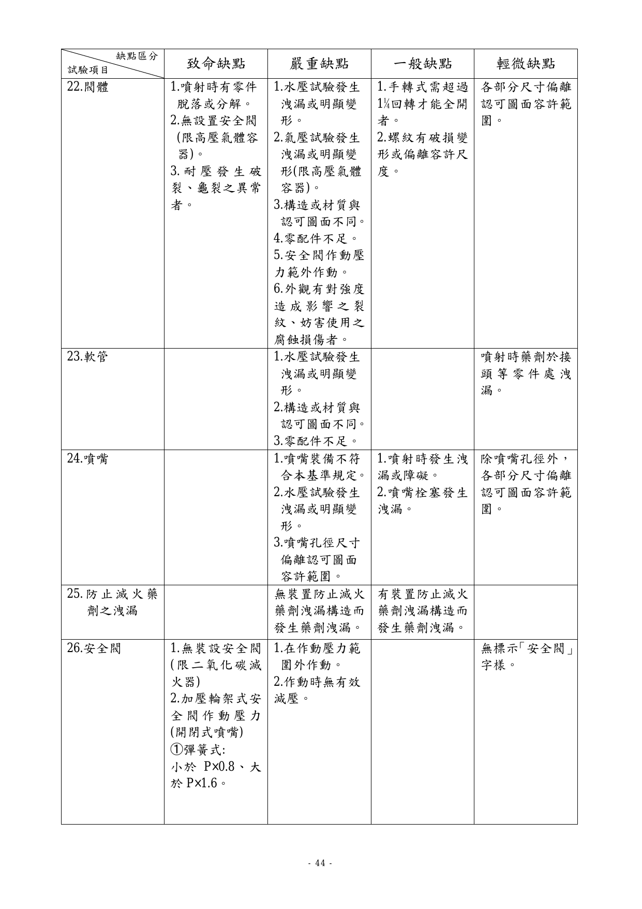

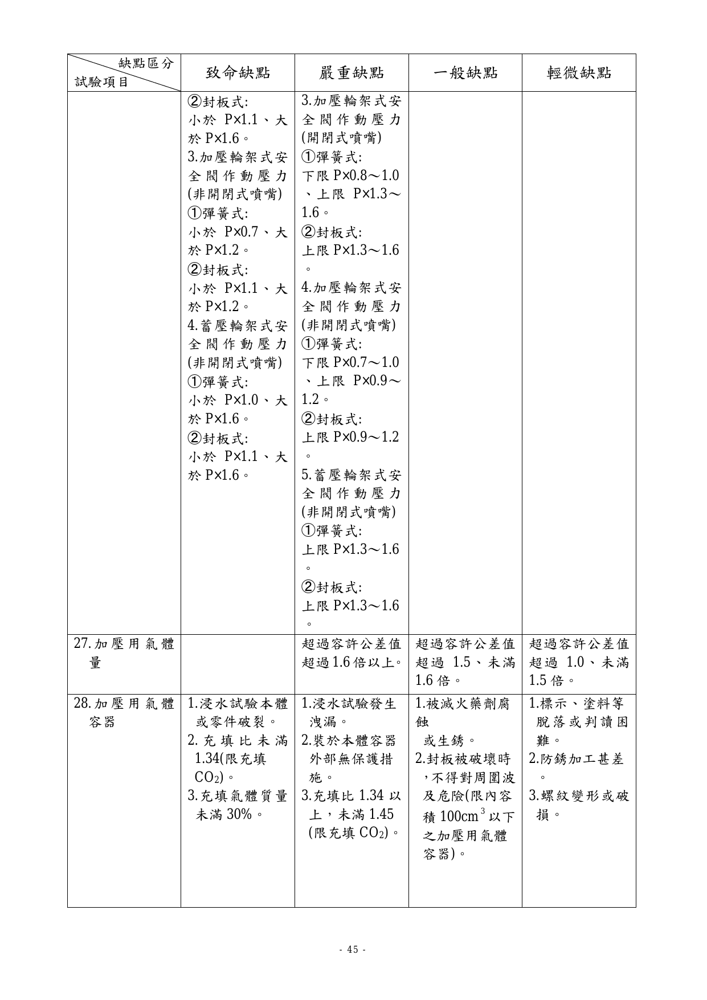

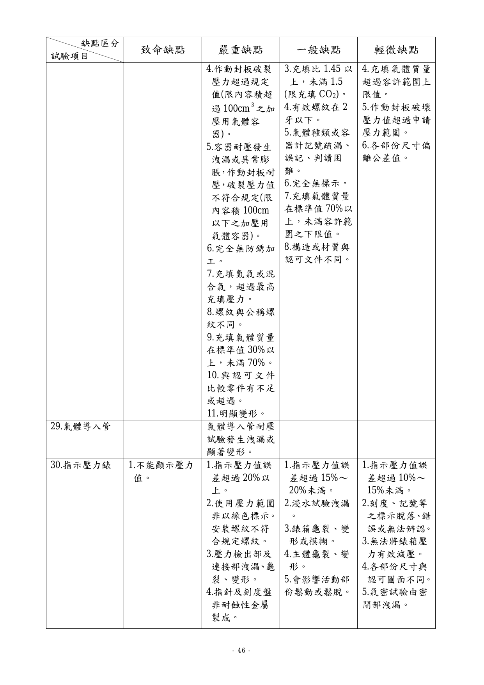

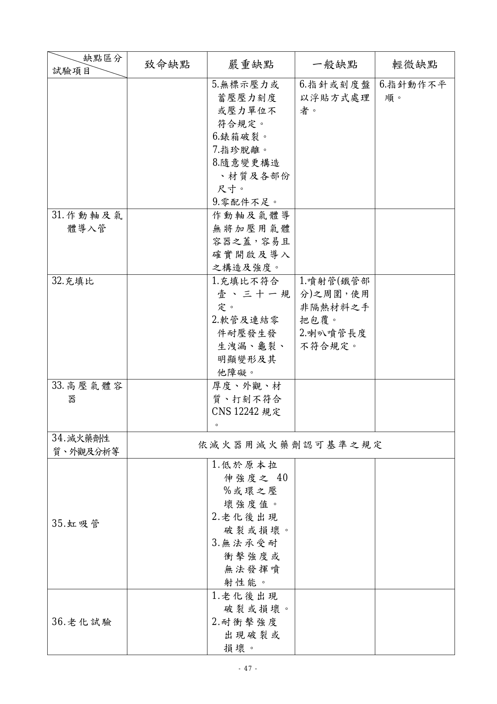

> 📷 截自原始 PDF 第 44～51 頁（內文頁 40～47）。

## 陸、附件　滅火試驗設備規格及引用參考資料

（一）滅火試驗設備規格

1. 滅火試驗室：本試驗室供試驗滅火器之滅火性能試驗之用，對空氣之引進和排煙應做特別考慮之設計，並附有防止環境污染用排煙淨化設備。

2. 滅火試驗用排煙淨化設備（如圖 1）：主要設備包括排煙收集設備，風管設備、集塵機本體、排風設備、隔音設備及儀錶等。特別注意不可因排煙吸引氣流，而使火災模型之燃燒狀態產生變化，此外燃燒所需空氣是由滅火試驗場外引進外部空氣。由灰斗排出之灰塵、煤煙或含有滅火藥劑之殘留物須可集中回收處理，設備內亦有隔音裝置以符合防止噪音之規定。

3. 設備之主要規定如下：

   （1）排煙量：1800 CMM 以上。

   （2）集塵機出口煤塵量：0.03g/m³ 以下。

   （3）噪音：在廠區地界處 50phone 以下。

   （4）隔音設備：能有效降低排風設備噪音音量之設施，如採用消音風管或內壁貼多孔石膏等有效降低噪音音量之方式。

4. 上述應設置之設備、材料、工法可依現場實際需求增刪，惟應能符合下列環保相關規定並提供本項認可基準所要求之測試能力。

   （1）噪音：噪音管制法。

   （2）廢水：放流水標準。

   （3）空氣污染：固定污染源空氣污染排放標準。

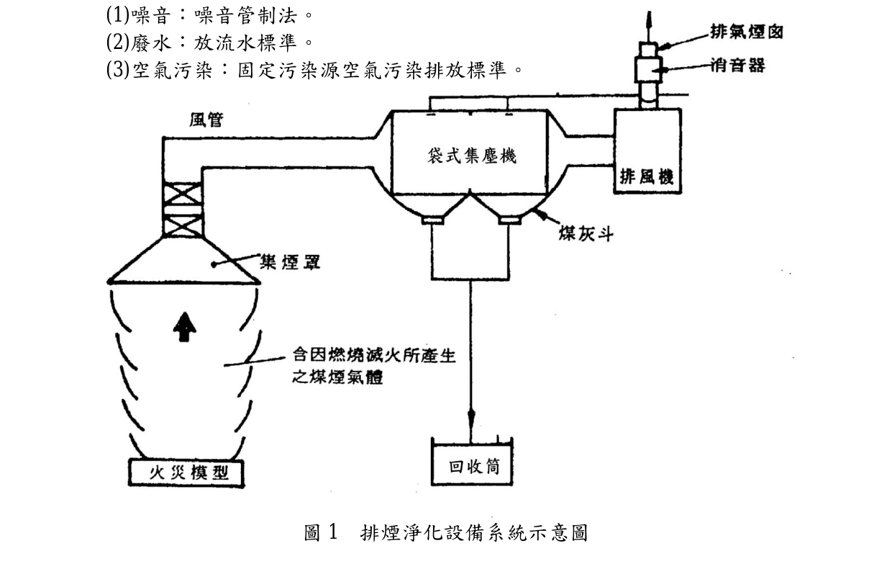

> 📷 截自原始 PDF 第 60 頁（內文頁 56）。

（二）引用參考資料：

- CNS 494　平行管螺紋
- CNS 495　推拔管螺紋
- CNS 4008　黃銅棒
- CNS 4622　熱軋軟鋼板、鋼片及鋼帶
- CNS 8497　不銹鋼鋼片及鋼板
- CNS 10442　銅及銅合金棒
- CNS 10443　銅及銅合金線
- CNS 10848　高壓鋼瓶閥
- CNS 11073　銅及銅合金板、捲片
- CNS 11176　二氧化碳、鹵化烷及乾粉等滅火設備用容器閥、安全裝置及破壞板
- CNS 12242　無縫鋼製高壓氣體容器
- CNS 12896　氣體熔接截割（切斷）用壓力調整器

---

## 附表／附圖（附件）

> 各尺寸圖（圖 1～6、圖 A～C、表 16、排煙淨化設備示意圖）、型式／個別認可試驗流程圖及附表 1（缺點判定表）均已以原始 PDF 截圖嵌入本文相應位置。下列附表為紀錄表、抽樣表及界限數表，以原始 PDF 為準：
>
> - 附表 2（產品規格明細表，PDF 第 52 頁）、附表 3（型式試驗紀錄表，PDF 第 53～54 頁）、附表 4（個別試驗紀錄表，PDF 第 55～56 頁）、附表 5～8（抽樣表，PDF 第 56～57 頁）、附表 9、10（寬鬆／嚴格試驗界限數表，PDF 第 58～59 頁）

- **滅火器認可基準（完整 PDF，含全部附表與附圖）**：[開啟檔案](../附件/滅火器認可基準/滅火器認可基準.pdf)
