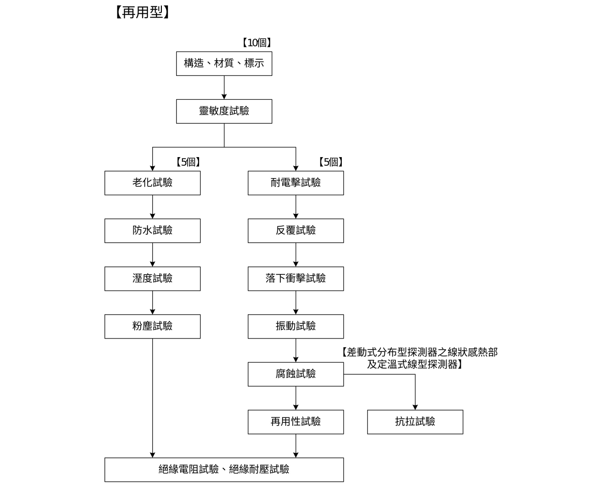
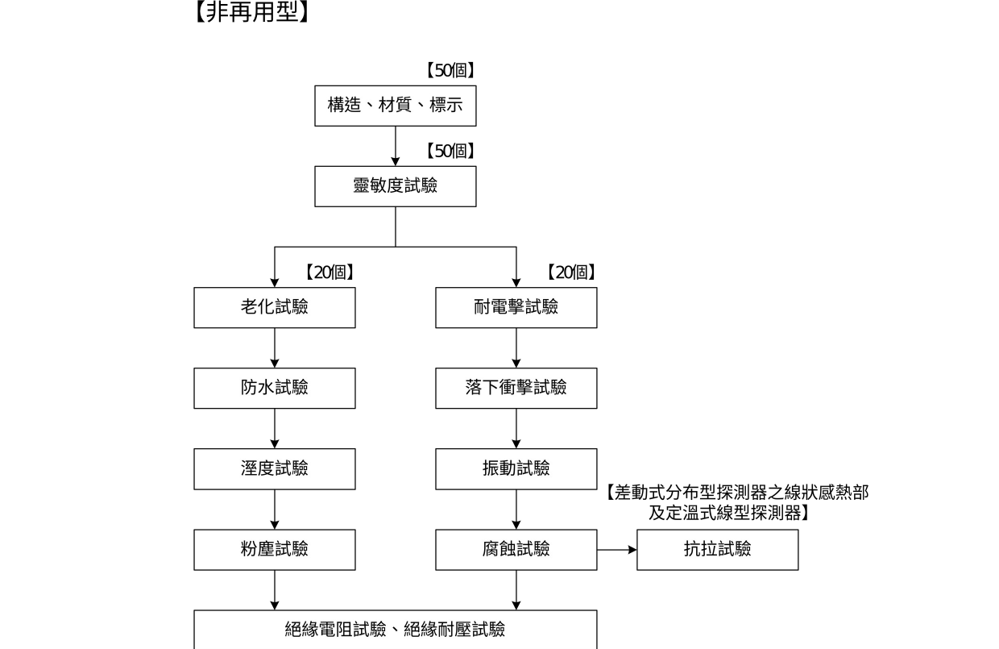
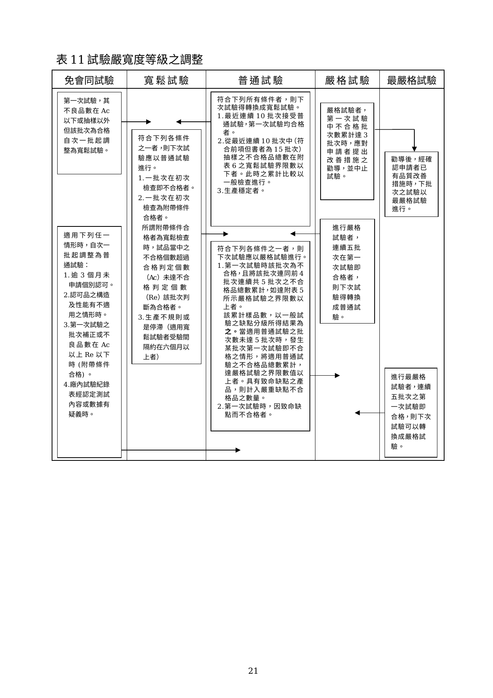
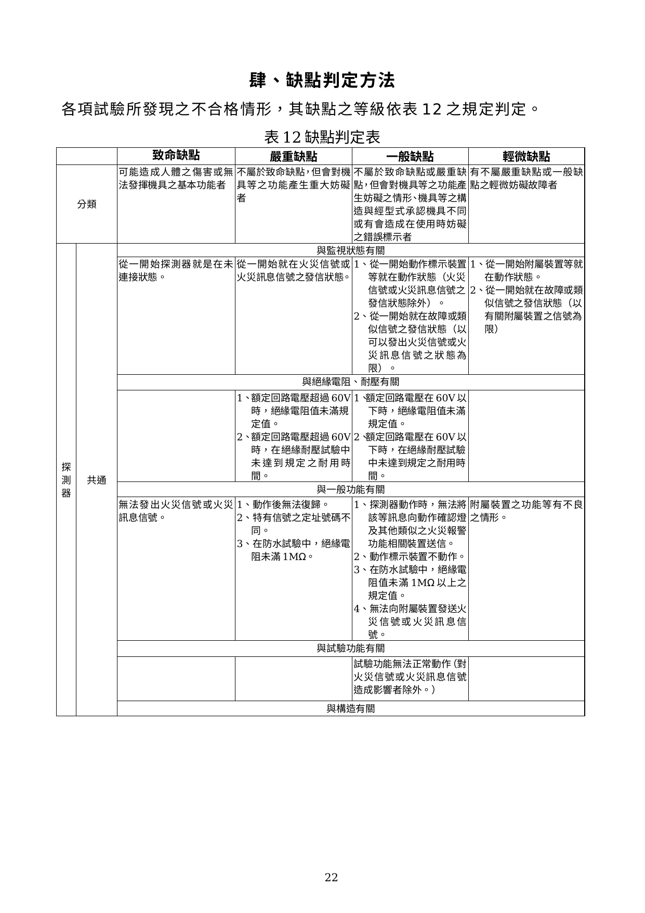
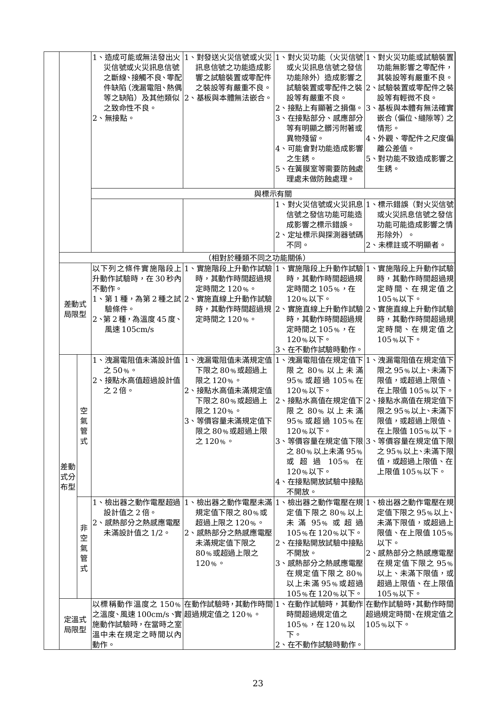
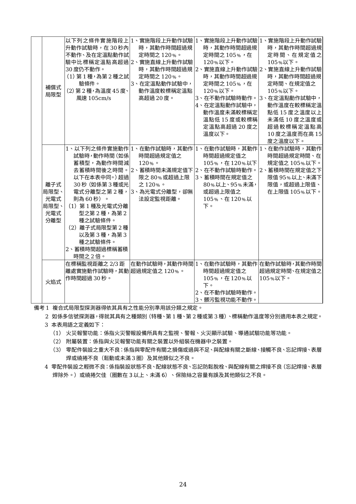

# 火警探測器認可基準

> 來源：內政部消防署｜版本日期：97 年 5 月 19 日內授消字第 0970822075 號令發布
>
> ⚠️ **法規快照**：本檔為入庫當下之版本，引用前請依 index.md「法規時效」核對官方現行版本。
>
> 📌 **免責聲明**：本檔內容部分為 PDF／影像 OCR 與人工整理之結果，可能有辨識誤差。**一切以主管機關（內政部消防署）公告之現行版本為準**；如有疑義，以官方公告為主。後續 AI 代理人引用本檔時應主動提醒使用者此點，並於必要時自行上網查證正確版本。
>
> 🛈 本檔由原始 DOC（WordDocument stream，UTF-16LE）擷取並人工整理。依三層表格原則：散文與靈敏度數值表、簡單數值表已內嵌 markdown；缺點判定表（表 12）、試驗嚴寬度調整表（表 11）及型式試驗流程圖以原始 DOC 轉檔截圖嵌入原文位置；紀錄表（表單）、抽樣表（附表）僅附文末原始檔連結。定溫式動作時間計算式已依使用者上傳截圖補入。

---

## 壹、技術規範及試驗方法

### 一、適用範圍

供各類場所消防安全設備設置標準規定設置火警自動警報設備所使用之火警探測器，其構造、材質、性能等技術上之規範及試驗方法，應符合本基準之規定。

### 二、用語定義

**火警探測器**：火警探測系統的一個元件，至少包含一個感應器，以規律性的週期或持續監控至少一種與燃燒有關的物理或化學現象，並將至少一種相關信號傳送至控制及操作顯示設備，分類如下：

- 依防水性能區分：防水型、非防水型。
- 依防腐蝕性能區分：耐酸型、耐鹼型、普通型。
- 依有無再用性區分：再用型、非再用型。
- 依有無防爆功能區分：防爆型、非防爆型。
- 依蓄積動作之有無區分：蓄積型、非蓄積型。
- 依動作原理區分：
  - **差動式局限型**：周圍溫度上升率在超過一定限度時即會動作，僅針對某一局限地點之熱效率有反應。
  - **差動式分布型**：周圍溫度上升率在超過一定限度時即會動作，針對廣大地區熱效率之累積產生反應。
  - **定溫式局限型**：周圍溫度達到一定溫度以上時，即會產生動作，外觀為非電線狀。
  - **定溫式線型**：周圍溫度達到一定溫度以上時，即會產生動作，外觀為電線狀。
  - **補償式局限型**：兼具差動式局限型及定溫式局限型二種性能。
  - **離子式**：周圍空氣中含煙濃度達到某一限度時即會動作，原理係利用離子化電流受煙影響而產生變化。
  - **光電式**：周圍空氣中含煙濃度達到某一限度時即會動作，原理係利用光電束子之受光量受到煙之影響而產生變化，並可分為散亂光型及減光型。
  - **火焰式**：當火焰放射出來之紫外線或紅外線之變化在定量以上時會發出火災信號，利用某一局部處所之紫外線或紅外線引起光電元件受光量之變化而動作。可分為紫外線式、紅外線式、紫外線紅外線併用式、複合式。
  - **複合式**：具有上述兩種以上偵測功能。
- **火災信號**：顯示已經發生火災之信號。
- **火災訊息信號**：與因火災產生之熱或煙之程度及其他與火災之程度有關之信號。

### 三、環境溫度適用範圍

差動式、補償式、離子式、光電式、火焰式探測器應在 0℃ 至 50℃ 溫度範圍內；另定溫式探測器應在零下 10℃ 至其標稱動作溫度減 20℃ 之溫度範圍內確實動作，且不得影響其功能。

### 四、構造及材質

#### （一）構造

1. 不得因氣流方向改變而影響探測功能。
2. 應有排除水分侵入之功能。
3. 接點部之間隙及其調節部應牢固固定，不得因作調整後而有鬆動之現象。
4. 探測器之底座視為探測器的一部位，且可與本體連結試驗 1000 次後，內部接觸彈片不得發生異狀及功能失效。
5. 探測器之接點不得露出在外。
6. 差動式局限型有排氣裝置者，其排氣裝置不可使用會氧化之物質而影響其正常排氣功能。
7. 差動式分布型探測器裝有空氣管者，應符合下列規定：容易測試其漏氣、阻力及接點水位高；容易測試空氣管之漏氣或阻塞，且應具有測試完畢後可將試驗復原之措施；應使用整條空氣管全長應有 20 公尺以上，其內徑及管厚應均勻，不得有傷痕、裂痕、扭曲、腐蝕等有害瑕疵；空氣管之厚度應在 0.3 mm 以上；空氣管之外徑應在 1.94 mm 以上。
8. 差動式分布型探測器中採用熱電偶或熱半導體者：易於測試出檢測體之動作電壓；具容易測試熱電偶有無斷線及導電體電阻之構造，且應具有測試完畢後可將試驗復原之裝置。
9. 局限型之離子式及光電式探測器與平面位置有 45° 傾斜時、差動式者有 5° 傾斜時，仍不致有功能異狀。探測器應裝設能表示已動作之指示設備，但補償式探測器及防爆型探測器在動作時有連接至受信總機表示確有動作機能者，則不在此限。
10. 光電式探測器：所使用光源之光束變化應少，且能耐長時間之使用；光電元件應不得有靈敏度劣化或疲勞現象；能容易清潔檢知部位。
11. 離子式探測器之輻射量應低於 1.0 μCi，且不得對人體有危害。採用放射線物質者，應將該物質密封且不易由外部接觸；含有放射性物質之探測器，應依行政院原子能委員會對含有放射性產品之管制須知辦理。
12. 火焰式探測器：受光元件不得有靈敏度劣化或疲勞現象；能容易清潔檢知部位；應設置動作標示裝置（如能與可顯示信號發信狀態之受信總機連接者不在此限）；如係有髒汙監視功能，當檢知部位產生可能影響檢知功能時，能自動向受信總機發出該等信號。
13. 火警探測器內附有電磁電驛者：所有接點應使用 G、S 合金（金、銀合金或其他有效電鍍處理者）；接點能適合最大使用電流容量，在最大使用電壓下經由電阻負載於最大使用電流反覆動作試驗 30 萬次之後，其功能構造均不得有異常障礙；電驛除密封型外應裝設適當護蓋；同一接點不得接至內部負載和外部負載做直接供應電力；同一電驛不得同時使用於主電源變壓器之一次側及二次側。

#### （二）材質

1. 感知部與外線接觸端，應採用不生銹之材質。
2. 探測器之接點應使用金銀或銀鈀合金，或具有同等以上之導電率及抗氧化性之金屬物質。
3. 探測器之露出部分（裝設時手能接觸部分，但不含確認燈蓋、發光二極體及各指示標籤）應使用不燃性或耐燃性材料。

### 五、抗拉試驗

應於腐蝕試驗後進行，施加負載時間為 10 秒，連接線之芯線截面積應在 0.5 mm² 以上，若連接線與本體結合時，需利用焊接等方法固定之。差動式分布型探測器之線狀感熱部及定溫式線型探測器，應符合下列規定：

1. 將試片之一端予以固定後，離 25 公分處施以 10 kgf 的拉力負荷後，不得有拉斷且功能無影響。
2. 裝接線狀部分之零件不能於裝接後使線條發生異狀。
3. 探測器之端子對每一極要預備 2 個。
4. 除差動式分布型之線狀感熱部及定溫式線型外，以電線代替端子之型式者，其電線數量每極應有 2 根，且對每根電線施予 2 kgf 抗拉負荷試驗，不致發生拉斷且對其功能不發生異狀。

### 六、靈敏度試驗

#### （一）差動式局限型探測器

應按照種別施予下列各項試驗，其數值符合表 1 所列 K、V、N、T、M、k、v、n、t、m 各值。

#### 表 1　差動式局限型探測器靈敏度試驗數值表

**（動作試驗）**

| 種別 | 階段上升 K | 階段上升 V | 階段上升 N | 直線上升 T | 直線上升 M |
|---|---|---|---|---|---|
| 1 種 | 20 | 70 | 30 | 10 | 4.5 |
| 2 種 | 30 | 85 | 30 | 15 | 4.5 |

**（不動作試驗）**

| 種別 | 階段上升 k | 階段上升 v | 階段上升 n | 直線上升 t | 直線上升 m |
|---|---|---|---|---|---|
| 1 種 | 10 | 50 | 1 | 2 | 15 |
| 2 種 | 15 | 60 | 1 | 3 | 15 |

- **動作試驗**：較室溫高 K℃ 之溫度，以風速 V cm/sec 之高溫氣流垂直方向吹向時，應在 N 秒內動作；自室溫狀態下以平均每分鐘 T℃ 直線升溫速度之水平氣流吹向時，應在 M 分鐘以內動作。
- **不動作試驗**：較室溫高 k℃ 之溫度，以風速 v cm/sec 之高溫氣流垂直方向吹向時，應在 n 分鐘內不動作；自室溫開始以平均每分鐘 t℃ 直線升溫速度之水平氣流吹向時，應在 m 分鐘以內不動作。

#### （二）差動式分布型探測器

按照溫度上升率及其種別必須符合表 2 規定：

#### 表 2　差動式分布型探測器靈敏度試驗數值表

| 種別 | t1（℃/分） | t2（℃/分） |
|---|---|---|
| 1 種 | 7.5 | 1 |
| 2 種 | 15 | 2 |
| 3 種 | 30 | 4 |

- **動作試驗**：離檢出部位（感知部）最遠處之空氣管 20 公尺部分，每分鐘 t1℃ 直線昇溫速度，應在 1 分鐘內動作。
- **不動作試驗**：空氣管全部在每分鐘 t2℃ 直線昇溫速度時，7 分 30 秒內不得動作。

#### （三）定溫式探測器

1. 標稱動作溫度之設定以探測器本身標示之動作溫度值為標稱溫度值，其動作時間以下列計算公式計算之（標稱定溫點是以 55℃ 至 150℃ 為準）。
2. 試驗依下列方法進行，其數值應符合表 3 規定。

#### 表 3　定溫式探測器靈敏度試驗數值表（動作試驗：標稱動作溫度之 125% 熱風以 1 m/sec 垂直氣流吹向）

| 種別 | 室溫為 0℃ 時動作時間 | 室溫為 0℃ 以外時 |
|---|---|---|
| 特種 | 40 秒 | 室溫 θr（度）時之動作時間 t（秒）依公式計算 |
| 1 種 | 120 秒 | （同上） |
| 2 種 | 300 秒 | （同上） |

**定溫式室溫 θᵣ 時動作時間 t 之計算公式**（依使用者上傳截圖補入）：

$$t = \frac{t_0 \cdot \log_{10}\left(1 + \dfrac{\theta - \theta_r}{\delta}\right)}{\log_{10}\left(1 + \dfrac{\theta}{\delta}\right)}$$

- $t_0$：室溫在 0℃ 時之動作時間（秒）
- $\theta$：標稱動作溫度（℃）
- $\theta_r$：室溫（℃）
- $\delta$：標稱動作溫度與動作試驗溫度之差（℃）

- **不動作試驗**：用較標稱動作溫度低 10℃ 而以 1 m/sec 之風速垂直吹向時，在 10 分鐘內不動作。

#### （四）補償式局限型探測器

1. 標稱定溫點以 55℃ 至 150℃ 之間為準。
2. 按其種別依下列方法測試，並應符合表 4 所列之 K、V、N、T、M、S、k、v、n、t、m 各值。

#### 表 4　補償式局限型探測器靈敏度試驗數值表

**（動作試驗）**

| 種別 | 階段上升 K | 階段上升 V | 階段上升 N | 直線上升 T | 直線上升 M | 定溫式 S |
|---|---|---|---|---|---|---|
| 1 種 | 20 | 70 | 30 | 10 | 4.5 | 55 以上 150 以下 |
| 2 種 | 30 | 85 | 30 | 15 | 4.5 | 55 以上 150 以下 |

**（不動作試驗）**

| 種別 | 階段上升 k | 階段上升 v | 階段上升 n | 直線上升 t | 直線上升 m |
|---|---|---|---|---|---|
| 1 種 | 10 | 50 | 1 | 2 | 10 |
| 2 種 | 15 | 60 | 1 | 3 | 10 |

- **動作試驗**：較室溫高 K℃ 之溫度，以風速 V cm/sec 之垂直氣流直接吹向時，應在 N 秒鐘內動作；自室溫開始以每分鐘 T℃ 之直線升溫速度水平氣流吹向時應在 M 分鐘內動作；自室溫開始以每分鐘 1℃ 之直線升溫速度水平氣流吹向時，應在較 S 低 10℃ 至較 S 高 10℃ 範圍內動作。
- **不動作試驗**：較室溫高 k℃ 之溫度，以風速 v cm/sec 之垂直氣流吹向時，應在 n 分鐘內不得動作；自室溫開始以平均每分鐘 t℃ 之直線上升速度水平氣流吹向時，應在較 S 低 10℃ 範圍下 m 分鐘內不得動作。

#### （五）離子式探測器

1. 離子式局限型探測器之蓄積時間（指偵測出周圍空氣含一定濃度以上之煙起，繼續感應直到發出火災信號之時間），應在 5 秒以上、60 秒以內，標稱蓄積時間則在 10 秒以上、60 秒以內，以每 10 秒為刻度。
2. 經下列各項試驗且符合表 5 所規定之數值。

#### 表 5　離子式探測器靈敏度試驗數值表（K：標稱動作電離電流變化率）

| 種別 | K | V（cm/sec） | T（秒） | t（分） |
|---|---|---|---|---|
| 特種 | 0.19 | 20~40 | 30 | 5 |
| 1 種 | 0.24 | 20~40 | 30 | 5 |
| 2 種 | 0.28 | 20~40 | 30 | 5 |

- **動作試驗**：含有電離電流變化率 1.35K 濃度煙之氣流，以風速 V cm/sec 吹向時，對非蓄積型者應在 T 秒內，對蓄積型者應在標稱蓄積時間以上動作，但不得超過標稱蓄積時間加 T 秒（總時間不得超過 60 秒）。
- **不動作試驗**：含有電離電流變化率 0.65K 濃度煙之氣流，以風速 V cm/sec 吹向時，在 t 分鐘以內不動作方為合格。

#### （六）光電式探測器

**1. 光電式局限型**

（1）蓄積時間應在 5 秒以上、60 秒以內，標稱蓄積時間則在 10 秒以上、60 秒以內，以每 10 秒為刻度。

（2）靈敏度應經下列試驗且符合表 6 之數值。

#### 表 6　光電式局限型探測器靈敏度試驗數值表（K：標稱動作濃度，以減光率表示）

| 種別 | K | V（cm/sec） | T（秒） | t（分） |
|---|---|---|---|---|
| 1 種 | 5 | 20~40 | 30 | 5 |
| 2 種 | 10 | 20~40 | 30 | 5 |
| 3 種 | 15 | 20~40 | 30 | 5 |

> 備註：以標示靈敏度為種類者，K 值係以探測器本身濃度標示值(%)，以標示值之 130% 為動作試驗值、70% 為不動作試驗值（但 K 值不得超過 5、不得小於 2，並歸類於 1 種）。

（3）**動作試驗**：含有每公尺減光率 1.5K 濃度之煙，以風速 V cm/sec 吹向時，非蓄積型應在 T 秒內、蓄積型應在標稱蓄積時間以上動作（不得超過標稱蓄積時間加 T 秒，總時間不得超過 60 秒）。

（4）**不動作試驗**：含有每公尺減光率 0.5K 濃度之煙，以風速 V cm/sec 吹向時，在 t 分鐘內不得動作。

**2. 光電式分離型**

- 蓄積時間及標稱蓄積時間同壹、六、(六)、1、(1)之規定。
- 標稱監視距離在 5 公尺以上、100 公尺以下，以每 5 公尺為刻度。
- 靈敏度相對於其類別、標稱蓄積時間及標稱監視距離，K1、K2、T、t 之值應符合表 7。

#### 表 7　光電式分離型探測器靈敏度試驗數值表

| 種別 | L1 條件 | K1 | K2 | T（秒） | t（分） |
|---|---|---|---|---|---|
| 1 種 | 45 公尺未滿 | 0.8×L1＋29 | 0.3×L2 | 30 | 2 |
| 1 種 | 45 公尺以上 | 65 | 0.3×L2 | 30 | 2 |
| 2 種 | 45 公尺未滿 | L1＋40 | 0.3×L2 | 30 | 2 |
| 2 種 | 45 公尺以上 | 85 | 0.3×L2 | 30 | 2 |

> 備註：L1 為標稱監視距離之最小值，L2 為最大值。K1、K2 為與煙濃度相當之減光濾光片性能（以減光率表示），以尖峰波長 940 奈米發光二極體為光源測定。動作試驗：設置對應 L1 之 K1 性能減光濾光片時，非蓄積型應在 T 秒內、蓄積型在較標稱蓄積時間短 5 秒以上、長 5 秒以內發出火災信號。不動作試驗：設置對應 L2 之 K2 性能減光濾光片時，在 t 分鐘內不動作。

#### （七）火焰式探測器

1. 標稱監視距離按每 5 度視角規定，未滿 20 公尺以每 1 公尺為刻度，20 公尺以上以每 5 公尺為刻度。
2. 靈敏度：

#### 表 8　火焰式探測器動作試驗數值表（距探測器水平 L 公尺處，以邊長 d 公分正方形燃燒盤燃燒正庚烷，應在 30 秒內發出火災信號）

| 分類 | L（公尺） | d（公分） |
|---|---|---|
| 室內型 | 標稱監視距離之 1.2 倍之值 | 33 |
| 室外型 | 標稱監視距離之 1.4 倍之值 | 70 |

> 不動作試驗：紫外線及紅外線之受光量在前款動作試驗中受光量之四分之一時，在 1 分鐘內不會動作。

#### （八）靈敏度試驗之條件

上述靈敏度試驗，應將探測器放置於與室溫相同之強制通風環境下 30 分鐘以後才進行試驗，此強制通風工作須於每一試驗前進行之。

### 七、老化試驗

差動式、離子式、光電式探測器放置在 50℃ 空氣中，補償式或定溫式探測器則放置在較標稱動作溫度低 20℃ 之空氣中，持續通電狀態保持 30 天後，其構造及功能均不得發生異常。

### 八、防水試驗

防水型探測器將其浸入 0.3% 食鹽水中，安裝座面應保持在水面下 5 公分位置，浸泡 30 分鐘較常溫升高溫度 20℃ 後再經 2 小時恢復至原來溫度，此項試驗反覆做二次後，試驗其功能不得有異狀。

### 九、腐蝕試驗

對普通型者施行第（一）項試驗，對耐酸型者施行第（二）、（三）項，對耐鹼型者施行第（二）、（四）項試驗後，其功能不得有異狀才合格。上述各項試驗應在溫度 45℃ 下進行；使用空氣管者應緊靠纏繞於直徑 100 mm 圓條上，使用感知線型者將線狀感熱部緊密纏繞於直徑 100 mm 圓條上做試驗，試驗中的動作不做合格與否之判定。

（一）在 5 公升試驗容器倒入每公升溶有 40 公克硫代硫酸鈉之水溶液 500 cc，再用 1N 濃度硫酸 156 cc 稀釋 1000 cc 水之酸液，以 1 天 2 次每次取此酸溶液 10 cc 加入容器，使其發生二氧化硫（SO₂）氣體，將探測器於此氣體中連續通電 4 天。

（二）用與(一)項同樣試液、環境條件下連續通電放置 8 天，反覆做二次。

（三）在每公升含 1 mg 濃度之氯化氫（HCl）氣體中，連續通電放置 16 天。

（四）在每公升含 10 mg 濃度氨氣體（NH₃）中，連續通電放置 16 天。

### 十、反覆試驗

非再用型除外，其他探測器之動作原理為接點方式者，經由電阻負載對此接點給予額定電壓及額定電流接通後：

（一）差動式、定溫式及補償式探測器：對特種及第 1 種者以較室溫或標稱動作溫度高 30℃ 之氣流中直至動作狀態後，再放在同室溫之強制通風下冷卻至恢復原狀，反覆 1000 次後構造及功能不得異狀；對第 2 種者高 40℃、第 3 種高 60℃ 之氣流施予相同程序試驗。

（二）離子式、光電式、火焰式探測器：在其動作原理及動作電壓下，反覆操作 1000 次後構造及功能不得異狀。

### 十一、振動試驗

（一）通電狀態下，給予每分鐘 1000 次全振幅 1 mm 之任意方向振動連續 10 分鐘後不得異狀。

（二）無通電狀態下，給予每分鐘 1000 次全振幅 4 mm 之任意方向振動連續 60 分鐘後構造及功能不得異狀。

### 十二、落下衝擊試驗

給予任意方向最大加速度 50 g（g 為重力加速度），撞擊 5 次後功能不得異常。

### 十三、粉塵試驗

通電狀態下與含有減光率每 30 公分 20% 濃度之粉塵空氣接觸 15 分鐘後構造及功能不得異常，應在溫度 20±10℃、相對溼度 40±10% 環境下進行，試驗中動作不做合格判定。感熱型探測器（差動式局限型、分布型、定溫式局限型、線型、補償式局限型）可省略本試驗。

### 十四、耐電擊試驗

通電狀態下，電源接以 500V 電壓之脈波寬 1 μsec 及 0.1 μsec、頻率 100 赫茲（Hz）、串接 50Ω 電阻後，接於探測器二端予以電擊試驗，各試驗 15 秒後功能不得異常。無電路板結構者可省略本試驗。

### 十五、溼度試驗

通電狀態下放在溫度 40±2℃、相對溼度 90~95% 空氣中連續四天後不得異常，試驗中動作不做合格判定：感熱型及火焰式探測器在室溫下強制通風 30 分鐘後靈敏度應正常；離子式、光電式探測器不經強制通風亦不得誤動作，但再做靈敏度試驗間需強制通風 30 分鐘。

### 十六、再用性試驗

將再用型探測器放置在 150℃、風速 1 m/sec 氣流中，對定溫式者測試 2 分鐘，對其他型者測試 30 秒後構造及功能不得異狀，試驗中動作不做合格判定。差動分布型及離子式、光電式探測器可省略本試驗。

### 十七、絕緣電阻試驗

探測器端子與外殼間之絕緣電阻，以直流 500V 之絕緣電阻計測量時應在 50 MΩ 以上；但定溫式線型探測器每 1 公尺應在 1000 MΩ 以上。

### 十八、絕緣耐壓試驗

端子與外殼間之絕緣耐壓試驗，應用 50 Hz 或 60 Hz 近似正弦波而其實效電壓在 500V 之交流電通電 1 分鐘能耐此電壓者合格；但額定電壓 60V 以上 150V 以下者用 1000V，額定電壓超過 150V 則以額定電壓乘 2 倍再加 1000V 作試驗。

### 十九、標示

應於本體明顯易見處以不易磨滅之方法標示下列事項（進口產品亦需中文標示），線型探測器等無法在本體標示者應以標籤標示：

1. 產品種類名稱及型號。
2. 製造廠名稱或商標。
3. 型式認可號碼。
4. 製造年月或批號。
5. 電氣特性（含額定 AC 或 DC 電壓、電流等）。
6. 屬防水型、防爆型、非再用型、蓄積型須另行標示，且蓄積型應標示蓄積時間。
7. 差動式分布型探測器中有使用空氣管者，應標明空氣管之長度限制，其他分布型者則標示可裝置感熱器最多個數及電氣導體之電阻值等。
8. 檢附操作說明書（包裝容器應附簡明清晰之安裝及操作說明書並提供圖解，同一容器裝有數個同型產品時至少一份；作為檢查及測試之用者得詳述程序步驟；其他特殊注意事項）。

---

## 貳、型式認可作業

### 一、型式試驗之樣品

型式試驗須提供樣品 10 個（非再用型 50 個），差動式分布型探測器空氣管需樣本 100 m。

### 二、型式試驗之方法

（一）型式試驗流程與樣品數：分【再用型】與【非再用型】兩種流程。

> 📷 截自原始 DOC 轉檔（LibreOffice→PDF）第 17～18 頁（內文頁 13～14）。

從耐電擊試驗至再用性試驗、由老化試驗至粉塵試驗，每一試驗結束後皆需以靈敏度試驗確認功能。非再用型探測器於靈敏度試驗取 50 個樣品，先全部作不動作試驗，再對其 5 個實施動作試驗，其餘 45 個分別以 20 個作耐電擊試驗、20 個作老化試驗。差動式分布型線狀感熱部及定溫式線型探測器之試驗樣品數，係將每 1 m 長度視為 1 個進行檢查。

（二）試驗方法依「壹、技術規範及試驗方法」規定。

（三）型式試驗的結果，使用附表 8 紀錄之。

### 三、型式試驗結果之判定

（一）符合本認可基準所規定之技術規範者，該型式試驗結果為合格。

（二）符合下述五、補正試驗所定事項者，得進行補正試驗，並以一次為限。

（三）未符合本認可基準所規定之技術規範者，該型式試驗結果為不合格。

### 四、補正試驗

符合下列事項之一者得進行補正試驗：

（一）型式試驗之不良事項如為申請資料不完備（設計錯誤除外）、標示遺漏、零件裝置不良或符合表 12 之一般缺點或輕微缺點者。

（二）試驗設備有不完備或缺點，致無法進行試驗之情形。

### 五、型式變更試驗之方法

型式變更試驗之樣品數、試驗流程等，應就型式變更之內容，依前述型式試驗進行。

### 六、型式區分、型式變更及輕微變更範圍

如表 9。

#### 表 9　型式區分、型式變更及輕微變更範圍

| 區分 | 說明 | 項目 |
|---|---|---|
| 型式區分 | 主要性能、設備種類、動作原理不同，或經中央主管機關規定之必要區分者，須以單一型式認可做區分。 | 設備種類不同（差動式局限型、分布型、定溫式局限型、線型、補償式局限型、離子式、光電式、複合式、火焰式）；多信號；感度種類不同；動作溫度、濃度不同；防水型／非防水型；耐酸型／耐鹼型；再用型／非再用型；蓄積型／非蓄積型；標稱監視距離；監視角度；屋內型／屋外型。 |
| 型式變更 | 型式部分變更，有影響性能之虞，須施予試驗確認者。 | 1. 多信號數追加；2. 變更動作電壓或電流；3. 有影響主要性能的附屬裝置之材質、構造變更；4. 變更標稱監視距離（火焰探測器為每個視野角的標稱監視距離）；5. 感熱元件及檢知部除外，有影響性能部份的材質構造及形狀變更。 |
| 輕微變更 | 型式部分變更，不影響性能，免施試驗，可藉書面判定良否者。 | 1. 接點方式、形狀及材質；2. 基板材質；3. 標示事項或位置；4. 安裝方式；5. 電子零件變更額定值、規格、型式或製造者（不影響性能者）；6. 零件（外殼材質、外殼形狀及構造、其他零件，不影響性能者）；7. 電子回路變更（不影響性能者）；8. 對主機能無影響之附屬裝置變更。 |

### 七、試驗紀錄

產品明細表格式如附表 7。型式試驗、補正試驗、型式變更試驗之結果，應詳細填載於型式試驗紀錄表（如附表 8）。

---

## 參、個別認可作業

### 一、個別認可之方法

（一）依 CNS 9042 規定進行抽樣試驗。

（二）抽樣試驗之嚴寬等級依程序分為最嚴格試驗、嚴格試驗、普通試驗、寬鬆試驗及免會同試驗五種。

（三）個別試驗通常分為一般試驗（通常樣品）及分項試驗（少數樣品）。

### 二、個別認可之樣品

（一）樣品數由相關試驗之嚴寬等級及批次大小（如附表 1 至附表 4）所定。

（二）抽樣以每一批次為單位，依隨機抽樣法（CNS 9042）抽取；受驗批量在 300 個以上時應分二段抽樣（每群 5 個以上、抽五群以上作系統循環抽樣）。

（三）一般試驗和分項試驗以不同之樣品試驗之。

### 三、試驗項目

#### 表 10　一般及分項試驗項目

| 試驗區分 | 試驗項目 |
|---|---|
| 一般試驗 | 構造、材質、標示；靈敏度試驗 |
| 分項試驗 | 絕緣電阻、絕緣耐壓試驗；防水試驗（防水型探測器）；抗拉試驗（差動式分布型線狀感熱部及定溫式線型探測器） |

試驗方法依「壹、技術規範及試驗方法」。個別試驗的紀錄使用附表 9。

### 四、缺點之分級及合格判定基準

依下列規定區分缺點及合格判定基準（AQL）：

（一）試驗中發現之缺點，其嚴重程度依「消防機具器材及設備認可作業要點」規定，區分為致命缺點、嚴重缺點、一般缺點及輕微缺點等四級。

（二）各試驗項目之缺點內容，依本基準肆、缺點判定方法規定，非屬該判定方法所列範圍內之缺點者，依「消防機具器材及設備認可作業要點」之分級原則判定。

### 五、個別認可結果之判定

受測批量合格與否，依抽樣表及下列規定判定。Ac 表合格判定個數（不良品數之上限），Re 表不合格判定個數（不良品數之下限），一般試驗及分項試驗分別計算其不良品數量。

（一）一般試驗及分項試驗之不良品數均於合格判定個數以下時，視該批為合格，下一批可調整較寬鬆之試驗等級。

（二）任一試驗之不良品數在不合格判定個數以上時，視該批為不合格，並調整較嚴格之試驗等級。但該等不良品之缺點僅為輕微缺點時，得進行補正試驗一次。

（三）抽樣試驗中出現致命缺點之不良品時，即使不良品數在合格判定個數以下，該批仍視為不合格。

### 六、個別認可結果之處置

（一）合格批量：發現不良品時應使用預備品替換或修復後方視整批為合格品；若無預備品替換或無法修復者，仍判定為不合格。

（二）補正批量：接受補正試驗時應提出初次試驗不良事項之改善說明書及補正試驗合格紀錄表；補正試驗受驗樣品數以初次試驗為準。

（三）不合格批量：接受再試驗時應提出改善說明書及補正試驗合格紀錄表，不得加入初次試驗受驗製品以外之製品；不再試驗時應向認可機構備文說明理由及廢棄處理方式。

### 七、個別認可試驗嚴寬度等級之調整

（一）試驗等級以普通試驗為標準，並依表 11 規定進行轉換。

（二）補正試驗及再受驗批次：第一次試驗為寬鬆試驗者以普通試驗為之；普通試驗者以嚴格試驗為之；嚴格試驗者以最嚴格試驗為之。再受驗批次之試驗結果不得計入嚴寬分級轉換紀錄。

> 📷 截自原始 DOC 轉檔（LibreOffice→PDF）第 25 頁（內文頁 21）。重點：達寬鬆試驗後連續十批第一次均合格、累積受驗達 2000 個以上、取得 ISO 9001 或國外第三公正檢驗單位通過者得「免會同試驗」（檢測單位每半年至少派員會同抽驗一次）。

### 八、免會同試驗

（一）符合下列所有情形者得免會同試驗：1. 達寬鬆試驗後連續十批第一次試驗均合格者；2. 累積受驗數量達 2000 個以上；3. 取得 ISO 9001 認可登錄或國外第三公正檢驗單位通過者（產品具合格標識）。

（二）實施免會同試驗時，檢測單位每半年至少派員會同抽驗一次，試驗不符規定時該批次不合格，並次批恢復普通試驗（會同試驗）。

（三）符合免會同資格者，如有下列情形之一應即恢復普通試驗（會同試驗）：1. 廠內試驗紀錄表有疑義時；2. 六個月內未申請個別認可者；3. 經使用者反應認可樣品構造與性能不合本基準經確認屬實者。

### 九、個別認可試驗之限制

當批量完成個別認可試驗完整程序後，方能申請及執行下一批量之個別認可試驗。

### 十、免施試驗之範圍

差動式分布型、光電式分離型及火焰式探測器等進口產品得免施一般試驗之靈敏度試驗，申請應檢附：（一）產品進口報單；（二）國外第三公證機構認可（證）標示；（三）出廠測試相關證明文件。

### 十一、個別認可試驗設備發生故障之處置

試驗開始後因設備故障致當日無法完成試驗時則中止；俟設備改善後重新擇定時間試驗：（一）抽樣標準與初次試驗相同；（二）該試驗不得進行補正試驗。

### 十二、其他

個別認可時若發現製品有其他不良事項，經認定抽樣標準及個別認可方法不適當時，得由中央主管機關另訂個別認可方法及抽樣標準。

---

## 肆、缺點判定方法

各項試驗所發現之不合格情形，其缺點之等級依表 12 之規定判定，分為致命缺點、嚴重缺點、一般缺點及輕微缺點四級，涵蓋構造、材質、靈敏度、各試驗項目及標示。

> 📷 截自原始 DOC 轉檔（LibreOffice→PDF）第 26～28 頁（內文頁 22～24）。

---

## 伍、主要試驗設備

#### 主要試驗設備一覽表

| 項目 | 規格 | 數量 |
|---|---|---|
| 抽樣表 | 本基準附表 1 至附表 4 之規定 | 1 份 |
| 亂數表 | CNS 9042 或本基準中有關之規定 | 1 份 |
| 計算器 | 8 位數以上工程用電子計算器 | 1 只 |
| 碼錶 | 1 分計，附計算功能，精密度 1/10 至 1/100 sec | 1 個 |
| 尺寸測量器－游標卡尺 | 測定範圍 0 至 150 ㎜，精密度 1/50 ㎜，1 級品 | 1 個 |
| 尺寸測量器－分厘卡 | 測定範圍 0 至 25 ㎜，最小刻度 0.1 ㎜，精密度 ±0.005 ㎜ | 1 個 |
| 尺寸測量器－深度量規 | 小圓分 10 格每格 0.01 ㎜，大圓分 100 格每格 0.1 ㎜ | 1 個 |
| 尺寸測量器－直尺 | 測定範圍 1 至 30 ㎝，最小刻度 1 ㎜ | 1 個 |
| 尺寸測量器－卷尺（布尺） | 測定範圍 1 至 5 m，最小刻度 1 ㎜ | 1 個 |
| 風速計 | 測定範圍 0.05~20.0（m/s），精密度 ±1% | 1 個 |
| 數位式三用電表 | 電流測定範圍 0 至 30 mA 以上 | 1 個 |

> 🛈 試驗設備尚包含靈敏度試驗用之高溫氣流／煙霧／監視距離試驗裝置等，餘詳原始檔第 24~25 頁。

---

## 陸、附表

> 普通試驗抽樣表（附表 1）及界限數（附表 5、6）已內嵌如下。**附表 2（寬鬆）、附表 3（嚴格）、附表 4（最嚴格）抽樣表因原 DOC 表格資料跨行易截斷，為免數值錯誤僅附原檔連結；產品明細表（附表 7）、型式試驗紀錄表（附表 8）、個別試驗紀錄表（附表 9）屬空白表單，亦僅附連結。**
>
> Ac：合格判定個數；Re：不合格判定個數。↓：採箭頭下方第一個抽樣方式（樣品數超過批內數量時採全試驗）；↑：採箭頭上方第一個抽樣方式。

### 附表 1　普通試驗抽樣表

| 批量 | 一般 樣品數 | 嚴重 Ac/Re | 一般 Ac/Re | 輕微 Ac/Re | 分項 樣品數 | 分項嚴重 Ac/Re | 分項一般 Ac/Re | 分項輕微 Ac/Re |
|---|---|---|---|---|---|---|---|---|
| 1〜8 | 2 | | | | | | | |
| 9〜15 | 2 | | | | | | | |
| 16〜25 | 3 | | 0/1 | | | | | |
| 26〜50 | 5 | | | | | | | |
| 51〜90 | 5 | | | 1/2 | | | | |
| 91〜150 | 8 | | 2/3 | | 3 | 0/1 | 0/1 | 1/2 |
| 151〜280 | 13 | 0/1 | 1/2 | 3/4 | | | | |
| 281〜500 | 20 | | 2/3 | 5/6 | 5 | 0/1 | 1/2 | 2/3 |
| 501〜1,200 | 32 | | 3/4 | 7/8 | | | | |
| 1,201〜3,200 | 50 | 1/2 | 5/6 | 10/11 | | | | |
| 3,201〜10,000 | 80 | 2/3 | 7/8 | 14/15 | 8 | 1/2 | 2/3 | 3/4 |
| 10,001〜35,000 | 125 | 3/4 | 10/11 | 21/22 | | | | |
| 35,001〜150,000 | 200 | 5/6 | 14/15 | | | | | |

### 附表 5　嚴格試驗之界限數

| 累計樣品數 | 嚴重缺點 | 一般缺點 | 輕微缺點 |
|---|---|---|---|
| 1 | 2 | 2 | 2 |
| 2 | 2 | 2 | 3 |
| 3 | 2 | 3 | 3 |
| 4 | 2 | 3 | 4 |
| 5 | 2 | 3 | 4 |
| 6〜7 | 2 | 3 | 4 |
| 8〜9 | 2 | 3 | 5 |
| 10〜12 | 2 | 4 | 5 |
| 13〜14 | 3 | 4 | 6 |
| 15〜19 | 3 | 4 | 7 |
| 20〜24 | 3 | 5 | 7 |
| 25〜29 | 3 | 5 | 8 |
| 30〜39 | 3 | 6 | 10 |
| 40〜49 | 4 | 7 | 11 |

> 🛈 附表（界限數）50 以上累計樣品數之後續列，依使用者指示為非重點，完整內容見文末原始檔連結。

### 附表 6　寬鬆試驗之界限數

> ＊表示樣品累計數未達轉換成寬鬆試驗之充分條件。本表適用於最近連續十批次接受普通試驗，第一次試驗時均合格者之樣品數累計。

| 累計樣品數 | 嚴重缺點 | 一般缺點 | 輕微缺點 |
|---|---|---|---|
| 10〜64 | ＊ | ＊ | ＊ |
| 65〜79 | ＊ | ＊ | 0 |
| 80〜99 | ＊ | ＊ | 1 |
| 100〜129 | ＊ | ＊ | 2 |
| 130〜159 | ＊ | ＊ | 4 |
| 160〜199 | ＊ | 0 | 6 |
| 200〜249 | ＊ | 1 | 9 |
| 250〜319 | ＊ | 2 | 12 |
| 320〜399 | ＊ | 4 | 15 |

> 🛈 附表（界限數）後續列依使用者指示為非重點，完整內容見文末原始檔連結。

---

## 附表／附圖（附件）

- 表 11（嚴寬度調整）、表 12（缺點判定表）、型式試驗流程圖已以原始 DOC 轉檔截圖嵌入本文相應位置；附表 2~4（抽樣表）、附表 7~9（明細表／紀錄表單）請對照原始檔：
- 📎 [火警探測器認可基準.DOC](../附件/火警探測器認可基準/火警探測器認可基準.DOC)
