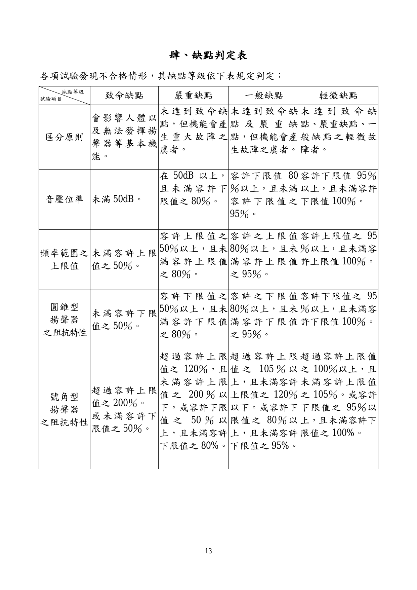
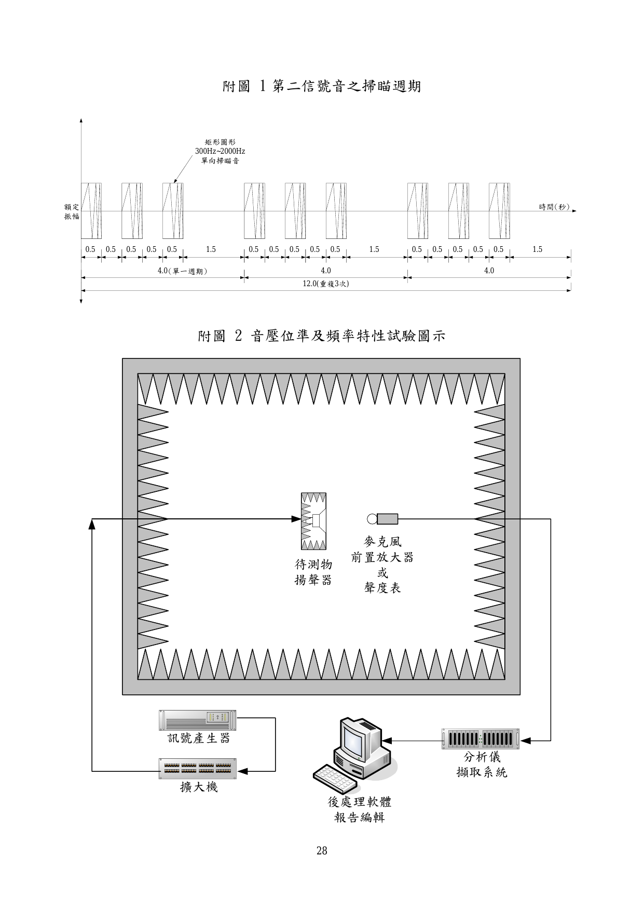
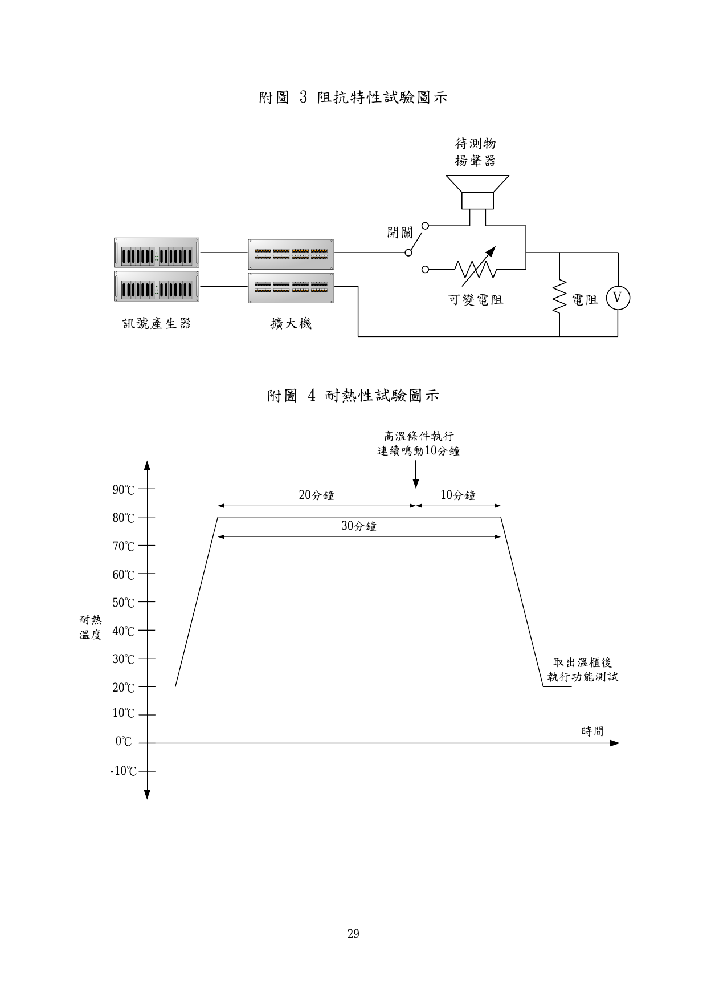
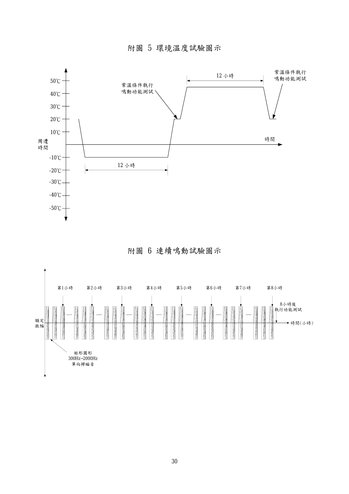
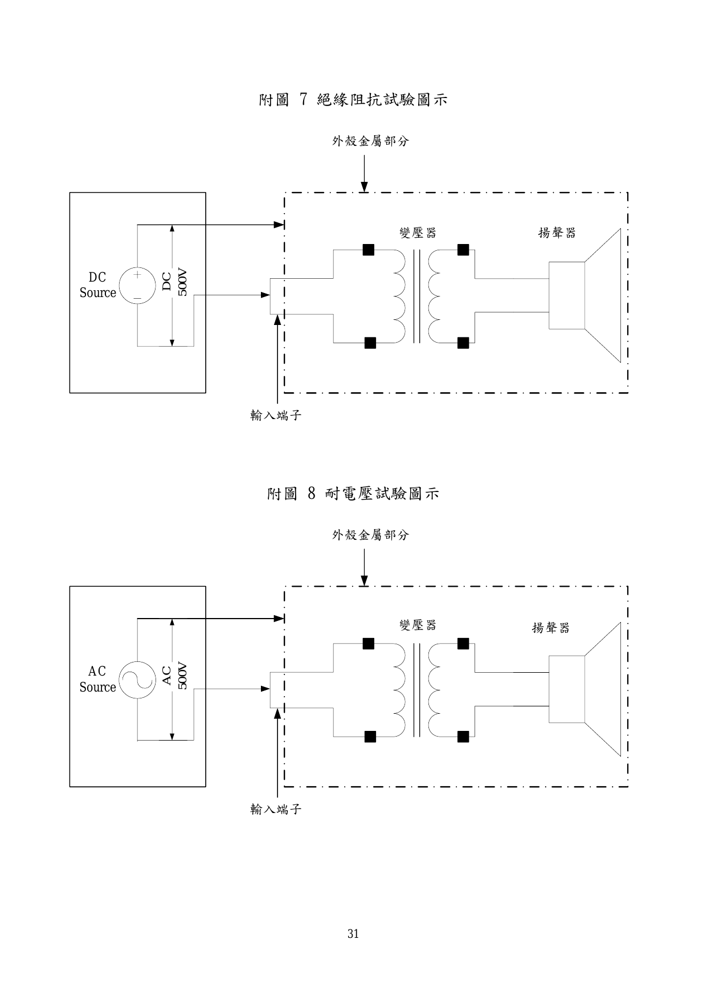
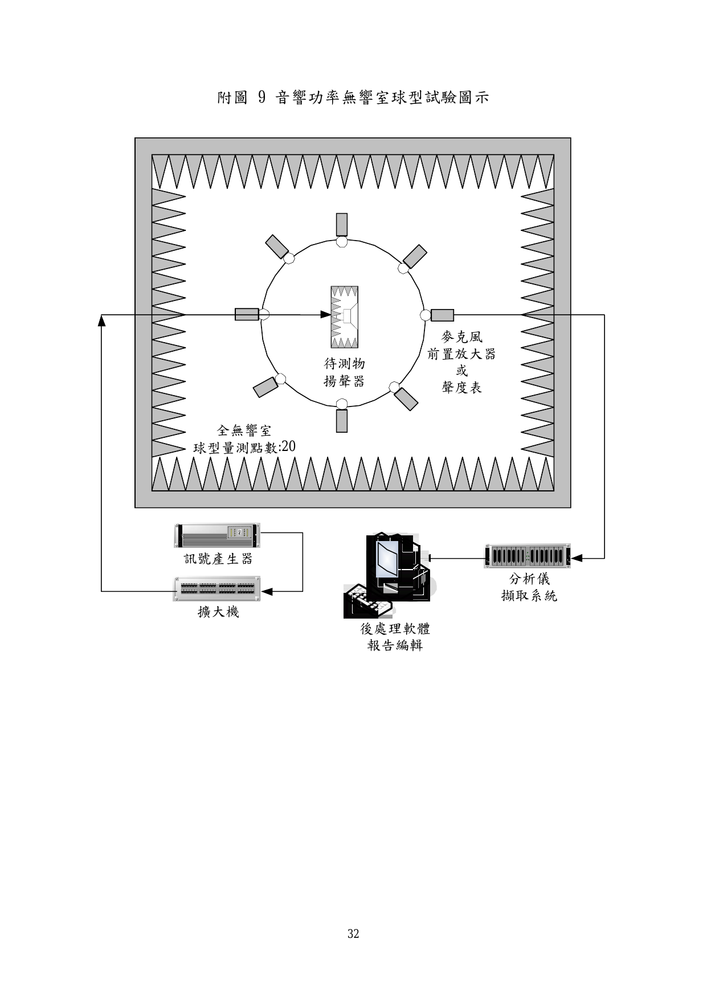
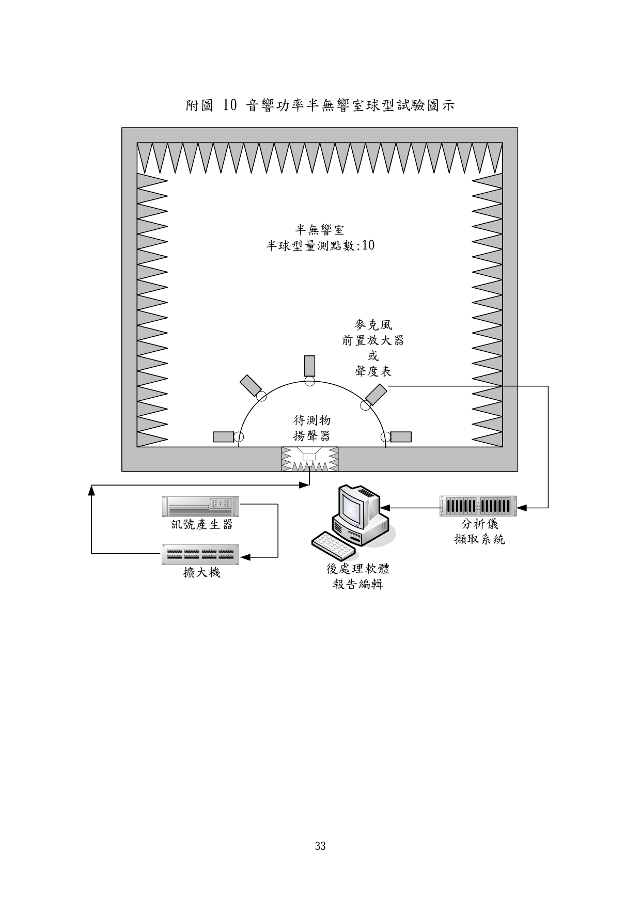
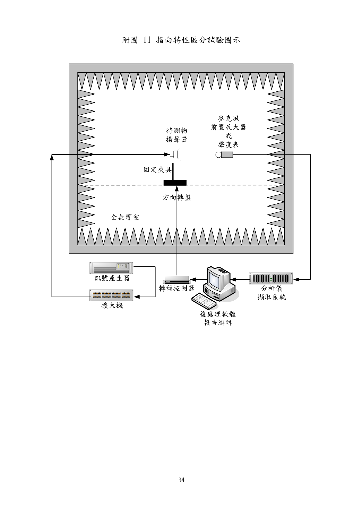
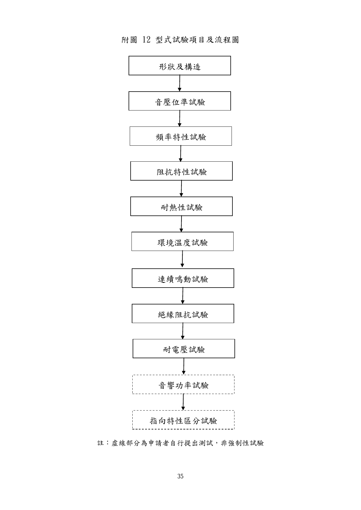

# 緊急廣播設備用揚聲器認可基準

> 來源：內政部消防署（使用者上傳 PDF 轉換）｜版本日期：民國 101 年 11 月 14 日（修正）

>

> ⚠️ **法規快照**：本檔為入庫當下之版本，引用前請依 index.md「法規時效」核對官方現行版本。
>
> 📌 **免責聲明**：本檔內容部分為 PDF／影像 OCR 與人工整理之結果，可能有辨識誤差。**一切以主管機關（內政部消防署）公告之現行版本為準**；如有疑義，以官方公告為主。後續 AI 代理人引用本檔時應主動提醒使用者此點，並於必要時自行上網查證正確版本。

>

> 🛈 本檔由 PDF（`pdftotext -layout`）自動轉換，已去頁首頁尾與目錄。**公式已依使用者提供之原圖以 LaTeX（KaTeX/MathJax）格式重製**；附圖、紀錄表、抽樣表及缺點判定表之數值門檻無文字層，請以文末原始 PDF 連結核對。

## 壹、技術規範及試驗方法

一、適用範圍供緊急廣播設備用揚聲器，其形狀、構造、材質及性能等技術規範及試驗方法，除依各類場所消防安設備設置標準第 133 條第 3 款規定採性能設計之緊急廣播設備揚聲器，需加測”十二、音響功率試驗”及”十三、指向特性區分試驗”外，應符合本基準之規定。

二、用語定義

（一） 揚聲器：指由增幅器以及操作之作動，發出必要音量播報警報音或其他聲音之裝置。

（二） 圓錐型揚聲器：外形為圓形、四方型、變形四方形或橢圓形等之揚聲器。

（三） 號角型揚聲器：外形為號角形之揚聲器。

（四） 音壓位準（Sound pressure level, Lp）：隨著音波存在所產生空氣中之音壓量之大小表示，又稱聲壓位準，單位為分貝（dB），其公式如下：

$$L_p = 20\log_{10}\left(\frac{P}{P_0}\right)$$

公式中 $L_p$：音壓位準（單位 dB）； $P$：音壓之實效值（單位 Pa）； $P_0$：基準音壓 $\left(=2\times10^{-5}\ \text{Pa}\right)$。

（五） 音響功率位準（Sound power level, Lw）：每單位時間內音源所產生之能量，相當於音源輸出之功率，又稱聲功率位準，單位為分貝（dB），其公式如下：

$$L_w = 10\log_{10}\left(\frac{W}{W_0}\right)$$

公式中 $L_w$：音響功率位準（單位 dB）； $W$：音源機械輸出聲功率（單位 W）； $W_0$：基準音響功率 $\left(=10^{-12}\ \text{W}\right)$。

（六） 無響室（Anechoic room）：表面可吸收主要量測頻率範圍內所有入射之聲能，可在量測表面上保持自由聲場條件之測試空間。

（七） 半無響室（Semi-anechoic room）：有堅硬之反射地板，其餘表面可吸收主要量測頻率範圍內所有入射之聲能，可在一反射平面上保持自由聲場條件之測試空間。

（八） 第二信號音：本測試音源訊號產生之警報測試聲需符合下列條件（如附圖 1）：

1. 訊號之基本波形為相對一個週期內上升時間之比率小於 0.2 以下之鋸齒波。

2. 訊號頻寬為 300Hz~2000Hz±10%，單向掃瞄之時間為 0.5 秒。

3. 訊號圖形為矩形。

4. 訊號樣式為附圖 1 之週期訊號重複 3 次。每次週期之訊號包括訊號持續 0.5 秒、無訊號間斷 0.5 秒；有訊號持續 0.5 秒、無訊號間斷 0.5 秒；有訊號持續 0.5 秒、無訊號間斷 1.5 秒。每次週期計 4秒，重複 3 次，共計 12 秒。

（九） 指向特性：揚聲器於正面軸上所測得之最高音壓位準，隨遠離正面軸而逐漸衰減，其極座標圖示（Polar diagram）之音壓位準曲線所顯示揚聲器之指向特徵。

（十） 指向係數：為該點方向之音壓強度與全方向平均值之音壓強度比值，公式如下：

$$Q = \frac{I_d}{I_o}$$

公式中 $Q$：揚聲器之指向係數； $I_d$：距離揚聲器 1m 處，該方向之直接音壓強度； $I_o$：距離揚聲器 1m 處，全方向之直接音壓強度之平均值。

三、形狀及構造揚聲器之形狀及構造等應與所提供之設計圖面及尺寸公差等相符。

四、音壓位準試驗

（一） 以額定功率之第二信號音為音源，揚聲器置於無響室內，以聲度表距離揚聲器 1m 處，量測其最大音壓位準（附圖 2）。

（二） 上述量測最大音壓值應在下表規定值以上。

| 等級 | S 級 | M 級 | L 級 |
| --- | :---: | :---: | :---: |
| 音壓位準 | 84dB～87dB | 87dB～92dB | 92dB 以上 |

五、頻率特性試驗

（一） 揚聲器施加輸入電壓為輸入電力 1W 相當電壓，以額定電壓之正弦波掃瞄訊號為音源，揚聲器置於無響室或半無響室內，麥克風距離揚聲器 1m 處，量測其頻率特性（附圖 2）。

（二） 圓錐型揚聲器之額定頻率範圍上限值需達 8kHz 以上，為功能正常。額定頻率範圍上限值之音壓位準不可低於特性感度音壓位準 20dB以上。以額定電壓之粉紅色訊號為音源，揚聲器放置於無響室或半無響室內，以聲度表距離揚聲器 1m 處，量測其 1/3 倍頻音壓位準，計算揚聲器額定頻寬範圍內之總音壓位準，此總音壓位準即為特性感度音壓位準，計算公式如下：

$$L_t = 10\log_{10}\left(\sum_{i=1}^{n} 10^{0.1 L_i}\right)$$

公式中 $L_t$：特性感度音壓位準（dB）； $L_i$：1/3 倍頻每一個音壓位準（dB）； $n$：指定頻率中 1/3 倍頻中心頻率之個數。

（三） 號角型揚聲器頻率區域之最高頻率範圍上限值需達 4kHz 以上，為功能正常。判定額定頻率範圍上限值之音壓位準不可低於音壓位準算術平均值 20dB 以上。

1. 直徑大於 200mm 以上之揚聲器，平均音壓位準為 500, 1000, 1500,2000Hz 之 4 點音壓位準算術平均值。

2. 直徑未滿 200mm 之揚聲器，平均音壓位準為 1000, 1500, 2000,3000Hz 之 4 點音壓位準算術平均值，其計算公式如下：

$$L_r = 10\log_{10}\left(\frac{1}{4}\sum_{i=1}^{4} 10^{0.1 L_i}\right)$$

公式中 $L_r$：音壓位準算術平均值（dB）； $L_i$：4 個頻率之音壓位準（dB）。

六、阻抗特性試驗藉由電阻置換法等方式，量測阻抗曲線後（附圖 3），決定其標稱阻抗，與

變壓器組合使用之揚聲器，應含變壓器ㄧ同測試。揚聲器之輸入電壓為音圈之施加電壓達 1V 時，依變壓器之變化比算出ㄧ定之輸入電壓，並符合下列要求：

（一） 圓錐型揚聲器之標稱阻抗為音圈之阻抗之絕對值在最低共振頻率以上之頻帶內之最低頻率時之阻抗值，其單位以（Ω）表示。其額定頻率範圍之最低阻抗值需達標稱阻抗之 80%以上。

（二） 號角型揚聲器之標稱阻抗為頻率 1000Hz 時，輸入端子（附音圈及匹配變電壓器指接有音圈之ㄧ次側）之電氣阻抗絕對值，其單位以（Ω）表示。其單頻 1kHz±15％之阻抗持性需達標稱額定阻抗特性之±15％範圍內。

七、耐熱性試驗

（一） 放置於 80℃之環境中 30 分鐘（附圖 4），於第 20 分鐘起，以額定功率之第二信號音執行連續鳴動 10 分鐘。

（二） 立即取出進行測試，以額定功率之第二信號音執行鳴動測試 1 分鐘，音壓、音質等無異常音或雜音等情況，為功能正常。

八、環境溫度試驗放置於-10℃及 40℃之環境中各 12 小時（附圖 5），再置於常溫中，以額定功率之第二信號音執行鳴動測試 1 分鐘，音壓、音質等無異常音或雜音等情況，為功能正常。

九、連續鳴動試驗以額定電壓之第二信號音執行連續鳴動測試 8 小時（附圖 6），音壓、音質等無異常音或雜音等情況，為功能正常。

十、絕緣阻抗試驗下列之絕緣阻抗試驗，於直流 500V 之導通電路條件下（附圖 7），以絕緣電阻計測定，絕緣電阻值需大於 10MΩ 以上，為功能正常。

（一） 內藏變壓器之揚聲器：測試揚聲器端子和附著於揚聲器金屬間或與揚聲器框架間之絕緣電阻。

（二） 與變壓器組合使用之揚聲器：測試其變壓器之一次端子和附著於揚

聲器金屬間或與揚聲器框架間之絕緣電阻。

（三） 上述以外揚聲器：測試揚聲器端子和附著於揚聲器金屬間或與揚聲器框架間之絕緣電阻。

十一、耐電壓試驗下列之耐電壓試驗，於交流 500V 之導通電路條件下（附圖 8），以接近50Hz 或 60Hz 之正弦波實效電壓 500V 之交流電壓加於其上，其耐電壓時間為 1 分鐘。

（一） 內藏變壓器之揚聲器：測試揚聲器端子和附著於揚聲器金屬間或與揚聲器框架間之絕緣電阻。

（二） 與變壓器組合使用之揚聲器：測試其變壓器之一次端子和附著於揚聲器金屬間或與揚聲器框架間之絕緣電阻。

（三） 上述以外揚聲器：測試揚聲器端子和附著於揚聲器金屬間或與揚聲器框架間之絕緣電阻。

十二、音響功率試驗

（一） 以額定功率之第二信號音為音源，揚聲器置於無響室或半無響室內，聲度表與揚聲器之量測距離依據國家標準(以下簡稱 CNS)14657（聲學-測定噪音源音響功率之精密級方法-用於無響室和半無響室）之規定(附圖 9 及附圖 10)，每點測試時間至少為 30 秒。

（二） 由於上述音響功率試驗之測定，係以第二信號音為音源，而該音源為間歇音型態，故下列公式計算後需加 4dB 加以補正。

（三） 若量測之額定功率非 1W，則需將其量測功率換算為 1W 之功率，方能宣告 1W 之音響功率。其換算公式如下，計算至小數點第一位後四捨五入，取至整數。

$$L_1 = L_w - 10\log_{10} P$$

公式中 $L_1$：換算後 1W 之音響功率（dB）； $L_w$：量測額定功率之音響功率（dB）； $P$：揚聲器之額定輸入功率（與變壓器組合使用之揚聲器，為該變壓器之額定輸入電壓）。

十三、指向特性區分試驗

（一） 以額定功率之粉紅色噪音(Pink noise)為音源，揚聲器架設於方向轉盤上並置於無響室或半無響室內，麥克風距離揚聲器一定距離處，量測其 360 度方向之音壓位準(附圖 11)，旋轉角度至少每 5o量測 1 點。

（二） 指向特性區分，以下列方法換算指向係數 Q 後，將指向特性區分W, M, N 或 X。水平及垂直方向，其指向係數 Q 相同之揚聲器，僅測試水平方向之指向係數 Q 即可。

（三） 根據上述音響功率試驗之測定法，求得正面軸上以 2k Hz 為中心頻率之 1/3 倍頻之各角度之指向係數 Q：

$$Q = 10^{0.1 \times DI}$$

公式中 $DI$：方向性指數（單位為 dB）； $Q$：聲源之指向係數。

1. 無響室之計算公式：

$$DI = L_{pi} - L_p$$

公式中 $L_{pi}$：距離聲源 r 處在特定方向量測之音壓位準（dB）； $L_p$：在半徑 r 之測試球體上之表面音壓位準（dB）。

2. 半無響室之計算公式：

$$DI = L_{pi} - L_p + 3$$

公式中 $L_{pi}$：距離聲源 r 處在特定方向量測之音壓位準（dB）； $L_p$：在半徑 r 之測試球體上之表面音壓位準（dB）。

（四） 依據揚聲器類別計算之指向係數 Q、下表內 Q 值為所規範角度之最小值，選擇指向特性區分 W, M, N, X。下表內 Q 值為所規範角度之最小值：

| 揚聲器種類 | 指向特性區分 | 0°～15° | 15°～30° | 30°～60° | 60°～90° |
| --- | :---: | :---: | :---: | :---: | :---: |
| 圓錐型揚聲器 | W | 5 | 5 | 3 | 0.8 |
| 號角型圓錐揚聲器、直徑 200mm 以下號角型揚聲器 | M | 10 | 3 | 1 | 0.5 |
| 直徑超過 200mm 號角型揚聲器 | N | 20 | 4 | 0.5 | 0.3 |
| 其他 | X | 採用上述角度或是申請其他用途之角度 | | | |

> 備考：開口非圓錐型之揚聲器，先換算成圓面積再區分設定。

2.表格內之數值為參考數值。

十四、標示

（一） 於揚聲器上應以不易抹滅之方法標示下列項目：

1. 廠牌或廠商名稱。

2. 型式及型號。

3. 製造編號（即序號 Series Number）

4. 製造年份。

5. 標稱阻抗（Ω）、額定輸出功率（W）、音壓位準等級。

6. 接線方式。

7. 依各類場所消防安設備設置標準第 133 條第 3 款規定採性能設計之緊急廣播設備揚聲器，須加註下列兩項：

（1）音響功率位準，例如：p=95dB(1W)。

（2）指向特性區分（W.M.N.X）。

（二） 檢附操作說明書並符合下列規定：

1. 包裝揚聲器之容器應附有簡明清晰之揚聲器安裝及操作說明書，並視需要提供圖解輔助說明。

2. 說明書應包括產品安裝及操作之詳細指引及資料。

3. 同一容器裝有數個同型揚聲器時，至少應有一份安裝及操作說明書。

4. 作為揚聲器檢查及測試之用者，得詳述其檢查及測試之程序及步驟。

5. 其他注意事項。

## 貳、型式認可作業

一、試驗樣品數所需樣品數為完成品 3 個，並檢附附表 1 及所需資料。

二、型式試驗之方法

（一） 試驗項目及流程試驗項目及流程如附圖 12。

（二） 試驗方法依照「壹、技術規範及試驗方法」第三～十三項進行。型式試驗結果，應填入附表 2 之型式試驗紀錄表。

三、型式試驗結果之判定

（一） 符合本認可基準所規定之技術規範者，其型式試驗結果為合格。

（二） 符合下述四、所定補正試驗規定者，得進行補正試驗，並以一次為限。

（三） 未符合本認可基準所定技術規範者，其型式試驗結果為不合格。

四、補正試驗有下列情形之ㄧ者，得進行補正試驗︰

（一） 型式試驗之不良事項為申請資料不完備(設計錯誤除外)、標示遺漏、零件裝置不良或符合肆、缺點判定表所列輕微缺點者。

（二） 試驗設備不完備或有缺點，致無法進行試驗者。

五、型式區分有下列情形之ㄧ者，應重新申請型式認可：

（一） 圓錐型揚聲器、號角型揚聲器、複合型揚聲器之外型變更者。

（二） 揚聲器之喇叭單體(不含變壓器)變更者。

六、型式變更有下列情形之ㄧ者，應申請型式變更：

1.    音壓位準之 S,M,L 級數變更、音響功率變更、額定入力功率變更者。

2.    外殼更動導致音壓位準、音響功率、頻率特性變更者。

3.    變壓器更新者。型式變更試驗之樣品數、試驗流程等，應就型式變更之內容，依前述型式試驗方法進行。

七、輕微變更有下列情形之ㄧ者，應申請輕微變更：

（一） 外殼更動而不影響音壓位準、音響功率、頻率特性變更者。

（二） 既有核定變壓器之簡易變更者。

## 參、個別認可作業

一、方法

（一）個別認可依照 CNS 9042(隨機抽樣法)規定進行抽樣試驗。

（二）抽樣試驗之嚴寬等級可分為寬鬆試驗、普通試驗、嚴格試驗及最嚴格試驗四種。

二、試驗項目、方法及結果紀錄

（一）分為一般試驗及分項試驗，項目如下：

試驗區分      試驗項目一般試驗      音壓位準阻抗特性絕緣阻抗分項試驗耐電壓形狀、構造及標示

（二）試驗方法，依照壹、技術規範及試驗方法之規定。

（三）試驗結果應填入附表 3.1 及附表 3.2 之個別試驗紀錄

三、抽樣

（一）一般試驗：樣品數由相關試驗之嚴寬等級及批量大小(如附表 4 至附表 7)所定。

（二） 分項試驗：樣品數依據附表 4 至附表 7 先抽取一般試驗之樣品數，再由一般試驗之樣品數中抽取所需之樣品數。

四、結果判定一般試驗及分項試驗，應分別計算其不良品之數量，合格與否，依抽樣表及下列規定判定之：

（一） 一般試驗及分項試驗之不良品數，均在合格判定個數以下時，該批為合格；且下一批可依六、所定「試驗嚴寬度等級之調整」規定，更換較寬鬆之試驗等級。

（二） 一般試驗及分項試驗，任一試驗之不良品數在不合格判定個數以

上時，該批為不合格。並應依其六、所定「試驗嚴寬度等級之調整」規定，更換較嚴格之試驗等級。其不良品之缺點為輕微缺點者，得進行補正試驗，並以一次為限。

（三） 出現致命缺點之不良品時，即使不良品數在合格判定個數以下，該批仍為不合格。並應依六、所定「試驗嚴寬度等級之調整」規定，更換較嚴格之試驗等級。

五、結果之處置

（一） 合格批次之處置

1. 當批次雖經判定合格，但受驗樣品中如發現有不良品時，應使用預備品替換或於修復後，方視為合格品。

2. 即使為非受驗之樣品，若於整批受驗製品中發現有不良品者，準依前款之規定。

3. 上述 1、2 兩種情形，如無預備品替換或無法修復調整者，應就不良品之個數，判定為不合格。

（二）補正批次之處置

1. 接受補正試驗時，應提出初次試驗時所發現不良事項之改善說明書及不良品處理後之補正試驗合格紀錄表。

2. 補正試驗之受驗樣品數以初次試驗之受驗樣品數為準；但該批製品經補正試驗合格，在前述”五（一）、1”之處置後，仍未達受驗數之個數時，則視為不合格。

（三）不合格批次之處置

1. 不合格批次之產品接受再試驗時，應提出初次試驗時所發現不良事項之改善說明書，及不良品處理之補正試驗合格紀錄表。

2. 不合格批次之產品接受再試驗時，不得加入初次試驗受驗製品以外之製品。

3. 不合格之批次不再試驗時，應備文說明理由及其廢棄處理等方式。

六、個別認可試驗嚴寬度等級之調整

（一） 試驗等級以普通試驗為標準，並依附表 8 規定進行轉換。

（二）有關補正試驗及再受驗批次之試驗等級調整，第一次試驗為寬鬆試驗者，以普通試驗為之；第一次試驗為普通試驗者，以嚴格試

驗為之；第一次試驗為嚴格試驗者，以最嚴格試驗為之。此再受驗批次之試驗結果，不得計入試驗嚴寬分級轉換紀錄中。

七、免會同試驗

（一）符合下列規定者，得免會同試驗：

1. 達寬鬆試驗後連續十批第一次試驗均合格者。

2. 累積受驗數量達 1000 個以上。

3. 取得 ISO 9001 認可登錄或經中央主管機關同意國外之第三公正檢驗單位通過者（產品具合格標識）。

（二）實施免會同試驗時，每半年至少派員會同實施抽驗一次，試驗項目依照個別認可試驗項目，若試驗不符合本基準規定時，該批次予以不合格處置，次批並恢復為普通試驗（會同試驗）。

（三） 符合免會同試驗資格者，如有下列情形之一，該批樣品應即恢復為普通試驗（會同試驗）：

4. 所提廠內試驗紀錄表有疑義時。

5. 六個月內未申請個別認可者。

6. 經使用者反應認可樣品有構造與性能不合本基準規定，經中央主管機關或委托機關（構）確認確實有不符合者。

八、個別認可試驗之限制當批次完成個別認可試驗完整程序後，方能申請及執行下一批次之個別認可試驗。

九、個別認可試驗設備發生故障之處置試驗開始後因試驗設備發生故障，經確認當日無法完成試驗時，則中止該試驗。並俟接獲試驗設備完成改善之通知後，重新擇定時間，依下列規定對該批施行試驗：

（一） 試驗之抽樣標準與初次試驗時相同。

（二） 該試驗不得進行補正試驗。

十、其他個別認可時，若發現製品有其他不良事項，經認定該產品之抽樣標準及個別認可方法不適當時，得另定個別認可方法及抽樣標準。

## 肆、缺點判定表

各項試驗發現不合格情形，其缺點等級依下表規定判定。

> 📷 截自原始 PDF 第 16 頁（內文頁 13）。

以下為各缺點等級之**區分原則**：

| 缺點等級 | 區分原則 |
| --- | --- |
| 致命缺點 | 會影響人體以及無法發揮揚聲器等基本機能。 |
| 嚴重缺點 | 未達到致命缺點，但機能會產生重大故障之虞者。 |
| 一般缺點 | 未達到致命缺點及嚴重缺點，但機能會產生故障之虞者。 |
| 輕微缺點 | 未達到致命缺點、嚴重缺點、一般缺點之輕微故障者。 |

## 伍、主要試驗設備

試驗項目依下表規定：試驗項目                      試驗裝備

1. 無響室：符合 CNS 14657（聲學-測定噪音源音響功率的精密級方法-用於無響室和半無響室）或相當標準之規定。

2. 訊號產生器：可產生正弦波（sine）, 粉紅色噪音（pinknoise）,白雜音（white noise）, 第二信號音等者。音壓位準試驗    3. 擴大器：符合 CNS 14677-3（聲音系統設備－第 3 部：擴大機）或相當標準之規定。1Watt, 20~20k Hz 頻率響應之準確度±0.5 dB。

4. 音壓位準量測之聲度表（俗稱噪音計）或分析儀：符合CNS 13583（積分均值聲度表）或相當標準之規定。Type1 等級噪音計，準確度±1 dB。

1. 無響室或半無響室：符合 CNS 14657（聲學-測定噪音源音響功率的精密級方法-用於無響室和半無響室）或相當標準之規定。

2. 訊號產生器：可產生正弦波（sine）, 粉紅色噪音（pinknoise）,白雜音（white noise）, 第二信號音等者。音響功率試驗    3. 擴大器：符合 CNS 14677-3（聲音系統設備－第 3 部：擴大機）或相當標準之規定。1Watt, 20~20k Hz 頻率響應之準確度±0.5 dB。

4. 音壓位準量測之聲度表（俗稱噪音計）或分析儀：符合CNS 13583（積分均值聲度表）或相當標準之規定。Type1 等級噪音計，準確度±1 dB。

1. 無響室或半無響室：符合 CNS 14657（聲學-測定噪音源音響功率的精密級方法-用於無響室和半無響室）或指向特性區分試驗     相當標準之規定。

2. 訊號產生器：可產生正弦波（sine）, 粉紅色噪音（pinknoise）,白雜音（white noise）,第二信號音等者。

3. 擴大器：符合 CNS 14677-3（聲音系統設備－第 3 部：

試驗項目                         試驗裝備擴大機）或相當標準之規定。1Watt, 20~20k Hz 頻率響應之準確度±0.5 dB。

4. 音壓位準量測之聲度表（俗稱噪音計）或分析儀：符合CNS 13583 或相當標準之規定。Type 1 等級噪音計，準確度±1 dB。

5. 方向分度盤：角度最小調整刻度至少為 5o。準確度±0.5 o。

1. 無響室或半無響室：符合 CNS 14657（聲學-測定噪音源音響功率的精密級方法-用於無響室和半無響室）或相當標準之規定。

2. 訊號產生器：可產生正弦波（sine）, 粉紅色噪音（pinknoise）,白雜音（white noise）,第二信號音等者。頻率特性試驗   3. 擴大器：符合 CNS 14677-3（聲音系統設備－第 3 部：擴大機）或相當標準之規定。1Watt, 20~20k Hz 頻率響應之準確度±0.5 dB。

4. 音壓位準量測之聲度表（俗稱噪音計）或分析儀：符合CNS 13583 或相當標準之規定。Type 1 等級噪音計，準確度±1 dB。

1. 訊號產生器：可產生正弦波（sine）, 粉紅色噪音（pinknoise）,白雜音（white noise）,第二信號音等者。

2. 擴大器：符合 CNS 14677-3（聲音系統設備－第 3 部：阻抗特性試驗    擴大機）或相當標準之規定。1Watt, 20~20k Hz 頻率響應之準確度±0.5 dB。

3. 三用電表：符合 CNS 5426（三用表）或相當標準之規定。準確度±0.5%。

1. 溫度櫃：符合 CNS 3634 或相當標準之規定。準確度±2℃。

2. 訊號產生器：可產生正弦波（sine）, 粉紅色噪音（pink耐熱性試驗noise）,白雜音（white noise）訊號等者。

3. 擴大器：符合 CNS 14677-3（聲音系統設備－第 3 部：擴大機）或相當標準之規定。1Watt, 20~20k Hz 頻率響

試驗項目                      試驗裝備應之準確度±0.5 dB。

1. 溫度櫃：符合 CNS 3634（環境試驗方法（電氣、電子）–高溫（耐熱性）試驗方法）或相當標準之規定。準確度±2℃。環境溫度試驗   2. 訊號產生器：可產生正弦波（sine）, 粉紅色噪音（pinknoise）,白雜音（white noise）訊號等者。

3. 擴大器：符合 CNS 14677-3 或相當標準之規定。1Watt,20~20k Hz 頻率響應之準確度±0.5 dB。

1. 訊號產生器：可產生正弦波（sine）, 粉紅色噪音（pinknoise）,白雜音（white noise）訊號者。失真度< 1%@10Hz~100KHz。連續鳴動試驗

2. 擴大器：符合 CNS 14677-3（聲音系統設備－第 3 部：擴大機）或相當標準之規定。1Watt, 20~20k Hz 頻率響應之準確度±0.5 dB。

1. 絕緣電阻計：符合 CNS 5198（高絕緣電阻計）或相當標準之規定。準確度±10%。絕緣阻抗試驗

2. 三用電表：符合 CNS 5426（三用表）或相當標準之規定。準確度±0.5%。

1. 耐壓測試器：符合 CNS 4785（圓錐型揚聲器檢驗法）,CNS 4788（號角型揚聲器檢驗法）相關章節或相當標耐電壓試驗準之規定。準確度±10%。

2. 三用電表：符合 CNS 5426（三用表）或相當標準之規定。準確度±0.5%。

1. 游標卡尺：符合 CNS 4175（游標卡尺）或相當標準之規定。準確度±0.04mm。形狀及構造

2. 直尺：符合 CNS 7548（金屬直尺）或相當標準之規定。準確度±0.1mm。

## 陸、附表及附圖

本節附圖（試驗圖示／流程圖）已以原始 PDF 截圖嵌入下方；附表（紀錄表／抽樣表）為表單，**完整內容請見文末原始 PDF 連結**。清單如下：

**附表**

- 附表 1　揚聲器產品明細表
- 附表 2　揚聲器型式試驗紀錄表
- 附表 3.1　揚聲器個別認可一般試驗紀錄表
- 附表 3.2　揚聲器個別認可分項試驗紀錄表
- 附表 4　寬鬆試驗抽樣表
- 附表 5　普通試驗抽樣表
- 附表 6　嚴格試驗抽樣表
- 附表 7　最嚴格試驗抽樣表
- 附表 8　試驗嚴寬度等級調整表
- 附表 9　寬鬆試驗之界線數
- 附表 10　嚴格試驗之界線數

**附圖**

> 📷 附圖 1～12 截自原始 PDF 第 31～38 頁（內文頁 28～35）。

## 柒、引用參考資料及標準

一、 非常警報設備之放送設備認定細則, 平成 1 6 年 9 月, 日本消防檢定協會。

二、 JIS C 5532, 1994, “音響システム用スピーカ Loudspeakers for soundsystem equipment”

三、 CNS 5426, 民國 73, “三用表, Multimeter”。

四、 CNS 5198, 民 國 79, “ 高 絕 緣 電 阻 計 , High Insulation ResistanceMeters”。

五、 CNS 3635, 民國 74, “電子組件絕緣電阻測試法”。

六、 CNS 3634, 民國 78, “環境試驗方法（電氣、電子）–高溫（耐熱性）試驗方法, Basic Environmental Testing Procedures,Part 2 : Tests, Test B : DryHeat”。

七、 CNS 9081, 民國 71, “電機械器具及配線材料防水試驗法, Method ofTest to Prove Protection Against Ingress of Water for ElectricalEquipment”。

八、 CNS 4784, 民國 7 4, “圓錐型揚聲器總則, General Rules for Cone TypeLoudspeakers”。

九、 CNS 4785, 民國 73, “圓錐型揚聲器檢驗法, Method of Test for ConeType Loudspeakers”。

十、 CNS 4786, 民國 74, “圓錐型揚聲器, Cone Type Loudspeakers”。

十一、CNS 4787, 民國 73, “號角型揚聲器, Horn Type Loudspeakers”。

十二、CNS 4788, 民國 73, “號角型揚聲器檢驗法, Method of Test for HornType Loudspeakers”。

十三、CNS 7129, 民國 8 4, “聲度表, Sound Level Meters”。

十四、CNS 13331, 民國 83, “音壓校正器, Sound Calibrator”。

十五、CNS 13583, 民國 84, “積分均值聲度表, Intergrating-Averaging SoundLevel Meters”。

十六、CNS 11160, 民國 73, “聲音及振動用八音度及 1/3 八音度頻帶分析器,

Octave and Third-octave Band Analyzers for Sounds and Vibrations”。

十七、CNS 14677-3, 民國 91, “聲音系統設備－第 3 部：擴大機, Soundsystem equipment Part 3: Amplifiers”。

十八、CNS 14677-4, 民國 91, “聲音系統設備－第 4 部：麥克風, Soundsystem equipment Part 4: Microphone”。

十九、CNS 14677-5,      “聲音系統設備－第 5 部：揚聲器, Sound systemequipment Part 5: Loudspeakers”。(草案審查中)

二十、CNS 14657, 民國 91, “聲學-測定噪音源音響功率之精密級方法-用於無響室和半無響室(Acoustics–Determination of sound power levels ofnoise sources–Precision methods for anechoic and semi-anechoicrooms)”。

二十一、CNS 4175 民國 70 年, “游標卡尺, Vernier Calipers”。CNS 7548 民國 70 年, “金屬直尺, Metal Rules”

---

## 附件（原始 PDF）

> 附圖 1～12 及肆、缺點判定表已以原始 PDF 截圖嵌入本文相應位置；附表（紀錄表／抽樣表）以原始 PDF 為準：

- **緊急廣播設備用揚聲器認可基準（完整 PDF）**：[開啟檔案](../附件/緊急廣播設備用揚聲器認可基準/緊急廣播設備用揚聲器認可基準.pdf)
