# 出口標示燈及避難方向指示燈認可基準

> 來源：內政部消防署｜版本日期：107 年 5 月 18 日內授消字第 1070821864 號令修正發布
>
> ⚠️ **法規快照**：本檔為入庫當下之版本，引用前請依 index.md「法規時效」核對官方現行版本。
>
> 📌 **免責聲明**：本檔內容部分為 PDF／影像 OCR 與人工整理之結果，可能有辨識誤差。**一切以主管機關（內政部消防署）公告之現行版本為準**；如有疑義，以官方公告為主。後續 AI 代理人引用本檔時應主動提醒使用者此點，並於必要時自行上網查證正確版本。
>
> 🛈 本檔由 PDF（`pdftotext -layout`）轉換並人工整理。依三層表格原則：散文與簡單數值表、AQL 抽樣表已內嵌 markdown；複雜跨欄矩陣表、缺點判定表、紀錄表（表單）及附圖僅附文末原始 PDF 連結。公式以 LaTeX 呈現。

---

## 壹、技術規範及試驗方法

### 一、適用範圍

依各類場所消防安全設備設置標準規定設置之出口標示燈、避難方向指示燈等避難引導燈具（以下簡稱為引導燈具），其構造、材質與性能等技術上之規範及試驗方法，應符合本基準之規定。但引導燈具附加動態顯示功能者，該動態顯示功能與構造非屬本基準認可範圍。

### 二、用語定義

#### （一）引導燈具

避難引導的照明器具，分成出口標示燈、避難方向指示燈，平日以常用電源點燈，停電時自動切換成緊急電源點燈。依構造形式及動作功能區分如下：

1. 內置型：內藏蓄電池作為緊急電源之引導燈具。
2. 外置型：藉由燈具外的蓄電池設備作為緊急電源供電之引導燈具。
3. 具閃滅功能者：藉由動作信號使燈閃滅或連續閃光之引導燈具。
4. 具音聲引導功能者：設有音聲引導裝置之引導燈具。
5. 具閃滅及音聲引導功能者：設有音聲引導裝置及閃滅裝置之引導燈具。
6. 複合顯示型：引導燈具其標示板及其他標示板於同一器具同一面上區分並置者。

#### （二）出口標示燈

顯示避難出口之引導燈具。

#### （三）避難方向指示燈

設置於室內避難路徑、開闊場所及走廊，指引避難出口方向之引導燈具。

#### （四）閃滅裝置

接受動作信號，提高引導效果，使燈具閃爍之裝置。

#### （五）音聲引導裝置

接受動作信號，產生語音告知避難出口位置之引導裝置。

#### （六）信號裝置

將發自於火警自動報警設備之信號予以中繼並傳達至引導燈具之裝置。

#### （七）常用電源

平時供電至引導燈具之電源。

#### （八）緊急電源

常用電源斷電時，供電至引導燈具之電源。

#### （九）蓄電池設備

係指經內政部認可之消防用蓄電池設備，且應為引導燈具專用。

#### （十）控制裝置

由引導燈具之切換裝置、充電裝置及檢查措施所構成的裝置。使用螢光燈為燈具時，其變壓器、安定器等亦包含於此裝置內。

#### （十一）標示板

標明避難出口或避難方向之透光性燈罩或表示面。

#### （十二）檢查開關

檢查常用電源及緊急電源之切換動作，能暫時切斷常用電源之自動復歸型開關。

### 三、構造及性能

#### （一）構造

1. 材料及零件之品質，在正常使用狀態下應能充分耐久使用，且標示板、光源、啟動器、內置型蓄電池等應為容易更換之構造，便於保養、檢查及維修。
2. 外殼應使用金屬或耐燃材料構成，且應固定牢固。且不會有妨礙避難的構造。
3. 各部分應在正常狀態溫度下耐久使用，如使用合成樹脂時，須不因紫外線照射而顯著劣化。
4. 裝設位置應堅牢固定。
5. 於易遭受雨水或潮濕地方，應有防水構造。電器於正常使用條件下應耐潮濕。
6. 緊急電源用之電池應採用可充電式密閉型蓄電池，容易保養更換、維修，並應符合下列規定：
   - （1）應為自動充電裝置及自動過充電防止裝置且能確實充電，但裝有不致產生過充電之電池或雖有過充電亦不致對其功能構造發生異常之電池，得免設置防自動過充電裝置。（過充電係指額定電壓之 120％而言）
   - （2）應裝置過放電防止裝置。但裝有不致產生過放電之蓄電池或雖呈過放電狀態，亦不致對其功能構造產生異常者，不適用之。
7. 應有防止觸電措施。
8. 內部配線應做好防護措施，與電源接裝之出線，其截面積不得小於 0.75 mm²，且電源線附插頭者，則插頭規格應符合 CNS 690 之規定。
9. 內置型引導燈具之蓄電池及控制裝置與燈具本體未共用同一外殼者，應符合下列規定：
   - （1）蓄電池組應存放在耐燃材料之容器中。
   - （2）應有可以容易更換蓄電池之構造。
   - （3）各裝置間有使用連接器具者，其連接器具應以不燃材料製成，且具有充分之機械強度，另各裝置（光源、蓄電池及控制裝置）若有可將其安裝固定在建築物之構造者（如嵌頂式），也可使用繞性管或可繞波紋電線管。
10. 標示板及透光性燈罩所用材料，應符合壹、十熾熱線試驗之規定，且應不容易破壞、變形或變色。
11. 標示面在亮燈時不得有影響辨識之顯著眩光。
12. 標示面圖形及尺度依附錄一規定。
13. 標示面之顏色、文字、符號圖型（包括箭頭等，以下亦相同）應符合下列規定，可加註英文字樣「EXIT」，其字樣不得大於中文字樣。
    - （1）出口標示燈：以綠色為底，用白色表示「緊急出口」字樣（包括文字與圖形）。
    - （2）避難方向指示燈：用白色為底，綠色圖型（包括圖形並列之文字）。
    - （3）在常用點燈狀態下之顏色使用應符合中華民國國家標準（以下簡稱 CNS）9328〔安全用顏色通則〕及 CNS 9331〔安全用色光通則〕色度座標範圍內。
14. 引導燈具內具閃滅裝置（包括調光裝置）或音聲引導裝置者，該等裝置之電源得與主燈具電源共用。
15. 火災發生時接受由火警警報設備或緊急通報裝置所發出之訊號，能啟動預先設定之避難方向指示燈者，其功能應準確且正常。
16. 內置型引導燈具緊急電源時間應維持 90 分鐘以上。
17. 內置型引導燈具除嵌入型者外，應裝電源指示燈及檢查開關。紅色顯示使用狀態，並安裝於從引導燈具外容易發現之位置。如顯示燈使用發光二極體（LED）時，須為引導燈具使用中不用更換之設計。另嵌入型引導燈具應取下保護燈罩或透光性燈罩及標示板後，符合上開電源指示燈及檢查開關之規定。
18. 引導燈具除嵌入型者外，底側應具有透光性（使用冷陰極管或 LED 光源者不在此限），以利人員疏散。
19. 引導燈具係利用常用電源常時點亮，停電時應自動更換為蓄電池電源或外置電源，繼續照明。
20. 燈具之光源應使用螢光燈、冷陰極管、LED 等。
21. 燈具配線與電源側電線之連接點溫度上升變化應在 30℃ 以下。
22. 緊急電源回路配線不可露出引導燈具外。
23. 外置型引導燈具配線方式分為 2 線式配線或 4 線式配線及共用式 3 種，2 線式配線指同一電線供應一般及緊急用電者；4 線式配線指不同之電線分別供應一般及緊急用電者；共用式指 2 線式及 4 線式任一種方法皆可使用之方式。
24. 外置型引導燈具供緊急用電之出線，應有耐燃保護。
25. 外置型引導燈具使用螢光燈時，其緊急電源回路應有保險絲等保護裝置。
26. 依用途區分及種類如表 1 規定。

> 📋 **表 1（引導燈具區分）**：以「依用途區分（出口標示燈／避難方向指示燈非地面嵌入型／避難方向指示燈地面嵌入型）× 分級（A／BH／BL／C）」交叉列出標示面光度（cd）、標示面長短邊比、標示面數、緊急電源區分、附加功能、標示面之縱向尺度等多欄位，屬跨欄合併矩陣表，無法乾淨轉換。**請見文末原始 PDF（第 3 頁）**。關鍵數值摘錄：
>
> - **出口標示燈**：A 級＝A（光度 50 cd 以上、縱向 400 mm 以上）；B 級＝BH（20 cd 以上、200 mm 以上）／BL（10 cd 以上、400 mm 未滿）；C 級＝C（1.5 cd 以上、縱向 100 mm 以上 200 mm 未滿）。長短邊比 1：1～5：1。
> - **避難方向指示燈（非地面嵌入型）**：A 級＝A（60 cd 以上、400 mm 以上）；B 級＝BH（25 cd 以上、200 mm 以上）／BL（13 cd 以上、400 mm 未滿）；C 級＝C（5 cd 以上、100 mm 以上 200 mm 未滿）。
> - **避難方向指示燈（地面嵌入型）**：B 級＝BH（25 cd 以上、200 mm 以上）／BL（13 cd 以上、400 mm 未滿）；C 級＝C（5 cd 以上、130 mm 以上 200 mm 未滿）。長短邊比 2：1～3：1。
> - 緊急電源區分：減光／消燈／閃滅／音聲引導／複合顯示。電源：內置型／外置型。
> - 備註：標示面光度＝常用電源點燈時其標示面平均亮度（cd/m²）乘以標示面面積（m²）所得之值（單位 cd）；附有箭頭之出口標示燈僅限於 A 級、B 級；作為避難方向指示燈使用之 C 級，其長邊長度應在 130 mm 以上。

#### （二）性能

1. 燈具表面文字、圖形及顏色等，於該燈點亮時，應能正確辨認。
2. 平均亮度：燈具標示面之平均亮度、光度（包括單面及雙面）應符合表 1、表 2 規定。具有調光性能之器具，則測定其必須作調光之各階段的平均亮度。
3. 對電氣充分絕緣。

#### 表 2　標示面之平均亮度

| 種類 | 常用電源（cd/m²） | 緊急電源（cd/m²） |
|---|---|---|
| 出口標示燈 | 150 以上 | 100 以上 400 未滿 |
| 避難方向指示燈 | 150 以上 | 100 以上 400 未滿 |

### 四、材質

#### （一）外殼應使用金屬或耐燃材料構成，各部分之構件應符合表 3 規定或具有同等以上性能

#### 表 3　構件材料一覽表

| 零件名稱 | 材料 |
|---|---|
| 蓄電池（鎳鎘蓄電池） | CNS 6036〔圓筒密閉型鎳鎘蓄電池〕 |
| 蓄電池（鉛蓄電池） | CNS 6034〔可攜式鉛蓄電池〕 |
| 安定器（螢光管用） | CNS 927〔螢光管用安定器〕；CNS 13755〔螢光管用交流電子式安定器〕 |
| 控制裝置 | CNS 14816-1〔低電壓開關裝置及控制裝置-第 1 部：通則〕 |

> 🛈 本款條文稱「各部分之構件應符合表 4 規定」，惟所附表格標題為「表 3 構件材料一覽表」，原 PDF（第 5 頁）內文與表號疑有出入，請核對原檔。

（二）變頻器於緊急電源供電時，須穩定點亮燈具；所用半導體須為耐久型。

（三）標示面等透光性燈罩材料應為耐久性玻璃或合成樹脂，與燈具組合時須能確保光特性，且不可有內藏零件之陰影等。

### 五、點燈試驗

燈具附有起動器者，應在 15 秒以內點燈，無起動器之瞬時型者應即瞬間點燈。

### 六、絕緣電阻試驗

使用直流 500V 高阻計，測量帶電部分與不帶電金屬間之絕緣電阻，均應為 5 MΩ 以上。

### 七、充電試驗

內置型引導燈具其蓄電池電壓降達額定電壓 20％ 以內時，應能自動充電。外置型引導燈具免施此試驗。

### 八、耐電壓試驗

（一）於壹、六之測試端，燈具電源電壓為未滿 150V 者，施加交流電壓 1000V，燈具電源電壓為 150V 以上者，施加交流電壓 1500V，應能承受 1 分鐘無異狀。試驗時應將蓄電池卸下再進行試驗。回路電壓其交流電壓在 30V 以下、直流電壓在 45V 以下者免測試。

（二）外置型引導燈具其緊急用電源回路之對地電壓及線間電壓在 45V 以上者，其緊急用電源回路也應實施耐電壓試驗。

### 九、充放電試驗

#### （一）內置型引導燈具蓄電池應符合下列規定

1. 鉛酸電池：本試驗應於常溫下，按下列規定依序進行，試驗中電池外觀不可有膨脹、漏液等異常現象。
   - （1）依照燈具標稱之充電時間充電之。
   - （2）全額負載放電 1.5 小時後，電池端電壓不得少於額定電壓之 87.5%。
   - （3）再充電 24 小時。
   - （4）全額負載放電 1 小時後，電池端電壓不得少於額定電壓之 87.5%。
   - （5）再充電 24 小時。
   - （6）全額負載放電 24 小時。
   - （7）再充電 24 小時。
   - （8）全額負載放電 1.5 小時後，電池端電壓不得少於額定電壓之 87.5%。
2. 鎳鎘或鎳氫電池：
   - （1）燈具應依其標稱之充電時間進行充電，充足後其充電電流不得低於電池標稱容量之 1/30 且高於 1/10C。
   - （2）放電標準：將充足電之燈具，連續放電 1.5 小時後，電池之端電壓不得少於標稱電壓之 87.5%，且測此電壓時放電作業不得停止。

（二）外置型引導燈具使用之蓄電池設備，為內政部認可之產品，免施本項試驗。

### 十、熾熱線試驗

（一）熾熱線試驗係應用在完成品或組件實施耐燃試驗時。

（二）引用標準：

1. CNS 14545-4〔火災危險性試驗—第 2 部：試驗方法—第 1 章 / 第 0 單元：熾熱線試驗方法—通則〕
2. CNS 14545-5〔火災危險性試驗—第 2 部：試驗方法—第 1 章 / 第 1 單元：完成品之熾熱線試驗及指引〕

（三）試驗說明：

1. 試驗裝置如 CNS 14545-4 之規定。
2. 熾熱線試驗不適用於直線表面尺度小於 20 mm 之組件者，可參考其他方法（例如：針焰試驗）。
3. 試驗前處理：將試驗品或薄層置於溫度 15℃ 至 35℃ 間，相對溼度在 45% 至 75% 間之 1 大氣壓中 24 小時。
4. 試驗程序及警告注意：參照 CNS 14545-4 中第 9.1 節至第 9.4 節之規定。
5. 試驗溫度：
   - （1）對非金屬材料組件如外殼、標示面及照射面所用絕緣材料施測，試驗溫度為 550±10℃。
   - （2）支撐承載電流超過 0.2A 之連接點的絕緣材料組件，試驗溫度為 750±10℃；對其他連接點，試驗溫度為 650±10℃。施加之持續時間（$t_a$）為 30±1 秒。

（四）觀察及量測：熾熱線施加期間及往後之 30 秒期間，試樣、試樣周圍之零件及其位於試驗品下之薄層應注意觀察，並紀錄下列事項：

1. 自尖端施加開始至試驗品或放置於其下之薄層起火之時間（$t_i$）。
2. 自尖端施加開始至火焰熄滅或施加期間之後，所持續之時間（$t_e$）。
3. 目視著火開始大約 1 秒後，觀察及量測有無產生聚合最大高度接近 5 mm 之火焰；火焰高度之量測係於微弱光線中觀察，當施加到試驗品上可看見到火焰之頂端與熾熱線上邊緣之垂直距離。
4. 尖端穿透或試驗樣品變形程度。
5. 使用白松木板者，應記錄白松木板之任何燒焦情形。

（五）結果評估：符合下列情形之一者為合格：

1. 試驗品無產生火焰或熾熱者。
2. 試驗品之周圍及其下方之薄層之火焰或熾熱，在熾熱線移除後 30 秒內熄滅者，即 $t_e \leq t_a + 30$ 秒，且周圍之零件及其下方之薄層無繼續燃燒。使用包裝棉紙層時，包裝棉紙應無著火。

### 十一、平均亮度試驗

（一）使用 CNS 5119〔照度計〕中 AA 級者照度計測試平均亮度。

（二）測試環境：測試時環境之照度在 0.05 lux 以下之暗房。

（三）測試面：整個標示面。

（四）測試步驟：標示板與受光器之距離為標示面長邊之 4 倍以上，量測其平均照度 $E$，平均亮度 $L$ 計算式如下：

$$L = \frac{K_1 \, E \, S^2}{A \cos\theta}$$

- $L$：角度 $\theta$ 之平均亮度（單位：cd/m²）
- $K_1$：基準光束／試驗使用燈管之全光束（一般 $K_1$ 趨近於 1）
- $E$：角度 $\theta$ 之平均照度測定值（單位：lx）
- $S$：標示面板量測點與照度計間之距離（單位：m）
- $A$：標示面之面積（單位：m²）
- $\theta$：照度計與標示面量測點法線方向之角度（單位：°）
- 基準光束：標準燈管之全光束（單位：流明 lm）

（五）測試時間：常用電源之測試於試驗品施以額定電源並使燈管經枯化點燈 100 小時後測試。

（六）緊急電源試驗，於執行常用電源之測試後，再依產品標示額定充電時間完成後即予斷電，並於斷電後 45 分鐘即實施試驗，並於 10 分鐘內測試完畢。（外置型引導燈具僅針對額定緊急電源電壓施予測試）

### 十二、亮度比試驗

亮度比係就標示面之綠色部分、白色部分分別逐點加以測定，求出其最大亮度（cd/m²）與最小亮度。逐點測定係分別測定 3 處以上。正方型引導燈具標示面之亮度比係在常時電源時所規定之測定點之最大亮度與最小亮度之比，應符合表 4 之值。本項測試使用之輝度計，應符合 CNS 5064 之規定。

#### 表 4　標示面之亮度比

| 種類 | 綠色部分 | 白色部分 |
|---|---|---|
| 避難出口標示燈 | 9 以下 | 7 以下 |
| 避難方向指示燈 | 7 以下 | 9 以下 |

如係標示面為長方形之引導燈具，其最小輝度與平均亮度之比，應在 1/7 以上。

$$亮度比 = \frac{L_{max}}{L_{min}}$$

- $L_{max}$：在白色部分或綠色部分之最大亮度
- $L_{min}$：在白色部分或綠色部分之最小亮度

### 十三、耐濕試驗

所有燈具需能耐正常使用下之潮濕狀況，在溼度箱內相對濕度 91% 至 95% 及溫度維持在 20℃ 至 30℃ 間之某溫度（t）的環境下放置 48 小時後，對於電性、機械性能及構造無使用上障礙。其試驗應符合下列各項規定：

（一）溼度箱內部須穩定維持相對濕度 91% ~ 95%，溫度在 20℃ ~ 30℃ 間之某溫度（t），但需保持所設定之溫度（t）在 ±1℃ 以內之誤差。

（二）試驗品有電纜入口者，須打開；若有提供填涵洞（Knock-outs）者，須打開其中之一。如電子零組件、蓋子、保護玻璃等可藉由手拆卸之零件需拆卸，並與主體部分一起做濕度處理。

（三）試驗品在做濕度處理前，應放置在 t 至 t+4℃ 之室內至少 4 小時以上，以達到此指定的溫度。

（四）試驗品放入溼度箱前，須先使期溫度達到 t 至 t+4℃ 之間，然後將試驗品放入溼度箱 48 小時。

（五）經過前述處理後，立刻於常溫常濕環境下，以正常狀態組裝試驗品，於取出後 5 分鐘內進行絕緣電阻、耐電壓試驗。

### 十四、靜荷重試驗

（一）地面嵌入型燈具施以 1000 kgf（9800 N）靜荷重時，外殼及標示板不可有裂痕、破裂及其他使用上之有害異常情形。

（二）組裝方法以裝置固定於圖 1 所示實木框，在使用狀態下進行試驗。荷重以器具底層承受構造，可用試驗裝置底層與器具底層接觸狀態進行試驗。

（三）於試驗品中央部施加靜荷重 30 秒，施加荷重面為直徑 50 mm 圓。地面崁入型的閃爍行走用器具則為 30 mm 以上之圓。

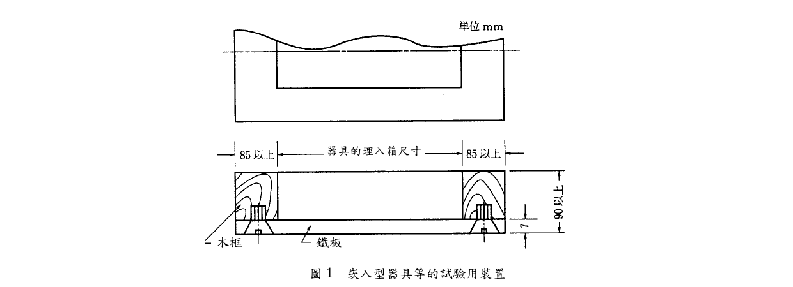

> 📷 截自原始 PDF 第 12 頁（內文頁 9）。

### 十五、熱變形試驗

於燈具正常使用狀態下，由輸入端子處施加額定頻率之額定電壓的 110% 電壓，持續試驗 24 小時，其功能不得有異常、標示面或外殼不得有變色、變形之情形。所謂變形係指在固定狀態之器具上，有超過標示面長度 1% 以上之起伏彎曲等，以及採貼合構造之標示板有貼合處之脫落或有異常情形者。

### 十六、其他

具閃滅、音聲引導、減光或消燈等附加功能之引導燈具，除應符合基準本文規定外，應分別依所附加之功能按本基準附錄二【具閃滅功能與音聲引導功能之引導燈具規定】、附錄三【減光型及消燈型引導燈具規定】或附錄四【複合顯示之引導燈具規定】之各項規定分別試驗。

### 十七、標示

於燈具明顯位置，以不易磨滅之方法，標示下列事項：

（一）設備種類。

（二）設備名稱及型號。

（三）製造年、月。

（四）型式、型式認可號碼。

（五）製造產地。

（六）燈具等級區分（如 A 級、B 級（BH 級、BL 級）、C 級）。

（七）額定電壓（V）、額定電流（A）（具有調光功能者之型式，應為最亮之值）、額定頻率（Hz）。

（八）額定輸入功率（W）（具有調光功能者之型式，應為最亮之值）。

（九）引導燈具之光源種類、規格（W）及個數。

（十）緊急用之光源種類、規格（W）及個數（與平時亮燈不同時為限）。

（十一）緊急用額定電壓（V）、額定電流（A）、額定輸入功率（W）（外置型及與平時亮燈不同時為限）。

（十二）內置型需標明蓄電池額定電壓、額定容量、充電時間。

（十三）內置蓄電池應標明種類、製造商及製造日期或批號。

（十四）外置型需標明『外置型』字樣。

（十五）其他附加功能應標明相關字樣，如『音聲引導』、『閃滅』等，依附加功能按本基準附錄二~四之標示辦理。

（十六）使用方式及使用應注意事項。

---

## 貳、型式認可作業

### 一、型式試驗之樣品

主型式需樣品 5 個；熾熱線試驗試驗片樣品 5 個。具附加功能之引導燈具需樣品 3 個。同一型式之系列認證則依申請差異部分區分，有不同差異時至少需要樣品 1 個。

### 二、型式試驗之方法

#### （一）試驗項目及流程

1. 一般性試驗項目及流程：

   構造、性能、標示 → 點燈試驗、絕緣電阻試驗、充電試驗、耐電壓試驗 →（分流）

   - 樣品 3 個：平均亮度試驗 → 亮度比試驗
   - 樣品 2 個：熱變形試驗 → 充放電試驗 → 耐濕試驗 → 靜荷重試驗
   - 試驗片樣品 5 個：熾熱線試驗

2. 外置型引導燈具免施充電試驗、充放電試驗。
3. 靜荷重試驗僅針對避難方向指示燈地面嵌入型實施測試，其餘型式免測。
4. 金屬、玻璃材質免施熾熱線試驗。
5. 具閃滅、音聲引導、減光或消燈等附加功能之引導燈具，除依上述試驗項目及流程試驗完成後，應依附加功能種類分別進行下列試驗（樣品 3 個）：附加功能之構造、性能、標示 → 動作試驗（含緊急電源容量測試）→ 具音聲引導功能者：音聲引導試驗 → 音壓試驗；具閃滅功能者：閃滅頻率試驗。

#### （二）試驗方法

1. 依照壹、技術規範及試驗方法進行之。
2. 具附加功能者依本基準附錄二【具閃滅功能與音聲引導功能之引導燈具規定】、附錄三【減光型及消燈型引導燈具規定】或附錄四【複合顯示之引導燈具規定】之各項規定分別進行之。

### 三、型式試驗結果之判定

（一）符合本認可基準所規定之技術規範，該型式試驗結果為「合格」。

（二）有四、補正試驗所定情形者，得進行補正試驗，並以一次為限。

（三）依「缺點判定表」（如表 8）判定未符合本認可基準規範者，該型式試驗結果為「不合格」。

> 🛈 本款原 PDF（第 12 頁）文字稱「缺點判定表（如表 9）」，惟肆、缺點判定方法所附之缺點判定表為「表 8」，原檔表號疑有出入，請核對原檔。

### 四、補正試驗

（一）型式試驗之不良事項為申請資料不完備（設計錯誤除外）、標示遺漏、零件安裝不良者。

（二）試驗設備有不完備或缺點，致無法進行試驗者。

（三）依「缺點判定表」（如表 8）判定為輕微缺點，且合計 3 項（含）以下者。

### 五、型式變更之試驗方法

型式變更試驗之樣品數、試驗流程等，應就型式變更之內容，依前述型式試驗之方法進行。

### 六、型式區分、型式變更及輕微變更之範圍

型式區分、型式變更及輕微變更之範圍，依附表 1 之規定。

### 七、試驗紀錄

有關上述型式試驗、補正試驗、型式變更試驗之結果，應詳細填載於型式試驗紀錄表（如附表 10）。

---

## 叁、個別認可作業

### 一、個別認可之方法

（一）個別認可之抽樣試驗數量依附表 2 至附表 8 規定，抽樣方法依 CNS 9042 規定進行。

（二）抽樣試驗之嚴寬等級依程度分為最嚴格試驗、嚴格試驗、普通試驗、寬鬆試驗及免會同試驗五種。

（三）試驗項目分為以通常樣品進行之試驗（以下稱為「一般試驗」）以及對於少數樣品進行之試驗（以下稱為「分項試驗」）兩類。

### 二、批次之判定基準

（一）受試驗品按不同受驗廠商，依其試驗等級之區分列為同一批次。

（二）新產品與已受試驗之型式不同項目僅有下表 5 所示項目者，自第一次受驗開始即可列為同一批次；如其不同項目非下表 5 所示項目，惟經過連續 10 批次普通試驗，且均於第一次即合格者，得列入已受驗合格之批次。

#### 表 5　新產品與已受試驗之型式可視為同一批次之項目

| 項次 | 項目名稱 |
|---|---|
| 1 | 同一系列者 |
| 2 | 經型式變更者 |
| 3 | 變更之內容在型式變更範圍內，且經型式變更認可者 |
| 4 | 受驗品相同但申請者不同者 |
| 5 | 光源及品名相同者 |

（三）申請者不得指定將某部分產品列為同一批次。

### 三、個別認可之樣品及抽樣方法

（一）個別認可之樣品數依相關試驗之嚴寬等級以及批次大小所定（如附表 2 至附表 5）。關於批次受驗數量少，進行普通試驗時，得依申請者事先提出之申請要求，使用附表 6（適用生產數量少之普通試驗抽樣表）進行認可作業。

（二）樣品之抽取依下列規定：

1. 抽樣試驗應以每一批次為單位。
2. 樣品之多寡，應視整批成品（受驗數量＋預備品）數量之多寡及試驗等級，按抽樣表之規定抽取，並在重新編號之全部製品（受驗批）中，依隨機抽樣法（CNS 9042）隨意抽取，抽出之樣品依抽出順序編排序號。受驗批量如在 500 個以上時，應依下列規定分為二段抽樣。
   - （1）計算每群應抽之數量：當受驗批次在五群（含箱子及集運架等）以上時，每一群之製品數量應在 5 個以上之定數，並事先編定每一群之編碼；但最後一群之數量，未滿該定數亦可。
   - （2）抽出之產品賦予群碼號碼：同群製品須排列整齊，且排列號碼應能清楚辨識。
   - （3）確定群數及抽出個群，再從個群中抽出樣品：確定從所有群產品中可抽出五群以上之樣品，以隨機取樣法抽取相當數量之群，再由抽出之各群製品作系統式循環抽樣（由各群中抽取同一編號之製品），將受驗之樣品抽出。
   - （4）依上述方法取得之製品數量超過樣品所需數量時，重複進行隨機取樣去除超過部分至達到所要數量。

（三）一般試驗和分項試驗以不同之樣品試驗之。

### 四、試驗項目

#### （一）一般試驗及分項試驗之項目及試驗流程如表 6

#### 表 6　個別認可試驗項目

| 試驗區分 | 試驗項目 | 備註 |
|---|---|---|
| 一般試驗 | 1. 構造、性能檢查 2. 標示檢查 3. 點燈試驗 4. 絕緣電阻試驗 5. 充電試驗 6. 耐電壓試驗 7. 平均亮度試驗（免施枯化點燈） | 樣品數：依據附表 2 至附表 6 規定抽取。 |
| 分項試驗 | 8. 亮度比試驗 （以下依附加功能之引導燈具加測） 9. 動作試驗 10. 音聲引導試驗 11. 音壓試驗 12. 閃滅頻率試驗 | 同上 |

附註：

1. 平均亮度試驗免測試 100 小時枯化試驗。
2. 具附加功能之引導燈具之動作試驗，應分別依其附錄規定，進行動作、連動及停止測試，並應確認內置型緊急電源動作時間。
3. 具音聲引導功能之引導燈具應進行音聲引導試驗及音壓試驗。
4. 具閃滅功能之引導燈具應進行閃滅頻率試驗。
5. 具閃滅功能兼音聲引導功能之引導燈具應進行上述 3、4 試驗。

#### （二）試驗方法

依本基準及附錄二、三、四規定。

#### （三）個別試驗之結果記載於個別認可試驗紀錄表（如附表 11）。

### 五、缺點之等級及合格判定基準

（一）缺點分為致命缺點、嚴重缺點、一般缺點及輕微缺點等四級。

（二）各試驗項目之缺點內容，依肆、表 8 缺點判定表之規定，非屬該缺點判定表所列範圍之缺點者，則依消防機具器材及設備認可作業要點判定之。

### 六、批次合格之判定

抽樣表中，Ac 表示合格判定個數（合格判定時不良品數之上限），Re 表示不合格判定個數（不合格判定之不良品數之下限），具有二個等級以上缺點之製品，應分別計算其各不良品之數量。

（一）抽樣試驗中各級不良品數均在合格判定個數以下時，應依表 7 調整其試驗等級，且視該批為合格。

（二）抽樣試驗中任一級之不良品數在不合格判定個數以上時，視該批為不合格。但該等不良品之缺點僅為輕微缺點時，得進行補正試驗，並以一次為限。

（三）抽樣試驗中不良品出現致命缺點，縱然該抽樣試驗中不良品數在合格判定個數以下，該批仍視為不合格。

### 七、個別認可結果之處置

#### （一）合格批次之處置

1. 當批次雖經判定為合格，但受驗樣品中如發現有不良品時，應使用預備品替換或修復該等不良品數量後，方視整批為合格品。
2. 即使為非受驗之樣品，如於整批受驗樣品中發現有缺點者，準依前款之規定。
3. 當批次雖經判定為合格，其不良品個數，如無預備品替換或無法修復調整者，仍判定為不合格。

#### （二）補正批次之處置

1. 接受補正試驗時，應提出初次試驗時所發現不良事項之改善說明書及不良品處理後之補正試驗合格紀錄表。
2. 補正試驗之受驗樣品數以初次試驗之受驗樣品數為準。但該批次樣品經補正試驗合格，依參、七、(一)、1 之處置後，仍未達受驗樣品數之個數時，則視為不合格。

#### （三）不合格批次之處置

1. 不合格批次之產品接受再試驗時，應提出第一次試驗時所發現不良事項之改善說明書，及不良品處理之補正試驗合格紀錄表。
2. 不合格批次之產品接受再試驗時，不得加入初次試驗受驗製品以外之製品。
3. 不合格之批次不再試驗時，應向辦理試驗單位備文說明理由及其廢棄處理等方式。

### 八、試驗嚴寬度等級之調整

（一）首次申請個別認可：試驗等級以普通試驗為之，其後之試驗等級調整，依表 7 之規定。

> 📋 **表 7（試驗嚴寬度等級之調整）**：以五欄（免會同試驗／寬鬆試驗／普通試驗／嚴格試驗／最嚴格試驗）並列各自之升降級條件，條文冗長且跨欄對照，請見文末原始 PDF（第 17 頁）。重點轉換條件摘錄：
>
> - **普通→寬鬆**：須同時符合：①最近連續 10 批次接受普通試驗且第一次試驗均合格（使用附表 6「只適用生產數量少之普通試驗抽樣表」者則為 15 批次）；②該連續批次抽樣之不合格品總數在附表 8 寬鬆試驗界限數以下（累計比較以一般檢查進行）；③生產穩定。
> - **普通→嚴格**（符合其一）：①第一次試驗時該批次不合格，且將該批次連同前 4 批次連續共 5 批次之不合格品總數累計達附表 7 嚴格試驗界限數以上（該累計樣品數以一般試驗之缺點分級結果為之；適用普通試驗之批次未達 5 批次時，發生某批次第一次試驗即不合格者，將適用普通試驗之不合格品總數累計達嚴格試驗界限數以上者；具致命缺點之產品計入嚴重缺點不合格品數量）；②第一次試驗時因致命缺點而不合格者。
> - **寬鬆→普通**（符合其一）：①一批次初次檢查即不合格；②一批次初次檢查為附帶條件合格（寬鬆檢查時試品不合格個數超過 Ac 但未達 Re，判為合格者）；③生產不規則或停滯（受驗間隔約六個月以上）。
> - **嚴格→普通**：適用嚴格試驗者連續五批次第一次試驗即合格，則下次試驗得轉換成普通試驗。
> - **嚴格→最嚴格**：嚴格試驗者第一次試驗中不合格批次累計達 3 批次時，應對申請者提出改善措施之勸導並中止試驗；勸導後確認申請者已有品質改善措施時，下批次試驗以最嚴格試驗進行。
> - **最嚴格→嚴格**：進行最嚴格試驗者連續五批次第一次試驗即合格，則下次試驗可轉換成嚴格試驗。
> - **免會同試驗→普通**（適用其一）：①逾 3 個月未申請個別認可；②認可品之構造及性能有不適用之情形；③第一次試驗之批次補正或不良品數在 Ac 以上 Re 以下（附帶條件合格）；④廠內試驗紀錄表經認定測試內容或數據有疑義。免會同試驗欄另載：第一次試驗其不良品數在 Ac 以下或抽樣以外但該批次為合格，自次一批起調整為寬鬆試驗。

（二）補正試驗：初次試驗為寬鬆試驗者，以普通試驗為之；初次試驗為普通試驗者，以嚴格試驗為之；初次試驗為嚴格試驗者，以最嚴格試驗為之。

（三）再受驗批次之試驗結果，不得計入試驗嚴寬分級轉換紀錄中。

### 九、免會同試驗

#### （一）符合下列各項規定，得免會同試驗

1. 達寬鬆試驗後連續十批第一次試驗均合格者。
2. 累積受驗數量達 2000 個以上。
3. 取得 ISO 9001 認可登錄或國外第三公正檢驗單位通過者（產品具合格標識）。

（二）實施免會同試驗時，試驗單位每半年至少派員會同實施抽驗一次，試驗項目依照個別認可試驗項目，若試驗不符合本基準規定時，該批次予以不合格處置，次批恢復為普通試驗（會同試驗）。

#### （三）符合免會同試驗規定者，有下列情形之一時，該批樣品應即恢復為普通試驗（會同試驗）

1. 廠內試驗紀錄表有疑義時。
2. 六個月內未申請個別認可者。
3. 使用者反應認可樣品有構造與性能不合本基準規定，經查證確實有不符合者。

### 十、下一批次試驗之限制

對當批次個別認可之型式，於進行下次之個別認可時，係以該批之個別認可完成結果判定之處置後，始得施行下次之個別認可。

### 十一、試驗之特例

有下列情形之一時，得在受理個別認可申請前，逕依預定之試驗日程實施試驗。惟須在確認產品之個別認可申請書受理後，才能判斷是否合格。

（一）初次試驗因嚴重缺點或一般缺點經判定不合格者。

（二）不需更換全部產品或部分產品，可容易選取、去除申請數量中之不良品或修正者。

### 十二、試驗設備發生故障或無法試驗時之處置

試驗開始後因試驗設備發生故障或其他原因致無法立即修復，經確認當日無法完成試驗時，得中止該試驗。並俟接獲試驗設備完成改善之通知後，重新擇定時間，依下列規定對該批施行試驗：

（一）試驗之抽樣標準與初次試驗時相同。

（二）不得進行補正試驗。

### 十三、其他

個別認可發現製品有其他不良事項，經認定該產品之抽樣標準及個別認可方法不適當者，得由中央主管機關另定個別認可方法及抽樣標準。

---

## 肆、缺點判定方法

各項試驗所發現之不合格情形，其缺點判定如表 8 規定，分為致命缺點、嚴重缺點、一般缺點及輕微缺點四級，涵蓋外觀形狀構造、性能檢查、點燈、絕緣電阻、充電、耐電壓、充放電、熾熱線、平均亮度、亮度比、耐濕、靜荷重、熱變形、動作、音聲引導、閃滅頻率等試驗項目。

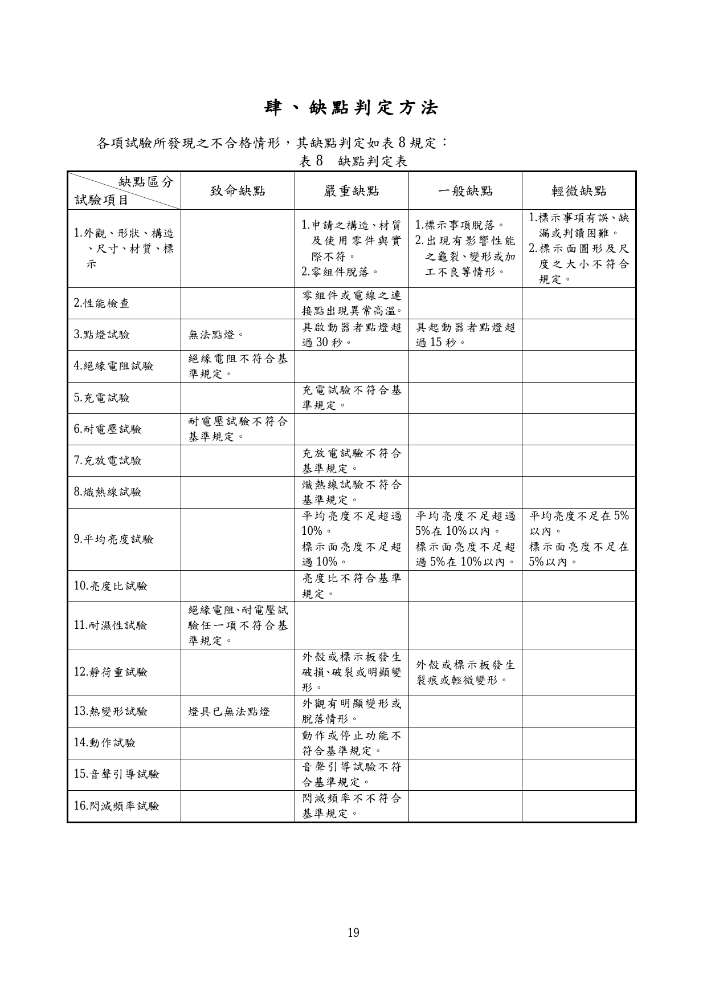

> 📷 截自原始 PDF 第 22 頁（內文頁 19）。重點門檻（常考者）摘錄：
>
> - **點燈試驗**：無法點燈＝致命缺點；具起動器者點燈超過 30 秒＝嚴重缺點；具起動器者點燈超過 15 秒＝一般缺點。
> - **平均亮度試驗**：平均亮度不足超過 10%＝嚴重缺點；不足超過 5% 在 10% 以內＝一般缺點；不足在 5% 以內＝輕微缺點。標示面亮度不足超過 10%＝嚴重缺點；不足超過 5% 在 10% 以內＝一般缺點；不足在 5% 以內＝輕微缺點。
> - **絕緣電阻／耐電壓／充電／充放電／熾熱線／亮度比**：不符合基準規定＝嚴重缺點（絕緣電阻、耐電壓、耐濕任一不符為致命缺點欄列）。
> - **熱變形試驗**：燈具已無法點燈＝致命缺點；外觀有明顯變形或脫落＝嚴重缺點。
> - **靜荷重試驗**：外殼或標示板破損、破裂或明顯變形＝嚴重缺點；發生裂痕或輕微變形＝一般缺點。
> - **外觀、形狀、構造、尺寸、材質、標示**：申請之構造材質及使用零件與實際不符／零組件脫落＝嚴重缺點；出現影響性能之龜裂變形或加工不良＝一般缺點；標示事項脫落＝一般缺點；標示事項有誤、缺漏或判讀困難、標示面圖形及尺度大小不符規定＝輕微缺點。

---

## 伍、主要試驗設備

各項試驗設備依表 9 規定。

#### 表 9　主要試驗設備一覽表

| 試驗設備名稱 | 內容 | 規格 | 數量 |
|---|---|---|---|
| 尺寸測定器 | 鋼尺 | 300 mm、1 m | 1 |
| 尺寸測定器 | 游標卡尺 | 200 mm，精密度 1/50 mm，1 級品 | 1 |
| 尺寸測定器 | 外分厘卡 | 25 mm，精密度 1 mm | 1 |
| 尺寸測定器 | 捲尺 | 10 m、50 m | 各 1 |
| 直流電源裝置 | 直流定電壓裝置 | 5A 以上 30V 者 | 1 |
| 直流電源裝置 | 直流定電壓裝置 | 2A 以上 150V 者 | 1 |
| 直流電源裝置 | 直流電壓計 | 0.5 級以上 | 1 |
| 直流電源裝置 | 直流電壓記錄計 | － | 1 |
| 直流電源裝置 | 直流電流計 | 0.5 級以上 | 1 |
| 交流電源裝置 | 交流定電壓裝置 | 1 KVA 以上 | 1 |
| 交流電源裝置 | 電壓調整器 | 5A 以上 110V 用 | 1 |
| 交流電源裝置 | 電壓調整器 | 2A 以上 220V 用 | 1 |
| 交流電源裝置 | 交流電流計 | 0.5 級以上 | 2 |
| 交流電源裝置 | 交流電力計 | 0.5 級以上 | 1 |
| 交流電源裝置 | 交流電流計 | 0.5 級以上 | 1 |
| 交流電源裝置 | 頻率計 | 0.5 級以上 | 1 |
| 測光裝置 | 暗室或同該環境 | 環境溫度 25±2℃，照度 0.05 lx 以下 | 1 |
| 測光裝置 | 配光測定裝置 | 角度誤差 2° 以下（水平、垂直），受光器顏色補正，指示計器為直線性 1% 以下的器具 | 1 |
| 測光裝置 | 照度計 | 可低照度測定（解析度應在 0.01 lx）；CNS 5119〔照度計〕規定中 AA 級 | 1 |
| 測光裝置 | 輝度計 | 可進行顏色判斷，具有可測定直徑 10 mm 視覺之器具 | 1 |
| 測光裝置 | 光源及器具支撐裝置 | 可確實固定，可忽視反射影響的器具 | 1 |
| 比色用具 | － | 綠色的限度樣品（x、y 值明確的樣品） | － |
| 耐電壓試驗裝置 | 絕緣耐壓試驗機 | 變壓容量 0.5 KVA，0～2000V | 1 |
| 絕緣電阻試驗裝置 | 高阻計 | 500V 用 | 1 |
| 耐濕試驗裝置 | 恆溫恆濕槽 | 適當容量大小、溫度計、濕度計 | 1 |
| 熾熱線試驗裝置 | 熾熱線試驗機 | 能進行熾熱線試驗之儀器 | 1 |
| 靜荷重試驗裝置 | 壓縮荷重試驗機 | 能供給 1,000 kgf（9,800 N）壓縮荷重之器具 | 1 |
| 靜荷重試驗裝置 | 試驗品固定框 | － | 1 |
| 閃滅測定裝置 | 示波器 | 能測定並儲存閃光時間及波形之設備 | 1 |
| 閃滅測定裝置 | 色溫計（或同等裝置） | 能測定燈泡色溫之設備 | 1 |
| 閃滅測定裝置 | 閃光測試機 | 能測定閃光次數或頻率之設備 | 1 |
| 音聲引導試驗裝置 | 噪音計 | 符合 CNS 13583（積分均值聲度表）或相當標準之規定。Type 1 等級噪音計，準確度 ±1 dB | 1 |
| 音聲引導試驗裝置 | 無響室 | 符合 CNS 14657（聲學-測定噪音源音響功率的精密級方法-用於無響室和半無響室）或相當標準之規定 | 1 |
| 計時裝置 | 碼表 | 1 分計，附積算功能，精密度 1/10 至 1/100 sec | 1 |

---

## 附表

> 抽樣表（附表 2～6）及界限數（附表 7、8）已內嵌如下。**型式區分／變更範圍表（附表 1）以散文摘錄；產品明細表（附表 9）、型式（補正、變更）試驗紀錄表（附表 10）、個別試驗紀錄表（附表 11）屬空白表單，僅附文末原始 PDF 連結。**

### 附表 1　型式區分、型式變更及輕微變更之範圍

> 📋 原表為「區分／說明／項目」三欄對照表，項目欄為條列清單，茲以下列散文呈現（請見原始 PDF 第 22 頁）。

**型式區分**（型式認可之產品其主要性能、設備種類、動作原理不同，或經主管機關規定之必要區分者，須以單一型式認可做區分）：

1. 設備種類：出口標示燈、避難方向指示燈。
2. 光源種類：螢光燈管（如 FL）、冷陰極管（CCFL）、發光二極體（LED）等。
3. 電源種類：內置型、外置型。
4. 附加功能：減光、消燈、閃滅、音聲引導等。

**型式變更**（經型式認可之產品，其零組件部分變更，有影響性能之虞，須施予試驗確認者）：

1. 變更緊急電源種類、規格、容量。
2. 變更外殼材質。
3. 在同一光源種類下，變更燈源規格、數量、功率或電壓等。
4. 在同一光源種類下，變更電路結構、重要零組件（如變壓器、安定器者）。
5. 燈具級數（如 A、B、C 級等）。
6. 變更標示面數。
7. 增加顯示複合功能者。

**輕微變更**（經型式認可或型式變更認可之產品，其型式部分變更，不影響其性能，且免施予試驗確認，可藉由書面據以判定良否者）：

1. 不變更使用功率下之額定電壓、電流變更。
2. 安裝方式變更。
3. 型式變更規定外，其他同等級零組件之變更。
4. 不變更內部構造下之外殼形狀變更。

註：

1. 在型式申請時，得於同次申請系列認證，其系列認證應為品名相同、光源相同、電路設計相似、主要零組件相似、設計及動作原理相似者。
2. 同一系列可宣告使用多家廠牌零件，但型式申請時之系列認證於申請相關文件需詳細描述每型之零組件、電路等相關配件內容。
3. 在主型式申請時需進行全項試驗，系列認證中將以有差異或影響到主性能者之差異點分別測試，或以條件最差、較劣勢部分測試。

### 附表 2　普通試驗抽樣表

> Ac：合格判定個數；Re：不合格判定個數。↓：採用箭頭下方第一個抽樣方式（樣品數超過批內數量時採全試驗）；↑：採用箭頭上方第一個抽樣方式。空白處沿用箭頭指示之抽樣方式。

| 批次 | 一般 樣品數 | 一般 嚴重 Ac/Re | 一般 一般 Ac/Re | 一般 輕微 Ac/Re | 分項 樣品數 | 分項 嚴重 Ac/Re | 分項 一般 Ac/Re | 分項 輕微 Ac/Re |
|---|---|---|---|---|---|---|---|---|
| 1〜8 | 2 | | | | | | | |
| 9〜15 | 2 | | | | | | | |
| 16〜25 | 3 | | 0/1 | | | | | |
| 26〜50 | 5 | | | | | | | |
| 51〜90 | 5 | | | 1/2 | | | | |
| 91〜150 | 8 | | 2/3 | 3/4 | 3 | 0/1 | 0/1 | 1/2 |
| 151〜280 | 13 | 0/1 | 1/2 | 3/4 | | | | |
| 281〜500 | 20 | | 2/3 | 5/6 | 5 | 0/1 | 1/2 | 2/3 |
| 501〜1,200 | 32 | | 3/4 | 7/8 | | | | |
| 1,201〜3,200 | 50 | 1/2 | 5/6 | 10/11 | | | | |
| 3,201〜10,000 | 80 | 2/3 | 7/8 | 14/15 | 8 | 1/2 | 2/3 | 3/4 |
| 10,001〜35,000 | 125 | 3/4 | 10/11 | 21/22 | | | | |
| 35,001〜150,000 | 200 | 5/6 | 14/15 | | | | | |

### 附表 3　寬鬆試驗抽樣表

| 批次 | 一般 樣品數 | 一般 嚴重 Ac/Re | 一般 一般 Ac/Re | 一般 輕微 Ac/Re | 分項 樣品數 | 分項 嚴重 Ac/Re | 分項 一般 Ac/Re | 分項 輕微 Ac/Re |
|---|---|---|---|---|---|---|---|---|
| 1〜8 | 2 | | | | | | | |
| 9〜15 | 2 | | | | | | | |
| 16〜25 | 2 | | 0/2 | | | | | |
| 26〜50 | 2 | | | | | | | |
| 51〜90 | 2 | | | 1/2 | | | | |
| 91〜150 | 3 | | 1/3 | 2/? | 2 | 0/1 | 0/1 | 1/2 |
| 151〜280 | 5 | 0/1 | 1/2 | 2/4 | | | | |
| 281〜500 | 8 | | 1/3 | 2/5 | 3 | 0/1 | 1/2 | 2/3 |
| 501〜1,200 | 13 | | 2/4 | 3/6 | | | | |
| 1,201〜3,200 | 20 | 1/2 | 2/5 | 5/8 | | | | |
| 3,201〜10,000 | 32 | 1/3 | 3/6 | 7/10 | 5 | 1/2 | 2/3 | 3/4 |
| 10,001〜35,000 | 50 | 2/4 | 5/8 | 10/13 | | | | |
| 35,001〜150,000 | 80 | 2/5 | 7/10 | | | | | |

> 🛈 附表 3「91〜150」列一般試驗輕微缺點 Ac/Re 原檔僅見 Ac=2，Re 數值因版面截斷未能確認，請核對原始 PDF（第 24 頁）。

### 附表 4　嚴格試驗抽樣表

> 適用於一般檢查之補正試驗批次及在一般檢查時不合格而再受檢之批次。

| 批次 | 一般 樣品數 | 一般 嚴重 Ac/Re | 一般 一般 Ac/Re | 一般 輕微 Ac/Re | 分項 樣品數 | 分項 嚴重 Ac/Re | 分項 一般 Ac/Re | 分項 輕微 Ac/Re |
|---|---|---|---|---|---|---|---|---|
| 1〜8 | 2 | | | | | | | |
| 9〜15 | 2 | | | | | | | |
| 16〜25 | 3 | | | | | | | |
| 26〜50 | 5 | | | | | | | |
| 51〜90 | 5 | | 0/1 | | | | | |
| 91〜150 | 8 | | | 1/2 | 5 | 0/1 | 0/1 | 1/2 |
| 151〜280 | 13 | | | 2/3 | | | | |
| 281〜500 | 20 | 0/1 | 1/2 | 3/4 | 8 | 0/1 | 1/2 | 2/3 |
| 501〜1,200 | 32 | | 2/3 | 5/6 | | | | |
| 1,201〜3,200 | 50 | | 3/4 | 8/9 | | | | |
| 3,201〜10,000 | 80 | 1/2 | 5/6 | 12/13 | 13 | 1/2 | 2/3 | 3/4 |
| 10,001〜35,000 | 125 | 2/3 | 8/9 | 18/19 | | | | |
| 35,001〜150,000 | 200 | 3/4 | 12/13 | | | | | |

### 附表 5　最嚴格試驗抽樣表

> 適用於嚴格檢查之補正試驗批次及在嚴格檢查時不合格而再受檢之批次。

| 批次 | 一般 樣品數 | 一般 嚴重 Ac/Re | 一般 一般 Ac/Re | 一般 輕微 Ac/Re | 分項 樣品數 | 分項 嚴重 Ac/Re | 分項 一般 Ac/Re | 分項 輕微 Ac/Re |
|---|---|---|---|---|---|---|---|---|
| 1〜8 | 2 | | | | | | | |
| 9〜15 | 2 | | | | | | | |
| 16〜25 | 3 | | 0/1 | | | | | |
| 26〜50 | 5 | | | | | | | |
| 51〜90 | 5 | | | | | | | |
| 91〜150 | 8 | 0/1 | | 1/2 | 8 | 0/1 | 0/1 | 1/2 |
| 151〜280 | 13 | | 1/2 | | | | | |
| 281〜500 | 20 | | 2/3 | | 13 | 0/1 | 1/2 | 2/3 |
| 501〜1,200 | 32 | 0/1 | 1/2 | 3/4 | | | | |
| 1,201〜3,200 | 50 | | 2/3 | 5/6 | | | | |
| 3,201〜10,000 | 80 | | 3/4 | 8/9 | 20 | 1/2 | 2/3 | 3/4 |
| 10,001〜35,000 | 125 | 1/2 | 5/6 | 12/13 | | | | |
| 35,001〜150,000 | 200 | 2/3 | 8/9 | | | | | |

### 附表 6　適用生產數量少之普通試驗抽樣表

| 批次 | 一般 樣品數 | 一般 嚴重 Ac/Re | 一般 一般 Ac/Re | 一般 輕微 Ac/Re | 分項 樣品數 | 分項 嚴重 Ac/Re | 分項 一般 Ac/Re | 分項 輕微 Ac/Re |
|---|---|---|---|---|---|---|---|---|
| 1〜3 | 3 | | 0/1 | | 3 | | 0/1 | 1/2 |
| 4〜5 | 3 | | | | 5 | 0/1 | 1/2 | 2/3 |
| 6〜13 | 3 | 0/1 | | | | | | |
| 14〜50 | 5 | | | | | | | |
| 51〜90 | 5 | | | 1/2 | | | | |
| 91〜150 | 8 | | | 2/3 | | | | |
| 151〜280 | 13 | | 1/2 | 3/4 | | | | |
| 281〜500 | 20 | | 2/3 | 5/6 | | | | |
| 501〜1,200 | 32 | | 3/4 | 7/8 | | | | |
| 1,201〜3,200 | 50 | 1/2 | 5/6 | 10/11 | | | | |
| 3,201〜10,000 | 80 | 2/3 | 7/8 | 14/15 | 8 | 1/2 | 2/3 | 3/4 |
| 10,001〜35,000 | 125 | 3/4 | 10/11 | 21/22 | | | | |
| 35,001〜150,000 | 200 | 5/6 | 14/15 | | | | | |

### 附表 7　嚴格試驗之界限數

| 累計樣品數 | 嚴重缺點 | 一般缺點 | 輕微缺點 |
|---|---|---|---|
| 1 | 2 | 2 | 2 |
| 2 | 2 | 2 | 3 |
| 3 | 2 | 3 | 3 |
| 4 | 2 | 3 | 4 |
| 5 | 2 | 3 | 4 |
| 6〜7 | 2 | 3 | 4 |
| 8〜9 | 2 | 3 | 5 |
| 10〜12 | 2 | 4 | 5 |
| 13〜14 | 3 | 4 | 6 |
| 15〜19 | 3 | 4 | 7 |
| 20〜24 | 3 | 5 | 7 |
| 25〜29 | 3 | 5 | 8 |
| 30〜39 | 3 | 6 | 10 |
| 40〜49 | 4 | 7 | 11 |
| 50〜64 | 4 | 7 | 13 |
| 65〜79 | 4 | 8 | 15 |
| 80〜99 | 5 | 10 | 17 |
| 100〜129 | 5 | 11 | 20 |
| 130〜159 | 6 | 13 | 24 |
| 160〜199 | 7 | 15 | 28 |
| 200〜249 | 7 | 17 | 33 |
| 250〜319 | 8 | 20 | 40 |
| 320〜399 | 10 | 24 | 48 |
| 400〜499 | 11 | 28 | 60 |
| 500〜624 | 13 | 33 | 76 |
| 625〜799 | 15 | 40 | 95 |

### 附表 8　寬鬆試驗之界限數

> ＊表示樣品累計數未達轉換成寬鬆試驗之充分條件。本表適用於最近連續十批次接受普通試驗，第一次試驗時均合格者之樣品數累計。

| 累計樣品數 | 嚴重缺點 | 一般缺點 | 輕微缺點 |
|---|---|---|---|
| 10〜64 | ＊ | ＊ | ＊ |
| 65〜79 | ＊ | ＊ | 0 |
| 80〜99 | ＊ | ＊ | 1 |
| 100〜129 | ＊ | ＊ | 2 |
| 130〜159 | ＊ | ＊ | 4 |
| 160〜199 | ＊ | 0 | 6 |
| 200〜249 | ＊ | 1 | 9 |
| 250〜319 | ＊ | 2 | 12 |
| 320〜399 | ＊ | 4 | 15 |
| 400〜499 | ＊ | 6 | 19 |
| 500〜624 | ＊ | 9 | 25 |
| 625〜799 | 0 | 12 | 31 |
| 800〜999 | 1 | 15 | 39 |
| 1000〜1,249 | 2 | 19 | 50 |
| 1250〜1,574 | 4 | 25 | 63 |

---

## 附錄

> 附錄一（標示板尺度規定）之附圖（圖 1～9）已以原始 PDF 截圖嵌入原文位置；尺度表（以縱高 H 之分數表示）已內嵌。附錄二～四之散文與簡單數值表已內嵌、附圖亦以截圖嵌入；附錄五之基本回路圖原始 PDF 未收錄（詳該節說明）。

### 附錄一　標示板尺度規定

#### 一、適用範圍

本附錄用於引導燈具標示板之有效標示面。

#### 二、一般性條件

標示板之有效標示面及其鄰接部分，應與有效標示面部分之顏色幾乎相同，亮度在同一程度以下。

#### 三、形狀及尺度

##### （一）出口標示燈之標示面形狀，依附錄一─圖 1、附錄一─圖 2 規定，尺度則依附錄一─表 1 規定

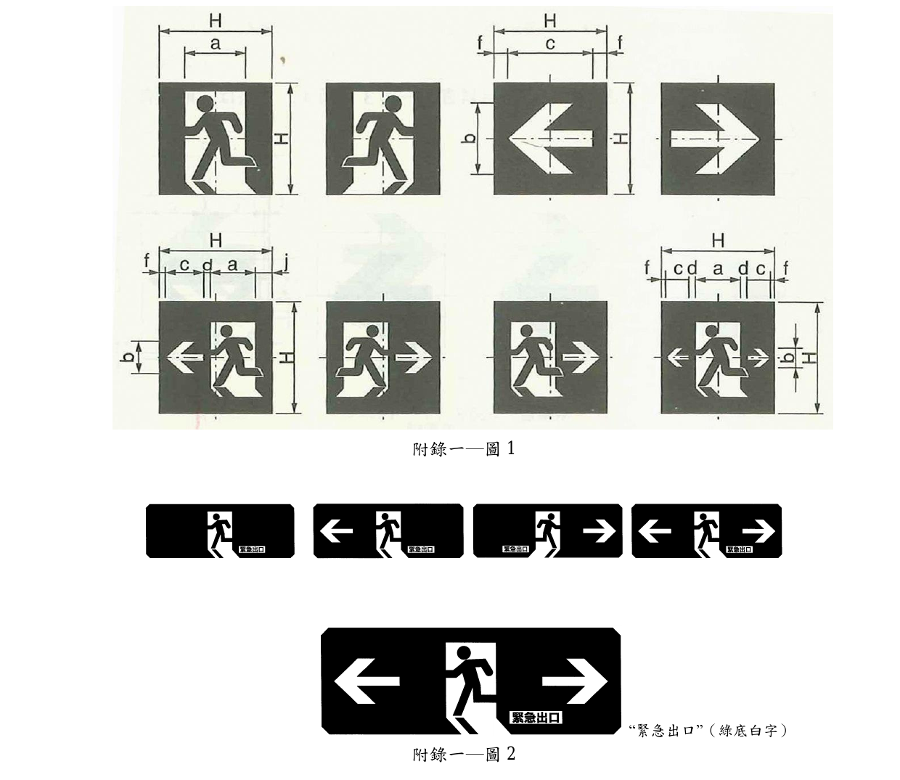

> 📷 截自原始 PDF 第 36 頁（內文頁 33）。

#### 附錄一─表 1（單位：mm；H 表示標示面之縱高尺度）

| 種類（長短邊比 1：1） | a | b | c | d | e | f | j | k |
|---|---|---|---|---|---|---|---|---|
| 無箭頭 | 13/24 H | － | － | － | － | － | － | － |
| 只有箭頭 | － | 13/20 H | 4/5 | － | － | 1/10 H | － | － |
| 單箭頭 | 2/5 H | 8/25 H | 7/20 H | 1/20 H | － | 1/20 H | 3/20 H | － |
| 雙箭頭 | 2/5 H | 1/5 H | 11/50 H | 1/20 H | － | 3/100 H | － | － |

> 備考：H 表示標示面之縱高尺度。本表中例如標示為 65/120 H，是（65/120）H 之意。

##### （二）避難方向指示燈標示面之形狀如附錄一─圖 3、附錄一─圖 4 規定，尺度則依附錄一─表 2 規定

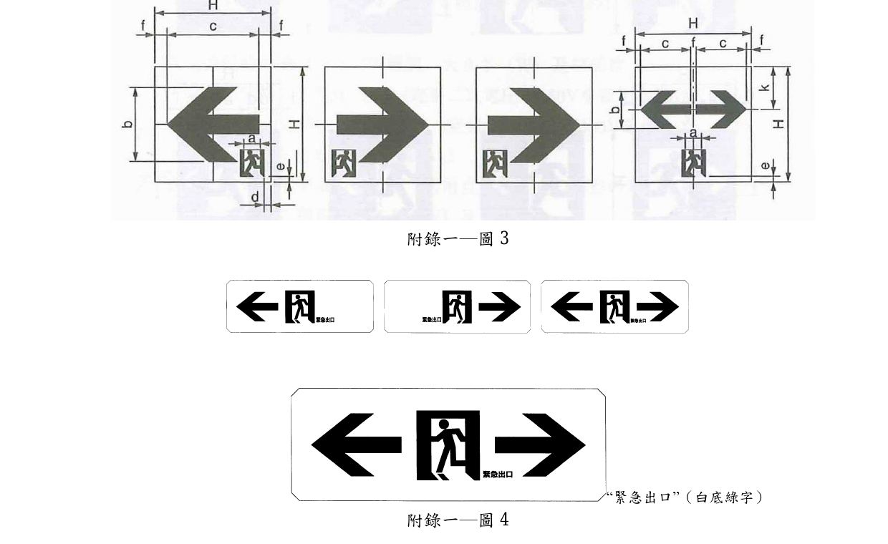

> 📷 截自原始 PDF 第 37 頁（內文頁 34）。

#### 附錄一─表 2（單位：mm）

| 種類（長短邊比 1：1） | a | b | c | d | e | f | j | k |
|---|---|---|---|---|---|---|---|---|
| 單箭頭 | 1/8 H | 13/20 H | 4/5 H | 1/20 H | 1/20 H | 1/10 H | － | － |
| 雙箭頭 | 1/8 H | 8/25 H | 17/40 H | － | 7/100 H | 1/20 H | － | 37/100 H |

> 備考：1. H 表示標示面之縱高尺度。2. 除了 1：1 之型式外，顯示避難出口之圖形及文字的下端應在同一線上。3. 1：1 之 C 級，依圖 5 規定。

##### （三）C 級避難方向指示燈標示面之形狀，如附錄一─圖 5 規定，尺度如附錄一─表 3 規定

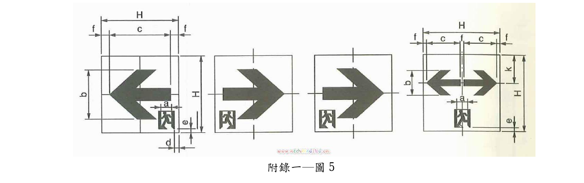

> 📷 截自原始 PDF 第 38 頁（內文頁 35）。

#### 附錄一─表 3（單位：mm）

| 種類（長短邊比 1：1） | a | b | c | d | e | f | k |
|---|---|---|---|---|---|---|---|
| 單箭頭 | 1/8 H | 13/20 H | 4/5 H | 1/20 H | 1/20 H | 1/10 H | － |
| 雙箭頭 | 1/8 H | 8/25 H | 41/100 H | － | 7/100 H | 3/50 H（8 mm） | 37/100 H |

> 備考：H 表示標示面之縱高尺度。

##### （四）引導燈具之人型圖形與箭頭圖形

其形狀、尺度，依附錄一─圖 6、附錄一─圖 7 之規定。

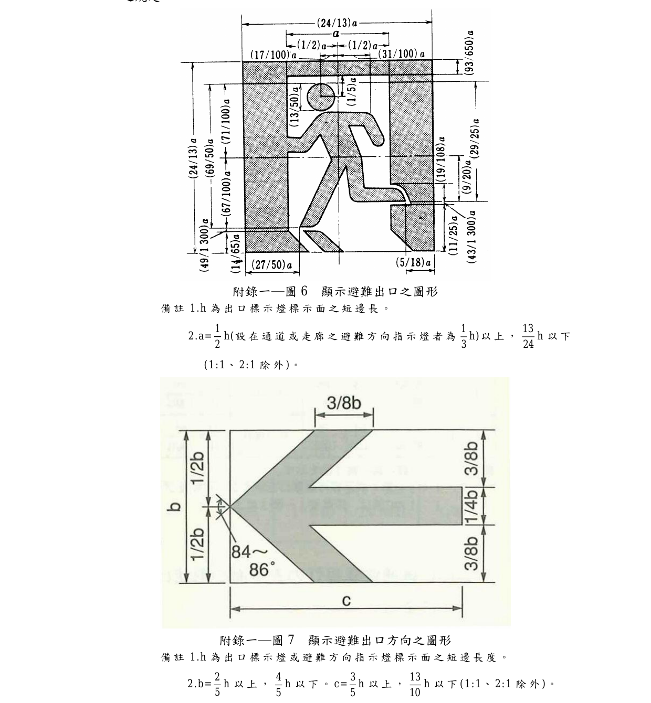

> 📷 截自原始 PDF 第 39 頁（內文頁 36）。

- 圖 6（顯示避難出口之圖形）備註：h 為出口標示燈標示面之短邊長。

$$a = \frac{1}{2}h \;\text{以上}\left(\text{設在通道或走廊之避難方向指示燈者為} \tfrac{1}{3}h\right),\quad \frac{13}{24}h \;\text{以下}\;(1{:}1 、 2{:}1 \text{除外})$$

- 圖 7（顯示避難出口方向之圖形）備註：h 為出口標示燈或避難方向指示燈標示面之短邊長度。

$$b = \frac{2}{5}h \;\text{以上},\; \frac{4}{5}h \;\text{以下};\quad c = \frac{3}{5}h \;\text{以上},\; \frac{13}{10}h \;\text{以下}\;(1{:}1 、 2{:}1 \text{除外})$$

##### （五）地面嵌入型避難出口標示燈

標示面為 3：1 時，依附錄一─圖 4 規定；為 2：1 時，依附錄一─圖 9 規定，尺度依附錄一─表 4 規定。

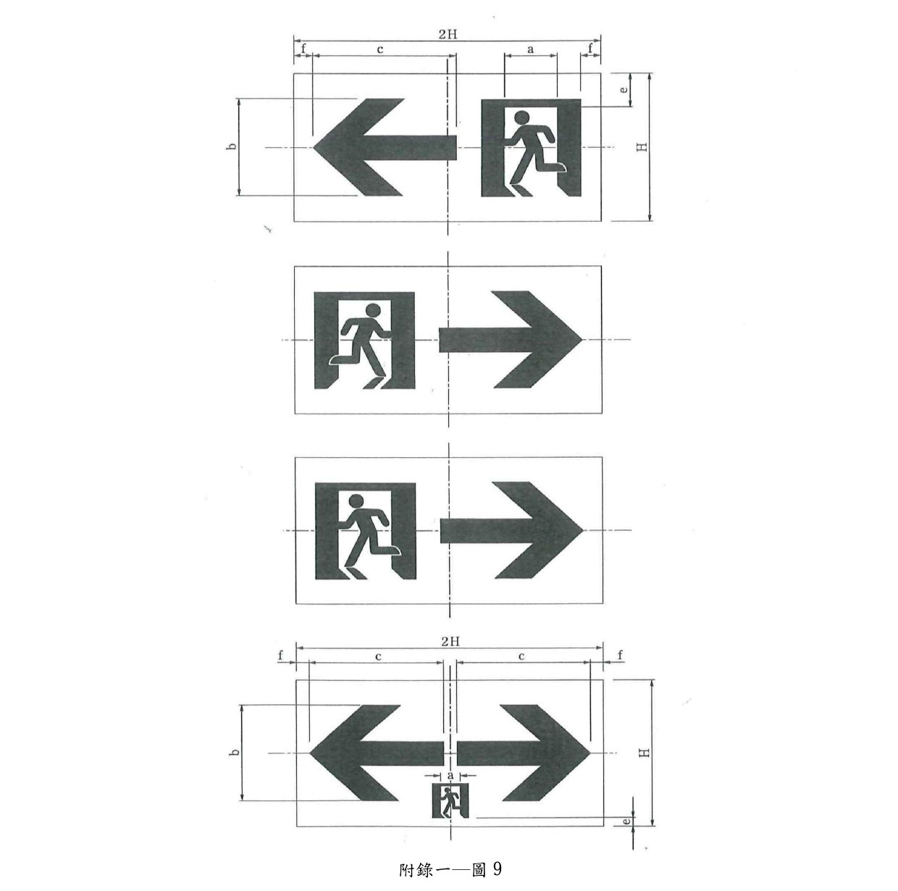

> 📷 截自原始 PDF 第 40 頁（內文頁 37）。

#### 附錄一─表 4　地板嵌入型避難出口標示燈（長短邊之比為 2：1 時）（單位：mm）

| 種類（長短邊比 2：1） | a | b | c | d | e | f |
|---|---|---|---|---|---|---|
| 單箭頭 | $\dfrac{65}{120}\times\dfrac{23}{16}\dfrac{65 H}{100 H}$（見原檔） | 65/100 H | $\dfrac{65}{100 H}$（見原檔） | － | 9/40 H | 1/8 H |
| 雙箭頭 | 1/8 H | 65/100 H | 9/10 H | － | 7/100 H | 3/50 H（8 mm） |

> 🛈 附錄一─表 4 之單箭頭 a、c 欄原 PDF（第 38 頁）為複合分數（含 65/120×23/16、65 H/100 H 等跨格排版），版面錯位無法確定其完整運算式，**請核對原始 PDF 確認**。

### 附錄二　具閃滅功能與音聲引導功能之引導燈具規定

#### 一、適用範圍

本附錄用於引導燈具具閃滅功能裝置或音聲引導功能裝置之規定。

#### 二、種類

種類如附錄 2－表 1。

#### 附錄 2－表 1

| 器具及裝置 | 依形狀分類 |
|---|---|
| 具閃滅功能之引導燈具 | 獨立型 |
| 具音聲引導功能之引導燈具 | 組合型 |
| 具閃滅兼音聲引導功能之引導燈具 | 內照型 |
| 閃滅裝置 | 獨立型 |
| 音聲引導裝置 | 組合型 |

#### 三、具閃滅功能之引導燈具之構造及性能規定

##### （一）閃滅裝置緊急時之閃滅動作，依附錄 2－表 2 之規定

#### 附錄 2－表 2

| 種類（器具） | 燈泡 | 緊急時之閃滅動作 |
|---|---|---|
| 獨立型 | 氙氣燈泡 | 閃滅亮燈 |
| 組合型 | 白熾燈泡 | 閃滅亮燈 |
| 內照型 | 平常亮燈燈泡 | 變暗至變亮時之 30﹪ 以下 |

##### （二）閃滅裝置之構造

1. 獨立型及組合型之閃滅裝置，使用氙氣燈及白熾燈泡作為閃滅光源者應可以直接目視閃滅光源發光部。
2. 以氙氣燈及白熾燈泡作為閃滅光源者，閃滅光源應以透光性外蓋覆蓋。
3. 閃滅光源應可以更換。

##### （三）閃滅用燈泡，依附錄 2－表 3 之規定

#### 附錄 2－表 3

| 閃滅光源之種類 | 額定消耗電力（W） | 額定壽命（Hr） |
|---|---|---|
| 氙氣燈泡 | 10 以上 | 100 以上 |
| 白熾燈泡 | 10 以上 | 100 以上 |

##### （四）性能及動作試驗

1. 信號動作：
   - （1）接到來自信號裝置之動作信號，於 3 秒鐘內自動閃滅動作開始。如接到信號裝置或偵煙式探測器等外部信號時，於 3 秒鐘內停止動作。
   - （2）僅將常用電源遮斷而非動作信號時，閃滅動作不會開始。但將信號裝置之常用電源遮斷時，則不在此限。
   - （3）試驗方法，係按以下之步驟實施：
     - a. 於閃滅裝置上施加額定頻率之額定電壓。
     - b. 由開或關設在信號裝置之移報裝置側的開關來發送信號。
     - c. 由外部發送停止信號。
     - d. 將閃滅裝置之常用電源遮斷。
2. 閃滅頻率及時間比試驗：依附錄 2－表 4 規定。

#### 附錄 2－表 4

| 燈泡 | 閃滅頻率（Hz）額定電壓 | 閃滅頻率（Hz）放電標準電壓 | 時間比 |
|---|---|---|---|
| 氙氣燈泡 | － | － | － |
| 白熾燈泡或日光燈 | 2.0±0.1 | 2.0±1.0 | 1：1 |

> 備考：以平常用之燈泡使之閃滅時，依本表之規定。

   - （1）在閃滅裝置之輸入端子間施加額定電壓，然後使其接受信號裝置之動作信號開始閃滅，統計其 1 分鐘之間的閃滅次數及時間比。
   - （2）在閃滅裝置之輸入端子間施加放電標準電壓，然後使其接受信號裝置之動作信號開始閃滅，統計閃滅 1 分鐘之間的閃滅次數及時間比。
3. 動作時間是在接到信號時，其緊急電源容量應能有效閃滅動作 90 分鐘以上。
4. 光源特性：
   - （1）以氙氣燈及白熾燈泡作為閃滅光源之閃滅裝置，其光源特性應依附錄 2－表 5 規定。

#### 附錄 2－表 5

| 燈泡 | 光源特性 |
|---|---|
| 氙氣燈泡 | 輸入之能量每一發光體 2.4 J（Ws）以上 |
| 白熾燈泡 | 光束 130 lm 以上及色溫在 2800 K 以上 |

   - （2）內照型閃滅功能之出口標示燈作閃滅閃動時，其亮與暗之比應在附錄 2－表 2 之範圍內。
   - （3）測定方法：
     - a. 若閃滅光源為氙氣燈，於閃滅裝置之輸入端子間施加放電標準電壓，測定燈泡輸入端子（接點）之輸入能量。但如果燈泡之輸入能量可以相關方式求得時，得採其他之測定方法。
     - b. 內照型閃滅功能之出口標示燈亮與暗之測定，其試驗方式係停止閃滅回路，以照度計分別加以測定求得比值。

#### 四、具音聲引導功能之引導燈具之構造及性能規定

##### （一）音聲引導之構造規定

1. 音聲引導音由警報聲及語音 2 個部分所構成，依附錄 2－圖 1 之規定。

   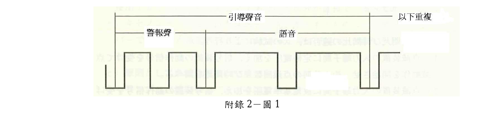

   > 📷 截自原始 PDF 第 44 頁（內文頁 41）。

2. 警報聲之構成，依附錄 2－圖 2 之規定（圖示如下，截自原始 PDF 第 44 頁）：

   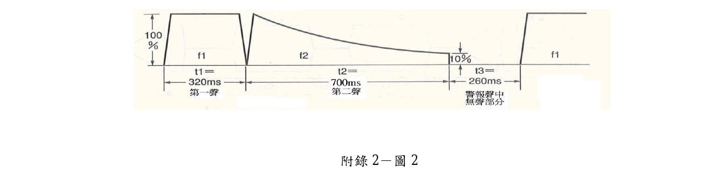
   - （1）警報聲，係以基本頻率不同之 2 個週期性複合波連接合成聲（Ping、Pong）反覆 2 次而成。
   - （2）基本頻率依如下之規定：
     - 第 1 音：$f_1 = 1{,}056\,\text{Hz} \pm 3\%$（C 音）
     - 第 2 音：$f_2 = 880\,\text{Hz} \pm 3\%$（A 音）
     - 但 $f_1$ 與 $f_2$ 之音程（$f_1/f_2$），為 $6/5 \pm 10\%$
   - （3）音之起及伏時間：15±10 ms
   - （4）聲音之長度，依如下之規定：
     - 第 1 音：$t_1 = 320\,\text{ms} \pm 10\%$
     - 第 2 音：$t_2 = 700\,\text{ms} \pm 10\%$；$t_3 = 260\,\text{ms} \pm 10\%$
   - （5）第 2 音的衰減曲線，是指數函數之衰減曲線。
   - （6）第 2 音的終端音壓相對於第 2 音的峰值，為 10±3﹪。
3. 語音之內容為：「緊急出口在這裡！」必要時用英語「here is an emergency exit！」與國語交互廣播。語音之格式如下：
   - （1）語音為女性聲音，聲音清楚明瞭，語氣堅定。
   - （2）語音之長度為 1700 ms±10﹪。
   - （3）總時間之分配，如附錄 2－圖 3，繼續重複進行。

   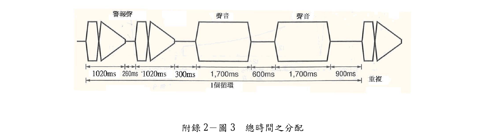

   > 📷 截自原始 PDF 第 45 頁（內文頁 42）。
4. 音聲引導之組成：
   - （1）採電子回路形成之語音合成。
   - （2）合成聲音之品質，應可以在發生災害時的心理狀態下避難人員可以清楚判斷傳達內容之程度。
   - （3）再生頻率範圍最好在 200 Hz 至 6.3 kHz。但應在 200 Hz~3.15 kHz 間。
5. 試驗方法：
   - （1）在溫度 25±5℃、相對濕度 65±20% 環境之無響室內進行音壓測試。
   - （2）音聲引導之音壓試驗，以放電標準電壓進行。

> 📷 再生頻率上限已依使用者核對確認為 **3.15 kHz**（原 PDF 之「3.15Hz」係單位筆誤）。

##### （二）音聲引導裝置之動作試驗

1. 音聲引導裝置，於收到火災信號後動作，且於接到避難通道發生重大妨礙之信號時停止，依附錄 2－表 6 之規定，在 3 秒內動作。

#### 附錄 2－表 6

| 條件 | 接到火災信號時 | 接到停止信號時 |
|---|---|---|
| 音聲引導裝置 | 動作開始後繼續 90 分鐘 | 停止動作 |

2. 音聲引導裝置，經由引導燈具用信號裝置之動作信號用端子接受火災信號。
3. 音聲引導裝置，收到信號裝置或偵煙式火警探測器等來自外部之停止信號時，停止動作。
4. 信號動作之試驗，依如下之步驟：
   - （1）與引導燈具用信號裝置、音聲引導裝置（或內設音聲引導裝置之引導燈具）及停止信號用開關連接，施加額定頻率之額定電壓。
   - （2）將音聲引導裝置之常用電源遮斷，確認其不會動作。
   - （3）以設於引導燈具用信號裝置移報裝置側之開關發送火災信號，確認其在 3 秒鐘內會動作。
   - （4）由信號裝置及偵煙式火警探測器發送音聲引導之停止信號，確認其在 3 秒鐘內會停止動作。

##### （三）音聲引導之音壓試驗

音聲引導之音壓，係在距離語音誘導裝置（獨立型）或引導燈具（組合型）之表面水平方向 1 公尺處，以規定之噪音計（採頻率修正回路之 A 權值）或同等以上性能之儀器加以測定。其警報聲及語音之最高值應在 90 dB 以上。且可調整音壓型式之警報聲及語音最低調整值不低於 70 dB。

##### （四）音聲引導裝置之構造（材料及零配件）

1. 具有由器具內部即可以使用語音之構造。
2. 應具有由外部即可以作音壓調整之構造。
3. 供裝置使用之揚聲器，應可以提供 200～5000 Hz（±10 dBA）之頻寬。

#### 五、標示

（一）閃滅型引導燈具之標示除依本文之規定外，應另外加註下列事項：

1. 獨立型閃滅裝置、組合型閃滅裝置或內照型閃滅裝置。
2. 閃滅用光源種類、規格、消耗功率等。

（二）音聲引導之引導燈具應標明獨立型或組合型。

（三）閃滅兼音聲引導之引導燈具應符合前項（一）、（二）規定。

### 附錄三　減光型及消燈型引導燈具規定

#### 一、適用範圍

本附錄用於引導燈具為減光型或消燈型之規定。引導燈器具的一般性要求依據本文規定。

#### 二、減光點燈

以常用點燈光束之 20% 以上的光束點燈。

#### 三、消燈狀態

平時以不點燈狀態使用之引導燈具。

#### 四、信號動作

藉由動作信號，使減光點燈或消燈狀態自動切換成正常點燈。

#### 五

信號用電線及信號電路斷路或短路時，須復歸為正常點燈狀態。

#### 六、標示

除依據本文的規定外，須加註下列事項：

（一）減光型或消燈型引導燈具。

（二）減光點燈時之輸入電流及輸入功率。

### 附錄四　複合顯示之引導燈具規定

#### 一、適用範圍

本附錄用於出口標示燈及避難方向指示燈附加其他非規定圖型或文字之標誌板（以下稱標誌板）之複合顯示型引導燈具（以下稱器具）。

#### 二、構造

除依本文之規定外，應依下列之規定：

（一）器具應為一體構造，整體應符合本文規定。

（二）引導燈具標示板與標誌板應明確加以區分。

（三）引導燈具標示板部分之內部與標誌板部分內部以不透明之材料加以分隔。

（四）不得由引導燈具標示板與標誌板交界部分顯著洩漏出器具內燈泡之光線。

（五）標誌板之短邊長度不得比引導燈具標示板短邊長度長，器具之相鄰部分短邊長度應相同。

（六）非供引導燈具標示板專用之燈泡，不得作為緊急亮燈之用。

#### 三、引導燈具標示板及標誌板

（一）標誌板之標示，應以增加避難引導效果為原則。

（二）不得因其他類似標示而妨礙引導燈具標示板之醒目性、或容易造成混淆情形。

（三）標誌板之底色，應屬於附錄 4－圖 1 所規定之綠色及紅色以外之顏色。

（四）色度（色調）原則上係以輝度計等適當之測定儀器測定其透光性。但也可以用標準色表等色度 X、Y 明確之色標作顏色比對加以判定。

#### 四

標誌板之動作部分，建議可以由火災信號使其熄燈。

#### 五

標誌板部分之平均亮度，不得超過引導燈具標示板之平均亮度。

#### 六、標示

依本文之規定。但平常亮燈時使用之光源種類、規格（W）及個數，其引導燈標示板部分與標誌板部分應作分別標示。

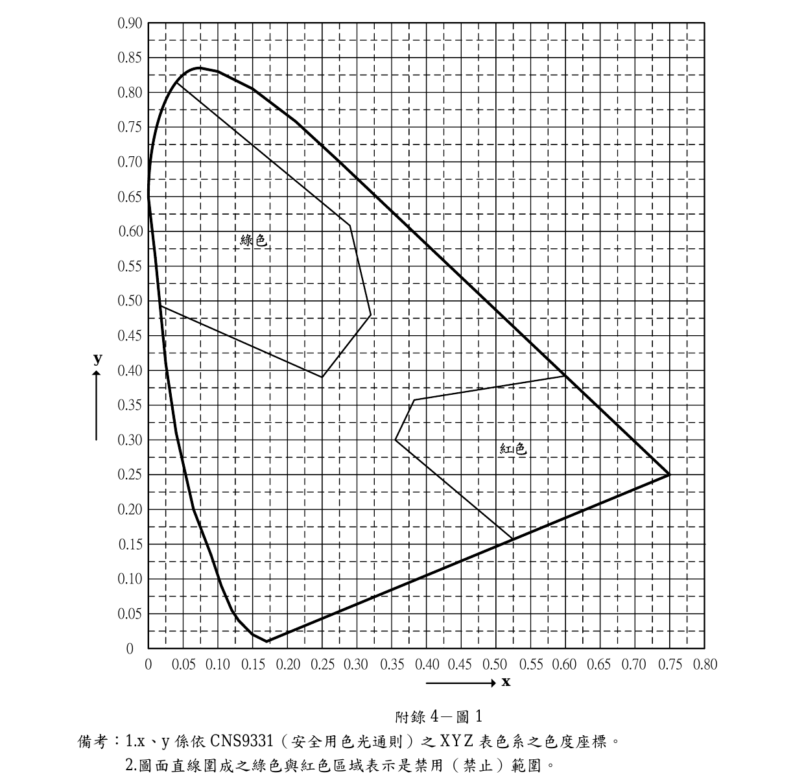

> 📷 截自原始 PDF 第 49 頁（內文頁 46）。x、y 係依 CNS 9331〔安全用色光通則〕之 XYZ 表色系色度座標；圖面直線圍成之綠色與紅色區域表示禁用範圍。

### 附錄五　引導燈具用信號裝置

#### 一、適用範圍

本附錄在規定傳達動作信號之信號回路及與火警自動警報設備等連接之回路相接而設之信號裝置之構造、性能及標示。

#### 二、用語定義

除依本文有關用語之定義外，依如下之規定：

（一）閃滅（音聲引導）信號回路：係指閃滅型引導燈具或閃滅裝置、音聲引導之引導燈具或音聲引導裝置，當給予動作信號時，可以使其閃滅亮燈或發出音聲引導聲音之回路。

（二）消燈（減光）信號回路：於將消燈（減光）動作信號送到消燈器具時可使器具亮燈之回路。

（三）單回路用信號裝置：具有可以使防火對象（建築物）之引導燈具可以同時作動之信號回路的信號裝置。

（四）多回路用信號裝置：具有使防火對象（建築物）之引導燈具可以依據火災樓層之分類而作動之信號回路的信號裝置。

#### 三、種類

信號裝置之種類，依附錄 5－表 1 區分。

#### 附錄 5－表 1

| 連動方法 | 形狀 | 信號回路 | 緊急電源 |
|---|---|---|---|
| 自動火災報警設備 | 獨立型 | 單回路 | 有 |
| 其他類似裝備 | 組合型 | 多回路 | 無 |

#### 四、構造

##### （一）機械性構造

1. 以具有充分機械性強度之不燃材料構成，足夠堅固。

##### （二）電氣性構造

1. 應設置可將電源電壓降至 60V 以下之絕緣變壓器。
2. 應可在平常以 60V 以下之電壓、0.5A 以下之電流對火警自動警報設備之火警受信總機或其他相關裝置通電。
3. 平常可以對閃滅（或音聲引導）信號回路及消燈（減光）信號回路施加 110V 或 60V 以下之電壓。
4. 無電壓狀態視為火災信號。
5. 所設之檢查、閃滅亮燈用開關以及消燈及亮燈開關應可以由外部加以操作。
6. 應設有當閃滅（或音聲引導）信號回路、消燈（減光）信號回路及光電式偵煙探測器發生電源回路之線間短路時，可以對裝置加以保護之裝置。如果在保護裝置中使用保險絲，應有容易更換之構造。
7. 閃滅（或音聲引導）信號回路、消燈（減光）信號回路及光電式偵煙探測器如發生電源回路之線間短路時，應能使連接於該處以後之回路上之引導燈具，及時恢復為平常亮燈。
8. 若係具有停電補償功能之型式，該內設之蓄電池應於常用電源遮斷後，可以保持 20 分鐘以上信號電壓之容量。

##### （三）開關及連接端子之標示

1. 在開關之附近標示如附錄 5－表 2 所列之事項。

#### 附錄 5－表 2

| 開關之種類 | 標示事項 |
|---|---|
| 檢查 | 檢查、切換開關 |
| 音聲引導及閃滅檢查 | 檢查開關 |
| 一齊亮燈 | 一齊開關 |
| 手動消燈（減燈） | 手動開關 |
| 原狀態之重新設定 | 復歸開關 |

2. 在連接端子之附近標示如附錄 5－表 3 所列之事項。

#### 附錄 5－表 3

| 連接之配線 | 標示事項 |
|---|---|
| 電源配線（電源線） | 電源 |
| 至音聲引導裝置及閃滅裝置用信號回路配線 | 聲音、閃滅信號或動作信號 |
| 至火警自動警報設備用配線 | 移報 |
| 至器具之消燈（減燈）控制回路用配線 | 手動輸出 |
| 至光電探測器控制回路用配線 | PC 輸出 |
| 至光電探測器用配線 | PC 開關 |
| 至照明用配線 | 照明 |

3. 動作之標示燈，依附錄 5－表 4 之規定。

#### 附錄 5－表 4

| 應設動作標示燈之情形 | 建議設動作標示燈之情形（如閃滅亮燈、音聲引導） |
|---|---|
| 正常顯示：紅色燈 | 正常時之標示：紅色燈 |
| 一齊亮燈標示：綠色燈（以便作良好之判斷） | 閃滅亮燈、發送音聲引導之標示：綠色燈 |
| 消燈（減燈）標示：紅色燈（作為全部熄燈時之標示） | － |

##### （四）基本回路

信號裝置之基本電氣回路例，如附錄 5－圖 1 或附錄 5－圖 2 所示。但火警自動報警設備之連接接點則依附錄 5－表 5。

#### 附錄 5－表 5

| 單回路用信號裝置 | 多回路用信號裝置 |
|---|---|
| 無電壓常閉接點（b 接點） | 無電壓常開接點（a 接點） |

> 🛈 **附錄 5－圖 1、圖 2**（信號裝置基本電氣回路例）：經逐頁核對，本檔所附之原始 PDF 並未收錄此兩張回路圖（第 51 頁附錄 5－表 5 之後即接續「五、性能」），如需圖面請向主管機關取得完整版原始檔。

#### 五、性能

（一）構造，依本文之規定。

（二）絕緣電阻試驗，依本文之規定辦理。

（三）耐電壓試驗，依本文之規定辦理。

（四）耐濕試驗，依本文之規定辦理。

（五）信號動作，確認信號是否可以確實送出。

（六）緊急電源容量測試：連接到可以連接之最大負載（得採近似負載），然後實施放電試驗，應能維持 20 分鐘放電容量。在試驗前應先進行 12 小時之放電，再以額定電壓在周圍溫度為 5±2℃ 及 30±2℃ 之環境下，作 24 小時之連續充電。

#### 六、標示

應於信號裝置之明顯處，以不易消失之方法標示下列事項：

（一）名稱（註明為引導燈具用信號裝置）。

（二）製造商名稱或代號。

（三）額定輸入電壓。

（四）製造年。

（五）型式認可號碼。

（六）蓄電池容量、製造廠商、製造年月或批號。

---

## 附表／附圖（附件）

- 缺點判定表（表 8）、圖 1 及附錄各附圖已以原始 PDF 截圖嵌入本文相應位置；複雜矩陣表（表 1）、紀錄表等請對照原始 PDF：
- 📎 [出口標示燈及避難方向指示燈認可基準.pdf](../附件/出口標示燈及避難方向指示燈認可基準/出口標示燈及避難方向指示燈認可基準.pdf)
