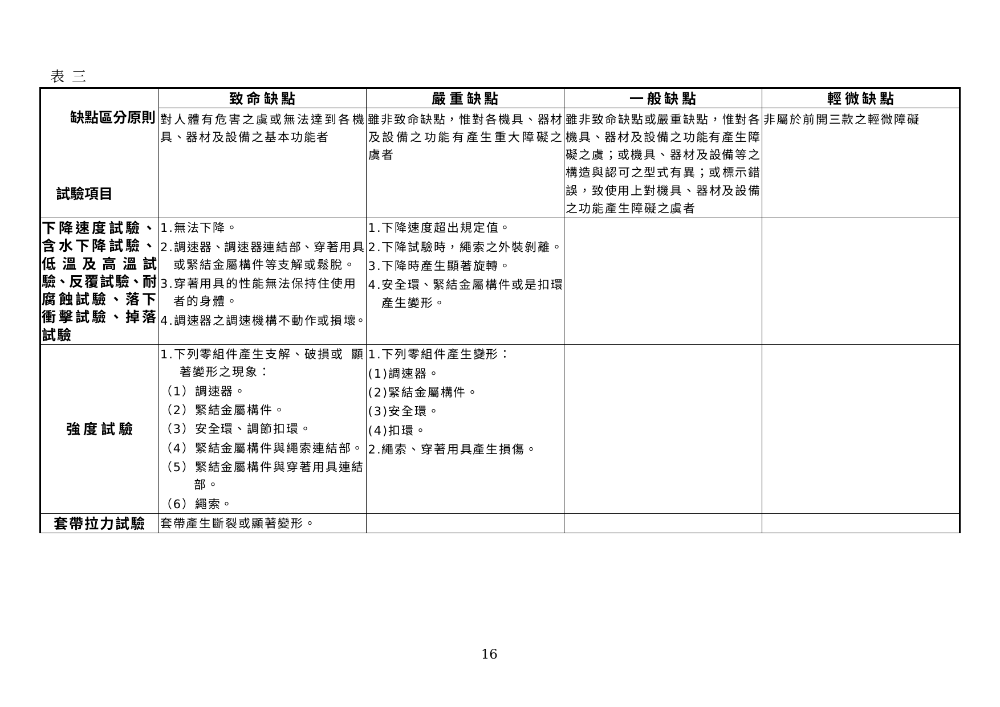
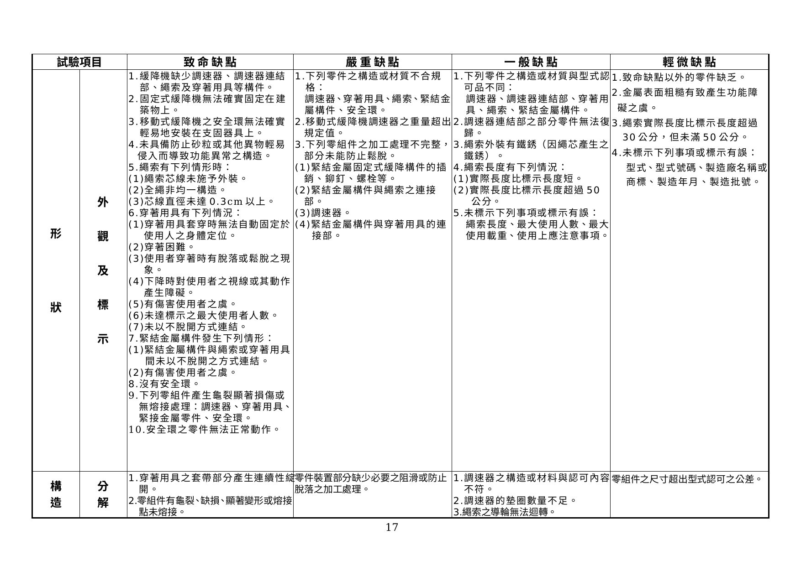

# 緩降機認可基準

> 來源：內政部消防署｜版本日期：96 年 11 月 30 日內授消字第 0960826026 號令修正發布
>
> ⚠️ **法規快照**：本檔為入庫當下之版本，引用前請依 index.md「法規時效」核對官方現行版本。
>
> 📌 **免責聲明**：本檔內容部分為 PDF／影像 OCR 與人工整理之結果，可能有辨識誤差。**一切以主管機關（內政部消防署）公告之現行版本為準**；如有疑義，以官方公告為主。後續 AI 代理人引用本檔時應主動提醒使用者此點，並於必要時自行上網查證正確版本。
>
> 🛈 本檔由原始 DOC（WordDocument stream，UTF-16LE）擷取並人工整理。依三層表格原則：散文與簡單數值表、AQL 抽樣表已內嵌 markdown；缺點判定表（表三）以原始 DOC 轉檔截圖嵌入原文位置；紀錄表（表單）僅附文末原始檔連結。係數式以 LaTeX 呈現。

---

## 壹、技術規範及試驗方法

有關避難逃生設備所使用之緩降機，其構造、性能、材質等技術上之規範及試驗方法，應符合本基準之規定。

### 一、用語定義

（一）緩降機：係指具有使用者不須藉助他力，僅利用本身重量即能自動連續交替下降之構造。

（二）固定式緩降機：係指平常即保持固定於支固器具上之緩降機。

（三）移動式緩降機：係指調速器之重量在 10 kg 以下，於使用時方以安全扣環確實安裝在支固器具上之緩降機。

（四）調速器：係指可以調整緩降機下降速度於一定範圍內之裝置。

（五）調速器連結部：係指連結支固器具與調速器的部分。

（六）穿著用具：係指套穿於使用者身上，以一端之套帶套穿所形成之套圈固定使用者身體之用具。

（七）緊結金屬構件：係指連結繩索及穿著用具的部分。

（八）捲盤：捲收繩索及套帶之用具。

（九）最大使用人數：每一次下降能供使用之最多人數，且應具有最大使用人數之穿著用具數量。

### 二、構造及性能

#### （一）組成

應由調速器、調速器連結部、繩索、緊結金屬構件及穿著用具等所組成。

#### （二）調速器

1. 應堅固並具有耐久性。
2. 無須經常拆開清理亦能正常運作。
3. 下降時所發生之熱量，不得使其他功能產生異常。
4. 下降時不得損傷繩索。
5. 應具備牢固護蓋保護機件，以避免砂粒或其他異物侵入致產生功能異常。

#### （三）調速器連結部

調速器之連結不得在使用中發生支解損傷、變形或調速器脫落等現象。

#### （四）繩索

1. 芯線應施予外裝，全繩為均勻構造；芯線直徑並應在 0.3 cm 以上。
2. 實施下降動作時不得有讓使用者遭致旋轉扭絞之情形。
3. 繩索之兩端應以不脫開之方法連結在緊結金屬構件。

#### （五）緊結金屬構件

使用中不得有脫離、支解、損傷或變形之情形，且不得有傷害使用者之虞。

#### （六）穿著用具

1. 能輕易穿著，套穿時不須經由手或身體操作調整，即可藉自身之體重確實固定於使用者之身體。
2. 穿著時不得有脫落或鬆脫之情形。
3. 下降時不得對使用者之視線或其動作產生障礙。
4. 不得有傷害使用者之虞。
5. 於繩索之兩端應具備以不會脫開之方法連結相當於最大使用人數之穿著用具。
6. 套帶部分之縫織線不得有鬆脫之情形。
7. 套帶以相當於最大使用載重除以最大使用人數，再乘以 6.5（係數）所得之拉力載重加載持續 5 分鐘後，不得產生斷裂或明顯之變形現象。

### 三、材質

緩降機各部構造所用材質應符合下表（表一）之規定。

#### 表一　構件材質表

| 零件名稱 | 材質標準 |
|---|---|
| 繩索（芯料） | CNS 941（鋼纜總則）之規定且有耐蝕加工者。 |
| 繩索（外裝） | CNS 6378（棉紗）之 A 級規定且有結實構造。 |
| 穿著用具 | CNS 6378 之 A 級品且具有三重編織者或具有同等強度之尼龍絲。 |
| 調速器連結部 | CNS 2473（一般結構用軋鋼料）且有耐蝕加工者。 |
| 緊結金屬構件 | CNS 2473（一般結構用軋鋼料）且有耐蝕加工者。 |
| 鉚釘 | CNS 575（鉚釘用鋼棒）且有耐蝕加工者。〔如施以穿梭壓夾法則不在此限〕 |

### 四、最大使用載重

緩降機之最大使用載重，應在最大使用人數乘以 1000 nt 所得數值以上：

$$最大使用載重 \geq 最大使用人數 \times 1000\ \text{nt}$$

### 五、試驗溫度條件

試驗時之周圍環境應在攝氏 10 度以上，35 度以下。

### 六、下降速度試驗

將緩降機固定在該繩索最長使用限度之高處（如繩索長度超過 15 m 者則以 15 m 之高度為準），進行下列試驗：

#### （一）常溫下降試驗

施予最大使用人數分別乘以 250 nt 及 650 nt 之載重，及以相當於最大使用載重之負載等三種載重，左右交互加載且左右連續各下降一次時，其速度應在 **16 cm/sec 以上 150 cm/sec 以下**之範圍內。

#### （二）20 次連續下降試驗

施予相當於最大使用人數乘以 650 nt 之載重，左右交互加載且左右連續各下降 10 次之下降速度，任一次均應在 20 次之平均下降速度值之 **80﹪以上 120﹪以下**，且不得發生性能及構造上之異常現象。

### 七、含水下降試驗

#### （一）浸水處理

將繩索一端拉緊至另一端繩索之緊結金屬構件頂住調速器後，露在調速器外面的繩索全部浸泡在水中，1 小時之後取出，含水後不得將水擦乾，直接進行試驗。

#### （二）下降試驗

直接將緩降機固定於試驗高度，並於穿著用具之一端依壹、六、（二）規定之載重，左右交互加載且左右連續各下降一次時，其下降速度值，應在壹、六、（二）所定平均下降速度值之 80﹪以上 120﹪以下範圍內，且不得發生性能及構造上之異常現象。

### 八、低溫試驗及高溫試驗

（一）緩降機分別放置在攝氏零下 20 度及 50 度之狀態 24 小時後，立即取出固定於試驗高度位置，並於穿著用具之一端依壹、六、（一）規定之載重，左右交互加載且左右連續各下降一次時，其下降速度值應在壹、六、（一）所規定之速度範圍值內，並不得發生性能及構造上之異常現象。

（二）由於本項試驗係於含水下降試驗後進行，故應使繩索自然乾燥後再進行低溫試驗，以避免水份在調速器內部產生凍結現象。

### 九、反覆試驗

（一）緩降機固定於試驗高度位置，於穿著用具之一端以相當於最大使用載重之負載，左右各互加載且連續各下降 10 次〔繩索長度超過 15 m 者，為繩索之長度除以 15 所得值再乘以 10 之乘積值（小數點第一位以下之尾數捨去不計）〕做為 1 個週期，反覆實施 5 個週期後，再以壹、六、（一）規定之載重，左右交互加載且左右連續各下降一次時，其下降速度值應在壹、六、（一）所規定之速度範圍值內，且不得發生性能及構造上之異常現象。

（二）在繩索不產生異常的情況下，試驗超過 50 次者，得於進行下一週期之試驗前更換繩索。

### 十、耐腐蝕試驗

（一）緩降機依 CNS 8886（鹽水設備試驗方法）之規定進行鹽水噴霧時，須將緩降機處於安裝狀態下噴撒。自然乾燥應於室內，使緩降機處於安裝狀態下進行。

（二）依前項規定，以 5﹪鹽水噴霧 8 小時後靜置 16 小時，為 1 週期，反覆實施 5 週期後，使其自然乾燥 24 小時，再將該緩降機固定於試驗高度位置，並於穿著用具之一端依壹、六、（一）規定之載重，左右交互加載且左右連續各下降一次時，其下降速度值應在壹、六、（一）所規定之速度範圍值內，且不得發生性能及構造上之異常現象。

### 十一、落下衝擊緩降試驗

（一）緩降機固定於距離地板面 2 m 以上（以不撞到地面為原則）之高度進行試驗。

（二）由緩降機調速器之下降側拉出繩索 25 cm，向上提高，並於穿著用具之一端加載相當於最大使用載重之負載使其落下，反覆實施 5 次後，再將緩降機固定於試驗高度位置，於穿著用具之一端依壹、六、（一）規定之載重，左右交互加載且左右連續各下降一次時，其下降速度值應在壹、六、（一）所規定之速度範圍值內，且不得發生性能及構造上之異常現象。

### 十二、掉落試驗

（一）移動式緩降機之調速器由地板上 1.5 m 高度（指調速器下端至地板面之距離），向厚度 5 cm 以上之 RC 地板使其自然落下，反覆實施 5 次後，再將緩降機固定於試驗高度位置，於穿著用具之一端依壹、六、（一）規定之載重，左右交互加載且連續左右各下降一次時，其下降速度值應在壹、六、（一）所規定之速度範圍值內，且不得發生性能及構造上之異常現象。

（二）試驗時，應先將穿著用具及繩索移開，避免造成操作上之妨礙。

### 十三、強度試驗

以最大使用載重除以最大使用人數乘以 3.9（係數）所得數值之靜載重實施加載試驗持續 5 分鐘後，應符合下列各項規定：

$$靜載重 = \frac{最大使用載重}{最大使用人數} \times 3.9$$

（一）調速器、調速器之連結部及其緊結金屬構件等不得有支解、破損或顯著之變形現象。

（二）繩索及穿著用具不得有斷裂或破損之現象。

### 十四、套帶拉力試驗

於強度試驗後，自穿著用具切取一段套帶，並以最大使用載重除以最大使用人數乘以 6.5（係數）所得數值之靜載重實施加載，持續 5 分鐘（注意勿使受力不均），不得發生斷裂或顯著之變形現象。

$$靜載重 = \frac{最大使用載重}{最大使用人數} \times 6.5$$

### 十五、形狀及構造檢查

（一）外觀檢查：原則以目視方式為之，除於上揭試驗項目中檢查外，並對其內部零件之形狀進行確認。

（二）分解檢查：將試樣分解後與設計圖面進行比對，檢查其尺寸是否與圖面相符，尺寸公差及圖形繪製等是否正確。

（三）標示：緩降機應在該機上明顯處以不易磨滅之方法，詳實標示下列事項。

1. 型式。
2. 型號。
3. 製造年月。
4. 製造批號。
5. 繩索長度。
6. 最大使用載重。
7. 最大使用人數。
8. 製造廠名稱或商標。
9. 使用上應注意事項。

---

## 貳、型式認可作業

### 一、型式試驗之方法

依本認可基準壹、技術規範及試驗方法之規定，樣品數 3 個，其試驗項目及順序如下：

下降速度試驗 → 含水下降試驗 → 低溫試驗、高溫試驗 → 反覆試驗 → 耐腐蝕試驗 → 落下衝擊緩降試驗 → 掉落試驗 → 強度試驗（1. 調速器 2. 調速器連結部 3. 緊結金屬構件 4. 繩索 5. 穿著用具）→ 套帶拉力試驗 → 形狀及構造檢查（1. 外觀及標示檢查 2. 分解檢查）。

### 二、型式試驗結果之判定

（一）符合本認可基準所規定之技術規範時，該型式試驗結果為「合格」。

（二）符合下揭三、（一）所定事項者，得進行補正試驗一次。

（三）未達到本認可基準所規定之技術規範時，該型式試驗結果為「不合格」。

### 三、補正試驗

（一）型式試驗中之不良事項，如為本認可基準肆、缺點判定表所列之一般缺點或輕微缺點者，得進行補正試驗。

（二）補正試驗所需樣品數 3 個，並準依前述型式試驗之方法進行。

### 四、型式變更試驗之方法

型式變更之樣品數、試驗流程等，應就型式變更之內容依前述型式試驗方法進行。

### 五、試驗紀錄

有關上述試驗之結果，應詳細填載於試驗紀錄表上（如附表七及附表七之一）。

---

## 參、個別認可作業

### 一、個別認可之抽樣方法

個別認可時之抽樣試驗數量依附表一至附表四抽樣表規定，抽樣方法依 CNS 9042 規定取樣。

### 二、個別認可之試驗項目

（一）個別認可依試驗項目區分為一般樣品之試驗（以下稱「一般試驗」）及分項樣品之試驗（以下稱「分項試驗」），一般試驗與分項試驗之試樣應為不同之樣品。

（二）一般試驗及分項試驗之試驗項目及試驗順序如下表（表二）所示。

#### 表二　個別認可試驗項目

| 區分 | 試驗項目 | 備考 |
|---|---|---|
| 一般試驗 | 形狀及構造檢查（外觀及標示檢查）；下降速度試驗（依本基準壹、六、（一）） | 樣品數：依據附表一至附表四之各式試驗抽樣表抽取。 |
| 分項試驗 | 下降速度試驗（依壹、六、（二））；含水下降試驗（依壹、六）；強度試驗（（1）調速器 （2）調速器連結部 （3）緊結金屬構件 （4）繩索 （5）穿著用具）；套帶拉力試驗（依壹、十三）；形狀及構造檢查（分解檢查） | 同上 |

### 三、個別認可試驗結果紀錄表

如附表八。

### 四、批次之認定

個別認可中之受驗批次認定如下：

（一）受驗品按不同受驗廠商，依其調速器之調速方式（如齒輪式、油壓式）及試驗等級之區分，將同一種接受試驗之製品列為同一批次。

（二）新產品與已受驗之型式間，如符合下列情形之一者，自第一次受驗開始即可視為同一批次：

1. 經型式變更者。
2. 變更之內容在型式變更範圍內，且經過型式變更認可者。
3. 受驗品相同但申請者不同者。

（三）新產品與已受驗型式之調速方式相同，惟兩者僅最大使用載重、最大使用人數、繩索材質或構造不同，分屬為不同批次時，如經過連續 10 次普通試驗，且均於第一次即合格者，得列入已受試驗合格之批次。

（四）試驗結果應依批次分別填寫在個別認可試驗結果記錄表中。

（五）申請者不得指定將某部分產品列為同一批次。

### 五、缺點之分級及合格判定基準

依下列規定區分缺點及合格判定基準（AQL）。

（一）試驗中發現之缺點，其嚴重程度依「消防機具器材及設備認可作業要點」規定，區分為致命缺點、嚴重缺點、一般缺點及輕微缺點等四級。

（二）各試驗項目之缺點內容，依肆、缺點之區分規定，非屬該判定方法所列範圍內之缺點者，依前項要點分級原則判定之。

### 六、批次合格之判定

批次合格與否，依抽樣表，按下列規定判定之：

（一）抽樣試驗中，各級不良品數均在合格判定個數以下時，應依參、八所示之試驗寬嚴程度為條件更換其試驗等級，該批視為合格。

（二）抽樣試驗中任一級之不良品數在不合格判定個數以上時，該批次視為不合格。該不良品之缺點僅為輕微缺點時，得進行補正試驗一次。

（三）抽樣試驗中出現致命缺點之不良品時，即使該抽樣試驗中不良品數在合格判定個數以下，該批次仍視為不合格。

### 七、個別認可結果之處置

（一）合格批次之處置

1. 當批雖經判定為合格，但受驗樣品中如發現有不良品時，應使用預備品替換或修復之後視為合格品。
2. 即使為非受驗之樣品，如於整批受驗製品中發現有缺點者，準依前款之規定。
3. 上述 1、2 款兩種情形，如無預備品替換或無法修復調整者，應就其不良品部分之個數，判定為不合格。

（二）補正批次之處置

1. 接受補正試驗時，應提出第一次試驗時所發現不良事項之改善說明書及不良品處理之補正試驗用廠內試驗紀錄表（如附表七之一）。
2. 補正試驗之受驗數以第一次試驗之受驗數為準。但該批製品經補正試驗合格，經依參、七、（一）、1. 之處置後，其未達受驗數之部分個數，則視為不合格。

（三）不合格批次之處置

1. 不合格批次之產品接受再試驗時，應提出第一次試驗時所發現不良事項之改善說明書及不良品處理之補正試驗用廠內試驗紀錄表。
2. 接受再試驗時不得加入第一次受驗製品以外之製品。
3. 個別認可不合格之批次不再受驗時，應依補正試驗用廠內試驗紀錄表之樣式，註明理由、廢棄處理及下批之改善處理等文件，向認可機構提出。

### 八、試驗等級之調整

試驗等級以普通試驗為標準，並依下列順序進行轉換：

1. **普通 → 寬鬆**：適用普通試驗者，符合下列所有條件時，下一次試驗可轉換為寬鬆試驗。
   - （1）最近連續 10 批次接受普通試驗，第一次試驗均合格者。
   - （2）最近連續 10 批次中，抽樣之不良品總數在附表六之寬鬆試驗界限數以下者。
   - （3）生產穩定者（每 4 個月內至少申請一次個別認可）。
2. **寬鬆 → 普通**：適用寬鬆試驗者，如有下列情形之一時，下次試驗應轉換為普通試驗。
   - （1）任一批次於第一次試驗即不合格。
   - （2）受檢間隔超過 6 個月以上，生產呈現不穩定時。
3. **普通 → 嚴格**：適用普通試驗者，如有下列情形之一，於下一次試驗應轉換為嚴格試驗。
   - （1）第一次試驗時該批次為不合格，且將該批次連同前 4 批次連續共 5 批次之不良品總數累計，如達附表五所示嚴格試驗之界限數以上者。
   - （2）第一次試驗時，因致命缺點而不合格者。
4. **嚴格 → 最嚴格**：適用嚴格試驗者，第一次試驗中不合格批次數累計達 3 批次時，應對申請者提出改善措施之勸導，並中止試驗；勸導後經確認業者已有品質改善措施時，下批次之試驗以最嚴格試驗進行。
5. **最嚴格 → 嚴格**：適用最嚴格試驗者，連續五批次之第一次試驗即合格，則下次試驗得轉換成嚴格試驗。
6. **嚴格 → 普通**：適用嚴格試驗者，連續五批次之第一次試驗即合格，則下次試驗得轉換成普通試驗。

（二）有關補正試驗及再受驗批次之試驗分等，第一次試驗為寬鬆試驗者，以普通試驗為之；第一次試驗為普通試驗者，以嚴格試驗試驗之；第一次試驗為嚴格試驗者，以最嚴格試驗為之。再受試驗批次之試驗結果，不得計入試驗寬鬆度轉換紀錄中。

### 九、下一批次試驗之限制

個別認可中有關某型式之批次於下次進行之個別試驗時，應以該批次之個別認可終了，且依該個別認可之結果所為之處置完成後，始得施行下次之個別認可。

### 十、試驗之特例

（一）有下列情形時，得在受理個別認可申請書前，逕依預定之試驗日程施驗（但須在確認產品之個別認可申請書受理後，始判定其合格與否）：

1. 第一次試驗因嚴重缺點或一般缺點不合格者。
2. 不需更換全部產品或部分產品，即可容易選取、去除申請數量中之不良品或修正者。

（二）少量進口產品得免施分項試驗：

1. 符合下列各項情形之進口產品，得於下一批次產品送驗時免施分項試驗：（1）第一次試驗連續三批以上均合格，且數量累計達 50 個以上。（2）經國外第三公證機構認證通過者。
2. 免施分項試驗之少量進口產品，其年度累計總數應為 50 個以下，超過 50 個者，該批次即應實施個別認可之分項試驗。
3. 得免施分項試驗者，如有下列情形之一時，該批樣品應即實施個別認可分項試驗：（1）所提申請資料有變造或偽造者。（2）經檢舉並查證產品品質有異常者。
4. 申請免施分項試驗應檢附下列資料：（1）產品進口報單。（2）國外第三公證機構認可（證）標示。（3）出廠測試相關證明文件。

### 十一、試驗設備發生故障時之處置

試驗開始後因試驗設備發生故障或其他原因致無法立即修復，經確認當日無法完成試驗時，得中止該試驗。並俟接獲試驗設備完成改善之通知後，重新排定時間，依下列規定對該批製品施行試驗：

（一）試驗之抽樣標準與第一次試驗時相同。

（二）該試驗之補正試驗，不得適用參、六、（二）但書之規定，即無法再進行補正試驗。

---

## 肆、缺點之區分（缺點判定表）

有關各項試驗所發現之不良情形，其缺點之等級及內容依「表三　缺點區分原則」之規定，分為致命缺點、嚴重缺點、一般缺點及輕微缺點四級，涵蓋下降速度／含水／低溫高溫／反覆／耐腐蝕／落下衝擊／掉落試驗、強度試驗、套帶拉力試驗、形狀外觀及標示、構造分解等項目。

> 📷 截自原始 DOC 轉檔（LibreOffice→PDF）第 19～20 頁（內文頁 15～16）。重點門檻摘錄：
> - 四級定義：致命＝對人體有危害之虞或無法達基本功能；嚴重＝對功能有重大障礙之虞；一般＝對功能有障礙之虞、或構造與認可型式有異、或標示錯誤致功能障礙之虞；輕微＝前三款以外之輕微障礙。
> - 下降速度類試驗：無法下降／調速器等支解鬆脫／穿著用具無法保持身體／調速機構不動作 ＝致命缺點；下降速度超出規定值／外裝剝離／顯著旋轉／緊結金屬構件變形 ＝嚴重缺點。
> - 標示：繩索實際長度比標示短超過 50 公分 ＝嚴重；超過 30 公分未滿 50 公分 ＝一般。

---

## 伍、主要試驗設備

#### 表四　主要試驗設備

| 試驗儀器名稱 | 用途 | 規格 | 數量 |
|---|---|---|---|
| 測量尺寸之儀器（游標卡尺、直尺、捲尺等） | 測量零組件之尺寸 | 游標卡尺：精密度 0.1 mm、測量範圍 0~150 mm；直尺：精密度 1 mm、測量範圍 150 以上；捲尺：精密度 5 mm、測量範圍 0~20 m | 1 組 |
| 碼錶（計時器） | 測量時間用 | 1 分計，附計算功能，精密度 1/5 秒 | 1 個以上 |
| 放大鏡 | 觀測零組件用 | 倍率約 5 | 1 個 |
| 計算機 | 計算數據資料用 | 8 位數以上 | 1 個 |
| 強度試驗裝置 | 實施繩索、穿著用具、調速器、緊結金屬構件等拉力強度之試驗 | 承受之最大拉力需在設計之最大使用荷重量 ÷ 最大使用人數 × 6.5 之值以上，並可持續 5 min 以上 | 1 組 |
| 下降試驗裝置 | 實施下降速度試驗 | 下降有效高度 15 m 以上之場所 | 1 組 |
| 鹽水噴霧試驗裝置 | 耐腐蝕試驗使用 | 依據 CNS 8886 規定 | 1 組 |
| 恆溫設備 | 低溫試驗及高溫試驗用 | 可將溫度控制在 -20℃（±2℃）低溫及 +50℃（±2℃）高溫之裝置 | 1 組 |
| 法碼 | 下降速度試驗增加載重用 | 法碼質量應配合壹、技術規範及試驗方法需求，並應符合度量衡器施檢規範要求之公差。 | 1 組 |

---

## 附表

> 抽樣表（附表一～四）及界限數（附表五、六）已內嵌如下。**型式試驗紀錄表（附表七、七之一）、個別認可試驗結果紀錄表（附表八）屬空白表單，僅附文末原始檔連結。**
>
> Ac：合格判定個數；Re：不合格判定個數。空白處沿用抽樣表箭頭指示之抽樣方式。

### 附表一　普通試驗抽樣表

| 批量 | 一般 樣品數 | 嚴重 Ac/Re | 一般 Ac/Re | 輕微 Ac/Re | 分項 樣品數 | 分項嚴重 Ac/Re | 分項一般 Ac/Re | 分項輕微 Ac/Re |
|---|---|---|---|---|---|---|---|---|
| 1〜8 | 2 | | | | | | | |
| 9〜15 | 2 | | | | | | | |
| 16〜25 | 3 | | 0/1 | | | | | |
| 26〜50 | 5 | | | | | | | |
| 51〜90 | 5 | | | 1/2 | | | | |
| 91〜150 | 8 | | 2/3 | | 1 | 0/1 | 0/1 | 0/1 |
| 151〜280 | 13 | | 1/2 | 3/4 | | | | |
| 281〜500 | 20 | 0/1 | 2/3 | 5/6 | 2 | 0/1 | 0/1 | 0/1 |
| 501〜1200 | 32 | | 3/4 | 7/8 | | | | |
| 1201〜3200 | 50 | | 5/6 | 10/11 | | | | |
| 3201〜10000 | 80 | 1/2 | 7/8 | 14/15 | 3 | 0/1 | 0/1 | 1/2 |
| 10001〜35000 | 125 | 2/3 | 10/11 | 21/22 | | | | |

### 附表二　寬鬆試驗抽樣表

| 批量 | 一般 樣品數 | 嚴重 Ac/Re | 一般 Ac/Re | 輕微 Ac/Re | 分項 樣品數 | 分項嚴重 Ac/Re | 分項一般 Ac/Re | 分項輕微 Ac/Re |
|---|---|---|---|---|---|---|---|---|
| 1〜8 | 2 | | | | | | | |
| 9〜15 | 2 | | | | | | | |
| 16〜25 | 2 | | 0/2 | | | | | |
| 26〜50 | 2 | | | | | | | |
| 51〜90 | 2 | | | 1/2 | | | | |
| 91〜150 | 3 | | 1/3 | | | | | |
| 151〜280 | 5 | | 1/2 | 2/4 | | | | |
| 281〜500 | 8 | 0/1 | 1/3 | 2/5 | 1 | 0/1 | 0/1 | 0/2 |
| 501〜1200 | 13 | | 2/4 | 3/6 | | | | |
| 1201〜3200 | 20 | | 2/5 | 5/8 | | | | |
| 3201〜10000 | 32 | 1/2 | 3/6 | 7/10 | | | | |
| 10001〜35000 | 50 | 1/3 | 5/8 | 10/13 | 2 | 0/1 | 0/1 | 1/2 |

### 附表三　嚴格試驗抽樣表

| 批量 | 一般 樣品數 | 嚴重 Ac/Re | 一般 Ac/Re | 輕微 Ac/Re | 分項 樣品數 | 分項嚴重 Ac/Re | 分項一般 Ac/Re | 分項輕微 Ac/Re |
|---|---|---|---|---|---|---|---|---|
| 1〜8 | 2 | | | | | | | |
| 9〜15 | 2 | | | | | | | |
| 16〜25 | 3 | | | | 1 | 0/1 | 0/1 | 0/1 |
| 26〜50 | 5 | | | | | | | |
| 51〜90 | 5 | | 0/1 | | | | | |
| 91〜150 | 8 | | | 1/2 | 2 | 0/1 | 0/1 | 0/1 |
| 151〜280 | 13 | | | 2/3 | | | | |
| 281〜500 | 20 | | 1/2 | 3/4 | 3 | 0/1 | 0/1 | 1/2 |
| 501〜1200 | 32 | 0/1 | 2/3 | 5/6 | | | | |
| 1201〜3200 | 50 | | 3/4 | 8/9 | | | | |
| 3201〜10000 | 80 | | 5/6 | 12/13 | | | | |
| 10001〜35000 | 125 | 1/2 | 8/9 | 18/19 | 5 | 0/1 | 0/1 | 1/2 |

### 附表四　最嚴格試驗抽樣表

| 批量 | 一般 樣品數 | 嚴重 Ac/Re | 一般 Ac/Re | 輕微 Ac/Re | 分項 樣品數 | 分項嚴重 Ac/Re | 分項一般 Ac/Re | 分項輕微 Ac/Re |
|---|---|---|---|---|---|---|---|---|
| 1〜8 | 2 | | | | | | | |
| 9〜15 | 2 | | | | | | | |
| 16〜25 | 3 | | | 0/1 | 2 | 0/1 | 0/1 | 0/1 |
| 26〜50 | 5 | | | | | | | |
| 51〜90 | 5 | | | | | | | |
| 91〜150 | 8 | | 0/1 | | 3 | 0/1 | 0/1 | 1/2 |
| 151〜280 | 13 | | | 1/2 | | | | |
| 281〜500 | 20 | | | 2/3 | 5 | 0/1 | 0/1 | 1/2 |
| 501〜1200 | 32 | | 1/2 | 3/4 | | | | |
| 1201〜3200 | 50 | 0/1 | 2/3 | 5/6 | | | | |
| 3201〜10000 | 80 | | 3/4 | 8/9 | 8 | 0/1 | 1/2 | 2/3 |
| 10001〜35000 | 125 | | 5/6 | 12/13 | | | | |
| 35001〜150000 | 200 | 1/2 | 8/9 | | | | | |

### 附表五　嚴格試驗之界限數

| 累計樣品數 | 嚴重缺點 | 一般缺點 | 輕微缺點 |
|---|---|---|---|
| 1 | 2 | 2 | 2 |
| 2 | 2 | 2 | 3 |
| 3 | 2 | 3 | 3 |
| 4 | 2 | 3 | 4 |
| 5 | 2 | 3 | 4 |
| 6〜7 | 2 | 3 | 4 |
| 8〜9 | 2 | 3 | 5 |
| 10〜12 | 2 | 4 | 5 |
| 13〜14 | 2 | 4 | 6 |
| 15〜19 | 2 | 4 | 7 |
| 20〜24 | 3 | 5 | 7 |
| 25〜29 | 3 | 5 | 8 |
| 30〜39 | 3 | 6 | 10 |
| 40〜49 | 3 | 7 | 11 |
| 50〜64 | 3 | 7 | 13 |
| 65〜79 | 4 | 8 | 15 |
| 80〜99 | 4 | 10 | 17 |
| 100〜129 | 4 | 11 | 20 |
| 130〜159 | 5 | 13 | 24 |
| 160〜199 | 5 | 15 | 28 |
| 200〜249 | 6 | 17 | 33 |
| 250〜319 | 7 | 20 | 40 |
| 320〜399 | 7 | 24 | 48 |
| 400〜499 | 8 | 28 | 60 |
| 500〜624 | 10 | 33 | 76 |
| 625〜799 | 11 | 40 | 95 |

### 附表六　寬鬆試驗之界限數

> ＊表示樣品累計數未達轉換成寬鬆試驗之充分條件。本表適用於最近連續 10 批次接受普通試驗，均於第一次試驗時就合格者之樣品數累計。

| 累計樣品數 | 嚴重缺點 | 一般缺點 | 輕微缺點 |
|---|---|---|---|
| 10〜64 | ＊ | ＊ | ＊ |
| 65〜79 | ＊ | ＊ | 0 |
| 80〜99 | ＊ | ＊ | 1 |
| 100〜129 | ＊ | ＊ | 2 |
| 130〜159 | ＊ | ＊ | 4 |
| 160〜199 | ＊ | 0 | 6 |
| 200〜249 | ＊ | 1 | 9 |
| 250〜319 | ＊ | 2 | 12 |
| 320〜399 | ＊ | 4 | 15 |
| 400〜499 | ＊ | 6 | 19 |
| 500〜624 | ＊ | 9 | 25 |
| 625〜799 | ＊ | 12 | 31 |
| 800〜999 | ＊ | 15 | 39 |
| 1000〜1249 | 0 | 19 | 50 |
| 1250〜1574 | 1 | 25 | 63 |

---

## 附表／附圖（附件）

- 缺點判定表（表三）已以原始 DOC 轉檔截圖嵌入本文相應位置；型式試驗紀錄表（附表七、七之一）、個別認可試驗結果紀錄表（附表八）等請對照原始檔：
- 📎 [緩降機認可基準.DOC](../附件/緩降機認可基準/緩降機認可基準.DOC)
