# 附件三 消防圖說圖示範例（圖例對照表）

> 來源：消防機關辦理建築物消防安全設備審查及查驗作業基準 附件三（原始檔：[附件三：消防圖說圖示範例.PDF](附件三：消防圖說圖示範例.PDF)）
>
> 📌 **免責聲明**：本表之圖例為原 PDF 300dpi 逐格裁切影像，名稱由影像辨識轉寫；原檔錯漏字經使用者確認後已更正，並於備註保留修改痕跡（原檔誤作「…」，已更正）。一切以主管機關（內政部消防署）公告之現行版本為準。

## 用途與使用方式（給出題 agent）

消防圖說圖例雖未在命題大綱明列，但屬考題來源（識圖題）。出題方式建議：

1. **看圖答名**：呈現圖例圖檔，問設備名稱（可搭配所屬設備類別提示）。
2. **依名選圖**：給設備名稱，從同類別相似圖例中選正確者（同類別內符號相似度高，適合做選項）。
3. **加註規則**：數個類別備註欄訂有加註規則（滅火器藥劑、揚聲器等級／W 數、標示燈等級、住警器 R 等），本身即為考點。

機器可讀索引：[`附件三_圖例_index.json`](附件三_圖例_index.json)，可用 `jq` 隨機抽題，例如：`jq '.categories[].items[]' 附件三_圖例_index.json`。
同一符號（底閥、制水閥、逆止閥、防震軟管等）依原檔重複列於多個系統，出題時脈絡不同，未去重。

## 1. 滅火器

| 圖例 | 名稱 | 備註 |
|------|------|------|
| 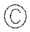 | 乾粉滅火器 |  |
|  | 大型滅火器 |  |
| 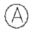 | 懸掛式自動滅火器 |  |

> **加註規則（原檔備註）**：滅火器可以依不同藥劑在圖例旁邊加註說明。例：滅火器圖例加註 F 表示泡沫滅火器、加註 C 表示二氧化碳滅火器、加註 S 表示強化液滅火器、加註 W 表示水滅火器。

## 2. 室內（外）消防栓設備

| 圖例 | 名稱 | 備註 |
|------|------|------|
| 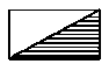 | 室內消防栓 |  |
| 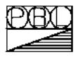 | 綜合消防栓箱 |  |
| 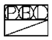 | 綜合消防栓箱（含連結送水管出水口） |  |
|  | 綜合消防栓箱（含緊急電話、緊急電源插座） |  |
| 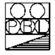 | 綜合消防栓箱（含緊急電源插座） |  |
| 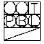 | 綜合消防栓箱（含緊急電話、緊急電源插座、連結送水管出水口） |  |
| 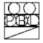 | 綜合消防栓箱（含緊急電話插座、連結送水管出水口） |  |
| 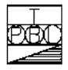 | 綜合消防栓箱（含緊急電話） |  |
| 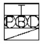 | 綜合消防栓箱（含緊急電話箱、連結送水管出水口） |  |
| 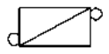 | 室外消防栓 |  |
| 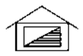 | 消防水帶箱（防雨型） |  |
| 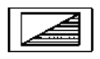 | 消防水帶箱 |  |
| 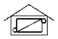 | 室外消防栓含消防水帶箱（防雨型） | 原檔誤作「放雨型」，已更正為「防雨型」 |
| 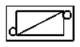 | 室外消防栓含消防水帶箱 |  |
| 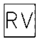 | 減壓閥（可調壓式消防栓） |  |
| 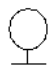 | 測試用出水口 |  |
| 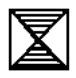 | 壓力調整閥 |  |
| 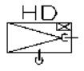 | 消防幫浦 |  |
| 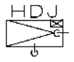 | 消防輔助幫浦 |  |
| 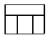 | 底閥 |  |
| 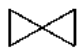 | 制水閥 |  |
| 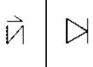 | 逆止閥 |  |
| 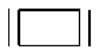 | 防震軟管 |  |

## 3. 自動撒水設備

| 圖例 | 名稱 | 備註 |
|------|------|------|
| 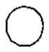 | 密閉式撒水頭（向下型） |  |
|  | 密閉式撒水頭（向上型） |  |
|  | 密閉式撒水頭（高溫用） |  |
| 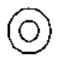 | 撒水頭（開放式） |  |
| 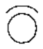 | 撒水頭（附防護板） | 🔴 原檔紅字（較新修正處） |
| 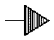 | 撒水頭（側壁式） |  |
| 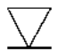 | 撒水頭（開放式）（昇位圖用） | 原檔誤作「開方式」，已更正為「開放式」 |
| 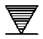 | 撒水頭（昇位圖用） |  |
| 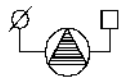 | 自動警報逆止閥 |  |
| 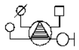 | 自動警報逆止閥（濕式） |  |
|  | 水流警報器 |  |
| 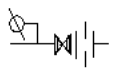 | 末端查驗閥 |  |
| 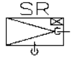 | 自動撒水幫浦 |  |
| 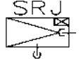 | 自動撒水輔助幫浦 |  |
| 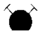 | 自動撒水送水口 |  |
| 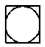 | 幫浦啟動開關 |  |
| 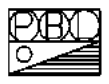 | 綜合輔助撒水栓箱 |  |
| 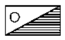 | 輔助撒水栓箱 |  |
| 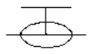 | 一齊開放閥 |  |
|  | 手動啟動裝置（開放式自動撒水設備） |  |
|  | 測試閥 |  |
| 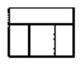 | 底閥 |  |
| 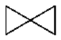 | 止水閥 |  |
| 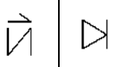 | 逆止閥 |  |
|  | 防震軟管 |  |

## 4. 水霧滅火設備

| 圖例 | 名稱 | 備註 |
|------|------|------|
|  | 水霧噴頭 |  |
|  | 感知撒水頭 |  |
| 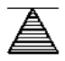 | 感知撒水頭（昇位圖用） |  |
|  | 水霧手動啟動裝置 |  |
|  | 自動警報逆止閥 |  |
| 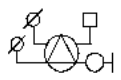 | 自動警報逆止閥（昇位圖用） |  |
|  | 水流警報器 |  |
|  | 一齊開放閥 |  |
|  | 測試閥 |  |
| 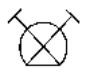 | 水霧用送水口 |  |
| 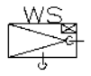 | 水霧幫浦 |  |
| 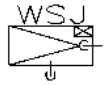 | 水霧輔助幫浦 |  |
| 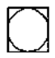 | 幫浦啟動開關 |  |
| 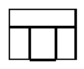 | 底閥 |  |
|  | 制水閥 |  |
|  | 逆止閥 |  |
|  | 防震軟管 |  |
|  | Y型過濾器 |  |

## 5. 泡沫滅火設備

| 圖例 | 名稱 | 備註 |
|------|------|------|
|  | 泡沫噴頭 |  |
|  | 泡沫頭（側噴式） |  |
|  | 感知撒水頭 |  |
|  | 感知撒水頭（昇位圖用） |  |
|  | 自動警報逆止閥 |  |
|  | 自動警報逆止閥（昇位圖用） |  |
|  | 水流警報器 |  |
|  | 手動啟動裝置 |  |
|  | 一齊開放閥 |  |
|  | 測試閥 |  |
|  | 比例混合器 |  |
|  | 泡沫原液槽 |  |
|  | 電磁閥 |  |
|  | 一齊開放閥組（昇位圖及立體圖用） |  |
|  | 泡沫幫浦 |  |
|  | 泡沫輔助幫浦 |  |
|  | 幫浦啟動開關 |  |
|  | 移動式綜合泡沫消防栓箱（防雨型） |  |
|  | 移動式綜合泡沫消防栓箱 |  |
|  | 移動式泡沫消防栓箱（防雨型） |  |
|  | 移動式泡沫消防栓箱 |  |
|  | 輔助泡沫消防栓箱（防雨型） |  |
|  | 輔助泡沫消防栓箱 |  |
|  | 泡沫放出口 |  |
|  | 底閥 |  |
|  | 制水閥 |  |
|  | 逆止閥 |  |
|  | 防震軟管 |  |
|  | Y型過濾器 |  |

## 6. 二氧化碳滅火設備

| 圖例 | 名稱 | 備註 |
|------|------|------|
|  | CO2控制盤 |  |
|  | CO2噴頭（崁頂式） |  |
|  | CO2噴頭（吸頂式） |  |
|  | CO2噴頭（側噴式） | 原檔誤作「測噴式」，已更正為「側噴式」 |
|  | CO2放射表示燈 |  |
|  | CO2放射表示燈（防水型） |  |
|  | CO2手動啟動裝置 |  |
|  | CO2手動啟動裝置（防水型） |  |
|  | 壓力開關 |  |
|  | CO2啟動用氣體容器附電磁閥 |  |
|  | 選擇閥 |  |
|  | 選擇閥固定架 |  |
|  | 安全裝置 |  |
|  | 啟動用電磁閥 |  |
|  | 壓力開關 |  |
|  | 閉止閥 |  |
|  | 逆止閥 |  |
|  | CO2氣體容器 |  |
|  | CO2排風機手動啟動裝置 |  |

## 7. 乾粉（海龍替代品）滅火設備

| 圖例 | 名稱 | 備註 |
|------|------|------|
|  | 乾粉（海龍替代品）套裝型（含控制盤） |  |
|  | 乾粉（海龍替代品）套裝型 |  |
|  | 乾粉（海龍替代品）控制盤 |  |
|  | 乾粉（海龍替代品）噴頭（崁頂式） |  |
|  | 乾粉（海龍替代品）噴頭（吸頂式） |  |
|  | 乾粉（海龍替代品）噴頭（喇叭式） |  |
|  | 乾粉（海龍替代品）放射表示燈 |  |
|  | 乾粉（海龍替代品）放射表示燈（防水型） |  |
|  | 乾粉（海龍替代品）手動啟動裝置 |  |
|  | 乾粉（海龍替代品）手動啟動裝置（防水型） |  |
|  | 壓力開關 |  |
|  | 乾粉（海龍替代品）啟動用氣體容器附電磁閥 |  |
|  | 選擇閥 |  |
|  | 選擇閥固定架 |  |
|  | 安全裝置 |  |
|  | 啟動用電磁閥 |  |
|  | 壓力開關 |  |
|  | 閉止閥 |  |
|  | 逆止閥 |  |
|  | 乾粉（海龍替代品）氣體容器 |  |

> **加註規則（原檔備註）**：乾粉或海龍替代圖例可依不同藥劑在圖例旁加註說明或以圖說說明。例：控制盤圖例上方加註 FM200 表示 FM200 控制盤。

## 8. 簡易自動滅火設備

| 圖例 | 名稱 | 備註 |
|------|------|------|
|  | 簡易自動滅火設備 | 🔴 原檔紅字（較新修正處） |

## 9. 火警自動警報設備

| 圖例 | 名稱 | 備註 |
|------|------|------|
|  | 火警受信總機 |  |
|  | 火警受信副機 | 原檔誤作「授信」，已更正為「受信」 |
|  | 差動式局限型探測器（1種） |  |
|  | 差動式局限型探測器（2種） |  |
|  | 差動式局限型探測器（1種、定址式） |  |
|  | 差動式局限型探測器（2種、定址式） |  |
|  | 差動式分佈型探測器（2種） |  |
|  | 定溫式局限型探測器（特種） |  |
|  | 定溫式局限型探測器（1種） |  |
|  | 定溫式局限型探測器（特種、定址式） |  |
|  | 定溫式局限型探測器（1種、定址式） |  |
|  | 定溫式局限型探測器（特種、防水型） |  |
|  | 定溫式局限型探測器（1種、防水型） |  |
|  | 定溫式局限型探測器（特種、定址式、防水型） |  |
|  | 定溫式局限型探測器（1種、定址式、防水型） |  |
|  | 偵煙式局限型探測器（1種） |  |
|  | 偵煙式局限型探測器（2種） |  |
|  | 偵煙式局限型探測器（3種） |  |
|  | 偵煙式局限型探測器（1種、定址式） |  |
|  | 偵煙式局限型探測器（2種、定址式） |  |
|  | 偵煙式局限型探測器（3種、定址式） |  |
|  | 偵煙式局限型探測器（2種）（管道間用、附壁掛型檢點箱） | 原檔頓號誤植作「管道間、用附壁掛型檢點箱」，已更正 |
|  | 偵煙式局限型探測器（2種）（定址式）（管道間用、附壁掛型檢點箱） | 原檔頓號誤植作「管道間、用附壁掛型檢點箱」，已更正 |
|  | 光電式分離型探測器（送光部） |  |
|  | 光電式分離型探測器（受光部） |  |
|  | 光電式分離型探測器（定址式、送光部） |  |
|  | 光電式分離型探測器（定址式、受光部） |  |
|  | 試驗器（光電式分離型探測器用） |  |
|  | 補償式侷限型探測器（1種） |  |
|  | 補償式侷限型探測器（2種） |  |
|  | 補償式侷限型探測器（1種、防水型） |  |
|  | 補償式侷限型探測器（2種、防水型） |  |
|  | 補償式侷限型探測器（1種、定址式、防水型） |  |
|  | 補償式侷限型探測器（2種、定址式、防水型） |  |
|  | 火焰式探測器 |  |
|  | 熱煙複合式探測器 |  |
|  | 火警室外表示燈 |  |
|  | 緊急電源裝置盤 |  |
|  | 中文圖控顯示幕 |  |
|  | 中繼器 |  |
|  | 火警型中繼器 |  |
|  | 監控、控制型中繼器 | 備註：排煙、撒水、泡沫 |
|  | 電鈴型中繼器 |  |
|  | 移報型中繼器 |  |
|  | 信號隔離型中繼器 |  |
|  | 信號轉換型中繼器 |  |
|  | 定址型接點監視中繼器 |  |
|  | 定址型控制中繼器 |  |
|  | 分散型中繼器控制盤 |  |
|  | 終端電阻 |  |
|  | 手動警報機 |  |
|  | 火警警鈴 |  |
|  | 標示燈 |  |
|  | 火警綜合盤 |  |
|  | 差動式分布型空氣管 |  |
|  | 消防啟動箱 |  |
|  | 幫浦警示 |  |
|  | 幫浦啟動開關 |  |

> **加註規則（原檔備註）**：住宅用火災警報器可在探測器旁加註 R。例：定溫式局限型探測器旁加註 R 表示定溫式住警器；偵煙式局限型探測器旁加註 R 表示偵煙式住警器（原檔此句誤印作「表示定溫式住警器」，已更正）。

## 10. 緊急廣播設備

| 圖例 | 名稱 | 備註 |
|------|------|------|
|  | 緊急廣播主機 |  |
|  | 緊急電話主機 |  |
|  | 緊急電話子機 |  |
|  | 緊急電話子機附收容箱 |  |
|  | 揚聲器（嵌頂式） |  |
|  | 揚聲器（吸頂式） |  |
|  | 揚聲器（壁掛式） |  |
|  | 揚聲器（號角式） |  |
|  | 音量調整器 |  |

> **加註規則（原檔備註）**：(1) 揚聲器如有使用不同等級時，可在圖例旁邊加註 L.M.S 文字（原檔誤作「圖利旁」，已更正為「圖例旁」）。例：揚聲器圖例加註 L 表示 L 級、加註 M 表示 M 級、加註 S 表示 S 級。(2) 揚聲器及音量控制器有使用不同 W 數時，可在圖例旁加註 W 數。例：加註 1W、3W、6W、30W。

## 11. 瓦斯漏氣火警自動警報設備

| 圖例 | 名稱 | 備註 |
|------|------|------|
|  | 瓦斯漏氣檢知器（吸頂式） |  |
|  | 瓦斯漏氣檢知器（壁掛式） |  |
|  | 瓦斯漏氣檢知型中繼器 |  |
|  | 瓦斯漏氣受信總機 |  |
|  | 瓦斯漏氣表示燈 | 🔴 原檔紅字（較新修正處） |
|  | 瓦斯漏氣表示燈（防水型） | 🔴 原檔紅字（較新修正處） |

## 12. 一一九火災通報裝置

| 圖例 | 名稱 | 備註 |
|------|------|------|
|  | 一一九火災通報裝置 | 🔴 原檔紅字（較新修正處） |
|  | 一一九火災通報裝置專用電話機 | 🔴 原檔紅字（較新修正處） |

## 13. 避難逃生設備

| 圖例 | 名稱 | 備註 |
|------|------|------|
|  | 出口標示燈 |  |
|  | 避難方向指標（出口用） |  |
|  | 避難方向指示燈（單面單向） |  |
|  | 避難方向指示燈（雙面單向） |  |
|  | 避難方向指示燈（單面雙向） |  |
|  | 避難方向指示燈（雙面雙向） |  |
|  | 避難方向指示燈（單面單向、埋入型） |  |
|  | 避難方向指示燈（雙面單向、地板型） |  |
|  | 避難方向指示燈（單面雙向、埋入型） | 原檔誤作「埋入行」，已更正為「埋入型」 |
|  | 避難方向指示燈（雙面雙向、地板型） |  |
|  | 避難方向指標（單向） |  |
|  | 避難方向指標（雙向） |  |
|  | 避難器具設置位置標示牌 |  |
|  | 避難器具指標（入口用） |  |
|  | 避難器具指標（單向） |  |
|  | 避難器具指標（雙向） |  |
|  | 避難器具設置位置標示燈 |  |
|  | 避難器具指示燈（單面單向） |  |
|  | 避難器具指示燈（雙面單向） |  |
|  | 避難器具指示燈（單面雙向） |  |
|  | 避難器具指示燈（雙面雙向） |  |
|  | 救助袋（直降式） |  |
|  | 救助袋（斜降式） |  |
|  | 緩降機 |  |
|  | 避難梯 |  |
|  | 避難梯（出口） |  |

> **加註規則（原檔備註）**：標示設備如有使用不同等級時，可在圖例旁加註 A.B.C 文字（原檔誤作「S.M.L」，已更正；原檔所附紅字範例即為 A、B、C 級，與現行出口標示燈及避難方向指示燈認可基準之等級相符）。例：出口標示燈圖例加註 A 表示 A 級、加註 B 表示 B 級、加註 C 表示 C 級。

## 14. 緊急照明設備

| 圖例 | 名稱 | 備註 |
|------|------|------|
|  | 緊急照明燈（嵌頂式） |  |
|  | 緊急照明燈（吸頂式） |  |
|  | 緊急照明燈（壁掛式） |  |
|  | 緊急照明燈兼樓梯避難方向指示燈 |  |

> **加註規則（原檔備註）**：緊急照明燈如有使用不同 W 數時，可在圖例旁加註 W 數（原檔誤作「圖利旁」，已更正為「圖例旁」）。例：加註 13W 表示 13W、加註 27W 表示 27W。

## 15. 消防搶救上之必要設備

| 圖例 | 名稱 | 備註 |
|------|------|------|
|  | 綜合消防栓箱（含連結送水管出水口） |  |
|  | 綜合消防栓箱（含緊急電話、緊急電源插座、連結送水管出水口） |  |
|  | 綜合消防栓箱（含緊急電源插座、連結送水管出水口） |  |
|  | 綜合消防栓（含緊急電源插座、連結送水管出水口） |  |
|  | 連結送水管出水口箱（單口型） |  |
|  | 連結送水管出水口箱（雙口型） |  |
|  | 消防水帶箱（含連結送水管出水口） |  |
|  | 消防水帶箱 |  |
|  | 連結送水管出水口 |  |
|  | 採水口 |  |
|  | 採水幫浦 |  |
|  | 採水輔助幫浦 |  |
|  | 緊急電源插座 |  |
|  | 防火鐵捲門控制切換器 | 原檔誤作「防火鐵捲門控制控制切換器」（「控制」重複），已更正 |
|  | 防火門扣 |  |
|  | 蜂鳴器 |  |
|  | 防火鐵捲門連動控制盤 |  |
|  | 幫浦啟動開關 |  |
|  | 底閥 |  |
|  | 止水閥 |  |
|  | 逆止閥 |  |
|  | 防震軟管 |  |

## 16. 排煙設備

| 圖例 | 名稱 | 備註 |
|------|------|------|
|  | 排煙口（天花板型） |  |
|  | 排煙口（側壁型） |  |
|  | 進風口 |  |
|  | 防火閘門（排煙閘門） |  |
|  | 防煙防火閘門（排煙閘門） | 原檔誤作「防火防火閘門」，已更正為「防煙防火閘門」 |
|  | 手動開關裝置 |  |
|  | 排煙機（平面圖用） |  |
|  | 排煙機控制盤 |  |
|  | 排煙機（昇位圖用） |  |
|  | 活動式防煙壁控制切換器 |  |
|  | 防煙壁 |  |

## 17. 無線電通信輔助設備

| 圖例 | 名稱 | 備註 |
|------|------|------|
|  | 屋外型端子箱 |  |
|  | 屋內型端子箱 |  |
|  | 4混合器 |  |
|  | 3分配器 |  |
|  | 2分配器 |  |
|  | 2分配器（不等分配） |  |
|  | 天線 |  |
|  | 洩波同軸電纜 |  |
